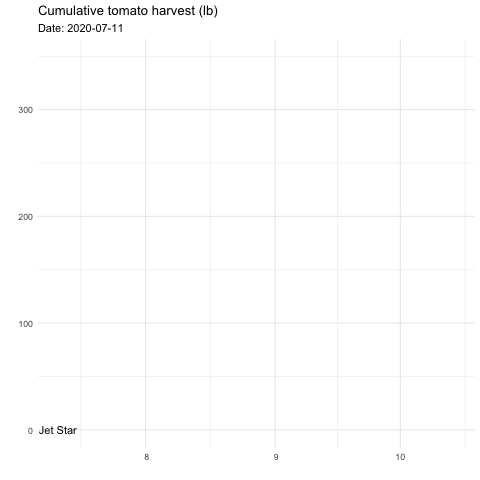
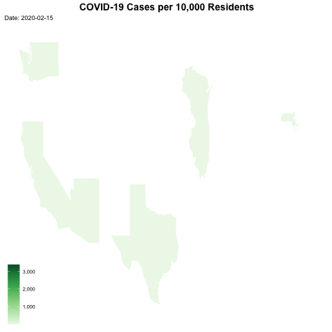

```r
library(tidyverse)     
```

```
## ── Attaching packages ─────────────────────────────────────── tidyverse 1.3.1 ──
```

```
## ✓ ggplot2 3.3.5     ✓ purrr   0.3.4
## ✓ tibble  3.1.6     ✓ dplyr   1.0.8
## ✓ tidyr   1.2.0     ✓ stringr 1.4.0
## ✓ readr   2.0.1     ✓ forcats 0.5.1
```

```
## Warning: 程辑包'tidyr'是用R版本4.1.2 来建造的
```

```
## Warning: 程辑包'dplyr'是用R版本4.1.2 来建造的
```

```
## ── Conflicts ────────────────────────────────────────── tidyverse_conflicts() ──
## x dplyr::filter() masks stats::filter()
## x dplyr::lag()    masks stats::lag()
```

```r
library(gardenR)      
library(lubridate)     
```

```
## 
## 载入程辑包：'lubridate'
```

```
## The following objects are masked from 'package:base':
## 
##     date, intersect, setdiff, union
```

```r
library(openintro)     
```

```
## Warning: 程辑包'openintro'是用R版本4.1.2 来建造的
```

```
## 载入需要的程辑包：airports
```

```
## 载入需要的程辑包：cherryblossom
```

```
## 载入需要的程辑包：usdata
```

```r
library(palmerpenguins)
library(maps)         
```

```
## 
## 载入程辑包：'maps'
```

```
## The following object is masked from 'package:purrr':
## 
##     map
```

```r
library(ggmap)        
```

```
## Google's Terms of Service: https://cloud.google.com/maps-platform/terms/.
```

```
## Please cite ggmap if you use it! See citation("ggmap") for details.
```

```r
library(gplots)        
```

```
## 
## 载入程辑包：'gplots'
```

```
## The following object is masked from 'package:stats':
## 
##     lowess
```

```r
library(RColorBrewer)  
library(sf)            
```

```
## Linking to GEOS 3.8.1, GDAL 3.2.1, PROJ 7.2.1; sf_use_s2() is TRUE
```

```r
library(leaflet)       
library(ggthemes)      
library(plotly)       
```

```
## 
## 载入程辑包：'plotly'
```

```
## The following object is masked from 'package:ggmap':
## 
##     wind
```

```
## The following object is masked from 'package:ggplot2':
## 
##     last_plot
```

```
## The following object is masked from 'package:stats':
## 
##     filter
```

```
## The following object is masked from 'package:graphics':
## 
##     layout
```

```r
library(gganimate)     
library(transformr)    
```

```
## 
## 载入程辑包：'transformr'
```

```
## The following object is masked from 'package:sf':
## 
##     st_normalize
```

```r
library(gifski)       
library(shiny)        
library(ggimage)
```

```
## 
## 载入程辑包：'ggimage'
```

```
## The following object is masked from 'package:ggmap':
## 
##     theme_nothing
```

```r
library(babynames)
```

```
## 
## 载入程辑包：'babynames'
```

```
## The following object is masked from 'package:openintro':
## 
##     births
```

```r
theme_set(theme_minimal())
```


```r
small_trains <- read_csv("https://raw.githubusercontent.com/rfordatascience/tidytuesday/master/data/2019/2019-02-26/small_trains.csv") 
```

```
## Rows: 32772 Columns: 13── Column specification ────────────────────────────────────────────────────────
## Delimiter: ","
## chr (4): service, departure_station, arrival_station, delay_cause
## dbl (9): year, month, journey_time_avg, total_num_trips, avg_delay_all_depar...
## ℹ Use `spec()` to retrieve the full column specification for this data.
## ℹ Specify the column types or set `show_col_types = FALSE` to quiet this message.
```

```r
data("garden_harvest")
mallorca_bike_day7 <- read_csv("https://www.dropbox.com/s/zc6jan4ltmjtvy0/mallorca_bike_day7.csv?dl=1") %>% 
  select(1:4, speed)
```

```
## Rows: 3210 Columns: 11── Column specification ────────────────────────────────────────────────────────
## Delimiter: ","
## dbl  (8): lon, lat, ele, extensions, ele.num, time_hr, dist_km, speed
## dttm (2): time, hrminsec
## date (1): date
## ℹ Use `spec()` to retrieve the full column specification for this data.
## ℹ Specify the column types or set `show_col_types = FALSE` to quiet this message.
```

```r
panama_swim <- read_csv("https://raw.githubusercontent.com/llendway/gps-data/master/data/panama_swim_20160131.csv")
```

```
## Rows: 36 Columns: 8── Column specification ────────────────────────────────────────────────────────
## Delimiter: ","
## chr  (1): event
## dbl  (3): lon, lat, extensions
## lgl  (1): ele
## dttm (2): time, hrminsec
## date (1): date
## ℹ Use `spec()` to retrieve the full column specification for this data.
## ℹ Specify the column types or set `show_col_types = FALSE` to quiet this message.
```

```r
panama_bike <- read_csv("https://raw.githubusercontent.com/llendway/gps-data/master/data/panama_bike_20160131.csv")
```

```
## Rows: 7924 Columns: 8── Column specification ────────────────────────────────────────────────────────
## Delimiter: ","
## chr  (1): event
## dbl  (4): lon, lat, ele, extensions
## dttm (2): time, hrminsec
## date (1): date
## ℹ Use `spec()` to retrieve the full column specification for this data.
## ℹ Specify the column types or set `show_col_types = FALSE` to quiet this message.
```

```r
panama_run <- read_csv("https://raw.githubusercontent.com/llendway/gps-data/master/data/panama_run_20160131.csv")
```

```
## Rows: 1111 Columns: 8── Column specification ────────────────────────────────────────────────────────
## Delimiter: ","
## chr  (1): event
## dbl  (4): lon, lat, ele, extensions
## dttm (2): time, hrminsec
## date (1): date
## ℹ Use `spec()` to retrieve the full column specification for this data.
## ℹ Specify the column types or set `show_col_types = FALSE` to quiet this message.
```

```r
covid19 <- read_csv("https://raw.githubusercontent.com/nytimes/covid-19-data/master/us-states.csv")
```

```
## Rows: 41894 Columns: 5── Column specification ────────────────────────────────────────────────────────
## Delimiter: ","
## chr  (2): state, fips
## dbl  (2): cases, deaths
## date (1): date
## ℹ Use `spec()` to retrieve the full column specification for this data.
## ℹ Specify the column types or set `show_col_types = FALSE` to quiet this message.
```

## Put your homework on GitHub!

Go [here](https://github.com/llendway/github_for_collaboration/blob/master/github_for_collaboration.md) or to previous homework to remind yourself how to get set up. 

Once your repository is created, you should always open your **project** rather than just opening an .Rmd file. You can do that by either clicking on the .Rproj file in your repository folder on your computer. Or, by going to the upper right hand corner in R Studio and clicking the arrow next to where it says Project: (None). You should see your project come up in that list if you've used it recently. You could also go to File --> Open Project and navigate to your .Rproj file. 

## Instructions

* Put your name at the top of the document. 

* **For ALL graphs, you should include appropriate labels and alt text.** 

* Feel free to change the default theme, which I currently have set to `theme_minimal()`. 

* Use good coding practice. Read the short sections on good code with [pipes](https://style.tidyverse.org/pipes.html) and [ggplot2](https://style.tidyverse.org/ggplot2.html). **This is part of your grade!**

* **NEW!!** With animated graphs, add `eval=FALSE` to the code chunk that creates the animation and saves it using `anim_save()`. Add another code chunk to reread the gif back into the file. See the [tutorial](https://animation-and-interactivity-in-r.netlify.app/) for help. 

* When you are finished with ALL the exercises, uncomment the options at the top so your document looks nicer. Don't do it before then, or else you might miss some important warnings and messages.

## Warm-up exercises from tutorial

  1. Choose 2 graphs you have created for ANY assignment in this class and add interactivity using the `ggplotly()` function.
  

```r
babynames %>% 
  group_by(sex, year) %>% 
  mutate(has2000 = n > 2000)
```

<div data-pagedtable="false">
  <script data-pagedtable-source type="application/json">
{"columns":[{"label":["year"],"name":[1],"type":["dbl"],"align":["right"]},{"label":["sex"],"name":[2],"type":["chr"],"align":["left"]},{"label":["name"],"name":[3],"type":["chr"],"align":["left"]},{"label":["n"],"name":[4],"type":["int"],"align":["right"]},{"label":["prop"],"name":[5],"type":["dbl"],"align":["right"]},{"label":["has2000"],"name":[6],"type":["lgl"],"align":["right"]}],"data":[{"1":"1880","2":"F","3":"Mary","4":"7065","5":"0.07238359","6":"TRUE"},{"1":"1880","2":"F","3":"Anna","4":"2604","5":"0.02667896","6":"TRUE"},{"1":"1880","2":"F","3":"Emma","4":"2003","5":"0.02052149","6":"TRUE"},{"1":"1880","2":"F","3":"Elizabeth","4":"1939","5":"0.01986579","6":"FALSE"},{"1":"1880","2":"F","3":"Minnie","4":"1746","5":"0.01788843","6":"FALSE"},{"1":"1880","2":"F","3":"Margaret","4":"1578","5":"0.01616720","6":"FALSE"},{"1":"1880","2":"F","3":"Ida","4":"1472","5":"0.01508119","6":"FALSE"},{"1":"1880","2":"F","3":"Alice","4":"1414","5":"0.01448696","6":"FALSE"},{"1":"1880","2":"F","3":"Bertha","4":"1320","5":"0.01352390","6":"FALSE"},{"1":"1880","2":"F","3":"Sarah","4":"1288","5":"0.01319605","6":"FALSE"},{"1":"1880","2":"F","3":"Annie","4":"1258","5":"0.01288868","6":"FALSE"},{"1":"1880","2":"F","3":"Clara","4":"1226","5":"0.01256083","6":"FALSE"},{"1":"1880","2":"F","3":"Ella","4":"1156","5":"0.01184366","6":"FALSE"},{"1":"1880","2":"F","3":"Florence","4":"1063","5":"0.01089084","6":"FALSE"},{"1":"1880","2":"F","3":"Cora","4":"1045","5":"0.01070642","6":"FALSE"},{"1":"1880","2":"F","3":"Martha","4":"1040","5":"0.01065519","6":"FALSE"},{"1":"1880","2":"F","3":"Laura","4":"1012","5":"0.01036832","6":"FALSE"},{"1":"1880","2":"F","3":"Nellie","4":"995","5":"0.01019415","6":"FALSE"},{"1":"1880","2":"F","3":"Grace","4":"982","5":"0.01006096","6":"FALSE"},{"1":"1880","2":"F","3":"Carrie","4":"949","5":"0.00972286","6":"FALSE"},{"1":"1880","2":"F","3":"Maude","4":"858","5":"0.00879053","6":"FALSE"},{"1":"1880","2":"F","3":"Mabel","4":"808","5":"0.00827826","6":"FALSE"},{"1":"1880","2":"F","3":"Bessie","4":"796","5":"0.00815532","6":"FALSE"},{"1":"1880","2":"F","3":"Jennie","4":"793","5":"0.00812458","6":"FALSE"},{"1":"1880","2":"F","3":"Gertrude","4":"787","5":"0.00806311","6":"FALSE"},{"1":"1880","2":"F","3":"Julia","4":"783","5":"0.00802213","6":"FALSE"},{"1":"1880","2":"F","3":"Hattie","4":"769","5":"0.00787869","6":"FALSE"},{"1":"1880","2":"F","3":"Edith","4":"768","5":"0.00786845","6":"FALSE"},{"1":"1880","2":"F","3":"Mattie","4":"704","5":"0.00721275","6":"FALSE"},{"1":"1880","2":"F","3":"Rose","4":"700","5":"0.00717176","6":"FALSE"},{"1":"1880","2":"F","3":"Catherine","4":"688","5":"0.00704882","6":"FALSE"},{"1":"1880","2":"F","3":"Lillian","4":"672","5":"0.00688489","6":"FALSE"},{"1":"1880","2":"F","3":"Ada","4":"652","5":"0.00667999","6":"FALSE"},{"1":"1880","2":"F","3":"Lillie","4":"647","5":"0.00662876","6":"FALSE"},{"1":"1880","2":"F","3":"Helen","4":"636","5":"0.00651606","6":"FALSE"},{"1":"1880","2":"F","3":"Jessie","4":"635","5":"0.00650581","6":"FALSE"},{"1":"1880","2":"F","3":"Louise","4":"635","5":"0.00650581","6":"FALSE"},{"1":"1880","2":"F","3":"Ethel","4":"633","5":"0.00648532","6":"FALSE"},{"1":"1880","2":"F","3":"Lula","4":"621","5":"0.00636238","6":"FALSE"},{"1":"1880","2":"F","3":"Myrtle","4":"615","5":"0.00630091","6":"FALSE"},{"1":"1880","2":"F","3":"Eva","4":"614","5":"0.00629066","6":"FALSE"},{"1":"1880","2":"F","3":"Frances","4":"605","5":"0.00619845","6":"FALSE"},{"1":"1880","2":"F","3":"Lena","4":"603","5":"0.00617796","6":"FALSE"},{"1":"1880","2":"F","3":"Lucy","4":"590","5":"0.00604477","6":"FALSE"},{"1":"1880","2":"F","3":"Edna","4":"588","5":"0.00602428","6":"FALSE"},{"1":"1880","2":"F","3":"Maggie","4":"582","5":"0.00596281","6":"FALSE"},{"1":"1880","2":"F","3":"Pearl","4":"569","5":"0.00582962","6":"FALSE"},{"1":"1880","2":"F","3":"Daisy","4":"564","5":"0.00577839","6":"FALSE"},{"1":"1880","2":"F","3":"Fannie","4":"560","5":"0.00573741","6":"FALSE"},{"1":"1880","2":"F","3":"Josephine","4":"544","5":"0.00557348","6":"FALSE"},{"1":"1880","2":"F","3":"Dora","4":"524","5":"0.00536858","6":"FALSE"},{"1":"1880","2":"F","3":"Rosa","4":"507","5":"0.00519441","6":"FALSE"},{"1":"1880","2":"F","3":"Katherine","4":"502","5":"0.00514318","6":"FALSE"},{"1":"1880","2":"F","3":"Agnes","4":"473","5":"0.00484606","6":"FALSE"},{"1":"1880","2":"F","3":"Marie","4":"471","5":"0.00482557","6":"FALSE"},{"1":"1880","2":"F","3":"Nora","4":"471","5":"0.00482557","6":"FALSE"},{"1":"1880","2":"F","3":"May","4":"462","5":"0.00473336","6":"FALSE"},{"1":"1880","2":"F","3":"Mamie","4":"436","5":"0.00446698","6":"FALSE"},{"1":"1880","2":"F","3":"Blanche","4":"427","5":"0.00437478","6":"FALSE"},{"1":"1880","2":"F","3":"Stella","4":"414","5":"0.00424159","6":"FALSE"},{"1":"1880","2":"F","3":"Ellen","4":"411","5":"0.00421085","6":"FALSE"},{"1":"1880","2":"F","3":"Nancy","4":"410","5":"0.00420060","6":"FALSE"},{"1":"1880","2":"F","3":"Effie","4":"406","5":"0.00415962","6":"FALSE"},{"1":"1880","2":"F","3":"Sallie","4":"404","5":"0.00413913","6":"FALSE"},{"1":"1880","2":"F","3":"Nettie","4":"403","5":"0.00412889","6":"FALSE"},{"1":"1880","2":"F","3":"Della","4":"391","5":"0.00400594","6":"FALSE"},{"1":"1880","2":"F","3":"Lizzie","4":"388","5":"0.00397521","6":"FALSE"},{"1":"1880","2":"F","3":"Flora","4":"365","5":"0.00373956","6":"FALSE"},{"1":"1880","2":"F","3":"Susie","4":"361","5":"0.00369858","6":"FALSE"},{"1":"1880","2":"F","3":"Maud","4":"345","5":"0.00353465","6":"FALSE"},{"1":"1880","2":"F","3":"Mae","4":"344","5":"0.00352441","6":"FALSE"},{"1":"1880","2":"F","3":"Etta","4":"323","5":"0.00330926","6":"FALSE"},{"1":"1880","2":"F","3":"Harriet","4":"319","5":"0.00326828","6":"FALSE"},{"1":"1880","2":"F","3":"Sadie","4":"317","5":"0.00324778","6":"FALSE"},{"1":"1880","2":"F","3":"Caroline","4":"306","5":"0.00313509","6":"FALSE"},{"1":"1880","2":"F","3":"Katie","4":"303","5":"0.00310435","6":"FALSE"},{"1":"1880","2":"F","3":"Lydia","4":"302","5":"0.00309410","6":"FALSE"},{"1":"1880","2":"F","3":"Elsie","4":"301","5":"0.00308386","6":"FALSE"},{"1":"1880","2":"F","3":"Kate","4":"299","5":"0.00306337","6":"FALSE"},{"1":"1880","2":"F","3":"Susan","4":"286","5":"0.00293018","6":"FALSE"},{"1":"1880","2":"F","3":"Mollie","4":"283","5":"0.00289944","6":"FALSE"},{"1":"1880","2":"F","3":"Alma","4":"277","5":"0.00283797","6":"FALSE"},{"1":"1880","2":"F","3":"Addie","4":"274","5":"0.00280723","6":"FALSE"},{"1":"1880","2":"F","3":"Georgia","4":"259","5":"0.00265355","6":"FALSE"},{"1":"1880","2":"F","3":"Eliza","4":"252","5":"0.00258183","6":"FALSE"},{"1":"1880","2":"F","3":"Lulu","4":"249","5":"0.00255110","6":"FALSE"},{"1":"1880","2":"F","3":"Nannie","4":"248","5":"0.00254085","6":"FALSE"},{"1":"1880","2":"F","3":"Lottie","4":"245","5":"0.00251012","6":"FALSE"},{"1":"1880","2":"F","3":"Amanda","4":"241","5":"0.00246914","6":"FALSE"},{"1":"1880","2":"F","3":"Belle","4":"238","5":"0.00243840","6":"FALSE"},{"1":"1880","2":"F","3":"Charlotte","4":"237","5":"0.00242815","6":"FALSE"},{"1":"1880","2":"F","3":"Rebecca","4":"236","5":"0.00241791","6":"FALSE"},{"1":"1880","2":"F","3":"Ruth","4":"234","5":"0.00239742","6":"FALSE"},{"1":"1880","2":"F","3":"Viola","4":"229","5":"0.00234619","6":"FALSE"},{"1":"1880","2":"F","3":"Olive","4":"224","5":"0.00229496","6":"FALSE"},{"1":"1880","2":"F","3":"Amelia","4":"221","5":"0.00226423","6":"FALSE"},{"1":"1880","2":"F","3":"Hannah","4":"221","5":"0.00226423","6":"FALSE"},{"1":"1880","2":"F","3":"Jane","4":"215","5":"0.00220276","6":"FALSE"},{"1":"1880","2":"F","3":"Virginia","4":"213","5":"0.00218227","6":"FALSE"},{"1":"1880","2":"F","3":"Emily","4":"210","5":"0.00215153","6":"FALSE"},{"1":"1880","2":"F","3":"Matilda","4":"210","5":"0.00215153","6":"FALSE"},{"1":"1880","2":"F","3":"Irene","4":"204","5":"0.00209006","6":"FALSE"},{"1":"1880","2":"F","3":"Kathryn","4":"204","5":"0.00209006","6":"FALSE"},{"1":"1880","2":"F","3":"Esther","4":"198","5":"0.00202858","6":"FALSE"},{"1":"1880","2":"F","3":"Willie","4":"192","5":"0.00196711","6":"FALSE"},{"1":"1880","2":"F","3":"Henrietta","4":"191","5":"0.00195687","6":"FALSE"},{"1":"1880","2":"F","3":"Ollie","4":"183","5":"0.00187490","6":"FALSE"},{"1":"1880","2":"F","3":"Amy","4":"167","5":"0.00171098","6":"FALSE"},{"1":"1880","2":"F","3":"Rachel","4":"166","5":"0.00170073","6":"FALSE"},{"1":"1880","2":"F","3":"Sara","4":"165","5":"0.00169049","6":"FALSE"},{"1":"1880","2":"F","3":"Estella","4":"162","5":"0.00165975","6":"FALSE"},{"1":"1880","2":"F","3":"Theresa","4":"153","5":"0.00156754","6":"FALSE"},{"1":"1880","2":"F","3":"Augusta","4":"151","5":"0.00154705","6":"FALSE"},{"1":"1880","2":"F","3":"Ora","4":"149","5":"0.00152656","6":"FALSE"},{"1":"1880","2":"F","3":"Pauline","4":"144","5":"0.00147533","6":"FALSE"},{"1":"1880","2":"F","3":"Josie","4":"141","5":"0.00144460","6":"FALSE"},{"1":"1880","2":"F","3":"Lola","4":"138","5":"0.00141386","6":"FALSE"},{"1":"1880","2":"F","3":"Sophia","4":"138","5":"0.00141386","6":"FALSE"},{"1":"1880","2":"F","3":"Leona","4":"137","5":"0.00140362","6":"FALSE"},{"1":"1880","2":"F","3":"Anne","4":"136","5":"0.00139337","6":"FALSE"},{"1":"1880","2":"F","3":"Mildred","4":"132","5":"0.00135239","6":"FALSE"},{"1":"1880","2":"F","3":"Ann","4":"131","5":"0.00134214","6":"FALSE"},{"1":"1880","2":"F","3":"Beulah","4":"131","5":"0.00134214","6":"FALSE"},{"1":"1880","2":"F","3":"Callie","4":"131","5":"0.00134214","6":"FALSE"},{"1":"1880","2":"F","3":"Lou","4":"131","5":"0.00134214","6":"FALSE"},{"1":"1880","2":"F","3":"Delia","4":"129","5":"0.00132165","6":"FALSE"},{"1":"1880","2":"F","3":"Eleanor","4":"129","5":"0.00132165","6":"FALSE"},{"1":"1880","2":"F","3":"Barbara","4":"127","5":"0.00130116","6":"FALSE"},{"1":"1880","2":"F","3":"Iva","4":"127","5":"0.00130116","6":"FALSE"},{"1":"1880","2":"F","3":"Louisa","4":"126","5":"0.00129092","6":"FALSE"},{"1":"1880","2":"F","3":"Maria","4":"125","5":"0.00128067","6":"FALSE"},{"1":"1880","2":"F","3":"Mayme","4":"124","5":"0.00127043","6":"FALSE"},{"1":"1880","2":"F","3":"Evelyn","4":"122","5":"0.00124994","6":"FALSE"},{"1":"1880","2":"F","3":"Estelle","4":"119","5":"0.00121920","6":"FALSE"},{"1":"1880","2":"F","3":"Nina","4":"119","5":"0.00121920","6":"FALSE"},{"1":"1880","2":"F","3":"Betty","4":"117","5":"0.00119871","6":"FALSE"},{"1":"1880","2":"F","3":"Marion","4":"115","5":"0.00117822","6":"FALSE"},{"1":"1880","2":"F","3":"Bettie","4":"113","5":"0.00115773","6":"FALSE"},{"1":"1880","2":"F","3":"Dorothy","4":"112","5":"0.00114748","6":"FALSE"},{"1":"1880","2":"F","3":"Luella","4":"111","5":"0.00113724","6":"FALSE"},{"1":"1880","2":"F","3":"Inez","4":"106","5":"0.00108601","6":"FALSE"},{"1":"1880","2":"F","3":"Lela","4":"106","5":"0.00108601","6":"FALSE"},{"1":"1880","2":"F","3":"Rosie","4":"106","5":"0.00108601","6":"FALSE"},{"1":"1880","2":"F","3":"Allie","4":"105","5":"0.00107576","6":"FALSE"},{"1":"1880","2":"F","3":"Millie","4":"105","5":"0.00107576","6":"FALSE"},{"1":"1880","2":"F","3":"Janie","4":"96","5":"0.00098356","6":"FALSE"},{"1":"1880","2":"F","3":"Cornelia","4":"94","5":"0.00096307","6":"FALSE"},{"1":"1880","2":"F","3":"Victoria","4":"93","5":"0.00095282","6":"FALSE"},{"1":"1880","2":"F","3":"Ruby","4":"92","5":"0.00094257","6":"FALSE"},{"1":"1880","2":"F","3":"Winifred","4":"92","5":"0.00094257","6":"FALSE"},{"1":"1880","2":"F","3":"Alta","4":"91","5":"0.00093233","6":"FALSE"},{"1":"1880","2":"F","3":"Celia","4":"90","5":"0.00092208","6":"FALSE"},{"1":"1880","2":"F","3":"Christine","4":"89","5":"0.00091184","6":"FALSE"},{"1":"1880","2":"F","3":"Beatrice","4":"87","5":"0.00089135","6":"FALSE"},{"1":"1880","2":"F","3":"Birdie","4":"85","5":"0.00087086","6":"FALSE"},{"1":"1880","2":"F","3":"Harriett","4":"83","5":"0.00085037","6":"FALSE"},{"1":"1880","2":"F","3":"Mable","4":"83","5":"0.00085037","6":"FALSE"},{"1":"1880","2":"F","3":"Myra","4":"83","5":"0.00085037","6":"FALSE"},{"1":"1880","2":"F","3":"Sophie","4":"83","5":"0.00085037","6":"FALSE"},{"1":"1880","2":"F","3":"Tillie","4":"83","5":"0.00085037","6":"FALSE"},{"1":"1880","2":"F","3":"Isabel","4":"81","5":"0.00082988","6":"FALSE"},{"1":"1880","2":"F","3":"Sylvia","4":"81","5":"0.00082988","6":"FALSE"},{"1":"1880","2":"F","3":"Carolyn","4":"80","5":"0.00081963","6":"FALSE"},{"1":"1880","2":"F","3":"Isabelle","4":"80","5":"0.00081963","6":"FALSE"},{"1":"1880","2":"F","3":"Leila","4":"80","5":"0.00081963","6":"FALSE"},{"1":"1880","2":"F","3":"Sally","4":"80","5":"0.00081963","6":"FALSE"},{"1":"1880","2":"F","3":"Ina","4":"79","5":"0.00080938","6":"FALSE"},{"1":"1880","2":"F","3":"Essie","4":"78","5":"0.00079914","6":"FALSE"},{"1":"1880","2":"F","3":"Bertie","4":"77","5":"0.00078889","6":"FALSE"},{"1":"1880","2":"F","3":"Nell","4":"77","5":"0.00078889","6":"FALSE"},{"1":"1880","2":"F","3":"Alberta","4":"76","5":"0.00077865","6":"FALSE"},{"1":"1880","2":"F","3":"Katharine","4":"76","5":"0.00077865","6":"FALSE"},{"1":"1880","2":"F","3":"Lora","4":"74","5":"0.00075816","6":"FALSE"},{"1":"1880","2":"F","3":"Rena","4":"74","5":"0.00075816","6":"FALSE"},{"1":"1880","2":"F","3":"Mina","4":"73","5":"0.00074791","6":"FALSE"},{"1":"1880","2":"F","3":"Rhoda","4":"73","5":"0.00074791","6":"FALSE"},{"1":"1880","2":"F","3":"Mathilda","4":"72","5":"0.00073767","6":"FALSE"},{"1":"1880","2":"F","3":"Abbie","4":"71","5":"0.00072742","6":"FALSE"},{"1":"1880","2":"F","3":"Eula","4":"70","5":"0.00071718","6":"FALSE"},{"1":"1880","2":"F","3":"Dollie","4":"69","5":"0.00070693","6":"FALSE"},{"1":"1880","2":"F","3":"Hettie","4":"69","5":"0.00070693","6":"FALSE"},{"1":"1880","2":"F","3":"Eunice","4":"67","5":"0.00068644","6":"FALSE"},{"1":"1880","2":"F","3":"Fanny","4":"67","5":"0.00068644","6":"FALSE"},{"1":"1880","2":"F","3":"Ola","4":"67","5":"0.00068644","6":"FALSE"},{"1":"1880","2":"F","3":"Lenora","4":"66","5":"0.00067619","6":"FALSE"},{"1":"1880","2":"F","3":"Adelaide","4":"65","5":"0.00066595","6":"FALSE"},{"1":"1880","2":"F","3":"Christina","4":"65","5":"0.00066595","6":"FALSE"},{"1":"1880","2":"F","3":"Lelia","4":"65","5":"0.00066595","6":"FALSE"},{"1":"1880","2":"F","3":"Nelle","4":"65","5":"0.00066595","6":"FALSE"},{"1":"1880","2":"F","3":"Sue","4":"65","5":"0.00066595","6":"FALSE"},{"1":"1880","2":"F","3":"Johanna","4":"64","5":"0.00065570","6":"FALSE"},{"1":"1880","2":"F","3":"Lilly","4":"64","5":"0.00065570","6":"FALSE"},{"1":"1880","2":"F","3":"Lucinda","4":"63","5":"0.00064546","6":"FALSE"},{"1":"1880","2":"F","3":"Minerva","4":"63","5":"0.00064546","6":"FALSE"},{"1":"1880","2":"F","3":"Lettie","4":"62","5":"0.00063521","6":"FALSE"},{"1":"1880","2":"F","3":"Roxie","4":"62","5":"0.00063521","6":"FALSE"},{"1":"1880","2":"F","3":"Cynthia","4":"61","5":"0.00062497","6":"FALSE"},{"1":"1880","2":"F","3":"Helena","4":"60","5":"0.00061472","6":"FALSE"},{"1":"1880","2":"F","3":"Hilda","4":"60","5":"0.00061472","6":"FALSE"},{"1":"1880","2":"F","3":"Hulda","4":"60","5":"0.00061472","6":"FALSE"},{"1":"1880","2":"F","3":"Bernice","4":"59","5":"0.00060448","6":"FALSE"},{"1":"1880","2":"F","3":"Genevieve","4":"59","5":"0.00060448","6":"FALSE"},{"1":"1880","2":"F","3":"Jean","4":"59","5":"0.00060448","6":"FALSE"},{"1":"1880","2":"F","3":"Cordelia","4":"58","5":"0.00059423","6":"FALSE"},{"1":"1880","2":"F","3":"Marian","4":"56","5":"0.00057374","6":"FALSE"},{"1":"1880","2":"F","3":"Francis","4":"55","5":"0.00056350","6":"FALSE"},{"1":"1880","2":"F","3":"Jeanette","4":"55","5":"0.00056350","6":"FALSE"},{"1":"1880","2":"F","3":"Adeline","4":"54","5":"0.00055325","6":"FALSE"},{"1":"1880","2":"F","3":"Gussie","4":"54","5":"0.00055325","6":"FALSE"},{"1":"1880","2":"F","3":"Leah","4":"54","5":"0.00055325","6":"FALSE"},{"1":"1880","2":"F","3":"Lois","4":"53","5":"0.00054300","6":"FALSE"},{"1":"1880","2":"F","3":"Lura","4":"53","5":"0.00054300","6":"FALSE"},{"1":"1880","2":"F","3":"Mittie","4":"53","5":"0.00054300","6":"FALSE"},{"1":"1880","2":"F","3":"Hallie","4":"51","5":"0.00052251","6":"FALSE"},{"1":"1880","2":"F","3":"Isabella","4":"50","5":"0.00051227","6":"FALSE"},{"1":"1880","2":"F","3":"Olga","4":"50","5":"0.00051227","6":"FALSE"},{"1":"1880","2":"F","3":"Phoebe","4":"50","5":"0.00051227","6":"FALSE"},{"1":"1880","2":"F","3":"Teresa","4":"50","5":"0.00051227","6":"FALSE"},{"1":"1880","2":"F","3":"Hester","4":"49","5":"0.00050202","6":"FALSE"},{"1":"1880","2":"F","3":"Lida","4":"49","5":"0.00050202","6":"FALSE"},{"1":"1880","2":"F","3":"Lina","4":"49","5":"0.00050202","6":"FALSE"},{"1":"1880","2":"F","3":"Winnie","4":"49","5":"0.00050202","6":"FALSE"},{"1":"1880","2":"F","3":"Claudia","4":"48","5":"0.00049178","6":"FALSE"},{"1":"1880","2":"F","3":"Marguerite","4":"48","5":"0.00049178","6":"FALSE"},{"1":"1880","2":"F","3":"Vera","4":"48","5":"0.00049178","6":"FALSE"},{"1":"1880","2":"F","3":"Cecelia","4":"47","5":"0.00048153","6":"FALSE"},{"1":"1880","2":"F","3":"Bess","4":"46","5":"0.00047129","6":"FALSE"},{"1":"1880","2":"F","3":"Emilie","4":"46","5":"0.00047129","6":"FALSE"},{"1":"1880","2":"F","3":"John","4":"46","5":"0.00047129","6":"FALSE"},{"1":"1880","2":"F","3":"Rosetta","4":"46","5":"0.00047129","6":"FALSE"},{"1":"1880","2":"F","3":"Verna","4":"46","5":"0.00047129","6":"FALSE"},{"1":"1880","2":"F","3":"Myrtie","4":"45","5":"0.00046104","6":"FALSE"},{"1":"1880","2":"F","3":"Cecilia","4":"44","5":"0.00045080","6":"FALSE"},{"1":"1880","2":"F","3":"Elva","4":"44","5":"0.00045080","6":"FALSE"},{"1":"1880","2":"F","3":"Olivia","4":"44","5":"0.00045080","6":"FALSE"},{"1":"1880","2":"F","3":"Ophelia","4":"44","5":"0.00045080","6":"FALSE"},{"1":"1880","2":"F","3":"Georgie","4":"43","5":"0.00044055","6":"FALSE"},{"1":"1880","2":"F","3":"Elnora","4":"42","5":"0.00043031","6":"FALSE"},{"1":"1880","2":"F","3":"Violet","4":"42","5":"0.00043031","6":"FALSE"},{"1":"1880","2":"F","3":"Adele","4":"41","5":"0.00042006","6":"FALSE"},{"1":"1880","2":"F","3":"Lily","4":"41","5":"0.00042006","6":"FALSE"},{"1":"1880","2":"F","3":"Linnie","4":"41","5":"0.00042006","6":"FALSE"},{"1":"1880","2":"F","3":"Loretta","4":"41","5":"0.00042006","6":"FALSE"},{"1":"1880","2":"F","3":"Madge","4":"41","5":"0.00042006","6":"FALSE"},{"1":"1880","2":"F","3":"Polly","4":"41","5":"0.00042006","6":"FALSE"},{"1":"1880","2":"F","3":"Virgie","4":"41","5":"0.00042006","6":"FALSE"},{"1":"1880","2":"F","3":"Eugenia","4":"40","5":"0.00040982","6":"FALSE"},{"1":"1880","2":"F","3":"Lucile","4":"40","5":"0.00040982","6":"FALSE"},{"1":"1880","2":"F","3":"Lucille","4":"40","5":"0.00040982","6":"FALSE"},{"1":"1880","2":"F","3":"Mabelle","4":"39","5":"0.00039957","6":"FALSE"},{"1":"1880","2":"F","3":"Rosalie","4":"39","5":"0.00039957","6":"FALSE"},{"1":"1880","2":"F","3":"Kittie","4":"38","5":"0.00038932","6":"FALSE"},{"1":"1880","2":"F","3":"Meta","4":"37","5":"0.00037908","6":"FALSE"},{"1":"1880","2":"F","3":"Angie","4":"36","5":"0.00036883","6":"FALSE"},{"1":"1880","2":"F","3":"Dessie","4":"36","5":"0.00036883","6":"FALSE"},{"1":"1880","2":"F","3":"Georgiana","4":"36","5":"0.00036883","6":"FALSE"},{"1":"1880","2":"F","3":"Lila","4":"36","5":"0.00036883","6":"FALSE"},{"1":"1880","2":"F","3":"Regina","4":"36","5":"0.00036883","6":"FALSE"},{"1":"1880","2":"F","3":"Selma","4":"36","5":"0.00036883","6":"FALSE"},{"1":"1880","2":"F","3":"Wilhelmina","4":"36","5":"0.00036883","6":"FALSE"},{"1":"1880","2":"F","3":"Bridget","4":"35","5":"0.00035859","6":"FALSE"},{"1":"1880","2":"F","3":"Lilla","4":"35","5":"0.00035859","6":"FALSE"},{"1":"1880","2":"F","3":"Malinda","4":"35","5":"0.00035859","6":"FALSE"},{"1":"1880","2":"F","3":"Vina","4":"35","5":"0.00035859","6":"FALSE"},{"1":"1880","2":"F","3":"Freda","4":"34","5":"0.00034834","6":"FALSE"},{"1":"1880","2":"F","3":"Gertie","4":"34","5":"0.00034834","6":"FALSE"},{"1":"1880","2":"F","3":"Jeannette","4":"34","5":"0.00034834","6":"FALSE"},{"1":"1880","2":"F","3":"Louella","4":"34","5":"0.00034834","6":"FALSE"},{"1":"1880","2":"F","3":"Mandy","4":"34","5":"0.00034834","6":"FALSE"},{"1":"1880","2":"F","3":"Roberta","4":"34","5":"0.00034834","6":"FALSE"},{"1":"1880","2":"F","3":"Cassie","4":"33","5":"0.00033810","6":"FALSE"},{"1":"1880","2":"F","3":"Corinne","4":"33","5":"0.00033810","6":"FALSE"},{"1":"1880","2":"F","3":"Ivy","4":"33","5":"0.00033810","6":"FALSE"},{"1":"1880","2":"F","3":"Melissa","4":"33","5":"0.00033810","6":"FALSE"},{"1":"1880","2":"F","3":"Lyda","4":"32","5":"0.00032785","6":"FALSE"},{"1":"1880","2":"F","3":"Naomi","4":"32","5":"0.00032785","6":"FALSE"},{"1":"1880","2":"F","3":"Norma","4":"32","5":"0.00032785","6":"FALSE"},{"1":"1880","2":"F","3":"Bell","4":"31","5":"0.00031761","6":"FALSE"},{"1":"1880","2":"F","3":"Margie","4":"31","5":"0.00031761","6":"FALSE"},{"1":"1880","2":"F","3":"Nona","4":"31","5":"0.00031761","6":"FALSE"},{"1":"1880","2":"F","3":"Zella","4":"31","5":"0.00031761","6":"FALSE"},{"1":"1880","2":"F","3":"Dovie","4":"30","5":"0.00030736","6":"FALSE"},{"1":"1880","2":"F","3":"Elvira","4":"30","5":"0.00030736","6":"FALSE"},{"1":"1880","2":"F","3":"Erma","4":"30","5":"0.00030736","6":"FALSE"},{"1":"1880","2":"F","3":"Irma","4":"30","5":"0.00030736","6":"FALSE"},{"1":"1880","2":"F","3":"Leota","4":"30","5":"0.00030736","6":"FALSE"},{"1":"1880","2":"F","3":"William","4":"30","5":"0.00030736","6":"FALSE"},{"1":"1880","2":"F","3":"Artie","4":"29","5":"0.00029712","6":"FALSE"},{"1":"1880","2":"F","3":"Blanch","4":"29","5":"0.00029712","6":"FALSE"},{"1":"1880","2":"F","3":"Charity","4":"29","5":"0.00029712","6":"FALSE"},{"1":"1880","2":"F","3":"Lorena","4":"29","5":"0.00029712","6":"FALSE"},{"1":"1880","2":"F","3":"Lucretia","4":"29","5":"0.00029712","6":"FALSE"},{"1":"1880","2":"F","3":"Orpha","4":"29","5":"0.00029712","6":"FALSE"},{"1":"1880","2":"F","3":"Alvina","4":"28","5":"0.00028687","6":"FALSE"},{"1":"1880","2":"F","3":"Annette","4":"28","5":"0.00028687","6":"FALSE"},{"1":"1880","2":"F","3":"Catharine","4":"28","5":"0.00028687","6":"FALSE"},{"1":"1880","2":"F","3":"Elma","4":"28","5":"0.00028687","6":"FALSE"},{"1":"1880","2":"F","3":"Geneva","4":"28","5":"0.00028687","6":"FALSE"},{"1":"1880","2":"F","3":"Janet","4":"28","5":"0.00028687","6":"FALSE"},{"1":"1880","2":"F","3":"Lee","4":"28","5":"0.00028687","6":"FALSE"},{"1":"1880","2":"F","3":"Leora","4":"28","5":"0.00028687","6":"FALSE"},{"1":"1880","2":"F","3":"Lona","4":"28","5":"0.00028687","6":"FALSE"},{"1":"1880","2":"F","3":"Miriam","4":"28","5":"0.00028687","6":"FALSE"},{"1":"1880","2":"F","3":"Zora","4":"28","5":"0.00028687","6":"FALSE"},{"1":"1880","2":"F","3":"Linda","4":"27","5":"0.00027663","6":"FALSE"},{"1":"1880","2":"F","3":"Octavia","4":"27","5":"0.00027663","6":"FALSE"},{"1":"1880","2":"F","3":"Sudie","4":"27","5":"0.00027663","6":"FALSE"},{"1":"1880","2":"F","3":"Zula","4":"27","5":"0.00027663","6":"FALSE"},{"1":"1880","2":"F","3":"Adella","4":"26","5":"0.00026638","6":"FALSE"},{"1":"1880","2":"F","3":"Alpha","4":"26","5":"0.00026638","6":"FALSE"},{"1":"1880","2":"F","3":"Frieda","4":"26","5":"0.00026638","6":"FALSE"},{"1":"1880","2":"F","3":"George","4":"26","5":"0.00026638","6":"FALSE"},{"1":"1880","2":"F","3":"Joanna","4":"26","5":"0.00026638","6":"FALSE"},{"1":"1880","2":"F","3":"Leonora","4":"26","5":"0.00026638","6":"FALSE"},{"1":"1880","2":"F","3":"Priscilla","4":"26","5":"0.00026638","6":"FALSE"},{"1":"1880","2":"F","3":"Tennie","4":"26","5":"0.00026638","6":"FALSE"},{"1":"1880","2":"F","3":"Angeline","4":"25","5":"0.00025613","6":"FALSE"},{"1":"1880","2":"F","3":"Docia","4":"25","5":"0.00025613","6":"FALSE"},{"1":"1880","2":"F","3":"Ettie","4":"25","5":"0.00025613","6":"FALSE"},{"1":"1880","2":"F","3":"Flossie","4":"25","5":"0.00025613","6":"FALSE"},{"1":"1880","2":"F","3":"Hanna","4":"25","5":"0.00025613","6":"FALSE"},{"1":"1880","2":"F","3":"Letha","4":"25","5":"0.00025613","6":"FALSE"},{"1":"1880","2":"F","3":"Minta","4":"25","5":"0.00025613","6":"FALSE"},{"1":"1880","2":"F","3":"Retta","4":"25","5":"0.00025613","6":"FALSE"},{"1":"1880","2":"F","3":"Rosella","4":"25","5":"0.00025613","6":"FALSE"},{"1":"1880","2":"F","3":"Adah","4":"24","5":"0.00024589","6":"FALSE"},{"1":"1880","2":"F","3":"Berta","4":"24","5":"0.00024589","6":"FALSE"},{"1":"1880","2":"F","3":"Elisabeth","4":"24","5":"0.00024589","6":"FALSE"},{"1":"1880","2":"F","3":"Elise","4":"24","5":"0.00024589","6":"FALSE"},{"1":"1880","2":"F","3":"Goldie","4":"24","5":"0.00024589","6":"FALSE"},{"1":"1880","2":"F","3":"Leola","4":"24","5":"0.00024589","6":"FALSE"},{"1":"1880","2":"F","3":"Margret","4":"24","5":"0.00024589","6":"FALSE"},{"1":"1880","2":"F","3":"Adaline","4":"23","5":"0.00023564","6":"FALSE"},{"1":"1880","2":"F","3":"Floy","4":"23","5":"0.00023564","6":"FALSE"},{"1":"1880","2":"F","3":"Idella","4":"23","5":"0.00023564","6":"FALSE"},{"1":"1880","2":"F","3":"Juanita","4":"23","5":"0.00023564","6":"FALSE"},{"1":"1880","2":"F","3":"Lenna","4":"23","5":"0.00023564","6":"FALSE"},{"1":"1880","2":"F","3":"Lucie","4":"23","5":"0.00023564","6":"FALSE"},{"1":"1880","2":"F","3":"Missouri","4":"23","5":"0.00023564","6":"FALSE"},{"1":"1880","2":"F","3":"Nola","4":"23","5":"0.00023564","6":"FALSE"},{"1":"1880","2":"F","3":"Zoe","4":"23","5":"0.00023564","6":"FALSE"},{"1":"1880","2":"F","3":"Eda","4":"22","5":"0.00022540","6":"FALSE"},{"1":"1880","2":"F","3":"Isabell","4":"22","5":"0.00022540","6":"FALSE"},{"1":"1880","2":"F","3":"James","4":"22","5":"0.00022540","6":"FALSE"},{"1":"1880","2":"F","3":"Julie","4":"22","5":"0.00022540","6":"FALSE"},{"1":"1880","2":"F","3":"Letitia","4":"22","5":"0.00022540","6":"FALSE"},{"1":"1880","2":"F","3":"Madeline","4":"22","5":"0.00022540","6":"FALSE"},{"1":"1880","2":"F","3":"Malissa","4":"22","5":"0.00022540","6":"FALSE"},{"1":"1880","2":"F","3":"Mariah","4":"22","5":"0.00022540","6":"FALSE"},{"1":"1880","2":"F","3":"Pattie","4":"22","5":"0.00022540","6":"FALSE"},{"1":"1880","2":"F","3":"Vivian","4":"22","5":"0.00022540","6":"FALSE"},{"1":"1880","2":"F","3":"Almeda","4":"21","5":"0.00021515","6":"FALSE"},{"1":"1880","2":"F","3":"Aurelia","4":"21","5":"0.00021515","6":"FALSE"},{"1":"1880","2":"F","3":"Claire","4":"21","5":"0.00021515","6":"FALSE"},{"1":"1880","2":"F","3":"Dolly","4":"21","5":"0.00021515","6":"FALSE"},{"1":"1880","2":"F","3":"Hazel","4":"21","5":"0.00021515","6":"FALSE"},{"1":"1880","2":"F","3":"Jannie","4":"21","5":"0.00021515","6":"FALSE"},{"1":"1880","2":"F","3":"Kathleen","4":"21","5":"0.00021515","6":"FALSE"},{"1":"1880","2":"F","3":"Kathrine","4":"21","5":"0.00021515","6":"FALSE"},{"1":"1880","2":"F","3":"Lavinia","4":"21","5":"0.00021515","6":"FALSE"},{"1":"1880","2":"F","3":"Marietta","4":"21","5":"0.00021515","6":"FALSE"},{"1":"1880","2":"F","3":"Melvina","4":"21","5":"0.00021515","6":"FALSE"},{"1":"1880","2":"F","3":"Ona","4":"21","5":"0.00021515","6":"FALSE"},{"1":"1880","2":"F","3":"Pinkie","4":"21","5":"0.00021515","6":"FALSE"},{"1":"1880","2":"F","3":"Samantha","4":"21","5":"0.00021515","6":"FALSE"},{"1":"1880","2":"F","3":"Susanna","4":"21","5":"0.00021515","6":"FALSE"},{"1":"1880","2":"F","3":"Chloe","4":"20","5":"0.00020491","6":"FALSE"},{"1":"1880","2":"F","3":"Donnie","4":"20","5":"0.00020491","6":"FALSE"},{"1":"1880","2":"F","3":"Elsa","4":"20","5":"0.00020491","6":"FALSE"},{"1":"1880","2":"F","3":"Gladys","4":"20","5":"0.00020491","6":"FALSE"},{"1":"1880","2":"F","3":"Matie","4":"20","5":"0.00020491","6":"FALSE"},{"1":"1880","2":"F","3":"Pearle","4":"20","5":"0.00020491","6":"FALSE"},{"1":"1880","2":"F","3":"Vesta","4":"20","5":"0.00020491","6":"FALSE"},{"1":"1880","2":"F","3":"Vinnie","4":"20","5":"0.00020491","6":"FALSE"},{"1":"1880","2":"F","3":"Antoinette","4":"19","5":"0.00019466","6":"FALSE"},{"1":"1880","2":"F","3":"Clementine","4":"19","5":"0.00019466","6":"FALSE"},{"1":"1880","2":"F","3":"Edythe","4":"19","5":"0.00019466","6":"FALSE"},{"1":"1880","2":"F","3":"Harriette","4":"19","5":"0.00019466","6":"FALSE"},{"1":"1880","2":"F","3":"Libbie","4":"19","5":"0.00019466","6":"FALSE"},{"1":"1880","2":"F","3":"Lilian","4":"19","5":"0.00019466","6":"FALSE"},{"1":"1880","2":"F","3":"Lue","4":"19","5":"0.00019466","6":"FALSE"},{"1":"1880","2":"F","3":"Lutie","4":"19","5":"0.00019466","6":"FALSE"},{"1":"1880","2":"F","3":"Magdalena","4":"19","5":"0.00019466","6":"FALSE"},{"1":"1880","2":"F","3":"Meda","4":"19","5":"0.00019466","6":"FALSE"},{"1":"1880","2":"F","3":"Rita","4":"19","5":"0.00019466","6":"FALSE"},{"1":"1880","2":"F","3":"Tena","4":"19","5":"0.00019466","6":"FALSE"},{"1":"1880","2":"F","3":"Zelma","4":"19","5":"0.00019466","6":"FALSE"},{"1":"1880","2":"F","3":"Adelia","4":"18","5":"0.00018442","6":"FALSE"},{"1":"1880","2":"F","3":"Annetta","4":"18","5":"0.00018442","6":"FALSE"},{"1":"1880","2":"F","3":"Antonia","4":"18","5":"0.00018442","6":"FALSE"},{"1":"1880","2":"F","3":"Dona","4":"18","5":"0.00018442","6":"FALSE"},{"1":"1880","2":"F","3":"Elizebeth","4":"18","5":"0.00018442","6":"FALSE"},{"1":"1880","2":"F","3":"Georgianna","4":"18","5":"0.00018442","6":"FALSE"},{"1":"1880","2":"F","3":"Gracie","4":"18","5":"0.00018442","6":"FALSE"},{"1":"1880","2":"F","3":"Iona","4":"18","5":"0.00018442","6":"FALSE"},{"1":"1880","2":"F","3":"Lessie","4":"18","5":"0.00018442","6":"FALSE"},{"1":"1880","2":"F","3":"Leta","4":"18","5":"0.00018442","6":"FALSE"},{"1":"1880","2":"F","3":"Liza","4":"18","5":"0.00018442","6":"FALSE"},{"1":"1880","2":"F","3":"Mertie","4":"18","5":"0.00018442","6":"FALSE"},{"1":"1880","2":"F","3":"Molly","4":"18","5":"0.00018442","6":"FALSE"},{"1":"1880","2":"F","3":"Neva","4":"18","5":"0.00018442","6":"FALSE"},{"1":"1880","2":"F","3":"Oma","4":"18","5":"0.00018442","6":"FALSE"},{"1":"1880","2":"F","3":"Alida","4":"17","5":"0.00017417","6":"FALSE"},{"1":"1880","2":"F","3":"Alva","4":"17","5":"0.00017417","6":"FALSE"},{"1":"1880","2":"F","3":"Cecile","4":"17","5":"0.00017417","6":"FALSE"},{"1":"1880","2":"F","3":"Cleo","4":"17","5":"0.00017417","6":"FALSE"},{"1":"1880","2":"F","3":"Donna","4":"17","5":"0.00017417","6":"FALSE"},{"1":"1880","2":"F","3":"Ellie","4":"17","5":"0.00017417","6":"FALSE"},{"1":"1880","2":"F","3":"Ernestine","4":"17","5":"0.00017417","6":"FALSE"},{"1":"1880","2":"F","3":"Evie","4":"17","5":"0.00017417","6":"FALSE"},{"1":"1880","2":"F","3":"Frankie","4":"17","5":"0.00017417","6":"FALSE"},{"1":"1880","2":"F","3":"Helene","4":"17","5":"0.00017417","6":"FALSE"},{"1":"1880","2":"F","3":"Minna","4":"17","5":"0.00017417","6":"FALSE"},{"1":"1880","2":"F","3":"Myrta","4":"17","5":"0.00017417","6":"FALSE"},{"1":"1880","2":"F","3":"Prudence","4":"17","5":"0.00017417","6":"FALSE"},{"1":"1880","2":"F","3":"Queen","4":"17","5":"0.00017417","6":"FALSE"},{"1":"1880","2":"F","3":"Rilla","4":"17","5":"0.00017417","6":"FALSE"},{"1":"1880","2":"F","3":"Savannah","4":"17","5":"0.00017417","6":"FALSE"},{"1":"1880","2":"F","3":"Tessie","4":"17","5":"0.00017417","6":"FALSE"},{"1":"1880","2":"F","3":"Tina","4":"17","5":"0.00017417","6":"FALSE"},{"1":"1880","2":"F","3":"Agatha","4":"16","5":"0.00016393","6":"FALSE"},{"1":"1880","2":"F","3":"America","4":"16","5":"0.00016393","6":"FALSE"},{"1":"1880","2":"F","3":"Anita","4":"16","5":"0.00016393","6":"FALSE"},{"1":"1880","2":"F","3":"Arminta","4":"16","5":"0.00016393","6":"FALSE"},{"1":"1880","2":"F","3":"Dorothea","4":"16","5":"0.00016393","6":"FALSE"},{"1":"1880","2":"F","3":"Ira","4":"16","5":"0.00016393","6":"FALSE"},{"1":"1880","2":"F","3":"Luvenia","4":"16","5":"0.00016393","6":"FALSE"},{"1":"1880","2":"F","3":"Marjorie","4":"16","5":"0.00016393","6":"FALSE"},{"1":"1880","2":"F","3":"Maybelle","4":"16","5":"0.00016393","6":"FALSE"},{"1":"1880","2":"F","3":"Mellie","4":"16","5":"0.00016393","6":"FALSE"},{"1":"1880","2":"F","3":"Nan","4":"16","5":"0.00016393","6":"FALSE"},{"1":"1880","2":"F","3":"Pearlie","4":"16","5":"0.00016393","6":"FALSE"},{"1":"1880","2":"F","3":"Sidney","4":"16","5":"0.00016393","6":"FALSE"},{"1":"1880","2":"F","3":"Velma","4":"16","5":"0.00016393","6":"FALSE"},{"1":"1880","2":"F","3":"Clare","4":"15","5":"0.00015368","6":"FALSE"},{"1":"1880","2":"F","3":"Constance","4":"15","5":"0.00015368","6":"FALSE"},{"1":"1880","2":"F","3":"Dixie","4":"15","5":"0.00015368","6":"FALSE"},{"1":"1880","2":"F","3":"Ila","4":"15","5":"0.00015368","6":"FALSE"},{"1":"1880","2":"F","3":"Iola","4":"15","5":"0.00015368","6":"FALSE"},{"1":"1880","2":"F","3":"Jimmie","4":"15","5":"0.00015368","6":"FALSE"},{"1":"1880","2":"F","3":"Louvenia","4":"15","5":"0.00015368","6":"FALSE"},{"1":"1880","2":"F","3":"Lucia","4":"15","5":"0.00015368","6":"FALSE"},{"1":"1880","2":"F","3":"Ludie","4":"15","5":"0.00015368","6":"FALSE"},{"1":"1880","2":"F","3":"Luna","4":"15","5":"0.00015368","6":"FALSE"},{"1":"1880","2":"F","3":"Metta","4":"15","5":"0.00015368","6":"FALSE"},{"1":"1880","2":"F","3":"Patsy","4":"15","5":"0.00015368","6":"FALSE"},{"1":"1880","2":"F","3":"Phebe","4":"15","5":"0.00015368","6":"FALSE"},{"1":"1880","2":"F","3":"Sophronia","4":"15","5":"0.00015368","6":"FALSE"},{"1":"1880","2":"F","3":"Adda","4":"14","5":"0.00014344","6":"FALSE"},{"1":"1880","2":"F","3":"Avis","4":"14","5":"0.00014344","6":"FALSE"},{"1":"1880","2":"F","3":"Betsy","4":"14","5":"0.00014344","6":"FALSE"},{"1":"1880","2":"F","3":"Bonnie","4":"14","5":"0.00014344","6":"FALSE"},{"1":"1880","2":"F","3":"Cecil","4":"14","5":"0.00014344","6":"FALSE"},{"1":"1880","2":"F","3":"Cordie","4":"14","5":"0.00014344","6":"FALSE"},{"1":"1880","2":"F","3":"Emmaline","4":"14","5":"0.00014344","6":"FALSE"},{"1":"1880","2":"F","3":"Ethelyn","4":"14","5":"0.00014344","6":"FALSE"},{"1":"1880","2":"F","3":"Hortense","4":"14","5":"0.00014344","6":"FALSE"},{"1":"1880","2":"F","3":"June","4":"14","5":"0.00014344","6":"FALSE"},{"1":"1880","2":"F","3":"Louie","4":"14","5":"0.00014344","6":"FALSE"},{"1":"1880","2":"F","3":"Lovie","4":"14","5":"0.00014344","6":"FALSE"},{"1":"1880","2":"F","3":"Marcella","4":"14","5":"0.00014344","6":"FALSE"},{"1":"1880","2":"F","3":"Melinda","4":"14","5":"0.00014344","6":"FALSE"},{"1":"1880","2":"F","3":"Mona","4":"14","5":"0.00014344","6":"FALSE"},{"1":"1880","2":"F","3":"Odessa","4":"14","5":"0.00014344","6":"FALSE"},{"1":"1880","2":"F","3":"Veronica","4":"14","5":"0.00014344","6":"FALSE"},{"1":"1880","2":"F","3":"Aimee","4":"13","5":"0.00013319","6":"FALSE"},{"1":"1880","2":"F","3":"Annabel","4":"13","5":"0.00013319","6":"FALSE"},{"1":"1880","2":"F","3":"Ava","4":"13","5":"0.00013319","6":"FALSE"},{"1":"1880","2":"F","3":"Bella","4":"13","5":"0.00013319","6":"FALSE"},{"1":"1880","2":"F","3":"Carolina","4":"13","5":"0.00013319","6":"FALSE"},{"1":"1880","2":"F","3":"Cathrine","4":"13","5":"0.00013319","6":"FALSE"},{"1":"1880","2":"F","3":"Christena","4":"13","5":"0.00013319","6":"FALSE"},{"1":"1880","2":"F","3":"Clyde","4":"13","5":"0.00013319","6":"FALSE"},{"1":"1880","2":"F","3":"Dena","4":"13","5":"0.00013319","6":"FALSE"},{"1":"1880","2":"F","3":"Dolores","4":"13","5":"0.00013319","6":"FALSE"},{"1":"1880","2":"F","3":"Eleanore","4":"13","5":"0.00013319","6":"FALSE"},{"1":"1880","2":"F","3":"Elmira","4":"13","5":"0.00013319","6":"FALSE"},{"1":"1880","2":"F","3":"Fay","4":"13","5":"0.00013319","6":"FALSE"},{"1":"1880","2":"F","3":"Frank","4":"13","5":"0.00013319","6":"FALSE"},{"1":"1880","2":"F","3":"Jenny","4":"13","5":"0.00013319","6":"FALSE"},{"1":"1880","2":"F","3":"Kizzie","4":"13","5":"0.00013319","6":"FALSE"},{"1":"1880","2":"F","3":"Lonnie","4":"13","5":"0.00013319","6":"FALSE"},{"1":"1880","2":"F","3":"Loula","4":"13","5":"0.00013319","6":"FALSE"},{"1":"1880","2":"F","3":"Magdalene","4":"13","5":"0.00013319","6":"FALSE"},{"1":"1880","2":"F","3":"Mettie","4":"13","5":"0.00013319","6":"FALSE"},{"1":"1880","2":"F","3":"Mintie","4":"13","5":"0.00013319","6":"FALSE"},{"1":"1880","2":"F","3":"Peggy","4":"13","5":"0.00013319","6":"FALSE"},{"1":"1880","2":"F","3":"Reba","4":"13","5":"0.00013319","6":"FALSE"},{"1":"1880","2":"F","3":"Serena","4":"13","5":"0.00013319","6":"FALSE"},{"1":"1880","2":"F","3":"Vida","4":"13","5":"0.00013319","6":"FALSE"},{"1":"1880","2":"F","3":"Zada","4":"13","5":"0.00013319","6":"FALSE"},{"1":"1880","2":"F","3":"Abigail","4":"12","5":"0.00012294","6":"FALSE"},{"1":"1880","2":"F","3":"Celestine","4":"12","5":"0.00012294","6":"FALSE"},{"1":"1880","2":"F","3":"Celina","4":"12","5":"0.00012294","6":"FALSE"},{"1":"1880","2":"F","3":"Claudie","4":"12","5":"0.00012294","6":"FALSE"},{"1":"1880","2":"F","3":"Clemmie","4":"12","5":"0.00012294","6":"FALSE"},{"1":"1880","2":"F","3":"Connie","4":"12","5":"0.00012294","6":"FALSE"},{"1":"1880","2":"F","3":"Daisie","4":"12","5":"0.00012294","6":"FALSE"},{"1":"1880","2":"F","3":"Deborah","4":"12","5":"0.00012294","6":"FALSE"},{"1":"1880","2":"F","3":"Dessa","4":"12","5":"0.00012294","6":"FALSE"},{"1":"1880","2":"F","3":"Easter","4":"12","5":"0.00012294","6":"FALSE"},{"1":"1880","2":"F","3":"Eddie","4":"12","5":"0.00012294","6":"FALSE"},{"1":"1880","2":"F","3":"Emelia","4":"12","5":"0.00012294","6":"FALSE"},{"1":"1880","2":"F","3":"Emmie","4":"12","5":"0.00012294","6":"FALSE"},{"1":"1880","2":"F","3":"Imogene","4":"12","5":"0.00012294","6":"FALSE"},{"1":"1880","2":"F","3":"India","4":"12","5":"0.00012294","6":"FALSE"},{"1":"1880","2":"F","3":"Jeanne","4":"12","5":"0.00012294","6":"FALSE"},{"1":"1880","2":"F","3":"Joan","4":"12","5":"0.00012294","6":"FALSE"},{"1":"1880","2":"F","3":"Lenore","4":"12","5":"0.00012294","6":"FALSE"},{"1":"1880","2":"F","3":"Liddie","4":"12","5":"0.00012294","6":"FALSE"},{"1":"1880","2":"F","3":"Lotta","4":"12","5":"0.00012294","6":"FALSE"},{"1":"1880","2":"F","3":"Mame","4":"12","5":"0.00012294","6":"FALSE"},{"1":"1880","2":"F","3":"Nevada","4":"12","5":"0.00012294","6":"FALSE"},{"1":"1880","2":"F","3":"Rachael","4":"12","5":"0.00012294","6":"FALSE"},{"1":"1880","2":"F","3":"Robert","4":"12","5":"0.00012294","6":"FALSE"},{"1":"1880","2":"F","3":"Sina","4":"12","5":"0.00012294","6":"FALSE"},{"1":"1880","2":"F","3":"Willa","4":"12","5":"0.00012294","6":"FALSE"},{"1":"1880","2":"F","3":"Aline","4":"11","5":"0.00011270","6":"FALSE"},{"1":"1880","2":"F","3":"Beryl","4":"11","5":"0.00011270","6":"FALSE"},{"1":"1880","2":"F","3":"Charles","4":"11","5":"0.00011270","6":"FALSE"},{"1":"1880","2":"F","3":"Daisey","4":"11","5":"0.00011270","6":"FALSE"},{"1":"1880","2":"F","3":"Dorcas","4":"11","5":"0.00011270","6":"FALSE"},{"1":"1880","2":"F","3":"Edmonia","4":"11","5":"0.00011270","6":"FALSE"},{"1":"1880","2":"F","3":"Effa","4":"11","5":"0.00011270","6":"FALSE"},{"1":"1880","2":"F","3":"Eldora","4":"11","5":"0.00011270","6":"FALSE"},{"1":"1880","2":"F","3":"Eloise","4":"11","5":"0.00011270","6":"FALSE"},{"1":"1880","2":"F","3":"Emmer","4":"11","5":"0.00011270","6":"FALSE"},{"1":"1880","2":"F","3":"Era","4":"11","5":"0.00011270","6":"FALSE"},{"1":"1880","2":"F","3":"Gena","4":"11","5":"0.00011270","6":"FALSE"},{"1":"1880","2":"F","3":"Henry","4":"11","5":"0.00011270","6":"FALSE"},{"1":"1880","2":"F","3":"Iris","4":"11","5":"0.00011270","6":"FALSE"},{"1":"1880","2":"F","3":"Izora","4":"11","5":"0.00011270","6":"FALSE"},{"1":"1880","2":"F","3":"Lennie","4":"11","5":"0.00011270","6":"FALSE"},{"1":"1880","2":"F","3":"Lissie","4":"11","5":"0.00011270","6":"FALSE"},{"1":"1880","2":"F","3":"Mallie","4":"11","5":"0.00011270","6":"FALSE"},{"1":"1880","2":"F","3":"Malvina","4":"11","5":"0.00011270","6":"FALSE"},{"1":"1880","2":"F","3":"Mathilde","4":"11","5":"0.00011270","6":"FALSE"},{"1":"1880","2":"F","3":"Mazie","4":"11","5":"0.00011270","6":"FALSE"},{"1":"1880","2":"F","3":"Queenie","4":"11","5":"0.00011270","6":"FALSE"},{"1":"1880","2":"F","3":"Rosina","4":"11","5":"0.00011270","6":"FALSE"},{"1":"1880","2":"F","3":"Salome","4":"11","5":"0.00011270","6":"FALSE"},{"1":"1880","2":"F","3":"Theodora","4":"11","5":"0.00011270","6":"FALSE"},{"1":"1880","2":"F","3":"Therese","4":"11","5":"0.00011270","6":"FALSE"},{"1":"1880","2":"F","3":"Vena","4":"11","5":"0.00011270","6":"FALSE"},{"1":"1880","2":"F","3":"Wanda","4":"11","5":"0.00011270","6":"FALSE"},{"1":"1880","2":"F","3":"Wilda","4":"11","5":"0.00011270","6":"FALSE"},{"1":"1880","2":"F","3":"Altha","4":"10","5":"0.00010245","6":"FALSE"},{"1":"1880","2":"F","3":"Anastasia","4":"10","5":"0.00010245","6":"FALSE"},{"1":"1880","2":"F","3":"Besse","4":"10","5":"0.00010245","6":"FALSE"},{"1":"1880","2":"F","3":"Bird","4":"10","5":"0.00010245","6":"FALSE"},{"1":"1880","2":"F","3":"Birtie","4":"10","5":"0.00010245","6":"FALSE"},{"1":"1880","2":"F","3":"Clarissa","4":"10","5":"0.00010245","6":"FALSE"},{"1":"1880","2":"F","3":"Claude","4":"10","5":"0.00010245","6":"FALSE"},{"1":"1880","2":"F","3":"Delilah","4":"10","5":"0.00010245","6":"FALSE"},{"1":"1880","2":"F","3":"Diana","4":"10","5":"0.00010245","6":"FALSE"},{"1":"1880","2":"F","3":"Emelie","4":"10","5":"0.00010245","6":"FALSE"},{"1":"1880","2":"F","3":"Erna","4":"10","5":"0.00010245","6":"FALSE"},{"1":"1880","2":"F","3":"Fern","4":"10","5":"0.00010245","6":"FALSE"},{"1":"1880","2":"F","3":"Florida","4":"10","5":"0.00010245","6":"FALSE"},{"1":"1880","2":"F","3":"Frona","4":"10","5":"0.00010245","6":"FALSE"},{"1":"1880","2":"F","3":"Hilma","4":"10","5":"0.00010245","6":"FALSE"},{"1":"1880","2":"F","3":"Joseph","4":"10","5":"0.00010245","6":"FALSE"},{"1":"1880","2":"F","3":"Juliet","4":"10","5":"0.00010245","6":"FALSE"},{"1":"1880","2":"F","3":"Leonie","4":"10","5":"0.00010245","6":"FALSE"},{"1":"1880","2":"F","3":"Lugenia","4":"10","5":"0.00010245","6":"FALSE"},{"1":"1880","2":"F","3":"Mammie","4":"10","5":"0.00010245","6":"FALSE"},{"1":"1880","2":"F","3":"Manda","4":"10","5":"0.00010245","6":"FALSE"},{"1":"1880","2":"F","3":"Manerva","4":"10","5":"0.00010245","6":"FALSE"},{"1":"1880","2":"F","3":"Manie","4":"10","5":"0.00010245","6":"FALSE"},{"1":"1880","2":"F","3":"Nella","4":"10","5":"0.00010245","6":"FALSE"},{"1":"1880","2":"F","3":"Paulina","4":"10","5":"0.00010245","6":"FALSE"},{"1":"1880","2":"F","3":"Philomena","4":"10","5":"0.00010245","6":"FALSE"},{"1":"1880","2":"F","3":"Rae","4":"10","5":"0.00010245","6":"FALSE"},{"1":"1880","2":"F","3":"Selina","4":"10","5":"0.00010245","6":"FALSE"},{"1":"1880","2":"F","3":"Sena","4":"10","5":"0.00010245","6":"FALSE"},{"1":"1880","2":"F","3":"Theodosia","4":"10","5":"0.00010245","6":"FALSE"},{"1":"1880","2":"F","3":"Tommie","4":"10","5":"0.00010245","6":"FALSE"},{"1":"1880","2":"F","3":"Una","4":"10","5":"0.00010245","6":"FALSE"},{"1":"1880","2":"F","3":"Vernie","4":"10","5":"0.00010245","6":"FALSE"},{"1":"1880","2":"F","3":"Adela","4":"9","5":"0.00009221","6":"FALSE"},{"1":"1880","2":"F","3":"Althea","4":"9","5":"0.00009221","6":"FALSE"},{"1":"1880","2":"F","3":"Amalia","4":"9","5":"0.00009221","6":"FALSE"},{"1":"1880","2":"F","3":"Amber","4":"9","5":"0.00009221","6":"FALSE"},{"1":"1880","2":"F","3":"Angelina","4":"9","5":"0.00009221","6":"FALSE"},{"1":"1880","2":"F","3":"Annabelle","4":"9","5":"0.00009221","6":"FALSE"},{"1":"1880","2":"F","3":"Anner","4":"9","5":"0.00009221","6":"FALSE"},{"1":"1880","2":"F","3":"Arie","4":"9","5":"0.00009221","6":"FALSE"},{"1":"1880","2":"F","3":"Clarice","4":"9","5":"0.00009221","6":"FALSE"},{"1":"1880","2":"F","3":"Corda","4":"9","5":"0.00009221","6":"FALSE"},{"1":"1880","2":"F","3":"Corrie","4":"9","5":"0.00009221","6":"FALSE"},{"1":"1880","2":"F","3":"Dell","4":"9","5":"0.00009221","6":"FALSE"},{"1":"1880","2":"F","3":"Dellar","4":"9","5":"0.00009221","6":"FALSE"},{"1":"1880","2":"F","3":"Donie","4":"9","5":"0.00009221","6":"FALSE"},{"1":"1880","2":"F","3":"Doris","4":"9","5":"0.00009221","6":"FALSE"},{"1":"1880","2":"F","3":"Elda","4":"9","5":"0.00009221","6":"FALSE"},{"1":"1880","2":"F","3":"Elinor","4":"9","5":"0.00009221","6":"FALSE"},{"1":"1880","2":"F","3":"Emeline","4":"9","5":"0.00009221","6":"FALSE"},{"1":"1880","2":"F","3":"Emilia","4":"9","5":"0.00009221","6":"FALSE"},{"1":"1880","2":"F","3":"Esta","4":"9","5":"0.00009221","6":"FALSE"},{"1":"1880","2":"F","3":"Estell","4":"9","5":"0.00009221","6":"FALSE"},{"1":"1880","2":"F","3":"Etha","4":"9","5":"0.00009221","6":"FALSE"},{"1":"1880","2":"F","3":"Fred","4":"9","5":"0.00009221","6":"FALSE"},{"1":"1880","2":"F","3":"Hope","4":"9","5":"0.00009221","6":"FALSE"},{"1":"1880","2":"F","3":"Indiana","4":"9","5":"0.00009221","6":"FALSE"},{"1":"1880","2":"F","3":"Ione","4":"9","5":"0.00009221","6":"FALSE"},{"1":"1880","2":"F","3":"Jettie","4":"9","5":"0.00009221","6":"FALSE"},{"1":"1880","2":"F","3":"Johnnie","4":"9","5":"0.00009221","6":"FALSE"},{"1":"1880","2":"F","3":"Josiephine","4":"9","5":"0.00009221","6":"FALSE"},{"1":"1880","2":"F","3":"Kitty","4":"9","5":"0.00009221","6":"FALSE"},{"1":"1880","2":"F","3":"Lavina","4":"9","5":"0.00009221","6":"FALSE"},{"1":"1880","2":"F","3":"Leda","4":"9","5":"0.00009221","6":"FALSE"},{"1":"1880","2":"F","3":"Letta","4":"9","5":"0.00009221","6":"FALSE"},{"1":"1880","2":"F","3":"Mahala","4":"9","5":"0.00009221","6":"FALSE"},{"1":"1880","2":"F","3":"Marcia","4":"9","5":"0.00009221","6":"FALSE"},{"1":"1880","2":"F","3":"Margarette","4":"9","5":"0.00009221","6":"FALSE"},{"1":"1880","2":"F","3":"Maudie","4":"9","5":"0.00009221","6":"FALSE"},{"1":"1880","2":"F","3":"Maye","4":"9","5":"0.00009221","6":"FALSE"},{"1":"1880","2":"F","3":"Norah","4":"9","5":"0.00009221","6":"FALSE"},{"1":"1880","2":"F","3":"Oda","4":"9","5":"0.00009221","6":"FALSE"},{"1":"1880","2":"F","3":"Patty","4":"9","5":"0.00009221","6":"FALSE"},{"1":"1880","2":"F","3":"Paula","4":"9","5":"0.00009221","6":"FALSE"},{"1":"1880","2":"F","3":"Permelia","4":"9","5":"0.00009221","6":"FALSE"},{"1":"1880","2":"F","3":"Rosalia","4":"9","5":"0.00009221","6":"FALSE"},{"1":"1880","2":"F","3":"Roxanna","4":"9","5":"0.00009221","6":"FALSE"},{"1":"1880","2":"F","3":"Sula","4":"9","5":"0.00009221","6":"FALSE"},{"1":"1880","2":"F","3":"Vada","4":"9","5":"0.00009221","6":"FALSE"},{"1":"1880","2":"F","3":"Winnifred","4":"9","5":"0.00009221","6":"FALSE"},{"1":"1880","2":"F","3":"Adline","4":"8","5":"0.00008196","6":"FALSE"},{"1":"1880","2":"F","3":"Almira","4":"8","5":"0.00008196","6":"FALSE"},{"1":"1880","2":"F","3":"Alvena","4":"8","5":"0.00008196","6":"FALSE"},{"1":"1880","2":"F","3":"Arizona","4":"8","5":"0.00008196","6":"FALSE"},{"1":"1880","2":"F","3":"Becky","4":"8","5":"0.00008196","6":"FALSE"},{"1":"1880","2":"F","3":"Bennie","4":"8","5":"0.00008196","6":"FALSE"},{"1":"1880","2":"F","3":"Bernadette","4":"8","5":"0.00008196","6":"FALSE"},{"1":"1880","2":"F","3":"Camille","4":"8","5":"0.00008196","6":"FALSE"},{"1":"1880","2":"F","3":"Cordia","4":"8","5":"0.00008196","6":"FALSE"},{"1":"1880","2":"F","3":"Corine","4":"8","5":"0.00008196","6":"FALSE"},{"1":"1880","2":"F","3":"Dicie","4":"8","5":"0.00008196","6":"FALSE"},{"1":"1880","2":"F","3":"Dove","4":"8","5":"0.00008196","6":"FALSE"},{"1":"1880","2":"F","3":"Drusilla","4":"8","5":"0.00008196","6":"FALSE"},{"1":"1880","2":"F","3":"Elena","4":"8","5":"0.00008196","6":"FALSE"},{"1":"1880","2":"F","3":"Elenora","4":"8","5":"0.00008196","6":"FALSE"},{"1":"1880","2":"F","3":"Elmina","4":"8","5":"0.00008196","6":"FALSE"},{"1":"1880","2":"F","3":"Ethyl","4":"8","5":"0.00008196","6":"FALSE"},{"1":"1880","2":"F","3":"Evalyn","4":"8","5":"0.00008196","6":"FALSE"},{"1":"1880","2":"F","3":"Evelina","4":"8","5":"0.00008196","6":"FALSE"},{"1":"1880","2":"F","3":"Faye","4":"8","5":"0.00008196","6":"FALSE"},{"1":"1880","2":"F","3":"Huldah","4":"8","5":"0.00008196","6":"FALSE"},{"1":"1880","2":"F","3":"Idell","4":"8","5":"0.00008196","6":"FALSE"},{"1":"1880","2":"F","3":"Inga","4":"8","5":"0.00008196","6":"FALSE"},{"1":"1880","2":"F","3":"Irena","4":"8","5":"0.00008196","6":"FALSE"},{"1":"1880","2":"F","3":"Jewell","4":"8","5":"0.00008196","6":"FALSE"},{"1":"1880","2":"F","3":"Kattie","4":"8","5":"0.00008196","6":"FALSE"},{"1":"1880","2":"F","3":"Lavenia","4":"8","5":"0.00008196","6":"FALSE"},{"1":"1880","2":"F","3":"Leslie","4":"8","5":"0.00008196","6":"FALSE"},{"1":"1880","2":"F","3":"Lovina","4":"8","5":"0.00008196","6":"FALSE"},{"1":"1880","2":"F","3":"Lulie","4":"8","5":"0.00008196","6":"FALSE"},{"1":"1880","2":"F","3":"Magnolia","4":"8","5":"0.00008196","6":"FALSE"},{"1":"1880","2":"F","3":"Margeret","4":"8","5":"0.00008196","6":"FALSE"},{"1":"1880","2":"F","3":"Margery","4":"8","5":"0.00008196","6":"FALSE"},{"1":"1880","2":"F","3":"Media","4":"8","5":"0.00008196","6":"FALSE"},{"1":"1880","2":"F","3":"Millicent","4":"8","5":"0.00008196","6":"FALSE"},{"1":"1880","2":"F","3":"Nena","4":"8","5":"0.00008196","6":"FALSE"},{"1":"1880","2":"F","3":"Ocie","4":"8","5":"0.00008196","6":"FALSE"},{"1":"1880","2":"F","3":"Orilla","4":"8","5":"0.00008196","6":"FALSE"},{"1":"1880","2":"F","3":"Osie","4":"8","5":"0.00008196","6":"FALSE"},{"1":"1880","2":"F","3":"Pansy","4":"8","5":"0.00008196","6":"FALSE"},{"1":"1880","2":"F","3":"Ray","4":"8","5":"0.00008196","6":"FALSE"},{"1":"1880","2":"F","3":"Rosia","4":"8","5":"0.00008196","6":"FALSE"},{"1":"1880","2":"F","3":"Rowena","4":"8","5":"0.00008196","6":"FALSE"},{"1":"1880","2":"F","3":"Shirley","4":"8","5":"0.00008196","6":"FALSE"},{"1":"1880","2":"F","3":"Tabitha","4":"8","5":"0.00008196","6":"FALSE"},{"1":"1880","2":"F","3":"Thomas","4":"8","5":"0.00008196","6":"FALSE"},{"1":"1880","2":"F","3":"Verdie","4":"8","5":"0.00008196","6":"FALSE"},{"1":"1880","2":"F","3":"Walter","4":"8","5":"0.00008196","6":"FALSE"},{"1":"1880","2":"F","3":"Zetta","4":"8","5":"0.00008196","6":"FALSE"},{"1":"1880","2":"F","3":"Zoa","4":"8","5":"0.00008196","6":"FALSE"},{"1":"1880","2":"F","3":"Zona","4":"8","5":"0.00008196","6":"FALSE"},{"1":"1880","2":"F","3":"Albertina","4":"7","5":"0.00007172","6":"FALSE"},{"1":"1880","2":"F","3":"Albina","4":"7","5":"0.00007172","6":"FALSE"},{"1":"1880","2":"F","3":"Alyce","4":"7","5":"0.00007172","6":"FALSE"},{"1":"1880","2":"F","3":"Amie","4":"7","5":"0.00007172","6":"FALSE"},{"1":"1880","2":"F","3":"Angela","4":"7","5":"0.00007172","6":"FALSE"},{"1":"1880","2":"F","3":"Annis","4":"7","5":"0.00007172","6":"FALSE"},{"1":"1880","2":"F","3":"Carol","4":"7","5":"0.00007172","6":"FALSE"},{"1":"1880","2":"F","3":"Carra","4":"7","5":"0.00007172","6":"FALSE"},{"1":"1880","2":"F","3":"Clarence","4":"7","5":"0.00007172","6":"FALSE"},{"1":"1880","2":"F","3":"Clarinda","4":"7","5":"0.00007172","6":"FALSE"},{"1":"1880","2":"F","3":"Delphia","4":"7","5":"0.00007172","6":"FALSE"},{"1":"1880","2":"F","3":"Dillie","4":"7","5":"0.00007172","6":"FALSE"},{"1":"1880","2":"F","3":"Doshie","4":"7","5":"0.00007172","6":"FALSE"},{"1":"1880","2":"F","3":"Drucilla","4":"7","5":"0.00007172","6":"FALSE"},{"1":"1880","2":"F","3":"Etna","4":"7","5":"0.00007172","6":"FALSE"},{"1":"1880","2":"F","3":"Eugenie","4":"7","5":"0.00007172","6":"FALSE"},{"1":"1880","2":"F","3":"Eulalia","4":"7","5":"0.00007172","6":"FALSE"},{"1":"1880","2":"F","3":"Eve","4":"7","5":"0.00007172","6":"FALSE"},{"1":"1880","2":"F","3":"Felicia","4":"7","5":"0.00007172","6":"FALSE"},{"1":"1880","2":"F","3":"Florance","4":"7","5":"0.00007172","6":"FALSE"},{"1":"1880","2":"F","3":"Fronie","4":"7","5":"0.00007172","6":"FALSE"},{"1":"1880","2":"F","3":"Geraldine","4":"7","5":"0.00007172","6":"FALSE"},{"1":"1880","2":"F","3":"Gina","4":"7","5":"0.00007172","6":"FALSE"},{"1":"1880","2":"F","3":"Glenna","4":"7","5":"0.00007172","6":"FALSE"},{"1":"1880","2":"F","3":"Grayce","4":"7","5":"0.00007172","6":"FALSE"},{"1":"1880","2":"F","3":"Hedwig","4":"7","5":"0.00007172","6":"FALSE"},{"1":"1880","2":"F","3":"Jessica","4":"7","5":"0.00007172","6":"FALSE"},{"1":"1880","2":"F","3":"Jossie","4":"7","5":"0.00007172","6":"FALSE"},{"1":"1880","2":"F","3":"Katheryn","4":"7","5":"0.00007172","6":"FALSE"},{"1":"1880","2":"F","3":"Katy","4":"7","5":"0.00007172","6":"FALSE"},{"1":"1880","2":"F","3":"Lea","4":"7","5":"0.00007172","6":"FALSE"},{"1":"1880","2":"F","3":"Leanna","4":"7","5":"0.00007172","6":"FALSE"},{"1":"1880","2":"F","3":"Leitha","4":"7","5":"0.00007172","6":"FALSE"},{"1":"1880","2":"F","3":"Leone","4":"7","5":"0.00007172","6":"FALSE"},{"1":"1880","2":"F","3":"Lidie","4":"7","5":"0.00007172","6":"FALSE"},{"1":"1880","2":"F","3":"Loma","4":"7","5":"0.00007172","6":"FALSE"},{"1":"1880","2":"F","3":"Lular","4":"7","5":"0.00007172","6":"FALSE"},{"1":"1880","2":"F","3":"Magdalen","4":"7","5":"0.00007172","6":"FALSE"},{"1":"1880","2":"F","3":"Maymie","4":"7","5":"0.00007172","6":"FALSE"},{"1":"1880","2":"F","3":"Minervia","4":"7","5":"0.00007172","6":"FALSE"},{"1":"1880","2":"F","3":"Muriel","4":"7","5":"0.00007172","6":"FALSE"},{"1":"1880","2":"F","3":"Neppie","4":"7","5":"0.00007172","6":"FALSE"},{"1":"1880","2":"F","3":"Olie","4":"7","5":"0.00007172","6":"FALSE"},{"1":"1880","2":"F","3":"Onie","4":"7","5":"0.00007172","6":"FALSE"},{"1":"1880","2":"F","3":"Osa","4":"7","5":"0.00007172","6":"FALSE"},{"1":"1880","2":"F","3":"Otelia","4":"7","5":"0.00007172","6":"FALSE"},{"1":"1880","2":"F","3":"Paralee","4":"7","5":"0.00007172","6":"FALSE"},{"1":"1880","2":"F","3":"Patience","4":"7","5":"0.00007172","6":"FALSE"},{"1":"1880","2":"F","3":"Rella","4":"7","5":"0.00007172","6":"FALSE"},{"1":"1880","2":"F","3":"Rillie","4":"7","5":"0.00007172","6":"FALSE"},{"1":"1880","2":"F","3":"Rosanna","4":"7","5":"0.00007172","6":"FALSE"},{"1":"1880","2":"F","3":"Theo","4":"7","5":"0.00007172","6":"FALSE"},{"1":"1880","2":"F","3":"Tilda","4":"7","5":"0.00007172","6":"FALSE"},{"1":"1880","2":"F","3":"Tishie","4":"7","5":"0.00007172","6":"FALSE"},{"1":"1880","2":"F","3":"Tressa","4":"7","5":"0.00007172","6":"FALSE"},{"1":"1880","2":"F","3":"Viva","4":"7","5":"0.00007172","6":"FALSE"},{"1":"1880","2":"F","3":"Yetta","4":"7","5":"0.00007172","6":"FALSE"},{"1":"1880","2":"F","3":"Zena","4":"7","5":"0.00007172","6":"FALSE"},{"1":"1880","2":"F","3":"Zola","4":"7","5":"0.00007172","6":"FALSE"},{"1":"1880","2":"F","3":"Abby","4":"6","5":"0.00006147","6":"FALSE"},{"1":"1880","2":"F","3":"Aileen","4":"6","5":"0.00006147","6":"FALSE"},{"1":"1880","2":"F","3":"Alba","4":"6","5":"0.00006147","6":"FALSE"},{"1":"1880","2":"F","3":"Alda","4":"6","5":"0.00006147","6":"FALSE"},{"1":"1880","2":"F","3":"Alla","4":"6","5":"0.00006147","6":"FALSE"},{"1":"1880","2":"F","3":"Alverta","4":"6","5":"0.00006147","6":"FALSE"},{"1":"1880","2":"F","3":"Ara","4":"6","5":"0.00006147","6":"FALSE"},{"1":"1880","2":"F","3":"Ardelia","4":"6","5":"0.00006147","6":"FALSE"},{"1":"1880","2":"F","3":"Ardella","4":"6","5":"0.00006147","6":"FALSE"},{"1":"1880","2":"F","3":"Arrie","4":"6","5":"0.00006147","6":"FALSE"},{"1":"1880","2":"F","3":"Arvilla","4":"6","5":"0.00006147","6":"FALSE"},{"1":"1880","2":"F","3":"Augustine","4":"6","5":"0.00006147","6":"FALSE"},{"1":"1880","2":"F","3":"Aurora","4":"6","5":"0.00006147","6":"FALSE"},{"1":"1880","2":"F","3":"Bama","4":"6","5":"0.00006147","6":"FALSE"},{"1":"1880","2":"F","3":"Bena","4":"6","5":"0.00006147","6":"FALSE"},{"1":"1880","2":"F","3":"Byrd","4":"6","5":"0.00006147","6":"FALSE"},{"1":"1880","2":"F","3":"Calla","4":"6","5":"0.00006147","6":"FALSE"},{"1":"1880","2":"F","3":"Camilla","4":"6","5":"0.00006147","6":"FALSE"},{"1":"1880","2":"F","3":"Carey","4":"6","5":"0.00006147","6":"FALSE"},{"1":"1880","2":"F","3":"Carlotta","4":"6","5":"0.00006147","6":"FALSE"},{"1":"1880","2":"F","3":"Celestia","4":"6","5":"0.00006147","6":"FALSE"},{"1":"1880","2":"F","3":"Cherry","4":"6","5":"0.00006147","6":"FALSE"},{"1":"1880","2":"F","3":"Cinda","4":"6","5":"0.00006147","6":"FALSE"},{"1":"1880","2":"F","3":"Classie","4":"6","5":"0.00006147","6":"FALSE"},{"1":"1880","2":"F","3":"Claudine","4":"6","5":"0.00006147","6":"FALSE"},{"1":"1880","2":"F","3":"Clemie","4":"6","5":"0.00006147","6":"FALSE"},{"1":"1880","2":"F","3":"Clifford","4":"6","5":"0.00006147","6":"FALSE"},{"1":"1880","2":"F","3":"Clyda","4":"6","5":"0.00006147","6":"FALSE"},{"1":"1880","2":"F","3":"Creola","4":"6","5":"0.00006147","6":"FALSE"},{"1":"1880","2":"F","3":"Debbie","4":"6","5":"0.00006147","6":"FALSE"},{"1":"1880","2":"F","3":"Dee","4":"6","5":"0.00006147","6":"FALSE"},{"1":"1880","2":"F","3":"Dinah","4":"6","5":"0.00006147","6":"FALSE"},{"1":"1880","2":"F","3":"Doshia","4":"6","5":"0.00006147","6":"FALSE"},{"1":"1880","2":"F","3":"Ednah","4":"6","5":"0.00006147","6":"FALSE"},{"1":"1880","2":"F","3":"Edyth","4":"6","5":"0.00006147","6":"FALSE"},{"1":"1880","2":"F","3":"Eleanora","4":"6","5":"0.00006147","6":"FALSE"},{"1":"1880","2":"F","3":"Electa","4":"6","5":"0.00006147","6":"FALSE"},{"1":"1880","2":"F","3":"Eola","4":"6","5":"0.00006147","6":"FALSE"},{"1":"1880","2":"F","3":"Erie","4":"6","5":"0.00006147","6":"FALSE"},{"1":"1880","2":"F","3":"Eudora","4":"6","5":"0.00006147","6":"FALSE"},{"1":"1880","2":"F","3":"Euphemia","4":"6","5":"0.00006147","6":"FALSE"},{"1":"1880","2":"F","3":"Evalena","4":"6","5":"0.00006147","6":"FALSE"},{"1":"1880","2":"F","3":"Evaline","4":"6","5":"0.00006147","6":"FALSE"},{"1":"1880","2":"F","3":"Faith","4":"6","5":"0.00006147","6":"FALSE"},{"1":"1880","2":"F","3":"Fidelia","4":"6","5":"0.00006147","6":"FALSE"},{"1":"1880","2":"F","3":"Freddie","4":"6","5":"0.00006147","6":"FALSE"},{"1":"1880","2":"F","3":"Golda","4":"6","5":"0.00006147","6":"FALSE"},{"1":"1880","2":"F","3":"Harry","4":"6","5":"0.00006147","6":"FALSE"},{"1":"1880","2":"F","3":"Helma","4":"6","5":"0.00006147","6":"FALSE"},{"1":"1880","2":"F","3":"Hermine","4":"6","5":"0.00006147","6":"FALSE"},{"1":"1880","2":"F","3":"Hessie","4":"6","5":"0.00006147","6":"FALSE"},{"1":"1880","2":"F","3":"Ivah","4":"6","5":"0.00006147","6":"FALSE"},{"1":"1880","2":"F","3":"Janette","4":"6","5":"0.00006147","6":"FALSE"},{"1":"1880","2":"F","3":"Jennette","4":"6","5":"0.00006147","6":"FALSE"},{"1":"1880","2":"F","3":"Joella","4":"6","5":"0.00006147","6":"FALSE"},{"1":"1880","2":"F","3":"Kathryne","4":"6","5":"0.00006147","6":"FALSE"},{"1":"1880","2":"F","3":"Lacy","4":"6","5":"0.00006147","6":"FALSE"},{"1":"1880","2":"F","3":"Lanie","4":"6","5":"0.00006147","6":"FALSE"},{"1":"1880","2":"F","3":"Lauretta","4":"6","5":"0.00006147","6":"FALSE"},{"1":"1880","2":"F","3":"Leana","4":"6","5":"0.00006147","6":"FALSE"},{"1":"1880","2":"F","3":"Leatha","4":"6","5":"0.00006147","6":"FALSE"},{"1":"1880","2":"F","3":"Leo","4":"6","5":"0.00006147","6":"FALSE"},{"1":"1880","2":"F","3":"Liller","4":"6","5":"0.00006147","6":"FALSE"},{"1":"1880","2":"F","3":"Lillis","4":"6","5":"0.00006147","6":"FALSE"},{"1":"1880","2":"F","3":"Louetta","4":"6","5":"0.00006147","6":"FALSE"},{"1":"1880","2":"F","3":"Madie","4":"6","5":"0.00006147","6":"FALSE"},{"1":"1880","2":"F","3":"Mai","4":"6","5":"0.00006147","6":"FALSE"},{"1":"1880","2":"F","3":"Martina","4":"6","5":"0.00006147","6":"FALSE"},{"1":"1880","2":"F","3":"Maryann","4":"6","5":"0.00006147","6":"FALSE"},{"1":"1880","2":"F","3":"Melva","4":"6","5":"0.00006147","6":"FALSE"},{"1":"1880","2":"F","3":"Mena","4":"6","5":"0.00006147","6":"FALSE"},{"1":"1880","2":"F","3":"Mercedes","4":"6","5":"0.00006147","6":"FALSE"},{"1":"1880","2":"F","3":"Merle","4":"6","5":"0.00006147","6":"FALSE"},{"1":"1880","2":"F","3":"Mima","4":"6","5":"0.00006147","6":"FALSE"},{"1":"1880","2":"F","3":"Minda","4":"6","5":"0.00006147","6":"FALSE"},{"1":"1880","2":"F","3":"Monica","4":"6","5":"0.00006147","6":"FALSE"},{"1":"1880","2":"F","3":"Nealie","4":"6","5":"0.00006147","6":"FALSE"},{"1":"1880","2":"F","3":"Netta","4":"6","5":"0.00006147","6":"FALSE"},{"1":"1880","2":"F","3":"Nolia","4":"6","5":"0.00006147","6":"FALSE"},{"1":"1880","2":"F","3":"Nonie","4":"6","5":"0.00006147","6":"FALSE"},{"1":"1880","2":"F","3":"Odelia","4":"6","5":"0.00006147","6":"FALSE"},{"1":"1880","2":"F","3":"Ottilie","4":"6","5":"0.00006147","6":"FALSE"},{"1":"1880","2":"F","3":"Phyllis","4":"6","5":"0.00006147","6":"FALSE"},{"1":"1880","2":"F","3":"Robbie","4":"6","5":"0.00006147","6":"FALSE"},{"1":"1880","2":"F","3":"Sabina","4":"6","5":"0.00006147","6":"FALSE"},{"1":"1880","2":"F","3":"Sada","4":"6","5":"0.00006147","6":"FALSE"},{"1":"1880","2":"F","3":"Sammie","4":"6","5":"0.00006147","6":"FALSE"},{"1":"1880","2":"F","3":"Suzanne","4":"6","5":"0.00006147","6":"FALSE"},{"1":"1880","2":"F","3":"Sybilla","4":"6","5":"0.00006147","6":"FALSE"},{"1":"1880","2":"F","3":"Thea","4":"6","5":"0.00006147","6":"FALSE"},{"1":"1880","2":"F","3":"Tressie","4":"6","5":"0.00006147","6":"FALSE"},{"1":"1880","2":"F","3":"Vallie","4":"6","5":"0.00006147","6":"FALSE"},{"1":"1880","2":"F","3":"Venie","4":"6","5":"0.00006147","6":"FALSE"},{"1":"1880","2":"F","3":"Viney","4":"6","5":"0.00006147","6":"FALSE"},{"1":"1880","2":"F","3":"Wilhelmine","4":"6","5":"0.00006147","6":"FALSE"},{"1":"1880","2":"F","3":"Winona","4":"6","5":"0.00006147","6":"FALSE"},{"1":"1880","2":"F","3":"Zelda","4":"6","5":"0.00006147","6":"FALSE"},{"1":"1880","2":"F","3":"Zilpha","4":"6","5":"0.00006147","6":"FALSE"},{"1":"1880","2":"F","3":"Adelle","4":"5","5":"0.00005123","6":"FALSE"},{"1":"1880","2":"F","3":"Adina","4":"5","5":"0.00005123","6":"FALSE"},{"1":"1880","2":"F","3":"Adrienne","4":"5","5":"0.00005123","6":"FALSE"},{"1":"1880","2":"F","3":"Albertine","4":"5","5":"0.00005123","6":"FALSE"},{"1":"1880","2":"F","3":"Alys","4":"5","5":"0.00005123","6":"FALSE"},{"1":"1880","2":"F","3":"Ana","4":"5","5":"0.00005123","6":"FALSE"},{"1":"1880","2":"F","3":"Araminta","4":"5","5":"0.00005123","6":"FALSE"},{"1":"1880","2":"F","3":"Arthur","4":"5","5":"0.00005123","6":"FALSE"},{"1":"1880","2":"F","3":"Birtha","4":"5","5":"0.00005123","6":"FALSE"},{"1":"1880","2":"F","3":"Bulah","4":"5","5":"0.00005123","6":"FALSE"},{"1":"1880","2":"F","3":"Caddie","4":"5","5":"0.00005123","6":"FALSE"},{"1":"1880","2":"F","3":"Celie","4":"5","5":"0.00005123","6":"FALSE"},{"1":"1880","2":"F","3":"Charlotta","4":"5","5":"0.00005123","6":"FALSE"},{"1":"1880","2":"F","3":"Clair","4":"5","5":"0.00005123","6":"FALSE"},{"1":"1880","2":"F","3":"Concepcion","4":"5","5":"0.00005123","6":"FALSE"},{"1":"1880","2":"F","3":"Cordella","4":"5","5":"0.00005123","6":"FALSE"},{"1":"1880","2":"F","3":"Corrine","4":"5","5":"0.00005123","6":"FALSE"},{"1":"1880","2":"F","3":"Delila","4":"5","5":"0.00005123","6":"FALSE"},{"1":"1880","2":"F","3":"Delphine","4":"5","5":"0.00005123","6":"FALSE"},{"1":"1880","2":"F","3":"Dosha","4":"5","5":"0.00005123","6":"FALSE"},{"1":"1880","2":"F","3":"Edgar","4":"5","5":"0.00005123","6":"FALSE"},{"1":"1880","2":"F","3":"Elaine","4":"5","5":"0.00005123","6":"FALSE"},{"1":"1880","2":"F","3":"Elisa","4":"5","5":"0.00005123","6":"FALSE"},{"1":"1880","2":"F","3":"Ellar","4":"5","5":"0.00005123","6":"FALSE"},{"1":"1880","2":"F","3":"Elmire","4":"5","5":"0.00005123","6":"FALSE"},{"1":"1880","2":"F","3":"Elvina","4":"5","5":"0.00005123","6":"FALSE"},{"1":"1880","2":"F","3":"Ena","4":"5","5":"0.00005123","6":"FALSE"},{"1":"1880","2":"F","3":"Estie","4":"5","5":"0.00005123","6":"FALSE"},{"1":"1880","2":"F","3":"Etter","4":"5","5":"0.00005123","6":"FALSE"},{"1":"1880","2":"F","3":"Fronnie","4":"5","5":"0.00005123","6":"FALSE"},{"1":"1880","2":"F","3":"Genie","4":"5","5":"0.00005123","6":"FALSE"},{"1":"1880","2":"F","3":"Georgina","4":"5","5":"0.00005123","6":"FALSE"},{"1":"1880","2":"F","3":"Glenn","4":"5","5":"0.00005123","6":"FALSE"},{"1":"1880","2":"F","3":"Gracia","4":"5","5":"0.00005123","6":"FALSE"},{"1":"1880","2":"F","3":"Guadalupe","4":"5","5":"0.00005123","6":"FALSE"},{"1":"1880","2":"F","3":"Gwendolyn","4":"5","5":"0.00005123","6":"FALSE"},{"1":"1880","2":"F","3":"Hassie","4":"5","5":"0.00005123","6":"FALSE"},{"1":"1880","2":"F","3":"Honora","4":"5","5":"0.00005123","6":"FALSE"},{"1":"1880","2":"F","3":"Icy","4":"5","5":"0.00005123","6":"FALSE"},{"1":"1880","2":"F","3":"Isa","4":"5","5":"0.00005123","6":"FALSE"},{"1":"1880","2":"F","3":"Isadora","4":"5","5":"0.00005123","6":"FALSE"},{"1":"1880","2":"F","3":"Jesse","4":"5","5":"0.00005123","6":"FALSE"},{"1":"1880","2":"F","3":"Jewel","4":"5","5":"0.00005123","6":"FALSE"},{"1":"1880","2":"F","3":"Joe","4":"5","5":"0.00005123","6":"FALSE"},{"1":"1880","2":"F","3":"Johannah","4":"5","5":"0.00005123","6":"FALSE"},{"1":"1880","2":"F","3":"Juana","4":"5","5":"0.00005123","6":"FALSE"},{"1":"1880","2":"F","3":"Judith","4":"5","5":"0.00005123","6":"FALSE"},{"1":"1880","2":"F","3":"Judy","4":"5","5":"0.00005123","6":"FALSE"},{"1":"1880","2":"F","3":"Junie","4":"5","5":"0.00005123","6":"FALSE"},{"1":"1880","2":"F","3":"Lavonia","4":"5","5":"0.00005123","6":"FALSE"},{"1":"1880","2":"F","3":"Lella","4":"5","5":"0.00005123","6":"FALSE"},{"1":"1880","2":"F","3":"Lemma","4":"5","5":"0.00005123","6":"FALSE"},{"1":"1880","2":"F","3":"Letty","4":"5","5":"0.00005123","6":"FALSE"},{"1":"1880","2":"F","3":"Linna","4":"5","5":"0.00005123","6":"FALSE"},{"1":"1880","2":"F","3":"Littie","4":"5","5":"0.00005123","6":"FALSE"},{"1":"1880","2":"F","3":"Lollie","4":"5","5":"0.00005123","6":"FALSE"},{"1":"1880","2":"F","3":"Lorene","4":"5","5":"0.00005123","6":"FALSE"},{"1":"1880","2":"F","3":"Louis","4":"5","5":"0.00005123","6":"FALSE"},{"1":"1880","2":"F","3":"Love","4":"5","5":"0.00005123","6":"FALSE"},{"1":"1880","2":"F","3":"Lovisa","4":"5","5":"0.00005123","6":"FALSE"},{"1":"1880","2":"F","3":"Lucina","4":"5","5":"0.00005123","6":"FALSE"},{"1":"1880","2":"F","3":"Lynn","4":"5","5":"0.00005123","6":"FALSE"},{"1":"1880","2":"F","3":"Madora","4":"5","5":"0.00005123","6":"FALSE"},{"1":"1880","2":"F","3":"Mahalia","4":"5","5":"0.00005123","6":"FALSE"},{"1":"1880","2":"F","3":"Manervia","4":"5","5":"0.00005123","6":"FALSE"},{"1":"1880","2":"F","3":"Manuela","4":"5","5":"0.00005123","6":"FALSE"},{"1":"1880","2":"F","3":"Margarett","4":"5","5":"0.00005123","6":"FALSE"},{"1":"1880","2":"F","3":"Margaretta","4":"5","5":"0.00005123","6":"FALSE"},{"1":"1880","2":"F","3":"Margarita","4":"5","5":"0.00005123","6":"FALSE"},{"1":"1880","2":"F","3":"Marilla","4":"5","5":"0.00005123","6":"FALSE"},{"1":"1880","2":"F","3":"Mignon","4":"5","5":"0.00005123","6":"FALSE"},{"1":"1880","2":"F","3":"Mozella","4":"5","5":"0.00005123","6":"FALSE"},{"1":"1880","2":"F","3":"Natalie","4":"5","5":"0.00005123","6":"FALSE"},{"1":"1880","2":"F","3":"Nelia","4":"5","5":"0.00005123","6":"FALSE"},{"1":"1880","2":"F","3":"Nolie","4":"5","5":"0.00005123","6":"FALSE"},{"1":"1880","2":"F","3":"Omie","4":"5","5":"0.00005123","6":"FALSE"},{"1":"1880","2":"F","3":"Opal","4":"5","5":"0.00005123","6":"FALSE"},{"1":"1880","2":"F","3":"Ossie","4":"5","5":"0.00005123","6":"FALSE"},{"1":"1880","2":"F","3":"Ottie","4":"5","5":"0.00005123","6":"FALSE"},{"1":"1880","2":"F","3":"Ottilia","4":"5","5":"0.00005123","6":"FALSE"},{"1":"1880","2":"F","3":"Parthenia","4":"5","5":"0.00005123","6":"FALSE"},{"1":"1880","2":"F","3":"Penelope","4":"5","5":"0.00005123","6":"FALSE"},{"1":"1880","2":"F","3":"Pinkey","4":"5","5":"0.00005123","6":"FALSE"},{"1":"1880","2":"F","3":"Pollie","4":"5","5":"0.00005123","6":"FALSE"},{"1":"1880","2":"F","3":"Rennie","4":"5","5":"0.00005123","6":"FALSE"},{"1":"1880","2":"F","3":"Reta","4":"5","5":"0.00005123","6":"FALSE"},{"1":"1880","2":"F","3":"Roena","4":"5","5":"0.00005123","6":"FALSE"},{"1":"1880","2":"F","3":"Rosalee","4":"5","5":"0.00005123","6":"FALSE"},{"1":"1880","2":"F","3":"Roseanna","4":"5","5":"0.00005123","6":"FALSE"},{"1":"1880","2":"F","3":"Ruthie","4":"5","5":"0.00005123","6":"FALSE"},{"1":"1880","2":"F","3":"Sabra","4":"5","5":"0.00005123","6":"FALSE"},{"1":"1880","2":"F","3":"Sannie","4":"5","5":"0.00005123","6":"FALSE"},{"1":"1880","2":"F","3":"Selena","4":"5","5":"0.00005123","6":"FALSE"},{"1":"1880","2":"F","3":"Sibyl","4":"5","5":"0.00005123","6":"FALSE"},{"1":"1880","2":"F","3":"Tella","4":"5","5":"0.00005123","6":"FALSE"},{"1":"1880","2":"F","3":"Tempie","4":"5","5":"0.00005123","6":"FALSE"},{"1":"1880","2":"F","3":"Tennessee","4":"5","5":"0.00005123","6":"FALSE"},{"1":"1880","2":"F","3":"Teressa","4":"5","5":"0.00005123","6":"FALSE"},{"1":"1880","2":"F","3":"Texas","4":"5","5":"0.00005123","6":"FALSE"},{"1":"1880","2":"F","3":"Theda","4":"5","5":"0.00005123","6":"FALSE"},{"1":"1880","2":"F","3":"Thelma","4":"5","5":"0.00005123","6":"FALSE"},{"1":"1880","2":"F","3":"Thursa","4":"5","5":"0.00005123","6":"FALSE"},{"1":"1880","2":"F","3":"Ula","4":"5","5":"0.00005123","6":"FALSE"},{"1":"1880","2":"F","3":"Vannie","4":"5","5":"0.00005123","6":"FALSE"},{"1":"1880","2":"F","3":"Verona","4":"5","5":"0.00005123","6":"FALSE"},{"1":"1880","2":"F","3":"Vertie","4":"5","5":"0.00005123","6":"FALSE"},{"1":"1880","2":"F","3":"Wilma","4":"5","5":"0.00005123","6":"FALSE"},{"1":"1880","2":"M","3":"John","4":"9655","5":"0.08154561","6":"TRUE"},{"1":"1880","2":"M","3":"William","4":"9532","5":"0.08050676","6":"TRUE"},{"1":"1880","2":"M","3":"James","4":"5927","5":"0.05005912","6":"TRUE"},{"1":"1880","2":"M","3":"Charles","4":"5348","5":"0.04516892","6":"TRUE"},{"1":"1880","2":"M","3":"George","4":"5126","5":"0.04329392","6":"TRUE"},{"1":"1880","2":"M","3":"Frank","4":"3242","5":"0.02738176","6":"TRUE"},{"1":"1880","2":"M","3":"Joseph","4":"2632","5":"0.02222973","6":"TRUE"},{"1":"1880","2":"M","3":"Thomas","4":"2534","5":"0.02140203","6":"TRUE"},{"1":"1880","2":"M","3":"Henry","4":"2444","5":"0.02064189","6":"TRUE"},{"1":"1880","2":"M","3":"Robert","4":"2415","5":"0.02039696","6":"TRUE"},{"1":"1880","2":"M","3":"Edward","4":"2364","5":"0.01996622","6":"TRUE"},{"1":"1880","2":"M","3":"Harry","4":"2152","5":"0.01817568","6":"TRUE"},{"1":"1880","2":"M","3":"Walter","4":"1755","5":"0.01482264","6":"FALSE"},{"1":"1880","2":"M","3":"Arthur","4":"1599","5":"0.01350507","6":"FALSE"},{"1":"1880","2":"M","3":"Fred","4":"1569","5":"0.01325169","6":"FALSE"},{"1":"1880","2":"M","3":"Albert","4":"1493","5":"0.01260980","6":"FALSE"},{"1":"1880","2":"M","3":"Samuel","4":"1024","5":"0.00864865","6":"FALSE"},{"1":"1880","2":"M","3":"David","4":"869","5":"0.00733953","6":"FALSE"},{"1":"1880","2":"M","3":"Louis","4":"828","5":"0.00699324","6":"FALSE"},{"1":"1880","2":"M","3":"Joe","4":"731","5":"0.00617399","6":"FALSE"},{"1":"1880","2":"M","3":"Charlie","4":"730","5":"0.00616554","6":"FALSE"},{"1":"1880","2":"M","3":"Clarence","4":"730","5":"0.00616554","6":"FALSE"},{"1":"1880","2":"M","3":"Richard","4":"728","5":"0.00614865","6":"FALSE"},{"1":"1880","2":"M","3":"Andrew","4":"644","5":"0.00543919","6":"FALSE"},{"1":"1880","2":"M","3":"Daniel","4":"643","5":"0.00543074","6":"FALSE"},{"1":"1880","2":"M","3":"Ernest","4":"615","5":"0.00519426","6":"FALSE"},{"1":"1880","2":"M","3":"Will","4":"588","5":"0.00496622","6":"FALSE"},{"1":"1880","2":"M","3":"Jesse","4":"569","5":"0.00480574","6":"FALSE"},{"1":"1880","2":"M","3":"Oscar","4":"544","5":"0.00459459","6":"FALSE"},{"1":"1880","2":"M","3":"Lewis","4":"517","5":"0.00436655","6":"FALSE"},{"1":"1880","2":"M","3":"Peter","4":"496","5":"0.00418919","6":"FALSE"},{"1":"1880","2":"M","3":"Benjamin","4":"490","5":"0.00413851","6":"FALSE"},{"1":"1880","2":"M","3":"Frederick","4":"483","5":"0.00407939","6":"FALSE"},{"1":"1880","2":"M","3":"Willie","4":"476","5":"0.00402027","6":"FALSE"},{"1":"1880","2":"M","3":"Alfred","4":"469","5":"0.00396115","6":"FALSE"},{"1":"1880","2":"M","3":"Sam","4":"457","5":"0.00385980","6":"FALSE"},{"1":"1880","2":"M","3":"Roy","4":"440","5":"0.00371622","6":"FALSE"},{"1":"1880","2":"M","3":"Herbert","4":"424","5":"0.00358108","6":"FALSE"},{"1":"1880","2":"M","3":"Jacob","4":"404","5":"0.00341216","6":"FALSE"},{"1":"1880","2":"M","3":"Tom","4":"399","5":"0.00336993","6":"FALSE"},{"1":"1880","2":"M","3":"Elmer","4":"373","5":"0.00315034","6":"FALSE"},{"1":"1880","2":"M","3":"Carl","4":"372","5":"0.00314189","6":"FALSE"},{"1":"1880","2":"M","3":"Lee","4":"361","5":"0.00304899","6":"FALSE"},{"1":"1880","2":"M","3":"Howard","4":"357","5":"0.00301520","6":"FALSE"},{"1":"1880","2":"M","3":"Martin","4":"357","5":"0.00301520","6":"FALSE"},{"1":"1880","2":"M","3":"Michael","4":"354","5":"0.00298986","6":"FALSE"},{"1":"1880","2":"M","3":"Bert","4":"348","5":"0.00293919","6":"FALSE"},{"1":"1880","2":"M","3":"Herman","4":"347","5":"0.00293074","6":"FALSE"},{"1":"1880","2":"M","3":"Jim","4":"345","5":"0.00291385","6":"FALSE"},{"1":"1880","2":"M","3":"Francis","4":"344","5":"0.00290541","6":"FALSE"},{"1":"1880","2":"M","3":"Harvey","4":"344","5":"0.00290541","6":"FALSE"},{"1":"1880","2":"M","3":"Earl","4":"335","5":"0.00282939","6":"FALSE"},{"1":"1880","2":"M","3":"Eugene","4":"328","5":"0.00277027","6":"FALSE"},{"1":"1880","2":"M","3":"Ralph","4":"317","5":"0.00267736","6":"FALSE"},{"1":"1880","2":"M","3":"Ed","4":"310","5":"0.00261824","6":"FALSE"},{"1":"1880","2":"M","3":"Claude","4":"309","5":"0.00260980","6":"FALSE"},{"1":"1880","2":"M","3":"Edwin","4":"309","5":"0.00260980","6":"FALSE"},{"1":"1880","2":"M","3":"Ben","4":"305","5":"0.00257601","6":"FALSE"},{"1":"1880","2":"M","3":"Charley","4":"305","5":"0.00257601","6":"FALSE"},{"1":"1880","2":"M","3":"Paul","4":"301","5":"0.00254223","6":"FALSE"},{"1":"1880","2":"M","3":"Edgar","4":"283","5":"0.00239020","6":"FALSE"},{"1":"1880","2":"M","3":"Isaac","4":"274","5":"0.00231419","6":"FALSE"},{"1":"1880","2":"M","3":"Otto","4":"271","5":"0.00228885","6":"FALSE"},{"1":"1880","2":"M","3":"Luther","4":"260","5":"0.00219595","6":"FALSE"},{"1":"1880","2":"M","3":"Lawrence","4":"257","5":"0.00217061","6":"FALSE"},{"1":"1880","2":"M","3":"Ira","4":"249","5":"0.00210304","6":"FALSE"},{"1":"1880","2":"M","3":"Patrick","4":"248","5":"0.00209459","6":"FALSE"},{"1":"1880","2":"M","3":"Guy","4":"239","5":"0.00201858","6":"FALSE"},{"1":"1880","2":"M","3":"Oliver","4":"234","5":"0.00197635","6":"FALSE"},{"1":"1880","2":"M","3":"Theodore","4":"232","5":"0.00195946","6":"FALSE"},{"1":"1880","2":"M","3":"Hugh","4":"224","5":"0.00189189","6":"FALSE"},{"1":"1880","2":"M","3":"Clyde","4":"221","5":"0.00186655","6":"FALSE"},{"1":"1880","2":"M","3":"Alexander","4":"211","5":"0.00178209","6":"FALSE"},{"1":"1880","2":"M","3":"August","4":"210","5":"0.00177365","6":"FALSE"},{"1":"1880","2":"M","3":"Floyd","4":"206","5":"0.00173986","6":"FALSE"},{"1":"1880","2":"M","3":"Homer","4":"205","5":"0.00173142","6":"FALSE"},{"1":"1880","2":"M","3":"Jack","4":"204","5":"0.00172297","6":"FALSE"},{"1":"1880","2":"M","3":"Leonard","4":"200","5":"0.00168919","6":"FALSE"},{"1":"1880","2":"M","3":"Horace","4":"199","5":"0.00168074","6":"FALSE"},{"1":"1880","2":"M","3":"Marion","4":"189","5":"0.00159628","6":"FALSE"},{"1":"1880","2":"M","3":"Philip","4":"186","5":"0.00157095","6":"FALSE"},{"1":"1880","2":"M","3":"Allen","4":"184","5":"0.00155405","6":"FALSE"},{"1":"1880","2":"M","3":"Archie","4":"183","5":"0.00154561","6":"FALSE"},{"1":"1880","2":"M","3":"Stephen","4":"176","5":"0.00148649","6":"FALSE"},{"1":"1880","2":"M","3":"Chester","4":"168","5":"0.00141892","6":"FALSE"},{"1":"1880","2":"M","3":"Willis","4":"166","5":"0.00140203","6":"FALSE"},{"1":"1880","2":"M","3":"Raymond","4":"165","5":"0.00139358","6":"FALSE"},{"1":"1880","2":"M","3":"Rufus","4":"163","5":"0.00137669","6":"FALSE"},{"1":"1880","2":"M","3":"Warren","4":"158","5":"0.00133446","6":"FALSE"},{"1":"1880","2":"M","3":"Jessie","4":"154","5":"0.00130068","6":"FALSE"},{"1":"1880","2":"M","3":"Milton","4":"149","5":"0.00125845","6":"FALSE"},{"1":"1880","2":"M","3":"Alex","4":"147","5":"0.00124155","6":"FALSE"},{"1":"1880","2":"M","3":"Leo","4":"147","5":"0.00124155","6":"FALSE"},{"1":"1880","2":"M","3":"Julius","4":"143","5":"0.00120777","6":"FALSE"},{"1":"1880","2":"M","3":"Ray","4":"142","5":"0.00119932","6":"FALSE"},{"1":"1880","2":"M","3":"Sidney","4":"142","5":"0.00119932","6":"FALSE"},{"1":"1880","2":"M","3":"Bernard","4":"140","5":"0.00118243","6":"FALSE"},{"1":"1880","2":"M","3":"Dan","4":"140","5":"0.00118243","6":"FALSE"},{"1":"1880","2":"M","3":"Jerry","4":"136","5":"0.00114865","6":"FALSE"},{"1":"1880","2":"M","3":"Calvin","4":"134","5":"0.00113176","6":"FALSE"},{"1":"1880","2":"M","3":"Perry","4":"134","5":"0.00113176","6":"FALSE"},{"1":"1880","2":"M","3":"Dave","4":"131","5":"0.00110642","6":"FALSE"},{"1":"1880","2":"M","3":"Anthony","4":"130","5":"0.00109797","6":"FALSE"},{"1":"1880","2":"M","3":"Eddie","4":"129","5":"0.00108953","6":"FALSE"},{"1":"1880","2":"M","3":"Amos","4":"128","5":"0.00108108","6":"FALSE"},{"1":"1880","2":"M","3":"Dennis","4":"128","5":"0.00108108","6":"FALSE"},{"1":"1880","2":"M","3":"Clifford","4":"127","5":"0.00107264","6":"FALSE"},{"1":"1880","2":"M","3":"Leroy","4":"124","5":"0.00104730","6":"FALSE"},{"1":"1880","2":"M","3":"Wesley","4":"123","5":"0.00103885","6":"FALSE"},{"1":"1880","2":"M","3":"Alonzo","4":"122","5":"0.00103041","6":"FALSE"},{"1":"1880","2":"M","3":"Garfield","4":"122","5":"0.00103041","6":"FALSE"},{"1":"1880","2":"M","3":"Franklin","4":"120","5":"0.00101351","6":"FALSE"},{"1":"1880","2":"M","3":"Emil","4":"119","5":"0.00100507","6":"FALSE"},{"1":"1880","2":"M","3":"Leon","4":"118","5":"0.00099662","6":"FALSE"},{"1":"1880","2":"M","3":"Nathan","4":"114","5":"0.00096284","6":"FALSE"},{"1":"1880","2":"M","3":"Harold","4":"113","5":"0.00095439","6":"FALSE"},{"1":"1880","2":"M","3":"Matthew","4":"113","5":"0.00095439","6":"FALSE"},{"1":"1880","2":"M","3":"Levi","4":"112","5":"0.00094595","6":"FALSE"},{"1":"1880","2":"M","3":"Moses","4":"111","5":"0.00093750","6":"FALSE"},{"1":"1880","2":"M","3":"Everett","4":"110","5":"0.00092905","6":"FALSE"},{"1":"1880","2":"M","3":"Lester","4":"109","5":"0.00092061","6":"FALSE"},{"1":"1880","2":"M","3":"Winfield","4":"108","5":"0.00091216","6":"FALSE"},{"1":"1880","2":"M","3":"Adam","4":"104","5":"0.00087838","6":"FALSE"},{"1":"1880","2":"M","3":"Lloyd","4":"104","5":"0.00087838","6":"FALSE"},{"1":"1880","2":"M","3":"Mack","4":"104","5":"0.00087838","6":"FALSE"},{"1":"1880","2":"M","3":"Fredrick","4":"103","5":"0.00086993","6":"FALSE"},{"1":"1880","2":"M","3":"Jay","4":"103","5":"0.00086993","6":"FALSE"},{"1":"1880","2":"M","3":"Jess","4":"103","5":"0.00086993","6":"FALSE"},{"1":"1880","2":"M","3":"Melvin","4":"103","5":"0.00086993","6":"FALSE"},{"1":"1880","2":"M","3":"Noah","4":"103","5":"0.00086993","6":"FALSE"},{"1":"1880","2":"M","3":"Aaron","4":"102","5":"0.00086149","6":"FALSE"},{"1":"1880","2":"M","3":"Alvin","4":"102","5":"0.00086149","6":"FALSE"},{"1":"1880","2":"M","3":"Norman","4":"102","5":"0.00086149","6":"FALSE"},{"1":"1880","2":"M","3":"Gilbert","4":"101","5":"0.00085304","6":"FALSE"},{"1":"1880","2":"M","3":"Elijah","4":"100","5":"0.00084459","6":"FALSE"},{"1":"1880","2":"M","3":"Victor","4":"100","5":"0.00084459","6":"FALSE"},{"1":"1880","2":"M","3":"Gus","4":"99","5":"0.00083615","6":"FALSE"},{"1":"1880","2":"M","3":"Nelson","4":"99","5":"0.00083615","6":"FALSE"},{"1":"1880","2":"M","3":"Jasper","4":"98","5":"0.00082770","6":"FALSE"},{"1":"1880","2":"M","3":"Silas","4":"98","5":"0.00082770","6":"FALSE"},{"1":"1880","2":"M","3":"Jake","4":"96","5":"0.00081081","6":"FALSE"},{"1":"1880","2":"M","3":"Christopher","4":"95","5":"0.00080236","6":"FALSE"},{"1":"1880","2":"M","3":"Mike","4":"95","5":"0.00080236","6":"FALSE"},{"1":"1880","2":"M","3":"Percy","4":"94","5":"0.00079392","6":"FALSE"},{"1":"1880","2":"M","3":"Adolph","4":"93","5":"0.00078547","6":"FALSE"},{"1":"1880","2":"M","3":"Maurice","4":"93","5":"0.00078547","6":"FALSE"},{"1":"1880","2":"M","3":"Cornelius","4":"92","5":"0.00077703","6":"FALSE"},{"1":"1880","2":"M","3":"Felix","4":"92","5":"0.00077703","6":"FALSE"},{"1":"1880","2":"M","3":"Reuben","4":"92","5":"0.00077703","6":"FALSE"},{"1":"1880","2":"M","3":"Wallace","4":"91","5":"0.00076858","6":"FALSE"},{"1":"1880","2":"M","3":"Claud","4":"90","5":"0.00076014","6":"FALSE"},{"1":"1880","2":"M","3":"Roscoe","4":"90","5":"0.00076014","6":"FALSE"},{"1":"1880","2":"M","3":"Sylvester","4":"89","5":"0.00075169","6":"FALSE"},{"1":"1880","2":"M","3":"Earnest","4":"88","5":"0.00074324","6":"FALSE"},{"1":"1880","2":"M","3":"Hiram","4":"88","5":"0.00074324","6":"FALSE"},{"1":"1880","2":"M","3":"Otis","4":"88","5":"0.00074324","6":"FALSE"},{"1":"1880","2":"M","3":"Simon","4":"88","5":"0.00074324","6":"FALSE"},{"1":"1880","2":"M","3":"Willard","4":"88","5":"0.00074324","6":"FALSE"},{"1":"1880","2":"M","3":"Irvin","4":"86","5":"0.00072635","6":"FALSE"},{"1":"1880","2":"M","3":"Mark","4":"85","5":"0.00071791","6":"FALSE"},{"1":"1880","2":"M","3":"Jose","4":"84","5":"0.00070946","6":"FALSE"},{"1":"1880","2":"M","3":"Wilbur","4":"82","5":"0.00069257","6":"FALSE"},{"1":"1880","2":"M","3":"Abraham","4":"81","5":"0.00068412","6":"FALSE"},{"1":"1880","2":"M","3":"Virgil","4":"81","5":"0.00068412","6":"FALSE"},{"1":"1880","2":"M","3":"Clinton","4":"79","5":"0.00066723","6":"FALSE"},{"1":"1880","2":"M","3":"Elbert","4":"79","5":"0.00066723","6":"FALSE"},{"1":"1880","2":"M","3":"Leslie","4":"79","5":"0.00066723","6":"FALSE"},{"1":"1880","2":"M","3":"Marshall","4":"78","5":"0.00065878","6":"FALSE"},{"1":"1880","2":"M","3":"Owen","4":"78","5":"0.00065878","6":"FALSE"},{"1":"1880","2":"M","3":"Wiley","4":"78","5":"0.00065878","6":"FALSE"},{"1":"1880","2":"M","3":"Anton","4":"77","5":"0.00065034","6":"FALSE"},{"1":"1880","2":"M","3":"Morris","4":"77","5":"0.00065034","6":"FALSE"},{"1":"1880","2":"M","3":"Manuel","4":"75","5":"0.00063345","6":"FALSE"},{"1":"1880","2":"M","3":"Phillip","4":"75","5":"0.00063345","6":"FALSE"},{"1":"1880","2":"M","3":"Augustus","4":"74","5":"0.00062500","6":"FALSE"},{"1":"1880","2":"M","3":"Emmett","4":"74","5":"0.00062500","6":"FALSE"},{"1":"1880","2":"M","3":"Eli","4":"73","5":"0.00061655","6":"FALSE"},{"1":"1880","2":"M","3":"Nicholas","4":"73","5":"0.00061655","6":"FALSE"},{"1":"1880","2":"M","3":"Wilson","4":"72","5":"0.00060811","6":"FALSE"},{"1":"1880","2":"M","3":"Alva","4":"70","5":"0.00059122","6":"FALSE"},{"1":"1880","2":"M","3":"Harley","4":"70","5":"0.00059122","6":"FALSE"},{"1":"1880","2":"M","3":"Newton","4":"70","5":"0.00059122","6":"FALSE"},{"1":"1880","2":"M","3":"Timothy","4":"70","5":"0.00059122","6":"FALSE"},{"1":"1880","2":"M","3":"Marvin","4":"69","5":"0.00058277","6":"FALSE"},{"1":"1880","2":"M","3":"Ross","4":"69","5":"0.00058277","6":"FALSE"},{"1":"1880","2":"M","3":"Curtis","4":"68","5":"0.00057432","6":"FALSE"},{"1":"1880","2":"M","3":"Edmund","4":"67","5":"0.00056588","6":"FALSE"},{"1":"1880","2":"M","3":"Jeff","4":"66","5":"0.00055743","6":"FALSE"},{"1":"1880","2":"M","3":"Elias","4":"65","5":"0.00054899","6":"FALSE"},{"1":"1880","2":"M","3":"Harrison","4":"65","5":"0.00054899","6":"FALSE"},{"1":"1880","2":"M","3":"Stanley","4":"65","5":"0.00054899","6":"FALSE"},{"1":"1880","2":"M","3":"Columbus","4":"64","5":"0.00054054","6":"FALSE"},{"1":"1880","2":"M","3":"Lon","4":"64","5":"0.00054054","6":"FALSE"},{"1":"1880","2":"M","3":"Ora","4":"64","5":"0.00054054","6":"FALSE"},{"1":"1880","2":"M","3":"Ollie","4":"63","5":"0.00053209","6":"FALSE"},{"1":"1880","2":"M","3":"Pearl","4":"62","5":"0.00052365","6":"FALSE"},{"1":"1880","2":"M","3":"Russell","4":"62","5":"0.00052365","6":"FALSE"},{"1":"1880","2":"M","3":"Solomon","4":"62","5":"0.00052365","6":"FALSE"},{"1":"1880","2":"M","3":"Arch","4":"61","5":"0.00051520","6":"FALSE"},{"1":"1880","2":"M","3":"Asa","4":"60","5":"0.00050676","6":"FALSE"},{"1":"1880","2":"M","3":"Clayton","4":"60","5":"0.00050676","6":"FALSE"},{"1":"1880","2":"M","3":"Enoch","4":"60","5":"0.00050676","6":"FALSE"},{"1":"1880","2":"M","3":"Irving","4":"60","5":"0.00050676","6":"FALSE"},{"1":"1880","2":"M","3":"Mathew","4":"60","5":"0.00050676","6":"FALSE"},{"1":"1880","2":"M","3":"Nathaniel","4":"60","5":"0.00050676","6":"FALSE"},{"1":"1880","2":"M","3":"Scott","4":"60","5":"0.00050676","6":"FALSE"},{"1":"1880","2":"M","3":"Hubert","4":"59","5":"0.00049831","6":"FALSE"},{"1":"1880","2":"M","3":"Lemuel","4":"59","5":"0.00049831","6":"FALSE"},{"1":"1880","2":"M","3":"Andy","4":"58","5":"0.00048986","6":"FALSE"},{"1":"1880","2":"M","3":"Ellis","4":"58","5":"0.00048986","6":"FALSE"},{"1":"1880","2":"M","3":"Emanuel","4":"57","5":"0.00048142","6":"FALSE"},{"1":"1880","2":"M","3":"Joshua","4":"57","5":"0.00048142","6":"FALSE"},{"1":"1880","2":"M","3":"Millard","4":"56","5":"0.00047297","6":"FALSE"},{"1":"1880","2":"M","3":"Vernon","4":"56","5":"0.00047297","6":"FALSE"},{"1":"1880","2":"M","3":"Wade","4":"56","5":"0.00047297","6":"FALSE"},{"1":"1880","2":"M","3":"Cyrus","4":"54","5":"0.00045608","6":"FALSE"},{"1":"1880","2":"M","3":"Miles","4":"54","5":"0.00045608","6":"FALSE"},{"1":"1880","2":"M","3":"Rudolph","4":"54","5":"0.00045608","6":"FALSE"},{"1":"1880","2":"M","3":"Sherman","4":"54","5":"0.00045608","6":"FALSE"},{"1":"1880","2":"M","3":"Austin","4":"53","5":"0.00044764","6":"FALSE"},{"1":"1880","2":"M","3":"Bill","4":"53","5":"0.00044764","6":"FALSE"},{"1":"1880","2":"M","3":"Chas","4":"53","5":"0.00044764","6":"FALSE"},{"1":"1880","2":"M","3":"Lonnie","4":"53","5":"0.00044764","6":"FALSE"},{"1":"1880","2":"M","3":"Monroe","4":"53","5":"0.00044764","6":"FALSE"},{"1":"1880","2":"M","3":"Byron","4":"52","5":"0.00043919","6":"FALSE"},{"1":"1880","2":"M","3":"Edd","4":"52","5":"0.00043919","6":"FALSE"},{"1":"1880","2":"M","3":"Emery","4":"52","5":"0.00043919","6":"FALSE"},{"1":"1880","2":"M","3":"Grant","4":"52","5":"0.00043919","6":"FALSE"},{"1":"1880","2":"M","3":"Jerome","4":"52","5":"0.00043919","6":"FALSE"},{"1":"1880","2":"M","3":"Max","4":"52","5":"0.00043919","6":"FALSE"},{"1":"1880","2":"M","3":"Mose","4":"52","5":"0.00043919","6":"FALSE"},{"1":"1880","2":"M","3":"Steve","4":"52","5":"0.00043919","6":"FALSE"},{"1":"1880","2":"M","3":"Gordon","4":"51","5":"0.00043074","6":"FALSE"},{"1":"1880","2":"M","3":"Abe","4":"50","5":"0.00042230","6":"FALSE"},{"1":"1880","2":"M","3":"Pete","4":"50","5":"0.00042230","6":"FALSE"},{"1":"1880","2":"M","3":"Chris","4":"49","5":"0.00041385","6":"FALSE"},{"1":"1880","2":"M","3":"Clark","4":"49","5":"0.00041385","6":"FALSE"},{"1":"1880","2":"M","3":"Gustave","4":"49","5":"0.00041385","6":"FALSE"},{"1":"1880","2":"M","3":"Orville","4":"49","5":"0.00041385","6":"FALSE"},{"1":"1880","2":"M","3":"Lorenzo","4":"48","5":"0.00040541","6":"FALSE"},{"1":"1880","2":"M","3":"Bruce","4":"47","5":"0.00039696","6":"FALSE"},{"1":"1880","2":"M","3":"Marcus","4":"47","5":"0.00039696","6":"FALSE"},{"1":"1880","2":"M","3":"Preston","4":"47","5":"0.00039696","6":"FALSE"},{"1":"1880","2":"M","3":"Bob","4":"46","5":"0.00038851","6":"FALSE"},{"1":"1880","2":"M","3":"Dock","4":"46","5":"0.00038851","6":"FALSE"},{"1":"1880","2":"M","3":"Donald","4":"46","5":"0.00038851","6":"FALSE"},{"1":"1880","2":"M","3":"Jackson","4":"46","5":"0.00038851","6":"FALSE"},{"1":"1880","2":"M","3":"Cecil","4":"45","5":"0.00038007","6":"FALSE"},{"1":"1880","2":"M","3":"Barney","4":"44","5":"0.00037162","6":"FALSE"},{"1":"1880","2":"M","3":"Delbert","4":"44","5":"0.00037162","6":"FALSE"},{"1":"1880","2":"M","3":"Edmond","4":"44","5":"0.00037162","6":"FALSE"},{"1":"1880","2":"M","3":"Anderson","4":"43","5":"0.00036318","6":"FALSE"},{"1":"1880","2":"M","3":"Christian","4":"43","5":"0.00036318","6":"FALSE"},{"1":"1880","2":"M","3":"Glenn","4":"43","5":"0.00036318","6":"FALSE"},{"1":"1880","2":"M","3":"Jefferson","4":"43","5":"0.00036318","6":"FALSE"},{"1":"1880","2":"M","3":"Luke","4":"43","5":"0.00036318","6":"FALSE"},{"1":"1880","2":"M","3":"Neal","4":"43","5":"0.00036318","6":"FALSE"},{"1":"1880","2":"M","3":"Burt","4":"42","5":"0.00035473","6":"FALSE"},{"1":"1880","2":"M","3":"Ike","4":"42","5":"0.00035473","6":"FALSE"},{"1":"1880","2":"M","3":"Myron","4":"42","5":"0.00035473","6":"FALSE"},{"1":"1880","2":"M","3":"Tony","4":"42","5":"0.00035473","6":"FALSE"},{"1":"1880","2":"M","3":"Conrad","4":"41","5":"0.00034628","6":"FALSE"},{"1":"1880","2":"M","3":"Joel","4":"41","5":"0.00034628","6":"FALSE"},{"1":"1880","2":"M","3":"Matt","4":"41","5":"0.00034628","6":"FALSE"},{"1":"1880","2":"M","3":"Riley","4":"41","5":"0.00034628","6":"FALSE"},{"1":"1880","2":"M","3":"Vincent","4":"41","5":"0.00034628","6":"FALSE"},{"1":"1880","2":"M","3":"Emory","4":"40","5":"0.00033784","6":"FALSE"},{"1":"1880","2":"M","3":"Isaiah","4":"40","5":"0.00033784","6":"FALSE"},{"1":"1880","2":"M","3":"Nick","4":"40","5":"0.00033784","6":"FALSE"},{"1":"1880","2":"M","3":"Ezra","4":"39","5":"0.00032939","6":"FALSE"},{"1":"1880","2":"M","3":"Green","4":"39","5":"0.00032939","6":"FALSE"},{"1":"1880","2":"M","3":"Juan","4":"39","5":"0.00032939","6":"FALSE"},{"1":"1880","2":"M","3":"Clifton","4":"38","5":"0.00032095","6":"FALSE"},{"1":"1880","2":"M","3":"Lucius","4":"38","5":"0.00032095","6":"FALSE"},{"1":"1880","2":"M","3":"Porter","4":"38","5":"0.00032095","6":"FALSE"},{"1":"1880","2":"M","3":"Arnold","4":"37","5":"0.00031250","6":"FALSE"},{"1":"1880","2":"M","3":"Bud","4":"37","5":"0.00031250","6":"FALSE"},{"1":"1880","2":"M","3":"Jeremiah","4":"37","5":"0.00031250","6":"FALSE"},{"1":"1880","2":"M","3":"Taylor","4":"37","5":"0.00031250","6":"FALSE"},{"1":"1880","2":"M","3":"Forrest","4":"36","5":"0.00030405","6":"FALSE"},{"1":"1880","2":"M","3":"Roland","4":"36","5":"0.00030405","6":"FALSE"},{"1":"1880","2":"M","3":"Spencer","4":"35","5":"0.00029561","6":"FALSE"},{"1":"1880","2":"M","3":"Burton","4":"34","5":"0.00028716","6":"FALSE"},{"1":"1880","2":"M","3":"Don","4":"34","5":"0.00028716","6":"FALSE"},{"1":"1880","2":"M","3":"Emmet","4":"34","5":"0.00028716","6":"FALSE"},{"1":"1880","2":"M","3":"Gustav","4":"33","5":"0.00027872","6":"FALSE"},{"1":"1880","2":"M","3":"Louie","4":"33","5":"0.00027872","6":"FALSE"},{"1":"1880","2":"M","3":"Morgan","4":"33","5":"0.00027872","6":"FALSE"},{"1":"1880","2":"M","3":"Ned","4":"33","5":"0.00027872","6":"FALSE"},{"1":"1880","2":"M","3":"Van","4":"33","5":"0.00027872","6":"FALSE"},{"1":"1880","2":"M","3":"Ambrose","4":"32","5":"0.00027027","6":"FALSE"},{"1":"1880","2":"M","3":"Chauncey","4":"32","5":"0.00027027","6":"FALSE"},{"1":"1880","2":"M","3":"Elisha","4":"32","5":"0.00027027","6":"FALSE"},{"1":"1880","2":"M","3":"Ferdinand","4":"32","5":"0.00027027","6":"FALSE"},{"1":"1880","2":"M","3":"General","4":"32","5":"0.00027027","6":"FALSE"},{"1":"1880","2":"M","3":"Julian","4":"32","5":"0.00027027","6":"FALSE"},{"1":"1880","2":"M","3":"Kenneth","4":"32","5":"0.00027027","6":"FALSE"},{"1":"1880","2":"M","3":"Mitchell","4":"32","5":"0.00027027","6":"FALSE"},{"1":"1880","2":"M","3":"Allie","4":"31","5":"0.00026182","6":"FALSE"},{"1":"1880","2":"M","3":"Josh","4":"31","5":"0.00026182","6":"FALSE"},{"1":"1880","2":"M","3":"Judson","4":"31","5":"0.00026182","6":"FALSE"},{"1":"1880","2":"M","3":"Lyman","4":"31","5":"0.00026182","6":"FALSE"},{"1":"1880","2":"M","3":"Napoleon","4":"31","5":"0.00026182","6":"FALSE"},{"1":"1880","2":"M","3":"Pedro","4":"31","5":"0.00026182","6":"FALSE"},{"1":"1880","2":"M","3":"Berry","4":"30","5":"0.00025338","6":"FALSE"},{"1":"1880","2":"M","3":"Dewitt","4":"30","5":"0.00025338","6":"FALSE"},{"1":"1880","2":"M","3":"Ervin","4":"30","5":"0.00025338","6":"FALSE"},{"1":"1880","2":"M","3":"Forest","4":"30","5":"0.00025338","6":"FALSE"},{"1":"1880","2":"M","3":"Lynn","4":"30","5":"0.00025338","6":"FALSE"},{"1":"1880","2":"M","3":"Pink","4":"30","5":"0.00025338","6":"FALSE"},{"1":"1880","2":"M","3":"Ruben","4":"30","5":"0.00025338","6":"FALSE"},{"1":"1880","2":"M","3":"Sanford","4":"30","5":"0.00025338","6":"FALSE"},{"1":"1880","2":"M","3":"Ward","4":"30","5":"0.00025338","6":"FALSE"},{"1":"1880","2":"M","3":"Douglas","4":"29","5":"0.00024493","6":"FALSE"},{"1":"1880","2":"M","3":"Ole","4":"29","5":"0.00024493","6":"FALSE"},{"1":"1880","2":"M","3":"Omer","4":"29","5":"0.00024493","6":"FALSE"},{"1":"1880","2":"M","3":"Ulysses","4":"29","5":"0.00024493","6":"FALSE"},{"1":"1880","2":"M","3":"Walker","4":"29","5":"0.00024493","6":"FALSE"},{"1":"1880","2":"M","3":"Wilbert","4":"29","5":"0.00024493","6":"FALSE"},{"1":"1880","2":"M","3":"Adelbert","4":"28","5":"0.00023649","6":"FALSE"},{"1":"1880","2":"M","3":"Benjiman","4":"28","5":"0.00023649","6":"FALSE"},{"1":"1880","2":"M","3":"Ivan","4":"28","5":"0.00023649","6":"FALSE"},{"1":"1880","2":"M","3":"Jonas","4":"28","5":"0.00023649","6":"FALSE"},{"1":"1880","2":"M","3":"Major","4":"28","5":"0.00023649","6":"FALSE"},{"1":"1880","2":"M","3":"Abner","4":"27","5":"0.00022804","6":"FALSE"},{"1":"1880","2":"M","3":"Archibald","4":"27","5":"0.00022804","6":"FALSE"},{"1":"1880","2":"M","3":"Caleb","4":"27","5":"0.00022804","6":"FALSE"},{"1":"1880","2":"M","3":"Clint","4":"27","5":"0.00022804","6":"FALSE"},{"1":"1880","2":"M","3":"Dudley","4":"27","5":"0.00022804","6":"FALSE"},{"1":"1880","2":"M","3":"Granville","4":"27","5":"0.00022804","6":"FALSE"},{"1":"1880","2":"M","3":"King","4":"27","5":"0.00022804","6":"FALSE"},{"1":"1880","2":"M","3":"Mary","4":"27","5":"0.00022804","6":"FALSE"},{"1":"1880","2":"M","3":"Merton","4":"27","5":"0.00022804","6":"FALSE"},{"1":"1880","2":"M","3":"Antonio","4":"26","5":"0.00021959","6":"FALSE"},{"1":"1880","2":"M","3":"Bennie","4":"26","5":"0.00021959","6":"FALSE"},{"1":"1880","2":"M","3":"Carroll","4":"26","5":"0.00021959","6":"FALSE"},{"1":"1880","2":"M","3":"Freeman","4":"26","5":"0.00021959","6":"FALSE"},{"1":"1880","2":"M","3":"Josiah","4":"26","5":"0.00021959","6":"FALSE"},{"1":"1880","2":"M","3":"Milo","4":"26","5":"0.00021959","6":"FALSE"},{"1":"1880","2":"M","3":"Royal","4":"26","5":"0.00021959","6":"FALSE"},{"1":"1880","2":"M","3":"Dick","4":"25","5":"0.00021115","6":"FALSE"},{"1":"1880","2":"M","3":"Earle","4":"25","5":"0.00021115","6":"FALSE"},{"1":"1880","2":"M","3":"Elza","4":"25","5":"0.00021115","6":"FALSE"},{"1":"1880","2":"M","3":"Emerson","4":"25","5":"0.00021115","6":"FALSE"},{"1":"1880","2":"M","3":"Fletcher","4":"25","5":"0.00021115","6":"FALSE"},{"1":"1880","2":"M","3":"Judge","4":"25","5":"0.00021115","6":"FALSE"},{"1":"1880","2":"M","3":"Laurence","4":"25","5":"0.00021115","6":"FALSE"},{"1":"1880","2":"M","3":"Neil","4":"25","5":"0.00021115","6":"FALSE"},{"1":"1880","2":"M","3":"Roger","4":"25","5":"0.00021115","6":"FALSE"},{"1":"1880","2":"M","3":"Seth","4":"25","5":"0.00021115","6":"FALSE"},{"1":"1880","2":"M","3":"Glen","4":"24","5":"0.00020270","6":"FALSE"},{"1":"1880","2":"M","3":"Hugo","4":"24","5":"0.00020270","6":"FALSE"},{"1":"1880","2":"M","3":"Jimmie","4":"24","5":"0.00020270","6":"FALSE"},{"1":"1880","2":"M","3":"Johnnie","4":"24","5":"0.00020270","6":"FALSE"},{"1":"1880","2":"M","3":"Washington","4":"24","5":"0.00020270","6":"FALSE"},{"1":"1880","2":"M","3":"Elwood","4":"23","5":"0.00019426","6":"FALSE"},{"1":"1880","2":"M","3":"Gust","4":"23","5":"0.00019426","6":"FALSE"},{"1":"1880","2":"M","3":"Harmon","4":"23","5":"0.00019426","6":"FALSE"},{"1":"1880","2":"M","3":"Jordan","4":"23","5":"0.00019426","6":"FALSE"},{"1":"1880","2":"M","3":"Simeon","4":"23","5":"0.00019426","6":"FALSE"},{"1":"1880","2":"M","3":"Wayne","4":"23","5":"0.00019426","6":"FALSE"},{"1":"1880","2":"M","3":"Wilber","4":"23","5":"0.00019426","6":"FALSE"},{"1":"1880","2":"M","3":"Clem","4":"22","5":"0.00018581","6":"FALSE"},{"1":"1880","2":"M","3":"Evan","4":"22","5":"0.00018581","6":"FALSE"},{"1":"1880","2":"M","3":"Frederic","4":"22","5":"0.00018581","6":"FALSE"},{"1":"1880","2":"M","3":"Irwin","4":"22","5":"0.00018581","6":"FALSE"},{"1":"1880","2":"M","3":"Junius","4":"22","5":"0.00018581","6":"FALSE"},{"1":"1880","2":"M","3":"Lafayette","4":"22","5":"0.00018581","6":"FALSE"},{"1":"1880","2":"M","3":"Loren","4":"22","5":"0.00018581","6":"FALSE"},{"1":"1880","2":"M","3":"Madison","4":"22","5":"0.00018581","6":"FALSE"},{"1":"1880","2":"M","3":"Mason","4":"22","5":"0.00018581","6":"FALSE"},{"1":"1880","2":"M","3":"Orval","4":"22","5":"0.00018581","6":"FALSE"},{"1":"1880","2":"M","3":"Abram","4":"21","5":"0.00017736","6":"FALSE"},{"1":"1880","2":"M","3":"Aubrey","4":"21","5":"0.00017736","6":"FALSE"},{"1":"1880","2":"M","3":"Elliott","4":"21","5":"0.00017736","6":"FALSE"},{"1":"1880","2":"M","3":"Hans","4":"21","5":"0.00017736","6":"FALSE"},{"1":"1880","2":"M","3":"Karl","4":"21","5":"0.00017736","6":"FALSE"},{"1":"1880","2":"M","3":"Minor","4":"21","5":"0.00017736","6":"FALSE"},{"1":"1880","2":"M","3":"Wash","4":"21","5":"0.00017736","6":"FALSE"},{"1":"1880","2":"M","3":"Wilfred","4":"21","5":"0.00017736","6":"FALSE"},{"1":"1880","2":"M","3":"Allan","4":"20","5":"0.00016892","6":"FALSE"},{"1":"1880","2":"M","3":"Alphonse","4":"20","5":"0.00016892","6":"FALSE"},{"1":"1880","2":"M","3":"Dallas","4":"20","5":"0.00016892","6":"FALSE"},{"1":"1880","2":"M","3":"Dee","4":"20","5":"0.00016892","6":"FALSE"},{"1":"1880","2":"M","3":"Isiah","4":"20","5":"0.00016892","6":"FALSE"},{"1":"1880","2":"M","3":"Jason","4":"20","5":"0.00016892","6":"FALSE"},{"1":"1880","2":"M","3":"Johnny","4":"20","5":"0.00016892","6":"FALSE"},{"1":"1880","2":"M","3":"Lawson","4":"20","5":"0.00016892","6":"FALSE"},{"1":"1880","2":"M","3":"Lew","4":"20","5":"0.00016892","6":"FALSE"},{"1":"1880","2":"M","3":"Micheal","4":"20","5":"0.00016892","6":"FALSE"},{"1":"1880","2":"M","3":"Orin","4":"20","5":"0.00016892","6":"FALSE"},{"1":"1880","2":"M","3":"Addison","4":"19","5":"0.00016047","6":"FALSE"},{"1":"1880","2":"M","3":"Cal","4":"19","5":"0.00016047","6":"FALSE"},{"1":"1880","2":"M","3":"Erastus","4":"19","5":"0.00016047","6":"FALSE"},{"1":"1880","2":"M","3":"Francisco","4":"19","5":"0.00016047","6":"FALSE"},{"1":"1880","2":"M","3":"Hardy","4":"19","5":"0.00016047","6":"FALSE"},{"1":"1880","2":"M","3":"Lucien","4":"19","5":"0.00016047","6":"FALSE"},{"1":"1880","2":"M","3":"Randolph","4":"19","5":"0.00016047","6":"FALSE"},{"1":"1880","2":"M","3":"Stewart","4":"19","5":"0.00016047","6":"FALSE"},{"1":"1880","2":"M","3":"Vern","4":"19","5":"0.00016047","6":"FALSE"},{"1":"1880","2":"M","3":"Wilmer","4":"19","5":"0.00016047","6":"FALSE"},{"1":"1880","2":"M","3":"Zack","4":"19","5":"0.00016047","6":"FALSE"},{"1":"1880","2":"M","3":"Adrian","4":"18","5":"0.00015203","6":"FALSE"},{"1":"1880","2":"M","3":"Alvah","4":"18","5":"0.00015203","6":"FALSE"},{"1":"1880","2":"M","3":"Bertram","4":"18","5":"0.00015203","6":"FALSE"},{"1":"1880","2":"M","3":"Clay","4":"18","5":"0.00015203","6":"FALSE"},{"1":"1880","2":"M","3":"Ephraim","4":"18","5":"0.00015203","6":"FALSE"},{"1":"1880","2":"M","3":"Fritz","4":"18","5":"0.00015203","6":"FALSE"},{"1":"1880","2":"M","3":"Giles","4":"18","5":"0.00015203","6":"FALSE"},{"1":"1880","2":"M","3":"Grover","4":"18","5":"0.00015203","6":"FALSE"},{"1":"1880","2":"M","3":"Harris","4":"18","5":"0.00015203","6":"FALSE"},{"1":"1880","2":"M","3":"Isom","4":"18","5":"0.00015203","6":"FALSE"},{"1":"1880","2":"M","3":"Jesus","4":"18","5":"0.00015203","6":"FALSE"},{"1":"1880","2":"M","3":"Johnie","4":"18","5":"0.00015203","6":"FALSE"},{"1":"1880","2":"M","3":"Jonathan","4":"18","5":"0.00015203","6":"FALSE"},{"1":"1880","2":"M","3":"Lucian","4":"18","5":"0.00015203","6":"FALSE"},{"1":"1880","2":"M","3":"Malcolm","4":"18","5":"0.00015203","6":"FALSE"},{"1":"1880","2":"M","3":"Merritt","4":"18","5":"0.00015203","6":"FALSE"},{"1":"1880","2":"M","3":"Otho","4":"18","5":"0.00015203","6":"FALSE"},{"1":"1880","2":"M","3":"Perley","4":"18","5":"0.00015203","6":"FALSE"},{"1":"1880","2":"M","3":"Rolla","4":"18","5":"0.00015203","6":"FALSE"},{"1":"1880","2":"M","3":"Sandy","4":"18","5":"0.00015203","6":"FALSE"},{"1":"1880","2":"M","3":"Tomas","4":"18","5":"0.00015203","6":"FALSE"},{"1":"1880","2":"M","3":"Wilford","4":"18","5":"0.00015203","6":"FALSE"},{"1":"1880","2":"M","3":"Adolphus","4":"17","5":"0.00014358","6":"FALSE"},{"1":"1880","2":"M","3":"Angus","4":"17","5":"0.00014358","6":"FALSE"},{"1":"1880","2":"M","3":"Arther","4":"17","5":"0.00014358","6":"FALSE"},{"1":"1880","2":"M","3":"Carlos","4":"17","5":"0.00014358","6":"FALSE"},{"1":"1880","2":"M","3":"Cary","4":"17","5":"0.00014358","6":"FALSE"},{"1":"1880","2":"M","3":"Cassius","4":"17","5":"0.00014358","6":"FALSE"},{"1":"1880","2":"M","3":"Davis","4":"17","5":"0.00014358","6":"FALSE"},{"1":"1880","2":"M","3":"Hamilton","4":"17","5":"0.00014358","6":"FALSE"},{"1":"1880","2":"M","3":"Harve","4":"17","5":"0.00014358","6":"FALSE"},{"1":"1880","2":"M","3":"Israel","4":"17","5":"0.00014358","6":"FALSE"},{"1":"1880","2":"M","3":"Leander","4":"17","5":"0.00014358","6":"FALSE"},{"1":"1880","2":"M","3":"Melville","4":"17","5":"0.00014358","6":"FALSE"},{"1":"1880","2":"M","3":"Merle","4":"17","5":"0.00014358","6":"FALSE"},{"1":"1880","2":"M","3":"Murray","4":"17","5":"0.00014358","6":"FALSE"},{"1":"1880","2":"M","3":"Pleasant","4":"17","5":"0.00014358","6":"FALSE"},{"1":"1880","2":"M","3":"Sterling","4":"17","5":"0.00014358","6":"FALSE"},{"1":"1880","2":"M","3":"Steven","4":"17","5":"0.00014358","6":"FALSE"},{"1":"1880","2":"M","3":"Axel","4":"16","5":"0.00013514","6":"FALSE"},{"1":"1880","2":"M","3":"Boyd","4":"16","5":"0.00013514","6":"FALSE"},{"1":"1880","2":"M","3":"Bryant","4":"16","5":"0.00013514","6":"FALSE"},{"1":"1880","2":"M","3":"Clement","4":"16","5":"0.00013514","6":"FALSE"},{"1":"1880","2":"M","3":"Erwin","4":"16","5":"0.00013514","6":"FALSE"},{"1":"1880","2":"M","3":"Ezekiel","4":"16","5":"0.00013514","6":"FALSE"},{"1":"1880","2":"M","3":"Foster","4":"16","5":"0.00013514","6":"FALSE"},{"1":"1880","2":"M","3":"Frances","4":"16","5":"0.00013514","6":"FALSE"},{"1":"1880","2":"M","3":"Geo","4":"16","5":"0.00013514","6":"FALSE"},{"1":"1880","2":"M","3":"Houston","4":"16","5":"0.00013514","6":"FALSE"},{"1":"1880","2":"M","3":"Issac","4":"16","5":"0.00013514","6":"FALSE"},{"1":"1880","2":"M","3":"Jules","4":"16","5":"0.00013514","6":"FALSE"},{"1":"1880","2":"M","3":"Larkin","4":"16","5":"0.00013514","6":"FALSE"},{"1":"1880","2":"M","3":"Mat","4":"16","5":"0.00013514","6":"FALSE"},{"1":"1880","2":"M","3":"Morton","4":"16","5":"0.00013514","6":"FALSE"},{"1":"1880","2":"M","3":"Orlando","4":"16","5":"0.00013514","6":"FALSE"},{"1":"1880","2":"M","3":"Pierce","4":"16","5":"0.00013514","6":"FALSE"},{"1":"1880","2":"M","3":"Prince","4":"16","5":"0.00013514","6":"FALSE"},{"1":"1880","2":"M","3":"Rollie","4":"16","5":"0.00013514","6":"FALSE"},{"1":"1880","2":"M","3":"Rollin","4":"16","5":"0.00013514","6":"FALSE"},{"1":"1880","2":"M","3":"Sim","4":"16","5":"0.00013514","6":"FALSE"},{"1":"1880","2":"M","3":"Stuart","4":"16","5":"0.00013514","6":"FALSE"},{"1":"1880","2":"M","3":"Wilburn","4":"16","5":"0.00013514","6":"FALSE"},{"1":"1880","2":"M","3":"Bennett","4":"15","5":"0.00012669","6":"FALSE"},{"1":"1880","2":"M","3":"Casper","4":"15","5":"0.00012669","6":"FALSE"},{"1":"1880","2":"M","3":"Christ","4":"15","5":"0.00012669","6":"FALSE"},{"1":"1880","2":"M","3":"Dell","4":"15","5":"0.00012669","6":"FALSE"},{"1":"1880","2":"M","3":"Egbert","4":"15","5":"0.00012669","6":"FALSE"},{"1":"1880","2":"M","3":"Elmo","4":"15","5":"0.00012669","6":"FALSE"},{"1":"1880","2":"M","3":"Fay","4":"15","5":"0.00012669","6":"FALSE"},{"1":"1880","2":"M","3":"Gabriel","4":"15","5":"0.00012669","6":"FALSE"},{"1":"1880","2":"M","3":"Hector","4":"15","5":"0.00012669","6":"FALSE"},{"1":"1880","2":"M","3":"Horatio","4":"15","5":"0.00012669","6":"FALSE"},{"1":"1880","2":"M","3":"Lige","4":"15","5":"0.00012669","6":"FALSE"},{"1":"1880","2":"M","3":"Saul","4":"15","5":"0.00012669","6":"FALSE"},{"1":"1880","2":"M","3":"Smith","4":"15","5":"0.00012669","6":"FALSE"},{"1":"1880","2":"M","3":"Squire","4":"15","5":"0.00012669","6":"FALSE"},{"1":"1880","2":"M","3":"Tobe","4":"15","5":"0.00012669","6":"FALSE"},{"1":"1880","2":"M","3":"Tommie","4":"15","5":"0.00012669","6":"FALSE"},{"1":"1880","2":"M","3":"Wyatt","4":"15","5":"0.00012669","6":"FALSE"},{"1":"1880","2":"M","3":"Alford","4":"14","5":"0.00011824","6":"FALSE"},{"1":"1880","2":"M","3":"Alma","4":"14","5":"0.00011824","6":"FALSE"},{"1":"1880","2":"M","3":"Alton","4":"14","5":"0.00011824","6":"FALSE"},{"1":"1880","2":"M","3":"Andres","4":"14","5":"0.00011824","6":"FALSE"},{"1":"1880","2":"M","3":"Burl","4":"14","5":"0.00011824","6":"FALSE"},{"1":"1880","2":"M","3":"Cicero","4":"14","5":"0.00011824","6":"FALSE"},{"1":"1880","2":"M","3":"Dean","4":"14","5":"0.00011824","6":"FALSE"},{"1":"1880","2":"M","3":"Dorsey","4":"14","5":"0.00011824","6":"FALSE"},{"1":"1880","2":"M","3":"Enos","4":"14","5":"0.00011824","6":"FALSE"},{"1":"1880","2":"M","3":"Howell","4":"14","5":"0.00011824","6":"FALSE"},{"1":"1880","2":"M","3":"Lou","4":"14","5":"0.00011824","6":"FALSE"},{"1":"1880","2":"M","3":"Loyd","4":"14","5":"0.00011824","6":"FALSE"},{"1":"1880","2":"M","3":"Mahlon","4":"14","5":"0.00011824","6":"FALSE"},{"1":"1880","2":"M","3":"Nat","4":"14","5":"0.00011824","6":"FALSE"},{"1":"1880","2":"M","3":"Omar","4":"14","5":"0.00011824","6":"FALSE"},{"1":"1880","2":"M","3":"Oran","4":"14","5":"0.00011824","6":"FALSE"},{"1":"1880","2":"M","3":"Parker","4":"14","5":"0.00011824","6":"FALSE"},{"1":"1880","2":"M","3":"Raleigh","4":"14","5":"0.00011824","6":"FALSE"},{"1":"1880","2":"M","3":"Reginald","4":"14","5":"0.00011824","6":"FALSE"},{"1":"1880","2":"M","3":"Rubin","4":"14","5":"0.00011824","6":"FALSE"},{"1":"1880","2":"M","3":"Seymour","4":"14","5":"0.00011824","6":"FALSE"},{"1":"1880","2":"M","3":"Wm","4":"14","5":"0.00011824","6":"FALSE"},{"1":"1880","2":"M","3":"Young","4":"14","5":"0.00011824","6":"FALSE"},{"1":"1880","2":"M","3":"Benjamine","4":"13","5":"0.00010980","6":"FALSE"},{"1":"1880","2":"M","3":"Carey","4":"13","5":"0.00010980","6":"FALSE"},{"1":"1880","2":"M","3":"Carlton","4":"13","5":"0.00010980","6":"FALSE"},{"1":"1880","2":"M","3":"Eldridge","4":"13","5":"0.00010980","6":"FALSE"},{"1":"1880","2":"M","3":"Elzie","4":"13","5":"0.00010980","6":"FALSE"},{"1":"1880","2":"M","3":"Garrett","4":"13","5":"0.00010980","6":"FALSE"},{"1":"1880","2":"M","3":"Isham","4":"13","5":"0.00010980","6":"FALSE"},{"1":"1880","2":"M","3":"Johnson","4":"13","5":"0.00010980","6":"FALSE"},{"1":"1880","2":"M","3":"Larry","4":"13","5":"0.00010980","6":"FALSE"},{"1":"1880","2":"M","3":"Logan","4":"13","5":"0.00010980","6":"FALSE"},{"1":"1880","2":"M","3":"Merrill","4":"13","5":"0.00010980","6":"FALSE"},{"1":"1880","2":"M","3":"Mont","4":"13","5":"0.00010980","6":"FALSE"},{"1":"1880","2":"M","3":"Oren","4":"13","5":"0.00010980","6":"FALSE"},{"1":"1880","2":"M","3":"Pierre","4":"13","5":"0.00010980","6":"FALSE"},{"1":"1880","2":"M","3":"Rex","4":"13","5":"0.00010980","6":"FALSE"},{"1":"1880","2":"M","3":"Rodney","4":"13","5":"0.00010980","6":"FALSE"},{"1":"1880","2":"M","3":"Ted","4":"13","5":"0.00010980","6":"FALSE"},{"1":"1880","2":"M","3":"Webster","4":"13","5":"0.00010980","6":"FALSE"},{"1":"1880","2":"M","3":"West","4":"13","5":"0.00010980","6":"FALSE"},{"1":"1880","2":"M","3":"Wheeler","4":"13","5":"0.00010980","6":"FALSE"},{"1":"1880","2":"M","3":"Willam","4":"13","5":"0.00010980","6":"FALSE"},{"1":"1880","2":"M","3":"Al","4":"12","5":"0.00010135","6":"FALSE"},{"1":"1880","2":"M","3":"Aloysius","4":"12","5":"0.00010135","6":"FALSE"},{"1":"1880","2":"M","3":"Alvie","4":"12","5":"0.00010135","6":"FALSE"},{"1":"1880","2":"M","3":"Anna","4":"12","5":"0.00010135","6":"FALSE"},{"1":"1880","2":"M","3":"Art","4":"12","5":"0.00010135","6":"FALSE"},{"1":"1880","2":"M","3":"Augustine","4":"12","5":"0.00010135","6":"FALSE"},{"1":"1880","2":"M","3":"Bailey","4":"12","5":"0.00010135","6":"FALSE"},{"1":"1880","2":"M","3":"Benjaman","4":"12","5":"0.00010135","6":"FALSE"},{"1":"1880","2":"M","3":"Beverly","4":"12","5":"0.00010135","6":"FALSE"},{"1":"1880","2":"M","3":"Bishop","4":"12","5":"0.00010135","6":"FALSE"},{"1":"1880","2":"M","3":"Clair","4":"12","5":"0.00010135","6":"FALSE"},{"1":"1880","2":"M","3":"Cloyd","4":"12","5":"0.00010135","6":"FALSE"},{"1":"1880","2":"M","3":"Coleman","4":"12","5":"0.00010135","6":"FALSE"},{"1":"1880","2":"M","3":"Dana","4":"12","5":"0.00010135","6":"FALSE"},{"1":"1880","2":"M","3":"Duncan","4":"12","5":"0.00010135","6":"FALSE"},{"1":"1880","2":"M","3":"Dwight","4":"12","5":"0.00010135","6":"FALSE"},{"1":"1880","2":"M","3":"Emile","4":"12","5":"0.00010135","6":"FALSE"},{"1":"1880","2":"M","3":"Evert","4":"12","5":"0.00010135","6":"FALSE"},{"1":"1880","2":"M","3":"Henderson","4":"12","5":"0.00010135","6":"FALSE"},{"1":"1880","2":"M","3":"Hunter","4":"12","5":"0.00010135","6":"FALSE"},{"1":"1880","2":"M","3":"Jean","4":"12","5":"0.00010135","6":"FALSE"},{"1":"1880","2":"M","3":"Lem","4":"12","5":"0.00010135","6":"FALSE"},{"1":"1880","2":"M","3":"Luis","4":"12","5":"0.00010135","6":"FALSE"},{"1":"1880","2":"M","3":"Mathias","4":"12","5":"0.00010135","6":"FALSE"},{"1":"1880","2":"M","3":"Maynard","4":"12","5":"0.00010135","6":"FALSE"},{"1":"1880","2":"M","3":"Miguel","4":"12","5":"0.00010135","6":"FALSE"},{"1":"1880","2":"M","3":"Mortimer","4":"12","5":"0.00010135","6":"FALSE"},{"1":"1880","2":"M","3":"Nels","4":"12","5":"0.00010135","6":"FALSE"},{"1":"1880","2":"M","3":"Norris","4":"12","5":"0.00010135","6":"FALSE"},{"1":"1880","2":"M","3":"Pat","4":"12","5":"0.00010135","6":"FALSE"},{"1":"1880","2":"M","3":"Phil","4":"12","5":"0.00010135","6":"FALSE"},{"1":"1880","2":"M","3":"Rush","4":"12","5":"0.00010135","6":"FALSE"},{"1":"1880","2":"M","3":"Santiago","4":"12","5":"0.00010135","6":"FALSE"},{"1":"1880","2":"M","3":"Sol","4":"12","5":"0.00010135","6":"FALSE"},{"1":"1880","2":"M","3":"Sydney","4":"12","5":"0.00010135","6":"FALSE"},{"1":"1880","2":"M","3":"Thaddeus","4":"12","5":"0.00010135","6":"FALSE"},{"1":"1880","2":"M","3":"Thornton","4":"12","5":"0.00010135","6":"FALSE"},{"1":"1880","2":"M","3":"Tim","4":"12","5":"0.00010135","6":"FALSE"},{"1":"1880","2":"M","3":"Travis","4":"12","5":"0.00010135","6":"FALSE"},{"1":"1880","2":"M","3":"Truman","4":"12","5":"0.00010135","6":"FALSE"},{"1":"1880","2":"M","3":"Watson","4":"12","5":"0.00010135","6":"FALSE"},{"1":"1880","2":"M","3":"Webb","4":"12","5":"0.00010135","6":"FALSE"},{"1":"1880","2":"M","3":"Wellington","4":"12","5":"0.00010135","6":"FALSE"},{"1":"1880","2":"M","3":"Winfred","4":"12","5":"0.00010135","6":"FALSE"},{"1":"1880","2":"M","3":"Wylie","4":"12","5":"0.00010135","6":"FALSE"},{"1":"1880","2":"M","3":"Alec","4":"11","5":"0.00009291","6":"FALSE"},{"1":"1880","2":"M","3":"Basil","4":"11","5":"0.00009291","6":"FALSE"},{"1":"1880","2":"M","3":"Baxter","4":"11","5":"0.00009291","6":"FALSE"},{"1":"1880","2":"M","3":"Bertrand","4":"11","5":"0.00009291","6":"FALSE"},{"1":"1880","2":"M","3":"Buford","4":"11","5":"0.00009291","6":"FALSE"},{"1":"1880","2":"M","3":"Burr","4":"11","5":"0.00009291","6":"FALSE"},{"1":"1880","2":"M","3":"Cleveland","4":"11","5":"0.00009291","6":"FALSE"},{"1":"1880","2":"M","3":"Colonel","4":"11","5":"0.00009291","6":"FALSE"},{"1":"1880","2":"M","3":"Dempsey","4":"11","5":"0.00009291","6":"FALSE"},{"1":"1880","2":"M","3":"Early","4":"11","5":"0.00009291","6":"FALSE"},{"1":"1880","2":"M","3":"Ellsworth","4":"11","5":"0.00009291","6":"FALSE"},{"1":"1880","2":"M","3":"Fate","4":"11","5":"0.00009291","6":"FALSE"},{"1":"1880","2":"M","3":"Finley","4":"11","5":"0.00009291","6":"FALSE"},{"1":"1880","2":"M","3":"Gabe","4":"11","5":"0.00009291","6":"FALSE"},{"1":"1880","2":"M","3":"Garland","4":"11","5":"0.00009291","6":"FALSE"},{"1":"1880","2":"M","3":"Gerald","4":"11","5":"0.00009291","6":"FALSE"},{"1":"1880","2":"M","3":"Herschel","4":"11","5":"0.00009291","6":"FALSE"},{"1":"1880","2":"M","3":"Hezekiah","4":"11","5":"0.00009291","6":"FALSE"},{"1":"1880","2":"M","3":"Justus","4":"11","5":"0.00009291","6":"FALSE"},{"1":"1880","2":"M","3":"Lindsey","4":"11","5":"0.00009291","6":"FALSE"},{"1":"1880","2":"M","3":"Marcellus","4":"11","5":"0.00009291","6":"FALSE"},{"1":"1880","2":"M","3":"Olaf","4":"11","5":"0.00009291","6":"FALSE"},{"1":"1880","2":"M","3":"Olin","4":"11","5":"0.00009291","6":"FALSE"},{"1":"1880","2":"M","3":"Pablo","4":"11","5":"0.00009291","6":"FALSE"},{"1":"1880","2":"M","3":"Rolland","4":"11","5":"0.00009291","6":"FALSE"},{"1":"1880","2":"M","3":"Turner","4":"11","5":"0.00009291","6":"FALSE"},{"1":"1880","2":"M","3":"Verne","4":"11","5":"0.00009291","6":"FALSE"},{"1":"1880","2":"M","3":"Volney","4":"11","5":"0.00009291","6":"FALSE"},{"1":"1880","2":"M","3":"Williams","4":"11","5":"0.00009291","6":"FALSE"},{"1":"1880","2":"M","3":"Almon","4":"10","5":"0.00008446","6":"FALSE"},{"1":"1880","2":"M","3":"Alois","4":"10","5":"0.00008446","6":"FALSE"},{"1":"1880","2":"M","3":"Alonza","4":"10","5":"0.00008446","6":"FALSE"},{"1":"1880","2":"M","3":"Anson","4":"10","5":"0.00008446","6":"FALSE"},{"1":"1880","2":"M","3":"Authur","4":"10","5":"0.00008446","6":"FALSE"},{"1":"1880","2":"M","3":"Benton","4":"10","5":"0.00008446","6":"FALSE"},{"1":"1880","2":"M","3":"Billie","4":"10","5":"0.00008446","6":"FALSE"},{"1":"1880","2":"M","3":"Cornelious","4":"10","5":"0.00008446","6":"FALSE"},{"1":"1880","2":"M","3":"Darius","4":"10","5":"0.00008446","6":"FALSE"},{"1":"1880","2":"M","3":"Denis","4":"10","5":"0.00008446","6":"FALSE"},{"1":"1880","2":"M","3":"Dillard","4":"10","5":"0.00008446","6":"FALSE"},{"1":"1880","2":"M","3":"Doctor","4":"10","5":"0.00008446","6":"FALSE"},{"1":"1880","2":"M","3":"Elvin","4":"10","5":"0.00008446","6":"FALSE"},{"1":"1880","2":"M","3":"Emma","4":"10","5":"0.00008446","6":"FALSE"},{"1":"1880","2":"M","3":"Eric","4":"10","5":"0.00008446","6":"FALSE"},{"1":"1880","2":"M","3":"Evans","4":"10","5":"0.00008446","6":"FALSE"},{"1":"1880","2":"M","3":"Gideon","4":"10","5":"0.00008446","6":"FALSE"},{"1":"1880","2":"M","3":"Haywood","4":"10","5":"0.00008446","6":"FALSE"},{"1":"1880","2":"M","3":"Hilliard","4":"10","5":"0.00008446","6":"FALSE"},{"1":"1880","2":"M","3":"Hosea","4":"10","5":"0.00008446","6":"FALSE"},{"1":"1880","2":"M","3":"Lincoln","4":"10","5":"0.00008446","6":"FALSE"},{"1":"1880","2":"M","3":"Lonzo","4":"10","5":"0.00008446","6":"FALSE"},{"1":"1880","2":"M","3":"Lucious","4":"10","5":"0.00008446","6":"FALSE"},{"1":"1880","2":"M","3":"Lum","4":"10","5":"0.00008446","6":"FALSE"},{"1":"1880","2":"M","3":"Malachi","4":"10","5":"0.00008446","6":"FALSE"},{"1":"1880","2":"M","3":"Newt","4":"10","5":"0.00008446","6":"FALSE"},{"1":"1880","2":"M","3":"Noel","4":"10","5":"0.00008446","6":"FALSE"},{"1":"1880","2":"M","3":"Orie","4":"10","5":"0.00008446","6":"FALSE"},{"1":"1880","2":"M","3":"Palmer","4":"10","5":"0.00008446","6":"FALSE"},{"1":"1880","2":"M","3":"Pinkney","4":"10","5":"0.00008446","6":"FALSE"},{"1":"1880","2":"M","3":"Shirley","4":"10","5":"0.00008446","6":"FALSE"},{"1":"1880","2":"M","3":"Sumner","4":"10","5":"0.00008446","6":"FALSE"},{"1":"1880","2":"M","3":"Terry","4":"10","5":"0.00008446","6":"FALSE"},{"1":"1880","2":"M","3":"Urban","4":"10","5":"0.00008446","6":"FALSE"},{"1":"1880","2":"M","3":"Uriah","4":"10","5":"0.00008446","6":"FALSE"},{"1":"1880","2":"M","3":"Valentine","4":"10","5":"0.00008446","6":"FALSE"},{"1":"1880","2":"M","3":"Waldo","4":"10","5":"0.00008446","6":"FALSE"},{"1":"1880","2":"M","3":"Warner","4":"10","5":"0.00008446","6":"FALSE"},{"1":"1880","2":"M","3":"Wong","4":"10","5":"0.00008446","6":"FALSE"},{"1":"1880","2":"M","3":"Zeb","4":"10","5":"0.00008446","6":"FALSE"},{"1":"1880","2":"M","3":"Abel","4":"9","5":"0.00007601","6":"FALSE"},{"1":"1880","2":"M","3":"Alden","4":"9","5":"0.00007601","6":"FALSE"},{"1":"1880","2":"M","3":"Archer","4":"9","5":"0.00007601","6":"FALSE"},{"1":"1880","2":"M","3":"Avery","4":"9","5":"0.00007601","6":"FALSE"},{"1":"1880","2":"M","3":"Carson","4":"9","5":"0.00007601","6":"FALSE"},{"1":"1880","2":"M","3":"Cullen","4":"9","5":"0.00007601","6":"FALSE"},{"1":"1880","2":"M","3":"Doc","4":"9","5":"0.00007601","6":"FALSE"},{"1":"1880","2":"M","3":"Eben","4":"9","5":"0.00007601","6":"FALSE"},{"1":"1880","2":"M","3":"Elige","4":"9","5":"0.00007601","6":"FALSE"},{"1":"1880","2":"M","3":"Elizabeth","4":"9","5":"0.00007601","6":"FALSE"},{"1":"1880","2":"M","3":"Elmore","4":"9","5":"0.00007601","6":"FALSE"},{"1":"1880","2":"M","3":"Ernst","4":"9","5":"0.00007601","6":"FALSE"},{"1":"1880","2":"M","3":"Finis","4":"9","5":"0.00007601","6":"FALSE"},{"1":"1880","2":"M","3":"Freddie","4":"9","5":"0.00007601","6":"FALSE"},{"1":"1880","2":"M","3":"Godfrey","4":"9","5":"0.00007601","6":"FALSE"},{"1":"1880","2":"M","3":"Guss","4":"9","5":"0.00007601","6":"FALSE"},{"1":"1880","2":"M","3":"Hamp","4":"9","5":"0.00007601","6":"FALSE"},{"1":"1880","2":"M","3":"Hermann","4":"9","5":"0.00007601","6":"FALSE"},{"1":"1880","2":"M","3":"Isadore","4":"9","5":"0.00007601","6":"FALSE"},{"1":"1880","2":"M","3":"Isreal","4":"9","5":"0.00007601","6":"FALSE"},{"1":"1880","2":"M","3":"Jones","4":"9","5":"0.00007601","6":"FALSE"},{"1":"1880","2":"M","3":"June","4":"9","5":"0.00007601","6":"FALSE"},{"1":"1880","2":"M","3":"Lacy","4":"9","5":"0.00007601","6":"FALSE"},{"1":"1880","2":"M","3":"Lafe","4":"9","5":"0.00007601","6":"FALSE"},{"1":"1880","2":"M","3":"Leland","4":"9","5":"0.00007601","6":"FALSE"},{"1":"1880","2":"M","3":"Llewellyn","4":"9","5":"0.00007601","6":"FALSE"},{"1":"1880","2":"M","3":"Ludwig","4":"9","5":"0.00007601","6":"FALSE"},{"1":"1880","2":"M","3":"Manford","4":"9","5":"0.00007601","6":"FALSE"},{"1":"1880","2":"M","3":"Maxwell","4":"9","5":"0.00007601","6":"FALSE"},{"1":"1880","2":"M","3":"Minnie","4":"9","5":"0.00007601","6":"FALSE"},{"1":"1880","2":"M","3":"Obie","4":"9","5":"0.00007601","6":"FALSE"},{"1":"1880","2":"M","3":"Octave","4":"9","5":"0.00007601","6":"FALSE"},{"1":"1880","2":"M","3":"Orrin","4":"9","5":"0.00007601","6":"FALSE"},{"1":"1880","2":"M","3":"Ossie","4":"9","5":"0.00007601","6":"FALSE"},{"1":"1880","2":"M","3":"Oswald","4":"9","5":"0.00007601","6":"FALSE"},{"1":"1880","2":"M","3":"Park","4":"9","5":"0.00007601","6":"FALSE"},{"1":"1880","2":"M","3":"Parley","4":"9","5":"0.00007601","6":"FALSE"},{"1":"1880","2":"M","3":"Ramon","4":"9","5":"0.00007601","6":"FALSE"},{"1":"1880","2":"M","3":"Rice","4":"9","5":"0.00007601","6":"FALSE"},{"1":"1880","2":"M","3":"Stonewall","4":"9","5":"0.00007601","6":"FALSE"},{"1":"1880","2":"M","3":"Theo","4":"9","5":"0.00007601","6":"FALSE"},{"1":"1880","2":"M","3":"Tillman","4":"9","5":"0.00007601","6":"FALSE"},{"1":"1880","2":"M","3":"Addie","4":"8","5":"0.00006757","6":"FALSE"},{"1":"1880","2":"M","3":"Aron","4":"8","5":"0.00006757","6":"FALSE"},{"1":"1880","2":"M","3":"Ashley","4":"8","5":"0.00006757","6":"FALSE"},{"1":"1880","2":"M","3":"Bernhard","4":"8","5":"0.00006757","6":"FALSE"},{"1":"1880","2":"M","3":"Bertie","4":"8","5":"0.00006757","6":"FALSE"},{"1":"1880","2":"M","3":"Berton","4":"8","5":"0.00006757","6":"FALSE"},{"1":"1880","2":"M","3":"Buster","4":"8","5":"0.00006757","6":"FALSE"},{"1":"1880","2":"M","3":"Butler","4":"8","5":"0.00006757","6":"FALSE"},{"1":"1880","2":"M","3":"Carleton","4":"8","5":"0.00006757","6":"FALSE"},{"1":"1880","2":"M","3":"Carrie","4":"8","5":"0.00006757","6":"FALSE"},{"1":"1880","2":"M","3":"Clara","4":"8","5":"0.00006757","6":"FALSE"},{"1":"1880","2":"M","3":"Clarance","4":"8","5":"0.00006757","6":"FALSE"},{"1":"1880","2":"M","3":"Clare","4":"8","5":"0.00006757","6":"FALSE"},{"1":"1880","2":"M","3":"Crawford","4":"8","5":"0.00006757","6":"FALSE"},{"1":"1880","2":"M","3":"Danial","4":"8","5":"0.00006757","6":"FALSE"},{"1":"1880","2":"M","3":"Dayton","4":"8","5":"0.00006757","6":"FALSE"},{"1":"1880","2":"M","3":"Dolphus","4":"8","5":"0.00006757","6":"FALSE"},{"1":"1880","2":"M","3":"Elder","4":"8","5":"0.00006757","6":"FALSE"},{"1":"1880","2":"M","3":"Ephriam","4":"8","5":"0.00006757","6":"FALSE"},{"1":"1880","2":"M","3":"Fayette","4":"8","5":"0.00006757","6":"FALSE"},{"1":"1880","2":"M","3":"Felipe","4":"8","5":"0.00006757","6":"FALSE"},{"1":"1880","2":"M","3":"Fernando","4":"8","5":"0.00006757","6":"FALSE"},{"1":"1880","2":"M","3":"Flem","4":"8","5":"0.00006757","6":"FALSE"},{"1":"1880","2":"M","3":"Florence","4":"8","5":"0.00006757","6":"FALSE"},{"1":"1880","2":"M","3":"Ford","4":"8","5":"0.00006757","6":"FALSE"},{"1":"1880","2":"M","3":"Harlan","4":"8","5":"0.00006757","6":"FALSE"},{"1":"1880","2":"M","3":"Hayes","4":"8","5":"0.00006757","6":"FALSE"},{"1":"1880","2":"M","3":"Henery","4":"8","5":"0.00006757","6":"FALSE"},{"1":"1880","2":"M","3":"Hoy","4":"8","5":"0.00006757","6":"FALSE"},{"1":"1880","2":"M","3":"Huston","4":"8","5":"0.00006757","6":"FALSE"},{"1":"1880","2":"M","3":"Ida","4":"8","5":"0.00006757","6":"FALSE"},{"1":"1880","2":"M","3":"Ivory","4":"8","5":"0.00006757","6":"FALSE"},{"1":"1880","2":"M","3":"Jonah","4":"8","5":"0.00006757","6":"FALSE"},{"1":"1880","2":"M","3":"Justin","4":"8","5":"0.00006757","6":"FALSE"},{"1":"1880","2":"M","3":"Lenard","4":"8","5":"0.00006757","6":"FALSE"},{"1":"1880","2":"M","3":"Leopold","4":"8","5":"0.00006757","6":"FALSE"},{"1":"1880","2":"M","3":"Lionel","4":"8","5":"0.00006757","6":"FALSE"},{"1":"1880","2":"M","3":"Manley","4":"8","5":"0.00006757","6":"FALSE"},{"1":"1880","2":"M","3":"Marquis","4":"8","5":"0.00006757","6":"FALSE"},{"1":"1880","2":"M","3":"Marshal","4":"8","5":"0.00006757","6":"FALSE"},{"1":"1880","2":"M","3":"Mart","4":"8","5":"0.00006757","6":"FALSE"},{"1":"1880","2":"M","3":"Odie","4":"8","5":"0.00006757","6":"FALSE"},{"1":"1880","2":"M","3":"Olen","4":"8","5":"0.00006757","6":"FALSE"},{"1":"1880","2":"M","3":"Oral","4":"8","5":"0.00006757","6":"FALSE"},{"1":"1880","2":"M","3":"Orley","4":"8","5":"0.00006757","6":"FALSE"},{"1":"1880","2":"M","3":"Otha","4":"8","5":"0.00006757","6":"FALSE"},{"1":"1880","2":"M","3":"Press","4":"8","5":"0.00006757","6":"FALSE"},{"1":"1880","2":"M","3":"Price","4":"8","5":"0.00006757","6":"FALSE"},{"1":"1880","2":"M","3":"Quincy","4":"8","5":"0.00006757","6":"FALSE"},{"1":"1880","2":"M","3":"Randall","4":"8","5":"0.00006757","6":"FALSE"},{"1":"1880","2":"M","3":"Rich","4":"8","5":"0.00006757","6":"FALSE"},{"1":"1880","2":"M","3":"Richmond","4":"8","5":"0.00006757","6":"FALSE"},{"1":"1880","2":"M","3":"Romeo","4":"8","5":"0.00006757","6":"FALSE"},{"1":"1880","2":"M","3":"Russel","4":"8","5":"0.00006757","6":"FALSE"},{"1":"1880","2":"M","3":"Rutherford","4":"8","5":"0.00006757","6":"FALSE"},{"1":"1880","2":"M","3":"Shade","4":"8","5":"0.00006757","6":"FALSE"},{"1":"1880","2":"M","3":"Shelby","4":"8","5":"0.00006757","6":"FALSE"},{"1":"1880","2":"M","3":"Solon","4":"8","5":"0.00006757","6":"FALSE"},{"1":"1880","2":"M","3":"Thurman","4":"8","5":"0.00006757","6":"FALSE"},{"1":"1880","2":"M","3":"Tilden","4":"8","5":"0.00006757","6":"FALSE"},{"1":"1880","2":"M","3":"Troy","4":"8","5":"0.00006757","6":"FALSE"},{"1":"1880","2":"M","3":"Woodson","4":"8","5":"0.00006757","6":"FALSE"},{"1":"1880","2":"M","3":"Worth","4":"8","5":"0.00006757","6":"FALSE"},{"1":"1880","2":"M","3":"Aden","4":"7","5":"0.00005912","6":"FALSE"},{"1":"1880","2":"M","3":"Alcide","4":"7","5":"0.00005912","6":"FALSE"},{"1":"1880","2":"M","3":"Alf","4":"7","5":"0.00005912","6":"FALSE"},{"1":"1880","2":"M","3":"Algie","4":"7","5":"0.00005912","6":"FALSE"},{"1":"1880","2":"M","3":"Arlie","4":"7","5":"0.00005912","6":"FALSE"},{"1":"1880","2":"M","3":"Bart","4":"7","5":"0.00005912","6":"FALSE"},{"1":"1880","2":"M","3":"Bedford","4":"7","5":"0.00005912","6":"FALSE"},{"1":"1880","2":"M","3":"Benito","4":"7","5":"0.00005912","6":"FALSE"},{"1":"1880","2":"M","3":"Billy","4":"7","5":"0.00005912","6":"FALSE"},{"1":"1880","2":"M","3":"Bird","4":"7","5":"0.00005912","6":"FALSE"},{"1":"1880","2":"M","3":"Birt","4":"7","5":"0.00005912","6":"FALSE"},{"1":"1880","2":"M","3":"Bruno","4":"7","5":"0.00005912","6":"FALSE"},{"1":"1880","2":"M","3":"Burley","4":"7","5":"0.00005912","6":"FALSE"},{"1":"1880","2":"M","3":"Chancy","4":"7","5":"0.00005912","6":"FALSE"},{"1":"1880","2":"M","3":"Claus","4":"7","5":"0.00005912","6":"FALSE"},{"1":"1880","2":"M","3":"Cliff","4":"7","5":"0.00005912","6":"FALSE"},{"1":"1880","2":"M","3":"Clovis","4":"7","5":"0.00005912","6":"FALSE"},{"1":"1880","2":"M","3":"Connie","4":"7","5":"0.00005912","6":"FALSE"},{"1":"1880","2":"M","3":"Creed","4":"7","5":"0.00005912","6":"FALSE"},{"1":"1880","2":"M","3":"Delos","4":"7","5":"0.00005912","6":"FALSE"},{"1":"1880","2":"M","3":"Duke","4":"7","5":"0.00005912","6":"FALSE"},{"1":"1880","2":"M","3":"Eber","4":"7","5":"0.00005912","6":"FALSE"},{"1":"1880","2":"M","3":"Eligah","4":"7","5":"0.00005912","6":"FALSE"},{"1":"1880","2":"M","3":"Elliot","4":"7","5":"0.00005912","6":"FALSE"},{"1":"1880","2":"M","3":"Elton","4":"7","5":"0.00005912","6":"FALSE"},{"1":"1880","2":"M","3":"Emmitt","4":"7","5":"0.00005912","6":"FALSE"},{"1":"1880","2":"M","3":"Gene","4":"7","5":"0.00005912","6":"FALSE"},{"1":"1880","2":"M","3":"Golden","4":"7","5":"0.00005912","6":"FALSE"},{"1":"1880","2":"M","3":"Hal","4":"7","5":"0.00005912","6":"FALSE"},{"1":"1880","2":"M","3":"Hardin","4":"7","5":"0.00005912","6":"FALSE"},{"1":"1880","2":"M","3":"Harman","4":"7","5":"0.00005912","6":"FALSE"},{"1":"1880","2":"M","3":"Hervey","4":"7","5":"0.00005912","6":"FALSE"},{"1":"1880","2":"M","3":"Hollis","4":"7","5":"0.00005912","6":"FALSE"},{"1":"1880","2":"M","3":"Ivey","4":"7","5":"0.00005912","6":"FALSE"},{"1":"1880","2":"M","3":"Jennie","4":"7","5":"0.00005912","6":"FALSE"},{"1":"1880","2":"M","3":"Len","4":"7","5":"0.00005912","6":"FALSE"},{"1":"1880","2":"M","3":"Lindsay","4":"7","5":"0.00005912","6":"FALSE"},{"1":"1880","2":"M","3":"Lonie","4":"7","5":"0.00005912","6":"FALSE"},{"1":"1880","2":"M","3":"Lyle","4":"7","5":"0.00005912","6":"FALSE"},{"1":"1880","2":"M","3":"Mac","4":"7","5":"0.00005912","6":"FALSE"},{"1":"1880","2":"M","3":"Mal","4":"7","5":"0.00005912","6":"FALSE"},{"1":"1880","2":"M","3":"Math","4":"7","5":"0.00005912","6":"FALSE"},{"1":"1880","2":"M","3":"Miller","4":"7","5":"0.00005912","6":"FALSE"},{"1":"1880","2":"M","3":"Orson","4":"7","5":"0.00005912","6":"FALSE"},{"1":"1880","2":"M","3":"Osborne","4":"7","5":"0.00005912","6":"FALSE"},{"1":"1880","2":"M","3":"Percival","4":"7","5":"0.00005912","6":"FALSE"},{"1":"1880","2":"M","3":"Pleas","4":"7","5":"0.00005912","6":"FALSE"},{"1":"1880","2":"M","3":"Ples","4":"7","5":"0.00005912","6":"FALSE"},{"1":"1880","2":"M","3":"Rafael","4":"7","5":"0.00005912","6":"FALSE"},{"1":"1880","2":"M","3":"Raoul","4":"7","5":"0.00005912","6":"FALSE"},{"1":"1880","2":"M","3":"Roderick","4":"7","5":"0.00005912","6":"FALSE"},{"1":"1880","2":"M","3":"Rose","4":"7","5":"0.00005912","6":"FALSE"},{"1":"1880","2":"M","3":"Shelton","4":"7","5":"0.00005912","6":"FALSE"},{"1":"1880","2":"M","3":"Sid","4":"7","5":"0.00005912","6":"FALSE"},{"1":"1880","2":"M","3":"Theron","4":"7","5":"0.00005912","6":"FALSE"},{"1":"1880","2":"M","3":"Tobias","4":"7","5":"0.00005912","6":"FALSE"},{"1":"1880","2":"M","3":"Toney","4":"7","5":"0.00005912","6":"FALSE"},{"1":"1880","2":"M","3":"Tyler","4":"7","5":"0.00005912","6":"FALSE"},{"1":"1880","2":"M","3":"Vance","4":"7","5":"0.00005912","6":"FALSE"},{"1":"1880","2":"M","3":"Vivian","4":"7","5":"0.00005912","6":"FALSE"},{"1":"1880","2":"M","3":"Walton","4":"7","5":"0.00005912","6":"FALSE"},{"1":"1880","2":"M","3":"Watt","4":"7","5":"0.00005912","6":"FALSE"},{"1":"1880","2":"M","3":"Weaver","4":"7","5":"0.00005912","6":"FALSE"},{"1":"1880","2":"M","3":"Wilton","4":"7","5":"0.00005912","6":"FALSE"},{"1":"1880","2":"M","3":"Adolf","4":"6","5":"0.00005068","6":"FALSE"},{"1":"1880","2":"M","3":"Albin","4":"6","5":"0.00005068","6":"FALSE"},{"1":"1880","2":"M","3":"Albion","4":"6","5":"0.00005068","6":"FALSE"},{"1":"1880","2":"M","3":"Allison","4":"6","5":"0.00005068","6":"FALSE"},{"1":"1880","2":"M","3":"Alpha","4":"6","5":"0.00005068","6":"FALSE"},{"1":"1880","2":"M","3":"Alpheus","4":"6","5":"0.00005068","6":"FALSE"},{"1":"1880","2":"M","3":"Anastacio","4":"6","5":"0.00005068","6":"FALSE"},{"1":"1880","2":"M","3":"Andre","4":"6","5":"0.00005068","6":"FALSE"},{"1":"1880","2":"M","3":"Annie","4":"6","5":"0.00005068","6":"FALSE"},{"1":"1880","2":"M","3":"Arlington","4":"6","5":"0.00005068","6":"FALSE"},{"1":"1880","2":"M","3":"Armand","4":"6","5":"0.00005068","6":"FALSE"},{"1":"1880","2":"M","3":"Asberry","4":"6","5":"0.00005068","6":"FALSE"},{"1":"1880","2":"M","3":"Asbury","4":"6","5":"0.00005068","6":"FALSE"},{"1":"1880","2":"M","3":"Asher","4":"6","5":"0.00005068","6":"FALSE"},{"1":"1880","2":"M","3":"Augustin","4":"6","5":"0.00005068","6":"FALSE"},{"1":"1880","2":"M","3":"Auther","4":"6","5":"0.00005068","6":"FALSE"},{"1":"1880","2":"M","3":"Author","4":"6","5":"0.00005068","6":"FALSE"},{"1":"1880","2":"M","3":"Ballard","4":"6","5":"0.00005068","6":"FALSE"},{"1":"1880","2":"M","3":"Blas","4":"6","5":"0.00005068","6":"FALSE"},{"1":"1880","2":"M","3":"Caesar","4":"6","5":"0.00005068","6":"FALSE"},{"1":"1880","2":"M","3":"Candido","4":"6","5":"0.00005068","6":"FALSE"},{"1":"1880","2":"M","3":"Cato","4":"6","5":"0.00005068","6":"FALSE"},{"1":"1880","2":"M","3":"Clarke","4":"6","5":"0.00005068","6":"FALSE"},{"1":"1880","2":"M","3":"Clemente","4":"6","5":"0.00005068","6":"FALSE"},{"1":"1880","2":"M","3":"Colin","4":"6","5":"0.00005068","6":"FALSE"},{"1":"1880","2":"M","3":"Commodore","4":"6","5":"0.00005068","6":"FALSE"},{"1":"1880","2":"M","3":"Cora","4":"6","5":"0.00005068","6":"FALSE"},{"1":"1880","2":"M","3":"Coy","4":"6","5":"0.00005068","6":"FALSE"},{"1":"1880","2":"M","3":"Cruz","4":"6","5":"0.00005068","6":"FALSE"},{"1":"1880","2":"M","3":"Curt","4":"6","5":"0.00005068","6":"FALSE"},{"1":"1880","2":"M","3":"Damon","4":"6","5":"0.00005068","6":"FALSE"},{"1":"1880","2":"M","3":"Davie","4":"6","5":"0.00005068","6":"FALSE"},{"1":"1880","2":"M","3":"Delmar","4":"6","5":"0.00005068","6":"FALSE"},{"1":"1880","2":"M","3":"Dexter","4":"6","5":"0.00005068","6":"FALSE"},{"1":"1880","2":"M","3":"Dora","4":"6","5":"0.00005068","6":"FALSE"},{"1":"1880","2":"M","3":"Doss","4":"6","5":"0.00005068","6":"FALSE"},{"1":"1880","2":"M","3":"Drew","4":"6","5":"0.00005068","6":"FALSE"},{"1":"1880","2":"M","3":"Edson","4":"6","5":"0.00005068","6":"FALSE"},{"1":"1880","2":"M","3":"Elam","4":"6","5":"0.00005068","6":"FALSE"},{"1":"1880","2":"M","3":"Elihu","4":"6","5":"0.00005068","6":"FALSE"},{"1":"1880","2":"M","3":"Eliza","4":"6","5":"0.00005068","6":"FALSE"},{"1":"1880","2":"M","3":"Elsie","4":"6","5":"0.00005068","6":"FALSE"},{"1":"1880","2":"M","3":"Erie","4":"6","5":"0.00005068","6":"FALSE"},{"1":"1880","2":"M","3":"Ernie","4":"6","5":"0.00005068","6":"FALSE"},{"1":"1880","2":"M","3":"Ethel","4":"6","5":"0.00005068","6":"FALSE"},{"1":"1880","2":"M","3":"Ferd","4":"6","5":"0.00005068","6":"FALSE"},{"1":"1880","2":"M","3":"Friend","4":"6","5":"0.00005068","6":"FALSE"},{"1":"1880","2":"M","3":"Garry","4":"6","5":"0.00005068","6":"FALSE"},{"1":"1880","2":"M","3":"Gary","4":"6","5":"0.00005068","6":"FALSE"},{"1":"1880","2":"M","3":"Grace","4":"6","5":"0.00005068","6":"FALSE"},{"1":"1880","2":"M","3":"Gustaf","4":"6","5":"0.00005068","6":"FALSE"},{"1":"1880","2":"M","3":"Hallie","4":"6","5":"0.00005068","6":"FALSE"},{"1":"1880","2":"M","3":"Hampton","4":"6","5":"0.00005068","6":"FALSE"},{"1":"1880","2":"M","3":"Harrie","4":"6","5":"0.00005068","6":"FALSE"},{"1":"1880","2":"M","3":"Hattie","4":"6","5":"0.00005068","6":"FALSE"},{"1":"1880","2":"M","3":"Hence","4":"6","5":"0.00005068","6":"FALSE"},{"1":"1880","2":"M","3":"Hillard","4":"6","5":"0.00005068","6":"FALSE"},{"1":"1880","2":"M","3":"Hollie","4":"6","5":"0.00005068","6":"FALSE"},{"1":"1880","2":"M","3":"Holmes","4":"6","5":"0.00005068","6":"FALSE"},{"1":"1880","2":"M","3":"Hope","4":"6","5":"0.00005068","6":"FALSE"},{"1":"1880","2":"M","3":"Hyman","4":"6","5":"0.00005068","6":"FALSE"},{"1":"1880","2":"M","3":"Ishmael","4":"6","5":"0.00005068","6":"FALSE"},{"1":"1880","2":"M","3":"Jarrett","4":"6","5":"0.00005068","6":"FALSE"},{"1":"1880","2":"M","3":"Jessee","4":"6","5":"0.00005068","6":"FALSE"},{"1":"1880","2":"M","3":"Joeseph","4":"6","5":"0.00005068","6":"FALSE"},{"1":"1880","2":"M","3":"Junious","4":"6","5":"0.00005068","6":"FALSE"},{"1":"1880","2":"M","3":"Kirk","4":"6","5":"0.00005068","6":"FALSE"},{"1":"1880","2":"M","3":"Levy","4":"6","5":"0.00005068","6":"FALSE"},{"1":"1880","2":"M","3":"Mervin","4":"6","5":"0.00005068","6":"FALSE"},{"1":"1880","2":"M","3":"Michel","4":"6","5":"0.00005068","6":"FALSE"},{"1":"1880","2":"M","3":"Milford","4":"6","5":"0.00005068","6":"FALSE"},{"1":"1880","2":"M","3":"Mitchel","4":"6","5":"0.00005068","6":"FALSE"},{"1":"1880","2":"M","3":"Nellie","4":"6","5":"0.00005068","6":"FALSE"},{"1":"1880","2":"M","3":"Noble","4":"6","5":"0.00005068","6":"FALSE"},{"1":"1880","2":"M","3":"Obed","4":"6","5":"0.00005068","6":"FALSE"},{"1":"1880","2":"M","3":"Oda","4":"6","5":"0.00005068","6":"FALSE"},{"1":"1880","2":"M","3":"Orren","4":"6","5":"0.00005068","6":"FALSE"},{"1":"1880","2":"M","3":"Ottis","4":"6","5":"0.00005068","6":"FALSE"},{"1":"1880","2":"M","3":"Rafe","4":"6","5":"0.00005068","6":"FALSE"},{"1":"1880","2":"M","3":"Redden","4":"6","5":"0.00005068","6":"FALSE"},{"1":"1880","2":"M","3":"Reese","4":"6","5":"0.00005068","6":"FALSE"},{"1":"1880","2":"M","3":"Rube","4":"6","5":"0.00005068","6":"FALSE"},{"1":"1880","2":"M","3":"Ruby","4":"6","5":"0.00005068","6":"FALSE"},{"1":"1880","2":"M","3":"Rupert","4":"6","5":"0.00005068","6":"FALSE"},{"1":"1880","2":"M","3":"Salomon","4":"6","5":"0.00005068","6":"FALSE"},{"1":"1880","2":"M","3":"Sammie","4":"6","5":"0.00005068","6":"FALSE"},{"1":"1880","2":"M","3":"Sanders","4":"6","5":"0.00005068","6":"FALSE"},{"1":"1880","2":"M","3":"Soloman","4":"6","5":"0.00005068","6":"FALSE"},{"1":"1880","2":"M","3":"Stacy","4":"6","5":"0.00005068","6":"FALSE"},{"1":"1880","2":"M","3":"Stanford","4":"6","5":"0.00005068","6":"FALSE"},{"1":"1880","2":"M","3":"Stanton","4":"6","5":"0.00005068","6":"FALSE"},{"1":"1880","2":"M","3":"Thad","4":"6","5":"0.00005068","6":"FALSE"},{"1":"1880","2":"M","3":"Titus","4":"6","5":"0.00005068","6":"FALSE"},{"1":"1880","2":"M","3":"Tracy","4":"6","5":"0.00005068","6":"FALSE"},{"1":"1880","2":"M","3":"Vernie","4":"6","5":"0.00005068","6":"FALSE"},{"1":"1880","2":"M","3":"Wendell","4":"6","5":"0.00005068","6":"FALSE"},{"1":"1880","2":"M","3":"Wilhelm","4":"6","5":"0.00005068","6":"FALSE"},{"1":"1880","2":"M","3":"Willian","4":"6","5":"0.00005068","6":"FALSE"},{"1":"1880","2":"M","3":"Yee","4":"6","5":"0.00005068","6":"FALSE"},{"1":"1880","2":"M","3":"Zeke","4":"6","5":"0.00005068","6":"FALSE"},{"1":"1880","2":"M","3":"Ab","4":"5","5":"0.00004223","6":"FALSE"},{"1":"1880","2":"M","3":"Abbott","4":"5","5":"0.00004223","6":"FALSE"},{"1":"1880","2":"M","3":"Agustus","4":"5","5":"0.00004223","6":"FALSE"},{"1":"1880","2":"M","3":"Albertus","4":"5","5":"0.00004223","6":"FALSE"},{"1":"1880","2":"M","3":"Almer","4":"5","5":"0.00004223","6":"FALSE"},{"1":"1880","2":"M","3":"Alphonso","4":"5","5":"0.00004223","6":"FALSE"},{"1":"1880","2":"M","3":"Alvia","4":"5","5":"0.00004223","6":"FALSE"},{"1":"1880","2":"M","3":"Artie","4":"5","5":"0.00004223","6":"FALSE"},{"1":"1880","2":"M","3":"Arvid","4":"5","5":"0.00004223","6":"FALSE"},{"1":"1880","2":"M","3":"Ashby","4":"5","5":"0.00004223","6":"FALSE"},{"1":"1880","2":"M","3":"Augusta","4":"5","5":"0.00004223","6":"FALSE"},{"1":"1880","2":"M","3":"Aurthur","4":"5","5":"0.00004223","6":"FALSE"},{"1":"1880","2":"M","3":"Babe","4":"5","5":"0.00004223","6":"FALSE"},{"1":"1880","2":"M","3":"Baldwin","4":"5","5":"0.00004223","6":"FALSE"},{"1":"1880","2":"M","3":"Barnett","4":"5","5":"0.00004223","6":"FALSE"},{"1":"1880","2":"M","3":"Bartholomew","4":"5","5":"0.00004223","6":"FALSE"},{"1":"1880","2":"M","3":"Barton","4":"5","5":"0.00004223","6":"FALSE"},{"1":"1880","2":"M","3":"Bernie","4":"5","5":"0.00004223","6":"FALSE"},{"1":"1880","2":"M","3":"Blaine","4":"5","5":"0.00004223","6":"FALSE"},{"1":"1880","2":"M","3":"Boston","4":"5","5":"0.00004223","6":"FALSE"},{"1":"1880","2":"M","3":"Brad","4":"5","5":"0.00004223","6":"FALSE"},{"1":"1880","2":"M","3":"Bradford","4":"5","5":"0.00004223","6":"FALSE"},{"1":"1880","2":"M","3":"Bradley","4":"5","5":"0.00004223","6":"FALSE"},{"1":"1880","2":"M","3":"Brooks","4":"5","5":"0.00004223","6":"FALSE"},{"1":"1880","2":"M","3":"Buck","4":"5","5":"0.00004223","6":"FALSE"},{"1":"1880","2":"M","3":"Budd","4":"5","5":"0.00004223","6":"FALSE"},{"1":"1880","2":"M","3":"Ceylon","4":"5","5":"0.00004223","6":"FALSE"},{"1":"1880","2":"M","3":"Chalmers","4":"5","5":"0.00004223","6":"FALSE"},{"1":"1880","2":"M","3":"Chesley","4":"5","5":"0.00004223","6":"FALSE"},{"1":"1880","2":"M","3":"Chin","4":"5","5":"0.00004223","6":"FALSE"},{"1":"1880","2":"M","3":"Cleo","4":"5","5":"0.00004223","6":"FALSE"},{"1":"1880","2":"M","3":"Crockett","4":"5","5":"0.00004223","6":"FALSE"},{"1":"1880","2":"M","3":"Cyril","4":"5","5":"0.00004223","6":"FALSE"},{"1":"1880","2":"M","3":"Daisy","4":"5","5":"0.00004223","6":"FALSE"},{"1":"1880","2":"M","3":"Denver","4":"5","5":"0.00004223","6":"FALSE"},{"1":"1880","2":"M","3":"Dow","4":"5","5":"0.00004223","6":"FALSE"},{"1":"1880","2":"M","3":"Duff","4":"5","5":"0.00004223","6":"FALSE"},{"1":"1880","2":"M","3":"Edie","4":"5","5":"0.00004223","6":"FALSE"},{"1":"1880","2":"M","3":"Edith","4":"5","5":"0.00004223","6":"FALSE"},{"1":"1880","2":"M","3":"Elick","4":"5","5":"0.00004223","6":"FALSE"},{"1":"1880","2":"M","3":"Elie","4":"5","5":"0.00004223","6":"FALSE"},{"1":"1880","2":"M","3":"Eliga","4":"5","5":"0.00004223","6":"FALSE"},{"1":"1880","2":"M","3":"Eliseo","4":"5","5":"0.00004223","6":"FALSE"},{"1":"1880","2":"M","3":"Elroy","4":"5","5":"0.00004223","6":"FALSE"},{"1":"1880","2":"M","3":"Ely","4":"5","5":"0.00004223","6":"FALSE"},{"1":"1880","2":"M","3":"Ennis","4":"5","5":"0.00004223","6":"FALSE"},{"1":"1880","2":"M","3":"Enrique","4":"5","5":"0.00004223","6":"FALSE"},{"1":"1880","2":"M","3":"Erasmus","4":"5","5":"0.00004223","6":"FALSE"},{"1":"1880","2":"M","3":"Esau","4":"5","5":"0.00004223","6":"FALSE"},{"1":"1880","2":"M","3":"Everette","4":"5","5":"0.00004223","6":"FALSE"},{"1":"1880","2":"M","3":"Firman","4":"5","5":"0.00004223","6":"FALSE"},{"1":"1880","2":"M","3":"Fleming","4":"5","5":"0.00004223","6":"FALSE"},{"1":"1880","2":"M","3":"Flora","4":"5","5":"0.00004223","6":"FALSE"},{"1":"1880","2":"M","3":"Gardner","4":"5","5":"0.00004223","6":"FALSE"},{"1":"1880","2":"M","3":"Gee","4":"5","5":"0.00004223","6":"FALSE"},{"1":"1880","2":"M","3":"Gorge","4":"5","5":"0.00004223","6":"FALSE"},{"1":"1880","2":"M","3":"Gottlieb","4":"5","5":"0.00004223","6":"FALSE"},{"1":"1880","2":"M","3":"Gregorio","4":"5","5":"0.00004223","6":"FALSE"},{"1":"1880","2":"M","3":"Gregory","4":"5","5":"0.00004223","6":"FALSE"},{"1":"1880","2":"M","3":"Gustavus","4":"5","5":"0.00004223","6":"FALSE"},{"1":"1880","2":"M","3":"Halsey","4":"5","5":"0.00004223","6":"FALSE"},{"1":"1880","2":"M","3":"Handy","4":"5","5":"0.00004223","6":"FALSE"},{"1":"1880","2":"M","3":"Hardie","4":"5","5":"0.00004223","6":"FALSE"},{"1":"1880","2":"M","3":"Harl","4":"5","5":"0.00004223","6":"FALSE"},{"1":"1880","2":"M","3":"Hayden","4":"5","5":"0.00004223","6":"FALSE"},{"1":"1880","2":"M","3":"Hays","4":"5","5":"0.00004223","6":"FALSE"},{"1":"1880","2":"M","3":"Hermon","4":"5","5":"0.00004223","6":"FALSE"},{"1":"1880","2":"M","3":"Hershel","4":"5","5":"0.00004223","6":"FALSE"},{"1":"1880","2":"M","3":"Holly","4":"5","5":"0.00004223","6":"FALSE"},{"1":"1880","2":"M","3":"Hosteen","4":"5","5":"0.00004223","6":"FALSE"},{"1":"1880","2":"M","3":"Hoyt","4":"5","5":"0.00004223","6":"FALSE"},{"1":"1880","2":"M","3":"Hudson","4":"5","5":"0.00004223","6":"FALSE"},{"1":"1880","2":"M","3":"Huey","4":"5","5":"0.00004223","6":"FALSE"},{"1":"1880","2":"M","3":"Humphrey","4":"5","5":"0.00004223","6":"FALSE"},{"1":"1880","2":"M","3":"Hunt","4":"5","5":"0.00004223","6":"FALSE"},{"1":"1880","2":"M","3":"Hyrum","4":"5","5":"0.00004223","6":"FALSE"},{"1":"1880","2":"M","3":"Irven","4":"5","5":"0.00004223","6":"FALSE"},{"1":"1880","2":"M","3":"Isam","4":"5","5":"0.00004223","6":"FALSE"},{"1":"1880","2":"M","3":"Ivy","4":"5","5":"0.00004223","6":"FALSE"},{"1":"1880","2":"M","3":"Jabez","4":"5","5":"0.00004223","6":"FALSE"},{"1":"1880","2":"M","3":"Jewel","4":"5","5":"0.00004223","6":"FALSE"},{"1":"1880","2":"M","3":"Jodie","4":"5","5":"0.00004223","6":"FALSE"},{"1":"1880","2":"M","3":"Judd","4":"5","5":"0.00004223","6":"FALSE"},{"1":"1880","2":"M","3":"Julious","4":"5","5":"0.00004223","6":"FALSE"},{"1":"1880","2":"M","3":"Justice","4":"5","5":"0.00004223","6":"FALSE"},{"1":"1880","2":"M","3":"Katherine","4":"5","5":"0.00004223","6":"FALSE"},{"1":"1880","2":"M","3":"Kelly","4":"5","5":"0.00004223","6":"FALSE"},{"1":"1880","2":"M","3":"Kit","4":"5","5":"0.00004223","6":"FALSE"},{"1":"1880","2":"M","3":"Knute","4":"5","5":"0.00004223","6":"FALSE"},{"1":"1880","2":"M","3":"Lavern","4":"5","5":"0.00004223","6":"FALSE"},{"1":"1880","2":"M","3":"Lawyer","4":"5","5":"0.00004223","6":"FALSE"},{"1":"1880","2":"M","3":"Layton","4":"5","5":"0.00004223","6":"FALSE"},{"1":"1880","2":"M","3":"Leonidas","4":"5","5":"0.00004223","6":"FALSE"},{"1":"1880","2":"M","3":"Lewie","4":"5","5":"0.00004223","6":"FALSE"},{"1":"1880","2":"M","3":"Lillie","4":"5","5":"0.00004223","6":"FALSE"},{"1":"1880","2":"M","3":"Linwood","4":"5","5":"0.00004223","6":"FALSE"},{"1":"1880","2":"M","3":"Loran","4":"5","5":"0.00004223","6":"FALSE"},{"1":"1880","2":"M","3":"Lorin","4":"5","5":"0.00004223","6":"FALSE"},{"1":"1880","2":"M","3":"Mace","4":"5","5":"0.00004223","6":"FALSE"},{"1":"1880","2":"M","3":"Malcom","4":"5","5":"0.00004223","6":"FALSE"},{"1":"1880","2":"M","3":"Manly","4":"5","5":"0.00004223","6":"FALSE"},{"1":"1880","2":"M","3":"Manson","4":"5","5":"0.00004223","6":"FALSE"},{"1":"1880","2":"M","3":"Matthias","4":"5","5":"0.00004223","6":"FALSE"},{"1":"1880","2":"M","3":"Mattie","4":"5","5":"0.00004223","6":"FALSE"},{"1":"1880","2":"M","3":"Merida","4":"5","5":"0.00004223","6":"FALSE"},{"1":"1880","2":"M","3":"Miner","4":"5","5":"0.00004223","6":"FALSE"},{"1":"1880","2":"M","3":"Montgomery","4":"5","5":"0.00004223","6":"FALSE"},{"1":"1880","2":"M","3":"Moroni","4":"5","5":"0.00004223","6":"FALSE"},{"1":"1880","2":"M","3":"Murdock","4":"5","5":"0.00004223","6":"FALSE"},{"1":"1880","2":"M","3":"Myrtle","4":"5","5":"0.00004223","6":"FALSE"},{"1":"1880","2":"M","3":"Nate","4":"5","5":"0.00004223","6":"FALSE"},{"1":"1880","2":"M","3":"Nathanial","4":"5","5":"0.00004223","6":"FALSE"},{"1":"1880","2":"M","3":"Nimrod","4":"5","5":"0.00004223","6":"FALSE"},{"1":"1880","2":"M","3":"Nora","4":"5","5":"0.00004223","6":"FALSE"},{"1":"1880","2":"M","3":"Norval","4":"5","5":"0.00004223","6":"FALSE"},{"1":"1880","2":"M","3":"Nova","4":"5","5":"0.00004223","6":"FALSE"},{"1":"1880","2":"M","3":"Orion","4":"5","5":"0.00004223","6":"FALSE"},{"1":"1880","2":"M","3":"Orla","4":"5","5":"0.00004223","6":"FALSE"},{"1":"1880","2":"M","3":"Orrie","4":"5","5":"0.00004223","6":"FALSE"},{"1":"1880","2":"M","3":"Payton","4":"5","5":"0.00004223","6":"FALSE"},{"1":"1880","2":"M","3":"Philo","4":"5","5":"0.00004223","6":"FALSE"},{"1":"1880","2":"M","3":"Phineas","4":"5","5":"0.00004223","6":"FALSE"},{"1":"1880","2":"M","3":"Presley","4":"5","5":"0.00004223","6":"FALSE"},{"1":"1880","2":"M","3":"Ransom","4":"5","5":"0.00004223","6":"FALSE"},{"1":"1880","2":"M","3":"Reece","4":"5","5":"0.00004223","6":"FALSE"},{"1":"1880","2":"M","3":"Rene","4":"5","5":"0.00004223","6":"FALSE"},{"1":"1880","2":"M","3":"Roswell","4":"5","5":"0.00004223","6":"FALSE"},{"1":"1880","2":"M","3":"Rowland","4":"5","5":"0.00004223","6":"FALSE"},{"1":"1880","2":"M","3":"Sampson","4":"5","5":"0.00004223","6":"FALSE"},{"1":"1880","2":"M","3":"Samual","4":"5","5":"0.00004223","6":"FALSE"},{"1":"1880","2":"M","3":"Santos","4":"5","5":"0.00004223","6":"FALSE"},{"1":"1880","2":"M","3":"Schuyler","4":"5","5":"0.00004223","6":"FALSE"},{"1":"1880","2":"M","3":"Sheppard","4":"5","5":"0.00004223","6":"FALSE"},{"1":"1880","2":"M","3":"Spurgeon","4":"5","5":"0.00004223","6":"FALSE"},{"1":"1880","2":"M","3":"Starling","4":"5","5":"0.00004223","6":"FALSE"},{"1":"1880","2":"M","3":"Sylvanus","4":"5","5":"0.00004223","6":"FALSE"},{"1":"1880","2":"M","3":"Theadore","4":"5","5":"0.00004223","6":"FALSE"},{"1":"1880","2":"M","3":"Theophile","4":"5","5":"0.00004223","6":"FALSE"},{"1":"1880","2":"M","3":"Tilmon","4":"5","5":"0.00004223","6":"FALSE"},{"1":"1880","2":"M","3":"Tommy","4":"5","5":"0.00004223","6":"FALSE"},{"1":"1880","2":"M","3":"Unknown","4":"5","5":"0.00004223","6":"FALSE"},{"1":"1880","2":"M","3":"Vann","4":"5","5":"0.00004223","6":"FALSE"},{"1":"1880","2":"M","3":"Wes","4":"5","5":"0.00004223","6":"FALSE"},{"1":"1880","2":"M","3":"Winston","4":"5","5":"0.00004223","6":"FALSE"},{"1":"1880","2":"M","3":"Wood","4":"5","5":"0.00004223","6":"FALSE"},{"1":"1880","2":"M","3":"Woodie","4":"5","5":"0.00004223","6":"FALSE"},{"1":"1880","2":"M","3":"Worthy","4":"5","5":"0.00004223","6":"FALSE"},{"1":"1880","2":"M","3":"Wright","4":"5","5":"0.00004223","6":"FALSE"},{"1":"1880","2":"M","3":"York","4":"5","5":"0.00004223","6":"FALSE"},{"1":"1880","2":"M","3":"Zachariah","4":"5","5":"0.00004223","6":"FALSE"},{"1":"1881","2":"F","3":"Mary","4":"6919","5":"0.06999140","6":"TRUE"},{"1":"1881","2":"F","3":"Anna","4":"2698","5":"0.02729250","6":"TRUE"},{"1":"1881","2":"F","3":"Emma","4":"2034","5":"0.02057559","6":"TRUE"},{"1":"1881","2":"F","3":"Elizabeth","4":"1852","5":"0.01873451","6":"FALSE"},{"1":"1881","2":"F","3":"Margaret","4":"1658","5":"0.01677204","6":"FALSE"},{"1":"1881","2":"F","3":"Minnie","4":"1653","5":"0.01672146","6":"FALSE"},{"1":"1881","2":"F","3":"Ida","4":"1439","5":"0.01455667","6":"FALSE"},{"1":"1881","2":"F","3":"Annie","4":"1326","5":"0.01341359","6":"FALSE"},{"1":"1881","2":"F","3":"Bertha","4":"1324","5":"0.01339335","6":"FALSE"},{"1":"1881","2":"F","3":"Alice","4":"1308","5":"0.01323150","6":"FALSE"},{"1":"1881","2":"F","3":"Clara","4":"1242","5":"0.01256386","6":"FALSE"},{"1":"1881","2":"F","3":"Sarah","4":"1226","5":"0.01240200","6":"FALSE"},{"1":"1881","2":"F","3":"Ella","4":"1148","5":"0.01161297","6":"FALSE"},{"1":"1881","2":"F","3":"Nellie","4":"1096","5":"0.01108695","6":"FALSE"},{"1":"1881","2":"F","3":"Grace","4":"1089","5":"0.01101613","6":"FALSE"},{"1":"1881","2":"F","3":"Florence","4":"1046","5":"0.01058115","6":"FALSE"},{"1":"1881","2":"F","3":"Martha","4":"1044","5":"0.01056092","6":"FALSE"},{"1":"1881","2":"F","3":"Cora","4":"969","5":"0.00980224","6":"FALSE"},{"1":"1881","2":"F","3":"Laura","4":"962","5":"0.00973142","6":"FALSE"},{"1":"1881","2":"F","3":"Carrie","4":"958","5":"0.00969096","6":"FALSE"},{"1":"1881","2":"F","3":"Maude","4":"923","5":"0.00933691","6":"FALSE"},{"1":"1881","2":"F","3":"Bessie","4":"903","5":"0.00913459","6":"FALSE"},{"1":"1881","2":"F","3":"Mabel","4":"893","5":"0.00903343","6":"FALSE"},{"1":"1881","2":"F","3":"Gertrude","4":"791","5":"0.00800162","6":"FALSE"},{"1":"1881","2":"F","3":"Ethel","4":"788","5":"0.00797127","6":"FALSE"},{"1":"1881","2":"F","3":"Jennie","4":"784","5":"0.00793081","6":"FALSE"},{"1":"1881","2":"F","3":"Edith","4":"778","5":"0.00787011","6":"FALSE"},{"1":"1881","2":"F","3":"Hattie","4":"775","5":"0.00783977","6":"FALSE"},{"1":"1881","2":"F","3":"Mattie","4":"754","5":"0.00762733","6":"FALSE"},{"1":"1881","2":"F","3":"Julia","4":"737","5":"0.00745536","6":"FALSE"},{"1":"1881","2":"F","3":"Rose","4":"734","5":"0.00742502","6":"FALSE"},{"1":"1881","2":"F","3":"Lillian","4":"723","5":"0.00731374","6":"FALSE"},{"1":"1881","2":"F","3":"Lillie","4":"678","5":"0.00685853","6":"FALSE"},{"1":"1881","2":"F","3":"Eva","4":"661","5":"0.00668656","6":"FALSE"},{"1":"1881","2":"F","3":"Jessie","4":"661","5":"0.00668656","6":"FALSE"},{"1":"1881","2":"F","3":"Lula","4":"655","5":"0.00662587","6":"FALSE"},{"1":"1881","2":"F","3":"Myrtle","4":"643","5":"0.00650448","6":"FALSE"},{"1":"1881","2":"F","3":"Pearl","4":"641","5":"0.00648424","6":"FALSE"},{"1":"1881","2":"F","3":"Edna","4":"637","5":"0.00644378","6":"FALSE"},{"1":"1881","2":"F","3":"Catherine","4":"635","5":"0.00642355","6":"FALSE"},{"1":"1881","2":"F","3":"Ada","4":"628","5":"0.00635274","6":"FALSE"},{"1":"1881","2":"F","3":"Louise","4":"617","5":"0.00624146","6":"FALSE"},{"1":"1881","2":"F","3":"Helen","4":"612","5":"0.00619089","6":"FALSE"},{"1":"1881","2":"F","3":"Lucy","4":"611","5":"0.00618077","6":"FALSE"},{"1":"1881","2":"F","3":"Frances","4":"586","5":"0.00592787","6":"FALSE"},{"1":"1881","2":"F","3":"Dora","4":"585","5":"0.00591776","6":"FALSE"},{"1":"1881","2":"F","3":"Fannie","4":"565","5":"0.00571544","6":"FALSE"},{"1":"1881","2":"F","3":"Josephine","4":"563","5":"0.00569521","6":"FALSE"},{"1":"1881","2":"F","3":"Daisy","4":"562","5":"0.00568509","6":"FALSE"},{"1":"1881","2":"F","3":"Lena","4":"555","5":"0.00561428","6":"FALSE"},{"1":"1881","2":"F","3":"Maggie","4":"532","5":"0.00538162","6":"FALSE"},{"1":"1881","2":"F","3":"Katherine","4":"504","5":"0.00509838","6":"FALSE"},{"1":"1881","2":"F","3":"Rosa","4":"500","5":"0.00505791","6":"FALSE"},{"1":"1881","2":"F","3":"Marie","4":"499","5":"0.00504780","6":"FALSE"},{"1":"1881","2":"F","3":"Nora","4":"498","5":"0.00503768","6":"FALSE"},{"1":"1881","2":"F","3":"Effie","4":"463","5":"0.00468363","6":"FALSE"},{"1":"1881","2":"F","3":"Blanche","4":"456","5":"0.00461282","6":"FALSE"},{"1":"1881","2":"F","3":"May","4":"451","5":"0.00456224","6":"FALSE"},{"1":"1881","2":"F","3":"Nancy","4":"429","5":"0.00433969","6":"FALSE"},{"1":"1881","2":"F","3":"Della","4":"428","5":"0.00432957","6":"FALSE"},{"1":"1881","2":"F","3":"Agnes","4":"424","5":"0.00428911","6":"FALSE"},{"1":"1881","2":"F","3":"Nettie","4":"419","5":"0.00423853","6":"FALSE"},{"1":"1881","2":"F","3":"Sallie","4":"416","5":"0.00420818","6":"FALSE"},{"1":"1881","2":"F","3":"Stella","4":"416","5":"0.00420818","6":"FALSE"},{"1":"1881","2":"F","3":"Ellen","4":"413","5":"0.00417784","6":"FALSE"},{"1":"1881","2":"F","3":"Mamie","4":"412","5":"0.00416772","6":"FALSE"},{"1":"1881","2":"F","3":"Lizzie","4":"396","5":"0.00400587","6":"FALSE"},{"1":"1881","2":"F","3":"Susie","4":"367","5":"0.00371251","6":"FALSE"},{"1":"1881","2":"F","3":"Sadie","4":"366","5":"0.00370239","6":"FALSE"},{"1":"1881","2":"F","3":"Elsie","4":"344","5":"0.00347984","6":"FALSE"},{"1":"1881","2":"F","3":"Maud","4":"328","5":"0.00331799","6":"FALSE"},{"1":"1881","2":"F","3":"Flora","4":"317","5":"0.00320672","6":"FALSE"},{"1":"1881","2":"F","3":"Caroline","4":"316","5":"0.00319660","6":"FALSE"},{"1":"1881","2":"F","3":"Etta","4":"316","5":"0.00319660","6":"FALSE"},{"1":"1881","2":"F","3":"Mae","4":"314","5":"0.00317637","6":"FALSE"},{"1":"1881","2":"F","3":"Lulu","4":"313","5":"0.00316625","6":"FALSE"},{"1":"1881","2":"F","3":"Lydia","4":"299","5":"0.00302463","6":"FALSE"},{"1":"1881","2":"F","3":"Alma","4":"293","5":"0.00296394","6":"FALSE"},{"1":"1881","2":"F","3":"Susan","4":"292","5":"0.00295382","6":"FALSE"},{"1":"1881","2":"F","3":"Lottie","4":"289","5":"0.00292347","6":"FALSE"},{"1":"1881","2":"F","3":"Addie","4":"287","5":"0.00290324","6":"FALSE"},{"1":"1881","2":"F","3":"Mollie","4":"281","5":"0.00284255","6":"FALSE"},{"1":"1881","2":"F","3":"Katie","4":"279","5":"0.00282232","6":"FALSE"},{"1":"1881","2":"F","3":"Ruth","4":"275","5":"0.00278185","6":"FALSE"},{"1":"1881","2":"F","3":"Harriet","4":"270","5":"0.00273127","6":"FALSE"},{"1":"1881","2":"F","3":"Kate","4":"267","5":"0.00270093","6":"FALSE"},{"1":"1881","2":"F","3":"Amanda","4":"263","5":"0.00266046","6":"FALSE"},{"1":"1881","2":"F","3":"Nannie","4":"258","5":"0.00260988","6":"FALSE"},{"1":"1881","2":"F","3":"Georgia","4":"256","5":"0.00258965","6":"FALSE"},{"1":"1881","2":"F","3":"Emily","4":"244","5":"0.00246826","6":"FALSE"},{"1":"1881","2":"F","3":"Eliza","4":"238","5":"0.00240757","6":"FALSE"},{"1":"1881","2":"F","3":"Viola","4":"237","5":"0.00239745","6":"FALSE"},{"1":"1881","2":"F","3":"Amelia","4":"235","5":"0.00237722","6":"FALSE"},{"1":"1881","2":"F","3":"Willie","4":"229","5":"0.00231652","6":"FALSE"},{"1":"1881","2":"F","3":"Charlotte","4":"227","5":"0.00229629","6":"FALSE"},{"1":"1881","2":"F","3":"Rebecca","4":"226","5":"0.00228618","6":"FALSE"},{"1":"1881","2":"F","3":"Belle","4":"219","5":"0.00221537","6":"FALSE"},{"1":"1881","2":"F","3":"Kathryn","4":"218","5":"0.00220525","6":"FALSE"},{"1":"1881","2":"F","3":"Jane","4":"216","5":"0.00218502","6":"FALSE"},{"1":"1881","2":"F","3":"Olive","4":"211","5":"0.00213444","6":"FALSE"},{"1":"1881","2":"F","3":"Virginia","4":"210","5":"0.00212432","6":"FALSE"},{"1":"1881","2":"F","3":"Irene","4":"206","5":"0.00208386","6":"FALSE"},{"1":"1881","2":"F","3":"Hannah","4":"196","5":"0.00198270","6":"FALSE"},{"1":"1881","2":"F","3":"Ora","4":"191","5":"0.00193212","6":"FALSE"},{"1":"1881","2":"F","3":"Esther","4":"189","5":"0.00191189","6":"FALSE"},{"1":"1881","2":"F","3":"Matilda","4":"187","5":"0.00189166","6":"FALSE"},{"1":"1881","2":"F","3":"Henrietta","4":"181","5":"0.00183096","6":"FALSE"},{"1":"1881","2":"F","3":"Theresa","4":"173","5":"0.00175004","6":"FALSE"},{"1":"1881","2":"F","3":"Ollie","4":"169","5":"0.00170957","6":"FALSE"},{"1":"1881","2":"F","3":"Pauline","4":"166","5":"0.00167923","6":"FALSE"},{"1":"1881","2":"F","3":"Estella","4":"163","5":"0.00164888","6":"FALSE"},{"1":"1881","2":"F","3":"Beulah","4":"162","5":"0.00163876","6":"FALSE"},{"1":"1881","2":"F","3":"Augusta","4":"157","5":"0.00158818","6":"FALSE"},{"1":"1881","2":"F","3":"Rachel","4":"157","5":"0.00158818","6":"FALSE"},{"1":"1881","2":"F","3":"Mildred","4":"154","5":"0.00155784","6":"FALSE"},{"1":"1881","2":"F","3":"Josie","4":"149","5":"0.00150726","6":"FALSE"},{"1":"1881","2":"F","3":"Sara","4":"147","5":"0.00148703","6":"FALSE"},{"1":"1881","2":"F","3":"Amy","4":"145","5":"0.00146679","6":"FALSE"},{"1":"1881","2":"F","3":"Louisa","4":"142","5":"0.00143645","6":"FALSE"},{"1":"1881","2":"F","3":"Luella","4":"141","5":"0.00142633","6":"FALSE"},{"1":"1881","2":"F","3":"Leona","4":"138","5":"0.00139598","6":"FALSE"},{"1":"1881","2":"F","3":"Anne","4":"131","5":"0.00132517","6":"FALSE"},{"1":"1881","2":"F","3":"Ann","4":"130","5":"0.00131506","6":"FALSE"},{"1":"1881","2":"F","3":"Barbara","4":"130","5":"0.00131506","6":"FALSE"},{"1":"1881","2":"F","3":"Lola","4":"129","5":"0.00130494","6":"FALSE"},{"1":"1881","2":"F","3":"Estelle","4":"127","5":"0.00128471","6":"FALSE"},{"1":"1881","2":"F","3":"Lela","4":"125","5":"0.00126448","6":"FALSE"},{"1":"1881","2":"F","3":"Millie","4":"124","5":"0.00125436","6":"FALSE"},{"1":"1881","2":"F","3":"Nina","4":"123","5":"0.00124425","6":"FALSE"},{"1":"1881","2":"F","3":"Iva","4":"122","5":"0.00123413","6":"FALSE"},{"1":"1881","2":"F","3":"Sophia","4":"122","5":"0.00123413","6":"FALSE"},{"1":"1881","2":"F","3":"Maria","4":"120","5":"0.00121390","6":"FALSE"},{"1":"1881","2":"F","3":"Ruby","4":"119","5":"0.00120378","6":"FALSE"},{"1":"1881","2":"F","3":"Victoria","4":"117","5":"0.00118355","6":"FALSE"},{"1":"1881","2":"F","3":"Evelyn","4":"116","5":"0.00117344","6":"FALSE"},{"1":"1881","2":"F","3":"Mayme","4":"115","5":"0.00116332","6":"FALSE"},{"1":"1881","2":"F","3":"Alta","4":"114","5":"0.00115320","6":"FALSE"},{"1":"1881","2":"F","3":"Lou","4":"114","5":"0.00115320","6":"FALSE"},{"1":"1881","2":"F","3":"Janie","4":"113","5":"0.00114309","6":"FALSE"},{"1":"1881","2":"F","3":"Betty","4":"112","5":"0.00113297","6":"FALSE"},{"1":"1881","2":"F","3":"Delia","4":"111","5":"0.00112286","6":"FALSE"},{"1":"1881","2":"F","3":"Eleanor","4":"110","5":"0.00111274","6":"FALSE"},{"1":"1881","2":"F","3":"Marion","4":"110","5":"0.00111274","6":"FALSE"},{"1":"1881","2":"F","3":"Dorothy","4":"109","5":"0.00110263","6":"FALSE"},{"1":"1881","2":"F","3":"Ina","4":"108","5":"0.00109251","6":"FALSE"},{"1":"1881","2":"F","3":"Celia","4":"107","5":"0.00108239","6":"FALSE"},{"1":"1881","2":"F","3":"Callie","4":"104","5":"0.00105205","6":"FALSE"},{"1":"1881","2":"F","3":"Bettie","4":"103","5":"0.00104193","6":"FALSE"},{"1":"1881","2":"F","3":"Allie","4":"98","5":"0.00099135","6":"FALSE"},{"1":"1881","2":"F","3":"Inez","4":"95","5":"0.00096100","6":"FALSE"},{"1":"1881","2":"F","3":"Dollie","4":"90","5":"0.00091042","6":"FALSE"},{"1":"1881","2":"F","3":"Ola","4":"90","5":"0.00091042","6":"FALSE"},{"1":"1881","2":"F","3":"Lucinda","4":"88","5":"0.00089019","6":"FALSE"},{"1":"1881","2":"F","3":"Mable","4":"88","5":"0.00089019","6":"FALSE"},{"1":"1881","2":"F","3":"Rena","4":"88","5":"0.00089019","6":"FALSE"},{"1":"1881","2":"F","3":"Beatrice","4":"87","5":"0.00088008","6":"FALSE"},{"1":"1881","2":"F","3":"Harriett","4":"86","5":"0.00086996","6":"FALSE"},{"1":"1881","2":"F","3":"Rosie","4":"85","5":"0.00085985","6":"FALSE"},{"1":"1881","2":"F","3":"Birdie","4":"84","5":"0.00084973","6":"FALSE"},{"1":"1881","2":"F","3":"Eula","4":"84","5":"0.00084973","6":"FALSE"},{"1":"1881","2":"F","3":"Rhoda","4":"84","5":"0.00084973","6":"FALSE"},{"1":"1881","2":"F","3":"Winnie","4":"84","5":"0.00084973","6":"FALSE"},{"1":"1881","2":"F","3":"Christina","4":"82","5":"0.00082950","6":"FALSE"},{"1":"1881","2":"F","3":"Isabelle","4":"82","5":"0.00082950","6":"FALSE"},{"1":"1881","2":"F","3":"Tillie","4":"82","5":"0.00082950","6":"FALSE"},{"1":"1881","2":"F","3":"Abbie","4":"81","5":"0.00081938","6":"FALSE"},{"1":"1881","2":"F","3":"Winifred","4":"81","5":"0.00081938","6":"FALSE"},{"1":"1881","2":"F","3":"Essie","4":"80","5":"0.00080927","6":"FALSE"},{"1":"1881","2":"F","3":"Lora","4":"80","5":"0.00080927","6":"FALSE"},{"1":"1881","2":"F","3":"Sally","4":"79","5":"0.00079915","6":"FALSE"},{"1":"1881","2":"F","3":"Sophie","4":"78","5":"0.00078903","6":"FALSE"},{"1":"1881","2":"F","3":"Eunice","4":"77","5":"0.00077892","6":"FALSE"},{"1":"1881","2":"F","3":"Leila","4":"77","5":"0.00077892","6":"FALSE"},{"1":"1881","2":"F","3":"Isabel","4":"76","5":"0.00076880","6":"FALSE"},{"1":"1881","2":"F","3":"Nell","4":"75","5":"0.00075869","6":"FALSE"},{"1":"1881","2":"F","3":"Lelia","4":"74","5":"0.00074857","6":"FALSE"},{"1":"1881","2":"F","3":"Myra","4":"72","5":"0.00072834","6":"FALSE"},{"1":"1881","2":"F","3":"Nelle","4":"72","5":"0.00072834","6":"FALSE"},{"1":"1881","2":"F","3":"Roxie","4":"72","5":"0.00072834","6":"FALSE"},{"1":"1881","2":"F","3":"Mathilda","4":"69","5":"0.00069799","6":"FALSE"},{"1":"1881","2":"F","3":"Bertie","4":"68","5":"0.00068788","6":"FALSE"},{"1":"1881","2":"F","3":"Katharine","4":"68","5":"0.00068788","6":"FALSE"},{"1":"1881","2":"F","3":"Lenora","4":"68","5":"0.00068788","6":"FALSE"},{"1":"1881","2":"F","3":"Lettie","4":"68","5":"0.00068788","6":"FALSE"},{"1":"1881","2":"F","3":"Christine","4":"67","5":"0.00067776","6":"FALSE"},{"1":"1881","2":"F","3":"Sue","4":"67","5":"0.00067776","6":"FALSE"},{"1":"1881","2":"F","3":"Sylvia","4":"67","5":"0.00067776","6":"FALSE"},{"1":"1881","2":"F","3":"Cornelia","4":"66","5":"0.00066764","6":"FALSE"},{"1":"1881","2":"F","3":"Linnie","4":"65","5":"0.00065753","6":"FALSE"},{"1":"1881","2":"F","3":"Alberta","4":"64","5":"0.00064741","6":"FALSE"},{"1":"1881","2":"F","3":"Hettie","4":"64","5":"0.00064741","6":"FALSE"},{"1":"1881","2":"F","3":"Adelaide","4":"62","5":"0.00062718","6":"FALSE"},{"1":"1881","2":"F","3":"Mina","4":"62","5":"0.00062718","6":"FALSE"},{"1":"1881","2":"F","3":"Helena","4":"61","5":"0.00061707","6":"FALSE"},{"1":"1881","2":"F","3":"Carolyn","4":"60","5":"0.00060695","6":"FALSE"},{"1":"1881","2":"F","3":"Adeline","4":"58","5":"0.00058672","6":"FALSE"},{"1":"1881","2":"F","3":"Genevieve","4":"58","5":"0.00058672","6":"FALSE"},{"1":"1881","2":"F","3":"Johanna","4":"58","5":"0.00058672","6":"FALSE"},{"1":"1881","2":"F","3":"Loretta","4":"58","5":"0.00058672","6":"FALSE"},{"1":"1881","2":"F","3":"Lida","4":"57","5":"0.00057660","6":"FALSE"},{"1":"1881","2":"F","3":"Fanny","4":"55","5":"0.00055637","6":"FALSE"},{"1":"1881","2":"F","3":"Hester","4":"55","5":"0.00055637","6":"FALSE"},{"1":"1881","2":"F","3":"Lilly","4":"55","5":"0.00055637","6":"FALSE"},{"1":"1881","2":"F","3":"Naomi","4":"55","5":"0.00055637","6":"FALSE"},{"1":"1881","2":"F","3":"Lois","4":"53","5":"0.00053614","6":"FALSE"},{"1":"1881","2":"F","3":"Minerva","4":"53","5":"0.00053614","6":"FALSE"},{"1":"1881","2":"F","3":"Mittie","4":"53","5":"0.00053614","6":"FALSE"},{"1":"1881","2":"F","3":"Bess","4":"52","5":"0.00052602","6":"FALSE"},{"1":"1881","2":"F","3":"Claudia","4":"52","5":"0.00052602","6":"FALSE"},{"1":"1881","2":"F","3":"Leah","4":"52","5":"0.00052602","6":"FALSE"},{"1":"1881","2":"F","3":"Lucretia","4":"52","5":"0.00052602","6":"FALSE"},{"1":"1881","2":"F","3":"Marguerite","4":"52","5":"0.00052602","6":"FALSE"},{"1":"1881","2":"F","3":"Cecelia","4":"51","5":"0.00051591","6":"FALSE"},{"1":"1881","2":"F","3":"Elva","4":"51","5":"0.00051591","6":"FALSE"},{"1":"1881","2":"F","3":"Olivia","4":"51","5":"0.00051591","6":"FALSE"},{"1":"1881","2":"F","3":"Gussie","4":"50","5":"0.00050579","6":"FALSE"},{"1":"1881","2":"F","3":"Hazel","4":"50","5":"0.00050579","6":"FALSE"},{"1":"1881","2":"F","3":"Isabella","4":"50","5":"0.00050579","6":"FALSE"},{"1":"1881","2":"F","3":"Cordelia","4":"49","5":"0.00049568","6":"FALSE"},{"1":"1881","2":"F","3":"Rosetta","4":"49","5":"0.00049568","6":"FALSE"},{"1":"1881","2":"F","3":"Wilhelmina","4":"49","5":"0.00049568","6":"FALSE"},{"1":"1881","2":"F","3":"Bernice","4":"48","5":"0.00048556","6":"FALSE"},{"1":"1881","2":"F","3":"Hilda","4":"48","5":"0.00048556","6":"FALSE"},{"1":"1881","2":"F","3":"Lucille","4":"48","5":"0.00048556","6":"FALSE"},{"1":"1881","2":"F","3":"Polly","4":"48","5":"0.00048556","6":"FALSE"},{"1":"1881","2":"F","3":"Vera","4":"48","5":"0.00048556","6":"FALSE"},{"1":"1881","2":"F","3":"Cynthia","4":"47","5":"0.00047544","6":"FALSE"},{"1":"1881","2":"F","3":"Elnora","4":"47","5":"0.00047544","6":"FALSE"},{"1":"1881","2":"F","3":"Francis","4":"47","5":"0.00047544","6":"FALSE"},{"1":"1881","2":"F","3":"Selma","4":"47","5":"0.00047544","6":"FALSE"},{"1":"1881","2":"F","3":"Lily","4":"46","5":"0.00046533","6":"FALSE"},{"1":"1881","2":"F","3":"Lura","4":"46","5":"0.00046533","6":"FALSE"},{"1":"1881","2":"F","3":"Phoebe","4":"46","5":"0.00046533","6":"FALSE"},{"1":"1881","2":"F","3":"Teresa","4":"46","5":"0.00046533","6":"FALSE"},{"1":"1881","2":"F","3":"Angie","4":"44","5":"0.00044510","6":"FALSE"},{"1":"1881","2":"F","3":"Hulda","4":"44","5":"0.00044510","6":"FALSE"},{"1":"1881","2":"F","3":"Jean","4":"44","5":"0.00044510","6":"FALSE"},{"1":"1881","2":"F","3":"Louella","4":"44","5":"0.00044510","6":"FALSE"},{"1":"1881","2":"F","3":"Myrtie","4":"44","5":"0.00044510","6":"FALSE"},{"1":"1881","2":"F","3":"Adele","4":"43","5":"0.00043498","6":"FALSE"},{"1":"1881","2":"F","3":"Jeannette","4":"43","5":"0.00043498","6":"FALSE"},{"1":"1881","2":"F","3":"Lyda","4":"43","5":"0.00043498","6":"FALSE"},{"1":"1881","2":"F","3":"Virgie","4":"43","5":"0.00043498","6":"FALSE"},{"1":"1881","2":"F","3":"Dessie","4":"42","5":"0.00042486","6":"FALSE"},{"1":"1881","2":"F","3":"Lila","4":"42","5":"0.00042486","6":"FALSE"},{"1":"1881","2":"F","3":"Violet","4":"42","5":"0.00042486","6":"FALSE"},{"1":"1881","2":"F","3":"Elma","4":"41","5":"0.00041475","6":"FALSE"},{"1":"1881","2":"F","3":"Madge","4":"41","5":"0.00041475","6":"FALSE"},{"1":"1881","2":"F","3":"Regina","4":"41","5":"0.00041475","6":"FALSE"},{"1":"1881","2":"F","3":"Roberta","4":"41","5":"0.00041475","6":"FALSE"},{"1":"1881","2":"F","3":"Catharine","4":"40","5":"0.00040463","6":"FALSE"},{"1":"1881","2":"F","3":"Eugenia","4":"40","5":"0.00040463","6":"FALSE"},{"1":"1881","2":"F","3":"Gladys","4":"40","5":"0.00040463","6":"FALSE"},{"1":"1881","2":"F","3":"Malinda","4":"40","5":"0.00040463","6":"FALSE"},{"1":"1881","2":"F","3":"Mandy","4":"40","5":"0.00040463","6":"FALSE"},{"1":"1881","2":"F","3":"Melissa","4":"40","5":"0.00040463","6":"FALSE"},{"1":"1881","2":"F","3":"Cecilia","4":"39","5":"0.00039452","6":"FALSE"},{"1":"1881","2":"F","3":"Goldie","4":"39","5":"0.00039452","6":"FALSE"},{"1":"1881","2":"F","3":"Lee","4":"39","5":"0.00039452","6":"FALSE"},{"1":"1881","2":"F","3":"Lina","4":"39","5":"0.00039452","6":"FALSE"},{"1":"1881","2":"F","3":"Marian","4":"39","5":"0.00039452","6":"FALSE"},{"1":"1881","2":"F","3":"Elvira","4":"38","5":"0.00038440","6":"FALSE"},{"1":"1881","2":"F","3":"Emilie","4":"38","5":"0.00038440","6":"FALSE"},{"1":"1881","2":"F","3":"Ivy","4":"38","5":"0.00038440","6":"FALSE"},{"1":"1881","2":"F","3":"Linda","4":"38","5":"0.00038440","6":"FALSE"},{"1":"1881","2":"F","3":"Nona","4":"38","5":"0.00038440","6":"FALSE"},{"1":"1881","2":"F","3":"Zella","4":"38","5":"0.00038440","6":"FALSE"},{"1":"1881","2":"F","3":"Hallie","4":"36","5":"0.00036417","6":"FALSE"},{"1":"1881","2":"F","3":"Irma","4":"36","5":"0.00036417","6":"FALSE"},{"1":"1881","2":"F","3":"Jeanette","4":"36","5":"0.00036417","6":"FALSE"},{"1":"1881","2":"F","3":"Leola","4":"36","5":"0.00036417","6":"FALSE"},{"1":"1881","2":"F","3":"Lucile","4":"36","5":"0.00036417","6":"FALSE"},{"1":"1881","2":"F","3":"Geneva","4":"35","5":"0.00035405","6":"FALSE"},{"1":"1881","2":"F","3":"Gertie","4":"35","5":"0.00035405","6":"FALSE"},{"1":"1881","2":"F","3":"Bridget","4":"34","5":"0.00034394","6":"FALSE"},{"1":"1881","2":"F","3":"Freda","4":"34","5":"0.00034394","6":"FALSE"},{"1":"1881","2":"F","3":"Dolly","4":"33","5":"0.00033382","6":"FALSE"},{"1":"1881","2":"F","3":"Molly","4":"33","5":"0.00033382","6":"FALSE"},{"1":"1881","2":"F","3":"Georgie","4":"32","5":"0.00032371","6":"FALSE"},{"1":"1881","2":"F","3":"Lilla","4":"32","5":"0.00032371","6":"FALSE"},{"1":"1881","2":"F","3":"Margie","4":"32","5":"0.00032371","6":"FALSE"},{"1":"1881","2":"F","3":"Nola","4":"32","5":"0.00032371","6":"FALSE"},{"1":"1881","2":"F","3":"Dovie","4":"31","5":"0.00031359","6":"FALSE"},{"1":"1881","2":"F","3":"Letha","4":"31","5":"0.00031359","6":"FALSE"},{"1":"1881","2":"F","3":"Olga","4":"31","5":"0.00031359","6":"FALSE"},{"1":"1881","2":"F","3":"George","4":"30","5":"0.00030347","6":"FALSE"},{"1":"1881","2":"F","3":"Meta","4":"30","5":"0.00030347","6":"FALSE"},{"1":"1881","2":"F","3":"Verna","4":"30","5":"0.00030347","6":"FALSE"},{"1":"1881","2":"F","3":"William","4":"30","5":"0.00030347","6":"FALSE"},{"1":"1881","2":"F","3":"Adah","4":"29","5":"0.00029336","6":"FALSE"},{"1":"1881","2":"F","3":"Alvina","4":"29","5":"0.00029336","6":"FALSE"},{"1":"1881","2":"F","3":"Antoinette","4":"29","5":"0.00029336","6":"FALSE"},{"1":"1881","2":"F","3":"Bell","4":"29","5":"0.00029336","6":"FALSE"},{"1":"1881","2":"F","3":"Janet","4":"29","5":"0.00029336","6":"FALSE"},{"1":"1881","2":"F","3":"Mabelle","4":"29","5":"0.00029336","6":"FALSE"},{"1":"1881","2":"F","3":"Mertie","4":"29","5":"0.00029336","6":"FALSE"},{"1":"1881","2":"F","3":"Cassie","4":"28","5":"0.00028324","6":"FALSE"},{"1":"1881","2":"F","3":"Erma","4":"28","5":"0.00028324","6":"FALSE"},{"1":"1881","2":"F","3":"Flossie","4":"28","5":"0.00028324","6":"FALSE"},{"1":"1881","2":"F","3":"Louie","4":"28","5":"0.00028324","6":"FALSE"},{"1":"1881","2":"F","3":"Alpha","4":"27","5":"0.00027313","6":"FALSE"},{"1":"1881","2":"F","3":"Blanch","4":"27","5":"0.00027313","6":"FALSE"},{"1":"1881","2":"F","3":"Ellie","4":"27","5":"0.00027313","6":"FALSE"},{"1":"1881","2":"F","3":"Johnnie","4":"27","5":"0.00027313","6":"FALSE"},{"1":"1881","2":"F","3":"Lona","4":"27","5":"0.00027313","6":"FALSE"},{"1":"1881","2":"F","3":"Lorena","4":"27","5":"0.00027313","6":"FALSE"},{"1":"1881","2":"F","3":"Miriam","4":"27","5":"0.00027313","6":"FALSE"},{"1":"1881","2":"F","3":"Ophelia","4":"27","5":"0.00027313","6":"FALSE"},{"1":"1881","2":"F","3":"Priscilla","4":"27","5":"0.00027313","6":"FALSE"},{"1":"1881","2":"F","3":"Sudie","4":"27","5":"0.00027313","6":"FALSE"},{"1":"1881","2":"F","3":"Zula","4":"27","5":"0.00027313","6":"FALSE"},{"1":"1881","2":"F","3":"Annette","4":"26","5":"0.00026301","6":"FALSE"},{"1":"1881","2":"F","3":"John","4":"26","5":"0.00026301","6":"FALSE"},{"1":"1881","2":"F","3":"Norma","4":"26","5":"0.00026301","6":"FALSE"},{"1":"1881","2":"F","3":"Rosalie","4":"26","5":"0.00026301","6":"FALSE"},{"1":"1881","2":"F","3":"Vina","4":"26","5":"0.00026301","6":"FALSE"},{"1":"1881","2":"F","3":"Bonnie","4":"25","5":"0.00025290","6":"FALSE"},{"1":"1881","2":"F","3":"Corinne","4":"25","5":"0.00025290","6":"FALSE"},{"1":"1881","2":"F","3":"Elisabeth","4":"25","5":"0.00025290","6":"FALSE"},{"1":"1881","2":"F","3":"Elsa","4":"25","5":"0.00025290","6":"FALSE"},{"1":"1881","2":"F","3":"Frieda","4":"25","5":"0.00025290","6":"FALSE"},{"1":"1881","2":"F","3":"Juanita","4":"25","5":"0.00025290","6":"FALSE"},{"1":"1881","2":"F","3":"Melvina","4":"25","5":"0.00025290","6":"FALSE"},{"1":"1881","2":"F","3":"Tennie","4":"25","5":"0.00025290","6":"FALSE"},{"1":"1881","2":"F","3":"Bella","4":"24","5":"0.00024278","6":"FALSE"},{"1":"1881","2":"F","3":"Cecile","4":"24","5":"0.00024278","6":"FALSE"},{"1":"1881","2":"F","3":"Dona","4":"24","5":"0.00024278","6":"FALSE"},{"1":"1881","2":"F","3":"Frankie","4":"24","5":"0.00024278","6":"FALSE"},{"1":"1881","2":"F","3":"Gracie","4":"24","5":"0.00024278","6":"FALSE"},{"1":"1881","2":"F","3":"James","4":"24","5":"0.00024278","6":"FALSE"},{"1":"1881","2":"F","3":"Kittie","4":"24","5":"0.00024278","6":"FALSE"},{"1":"1881","2":"F","3":"Leota","4":"24","5":"0.00024278","6":"FALSE"},{"1":"1881","2":"F","3":"Maudie","4":"24","5":"0.00024278","6":"FALSE"},{"1":"1881","2":"F","3":"Orpha","4":"24","5":"0.00024278","6":"FALSE"},{"1":"1881","2":"F","3":"Savannah","4":"24","5":"0.00024278","6":"FALSE"},{"1":"1881","2":"F","3":"Vinnie","4":"24","5":"0.00024278","6":"FALSE"},{"1":"1881","2":"F","3":"Vivian","4":"24","5":"0.00024278","6":"FALSE"},{"1":"1881","2":"F","3":"Anita","4":"23","5":"0.00023266","6":"FALSE"},{"1":"1881","2":"F","3":"Claire","4":"23","5":"0.00023266","6":"FALSE"},{"1":"1881","2":"F","3":"Cleo","4":"23","5":"0.00023266","6":"FALSE"},{"1":"1881","2":"F","3":"Dena","4":"23","5":"0.00023266","6":"FALSE"},{"1":"1881","2":"F","3":"Eda","4":"23","5":"0.00023266","6":"FALSE"},{"1":"1881","2":"F","3":"Leonora","4":"23","5":"0.00023266","6":"FALSE"},{"1":"1881","2":"F","3":"Leora","4":"23","5":"0.00023266","6":"FALSE"},{"1":"1881","2":"F","3":"Liza","4":"23","5":"0.00023266","6":"FALSE"},{"1":"1881","2":"F","3":"Almeda","4":"22","5":"0.00022255","6":"FALSE"},{"1":"1881","2":"F","3":"Artie","4":"22","5":"0.00022255","6":"FALSE"},{"1":"1881","2":"F","3":"Charity","4":"22","5":"0.00022255","6":"FALSE"},{"1":"1881","2":"F","3":"Elise","4":"22","5":"0.00022255","6":"FALSE"},{"1":"1881","2":"F","3":"Georgianna","4":"22","5":"0.00022255","6":"FALSE"},{"1":"1881","2":"F","3":"Harriette","4":"22","5":"0.00022255","6":"FALSE"},{"1":"1881","2":"F","3":"Isabell","4":"22","5":"0.00022255","6":"FALSE"},{"1":"1881","2":"F","3":"Jimmie","4":"22","5":"0.00022255","6":"FALSE"},{"1":"1881","2":"F","3":"Julie","4":"22","5":"0.00022255","6":"FALSE"},{"1":"1881","2":"F","3":"Kitty","4":"22","5":"0.00022255","6":"FALSE"},{"1":"1881","2":"F","3":"Margret","4":"22","5":"0.00022255","6":"FALSE"},{"1":"1881","2":"F","3":"Nan","4":"22","5":"0.00022255","6":"FALSE"},{"1":"1881","2":"F","3":"Pearlie","4":"22","5":"0.00022255","6":"FALSE"},{"1":"1881","2":"F","3":"Zoe","4":"22","5":"0.00022255","6":"FALSE"},{"1":"1881","2":"F","3":"Adelia","4":"21","5":"0.00021243","6":"FALSE"},{"1":"1881","2":"F","3":"Angeline","4":"21","5":"0.00021243","6":"FALSE"},{"1":"1881","2":"F","3":"Dorothea","4":"21","5":"0.00021243","6":"FALSE"},{"1":"1881","2":"F","3":"Ernestine","4":"21","5":"0.00021243","6":"FALSE"},{"1":"1881","2":"F","3":"Joanna","4":"21","5":"0.00021243","6":"FALSE"},{"1":"1881","2":"F","3":"Lennie","4":"21","5":"0.00021243","6":"FALSE"},{"1":"1881","2":"F","3":"Leta","4":"21","5":"0.00021243","6":"FALSE"},{"1":"1881","2":"F","3":"Lue","4":"21","5":"0.00021243","6":"FALSE"},{"1":"1881","2":"F","3":"Marietta","4":"21","5":"0.00021243","6":"FALSE"},{"1":"1881","2":"F","3":"Ona","4":"21","5":"0.00021243","6":"FALSE"},{"1":"1881","2":"F","3":"Pearle","4":"21","5":"0.00021243","6":"FALSE"},{"1":"1881","2":"F","3":"Rilla","4":"21","5":"0.00021243","6":"FALSE"},{"1":"1881","2":"F","3":"Susanna","4":"21","5":"0.00021243","6":"FALSE"},{"1":"1881","2":"F","3":"Zora","4":"21","5":"0.00021243","6":"FALSE"},{"1":"1881","2":"F","3":"Adda","4":"20","5":"0.00020232","6":"FALSE"},{"1":"1881","2":"F","3":"Clare","4":"20","5":"0.00020232","6":"FALSE"},{"1":"1881","2":"F","3":"Georgiana","4":"20","5":"0.00020232","6":"FALSE"},{"1":"1881","2":"F","3":"Helene","4":"20","5":"0.00020232","6":"FALSE"},{"1":"1881","2":"F","3":"Ila","4":"20","5":"0.00020232","6":"FALSE"},{"1":"1881","2":"F","3":"Libbie","4":"20","5":"0.00020232","6":"FALSE"},{"1":"1881","2":"F","3":"Magdalena","4":"20","5":"0.00020232","6":"FALSE"},{"1":"1881","2":"F","3":"Phebe","4":"20","5":"0.00020232","6":"FALSE"},{"1":"1881","2":"F","3":"Rita","4":"20","5":"0.00020232","6":"FALSE"},{"1":"1881","2":"F","3":"Vesta","4":"20","5":"0.00020232","6":"FALSE"},{"1":"1881","2":"F","3":"Edythe","4":"19","5":"0.00019220","6":"FALSE"},{"1":"1881","2":"F","3":"Kathrine","4":"19","5":"0.00019220","6":"FALSE"},{"1":"1881","2":"F","3":"Letitia","4":"19","5":"0.00019220","6":"FALSE"},{"1":"1881","2":"F","3":"Nella","4":"19","5":"0.00019220","6":"FALSE"},{"1":"1881","2":"F","3":"Octavia","4":"19","5":"0.00019220","6":"FALSE"},{"1":"1881","2":"F","3":"Oma","4":"19","5":"0.00019220","6":"FALSE"},{"1":"1881","2":"F","3":"Tena","4":"19","5":"0.00019220","6":"FALSE"},{"1":"1881","2":"F","3":"Tina","4":"19","5":"0.00019220","6":"FALSE"},{"1":"1881","2":"F","3":"Velma","4":"19","5":"0.00019220","6":"FALSE"},{"1":"1881","2":"F","3":"Adaline","4":"18","5":"0.00018208","6":"FALSE"},{"1":"1881","2":"F","3":"Ava","4":"18","5":"0.00018208","6":"FALSE"},{"1":"1881","2":"F","3":"Cathrine","4":"18","5":"0.00018208","6":"FALSE"},{"1":"1881","2":"F","3":"Emmie","4":"18","5":"0.00018208","6":"FALSE"},{"1":"1881","2":"F","3":"Ettie","4":"18","5":"0.00018208","6":"FALSE"},{"1":"1881","2":"F","3":"Evie","4":"18","5":"0.00018208","6":"FALSE"},{"1":"1881","2":"F","3":"Fay","4":"18","5":"0.00018208","6":"FALSE"},{"1":"1881","2":"F","3":"Iona","4":"18","5":"0.00018208","6":"FALSE"},{"1":"1881","2":"F","3":"Lavina","4":"18","5":"0.00018208","6":"FALSE"},{"1":"1881","2":"F","3":"Lessie","4":"18","5":"0.00018208","6":"FALSE"},{"1":"1881","2":"F","3":"Luna","4":"18","5":"0.00018208","6":"FALSE"},{"1":"1881","2":"F","3":"Matie","4":"18","5":"0.00018208","6":"FALSE"},{"1":"1881","2":"F","3":"Charles","4":"17","5":"0.00017197","6":"FALSE"},{"1":"1881","2":"F","3":"Clyde","4":"17","5":"0.00017197","6":"FALSE"},{"1":"1881","2":"F","3":"Elmira","4":"17","5":"0.00017197","6":"FALSE"},{"1":"1881","2":"F","3":"Floy","4":"17","5":"0.00017197","6":"FALSE"},{"1":"1881","2":"F","3":"Hanna","4":"17","5":"0.00017197","6":"FALSE"},{"1":"1881","2":"F","3":"Hilma","4":"17","5":"0.00017197","6":"FALSE"},{"1":"1881","2":"F","3":"Isa","4":"17","5":"0.00017197","6":"FALSE"},{"1":"1881","2":"F","3":"Mellie","4":"17","5":"0.00017197","6":"FALSE"},{"1":"1881","2":"F","3":"Missouri","4":"17","5":"0.00017197","6":"FALSE"},{"1":"1881","2":"F","3":"Pinkie","4":"17","5":"0.00017197","6":"FALSE"},{"1":"1881","2":"F","3":"Reba","4":"17","5":"0.00017197","6":"FALSE"},{"1":"1881","2":"F","3":"Retta","4":"17","5":"0.00017197","6":"FALSE"},{"1":"1881","2":"F","3":"Zelma","4":"17","5":"0.00017197","6":"FALSE"},{"1":"1881","2":"F","3":"Adella","4":"16","5":"0.00016185","6":"FALSE"},{"1":"1881","2":"F","3":"Alida","4":"16","5":"0.00016185","6":"FALSE"},{"1":"1881","2":"F","3":"Cecil","4":"16","5":"0.00016185","6":"FALSE"},{"1":"1881","2":"F","3":"Eugenie","4":"16","5":"0.00016185","6":"FALSE"},{"1":"1881","2":"F","3":"India","4":"16","5":"0.00016185","6":"FALSE"},{"1":"1881","2":"F","3":"June","4":"16","5":"0.00016185","6":"FALSE"},{"1":"1881","2":"F","3":"Katheryn","4":"16","5":"0.00016185","6":"FALSE"},{"1":"1881","2":"F","3":"Lilian","4":"16","5":"0.00016185","6":"FALSE"},{"1":"1881","2":"F","3":"Lotta","4":"16","5":"0.00016185","6":"FALSE"},{"1":"1881","2":"F","3":"Lucia","4":"16","5":"0.00016185","6":"FALSE"},{"1":"1881","2":"F","3":"Lutie","4":"16","5":"0.00016185","6":"FALSE"},{"1":"1881","2":"F","3":"Malissa","4":"16","5":"0.00016185","6":"FALSE"},{"1":"1881","2":"F","3":"Maybelle","4":"16","5":"0.00016185","6":"FALSE"},{"1":"1881","2":"F","3":"Sidney","4":"16","5":"0.00016185","6":"FALSE"},{"1":"1881","2":"F","3":"Sophronia","4":"16","5":"0.00016185","6":"FALSE"},{"1":"1881","2":"F","3":"Tilda","4":"16","5":"0.00016185","6":"FALSE"},{"1":"1881","2":"F","3":"Albina","4":"15","5":"0.00015174","6":"FALSE"},{"1":"1881","2":"F","3":"Arvilla","4":"15","5":"0.00015174","6":"FALSE"},{"1":"1881","2":"F","3":"Aurelia","4":"15","5":"0.00015174","6":"FALSE"},{"1":"1881","2":"F","3":"Donna","4":"15","5":"0.00015174","6":"FALSE"},{"1":"1881","2":"F","3":"Inga","4":"15","5":"0.00015174","6":"FALSE"},{"1":"1881","2":"F","3":"Jenny","4":"15","5":"0.00015174","6":"FALSE"},{"1":"1881","2":"F","3":"Lauretta","4":"15","5":"0.00015174","6":"FALSE"},{"1":"1881","2":"F","3":"Marjorie","4":"15","5":"0.00015174","6":"FALSE"},{"1":"1881","2":"F","3":"Neva","4":"15","5":"0.00015174","6":"FALSE"},{"1":"1881","2":"F","3":"Odessa","4":"15","5":"0.00015174","6":"FALSE"},{"1":"1881","2":"F","3":"Pattie","4":"15","5":"0.00015174","6":"FALSE"},{"1":"1881","2":"F","3":"Queen","4":"15","5":"0.00015174","6":"FALSE"},{"1":"1881","2":"F","3":"Veronica","4":"15","5":"0.00015174","6":"FALSE"},{"1":"1881","2":"F","3":"Adell","4":"14","5":"0.00014162","6":"FALSE"},{"1":"1881","2":"F","3":"Berta","4":"14","5":"0.00014162","6":"FALSE"},{"1":"1881","2":"F","3":"Celeste","4":"14","5":"0.00014162","6":"FALSE"},{"1":"1881","2":"F","3":"Chloe","4":"14","5":"0.00014162","6":"FALSE"},{"1":"1881","2":"F","3":"Constance","4":"14","5":"0.00014162","6":"FALSE"},{"1":"1881","2":"F","3":"Deborah","4":"14","5":"0.00014162","6":"FALSE"},{"1":"1881","2":"F","3":"Docia","4":"14","5":"0.00014162","6":"FALSE"},{"1":"1881","2":"F","3":"Donnie","4":"14","5":"0.00014162","6":"FALSE"},{"1":"1881","2":"F","3":"Eloise","4":"14","5":"0.00014162","6":"FALSE"},{"1":"1881","2":"F","3":"Hortense","4":"14","5":"0.00014162","6":"FALSE"},{"1":"1881","2":"F","3":"Imogene","4":"14","5":"0.00014162","6":"FALSE"},{"1":"1881","2":"F","3":"Iola","4":"14","5":"0.00014162","6":"FALSE"},{"1":"1881","2":"F","3":"Lavinia","4":"14","5":"0.00014162","6":"FALSE"},{"1":"1881","2":"F","3":"Loula","4":"14","5":"0.00014162","6":"FALSE"},{"1":"1881","2":"F","3":"Madeline","4":"14","5":"0.00014162","6":"FALSE"},{"1":"1881","2":"F","3":"Magdalene","4":"14","5":"0.00014162","6":"FALSE"},{"1":"1881","2":"F","3":"Mame","4":"14","5":"0.00014162","6":"FALSE"},{"1":"1881","2":"F","3":"Manda","4":"14","5":"0.00014162","6":"FALSE"},{"1":"1881","2":"F","3":"Mazie","4":"14","5":"0.00014162","6":"FALSE"},{"1":"1881","2":"F","3":"Mona","4":"14","5":"0.00014162","6":"FALSE"},{"1":"1881","2":"F","3":"Opal","4":"14","5":"0.00014162","6":"FALSE"},{"1":"1881","2":"F","3":"Una","4":"14","5":"0.00014162","6":"FALSE"},{"1":"1881","2":"F","3":"Vida","4":"14","5":"0.00014162","6":"FALSE"},{"1":"1881","2":"F","3":"Alva","4":"13","5":"0.00013151","6":"FALSE"},{"1":"1881","2":"F","3":"Annabelle","4":"13","5":"0.00013151","6":"FALSE"},{"1":"1881","2":"F","3":"Antonia","4":"13","5":"0.00013151","6":"FALSE"},{"1":"1881","2":"F","3":"Betsy","4":"13","5":"0.00013151","6":"FALSE"},{"1":"1881","2":"F","3":"Florida","4":"13","5":"0.00013151","6":"FALSE"},{"1":"1881","2":"F","3":"Henry","4":"13","5":"0.00013151","6":"FALSE"},{"1":"1881","2":"F","3":"Idella","4":"13","5":"0.00013151","6":"FALSE"},{"1":"1881","2":"F","3":"Kathleen","4":"13","5":"0.00013151","6":"FALSE"},{"1":"1881","2":"F","3":"Lenna","4":"13","5":"0.00013151","6":"FALSE"},{"1":"1881","2":"F","3":"Ludie","4":"13","5":"0.00013151","6":"FALSE"},{"1":"1881","2":"F","3":"Mahala","4":"13","5":"0.00013151","6":"FALSE"},{"1":"1881","2":"F","3":"Malvina","4":"13","5":"0.00013151","6":"FALSE"},{"1":"1881","2":"F","3":"Marcia","4":"13","5":"0.00013151","6":"FALSE"},{"1":"1881","2":"F","3":"Mariah","4":"13","5":"0.00013151","6":"FALSE"},{"1":"1881","2":"F","3":"Myrta","4":"13","5":"0.00013151","6":"FALSE"},{"1":"1881","2":"F","3":"Norah","4":"13","5":"0.00013151","6":"FALSE"},{"1":"1881","2":"F","3":"Paralee","4":"13","5":"0.00013151","6":"FALSE"},{"1":"1881","2":"F","3":"Serena","4":"13","5":"0.00013151","6":"FALSE"},{"1":"1881","2":"F","3":"Sina","4":"13","5":"0.00013151","6":"FALSE"},{"1":"1881","2":"F","3":"Tressie","4":"13","5":"0.00013151","6":"FALSE"},{"1":"1881","2":"F","3":"Vernie","4":"13","5":"0.00013151","6":"FALSE"},{"1":"1881","2":"F","3":"Camille","4":"12","5":"0.00012139","6":"FALSE"},{"1":"1881","2":"F","3":"Connie","4":"12","5":"0.00012139","6":"FALSE"},{"1":"1881","2":"F","3":"Dell","4":"12","5":"0.00012139","6":"FALSE"},{"1":"1881","2":"F","3":"Faye","4":"12","5":"0.00012139","6":"FALSE"},{"1":"1881","2":"F","3":"Magnolia","4":"12","5":"0.00012139","6":"FALSE"},{"1":"1881","2":"F","3":"Minta","4":"12","5":"0.00012139","6":"FALSE"},{"1":"1881","2":"F","3":"Natalie","4":"12","5":"0.00012139","6":"FALSE"},{"1":"1881","2":"F","3":"Patsy","4":"12","5":"0.00012139","6":"FALSE"},{"1":"1881","2":"F","3":"Permelia","4":"12","5":"0.00012139","6":"FALSE"},{"1":"1881","2":"F","3":"Rosella","4":"12","5":"0.00012139","6":"FALSE"},{"1":"1881","2":"F","3":"Samantha","4":"12","5":"0.00012139","6":"FALSE"},{"1":"1881","2":"F","3":"Tessie","4":"12","5":"0.00012139","6":"FALSE"},{"1":"1881","2":"F","3":"Aimee","4":"11","5":"0.00011127","6":"FALSE"},{"1":"1881","2":"F","3":"Alda","4":"11","5":"0.00011127","6":"FALSE"},{"1":"1881","2":"F","3":"Aline","4":"11","5":"0.00011127","6":"FALSE"},{"1":"1881","2":"F","3":"Altha","4":"11","5":"0.00011127","6":"FALSE"},{"1":"1881","2":"F","3":"Amalia","4":"11","5":"0.00011127","6":"FALSE"},{"1":"1881","2":"F","3":"America","4":"11","5":"0.00011127","6":"FALSE"},{"1":"1881","2":"F","3":"Anastasia","4":"11","5":"0.00011127","6":"FALSE"},{"1":"1881","2":"F","3":"Annetta","4":"11","5":"0.00011127","6":"FALSE"},{"1":"1881","2":"F","3":"Audrey","4":"11","5":"0.00011127","6":"FALSE"},{"1":"1881","2":"F","3":"Camilla","4":"11","5":"0.00011127","6":"FALSE"},{"1":"1881","2":"F","3":"Celina","4":"11","5":"0.00011127","6":"FALSE"},{"1":"1881","2":"F","3":"Christena","4":"11","5":"0.00011127","6":"FALSE"},{"1":"1881","2":"F","3":"Cordie","4":"11","5":"0.00011127","6":"FALSE"},{"1":"1881","2":"F","3":"Easter","4":"11","5":"0.00011127","6":"FALSE"},{"1":"1881","2":"F","3":"Eddie","4":"11","5":"0.00011127","6":"FALSE"},{"1":"1881","2":"F","3":"Ethelyn","4":"11","5":"0.00011127","6":"FALSE"},{"1":"1881","2":"F","3":"Geraldine","4":"11","5":"0.00011127","6":"FALSE"},{"1":"1881","2":"F","3":"Jeanne","4":"11","5":"0.00011127","6":"FALSE"},{"1":"1881","2":"F","3":"Kattie","4":"11","5":"0.00011127","6":"FALSE"},{"1":"1881","2":"F","3":"Leatha","4":"11","5":"0.00011127","6":"FALSE"},{"1":"1881","2":"F","3":"Leslie","4":"11","5":"0.00011127","6":"FALSE"},{"1":"1881","2":"F","3":"Lonie","4":"11","5":"0.00011127","6":"FALSE"},{"1":"1881","2":"F","3":"Lovina","4":"11","5":"0.00011127","6":"FALSE"},{"1":"1881","2":"F","3":"Mathilde","4":"11","5":"0.00011127","6":"FALSE"},{"1":"1881","2":"F","3":"Melinda","4":"11","5":"0.00011127","6":"FALSE"},{"1":"1881","2":"F","3":"Mettie","4":"11","5":"0.00011127","6":"FALSE"},{"1":"1881","2":"F","3":"Muriel","4":"11","5":"0.00011127","6":"FALSE"},{"1":"1881","2":"F","3":"Ocie","4":"11","5":"0.00011127","6":"FALSE"},{"1":"1881","2":"F","3":"Ottilie","4":"11","5":"0.00011127","6":"FALSE"},{"1":"1881","2":"F","3":"Philomena","4":"11","5":"0.00011127","6":"FALSE"},{"1":"1881","2":"F","3":"Ray","4":"11","5":"0.00011127","6":"FALSE"},{"1":"1881","2":"F","3":"Sena","4":"11","5":"0.00011127","6":"FALSE"},{"1":"1881","2":"F","3":"Thomas","4":"11","5":"0.00011127","6":"FALSE"},{"1":"1881","2":"F","3":"Walter","4":"11","5":"0.00011127","6":"FALSE"},{"1":"1881","2":"F","3":"Winona","4":"11","5":"0.00011127","6":"FALSE"},{"1":"1881","2":"F","3":"Zadie","4":"11","5":"0.00011127","6":"FALSE"},{"1":"1881","2":"F","3":"Agatha","4":"10","5":"0.00010116","6":"FALSE"},{"1":"1881","2":"F","3":"Almira","4":"10","5":"0.00010116","6":"FALSE"},{"1":"1881","2":"F","3":"Arrie","4":"10","5":"0.00010116","6":"FALSE"},{"1":"1881","2":"F","3":"Aura","4":"10","5":"0.00010116","6":"FALSE"},{"1":"1881","2":"F","3":"Carol","4":"10","5":"0.00010116","6":"FALSE"},{"1":"1881","2":"F","3":"Carolina","4":"10","5":"0.00010116","6":"FALSE"},{"1":"1881","2":"F","3":"Daisie","4":"10","5":"0.00010116","6":"FALSE"},{"1":"1881","2":"F","3":"Delilah","4":"10","5":"0.00010116","6":"FALSE"},{"1":"1881","2":"F","3":"Dixie","4":"10","5":"0.00010116","6":"FALSE"},{"1":"1881","2":"F","3":"Dolores","4":"10","5":"0.00010116","6":"FALSE"},{"1":"1881","2":"F","3":"Doris","4":"10","5":"0.00010116","6":"FALSE"},{"1":"1881","2":"F","3":"Elta","4":"10","5":"0.00010116","6":"FALSE"},{"1":"1881","2":"F","3":"Emelia","4":"10","5":"0.00010116","6":"FALSE"},{"1":"1881","2":"F","3":"Eve","4":"10","5":"0.00010116","6":"FALSE"},{"1":"1881","2":"F","3":"Eveline","4":"10","5":"0.00010116","6":"FALSE"},{"1":"1881","2":"F","3":"Fern","4":"10","5":"0.00010116","6":"FALSE"},{"1":"1881","2":"F","3":"Glenna","4":"10","5":"0.00010116","6":"FALSE"},{"1":"1881","2":"F","3":"Grayce","4":"10","5":"0.00010116","6":"FALSE"},{"1":"1881","2":"F","3":"Huldah","4":"10","5":"0.00010116","6":"FALSE"},{"1":"1881","2":"F","3":"Ione","4":"10","5":"0.00010116","6":"FALSE"},{"1":"1881","2":"F","3":"Joe","4":"10","5":"0.00010116","6":"FALSE"},{"1":"1881","2":"F","3":"Joseph","4":"10","5":"0.00010116","6":"FALSE"},{"1":"1881","2":"F","3":"Judith","4":"10","5":"0.00010116","6":"FALSE"},{"1":"1881","2":"F","3":"Lelah","4":"10","5":"0.00010116","6":"FALSE"},{"1":"1881","2":"F","3":"Lenore","4":"10","5":"0.00010116","6":"FALSE"},{"1":"1881","2":"F","3":"Leone","4":"10","5":"0.00010116","6":"FALSE"},{"1":"1881","2":"F","3":"Lucie","4":"10","5":"0.00010116","6":"FALSE"},{"1":"1881","2":"F","3":"Mammie","4":"10","5":"0.00010116","6":"FALSE"},{"1":"1881","2":"F","3":"Marcella","4":"10","5":"0.00010116","6":"FALSE"},{"1":"1881","2":"F","3":"Maye","4":"10","5":"0.00010116","6":"FALSE"},{"1":"1881","2":"F","3":"Metta","4":"10","5":"0.00010116","6":"FALSE"},{"1":"1881","2":"F","3":"Minna","4":"10","5":"0.00010116","6":"FALSE"},{"1":"1881","2":"F","3":"Mintie","4":"10","5":"0.00010116","6":"FALSE"},{"1":"1881","2":"F","3":"Monica","4":"10","5":"0.00010116","6":"FALSE"},{"1":"1881","2":"F","3":"Nanie","4":"10","5":"0.00010116","6":"FALSE"},{"1":"1881","2":"F","3":"Petra","4":"10","5":"0.00010116","6":"FALSE"},{"1":"1881","2":"F","3":"Rella","4":"10","5":"0.00010116","6":"FALSE"},{"1":"1881","2":"F","3":"Rosalia","4":"10","5":"0.00010116","6":"FALSE"},{"1":"1881","2":"F","3":"Vada","4":"10","5":"0.00010116","6":"FALSE"},{"1":"1881","2":"F","3":"Vallie","4":"10","5":"0.00010116","6":"FALSE"},{"1":"1881","2":"F","3":"Willa","4":"10","5":"0.00010116","6":"FALSE"},{"1":"1881","2":"F","3":"Wilma","4":"10","5":"0.00010116","6":"FALSE"},{"1":"1881","2":"F","3":"Zola","4":"10","5":"0.00010116","6":"FALSE"},{"1":"1881","2":"F","3":"Amie","4":"9","5":"0.00009104","6":"FALSE"},{"1":"1881","2":"F","3":"Ana","4":"9","5":"0.00009104","6":"FALSE"},{"1":"1881","2":"F","3":"Angela","4":"9","5":"0.00009104","6":"FALSE"},{"1":"1881","2":"F","3":"Becky","4":"9","5":"0.00009104","6":"FALSE"},{"1":"1881","2":"F","3":"Bennie","4":"9","5":"0.00009104","6":"FALSE"},{"1":"1881","2":"F","3":"Claude","4":"9","5":"0.00009104","6":"FALSE"},{"1":"1881","2":"F","3":"Corrie","4":"9","5":"0.00009104","6":"FALSE"},{"1":"1881","2":"F","3":"Corrine","4":"9","5":"0.00009104","6":"FALSE"},{"1":"1881","2":"F","3":"Delphine","4":"9","5":"0.00009104","6":"FALSE"},{"1":"1881","2":"F","3":"Doshia","4":"9","5":"0.00009104","6":"FALSE"},{"1":"1881","2":"F","3":"Elvie","4":"9","5":"0.00009104","6":"FALSE"},{"1":"1881","2":"F","3":"Elvina","4":"9","5":"0.00009104","6":"FALSE"},{"1":"1881","2":"F","3":"Era","4":"9","5":"0.00009104","6":"FALSE"},{"1":"1881","2":"F","3":"Evelina","4":"9","5":"0.00009104","6":"FALSE"},{"1":"1881","2":"F","3":"Frank","4":"9","5":"0.00009104","6":"FALSE"},{"1":"1881","2":"F","3":"Fred","4":"9","5":"0.00009104","6":"FALSE"},{"1":"1881","2":"F","3":"Frona","4":"9","5":"0.00009104","6":"FALSE"},{"1":"1881","2":"F","3":"Genie","4":"9","5":"0.00009104","6":"FALSE"},{"1":"1881","2":"F","3":"Glennie","4":"9","5":"0.00009104","6":"FALSE"},{"1":"1881","2":"F","3":"Honora","4":"9","5":"0.00009104","6":"FALSE"},{"1":"1881","2":"F","3":"Janette","4":"9","5":"0.00009104","6":"FALSE"},{"1":"1881","2":"F","3":"Jannie","4":"9","5":"0.00009104","6":"FALSE"},{"1":"1881","2":"F","3":"Juliet","4":"9","5":"0.00009104","6":"FALSE"},{"1":"1881","2":"F","3":"Juliette","4":"9","5":"0.00009104","6":"FALSE"},{"1":"1881","2":"F","3":"Kizzie","4":"9","5":"0.00009104","6":"FALSE"},{"1":"1881","2":"F","3":"Lovie","4":"9","5":"0.00009104","6":"FALSE"},{"1":"1881","2":"F","3":"Mallie","4":"9","5":"0.00009104","6":"FALSE"},{"1":"1881","2":"F","3":"Mannie","4":"9","5":"0.00009104","6":"FALSE"},{"1":"1881","2":"F","3":"Margaretta","4":"9","5":"0.00009104","6":"FALSE"},{"1":"1881","2":"F","3":"Mercy","4":"9","5":"0.00009104","6":"FALSE"},{"1":"1881","2":"F","3":"Miranda","4":"9","5":"0.00009104","6":"FALSE"},{"1":"1881","2":"F","3":"Nana","4":"9","5":"0.00009104","6":"FALSE"},{"1":"1881","2":"F","3":"Oda","4":"9","5":"0.00009104","6":"FALSE"},{"1":"1881","2":"F","3":"Osa","4":"9","5":"0.00009104","6":"FALSE"},{"1":"1881","2":"F","3":"Paula","4":"9","5":"0.00009104","6":"FALSE"},{"1":"1881","2":"F","3":"Prudence","4":"9","5":"0.00009104","6":"FALSE"},{"1":"1881","2":"F","3":"Robert","4":"9","5":"0.00009104","6":"FALSE"},{"1":"1881","2":"F","3":"Selina","4":"9","5":"0.00009104","6":"FALSE"},{"1":"1881","2":"F","3":"Sibyl","4":"9","5":"0.00009104","6":"FALSE"},{"1":"1881","2":"F","3":"Zilpah","4":"9","5":"0.00009104","6":"FALSE"},{"1":"1881","2":"F","3":"Zona","4":"9","5":"0.00009104","6":"FALSE"},{"1":"1881","2":"F","3":"Abigail","4":"8","5":"0.00008093","6":"FALSE"},{"1":"1881","2":"F","3":"Almedia","4":"8","5":"0.00008093","6":"FALSE"},{"1":"1881","2":"F","3":"Althea","4":"8","5":"0.00008093","6":"FALSE"},{"1":"1881","2":"F","3":"Angelina","4":"8","5":"0.00008093","6":"FALSE"},{"1":"1881","2":"F","3":"Anner","4":"8","5":"0.00008093","6":"FALSE"},{"1":"1881","2":"F","3":"Ara","4":"8","5":"0.00008093","6":"FALSE"},{"1":"1881","2":"F","3":"Berdie","4":"8","5":"0.00008093","6":"FALSE"},{"1":"1881","2":"F","3":"Beryl","4":"8","5":"0.00008093","6":"FALSE"},{"1":"1881","2":"F","3":"Besse","4":"8","5":"0.00008093","6":"FALSE"},{"1":"1881","2":"F","3":"Byrdie","4":"8","5":"0.00008093","6":"FALSE"},{"1":"1881","2":"F","3":"Calla","4":"8","5":"0.00008093","6":"FALSE"},{"1":"1881","2":"F","3":"Carlotta","4":"8","5":"0.00008093","6":"FALSE"},{"1":"1881","2":"F","3":"Claribel","4":"8","5":"0.00008093","6":"FALSE"},{"1":"1881","2":"F","3":"Clarice","4":"8","5":"0.00008093","6":"FALSE"},{"1":"1881","2":"F","3":"Clemmie","4":"8","5":"0.00008093","6":"FALSE"},{"1":"1881","2":"F","3":"Clifford","4":"8","5":"0.00008093","6":"FALSE"},{"1":"1881","2":"F","3":"Coral","4":"8","5":"0.00008093","6":"FALSE"},{"1":"1881","2":"F","3":"Dillie","4":"8","5":"0.00008093","6":"FALSE"},{"1":"1881","2":"F","3":"Edwina","4":"8","5":"0.00008093","6":"FALSE"},{"1":"1881","2":"F","3":"Elinor","4":"8","5":"0.00008093","6":"FALSE"},{"1":"1881","2":"F","3":"Elizebeth","4":"8","5":"0.00008093","6":"FALSE"},{"1":"1881","2":"F","3":"Emmer","4":"8","5":"0.00008093","6":"FALSE"},{"1":"1881","2":"F","3":"Esta","4":"8","5":"0.00008093","6":"FALSE"},{"1":"1881","2":"F","3":"Exie","4":"8","5":"0.00008093","6":"FALSE"},{"1":"1881","2":"F","3":"Felicia","4":"8","5":"0.00008093","6":"FALSE"},{"1":"1881","2":"F","3":"Ira","4":"8","5":"0.00008093","6":"FALSE"},{"1":"1881","2":"F","3":"Iris","4":"8","5":"0.00008093","6":"FALSE"},{"1":"1881","2":"F","3":"Jettie","4":"8","5":"0.00008093","6":"FALSE"},{"1":"1881","2":"F","3":"Juana","4":"8","5":"0.00008093","6":"FALSE"},{"1":"1881","2":"F","3":"Justine","4":"8","5":"0.00008093","6":"FALSE"},{"1":"1881","2":"F","3":"Leanna","4":"8","5":"0.00008093","6":"FALSE"},{"1":"1881","2":"F","3":"Leonie","4":"8","5":"0.00008093","6":"FALSE"},{"1":"1881","2":"F","3":"Louvenia","4":"8","5":"0.00008093","6":"FALSE"},{"1":"1881","2":"F","3":"Malissie","4":"8","5":"0.00008093","6":"FALSE"},{"1":"1881","2":"F","3":"Manie","4":"8","5":"0.00008093","6":"FALSE"},{"1":"1881","2":"F","3":"Margery","4":"8","5":"0.00008093","6":"FALSE"},{"1":"1881","2":"F","3":"Maymie","4":"8","5":"0.00008093","6":"FALSE"},{"1":"1881","2":"F","3":"Meda","4":"8","5":"0.00008093","6":"FALSE"},{"1":"1881","2":"F","3":"Myrtice","4":"8","5":"0.00008093","6":"FALSE"},{"1":"1881","2":"F","3":"Narcissus","4":"8","5":"0.00008093","6":"FALSE"},{"1":"1881","2":"F","3":"Nonie","4":"8","5":"0.00008093","6":"FALSE"},{"1":"1881","2":"F","3":"Onie","4":"8","5":"0.00008093","6":"FALSE"},{"1":"1881","2":"F","3":"Pansy","4":"8","5":"0.00008093","6":"FALSE"},{"1":"1881","2":"F","3":"Paulina","4":"8","5":"0.00008093","6":"FALSE"},{"1":"1881","2":"F","3":"Rachael","4":"8","5":"0.00008093","6":"FALSE"},{"1":"1881","2":"F","3":"Rosamond","4":"8","5":"0.00008093","6":"FALSE"},{"1":"1881","2":"F","3":"Rosanna","4":"8","5":"0.00008093","6":"FALSE"},{"1":"1881","2":"F","3":"Theo","4":"8","5":"0.00008093","6":"FALSE"},{"1":"1881","2":"F","3":"Theresia","4":"8","5":"0.00008093","6":"FALSE"},{"1":"1881","2":"F","3":"Tommie","4":"8","5":"0.00008093","6":"FALSE"},{"1":"1881","2":"F","3":"Valeria","4":"8","5":"0.00008093","6":"FALSE"},{"1":"1881","2":"F","3":"Vessie","4":"8","5":"0.00008093","6":"FALSE"},{"1":"1881","2":"F","3":"Victorine","4":"8","5":"0.00008093","6":"FALSE"},{"1":"1881","2":"F","3":"Wilhelmine","4":"8","5":"0.00008093","6":"FALSE"},{"1":"1881","2":"F","3":"Winnifred","4":"8","5":"0.00008093","6":"FALSE"},{"1":"1881","2":"F","3":"Zada","4":"8","5":"0.00008093","6":"FALSE"},{"1":"1881","2":"F","3":"Abby","4":"7","5":"0.00007081","6":"FALSE"},{"1":"1881","2":"F","3":"Adela","4":"7","5":"0.00007081","6":"FALSE"},{"1":"1881","2":"F","3":"Alfreda","4":"7","5":"0.00007081","6":"FALSE"},{"1":"1881","2":"F","3":"Alicia","4":"7","5":"0.00007081","6":"FALSE"},{"1":"1881","2":"F","3":"Alla","4":"7","5":"0.00007081","6":"FALSE"},{"1":"1881","2":"F","3":"Arabella","4":"7","5":"0.00007081","6":"FALSE"},{"1":"1881","2":"F","3":"Ardella","4":"7","5":"0.00007081","6":"FALSE"},{"1":"1881","2":"F","3":"Arminda","4":"7","5":"0.00007081","6":"FALSE"},{"1":"1881","2":"F","3":"Arminta","4":"7","5":"0.00007081","6":"FALSE"},{"1":"1881","2":"F","3":"Audie","4":"7","5":"0.00007081","6":"FALSE"},{"1":"1881","2":"F","3":"Cammie","4":"7","5":"0.00007081","6":"FALSE"},{"1":"1881","2":"F","3":"Carmen","4":"7","5":"0.00007081","6":"FALSE"},{"1":"1881","2":"F","3":"Claudie","4":"7","5":"0.00007081","6":"FALSE"},{"1":"1881","2":"F","3":"Cordia","4":"7","5":"0.00007081","6":"FALSE"},{"1":"1881","2":"F","3":"Delila","4":"7","5":"0.00007081","6":"FALSE"},{"1":"1881","2":"F","3":"Dessa","4":"7","5":"0.00007081","6":"FALSE"},{"1":"1881","2":"F","3":"Diana","4":"7","5":"0.00007081","6":"FALSE"},{"1":"1881","2":"F","3":"Dicie","4":"7","5":"0.00007081","6":"FALSE"},{"1":"1881","2":"F","3":"Dottie","4":"7","5":"0.00007081","6":"FALSE"},{"1":"1881","2":"F","3":"Dove","4":"7","5":"0.00007081","6":"FALSE"},{"1":"1881","2":"F","3":"Drucilla","4":"7","5":"0.00007081","6":"FALSE"},{"1":"1881","2":"F","3":"Edyth","4":"7","5":"0.00007081","6":"FALSE"},{"1":"1881","2":"F","3":"Effa","4":"7","5":"0.00007081","6":"FALSE"},{"1":"1881","2":"F","3":"Eleanora","4":"7","5":"0.00007081","6":"FALSE"},{"1":"1881","2":"F","3":"Emilia","4":"7","5":"0.00007081","6":"FALSE"},{"1":"1881","2":"F","3":"Etha","4":"7","5":"0.00007081","6":"FALSE"},{"1":"1881","2":"F","3":"Ethyl","4":"7","5":"0.00007081","6":"FALSE"},{"1":"1881","2":"F","3":"Etna","4":"7","5":"0.00007081","6":"FALSE"},{"1":"1881","2":"F","3":"Eulalia","4":"7","5":"0.00007081","6":"FALSE"},{"1":"1881","2":"F","3":"Flo","4":"7","5":"0.00007081","6":"FALSE"},{"1":"1881","2":"F","3":"Fredericka","4":"7","5":"0.00007081","6":"FALSE"},{"1":"1881","2":"F","3":"Gloria","4":"7","5":"0.00007081","6":"FALSE"},{"1":"1881","2":"F","3":"Gusta","4":"7","5":"0.00007081","6":"FALSE"},{"1":"1881","2":"F","3":"Hessie","4":"7","5":"0.00007081","6":"FALSE"},{"1":"1881","2":"F","3":"Hope","4":"7","5":"0.00007081","6":"FALSE"},{"1":"1881","2":"F","3":"Icie","4":"7","5":"0.00007081","6":"FALSE"},{"1":"1881","2":"F","3":"Jessica","4":"7","5":"0.00007081","6":"FALSE"},{"1":"1881","2":"F","3":"Lea","4":"7","5":"0.00007081","6":"FALSE"},{"1":"1881","2":"F","3":"Letta","4":"7","5":"0.00007081","6":"FALSE"},{"1":"1881","2":"F","3":"Liddie","4":"7","5":"0.00007081","6":"FALSE"},{"1":"1881","2":"F","3":"Lillia","4":"7","5":"0.00007081","6":"FALSE"},{"1":"1881","2":"F","3":"Lota","4":"7","5":"0.00007081","6":"FALSE"},{"1":"1881","2":"F","3":"Lulie","4":"7","5":"0.00007081","6":"FALSE"},{"1":"1881","2":"F","3":"Madie","4":"7","5":"0.00007081","6":"FALSE"},{"1":"1881","2":"F","3":"Manuela","4":"7","5":"0.00007081","6":"FALSE"},{"1":"1881","2":"F","3":"Margarita","4":"7","5":"0.00007081","6":"FALSE"},{"1":"1881","2":"F","3":"Nathalie","4":"7","5":"0.00007081","6":"FALSE"},{"1":"1881","2":"F","3":"Nevada","4":"7","5":"0.00007081","6":"FALSE"},{"1":"1881","2":"F","3":"Nita","4":"7","5":"0.00007081","6":"FALSE"},{"1":"1881","2":"F","3":"Ota","4":"7","5":"0.00007081","6":"FALSE"},{"1":"1881","2":"F","3":"Parthenia","4":"7","5":"0.00007081","6":"FALSE"},{"1":"1881","2":"F","3":"Queenie","4":"7","5":"0.00007081","6":"FALSE"},{"1":"1881","2":"F","3":"Rae","4":"7","5":"0.00007081","6":"FALSE"},{"1":"1881","2":"F","3":"Ramona","4":"7","5":"0.00007081","6":"FALSE"},{"1":"1881","2":"F","3":"Rosina","4":"7","5":"0.00007081","6":"FALSE"},{"1":"1881","2":"F","3":"Selena","4":"7","5":"0.00007081","6":"FALSE"},{"1":"1881","2":"F","3":"Tempie","4":"7","5":"0.00007081","6":"FALSE"},{"1":"1881","2":"F","3":"Texie","4":"7","5":"0.00007081","6":"FALSE"},{"1":"1881","2":"F","3":"Will","4":"7","5":"0.00007081","6":"FALSE"},{"1":"1881","2":"F","3":"Zetta","4":"7","5":"0.00007081","6":"FALSE"},{"1":"1881","2":"F","3":"Zillah","4":"7","5":"0.00007081","6":"FALSE"},{"1":"1881","2":"F","3":"Aida","4":"6","5":"0.00006069","6":"FALSE"},{"1":"1881","2":"F","3":"Albertine","4":"6","5":"0.00006069","6":"FALSE"},{"1":"1881","2":"F","3":"Allene","4":"6","5":"0.00006069","6":"FALSE"},{"1":"1881","2":"F","3":"Annabel","4":"6","5":"0.00006069","6":"FALSE"},{"1":"1881","2":"F","3":"Arizona","4":"6","5":"0.00006069","6":"FALSE"},{"1":"1881","2":"F","3":"Arra","4":"6","5":"0.00006069","6":"FALSE"},{"1":"1881","2":"F","3":"Aurora","4":"6","5":"0.00006069","6":"FALSE"},{"1":"1881","2":"F","3":"Belva","4":"6","5":"0.00006069","6":"FALSE"},{"1":"1881","2":"F","3":"Biddie","4":"6","5":"0.00006069","6":"FALSE"},{"1":"1881","2":"F","3":"Bird","4":"6","5":"0.00006069","6":"FALSE"},{"1":"1881","2":"F","3":"Bula","4":"6","5":"0.00006069","6":"FALSE"},{"1":"1881","2":"F","3":"Carry","4":"6","5":"0.00006069","6":"FALSE"},{"1":"1881","2":"F","3":"Clementine","4":"6","5":"0.00006069","6":"FALSE"},{"1":"1881","2":"F","3":"Corine","4":"6","5":"0.00006069","6":"FALSE"},{"1":"1881","2":"F","3":"Courtney","4":"6","5":"0.00006069","6":"FALSE"},{"1":"1881","2":"F","3":"Crete","4":"6","5":"0.00006069","6":"FALSE"},{"1":"1881","2":"F","3":"Daisey","4":"6","5":"0.00006069","6":"FALSE"},{"1":"1881","2":"F","3":"Dee","4":"6","5":"0.00006069","6":"FALSE"},{"1":"1881","2":"F","3":"Dicy","4":"6","5":"0.00006069","6":"FALSE"},{"1":"1881","2":"F","3":"Donie","4":"6","5":"0.00006069","6":"FALSE"},{"1":"1881","2":"F","3":"Dorcas","4":"6","5":"0.00006069","6":"FALSE"},{"1":"1881","2":"F","3":"Dossie","4":"6","5":"0.00006069","6":"FALSE"},{"1":"1881","2":"F","3":"Elda","4":"6","5":"0.00006069","6":"FALSE"},{"1":"1881","2":"F","3":"Eldora","4":"6","5":"0.00006069","6":"FALSE"},{"1":"1881","2":"F","3":"Elenora","4":"6","5":"0.00006069","6":"FALSE"},{"1":"1881","2":"F","3":"Ellar","4":"6","5":"0.00006069","6":"FALSE"},{"1":"1881","2":"F","3":"Emelie","4":"6","5":"0.00006069","6":"FALSE"},{"1":"1881","2":"F","3":"Emeline","4":"6","5":"0.00006069","6":"FALSE"},{"1":"1881","2":"F","3":"Emmaline","4":"6","5":"0.00006069","6":"FALSE"},{"1":"1881","2":"F","3":"Ester","4":"6","5":"0.00006069","6":"FALSE"},{"1":"1881","2":"F","3":"Euphemia","4":"6","5":"0.00006069","6":"FALSE"},{"1":"1881","2":"F","3":"Evaline","4":"6","5":"0.00006069","6":"FALSE"},{"1":"1881","2":"F","3":"Evangeline","4":"6","5":"0.00006069","6":"FALSE"},{"1":"1881","2":"F","3":"Flavia","4":"6","5":"0.00006069","6":"FALSE"},{"1":"1881","2":"F","3":"Fleta","4":"6","5":"0.00006069","6":"FALSE"},{"1":"1881","2":"F","3":"Florance","4":"6","5":"0.00006069","6":"FALSE"},{"1":"1881","2":"F","3":"Fronia","4":"6","5":"0.00006069","6":"FALSE"},{"1":"1881","2":"F","3":"Gillie","4":"6","5":"0.00006069","6":"FALSE"},{"1":"1881","2":"F","3":"Guadalupe","4":"6","5":"0.00006069","6":"FALSE"},{"1":"1881","2":"F","3":"Hassie","4":"6","5":"0.00006069","6":"FALSE"},{"1":"1881","2":"F","3":"Icy","4":"6","5":"0.00006069","6":"FALSE"},{"1":"1881","2":"F","3":"Ivah","4":"6","5":"0.00006069","6":"FALSE"},{"1":"1881","2":"F","3":"Jewel","4":"6","5":"0.00006069","6":"FALSE"},{"1":"1881","2":"F","3":"Jinnie","4":"6","5":"0.00006069","6":"FALSE"},{"1":"1881","2":"F","3":"Joan","4":"6","5":"0.00006069","6":"FALSE"},{"1":"1881","2":"F","3":"Jonnie","4":"6","5":"0.00006069","6":"FALSE"},{"1":"1881","2":"F","3":"Karen","4":"6","5":"0.00006069","6":"FALSE"},{"1":"1881","2":"F","3":"Katharina","4":"6","5":"0.00006069","6":"FALSE"},{"1":"1881","2":"F","3":"Kathryne","4":"6","5":"0.00006069","6":"FALSE"},{"1":"1881","2":"F","3":"Lella","4":"6","5":"0.00006069","6":"FALSE"},{"1":"1881","2":"F","3":"Leo","4":"6","5":"0.00006069","6":"FALSE"},{"1":"1881","2":"F","3":"Luvenia","4":"6","5":"0.00006069","6":"FALSE"},{"1":"1881","2":"F","3":"Mai","4":"6","5":"0.00006069","6":"FALSE"},{"1":"1881","2":"F","3":"Margarett","4":"6","5":"0.00006069","6":"FALSE"},{"1":"1881","2":"F","3":"Mell","4":"6","5":"0.00006069","6":"FALSE"},{"1":"1881","2":"F","3":"Merle","4":"6","5":"0.00006069","6":"FALSE"},{"1":"1881","2":"F","3":"Mirtie","4":"6","5":"0.00006069","6":"FALSE"},{"1":"1881","2":"F","3":"Mora","4":"6","5":"0.00006069","6":"FALSE"},{"1":"1881","2":"F","3":"Nelia","4":"6","5":"0.00006069","6":"FALSE"},{"1":"1881","2":"F","3":"Nena","4":"6","5":"0.00006069","6":"FALSE"},{"1":"1881","2":"F","3":"Ninnie","4":"6","5":"0.00006069","6":"FALSE"},{"1":"1881","2":"F","3":"Odie","4":"6","5":"0.00006069","6":"FALSE"},{"1":"1881","2":"F","3":"Osie","4":"6","5":"0.00006069","6":"FALSE"},{"1":"1881","2":"F","3":"Patience","4":"6","5":"0.00006069","6":"FALSE"},{"1":"1881","2":"F","3":"Pink","4":"6","5":"0.00006069","6":"FALSE"},{"1":"1881","2":"F","3":"Rettie","4":"6","5":"0.00006069","6":"FALSE"},{"1":"1881","2":"F","3":"Rosia","4":"6","5":"0.00006069","6":"FALSE"},{"1":"1881","2":"F","3":"Rowena","4":"6","5":"0.00006069","6":"FALSE"},{"1":"1881","2":"F","3":"Rozella","4":"6","5":"0.00006069","6":"FALSE"},{"1":"1881","2":"F","3":"Ruthie","4":"6","5":"0.00006069","6":"FALSE"},{"1":"1881","2":"F","3":"Salome","4":"6","5":"0.00006069","6":"FALSE"},{"1":"1881","2":"F","3":"Sammie","4":"6","5":"0.00006069","6":"FALSE"},{"1":"1881","2":"F","3":"Sofia","4":"6","5":"0.00006069","6":"FALSE"},{"1":"1881","2":"F","3":"Sula","4":"6","5":"0.00006069","6":"FALSE"},{"1":"1881","2":"F","3":"Suzanne","4":"6","5":"0.00006069","6":"FALSE"},{"1":"1881","2":"F","3":"Sybil","4":"6","5":"0.00006069","6":"FALSE"},{"1":"1881","2":"F","3":"Sylvania","4":"6","5":"0.00006069","6":"FALSE"},{"1":"1881","2":"F","3":"Theodosia","4":"6","5":"0.00006069","6":"FALSE"},{"1":"1881","2":"F","3":"Therese","4":"6","5":"0.00006069","6":"FALSE"},{"1":"1881","2":"F","3":"Tilla","4":"6","5":"0.00006069","6":"FALSE"},{"1":"1881","2":"F","3":"Tressa","4":"6","5":"0.00006069","6":"FALSE"},{"1":"1881","2":"F","3":"Ursula","4":"6","5":"0.00006069","6":"FALSE"},{"1":"1881","2":"F","3":"Veda","4":"6","5":"0.00006069","6":"FALSE"},{"1":"1881","2":"F","3":"Vena","4":"6","5":"0.00006069","6":"FALSE"},{"1":"1881","2":"F","3":"Verdie","4":"6","5":"0.00006069","6":"FALSE"},{"1":"1881","2":"F","3":"Wanda","4":"6","5":"0.00006069","6":"FALSE"},{"1":"1881","2":"F","3":"Zaida","4":"6","5":"0.00006069","6":"FALSE"},{"1":"1881","2":"F","3":"Zena","4":"6","5":"0.00006069","6":"FALSE"},{"1":"1881","2":"F","3":"Zenobia","4":"6","5":"0.00006069","6":"FALSE"},{"1":"1881","2":"F","3":"Zilpha","4":"6","5":"0.00006069","6":"FALSE"},{"1":"1881","2":"F","3":"Aggie","4":"5","5":"0.00005058","6":"FALSE"},{"1":"1881","2":"F","3":"Alba","4":"5","5":"0.00005058","6":"FALSE"},{"1":"1881","2":"F","3":"Aletha","4":"5","5":"0.00005058","6":"FALSE"},{"1":"1881","2":"F","3":"Alvena","4":"5","5":"0.00005058","6":"FALSE"},{"1":"1881","2":"F","3":"Alverta","4":"5","5":"0.00005058","6":"FALSE"},{"1":"1881","2":"F","3":"Amber","4":"5","5":"0.00005058","6":"FALSE"},{"1":"1881","2":"F","3":"Andrea","4":"5","5":"0.00005058","6":"FALSE"},{"1":"1881","2":"F","3":"Andrew","4":"5","5":"0.00005058","6":"FALSE"},{"1":"1881","2":"F","3":"Annis","4":"5","5":"0.00005058","6":"FALSE"},{"1":"1881","2":"F","3":"Ason","4":"5","5":"0.00005058","6":"FALSE"},{"1":"1881","2":"F","3":"Avis","4":"5","5":"0.00005058","6":"FALSE"},{"1":"1881","2":"F","3":"Bama","4":"5","5":"0.00005058","6":"FALSE"},{"1":"1881","2":"F","3":"Bernadette","4":"5","5":"0.00005058","6":"FALSE"},{"1":"1881","2":"F","3":"Bina","4":"5","5":"0.00005058","6":"FALSE"},{"1":"1881","2":"F","3":"Birtie","4":"5","5":"0.00005058","6":"FALSE"},{"1":"1881","2":"F","3":"Byrd","4":"5","5":"0.00005058","6":"FALSE"},{"1":"1881","2":"F","3":"Celesta","4":"5","5":"0.00005058","6":"FALSE"},{"1":"1881","2":"F","3":"Charlie","4":"5","5":"0.00005058","6":"FALSE"},{"1":"1881","2":"F","3":"Cherry","4":"5","5":"0.00005058","6":"FALSE"},{"1":"1881","2":"F","3":"Chloie","4":"5","5":"0.00005058","6":"FALSE"},{"1":"1881","2":"F","3":"Christie","4":"5","5":"0.00005058","6":"FALSE"},{"1":"1881","2":"F","3":"Claudine","4":"5","5":"0.00005058","6":"FALSE"},{"1":"1881","2":"F","3":"Corda","4":"5","5":"0.00005058","6":"FALSE"},{"1":"1881","2":"F","3":"Corean","4":"5","5":"0.00005058","6":"FALSE"},{"1":"1881","2":"F","3":"Corinna","4":"5","5":"0.00005058","6":"FALSE"},{"1":"1881","2":"F","3":"Donia","4":"5","5":"0.00005058","6":"FALSE"},{"1":"1881","2":"F","3":"Doshie","4":"5","5":"0.00005058","6":"FALSE"},{"1":"1881","2":"F","3":"Earl","4":"5","5":"0.00005058","6":"FALSE"},{"1":"1881","2":"F","3":"Eleanore","4":"5","5":"0.00005058","6":"FALSE"},{"1":"1881","2":"F","3":"Elena","4":"5","5":"0.00005058","6":"FALSE"},{"1":"1881","2":"F","3":"Elodie","4":"5","5":"0.00005058","6":"FALSE"},{"1":"1881","2":"F","3":"Ena","4":"5","5":"0.00005058","6":"FALSE"},{"1":"1881","2":"F","3":"Epsie","4":"5","5":"0.00005058","6":"FALSE"},{"1":"1881","2":"F","3":"Erna","4":"5","5":"0.00005058","6":"FALSE"},{"1":"1881","2":"F","3":"Eugene","4":"5","5":"0.00005058","6":"FALSE"},{"1":"1881","2":"F","3":"Eulah","4":"5","5":"0.00005058","6":"FALSE"},{"1":"1881","2":"F","3":"Evalena","4":"5","5":"0.00005058","6":"FALSE"},{"1":"1881","2":"F","3":"Exa","4":"5","5":"0.00005058","6":"FALSE"},{"1":"1881","2":"F","3":"Faith","4":"5","5":"0.00005058","6":"FALSE"},{"1":"1881","2":"F","3":"Gail","4":"5","5":"0.00005058","6":"FALSE"},{"1":"1881","2":"F","3":"Georgine","4":"5","5":"0.00005058","6":"FALSE"},{"1":"1881","2":"F","3":"Glenn","4":"5","5":"0.00005058","6":"FALSE"},{"1":"1881","2":"F","3":"Gretta","4":"5","5":"0.00005058","6":"FALSE"},{"1":"1881","2":"F","3":"Gwendolyn","4":"5","5":"0.00005058","6":"FALSE"},{"1":"1881","2":"F","3":"Hedwig","4":"5","5":"0.00005058","6":"FALSE"},{"1":"1881","2":"F","3":"Henriette","4":"5","5":"0.00005058","6":"FALSE"},{"1":"1881","2":"F","3":"Indiana","4":"5","5":"0.00005058","6":"FALSE"},{"1":"1881","2":"F","3":"Izora","4":"5","5":"0.00005058","6":"FALSE"},{"1":"1881","2":"F","3":"Jeffie","4":"5","5":"0.00005058","6":"FALSE"},{"1":"1881","2":"F","3":"Jemima","4":"5","5":"0.00005058","6":"FALSE"},{"1":"1881","2":"F","3":"Jesse","4":"5","5":"0.00005058","6":"FALSE"},{"1":"1881","2":"F","3":"Jo","4":"5","5":"0.00005058","6":"FALSE"},{"1":"1881","2":"F","3":"Johnie","4":"5","5":"0.00005058","6":"FALSE"},{"1":"1881","2":"F","3":"Josefa","4":"5","5":"0.00005058","6":"FALSE"},{"1":"1881","2":"F","3":"Josiephine","4":"5","5":"0.00005058","6":"FALSE"},{"1":"1881","2":"F","3":"Judy","4":"5","5":"0.00005058","6":"FALSE"},{"1":"1881","2":"F","3":"Juliana","4":"5","5":"0.00005058","6":"FALSE"},{"1":"1881","2":"F","3":"Junie","4":"5","5":"0.00005058","6":"FALSE"},{"1":"1881","2":"F","3":"Katharyn","4":"5","5":"0.00005058","6":"FALSE"},{"1":"1881","2":"F","3":"Lannie","4":"5","5":"0.00005058","6":"FALSE"},{"1":"1881","2":"F","3":"Lavada","4":"5","5":"0.00005058","6":"FALSE"},{"1":"1881","2":"F","3":"Lavenia","4":"5","5":"0.00005058","6":"FALSE"},{"1":"1881","2":"F","3":"Leda","4":"5","5":"0.00005058","6":"FALSE"},{"1":"1881","2":"F","3":"Leonore","4":"5","5":"0.00005058","6":"FALSE"},{"1":"1881","2":"F","3":"Levina","4":"5","5":"0.00005058","6":"FALSE"},{"1":"1881","2":"F","3":"Libby","4":"5","5":"0.00005058","6":"FALSE"},{"1":"1881","2":"F","3":"Lilie","4":"5","5":"0.00005058","6":"FALSE"},{"1":"1881","2":"F","3":"Lissie","4":"5","5":"0.00005058","6":"FALSE"},{"1":"1881","2":"F","3":"Littie","4":"5","5":"0.00005058","6":"FALSE"},{"1":"1881","2":"F","3":"Lollie","4":"5","5":"0.00005058","6":"FALSE"},{"1":"1881","2":"F","3":"Loma","4":"5","5":"0.00005058","6":"FALSE"},{"1":"1881","2":"F","3":"Lonnie","4":"5","5":"0.00005058","6":"FALSE"},{"1":"1881","2":"F","3":"Louanna","4":"5","5":"0.00005058","6":"FALSE"},{"1":"1881","2":"F","3":"Lugenia","4":"5","5":"0.00005058","6":"FALSE"},{"1":"1881","2":"F","3":"Mabell","4":"5","5":"0.00005058","6":"FALSE"},{"1":"1881","2":"F","3":"Madeleine","4":"5","5":"0.00005058","6":"FALSE"},{"1":"1881","2":"F","3":"Mahalia","4":"5","5":"0.00005058","6":"FALSE"},{"1":"1881","2":"F","3":"Margarette","4":"5","5":"0.00005058","6":"FALSE"},{"1":"1881","2":"F","3":"Marinda","4":"5","5":"0.00005058","6":"FALSE"},{"1":"1881","2":"F","3":"Mila","4":"5","5":"0.00005058","6":"FALSE"},{"1":"1881","2":"F","3":"Minda","4":"5","5":"0.00005058","6":"FALSE"},{"1":"1881","2":"F","3":"Nealie","4":"5","5":"0.00005058","6":"FALSE"},{"1":"1881","2":"F","3":"Neta","4":"5","5":"0.00005058","6":"FALSE"},{"1":"1881","2":"F","3":"Netta","4":"5","5":"0.00005058","6":"FALSE"},{"1":"1881","2":"F","3":"Orlena","4":"5","5":"0.00005058","6":"FALSE"},{"1":"1881","2":"F","3":"Ottie","4":"5","5":"0.00005058","6":"FALSE"},{"1":"1881","2":"F","3":"Ottilia","4":"5","5":"0.00005058","6":"FALSE"},{"1":"1881","2":"F","3":"Ova","4":"5","5":"0.00005058","6":"FALSE"},{"1":"1881","2":"F","3":"Ozella","4":"5","5":"0.00005058","6":"FALSE"},{"1":"1881","2":"F","3":"Phyllis","4":"5","5":"0.00005058","6":"FALSE"},{"1":"1881","2":"F","3":"Pollie","4":"5","5":"0.00005058","6":"FALSE"},{"1":"1881","2":"F","3":"Ressie","4":"5","5":"0.00005058","6":"FALSE"},{"1":"1881","2":"F","3":"Rosena","4":"5","5":"0.00005058","6":"FALSE"},{"1":"1881","2":"F","3":"Rosey","4":"5","5":"0.00005058","6":"FALSE"},{"1":"1881","2":"F","3":"Sabina","4":"5","5":"0.00005058","6":"FALSE"},{"1":"1881","2":"F","3":"Senora","4":"5","5":"0.00005058","6":"FALSE"},{"1":"1881","2":"F","3":"Siddie","4":"5","5":"0.00005058","6":"FALSE"},{"1":"1881","2":"F","3":"Susana","4":"5","5":"0.00005058","6":"FALSE"},{"1":"1881","2":"F","3":"Susanne","4":"5","5":"0.00005058","6":"FALSE"},{"1":"1881","2":"F","3":"Texanna","4":"5","5":"0.00005058","6":"FALSE"},{"1":"1881","2":"F","3":"Texas","4":"5","5":"0.00005058","6":"FALSE"},{"1":"1881","2":"F","3":"Thea","4":"5","5":"0.00005058","6":"FALSE"},{"1":"1881","2":"F","3":"Theodora","4":"5","5":"0.00005058","6":"FALSE"},{"1":"1881","2":"F","3":"Tiney","4":"5","5":"0.00005058","6":"FALSE"},{"1":"1881","2":"F","3":"Tinie","4":"5","5":"0.00005058","6":"FALSE"},{"1":"1881","2":"F","3":"Tiny","4":"5","5":"0.00005058","6":"FALSE"},{"1":"1881","2":"F","3":"Vernon","4":"5","5":"0.00005058","6":"FALSE"},{"1":"1881","2":"F","3":"Verona","4":"5","5":"0.00005058","6":"FALSE"},{"1":"1881","2":"F","3":"Viney","4":"5","5":"0.00005058","6":"FALSE"},{"1":"1881","2":"M","3":"John","4":"8769","5":"0.08098299","6":"TRUE"},{"1":"1881","2":"M","3":"William","4":"8524","5":"0.07872038","6":"TRUE"},{"1":"1881","2":"M","3":"James","4":"5441","5":"0.05024843","6":"TRUE"},{"1":"1881","2":"M","3":"George","4":"4664","5":"0.04307272","6":"TRUE"},{"1":"1881","2":"M","3":"Charles","4":"4636","5":"0.04281413","6":"TRUE"},{"1":"1881","2":"M","3":"Frank","4":"2834","5":"0.02617240","6":"TRUE"},{"1":"1881","2":"M","3":"Joseph","4":"2456","5":"0.02268152","6":"TRUE"},{"1":"1881","2":"M","3":"Henry","4":"2339","5":"0.02160100","6":"TRUE"},{"1":"1881","2":"M","3":"Thomas","4":"2282","5":"0.02107460","6":"TRUE"},{"1":"1881","2":"M","3":"Edward","4":"2177","5":"0.02010491","6":"TRUE"},{"1":"1881","2":"M","3":"Robert","4":"2140","5":"0.01976321","6":"TRUE"},{"1":"1881","2":"M","3":"Harry","4":"2002","5":"0.01848876","6":"TRUE"},{"1":"1881","2":"M","3":"Walter","4":"1670","5":"0.01542269","6":"FALSE"},{"1":"1881","2":"M","3":"Arthur","4":"1575","5":"0.01454535","6":"FALSE"},{"1":"1881","2":"M","3":"Fred","4":"1418","5":"0.01309544","6":"FALSE"},{"1":"1881","2":"M","3":"Albert","4":"1319","5":"0.01218116","6":"FALSE"},{"1":"1881","2":"M","3":"Samuel","4":"919","5":"0.00848710","6":"FALSE"},{"1":"1881","2":"M","3":"David","4":"750","5":"0.00692636","6":"FALSE"},{"1":"1881","2":"M","3":"Louis","4":"746","5":"0.00688942","6":"FALSE"},{"1":"1881","2":"M","3":"Charlie","4":"668","5":"0.00616908","6":"FALSE"},{"1":"1881","2":"M","3":"Clarence","4":"668","5":"0.00616908","6":"FALSE"},{"1":"1881","2":"M","3":"Richard","4":"641","5":"0.00591973","6":"FALSE"},{"1":"1881","2":"M","3":"Joe","4":"639","5":"0.00590126","6":"FALSE"},{"1":"1881","2":"M","3":"Andrew","4":"588","5":"0.00543027","6":"FALSE"},{"1":"1881","2":"M","3":"Ernest","4":"571","5":"0.00527327","6":"FALSE"},{"1":"1881","2":"M","3":"Will","4":"550","5":"0.00507933","6":"FALSE"},{"1":"1881","2":"M","3":"Jesse","4":"536","5":"0.00495004","6":"FALSE"},{"1":"1881","2":"M","3":"Oscar","4":"530","5":"0.00489463","6":"FALSE"},{"1":"1881","2":"M","3":"Daniel","4":"527","5":"0.00486692","6":"FALSE"},{"1":"1881","2":"M","3":"Willie","4":"498","5":"0.00459910","6":"FALSE"},{"1":"1881","2":"M","3":"Benjamin","4":"481","5":"0.00444210","6":"FALSE"},{"1":"1881","2":"M","3":"Sam","4":"481","5":"0.00444210","6":"FALSE"},{"1":"1881","2":"M","3":"Alfred","4":"466","5":"0.00430358","6":"FALSE"},{"1":"1881","2":"M","3":"Roy","4":"440","5":"0.00406346","6":"FALSE"},{"1":"1881","2":"M","3":"Lewis","4":"439","5":"0.00405423","6":"FALSE"},{"1":"1881","2":"M","3":"Frederick","4":"433","5":"0.00399882","6":"FALSE"},{"1":"1881","2":"M","3":"Peter","4":"428","5":"0.00395264","6":"FALSE"},{"1":"1881","2":"M","3":"Elmer","4":"388","5":"0.00358324","6":"FALSE"},{"1":"1881","2":"M","3":"Jacob","4":"381","5":"0.00351859","6":"FALSE"},{"1":"1881","2":"M","3":"Herbert","4":"369","5":"0.00340777","6":"FALSE"},{"1":"1881","2":"M","3":"Carl","4":"359","5":"0.00331542","6":"FALSE"},{"1":"1881","2":"M","3":"Howard","4":"359","5":"0.00331542","6":"FALSE"},{"1":"1881","2":"M","3":"Tom","4":"349","5":"0.00322307","6":"FALSE"},{"1":"1881","2":"M","3":"Lee","4":"342","5":"0.00315842","6":"FALSE"},{"1":"1881","2":"M","3":"Ralph","4":"329","5":"0.00303836","6":"FALSE"},{"1":"1881","2":"M","3":"Martin","4":"327","5":"0.00301989","6":"FALSE"},{"1":"1881","2":"M","3":"Jim","4":"323","5":"0.00298295","6":"FALSE"},{"1":"1881","2":"M","3":"Earl","4":"314","5":"0.00289984","6":"FALSE"},{"1":"1881","2":"M","3":"Eugene","4":"314","5":"0.00289984","6":"FALSE"},{"1":"1881","2":"M","3":"Bert","4":"312","5":"0.00288137","6":"FALSE"},{"1":"1881","2":"M","3":"Edgar","4":"312","5":"0.00288137","6":"FALSE"},{"1":"1881","2":"M","3":"Herman","4":"304","5":"0.00280748","6":"FALSE"},{"1":"1881","2":"M","3":"Claude","4":"302","5":"0.00278901","6":"FALSE"},{"1":"1881","2":"M","3":"Michael","4":"298","5":"0.00275207","6":"FALSE"},{"1":"1881","2":"M","3":"Paul","4":"291","5":"0.00268743","6":"FALSE"},{"1":"1881","2":"M","3":"Ben","4":"289","5":"0.00266896","6":"FALSE"},{"1":"1881","2":"M","3":"Ira","4":"286","5":"0.00264125","6":"FALSE"},{"1":"1881","2":"M","3":"Harvey","4":"282","5":"0.00260431","6":"FALSE"},{"1":"1881","2":"M","3":"Chester","4":"274","5":"0.00253043","6":"FALSE"},{"1":"1881","2":"M","3":"Edwin","4":"274","5":"0.00253043","6":"FALSE"},{"1":"1881","2":"M","3":"Ed","4":"272","5":"0.00251196","6":"FALSE"},{"1":"1881","2":"M","3":"Charley","4":"266","5":"0.00245655","6":"FALSE"},{"1":"1881","2":"M","3":"Francis","4":"259","5":"0.00239190","6":"FALSE"},{"1":"1881","2":"M","3":"Isaac","4":"258","5":"0.00238267","6":"FALSE"},{"1":"1881","2":"M","3":"Luther","4":"249","5":"0.00229955","6":"FALSE"},{"1":"1881","2":"M","3":"Lawrence","4":"244","5":"0.00225338","6":"FALSE"},{"1":"1881","2":"M","3":"Oliver","4":"238","5":"0.00219796","6":"FALSE"},{"1":"1881","2":"M","3":"Clyde","4":"232","5":"0.00214255","6":"FALSE"},{"1":"1881","2":"M","3":"Otto","4":"221","5":"0.00204097","6":"FALSE"},{"1":"1881","2":"M","3":"Hugh","4":"219","5":"0.00202250","6":"FALSE"},{"1":"1881","2":"M","3":"Alexander","4":"209","5":"0.00193015","6":"FALSE"},{"1":"1881","2":"M","3":"Leonard","4":"206","5":"0.00190244","6":"FALSE"},{"1":"1881","2":"M","3":"Jack","4":"197","5":"0.00181932","6":"FALSE"},{"1":"1881","2":"M","3":"Raymond","4":"195","5":"0.00180085","6":"FALSE"},{"1":"1881","2":"M","3":"Patrick","4":"188","5":"0.00173621","6":"FALSE"},{"1":"1881","2":"M","3":"Guy","4":"186","5":"0.00171774","6":"FALSE"},{"1":"1881","2":"M","3":"Homer","4":"181","5":"0.00167156","6":"FALSE"},{"1":"1881","2":"M","3":"Floyd","4":"178","5":"0.00164386","6":"FALSE"},{"1":"1881","2":"M","3":"Theodore","4":"178","5":"0.00164386","6":"FALSE"},{"1":"1881","2":"M","3":"Allen","4":"172","5":"0.00158844","6":"FALSE"},{"1":"1881","2":"M","3":"August","4":"172","5":"0.00158844","6":"FALSE"},{"1":"1881","2":"M","3":"Marion","4":"162","5":"0.00149609","6":"FALSE"},{"1":"1881","2":"M","3":"Philip","4":"156","5":"0.00144068","6":"FALSE"},{"1":"1881","2":"M","3":"Warren","4":"156","5":"0.00144068","6":"FALSE"},{"1":"1881","2":"M","3":"Horace","4":"152","5":"0.00140374","6":"FALSE"},{"1":"1881","2":"M","3":"Dan","4":"148","5":"0.00136680","6":"FALSE"},{"1":"1881","2":"M","3":"Ray","4":"148","5":"0.00136680","6":"FALSE"},{"1":"1881","2":"M","3":"Garfield","4":"147","5":"0.00135757","6":"FALSE"},{"1":"1881","2":"M","3":"Stephen","4":"147","5":"0.00135757","6":"FALSE"},{"1":"1881","2":"M","3":"Emil","4":"145","5":"0.00133910","6":"FALSE"},{"1":"1881","2":"M","3":"Jessie","4":"143","5":"0.00132063","6":"FALSE"},{"1":"1881","2":"M","3":"Milton","4":"143","5":"0.00132063","6":"FALSE"},{"1":"1881","2":"M","3":"Willis","4":"142","5":"0.00131139","6":"FALSE"},{"1":"1881","2":"M","3":"Calvin","4":"138","5":"0.00127445","6":"FALSE"},{"1":"1881","2":"M","3":"Dave","4":"135","5":"0.00124674","6":"FALSE"},{"1":"1881","2":"M","3":"Bernard","4":"130","5":"0.00120057","6":"FALSE"},{"1":"1881","2":"M","3":"Julius","4":"129","5":"0.00119133","6":"FALSE"},{"1":"1881","2":"M","3":"Leroy","4":"129","5":"0.00119133","6":"FALSE"},{"1":"1881","2":"M","3":"Sidney","4":"129","5":"0.00119133","6":"FALSE"},{"1":"1881","2":"M","3":"Anthony","4":"128","5":"0.00118210","6":"FALSE"},{"1":"1881","2":"M","3":"Archie","4":"125","5":"0.00115439","6":"FALSE"},{"1":"1881","2":"M","3":"Perry","4":"123","5":"0.00113592","6":"FALSE"},{"1":"1881","2":"M","3":"Leo","4":"122","5":"0.00112669","6":"FALSE"},{"1":"1881","2":"M","3":"Leon","4":"121","5":"0.00111745","6":"FALSE"},{"1":"1881","2":"M","3":"Rufus","4":"121","5":"0.00111745","6":"FALSE"},{"1":"1881","2":"M","3":"Harold","4":"120","5":"0.00110822","6":"FALSE"},{"1":"1881","2":"M","3":"Franklin","4":"117","5":"0.00108051","6":"FALSE"},{"1":"1881","2":"M","3":"Adam","4":"116","5":"0.00107128","6":"FALSE"},{"1":"1881","2":"M","3":"Alex","4":"114","5":"0.00105281","6":"FALSE"},{"1":"1881","2":"M","3":"Alonzo","4":"111","5":"0.00102510","6":"FALSE"},{"1":"1881","2":"M","3":"Everett","4":"111","5":"0.00102510","6":"FALSE"},{"1":"1881","2":"M","3":"Clifford","4":"110","5":"0.00101587","6":"FALSE"},{"1":"1881","2":"M","3":"Victor","4":"110","5":"0.00101587","6":"FALSE"},{"1":"1881","2":"M","3":"Eddie","4":"109","5":"0.00100663","6":"FALSE"},{"1":"1881","2":"M","3":"Alvin","4":"105","5":"0.00096969","6":"FALSE"},{"1":"1881","2":"M","3":"Levi","4":"104","5":"0.00096046","6":"FALSE"},{"1":"1881","2":"M","3":"Amos","4":"102","5":"0.00094198","6":"FALSE"},{"1":"1881","2":"M","3":"Roscoe","4":"102","5":"0.00094198","6":"FALSE"},{"1":"1881","2":"M","3":"Wesley","4":"102","5":"0.00094198","6":"FALSE"},{"1":"1881","2":"M","3":"Dennis","4":"99","5":"0.00091428","6":"FALSE"},{"1":"1881","2":"M","3":"Eli","4":"97","5":"0.00089581","6":"FALSE"},{"1":"1881","2":"M","3":"Jerry","4":"97","5":"0.00089581","6":"FALSE"},{"1":"1881","2":"M","3":"Jay","4":"96","5":"0.00088657","6":"FALSE"},{"1":"1881","2":"M","3":"Hiram","4":"95","5":"0.00087734","6":"FALSE"},{"1":"1881","2":"M","3":"Norman","4":"95","5":"0.00087734","6":"FALSE"},{"1":"1881","2":"M","3":"Percy","4":"95","5":"0.00087734","6":"FALSE"},{"1":"1881","2":"M","3":"Aaron","4":"94","5":"0.00086810","6":"FALSE"},{"1":"1881","2":"M","3":"Gus","4":"94","5":"0.00086810","6":"FALSE"},{"1":"1881","2":"M","3":"Mark","4":"94","5":"0.00086810","6":"FALSE"},{"1":"1881","2":"M","3":"Willard","4":"94","5":"0.00086810","6":"FALSE"},{"1":"1881","2":"M","3":"Moses","4":"93","5":"0.00085887","6":"FALSE"},{"1":"1881","2":"M","3":"Earnest","4":"92","5":"0.00084963","6":"FALSE"},{"1":"1881","2":"M","3":"Gilbert","4":"92","5":"0.00084963","6":"FALSE"},{"1":"1881","2":"M","3":"Jake","4":"92","5":"0.00084963","6":"FALSE"},{"1":"1881","2":"M","3":"Leslie","4":"92","5":"0.00084963","6":"FALSE"},{"1":"1881","2":"M","3":"Nathan","4":"91","5":"0.00084040","6":"FALSE"},{"1":"1881","2":"M","3":"Adolph","4":"90","5":"0.00083116","6":"FALSE"},{"1":"1881","2":"M","3":"Nelson","4":"90","5":"0.00083116","6":"FALSE"},{"1":"1881","2":"M","3":"Otis","4":"89","5":"0.00082193","6":"FALSE"},{"1":"1881","2":"M","3":"Irvin","4":"88","5":"0.00081269","6":"FALSE"},{"1":"1881","2":"M","3":"Wallace","4":"88","5":"0.00081269","6":"FALSE"},{"1":"1881","2":"M","3":"Clinton","4":"87","5":"0.00080346","6":"FALSE"},{"1":"1881","2":"M","3":"Lester","4":"87","5":"0.00080346","6":"FALSE"},{"1":"1881","2":"M","3":"Lloyd","4":"87","5":"0.00080346","6":"FALSE"},{"1":"1881","2":"M","3":"Morris","4":"87","5":"0.00080346","6":"FALSE"},{"1":"1881","2":"M","3":"Abraham","4":"86","5":"0.00079422","6":"FALSE"},{"1":"1881","2":"M","3":"Jess","4":"85","5":"0.00078499","6":"FALSE"},{"1":"1881","2":"M","3":"Elbert","4":"84","5":"0.00077575","6":"FALSE"},{"1":"1881","2":"M","3":"Phillip","4":"84","5":"0.00077575","6":"FALSE"},{"1":"1881","2":"M","3":"Jasper","4":"83","5":"0.00076652","6":"FALSE"},{"1":"1881","2":"M","3":"Ross","4":"82","5":"0.00075728","6":"FALSE"},{"1":"1881","2":"M","3":"Noah","4":"81","5":"0.00074805","6":"FALSE"},{"1":"1881","2":"M","3":"Wilbur","4":"81","5":"0.00074805","6":"FALSE"},{"1":"1881","2":"M","3":"Claud","4":"80","5":"0.00073881","6":"FALSE"},{"1":"1881","2":"M","3":"Cornelius","4":"80","5":"0.00073881","6":"FALSE"},{"1":"1881","2":"M","3":"Mack","4":"80","5":"0.00073881","6":"FALSE"},{"1":"1881","2":"M","3":"Matthew","4":"80","5":"0.00073881","6":"FALSE"},{"1":"1881","2":"M","3":"Lonnie","4":"77","5":"0.00071111","6":"FALSE"},{"1":"1881","2":"M","3":"Jose","4":"76","5":"0.00070187","6":"FALSE"},{"1":"1881","2":"M","3":"Melvin","4":"76","5":"0.00070187","6":"FALSE"},{"1":"1881","2":"M","3":"Stanley","4":"76","5":"0.00070187","6":"FALSE"},{"1":"1881","2":"M","3":"Sylvester","4":"76","5":"0.00070187","6":"FALSE"},{"1":"1881","2":"M","3":"Wiley","4":"76","5":"0.00070187","6":"FALSE"},{"1":"1881","2":"M","3":"Simon","4":"75","5":"0.00069264","6":"FALSE"},{"1":"1881","2":"M","3":"Reuben","4":"73","5":"0.00067417","6":"FALSE"},{"1":"1881","2":"M","3":"Silas","4":"73","5":"0.00067417","6":"FALSE"},{"1":"1881","2":"M","3":"Wilson","4":"73","5":"0.00067417","6":"FALSE"},{"1":"1881","2":"M","3":"Curtis","4":"72","5":"0.00066493","6":"FALSE"},{"1":"1881","2":"M","3":"Felix","4":"72","5":"0.00066493","6":"FALSE"},{"1":"1881","2":"M","3":"Maurice","4":"72","5":"0.00066493","6":"FALSE"},{"1":"1881","2":"M","3":"Alva","4":"70","5":"0.00064646","6":"FALSE"},{"1":"1881","2":"M","3":"Elijah","4":"69","5":"0.00063723","6":"FALSE"},{"1":"1881","2":"M","3":"Christopher","4":"68","5":"0.00062799","6":"FALSE"},{"1":"1881","2":"M","3":"Owen","4":"67","5":"0.00061875","6":"FALSE"},{"1":"1881","2":"M","3":"Austin","4":"66","5":"0.00060952","6":"FALSE"},{"1":"1881","2":"M","3":"Clark","4":"66","5":"0.00060952","6":"FALSE"},{"1":"1881","2":"M","3":"Max","4":"66","5":"0.00060952","6":"FALSE"},{"1":"1881","2":"M","3":"Asa","4":"65","5":"0.00060028","6":"FALSE"},{"1":"1881","2":"M","3":"Emmett","4":"65","5":"0.00060028","6":"FALSE"},{"1":"1881","2":"M","3":"Fredrick","4":"65","5":"0.00060028","6":"FALSE"},{"1":"1881","2":"M","3":"Russell","4":"65","5":"0.00060028","6":"FALSE"},{"1":"1881","2":"M","3":"Virgil","4":"65","5":"0.00060028","6":"FALSE"},{"1":"1881","2":"M","3":"Winfield","4":"65","5":"0.00060028","6":"FALSE"},{"1":"1881","2":"M","3":"Mose","4":"63","5":"0.00058181","6":"FALSE"},{"1":"1881","2":"M","3":"Timothy","4":"63","5":"0.00058181","6":"FALSE"},{"1":"1881","2":"M","3":"Rudolph","4":"62","5":"0.00057258","6":"FALSE"},{"1":"1881","2":"M","3":"Edmund","4":"61","5":"0.00056334","6":"FALSE"},{"1":"1881","2":"M","3":"Harley","4":"61","5":"0.00056334","6":"FALSE"},{"1":"1881","2":"M","3":"Harrison","4":"61","5":"0.00056334","6":"FALSE"},{"1":"1881","2":"M","3":"Jeff","4":"61","5":"0.00056334","6":"FALSE"},{"1":"1881","2":"M","3":"Orville","4":"61","5":"0.00056334","6":"FALSE"},{"1":"1881","2":"M","3":"Irving","4":"60","5":"0.00055411","6":"FALSE"},{"1":"1881","2":"M","3":"Andy","4":"58","5":"0.00053564","6":"FALSE"},{"1":"1881","2":"M","3":"Ellis","4":"58","5":"0.00053564","6":"FALSE"},{"1":"1881","2":"M","3":"Lemuel","4":"58","5":"0.00053564","6":"FALSE"},{"1":"1881","2":"M","3":"Monroe","4":"58","5":"0.00053564","6":"FALSE"},{"1":"1881","2":"M","3":"Anton","4":"57","5":"0.00052640","6":"FALSE"},{"1":"1881","2":"M","3":"Joel","4":"57","5":"0.00052640","6":"FALSE"},{"1":"1881","2":"M","3":"Manuel","4":"57","5":"0.00052640","6":"FALSE"},{"1":"1881","2":"M","3":"Marvin","4":"57","5":"0.00052640","6":"FALSE"},{"1":"1881","2":"M","3":"Pete","4":"57","5":"0.00052640","6":"FALSE"},{"1":"1881","2":"M","3":"Vernon","4":"57","5":"0.00052640","6":"FALSE"},{"1":"1881","2":"M","3":"Marshall","4":"56","5":"0.00051717","6":"FALSE"},{"1":"1881","2":"M","3":"Nicholas","4":"56","5":"0.00051717","6":"FALSE"},{"1":"1881","2":"M","3":"Ike","4":"55","5":"0.00050793","6":"FALSE"},{"1":"1881","2":"M","3":"Mathew","4":"55","5":"0.00050793","6":"FALSE"},{"1":"1881","2":"M","3":"Ora","4":"55","5":"0.00050793","6":"FALSE"},{"1":"1881","2":"M","3":"Christian","4":"53","5":"0.00048946","6":"FALSE"},{"1":"1881","2":"M","3":"Emery","4":"53","5":"0.00048946","6":"FALSE"},{"1":"1881","2":"M","3":"Newton","4":"53","5":"0.00048946","6":"FALSE"},{"1":"1881","2":"M","3":"Chris","4":"52","5":"0.00048023","6":"FALSE"},{"1":"1881","2":"M","3":"Clayton","4":"52","5":"0.00048023","6":"FALSE"},{"1":"1881","2":"M","3":"Pearl","4":"52","5":"0.00048023","6":"FALSE"},{"1":"1881","2":"M","3":"Wade","4":"52","5":"0.00048023","6":"FALSE"},{"1":"1881","2":"M","3":"Augustus","4":"51","5":"0.00047099","6":"FALSE"},{"1":"1881","2":"M","3":"Columbus","4":"51","5":"0.00047099","6":"FALSE"},{"1":"1881","2":"M","3":"Scott","4":"51","5":"0.00047099","6":"FALSE"},{"1":"1881","2":"M","3":"Bob","4":"50","5":"0.00046176","6":"FALSE"},{"1":"1881","2":"M","3":"Solomon","4":"49","5":"0.00045252","6":"FALSE"},{"1":"1881","2":"M","3":"Emanuel","4":"48","5":"0.00044329","6":"FALSE"},{"1":"1881","2":"M","3":"Nathaniel","4":"48","5":"0.00044329","6":"FALSE"},{"1":"1881","2":"M","3":"Riley","4":"47","5":"0.00043405","6":"FALSE"},{"1":"1881","2":"M","3":"Sherman","4":"47","5":"0.00043405","6":"FALSE"},{"1":"1881","2":"M","3":"Glenn","4":"45","5":"0.00041558","6":"FALSE"},{"1":"1881","2":"M","3":"Johnnie","4":"45","5":"0.00041558","6":"FALSE"},{"1":"1881","2":"M","3":"Juan","4":"45","5":"0.00041558","6":"FALSE"},{"1":"1881","2":"M","3":"Marcus","4":"45","5":"0.00041558","6":"FALSE"},{"1":"1881","2":"M","3":"Ollie","4":"45","5":"0.00041558","6":"FALSE"},{"1":"1881","2":"M","3":"Enoch","4":"44","5":"0.00040635","6":"FALSE"},{"1":"1881","2":"M","3":"Ezra","4":"44","5":"0.00040635","6":"FALSE"},{"1":"1881","2":"M","3":"Mike","4":"44","5":"0.00040635","6":"FALSE"},{"1":"1881","2":"M","3":"Steve","4":"44","5":"0.00040635","6":"FALSE"},{"1":"1881","2":"M","3":"Ambrose","4":"43","5":"0.00039711","6":"FALSE"},{"1":"1881","2":"M","3":"Arch","4":"43","5":"0.00039711","6":"FALSE"},{"1":"1881","2":"M","3":"Dock","4":"43","5":"0.00039711","6":"FALSE"},{"1":"1881","2":"M","3":"Hubert","4":"43","5":"0.00039711","6":"FALSE"},{"1":"1881","2":"M","3":"Bill","4":"42","5":"0.00038788","6":"FALSE"},{"1":"1881","2":"M","3":"Burton","4":"42","5":"0.00038788","6":"FALSE"},{"1":"1881","2":"M","3":"Edmond","4":"42","5":"0.00038788","6":"FALSE"},{"1":"1881","2":"M","3":"Emory","4":"42","5":"0.00038788","6":"FALSE"},{"1":"1881","2":"M","3":"Luke","4":"42","5":"0.00038788","6":"FALSE"},{"1":"1881","2":"M","3":"Ole","4":"42","5":"0.00038788","6":"FALSE"},{"1":"1881","2":"M","3":"Elias","4":"41","5":"0.00037864","6":"FALSE"},{"1":"1881","2":"M","3":"Anderson","4":"40","5":"0.00036941","6":"FALSE"},{"1":"1881","2":"M","3":"Barney","4":"40","5":"0.00036941","6":"FALSE"},{"1":"1881","2":"M","3":"Byron","4":"40","5":"0.00036941","6":"FALSE"},{"1":"1881","2":"M","3":"Cyrus","4":"40","5":"0.00036941","6":"FALSE"},{"1":"1881","2":"M","3":"Edd","4":"40","5":"0.00036941","6":"FALSE"},{"1":"1881","2":"M","3":"Joshua","4":"40","5":"0.00036941","6":"FALSE"},{"1":"1881","2":"M","3":"Major","4":"40","5":"0.00036941","6":"FALSE"},{"1":"1881","2":"M","3":"Miles","4":"40","5":"0.00036941","6":"FALSE"},{"1":"1881","2":"M","3":"Chas","4":"39","5":"0.00036017","6":"FALSE"},{"1":"1881","2":"M","3":"Clifton","4":"39","5":"0.00036017","6":"FALSE"},{"1":"1881","2":"M","3":"Gustave","4":"39","5":"0.00036017","6":"FALSE"},{"1":"1881","2":"M","3":"Nick","4":"39","5":"0.00036017","6":"FALSE"},{"1":"1881","2":"M","3":"Taylor","4":"39","5":"0.00036017","6":"FALSE"},{"1":"1881","2":"M","3":"Bud","4":"38","5":"0.00035094","6":"FALSE"},{"1":"1881","2":"M","3":"Jerome","4":"38","5":"0.00035094","6":"FALSE"},{"1":"1881","2":"M","3":"Lucius","4":"38","5":"0.00035094","6":"FALSE"},{"1":"1881","2":"M","3":"Burt","4":"37","5":"0.00034170","6":"FALSE"},{"1":"1881","2":"M","3":"Ward","4":"37","5":"0.00034170","6":"FALSE"},{"1":"1881","2":"M","3":"Abe","4":"36","5":"0.00033247","6":"FALSE"},{"1":"1881","2":"M","3":"Hugo","4":"36","5":"0.00033247","6":"FALSE"},{"1":"1881","2":"M","3":"Julian","4":"36","5":"0.00033247","6":"FALSE"},{"1":"1881","2":"M","3":"Millard","4":"36","5":"0.00033247","6":"FALSE"},{"1":"1881","2":"M","3":"Preston","4":"36","5":"0.00033247","6":"FALSE"},{"1":"1881","2":"M","3":"Tony","4":"36","5":"0.00033247","6":"FALSE"},{"1":"1881","2":"M","3":"Cecil","4":"35","5":"0.00032323","6":"FALSE"},{"1":"1881","2":"M","3":"Seth","4":"35","5":"0.00032323","6":"FALSE"},{"1":"1881","2":"M","3":"Bruce","4":"34","5":"0.00031399","6":"FALSE"},{"1":"1881","2":"M","3":"Fletcher","4":"34","5":"0.00031399","6":"FALSE"},{"1":"1881","2":"M","3":"Jeremiah","4":"34","5":"0.00031399","6":"FALSE"},{"1":"1881","2":"M","3":"Grant","4":"33","5":"0.00030476","6":"FALSE"},{"1":"1881","2":"M","3":"Green","4":"33","5":"0.00030476","6":"FALSE"},{"1":"1881","2":"M","3":"Neal","4":"33","5":"0.00030476","6":"FALSE"},{"1":"1881","2":"M","3":"Bennie","4":"32","5":"0.00029552","6":"FALSE"},{"1":"1881","2":"M","3":"Conrad","4":"32","5":"0.00029552","6":"FALSE"},{"1":"1881","2":"M","3":"Dee","4":"32","5":"0.00029552","6":"FALSE"},{"1":"1881","2":"M","3":"Ervin","4":"32","5":"0.00029552","6":"FALSE"},{"1":"1881","2":"M","3":"Gordon","4":"32","5":"0.00029552","6":"FALSE"},{"1":"1881","2":"M","3":"Grover","4":"32","5":"0.00029552","6":"FALSE"},{"1":"1881","2":"M","3":"Isaiah","4":"32","5":"0.00029552","6":"FALSE"},{"1":"1881","2":"M","3":"Lorenzo","4":"32","5":"0.00029552","6":"FALSE"},{"1":"1881","2":"M","3":"Porter","4":"32","5":"0.00029552","6":"FALSE"},{"1":"1881","2":"M","3":"Van","4":"32","5":"0.00029552","6":"FALSE"},{"1":"1881","2":"M","3":"Glen","4":"31","5":"0.00028629","6":"FALSE"},{"1":"1881","2":"M","3":"Jefferson","4":"31","5":"0.00028629","6":"FALSE"},{"1":"1881","2":"M","3":"Louie","4":"31","5":"0.00028629","6":"FALSE"},{"1":"1881","2":"M","3":"Abner","4":"30","5":"0.00027705","6":"FALSE"},{"1":"1881","2":"M","3":"Abram","4":"30","5":"0.00027705","6":"FALSE"},{"1":"1881","2":"M","3":"Dudley","4":"30","5":"0.00027705","6":"FALSE"},{"1":"1881","2":"M","3":"Lucian","4":"30","5":"0.00027705","6":"FALSE"},{"1":"1881","2":"M","3":"Roland","4":"30","5":"0.00027705","6":"FALSE"},{"1":"1881","2":"M","3":"Vincent","4":"30","5":"0.00027705","6":"FALSE"},{"1":"1881","2":"M","3":"Wayne","4":"30","5":"0.00027705","6":"FALSE"},{"1":"1881","2":"M","3":"Arnold","4":"29","5":"0.00026782","6":"FALSE"},{"1":"1881","2":"M","3":"Elisha","4":"29","5":"0.00026782","6":"FALSE"},{"1":"1881","2":"M","3":"Elwood","4":"29","5":"0.00026782","6":"FALSE"},{"1":"1881","2":"M","3":"Karl","4":"29","5":"0.00026782","6":"FALSE"},{"1":"1881","2":"M","3":"Kenneth","4":"29","5":"0.00026782","6":"FALSE"},{"1":"1881","2":"M","3":"Mary","4":"29","5":"0.00026782","6":"FALSE"},{"1":"1881","2":"M","3":"Matt","4":"29","5":"0.00026782","6":"FALSE"},{"1":"1881","2":"M","3":"Myron","4":"29","5":"0.00026782","6":"FALSE"},{"1":"1881","2":"M","3":"Pink","4":"29","5":"0.00026782","6":"FALSE"},{"1":"1881","2":"M","3":"Roger","4":"29","5":"0.00026782","6":"FALSE"},{"1":"1881","2":"M","3":"Wilbert","4":"29","5":"0.00026782","6":"FALSE"},{"1":"1881","2":"M","3":"Forrest","4":"28","5":"0.00025858","6":"FALSE"},{"1":"1881","2":"M","3":"Irwin","4":"28","5":"0.00025858","6":"FALSE"},{"1":"1881","2":"M","3":"Jackson","4":"28","5":"0.00025858","6":"FALSE"},{"1":"1881","2":"M","3":"Laurence","4":"28","5":"0.00025858","6":"FALSE"},{"1":"1881","2":"M","3":"Madison","4":"28","5":"0.00025858","6":"FALSE"},{"1":"1881","2":"M","3":"Sanford","4":"28","5":"0.00025858","6":"FALSE"},{"1":"1881","2":"M","3":"Archibald","4":"27","5":"0.00024935","6":"FALSE"},{"1":"1881","2":"M","3":"Delbert","4":"27","5":"0.00024935","6":"FALSE"},{"1":"1881","2":"M","3":"Donald","4":"27","5":"0.00024935","6":"FALSE"},{"1":"1881","2":"M","3":"Lon","4":"27","5":"0.00024935","6":"FALSE"},{"1":"1881","2":"M","3":"Stewart","4":"27","5":"0.00024935","6":"FALSE"},{"1":"1881","2":"M","3":"Antonio","4":"26","5":"0.00024011","6":"FALSE"},{"1":"1881","2":"M","3":"Chauncey","4":"26","5":"0.00024011","6":"FALSE"},{"1":"1881","2":"M","3":"Don","4":"26","5":"0.00024011","6":"FALSE"},{"1":"1881","2":"M","3":"Noble","4":"26","5":"0.00024011","6":"FALSE"},{"1":"1881","2":"M","3":"Otho","4":"26","5":"0.00024011","6":"FALSE"},{"1":"1881","2":"M","3":"Spencer","4":"26","5":"0.00024011","6":"FALSE"},{"1":"1881","2":"M","3":"Avery","4":"25","5":"0.00023088","6":"FALSE"},{"1":"1881","2":"M","3":"Dallas","4":"25","5":"0.00023088","6":"FALSE"},{"1":"1881","2":"M","3":"Freeman","4":"25","5":"0.00023088","6":"FALSE"},{"1":"1881","2":"M","3":"Jonas","4":"25","5":"0.00023088","6":"FALSE"},{"1":"1881","2":"M","3":"Lige","4":"25","5":"0.00023088","6":"FALSE"},{"1":"1881","2":"M","3":"Napoleon","4":"25","5":"0.00023088","6":"FALSE"},{"1":"1881","2":"M","3":"Walker","4":"25","5":"0.00023088","6":"FALSE"},{"1":"1881","2":"M","3":"Zack","4":"25","5":"0.00023088","6":"FALSE"},{"1":"1881","2":"M","3":"Boyd","4":"24","5":"0.00022164","6":"FALSE"},{"1":"1881","2":"M","3":"Clay","4":"24","5":"0.00022164","6":"FALSE"},{"1":"1881","2":"M","3":"Dewitt","4":"24","5":"0.00022164","6":"FALSE"},{"1":"1881","2":"M","3":"Emmet","4":"24","5":"0.00022164","6":"FALSE"},{"1":"1881","2":"M","3":"Evan","4":"24","5":"0.00022164","6":"FALSE"},{"1":"1881","2":"M","3":"General","4":"24","5":"0.00022164","6":"FALSE"},{"1":"1881","2":"M","3":"Isiah","4":"24","5":"0.00022164","6":"FALSE"},{"1":"1881","2":"M","3":"Josiah","4":"24","5":"0.00022164","6":"FALSE"},{"1":"1881","2":"M","3":"Omer","4":"24","5":"0.00022164","6":"FALSE"},{"1":"1881","2":"M","3":"Perley","4":"24","5":"0.00022164","6":"FALSE"},{"1":"1881","2":"M","3":"Ferdinand","4":"23","5":"0.00021241","6":"FALSE"},{"1":"1881","2":"M","3":"Hans","4":"23","5":"0.00021241","6":"FALSE"},{"1":"1881","2":"M","3":"Israel","4":"23","5":"0.00021241","6":"FALSE"},{"1":"1881","2":"M","3":"Judson","4":"23","5":"0.00021241","6":"FALSE"},{"1":"1881","2":"M","3":"Morgan","4":"23","5":"0.00021241","6":"FALSE"},{"1":"1881","2":"M","3":"Waldo","4":"23","5":"0.00021241","6":"FALSE"},{"1":"1881","2":"M","3":"Berry","4":"22","5":"0.00020317","6":"FALSE"},{"1":"1881","2":"M","3":"Carroll","4":"22","5":"0.00020317","6":"FALSE"},{"1":"1881","2":"M","3":"Clement","4":"22","5":"0.00020317","6":"FALSE"},{"1":"1881","2":"M","3":"Elliott","4":"22","5":"0.00020317","6":"FALSE"},{"1":"1881","2":"M","3":"Ezekiel","4":"22","5":"0.00020317","6":"FALSE"},{"1":"1881","2":"M","3":"Foster","4":"22","5":"0.00020317","6":"FALSE"},{"1":"1881","2":"M","3":"Gust","4":"22","5":"0.00020317","6":"FALSE"},{"1":"1881","2":"M","3":"Jason","4":"22","5":"0.00020317","6":"FALSE"},{"1":"1881","2":"M","3":"Josh","4":"22","5":"0.00020317","6":"FALSE"},{"1":"1881","2":"M","3":"Junius","4":"22","5":"0.00020317","6":"FALSE"},{"1":"1881","2":"M","3":"Loren","4":"22","5":"0.00020317","6":"FALSE"},{"1":"1881","2":"M","3":"Wilfred","4":"22","5":"0.00020317","6":"FALSE"},{"1":"1881","2":"M","3":"Adolphus","4":"21","5":"0.00019394","6":"FALSE"},{"1":"1881","2":"M","3":"Allie","4":"21","5":"0.00019394","6":"FALSE"},{"1":"1881","2":"M","3":"Benjiman","4":"21","5":"0.00019394","6":"FALSE"},{"1":"1881","2":"M","3":"Christ","4":"21","5":"0.00019394","6":"FALSE"},{"1":"1881","2":"M","3":"Dwight","4":"21","5":"0.00019394","6":"FALSE"},{"1":"1881","2":"M","3":"Earle","4":"21","5":"0.00019394","6":"FALSE"},{"1":"1881","2":"M","3":"Francisco","4":"21","5":"0.00019394","6":"FALSE"},{"1":"1881","2":"M","3":"Giles","4":"21","5":"0.00019394","6":"FALSE"},{"1":"1881","2":"M","3":"Granville","4":"21","5":"0.00019394","6":"FALSE"},{"1":"1881","2":"M","3":"Jonathan","4":"21","5":"0.00019394","6":"FALSE"},{"1":"1881","2":"M","3":"Lafayette","4":"21","5":"0.00019394","6":"FALSE"},{"1":"1881","2":"M","3":"Leander","4":"21","5":"0.00019394","6":"FALSE"},{"1":"1881","2":"M","3":"Lyman","4":"21","5":"0.00019394","6":"FALSE"},{"1":"1881","2":"M","3":"Lynn","4":"21","5":"0.00019394","6":"FALSE"},{"1":"1881","2":"M","3":"Ruben","4":"21","5":"0.00019394","6":"FALSE"},{"1":"1881","2":"M","3":"Dick","4":"20","5":"0.00018470","6":"FALSE"},{"1":"1881","2":"M","3":"Elvin","4":"20","5":"0.00018470","6":"FALSE"},{"1":"1881","2":"M","3":"Emerson","4":"20","5":"0.00018470","6":"FALSE"},{"1":"1881","2":"M","3":"Emile","4":"20","5":"0.00018470","6":"FALSE"},{"1":"1881","2":"M","3":"Isom","4":"20","5":"0.00018470","6":"FALSE"},{"1":"1881","2":"M","3":"Jimmie","4":"20","5":"0.00018470","6":"FALSE"},{"1":"1881","2":"M","3":"King","4":"20","5":"0.00018470","6":"FALSE"},{"1":"1881","2":"M","3":"Mitchell","4":"20","5":"0.00018470","6":"FALSE"},{"1":"1881","2":"M","3":"Orrin","4":"20","5":"0.00018470","6":"FALSE"},{"1":"1881","2":"M","3":"Pat","4":"20","5":"0.00018470","6":"FALSE"},{"1":"1881","2":"M","3":"Royal","4":"20","5":"0.00018470","6":"FALSE"},{"1":"1881","2":"M","3":"Sim","4":"20","5":"0.00018470","6":"FALSE"},{"1":"1881","2":"M","3":"Truman","4":"20","5":"0.00018470","6":"FALSE"},{"1":"1881","2":"M","3":"Washington","4":"20","5":"0.00018470","6":"FALSE"},{"1":"1881","2":"M","3":"Al","4":"19","5":"0.00017547","6":"FALSE"},{"1":"1881","2":"M","3":"Carlos","4":"19","5":"0.00017547","6":"FALSE"},{"1":"1881","2":"M","3":"Lem","4":"19","5":"0.00017547","6":"FALSE"},{"1":"1881","2":"M","3":"Milo","4":"19","5":"0.00017547","6":"FALSE"},{"1":"1881","2":"M","3":"Oren","4":"19","5":"0.00017547","6":"FALSE"},{"1":"1881","2":"M","3":"Orlando","4":"19","5":"0.00017547","6":"FALSE"},{"1":"1881","2":"M","3":"Allan","4":"18","5":"0.00016623","6":"FALSE"},{"1":"1881","2":"M","3":"Arther","4":"18","5":"0.00016623","6":"FALSE"},{"1":"1881","2":"M","3":"Caleb","4":"18","5":"0.00016623","6":"FALSE"},{"1":"1881","2":"M","3":"Cicero","4":"18","5":"0.00016623","6":"FALSE"},{"1":"1881","2":"M","3":"Clem","4":"18","5":"0.00016623","6":"FALSE"},{"1":"1881","2":"M","3":"Clint","4":"18","5":"0.00016623","6":"FALSE"},{"1":"1881","2":"M","3":"Forest","4":"18","5":"0.00016623","6":"FALSE"},{"1":"1881","2":"M","3":"Gustav","4":"18","5":"0.00016623","6":"FALSE"},{"1":"1881","2":"M","3":"Harmon","4":"18","5":"0.00016623","6":"FALSE"},{"1":"1881","2":"M","3":"Ivan","4":"18","5":"0.00016623","6":"FALSE"},{"1":"1881","2":"M","3":"Jordan","4":"18","5":"0.00016623","6":"FALSE"},{"1":"1881","2":"M","3":"Ned","4":"18","5":"0.00016623","6":"FALSE"},{"1":"1881","2":"M","3":"Nels","4":"18","5":"0.00016623","6":"FALSE"},{"1":"1881","2":"M","3":"Phil","4":"18","5":"0.00016623","6":"FALSE"},{"1":"1881","2":"M","3":"Randolph","4":"18","5":"0.00016623","6":"FALSE"},{"1":"1881","2":"M","3":"Smith","4":"18","5":"0.00016623","6":"FALSE"},{"1":"1881","2":"M","3":"Tomas","4":"18","5":"0.00016623","6":"FALSE"},{"1":"1881","2":"M","3":"Turner","4":"18","5":"0.00016623","6":"FALSE"},{"1":"1881","2":"M","3":"Ulysses","4":"18","5":"0.00016623","6":"FALSE"},{"1":"1881","2":"M","3":"Vern","4":"18","5":"0.00016623","6":"FALSE"},{"1":"1881","2":"M","3":"Wilford","4":"18","5":"0.00016623","6":"FALSE"},{"1":"1881","2":"M","3":"Addison","4":"17","5":"0.00015700","6":"FALSE"},{"1":"1881","2":"M","3":"Alford","4":"17","5":"0.00015700","6":"FALSE"},{"1":"1881","2":"M","3":"Art","4":"17","5":"0.00015700","6":"FALSE"},{"1":"1881","2":"M","3":"Benjamine","4":"17","5":"0.00015700","6":"FALSE"},{"1":"1881","2":"M","3":"Dean","4":"17","5":"0.00015700","6":"FALSE"},{"1":"1881","2":"M","3":"Enos","4":"17","5":"0.00015700","6":"FALSE"},{"1":"1881","2":"M","3":"Erwin","4":"17","5":"0.00015700","6":"FALSE"},{"1":"1881","2":"M","3":"Gabriel","4":"17","5":"0.00015700","6":"FALSE"},{"1":"1881","2":"M","3":"Issac","4":"17","5":"0.00015700","6":"FALSE"},{"1":"1881","2":"M","3":"Lucious","4":"17","5":"0.00015700","6":"FALSE"},{"1":"1881","2":"M","3":"Malcolm","4":"17","5":"0.00015700","6":"FALSE"},{"1":"1881","2":"M","3":"Merton","4":"17","5":"0.00015700","6":"FALSE"},{"1":"1881","2":"M","3":"Micheal","4":"17","5":"0.00015700","6":"FALSE"},{"1":"1881","2":"M","3":"Prince","4":"17","5":"0.00015700","6":"FALSE"},{"1":"1881","2":"M","3":"Simeon","4":"17","5":"0.00015700","6":"FALSE"},{"1":"1881","2":"M","3":"Anna","4":"16","5":"0.00014776","6":"FALSE"},{"1":"1881","2":"M","3":"Carlton","4":"16","5":"0.00014776","6":"FALSE"},{"1":"1881","2":"M","3":"Coleman","4":"16","5":"0.00014776","6":"FALSE"},{"1":"1881","2":"M","3":"Douglas","4":"16","5":"0.00014776","6":"FALSE"},{"1":"1881","2":"M","3":"Finis","4":"16","5":"0.00014776","6":"FALSE"},{"1":"1881","2":"M","3":"Hardy","4":"16","5":"0.00014776","6":"FALSE"},{"1":"1881","2":"M","3":"Hosea","4":"16","5":"0.00014776","6":"FALSE"},{"1":"1881","2":"M","3":"Jules","4":"16","5":"0.00014776","6":"FALSE"},{"1":"1881","2":"M","3":"Rolla","4":"16","5":"0.00014776","6":"FALSE"},{"1":"1881","2":"M","3":"Tobe","4":"16","5":"0.00014776","6":"FALSE"},{"1":"1881","2":"M","3":"Wash","4":"16","5":"0.00014776","6":"FALSE"},{"1":"1881","2":"M","3":"Almon","4":"15","5":"0.00013853","6":"FALSE"},{"1":"1881","2":"M","3":"Aubrey","4":"15","5":"0.00013853","6":"FALSE"},{"1":"1881","2":"M","3":"Bertram","4":"15","5":"0.00013853","6":"FALSE"},{"1":"1881","2":"M","3":"Casper","4":"15","5":"0.00013853","6":"FALSE"},{"1":"1881","2":"M","3":"Ellsworth","4":"15","5":"0.00013853","6":"FALSE"},{"1":"1881","2":"M","3":"Ephraim","4":"15","5":"0.00013853","6":"FALSE"},{"1":"1881","2":"M","3":"Fay","4":"15","5":"0.00013853","6":"FALSE"},{"1":"1881","2":"M","3":"Hamilton","4":"15","5":"0.00013853","6":"FALSE"},{"1":"1881","2":"M","3":"Harris","4":"15","5":"0.00013853","6":"FALSE"},{"1":"1881","2":"M","3":"Henery","4":"15","5":"0.00013853","6":"FALSE"},{"1":"1881","2":"M","3":"Lou","4":"15","5":"0.00013853","6":"FALSE"},{"1":"1881","2":"M","3":"Mat","4":"15","5":"0.00013853","6":"FALSE"},{"1":"1881","2":"M","3":"Rollin","4":"15","5":"0.00013853","6":"FALSE"},{"1":"1881","2":"M","3":"Sol","4":"15","5":"0.00013853","6":"FALSE"},{"1":"1881","2":"M","3":"Steven","4":"15","5":"0.00013853","6":"FALSE"},{"1":"1881","2":"M","3":"Verne","4":"15","5":"0.00013853","6":"FALSE"},{"1":"1881","2":"M","3":"West","4":"15","5":"0.00013853","6":"FALSE"},{"1":"1881","2":"M","3":"Wm","4":"15","5":"0.00013853","6":"FALSE"},{"1":"1881","2":"M","3":"Adelbert","4":"14","5":"0.00012929","6":"FALSE"},{"1":"1881","2":"M","3":"Alma","4":"14","5":"0.00012929","6":"FALSE"},{"1":"1881","2":"M","3":"Aron","4":"14","5":"0.00012929","6":"FALSE"},{"1":"1881","2":"M","3":"Axel","4":"14","5":"0.00012929","6":"FALSE"},{"1":"1881","2":"M","3":"Bennett","4":"14","5":"0.00012929","6":"FALSE"},{"1":"1881","2":"M","3":"Brown","4":"14","5":"0.00012929","6":"FALSE"},{"1":"1881","2":"M","3":"Buck","4":"14","5":"0.00012929","6":"FALSE"},{"1":"1881","2":"M","3":"Colonel","4":"14","5":"0.00012929","6":"FALSE"},{"1":"1881","2":"M","3":"Elton","4":"14","5":"0.00012929","6":"FALSE"},{"1":"1881","2":"M","3":"Elza","4":"14","5":"0.00012929","6":"FALSE"},{"1":"1881","2":"M","3":"Gerald","4":"14","5":"0.00012929","6":"FALSE"},{"1":"1881","2":"M","3":"Ivy","4":"14","5":"0.00012929","6":"FALSE"},{"1":"1881","2":"M","3":"Johnie","4":"14","5":"0.00012929","6":"FALSE"},{"1":"1881","2":"M","3":"Judge","4":"14","5":"0.00012929","6":"FALSE"},{"1":"1881","2":"M","3":"Lenard","4":"14","5":"0.00012929","6":"FALSE"},{"1":"1881","2":"M","3":"Minor","4":"14","5":"0.00012929","6":"FALSE"},{"1":"1881","2":"M","3":"Morton","4":"14","5":"0.00012929","6":"FALSE"},{"1":"1881","2":"M","3":"Murray","4":"14","5":"0.00012929","6":"FALSE"},{"1":"1881","2":"M","3":"Nat","4":"14","5":"0.00012929","6":"FALSE"},{"1":"1881","2":"M","3":"Newell","4":"14","5":"0.00012929","6":"FALSE"},{"1":"1881","2":"M","3":"Norris","4":"14","5":"0.00012929","6":"FALSE"},{"1":"1881","2":"M","3":"Pedro","4":"14","5":"0.00012929","6":"FALSE"},{"1":"1881","2":"M","3":"Rollie","4":"14","5":"0.00012929","6":"FALSE"},{"1":"1881","2":"M","3":"Sandy","4":"14","5":"0.00012929","6":"FALSE"},{"1":"1881","2":"M","3":"Wilber","4":"14","5":"0.00012929","6":"FALSE"},{"1":"1881","2":"M","3":"Wilburn","4":"14","5":"0.00012929","6":"FALSE"},{"1":"1881","2":"M","3":"Wyatt","4":"14","5":"0.00012929","6":"FALSE"},{"1":"1881","2":"M","3":"Davis","4":"13","5":"0.00012006","6":"FALSE"},{"1":"1881","2":"M","3":"Dell","4":"13","5":"0.00012006","6":"FALSE"},{"1":"1881","2":"M","3":"Doc","4":"13","5":"0.00012006","6":"FALSE"},{"1":"1881","2":"M","3":"Fate","4":"13","5":"0.00012006","6":"FALSE"},{"1":"1881","2":"M","3":"Frederic","4":"13","5":"0.00012006","6":"FALSE"},{"1":"1881","2":"M","3":"Harlan","4":"13","5":"0.00012006","6":"FALSE"},{"1":"1881","2":"M","3":"Harve","4":"13","5":"0.00012006","6":"FALSE"},{"1":"1881","2":"M","3":"Henderson","4":"13","5":"0.00012006","6":"FALSE"},{"1":"1881","2":"M","3":"Johnny","4":"13","5":"0.00012006","6":"FALSE"},{"1":"1881","2":"M","3":"Logan","4":"13","5":"0.00012006","6":"FALSE"},{"1":"1881","2":"M","3":"Mason","4":"13","5":"0.00012006","6":"FALSE"},{"1":"1881","2":"M","3":"Merle","4":"13","5":"0.00012006","6":"FALSE"},{"1":"1881","2":"M","3":"Merritt","4":"13","5":"0.00012006","6":"FALSE"},{"1":"1881","2":"M","3":"Noel","4":"13","5":"0.00012006","6":"FALSE"},{"1":"1881","2":"M","3":"Valentine","4":"13","5":"0.00012006","6":"FALSE"},{"1":"1881","2":"M","3":"Wellington","4":"13","5":"0.00012006","6":"FALSE"},{"1":"1881","2":"M","3":"Abel","4":"12","5":"0.00011082","6":"FALSE"},{"1":"1881","2":"M","3":"Adrian","4":"12","5":"0.00011082","6":"FALSE"},{"1":"1881","2":"M","3":"Alphonse","4":"12","5":"0.00011082","6":"FALSE"},{"1":"1881","2":"M","3":"Carter","4":"12","5":"0.00011082","6":"FALSE"},{"1":"1881","2":"M","3":"Cary","4":"12","5":"0.00011082","6":"FALSE"},{"1":"1881","2":"M","3":"Cleveland","4":"12","5":"0.00011082","6":"FALSE"},{"1":"1881","2":"M","3":"Crawford","4":"12","5":"0.00011082","6":"FALSE"},{"1":"1881","2":"M","3":"Curt","4":"12","5":"0.00011082","6":"FALSE"},{"1":"1881","2":"M","3":"Duncan","4":"12","5":"0.00011082","6":"FALSE"},{"1":"1881","2":"M","3":"Early","4":"12","5":"0.00011082","6":"FALSE"},{"1":"1881","2":"M","3":"Ernst","4":"12","5":"0.00011082","6":"FALSE"},{"1":"1881","2":"M","3":"Frances","4":"12","5":"0.00011082","6":"FALSE"},{"1":"1881","2":"M","3":"Gene","4":"12","5":"0.00011082","6":"FALSE"},{"1":"1881","2":"M","3":"Hal","4":"12","5":"0.00011082","6":"FALSE"},{"1":"1881","2":"M","3":"Hamp","4":"12","5":"0.00011082","6":"FALSE"},{"1":"1881","2":"M","3":"Hezekiah","4":"12","5":"0.00011082","6":"FALSE"},{"1":"1881","2":"M","3":"Lawson","4":"12","5":"0.00011082","6":"FALSE"},{"1":"1881","2":"M","3":"Luis","4":"12","5":"0.00011082","6":"FALSE"},{"1":"1881","2":"M","3":"Mathias","4":"12","5":"0.00011082","6":"FALSE"},{"1":"1881","2":"M","3":"Olin","4":"12","5":"0.00011082","6":"FALSE"},{"1":"1881","2":"M","3":"Parker","4":"12","5":"0.00011082","6":"FALSE"},{"1":"1881","2":"M","3":"Pleasant","4":"12","5":"0.00011082","6":"FALSE"},{"1":"1881","2":"M","3":"Reginald","4":"12","5":"0.00011082","6":"FALSE"},{"1":"1881","2":"M","3":"Rich","4":"12","5":"0.00011082","6":"FALSE"},{"1":"1881","2":"M","3":"Seymour","4":"12","5":"0.00011082","6":"FALSE"},{"1":"1881","2":"M","3":"Solon","4":"12","5":"0.00011082","6":"FALSE"},{"1":"1881","2":"M","3":"Stuart","4":"12","5":"0.00011082","6":"FALSE"},{"1":"1881","2":"M","3":"Thaddeus","4":"12","5":"0.00011082","6":"FALSE"},{"1":"1881","2":"M","3":"Tim","4":"12","5":"0.00011082","6":"FALSE"},{"1":"1881","2":"M","3":"Winfred","4":"12","5":"0.00011082","6":"FALSE"},{"1":"1881","2":"M","3":"Alton","4":"11","5":"0.00010159","6":"FALSE"},{"1":"1881","2":"M","3":"Asbury","4":"11","5":"0.00010159","6":"FALSE"},{"1":"1881","2":"M","3":"Bart","4":"11","5":"0.00010159","6":"FALSE"},{"1":"1881","2":"M","3":"Benton","4":"11","5":"0.00010159","6":"FALSE"},{"1":"1881","2":"M","3":"Beverly","4":"11","5":"0.00010159","6":"FALSE"},{"1":"1881","2":"M","3":"Birt","4":"11","5":"0.00010159","6":"FALSE"},{"1":"1881","2":"M","3":"Burl","4":"11","5":"0.00010159","6":"FALSE"},{"1":"1881","2":"M","3":"Chin","4":"11","5":"0.00010159","6":"FALSE"},{"1":"1881","2":"M","3":"Elihu","4":"11","5":"0.00010159","6":"FALSE"},{"1":"1881","2":"M","3":"Erastus","4":"11","5":"0.00010159","6":"FALSE"},{"1":"1881","2":"M","3":"Ford","4":"11","5":"0.00010159","6":"FALSE"},{"1":"1881","2":"M","3":"Hampton","4":"11","5":"0.00010159","6":"FALSE"},{"1":"1881","2":"M","3":"Houston","4":"11","5":"0.00010159","6":"FALSE"},{"1":"1881","2":"M","3":"Johnson","4":"11","5":"0.00010159","6":"FALSE"},{"1":"1881","2":"M","3":"Len","4":"11","5":"0.00010159","6":"FALSE"},{"1":"1881","2":"M","3":"Lonzo","4":"11","5":"0.00010159","6":"FALSE"},{"1":"1881","2":"M","3":"Loyd","4":"11","5":"0.00010159","6":"FALSE"},{"1":"1881","2":"M","3":"Lucas","4":"11","5":"0.00010159","6":"FALSE"},{"1":"1881","2":"M","3":"Lucien","4":"11","5":"0.00010159","6":"FALSE"},{"1":"1881","2":"M","3":"Miller","4":"11","5":"0.00010159","6":"FALSE"},{"1":"1881","2":"M","3":"Mortimer","4":"11","5":"0.00010159","6":"FALSE"},{"1":"1881","2":"M","3":"Omar","4":"11","5":"0.00010159","6":"FALSE"},{"1":"1881","2":"M","3":"Orval","4":"11","5":"0.00010159","6":"FALSE"},{"1":"1881","2":"M","3":"Pierre","4":"11","5":"0.00010159","6":"FALSE"},{"1":"1881","2":"M","3":"Raleigh","4":"11","5":"0.00010159","6":"FALSE"},{"1":"1881","2":"M","3":"Ransom","4":"11","5":"0.00010159","6":"FALSE"},{"1":"1881","2":"M","3":"Rush","4":"11","5":"0.00010159","6":"FALSE"},{"1":"1881","2":"M","3":"Shelby","4":"11","5":"0.00010159","6":"FALSE"},{"1":"1881","2":"M","3":"Tommie","4":"11","5":"0.00010159","6":"FALSE"},{"1":"1881","2":"M","3":"Wilmer","4":"11","5":"0.00010159","6":"FALSE"},{"1":"1881","2":"M","3":"Alonza","4":"10","5":"0.00009235","6":"FALSE"},{"1":"1881","2":"M","3":"Artie","4":"10","5":"0.00009235","6":"FALSE"},{"1":"1881","2":"M","3":"Bee","4":"10","5":"0.00009235","6":"FALSE"},{"1":"1881","2":"M","3":"Benjaman","4":"10","5":"0.00009235","6":"FALSE"},{"1":"1881","2":"M","3":"Bradley","4":"10","5":"0.00009235","6":"FALSE"},{"1":"1881","2":"M","3":"Cal","4":"10","5":"0.00009235","6":"FALSE"},{"1":"1881","2":"M","3":"Cloyd","4":"10","5":"0.00009235","6":"FALSE"},{"1":"1881","2":"M","3":"Danial","4":"10","5":"0.00009235","6":"FALSE"},{"1":"1881","2":"M","3":"Dexter","4":"10","5":"0.00009235","6":"FALSE"},{"1":"1881","2":"M","3":"Emmitt","4":"10","5":"0.00009235","6":"FALSE"},{"1":"1881","2":"M","3":"Finley","4":"10","5":"0.00009235","6":"FALSE"},{"1":"1881","2":"M","3":"Guss","4":"10","5":"0.00009235","6":"FALSE"},{"1":"1881","2":"M","3":"June","4":"10","5":"0.00009235","6":"FALSE"},{"1":"1881","2":"M","3":"Lacy","4":"10","5":"0.00009235","6":"FALSE"},{"1":"1881","2":"M","3":"Larkin","4":"10","5":"0.00009235","6":"FALSE"},{"1":"1881","2":"M","3":"Meyer","4":"10","5":"0.00009235","6":"FALSE"},{"1":"1881","2":"M","3":"Mont","4":"10","5":"0.00009235","6":"FALSE"},{"1":"1881","2":"M","3":"Newt","4":"10","5":"0.00009235","6":"FALSE"},{"1":"1881","2":"M","3":"Paris","4":"10","5":"0.00009235","6":"FALSE"},{"1":"1881","2":"M","3":"Pleas","4":"10","5":"0.00009235","6":"FALSE"},{"1":"1881","2":"M","3":"Rupert","4":"10","5":"0.00009235","6":"FALSE"},{"1":"1881","2":"M","3":"Russel","4":"10","5":"0.00009235","6":"FALSE"},{"1":"1881","2":"M","3":"Santiago","4":"10","5":"0.00009235","6":"FALSE"},{"1":"1881","2":"M","3":"Sid","4":"10","5":"0.00009235","6":"FALSE"},{"1":"1881","2":"M","3":"Soloman","4":"10","5":"0.00009235","6":"FALSE"},{"1":"1881","2":"M","3":"Thornton","4":"10","5":"0.00009235","6":"FALSE"},{"1":"1881","2":"M","3":"Walton","4":"10","5":"0.00009235","6":"FALSE"},{"1":"1881","2":"M","3":"Warner","4":"10","5":"0.00009235","6":"FALSE"},{"1":"1881","2":"M","3":"Watson","4":"10","5":"0.00009235","6":"FALSE"},{"1":"1881","2":"M","3":"Willam","4":"10","5":"0.00009235","6":"FALSE"},{"1":"1881","2":"M","3":"Wylie","4":"10","5":"0.00009235","6":"FALSE"},{"1":"1881","2":"M","3":"Zeb","4":"10","5":"0.00009235","6":"FALSE"},{"1":"1881","2":"M","3":"Allison","4":"9","5":"0.00008312","6":"FALSE"},{"1":"1881","2":"M","3":"Alpha","4":"9","5":"0.00008312","6":"FALSE"},{"1":"1881","2":"M","3":"Angus","4":"9","5":"0.00008312","6":"FALSE"},{"1":"1881","2":"M","3":"Anson","4":"9","5":"0.00008312","6":"FALSE"},{"1":"1881","2":"M","3":"Asberry","4":"9","5":"0.00008312","6":"FALSE"},{"1":"1881","2":"M","3":"Basil","4":"9","5":"0.00008312","6":"FALSE"},{"1":"1881","2":"M","3":"Bertie","4":"9","5":"0.00008312","6":"FALSE"},{"1":"1881","2":"M","3":"Berton","4":"9","5":"0.00008312","6":"FALSE"},{"1":"1881","2":"M","3":"Bryant","4":"9","5":"0.00008312","6":"FALSE"},{"1":"1881","2":"M","3":"Buford","4":"9","5":"0.00008312","6":"FALSE"},{"1":"1881","2":"M","3":"Byrd","4":"9","5":"0.00008312","6":"FALSE"},{"1":"1881","2":"M","3":"Cassius","4":"9","5":"0.00008312","6":"FALSE"},{"1":"1881","2":"M","3":"Clair","4":"9","5":"0.00008312","6":"FALSE"},{"1":"1881","2":"M","3":"Cornelious","4":"9","5":"0.00008312","6":"FALSE"},{"1":"1881","2":"M","3":"Dana","4":"9","5":"0.00008312","6":"FALSE"},{"1":"1881","2":"M","3":"Deforest","4":"9","5":"0.00008312","6":"FALSE"},{"1":"1881","2":"M","3":"Denis","4":"9","5":"0.00008312","6":"FALSE"},{"1":"1881","2":"M","3":"Dillard","4":"9","5":"0.00008312","6":"FALSE"},{"1":"1881","2":"M","3":"Dolph","4":"9","5":"0.00008312","6":"FALSE"},{"1":"1881","2":"M","3":"Dorsey","4":"9","5":"0.00008312","6":"FALSE"},{"1":"1881","2":"M","3":"Edith","4":"9","5":"0.00008312","6":"FALSE"},{"1":"1881","2":"M","3":"Eldridge","4":"9","5":"0.00008312","6":"FALSE"},{"1":"1881","2":"M","3":"Elmo","4":"9","5":"0.00008312","6":"FALSE"},{"1":"1881","2":"M","3":"Emma","4":"9","5":"0.00008312","6":"FALSE"},{"1":"1881","2":"M","3":"Eric","4":"9","5":"0.00008312","6":"FALSE"},{"1":"1881","2":"M","3":"Freddie","4":"9","5":"0.00008312","6":"FALSE"},{"1":"1881","2":"M","3":"Geo","4":"9","5":"0.00008312","6":"FALSE"},{"1":"1881","2":"M","3":"Godfrey","4":"9","5":"0.00008312","6":"FALSE"},{"1":"1881","2":"M","3":"Harper","4":"9","5":"0.00008312","6":"FALSE"},{"1":"1881","2":"M","3":"Haywood","4":"9","5":"0.00008312","6":"FALSE"},{"1":"1881","2":"M","3":"Jean","4":"9","5":"0.00008312","6":"FALSE"},{"1":"1881","2":"M","3":"Jule","4":"9","5":"0.00008312","6":"FALSE"},{"1":"1881","2":"M","3":"Lambert","4":"9","5":"0.00008312","6":"FALSE"},{"1":"1881","2":"M","3":"Leland","4":"9","5":"0.00008312","6":"FALSE"},{"1":"1881","2":"M","3":"Lew","4":"9","5":"0.00008312","6":"FALSE"},{"1":"1881","2":"M","3":"Margaret","4":"9","5":"0.00008312","6":"FALSE"},{"1":"1881","2":"M","3":"Marshal","4":"9","5":"0.00008312","6":"FALSE"},{"1":"1881","2":"M","3":"Miguel","4":"9","5":"0.00008312","6":"FALSE"},{"1":"1881","2":"M","3":"Milford","4":"9","5":"0.00008312","6":"FALSE"},{"1":"1881","2":"M","3":"Ocie","4":"9","5":"0.00008312","6":"FALSE"},{"1":"1881","2":"M","3":"Olen","4":"9","5":"0.00008312","6":"FALSE"},{"1":"1881","2":"M","3":"Orange","4":"9","5":"0.00008312","6":"FALSE"},{"1":"1881","2":"M","3":"Orin","4":"9","5":"0.00008312","6":"FALSE"},{"1":"1881","2":"M","3":"Ottis","4":"9","5":"0.00008312","6":"FALSE"},{"1":"1881","2":"M","3":"Park","4":"9","5":"0.00008312","6":"FALSE"},{"1":"1881","2":"M","3":"Pinkney","4":"9","5":"0.00008312","6":"FALSE"},{"1":"1881","2":"M","3":"Ples","4":"9","5":"0.00008312","6":"FALSE"},{"1":"1881","2":"M","3":"Press","4":"9","5":"0.00008312","6":"FALSE"},{"1":"1881","2":"M","3":"Rafael","4":"9","5":"0.00008312","6":"FALSE"},{"1":"1881","2":"M","3":"Ramon","4":"9","5":"0.00008312","6":"FALSE"},{"1":"1881","2":"M","3":"Randall","4":"9","5":"0.00008312","6":"FALSE"},{"1":"1881","2":"M","3":"Reece","4":"9","5":"0.00008312","6":"FALSE"},{"1":"1881","2":"M","3":"Roe","4":"9","5":"0.00008312","6":"FALSE"},{"1":"1881","2":"M","3":"Rube","4":"9","5":"0.00008312","6":"FALSE"},{"1":"1881","2":"M","3":"Thad","4":"9","5":"0.00008312","6":"FALSE"},{"1":"1881","2":"M","3":"Vivian","4":"9","5":"0.00008312","6":"FALSE"},{"1":"1881","2":"M","3":"Willian","4":"9","5":"0.00008312","6":"FALSE"},{"1":"1881","2":"M","3":"Young","4":"9","5":"0.00008312","6":"FALSE"},{"1":"1881","2":"M","3":"Aloysius","4":"8","5":"0.00007388","6":"FALSE"},{"1":"1881","2":"M","3":"Ambers","4":"8","5":"0.00007388","6":"FALSE"},{"1":"1881","2":"M","3":"Archer","4":"8","5":"0.00007388","6":"FALSE"},{"1":"1881","2":"M","3":"Bailey","4":"8","5":"0.00007388","6":"FALSE"},{"1":"1881","2":"M","3":"Bartholomew","4":"8","5":"0.00007388","6":"FALSE"},{"1":"1881","2":"M","3":"Bessie","4":"8","5":"0.00007388","6":"FALSE"},{"1":"1881","2":"M","3":"Billie","4":"8","5":"0.00007388","6":"FALSE"},{"1":"1881","2":"M","3":"Bishop","4":"8","5":"0.00007388","6":"FALSE"},{"1":"1881","2":"M","3":"Carey","4":"8","5":"0.00007388","6":"FALSE"},{"1":"1881","2":"M","3":"Collins","4":"8","5":"0.00007388","6":"FALSE"},{"1":"1881","2":"M","3":"Connie","4":"8","5":"0.00007388","6":"FALSE"},{"1":"1881","2":"M","3":"Drew","4":"8","5":"0.00007388","6":"FALSE"},{"1":"1881","2":"M","3":"Elbridge","4":"8","5":"0.00007388","6":"FALSE"},{"1":"1881","2":"M","3":"Eldon","4":"8","5":"0.00007388","6":"FALSE"},{"1":"1881","2":"M","3":"Elvis","4":"8","5":"0.00007388","6":"FALSE"},{"1":"1881","2":"M","3":"Ely","4":"8","5":"0.00007388","6":"FALSE"},{"1":"1881","2":"M","3":"Fritz","4":"8","5":"0.00007388","6":"FALSE"},{"1":"1881","2":"M","3":"Gaston","4":"8","5":"0.00007388","6":"FALSE"},{"1":"1881","2":"M","3":"Guadalupe","4":"8","5":"0.00007388","6":"FALSE"},{"1":"1881","2":"M","3":"Hartwell","4":"8","5":"0.00007388","6":"FALSE"},{"1":"1881","2":"M","3":"Herschel","4":"8","5":"0.00007388","6":"FALSE"},{"1":"1881","2":"M","3":"Isadore","4":"8","5":"0.00007388","6":"FALSE"},{"1":"1881","2":"M","3":"Jesus","4":"8","5":"0.00007388","6":"FALSE"},{"1":"1881","2":"M","3":"Kelly","4":"8","5":"0.00007388","6":"FALSE"},{"1":"1881","2":"M","3":"Knox","4":"8","5":"0.00007388","6":"FALSE"},{"1":"1881","2":"M","3":"Larry","4":"8","5":"0.00007388","6":"FALSE"},{"1":"1881","2":"M","3":"Lindsay","4":"8","5":"0.00007388","6":"FALSE"},{"1":"1881","2":"M","3":"Llewellyn","4":"8","5":"0.00007388","6":"FALSE"},{"1":"1881","2":"M","3":"Lue","4":"8","5":"0.00007388","6":"FALSE"},{"1":"1881","2":"M","3":"Manning","4":"8","5":"0.00007388","6":"FALSE"},{"1":"1881","2":"M","3":"Marcellus","4":"8","5":"0.00007388","6":"FALSE"},{"1":"1881","2":"M","3":"Mervin","4":"8","5":"0.00007388","6":"FALSE"},{"1":"1881","2":"M","3":"Minnie","4":"8","5":"0.00007388","6":"FALSE"},{"1":"1881","2":"M","3":"Odie","4":"8","5":"0.00007388","6":"FALSE"},{"1":"1881","2":"M","3":"Ola","4":"8","5":"0.00007388","6":"FALSE"},{"1":"1881","2":"M","3":"Palmer","4":"8","5":"0.00007388","6":"FALSE"},{"1":"1881","2":"M","3":"Reed","4":"8","5":"0.00007388","6":"FALSE"},{"1":"1881","2":"M","3":"Reese","4":"8","5":"0.00007388","6":"FALSE"},{"1":"1881","2":"M","3":"Sampson","4":"8","5":"0.00007388","6":"FALSE"},{"1":"1881","2":"M","3":"Samual","4":"8","5":"0.00007388","6":"FALSE"},{"1":"1881","2":"M","3":"Sanders","4":"8","5":"0.00007388","6":"FALSE"},{"1":"1881","2":"M","3":"Squire","4":"8","5":"0.00007388","6":"FALSE"},{"1":"1881","2":"M","3":"Sterling","4":"8","5":"0.00007388","6":"FALSE"},{"1":"1881","2":"M","3":"Sumner","4":"8","5":"0.00007388","6":"FALSE"},{"1":"1881","2":"M","3":"Theo","4":"8","5":"0.00007388","6":"FALSE"},{"1":"1881","2":"M","3":"Thos","4":"8","5":"0.00007388","6":"FALSE"},{"1":"1881","2":"M","3":"Todd","4":"8","5":"0.00007388","6":"FALSE"},{"1":"1881","2":"M","3":"Tommy","4":"8","5":"0.00007388","6":"FALSE"},{"1":"1881","2":"M","3":"Unknown","4":"8","5":"0.00007388","6":"FALSE"},{"1":"1881","2":"M","3":"Watt","4":"8","5":"0.00007388","6":"FALSE"},{"1":"1881","2":"M","3":"Wendell","4":"8","5":"0.00007388","6":"FALSE"},{"1":"1881","2":"M","3":"Wirt","4":"8","5":"0.00007388","6":"FALSE"},{"1":"1881","2":"M","3":"Wong","4":"8","5":"0.00007388","6":"FALSE"},{"1":"1881","2":"M","3":"Woodie","4":"8","5":"0.00007388","6":"FALSE"},{"1":"1881","2":"M","3":"Addie","4":"7","5":"0.00006465","6":"FALSE"},{"1":"1881","2":"M","3":"Albion","4":"7","5":"0.00006465","6":"FALSE"},{"1":"1881","2":"M","3":"Alec","4":"7","5":"0.00006465","6":"FALSE"},{"1":"1881","2":"M","3":"Alice","4":"7","5":"0.00006465","6":"FALSE"},{"1":"1881","2":"M","3":"Alphonso","4":"7","5":"0.00006465","6":"FALSE"},{"1":"1881","2":"M","3":"Alvis","4":"7","5":"0.00006465","6":"FALSE"},{"1":"1881","2":"M","3":"Ammon","4":"7","5":"0.00006465","6":"FALSE"},{"1":"1881","2":"M","3":"Auther","4":"7","5":"0.00006465","6":"FALSE"},{"1":"1881","2":"M","3":"Ballard","4":"7","5":"0.00006465","6":"FALSE"},{"1":"1881","2":"M","3":"Barton","4":"7","5":"0.00006465","6":"FALSE"},{"1":"1881","2":"M","3":"Boss","4":"7","5":"0.00006465","6":"FALSE"},{"1":"1881","2":"M","3":"Burley","4":"7","5":"0.00006465","6":"FALSE"},{"1":"1881","2":"M","3":"Cas","4":"7","5":"0.00006465","6":"FALSE"},{"1":"1881","2":"M","3":"Cass","4":"7","5":"0.00006465","6":"FALSE"},{"1":"1881","2":"M","3":"Chalmer","4":"7","5":"0.00006465","6":"FALSE"},{"1":"1881","2":"M","3":"Chesley","4":"7","5":"0.00006465","6":"FALSE"},{"1":"1881","2":"M","3":"Cora","4":"7","5":"0.00006465","6":"FALSE"},{"1":"1881","2":"M","3":"Coy","4":"7","5":"0.00006465","6":"FALSE"},{"1":"1881","2":"M","3":"Denton","4":"7","5":"0.00006465","6":"FALSE"},{"1":"1881","2":"M","3":"Doss","4":"7","5":"0.00006465","6":"FALSE"},{"1":"1881","2":"M","3":"Edson","4":"7","5":"0.00006465","6":"FALSE"},{"1":"1881","2":"M","3":"Egbert","4":"7","5":"0.00006465","6":"FALSE"},{"1":"1881","2":"M","3":"Elder","4":"7","5":"0.00006465","6":"FALSE"},{"1":"1881","2":"M","3":"Elie","4":"7","5":"0.00006465","6":"FALSE"},{"1":"1881","2":"M","3":"Elsworth","4":"7","5":"0.00006465","6":"FALSE"},{"1":"1881","2":"M","3":"Elzie","4":"7","5":"0.00006465","6":"FALSE"},{"1":"1881","2":"M","3":"Erving","4":"7","5":"0.00006465","6":"FALSE"},{"1":"1881","2":"M","3":"Evans","4":"7","5":"0.00006465","6":"FALSE"},{"1":"1881","2":"M","3":"Evert","4":"7","5":"0.00006465","6":"FALSE"},{"1":"1881","2":"M","3":"Florence","4":"7","5":"0.00006465","6":"FALSE"},{"1":"1881","2":"M","3":"Fredric","4":"7","5":"0.00006465","6":"FALSE"},{"1":"1881","2":"M","3":"Furman","4":"7","5":"0.00006465","6":"FALSE"},{"1":"1881","2":"M","3":"Garland","4":"7","5":"0.00006465","6":"FALSE"},{"1":"1881","2":"M","3":"Garrett","4":"7","5":"0.00006465","6":"FALSE"},{"1":"1881","2":"M","3":"Gideon","4":"7","5":"0.00006465","6":"FALSE"},{"1":"1881","2":"M","3":"Halsey","4":"7","5":"0.00006465","6":"FALSE"},{"1":"1881","2":"M","3":"Handy","4":"7","5":"0.00006465","6":"FALSE"},{"1":"1881","2":"M","3":"Helen","4":"7","5":"0.00006465","6":"FALSE"},{"1":"1881","2":"M","3":"Horatio","4":"7","5":"0.00006465","6":"FALSE"},{"1":"1881","2":"M","3":"Hyrum","4":"7","5":"0.00006465","6":"FALSE"},{"1":"1881","2":"M","3":"Isham","4":"7","5":"0.00006465","6":"FALSE"},{"1":"1881","2":"M","3":"Justin","4":"7","5":"0.00006465","6":"FALSE"},{"1":"1881","2":"M","3":"Leopold","4":"7","5":"0.00006465","6":"FALSE"},{"1":"1881","2":"M","3":"Levy","4":"7","5":"0.00006465","6":"FALSE"},{"1":"1881","2":"M","3":"Lindsey","4":"7","5":"0.00006465","6":"FALSE"},{"1":"1881","2":"M","3":"Lum","4":"7","5":"0.00006465","6":"FALSE"},{"1":"1881","2":"M","3":"Mac","4":"7","5":"0.00006465","6":"FALSE"},{"1":"1881","2":"M","3":"Mahlon","4":"7","5":"0.00006465","6":"FALSE"},{"1":"1881","2":"M","3":"Mart","4":"7","5":"0.00006465","6":"FALSE"},{"1":"1881","2":"M","3":"Merrill","4":"7","5":"0.00006465","6":"FALSE"},{"1":"1881","2":"M","3":"Nellie","4":"7","5":"0.00006465","6":"FALSE"},{"1":"1881","2":"M","3":"Oda","4":"7","5":"0.00006465","6":"FALSE"},{"1":"1881","2":"M","3":"Olaf","4":"7","5":"0.00006465","6":"FALSE"},{"1":"1881","2":"M","3":"Oran","4":"7","5":"0.00006465","6":"FALSE"},{"1":"1881","2":"M","3":"Orson","4":"7","5":"0.00006465","6":"FALSE"},{"1":"1881","2":"M","3":"Pearlie","4":"7","5":"0.00006465","6":"FALSE"},{"1":"1881","2":"M","3":"Percival","4":"7","5":"0.00006465","6":"FALSE"},{"1":"1881","2":"M","3":"Pierce","4":"7","5":"0.00006465","6":"FALSE"},{"1":"1881","2":"M","3":"Plummer","4":"7","5":"0.00006465","6":"FALSE"},{"1":"1881","2":"M","3":"Presley","4":"7","5":"0.00006465","6":"FALSE"},{"1":"1881","2":"M","3":"Price","4":"7","5":"0.00006465","6":"FALSE"},{"1":"1881","2":"M","3":"Quincy","4":"7","5":"0.00006465","6":"FALSE"},{"1":"1881","2":"M","3":"Rex","4":"7","5":"0.00006465","6":"FALSE"},{"1":"1881","2":"M","3":"Rollo","4":"7","5":"0.00006465","6":"FALSE"},{"1":"1881","2":"M","3":"Roswell","4":"7","5":"0.00006465","6":"FALSE"},{"1":"1881","2":"M","3":"Ruffus","4":"7","5":"0.00006465","6":"FALSE"},{"1":"1881","2":"M","3":"Sheldon","4":"7","5":"0.00006465","6":"FALSE"},{"1":"1881","2":"M","3":"Shirley","4":"7","5":"0.00006465","6":"FALSE"},{"1":"1881","2":"M","3":"Ted","4":"7","5":"0.00006465","6":"FALSE"},{"1":"1881","2":"M","3":"Tilman","4":"7","5":"0.00006465","6":"FALSE"},{"1":"1881","2":"M","3":"Vance","4":"7","5":"0.00006465","6":"FALSE"},{"1":"1881","2":"M","3":"Williams","4":"7","5":"0.00006465","6":"FALSE"},{"1":"1881","2":"M","3":"Worth","4":"7","5":"0.00006465","6":"FALSE"},{"1":"1881","2":"M","3":"York","4":"7","5":"0.00006465","6":"FALSE"},{"1":"1881","2":"M","3":"Acie","4":"6","5":"0.00005541","6":"FALSE"},{"1":"1881","2":"M","3":"Alden","4":"6","5":"0.00005541","6":"FALSE"},{"1":"1881","2":"M","3":"Alfonso","4":"6","5":"0.00005541","6":"FALSE"},{"1":"1881","2":"M","3":"Alois","4":"6","5":"0.00005541","6":"FALSE"},{"1":"1881","2":"M","3":"Alvah","4":"6","5":"0.00005541","6":"FALSE"},{"1":"1881","2":"M","3":"Alvie","4":"6","5":"0.00005541","6":"FALSE"},{"1":"1881","2":"M","3":"Andres","4":"6","5":"0.00005541","6":"FALSE"},{"1":"1881","2":"M","3":"Asher","4":"6","5":"0.00005541","6":"FALSE"},{"1":"1881","2":"M","3":"Ashley","4":"6","5":"0.00005541","6":"FALSE"},{"1":"1881","2":"M","3":"Ashton","4":"6","5":"0.00005541","6":"FALSE"},{"1":"1881","2":"M","3":"Augustine","4":"6","5":"0.00005541","6":"FALSE"},{"1":"1881","2":"M","3":"Baxter","4":"6","5":"0.00005541","6":"FALSE"},{"1":"1881","2":"M","3":"Bernhard","4":"6","5":"0.00005541","6":"FALSE"},{"1":"1881","2":"M","3":"Bertrand","4":"6","5":"0.00005541","6":"FALSE"},{"1":"1881","2":"M","3":"Billy","4":"6","5":"0.00005541","6":"FALSE"},{"1":"1881","2":"M","3":"Bird","4":"6","5":"0.00005541","6":"FALSE"},{"1":"1881","2":"M","3":"Blaine","4":"6","5":"0.00005541","6":"FALSE"},{"1":"1881","2":"M","3":"Bruno","4":"6","5":"0.00005541","6":"FALSE"},{"1":"1881","2":"M","3":"Burke","4":"6","5":"0.00005541","6":"FALSE"},{"1":"1881","2":"M","3":"Cap","4":"6","5":"0.00005541","6":"FALSE"},{"1":"1881","2":"M","3":"Carrie","4":"6","5":"0.00005541","6":"FALSE"},{"1":"1881","2":"M","3":"Carson","4":"6","5":"0.00005541","6":"FALSE"},{"1":"1881","2":"M","3":"Casimiro","4":"6","5":"0.00005541","6":"FALSE"},{"1":"1881","2":"M","3":"Collie","4":"6","5":"0.00005541","6":"FALSE"},{"1":"1881","2":"M","3":"Curley","4":"6","5":"0.00005541","6":"FALSE"},{"1":"1881","2":"M","3":"Dale","4":"6","5":"0.00005541","6":"FALSE"},{"1":"1881","2":"M","3":"Dixon","4":"6","5":"0.00005541","6":"FALSE"},{"1":"1881","2":"M","3":"Dominick","4":"6","5":"0.00005541","6":"FALSE"},{"1":"1881","2":"M","3":"Ennis","4":"6","5":"0.00005541","6":"FALSE"},{"1":"1881","2":"M","3":"Erasmus","4":"6","5":"0.00005541","6":"FALSE"},{"1":"1881","2":"M","3":"Ferd","4":"6","5":"0.00005541","6":"FALSE"},{"1":"1881","2":"M","3":"Garret","4":"6","5":"0.00005541","6":"FALSE"},{"1":"1881","2":"M","3":"Gary","4":"6","5":"0.00005541","6":"FALSE"},{"1":"1881","2":"M","3":"Gee","4":"6","5":"0.00005541","6":"FALSE"},{"1":"1881","2":"M","3":"Gerrit","4":"6","5":"0.00005541","6":"FALSE"},{"1":"1881","2":"M","3":"Gregory","4":"6","5":"0.00005541","6":"FALSE"},{"1":"1881","2":"M","3":"Griffin","4":"6","5":"0.00005541","6":"FALSE"},{"1":"1881","2":"M","3":"Hall","4":"6","5":"0.00005541","6":"FALSE"},{"1":"1881","2":"M","3":"Heber","4":"6","5":"0.00005541","6":"FALSE"},{"1":"1881","2":"M","3":"Hector","4":"6","5":"0.00005541","6":"FALSE"},{"1":"1881","2":"M","3":"Hermann","4":"6","5":"0.00005541","6":"FALSE"},{"1":"1881","2":"M","3":"Hosteen","4":"6","5":"0.00005541","6":"FALSE"},{"1":"1881","2":"M","3":"Howell","4":"6","5":"0.00005541","6":"FALSE"},{"1":"1881","2":"M","3":"Huey","4":"6","5":"0.00005541","6":"FALSE"},{"1":"1881","2":"M","3":"Humphrey","4":"6","5":"0.00005541","6":"FALSE"},{"1":"1881","2":"M","3":"Hunter","4":"6","5":"0.00005541","6":"FALSE"},{"1":"1881","2":"M","3":"Hurley","4":"6","5":"0.00005541","6":"FALSE"},{"1":"1881","2":"M","3":"Isidore","4":"6","5":"0.00005541","6":"FALSE"},{"1":"1881","2":"M","3":"Ivey","4":"6","5":"0.00005541","6":"FALSE"},{"1":"1881","2":"M","3":"Jones","4":"6","5":"0.00005541","6":"FALSE"},{"1":"1881","2":"M","3":"Lafe","4":"6","5":"0.00005541","6":"FALSE"},{"1":"1881","2":"M","3":"Lonie","4":"6","5":"0.00005541","6":"FALSE"},{"1":"1881","2":"M","3":"Lorenza","4":"6","5":"0.00005541","6":"FALSE"},{"1":"1881","2":"M","3":"Lyle","4":"6","5":"0.00005541","6":"FALSE"},{"1":"1881","2":"M","3":"Marian","4":"6","5":"0.00005541","6":"FALSE"},{"1":"1881","2":"M","3":"Maud","4":"6","5":"0.00005541","6":"FALSE"},{"1":"1881","2":"M","3":"Maude","4":"6","5":"0.00005541","6":"FALSE"},{"1":"1881","2":"M","3":"Melville","4":"6","5":"0.00005541","6":"FALSE"},{"1":"1881","2":"M","3":"Murphy","4":"6","5":"0.00005541","6":"FALSE"},{"1":"1881","2":"M","3":"Neil","4":"6","5":"0.00005541","6":"FALSE"},{"1":"1881","2":"M","3":"Obe","4":"6","5":"0.00005541","6":"FALSE"},{"1":"1881","2":"M","3":"Obie","4":"6","5":"0.00005541","6":"FALSE"},{"1":"1881","2":"M","3":"Orla","4":"6","5":"0.00005541","6":"FALSE"},{"1":"1881","2":"M","3":"Orlo","4":"6","5":"0.00005541","6":"FALSE"},{"1":"1881","2":"M","3":"Orrie","4":"6","5":"0.00005541","6":"FALSE"},{"1":"1881","2":"M","3":"Oswald","4":"6","5":"0.00005541","6":"FALSE"},{"1":"1881","2":"M","3":"Otha","4":"6","5":"0.00005541","6":"FALSE"},{"1":"1881","2":"M","3":"Richmond","4":"6","5":"0.00005541","6":"FALSE"},{"1":"1881","2":"M","3":"Rodney","4":"6","5":"0.00005541","6":"FALSE"},{"1":"1881","2":"M","3":"Rutherford","4":"6","5":"0.00005541","6":"FALSE"},{"1":"1881","2":"M","3":"Sebastian","4":"6","5":"0.00005541","6":"FALSE"},{"1":"1881","2":"M","3":"Stanton","4":"6","5":"0.00005541","6":"FALSE"},{"1":"1881","2":"M","3":"Starling","4":"6","5":"0.00005541","6":"FALSE"},{"1":"1881","2":"M","3":"Stonewall","4":"6","5":"0.00005541","6":"FALSE"},{"1":"1881","2":"M","3":"Sydney","4":"6","5":"0.00005541","6":"FALSE"},{"1":"1881","2":"M","3":"Thurman","4":"6","5":"0.00005541","6":"FALSE"},{"1":"1881","2":"M","3":"Tolbert","4":"6","5":"0.00005541","6":"FALSE"},{"1":"1881","2":"M","3":"Toney","4":"6","5":"0.00005541","6":"FALSE"},{"1":"1881","2":"M","3":"Troy","4":"6","5":"0.00005541","6":"FALSE"},{"1":"1881","2":"M","3":"Uriah","4":"6","5":"0.00005541","6":"FALSE"},{"1":"1881","2":"M","3":"Vernie","4":"6","5":"0.00005541","6":"FALSE"},{"1":"1881","2":"M","3":"Weaver","4":"6","5":"0.00005541","6":"FALSE"},{"1":"1881","2":"M","3":"Webb","4":"6","5":"0.00005541","6":"FALSE"},{"1":"1881","2":"M","3":"Whit","4":"6","5":"0.00005541","6":"FALSE"},{"1":"1881","2":"M","3":"Yee","4":"6","5":"0.00005541","6":"FALSE"},{"1":"1881","2":"M","3":"Adrien","4":"5","5":"0.00004618","6":"FALSE"},{"1":"1881","2":"M","3":"Albin","4":"5","5":"0.00004618","6":"FALSE"},{"1":"1881","2":"M","3":"Alf","4":"5","5":"0.00004618","6":"FALSE"},{"1":"1881","2":"M","3":"Alto","4":"5","5":"0.00004618","6":"FALSE"},{"1":"1881","2":"M","3":"Angelo","4":"5","5":"0.00004618","6":"FALSE"},{"1":"1881","2":"M","3":"Annie","4":"5","5":"0.00004618","6":"FALSE"},{"1":"1881","2":"M","3":"Antone","4":"5","5":"0.00004618","6":"FALSE"},{"1":"1881","2":"M","3":"Arden","4":"5","5":"0.00004618","6":"FALSE"},{"1":"1881","2":"M","3":"Arlington","4":"5","5":"0.00004618","6":"FALSE"},{"1":"1881","2":"M","3":"Atticus","4":"5","5":"0.00004618","6":"FALSE"},{"1":"1881","2":"M","3":"Augustin","4":"5","5":"0.00004618","6":"FALSE"},{"1":"1881","2":"M","3":"Author","4":"5","5":"0.00004618","6":"FALSE"},{"1":"1881","2":"M","3":"Authur","4":"5","5":"0.00004618","6":"FALSE"},{"1":"1881","2":"M","3":"Bedford","4":"5","5":"0.00004618","6":"FALSE"},{"1":"1881","2":"M","3":"Belton","4":"5","5":"0.00004618","6":"FALSE"},{"1":"1881","2":"M","3":"Bertha","4":"5","5":"0.00004618","6":"FALSE"},{"1":"1881","2":"M","3":"Blair","4":"5","5":"0.00004618","6":"FALSE"},{"1":"1881","2":"M","3":"Burrell","4":"5","5":"0.00004618","6":"FALSE"},{"1":"1881","2":"M","3":"Buster","4":"5","5":"0.00004618","6":"FALSE"},{"1":"1881","2":"M","3":"Caesar","4":"5","5":"0.00004618","6":"FALSE"},{"1":"1881","2":"M","3":"Callie","4":"5","5":"0.00004618","6":"FALSE"},{"1":"1881","2":"M","3":"Campbell","4":"5","5":"0.00004618","6":"FALSE"},{"1":"1881","2":"M","3":"Champ","4":"5","5":"0.00004618","6":"FALSE"},{"1":"1881","2":"M","3":"Clara","4":"5","5":"0.00004618","6":"FALSE"},{"1":"1881","2":"M","3":"Clarance","4":"5","5":"0.00004618","6":"FALSE"},{"1":"1881","2":"M","3":"Clarke","4":"5","5":"0.00004618","6":"FALSE"},{"1":"1881","2":"M","3":"Cliff","4":"5","5":"0.00004618","6":"FALSE"},{"1":"1881","2":"M","3":"Coley","4":"5","5":"0.00004618","6":"FALSE"},{"1":"1881","2":"M","3":"Colin","4":"5","5":"0.00004618","6":"FALSE"},{"1":"1881","2":"M","3":"Conway","4":"5","5":"0.00004618","6":"FALSE"},{"1":"1881","2":"M","3":"Craig","4":"5","5":"0.00004618","6":"FALSE"},{"1":"1881","2":"M","3":"Dalton","4":"5","5":"0.00004618","6":"FALSE"},{"1":"1881","2":"M","3":"Darrell","4":"5","5":"0.00004618","6":"FALSE"},{"1":"1881","2":"M","3":"Darwin","4":"5","5":"0.00004618","6":"FALSE"},{"1":"1881","2":"M","3":"Delmar","4":"5","5":"0.00004618","6":"FALSE"},{"1":"1881","2":"M","3":"Dennie","4":"5","5":"0.00004618","6":"FALSE"},{"1":"1881","2":"M","3":"Dolphus","4":"5","5":"0.00004618","6":"FALSE"},{"1":"1881","2":"M","3":"Duke","4":"5","5":"0.00004618","6":"FALSE"},{"1":"1881","2":"M","3":"Ebb","4":"5","5":"0.00004618","6":"FALSE"},{"1":"1881","2":"M","3":"Ebbie","4":"5","5":"0.00004618","6":"FALSE"},{"1":"1881","2":"M","3":"Eber","4":"5","5":"0.00004618","6":"FALSE"},{"1":"1881","2":"M","3":"Edna","4":"5","5":"0.00004618","6":"FALSE"},{"1":"1881","2":"M","3":"Ellison","4":"5","5":"0.00004618","6":"FALSE"},{"1":"1881","2":"M","3":"Elmore","4":"5","5":"0.00004618","6":"FALSE"},{"1":"1881","2":"M","3":"Elonzo","4":"5","5":"0.00004618","6":"FALSE"},{"1":"1881","2":"M","3":"Emit","4":"5","5":"0.00004618","6":"FALSE"},{"1":"1881","2":"M","3":"Emry","4":"5","5":"0.00004618","6":"FALSE"},{"1":"1881","2":"M","3":"Ephram","4":"5","5":"0.00004618","6":"FALSE"},{"1":"1881","2":"M","3":"Esequiel","4":"5","5":"0.00004618","6":"FALSE"},{"1":"1881","2":"M","3":"Essie","4":"5","5":"0.00004618","6":"FALSE"},{"1":"1881","2":"M","3":"Esta","4":"5","5":"0.00004618","6":"FALSE"},{"1":"1881","2":"M","3":"Ethel","4":"5","5":"0.00004618","6":"FALSE"},{"1":"1881","2":"M","3":"Evertt","4":"5","5":"0.00004618","6":"FALSE"},{"1":"1881","2":"M","3":"Fayette","4":"5","5":"0.00004618","6":"FALSE"},{"1":"1881","2":"M","3":"Flem","4":"5","5":"0.00004618","6":"FALSE"},{"1":"1881","2":"M","3":"Fleming","4":"5","5":"0.00004618","6":"FALSE"},{"1":"1881","2":"M","3":"Gabe","4":"5","5":"0.00004618","6":"FALSE"},{"1":"1881","2":"M","3":"Garner","4":"5","5":"0.00004618","6":"FALSE"},{"1":"1881","2":"M","3":"Garnett","4":"5","5":"0.00004618","6":"FALSE"},{"1":"1881","2":"M","3":"Golden","4":"5","5":"0.00004618","6":"FALSE"},{"1":"1881","2":"M","3":"Graham","4":"5","5":"0.00004618","6":"FALSE"},{"1":"1881","2":"M","3":"Gregg","4":"5","5":"0.00004618","6":"FALSE"},{"1":"1881","2":"M","3":"Gustaf","4":"5","5":"0.00004618","6":"FALSE"},{"1":"1881","2":"M","3":"Gustavus","4":"5","5":"0.00004618","6":"FALSE"},{"1":"1881","2":"M","3":"Halbert","4":"5","5":"0.00004618","6":"FALSE"},{"1":"1881","2":"M","3":"Hardie","4":"5","5":"0.00004618","6":"FALSE"},{"1":"1881","2":"M","3":"Hardin","4":"5","5":"0.00004618","6":"FALSE"},{"1":"1881","2":"M","3":"Harvie","4":"5","5":"0.00004618","6":"FALSE"},{"1":"1881","2":"M","3":"Harvy","4":"5","5":"0.00004618","6":"FALSE"},{"1":"1881","2":"M","3":"Hayes","4":"5","5":"0.00004618","6":"FALSE"},{"1":"1881","2":"M","3":"Hilliard","4":"5","5":"0.00004618","6":"FALSE"},{"1":"1881","2":"M","3":"Hollis","4":"5","5":"0.00004618","6":"FALSE"},{"1":"1881","2":"M","3":"Hubbard","4":"5","5":"0.00004618","6":"FALSE"},{"1":"1881","2":"M","3":"Hudson","4":"5","5":"0.00004618","6":"FALSE"},{"1":"1881","2":"M","3":"Ida","4":"5","5":"0.00004618","6":"FALSE"},{"1":"1881","2":"M","3":"Jared","4":"5","5":"0.00004618","6":"FALSE"},{"1":"1881","2":"M","3":"Jere","4":"5","5":"0.00004618","6":"FALSE"},{"1":"1881","2":"M","3":"Joesph","4":"5","5":"0.00004618","6":"FALSE"},{"1":"1881","2":"M","3":"Johnathan","4":"5","5":"0.00004618","6":"FALSE"},{"1":"1881","2":"M","3":"Jonah","4":"5","5":"0.00004618","6":"FALSE"},{"1":"1881","2":"M","3":"Julious","4":"5","5":"0.00004618","6":"FALSE"},{"1":"1881","2":"M","3":"Juluis","4":"5","5":"0.00004618","6":"FALSE"},{"1":"1881","2":"M","3":"Justus","4":"5","5":"0.00004618","6":"FALSE"},{"1":"1881","2":"M","3":"Kirby","4":"5","5":"0.00004618","6":"FALSE"},{"1":"1881","2":"M","3":"Kyle","4":"5","5":"0.00004618","6":"FALSE"},{"1":"1881","2":"M","3":"Lane","4":"5","5":"0.00004618","6":"FALSE"},{"1":"1881","2":"M","3":"Lawerence","4":"5","5":"0.00004618","6":"FALSE"},{"1":"1881","2":"M","3":"Layton","4":"5","5":"0.00004618","6":"FALSE"},{"1":"1881","2":"M","3":"Less","4":"5","5":"0.00004618","6":"FALSE"},{"1":"1881","2":"M","3":"Lincoln","4":"5","5":"0.00004618","6":"FALSE"},{"1":"1881","2":"M","3":"Linwood","4":"5","5":"0.00004618","6":"FALSE"},{"1":"1881","2":"M","3":"Louise","4":"5","5":"0.00004618","6":"FALSE"},{"1":"1881","2":"M","3":"Lowell","4":"5","5":"0.00004618","6":"FALSE"},{"1":"1881","2":"M","3":"Loy","4":"5","5":"0.00004618","6":"FALSE"},{"1":"1881","2":"M","3":"Lucy","4":"5","5":"0.00004618","6":"FALSE"},{"1":"1881","2":"M","3":"Malachi","4":"5","5":"0.00004618","6":"FALSE"},{"1":"1881","2":"M","3":"Manly","4":"5","5":"0.00004618","6":"FALSE"},{"1":"1881","2":"M","3":"Mannie","4":"5","5":"0.00004618","6":"FALSE"},{"1":"1881","2":"M","3":"Marcel","4":"5","5":"0.00004618","6":"FALSE"},{"1":"1881","2":"M","3":"Marius","4":"5","5":"0.00004618","6":"FALSE"},{"1":"1881","2":"M","3":"Marrion","4":"5","5":"0.00004618","6":"FALSE"},{"1":"1881","2":"M","3":"Math","4":"5","5":"0.00004618","6":"FALSE"},{"1":"1881","2":"M","3":"Mercer","4":"5","5":"0.00004618","6":"FALSE"},{"1":"1881","2":"M","3":"Monte","4":"5","5":"0.00004618","6":"FALSE"},{"1":"1881","2":"M","3":"Montgomery","4":"5","5":"0.00004618","6":"FALSE"},{"1":"1881","2":"M","3":"Nolan","4":"5","5":"0.00004618","6":"FALSE"},{"1":"1881","2":"M","3":"Okey","4":"5","5":"0.00004618","6":"FALSE"},{"1":"1881","2":"M","3":"Orley","4":"5","5":"0.00004618","6":"FALSE"},{"1":"1881","2":"M","3":"Page","4":"5","5":"0.00004618","6":"FALSE"},{"1":"1881","2":"M","3":"Philo","4":"5","5":"0.00004618","6":"FALSE"},{"1":"1881","2":"M","3":"Primus","4":"5","5":"0.00004618","6":"FALSE"},{"1":"1881","2":"M","3":"Prosper","4":"5","5":"0.00004618","6":"FALSE"},{"1":"1881","2":"M","3":"Pryor","4":"5","5":"0.00004618","6":"FALSE"},{"1":"1881","2":"M","3":"Rene","4":"5","5":"0.00004618","6":"FALSE"},{"1":"1881","2":"M","3":"Robin","4":"5","5":"0.00004618","6":"FALSE"},{"1":"1881","2":"M","3":"Roll","4":"5","5":"0.00004618","6":"FALSE"},{"1":"1881","2":"M","3":"Rolland","4":"5","5":"0.00004618","6":"FALSE"},{"1":"1881","2":"M","3":"Seward","4":"5","5":"0.00004618","6":"FALSE"},{"1":"1881","2":"M","3":"Shannon","4":"5","5":"0.00004618","6":"FALSE"},{"1":"1881","2":"M","3":"Talmage","4":"5","5":"0.00004618","6":"FALSE"},{"1":"1881","2":"M","3":"Urban","4":"5","5":"0.00004618","6":"FALSE"},{"1":"1881","2":"M","3":"Vaughn","4":"5","5":"0.00004618","6":"FALSE"},{"1":"1881","2":"M","3":"Verner","4":"5","5":"0.00004618","6":"FALSE"},{"1":"1881","2":"M","3":"Waverly","4":"5","5":"0.00004618","6":"FALSE"},{"1":"1881","2":"M","3":"Webster","4":"5","5":"0.00004618","6":"FALSE"},{"1":"1881","2":"M","3":"Weldon","4":"5","5":"0.00004618","6":"FALSE"},{"1":"1881","2":"M","3":"Wells","4":"5","5":"0.00004618","6":"FALSE"},{"1":"1881","2":"M","3":"Wiliam","4":"5","5":"0.00004618","6":"FALSE"},{"1":"1881","2":"M","3":"Wilton","4":"5","5":"0.00004618","6":"FALSE"},{"1":"1881","2":"M","3":"Wing","4":"5","5":"0.00004618","6":"FALSE"},{"1":"1881","2":"M","3":"Wood","4":"5","5":"0.00004618","6":"FALSE"},{"1":"1881","2":"M","3":"Wright","4":"5","5":"0.00004618","6":"FALSE"},{"1":"1882","2":"F","3":"Mary","4":"8148","5":"0.07042655","6":"TRUE"},{"1":"1882","2":"F","3":"Anna","4":"3143","5":"0.02716626","6":"TRUE"},{"1":"1882","2":"F","3":"Emma","4":"2303","5":"0.01990579","6":"TRUE"},{"1":"1882","2":"F","3":"Elizabeth","4":"2186","5":"0.01889451","6":"TRUE"},{"1":"1882","2":"F","3":"Minnie","4":"2004","5":"0.01732141","6":"TRUE"},{"1":"1882","2":"F","3":"Margaret","4":"1821","5":"0.01573966","6":"FALSE"},{"1":"1882","2":"F","3":"Ida","4":"1673","5":"0.01446043","6":"FALSE"},{"1":"1882","2":"F","3":"Alice","4":"1542","5":"0.01332815","6":"FALSE"},{"1":"1882","2":"F","3":"Bertha","4":"1508","5":"0.01303427","6":"FALSE"},{"1":"1882","2":"F","3":"Annie","4":"1492","5":"0.01289598","6":"FALSE"},{"1":"1882","2":"F","3":"Clara","4":"1490","5":"0.01287869","6":"FALSE"},{"1":"1882","2":"F","3":"Sarah","4":"1410","5":"0.01218722","6":"FALSE"},{"1":"1882","2":"F","3":"Florence","4":"1322","5":"0.01142660","6":"FALSE"},{"1":"1882","2":"F","3":"Martha","4":"1229","5":"0.01062276","6":"FALSE"},{"1":"1882","2":"F","3":"Ella","4":"1206","5":"0.01042396","6":"FALSE"},{"1":"1882","2":"F","3":"Grace","4":"1195","5":"0.01032888","6":"FALSE"},{"1":"1882","2":"F","3":"Laura","4":"1151","5":"0.00994857","6":"FALSE"},{"1":"1882","2":"F","3":"Bessie","4":"1144","5":"0.00988807","6":"FALSE"},{"1":"1882","2":"F","3":"Nellie","4":"1138","5":"0.00983621","6":"FALSE"},{"1":"1882","2":"F","3":"Maude","4":"1089","5":"0.00941268","6":"FALSE"},{"1":"1882","2":"F","3":"Cora","4":"1076","5":"0.00930032","6":"FALSE"},{"1":"1882","2":"F","3":"Carrie","4":"1037","5":"0.00896322","6":"FALSE"},{"1":"1882","2":"F","3":"Mabel","4":"997","5":"0.00861749","6":"FALSE"},{"1":"1882","2":"F","3":"Ethel","4":"989","5":"0.00854834","6":"FALSE"},{"1":"1882","2":"F","3":"Mattie","4":"966","5":"0.00834954","6":"FALSE"},{"1":"1882","2":"F","3":"Gertrude","4":"939","5":"0.00811617","6":"FALSE"},{"1":"1882","2":"F","3":"Jennie","4":"934","5":"0.00807295","6":"FALSE"},{"1":"1882","2":"F","3":"Rose","4":"886","5":"0.00765807","6":"FALSE"},{"1":"1882","2":"F","3":"Edith","4":"876","5":"0.00757163","6":"FALSE"},{"1":"1882","2":"F","3":"Hattie","4":"859","5":"0.00742469","6":"FALSE"},{"1":"1882","2":"F","3":"Helen","4":"838","5":"0.00724318","6":"FALSE"},{"1":"1882","2":"F","3":"Lillian","4":"830","5":"0.00717404","6":"FALSE"},{"1":"1882","2":"F","3":"Pearl","4":"824","5":"0.00712217","6":"FALSE"},{"1":"1882","2":"F","3":"Louise","4":"813","5":"0.00702710","6":"FALSE"},{"1":"1882","2":"F","3":"Julia","4":"811","5":"0.00700981","6":"FALSE"},{"1":"1882","2":"F","3":"Lillie","4":"810","5":"0.00700117","6":"FALSE"},{"1":"1882","2":"F","3":"Jessie","4":"806","5":"0.00696659","6":"FALSE"},{"1":"1882","2":"F","3":"Myrtle","4":"803","5":"0.00694066","6":"FALSE"},{"1":"1882","2":"F","3":"Edna","4":"783","5":"0.00676779","6":"FALSE"},{"1":"1882","2":"F","3":"Lula","4":"780","5":"0.00674186","6":"FALSE"},{"1":"1882","2":"F","3":"Eva","4":"765","5":"0.00661221","6":"FALSE"},{"1":"1882","2":"F","3":"Catherine","4":"726","5":"0.00627512","6":"FALSE"},{"1":"1882","2":"F","3":"Lena","4":"697","5":"0.00602446","6":"FALSE"},{"1":"1882","2":"F","3":"Ada","4":"689","5":"0.00595531","6":"FALSE"},{"1":"1882","2":"F","3":"Frances","4":"681","5":"0.00588617","6":"FALSE"},{"1":"1882","2":"F","3":"Lucy","4":"673","5":"0.00581702","6":"FALSE"},{"1":"1882","2":"F","3":"Fannie","4":"650","5":"0.00561822","6":"FALSE"},{"1":"1882","2":"F","3":"Daisy","4":"648","5":"0.00560093","6":"FALSE"},{"1":"1882","2":"F","3":"Josephine","4":"638","5":"0.00551450","6":"FALSE"},{"1":"1882","2":"F","3":"Maggie","4":"627","5":"0.00541942","6":"FALSE"},{"1":"1882","2":"F","3":"Dora","4":"594","5":"0.00513419","6":"FALSE"},{"1":"1882","2":"F","3":"Katherine","4":"591","5":"0.00510826","6":"FALSE"},{"1":"1882","2":"F","3":"Marie","4":"591","5":"0.00510826","6":"FALSE"},{"1":"1882","2":"F","3":"Agnes","4":"565","5":"0.00488353","6":"FALSE"},{"1":"1882","2":"F","3":"Effie","4":"561","5":"0.00484896","6":"FALSE"},{"1":"1882","2":"F","3":"Blanche","4":"547","5":"0.00472795","6":"FALSE"},{"1":"1882","2":"F","3":"Rosa","4":"542","5":"0.00468473","6":"FALSE"},{"1":"1882","2":"F","3":"Nora","4":"539","5":"0.00465880","6":"FALSE"},{"1":"1882","2":"F","3":"May","4":"510","5":"0.00440814","6":"FALSE"},{"1":"1882","2":"F","3":"Mamie","4":"508","5":"0.00439086","6":"FALSE"},{"1":"1882","2":"F","3":"Stella","4":"506","5":"0.00437357","6":"FALSE"},{"1":"1882","2":"F","3":"Lizzie","4":"495","5":"0.00427849","6":"FALSE"},{"1":"1882","2":"F","3":"Sallie","4":"487","5":"0.00420934","6":"FALSE"},{"1":"1882","2":"F","3":"Ellen","4":"452","5":"0.00390682","6":"FALSE"},{"1":"1882","2":"F","3":"Elsie","4":"448","5":"0.00387225","6":"FALSE"},{"1":"1882","2":"F","3":"Della","4":"447","5":"0.00386361","6":"FALSE"},{"1":"1882","2":"F","3":"Nancy","4":"439","5":"0.00379446","6":"FALSE"},{"1":"1882","2":"F","3":"Nettie","4":"439","5":"0.00379446","6":"FALSE"},{"1":"1882","2":"F","3":"Maud","4":"432","5":"0.00373396","6":"FALSE"},{"1":"1882","2":"F","3":"Susie","4":"412","5":"0.00356109","6":"FALSE"},{"1":"1882","2":"F","3":"Mae","4":"406","5":"0.00350923","6":"FALSE"},{"1":"1882","2":"F","3":"Sadie","4":"391","5":"0.00337958","6":"FALSE"},{"1":"1882","2":"F","3":"Flora","4":"380","5":"0.00328450","6":"FALSE"},{"1":"1882","2":"F","3":"Alma","4":"368","5":"0.00318078","6":"FALSE"},{"1":"1882","2":"F","3":"Etta","4":"352","5":"0.00304248","6":"FALSE"},{"1":"1882","2":"F","3":"Lydia","4":"342","5":"0.00295605","6":"FALSE"},{"1":"1882","2":"F","3":"Addie","4":"341","5":"0.00294740","6":"FALSE"},{"1":"1882","2":"F","3":"Katie","4":"327","5":"0.00282640","6":"FALSE"},{"1":"1882","2":"F","3":"Susan","4":"326","5":"0.00281775","6":"FALSE"},{"1":"1882","2":"F","3":"Ruth","4":"323","5":"0.00279182","6":"FALSE"},{"1":"1882","2":"F","3":"Georgia","4":"320","5":"0.00276589","6":"FALSE"},{"1":"1882","2":"F","3":"Lottie","4":"319","5":"0.00275725","6":"FALSE"},{"1":"1882","2":"F","3":"Viola","4":"310","5":"0.00267946","6":"FALSE"},{"1":"1882","2":"F","3":"Mollie","4":"305","5":"0.00263624","6":"FALSE"},{"1":"1882","2":"F","3":"Caroline","4":"304","5":"0.00262760","6":"FALSE"},{"1":"1882","2":"F","3":"Nannie","4":"299","5":"0.00258438","6":"FALSE"},{"1":"1882","2":"F","3":"Kate","4":"293","5":"0.00253252","6":"FALSE"},{"1":"1882","2":"F","3":"Olive","4":"291","5":"0.00251523","6":"FALSE"},{"1":"1882","2":"F","3":"Willie","4":"291","5":"0.00251523","6":"FALSE"},{"1":"1882","2":"F","3":"Harriet","4":"289","5":"0.00249795","6":"FALSE"},{"1":"1882","2":"F","3":"Amanda","4":"288","5":"0.00248930","6":"FALSE"},{"1":"1882","2":"F","3":"Eliza","4":"280","5":"0.00242016","6":"FALSE"},{"1":"1882","2":"F","3":"Lulu","4":"279","5":"0.00241151","6":"FALSE"},{"1":"1882","2":"F","3":"Virginia","4":"274","5":"0.00236830","6":"FALSE"},{"1":"1882","2":"F","3":"Emily","4":"272","5":"0.00235101","6":"FALSE"},{"1":"1882","2":"F","3":"Kathryn","4":"272","5":"0.00235101","6":"FALSE"},{"1":"1882","2":"F","3":"Esther","4":"266","5":"0.00229915","6":"FALSE"},{"1":"1882","2":"F","3":"Belle","4":"264","5":"0.00228186","6":"FALSE"},{"1":"1882","2":"F","3":"Rebecca","4":"259","5":"0.00223864","6":"FALSE"},{"1":"1882","2":"F","3":"Charlotte","4":"257","5":"0.00222136","6":"FALSE"},{"1":"1882","2":"F","3":"Jane","4":"254","5":"0.00219543","6":"FALSE"},{"1":"1882","2":"F","3":"Amelia","4":"252","5":"0.00217814","6":"FALSE"},{"1":"1882","2":"F","3":"Matilda","4":"242","5":"0.00209171","6":"FALSE"},{"1":"1882","2":"F","3":"Irene","4":"232","5":"0.00200527","6":"FALSE"},{"1":"1882","2":"F","3":"Ollie","4":"218","5":"0.00188426","6":"FALSE"},{"1":"1882","2":"F","3":"Hannah","4":"214","5":"0.00184969","6":"FALSE"},{"1":"1882","2":"F","3":"Henrietta","4":"211","5":"0.00182376","6":"FALSE"},{"1":"1882","2":"F","3":"Pauline","4":"204","5":"0.00176326","6":"FALSE"},{"1":"1882","2":"F","3":"Rachel","4":"203","5":"0.00175461","6":"FALSE"},{"1":"1882","2":"F","3":"Estella","4":"198","5":"0.00171140","6":"FALSE"},{"1":"1882","2":"F","3":"Amy","4":"196","5":"0.00169411","6":"FALSE"},{"1":"1882","2":"F","3":"Beulah","4":"190","5":"0.00164225","6":"FALSE"},{"1":"1882","2":"F","3":"Augusta","4":"183","5":"0.00158175","6":"FALSE"},{"1":"1882","2":"F","3":"Ora","4":"181","5":"0.00156446","6":"FALSE"},{"1":"1882","2":"F","3":"Sara","4":"180","5":"0.00155581","6":"FALSE"},{"1":"1882","2":"F","3":"Sophia","4":"179","5":"0.00154717","6":"FALSE"},{"1":"1882","2":"F","3":"Eleanor","4":"174","5":"0.00150395","6":"FALSE"},{"1":"1882","2":"F","3":"Lola","4":"174","5":"0.00150395","6":"FALSE"},{"1":"1882","2":"F","3":"Mildred","4":"172","5":"0.00148667","6":"FALSE"},{"1":"1882","2":"F","3":"Nina","4":"171","5":"0.00147802","6":"FALSE"},{"1":"1882","2":"F","3":"Theresa","4":"170","5":"0.00146938","6":"FALSE"},{"1":"1882","2":"F","3":"Josie","4":"169","5":"0.00146074","6":"FALSE"},{"1":"1882","2":"F","3":"Anne","4":"168","5":"0.00145209","6":"FALSE"},{"1":"1882","2":"F","3":"Leona","4":"163","5":"0.00140888","6":"FALSE"},{"1":"1882","2":"F","3":"Ann","4":"150","5":"0.00129651","6":"FALSE"},{"1":"1882","2":"F","3":"Delia","4":"143","5":"0.00123601","6":"FALSE"},{"1":"1882","2":"F","3":"Lela","4":"143","5":"0.00123601","6":"FALSE"},{"1":"1882","2":"F","3":"Marion","4":"141","5":"0.00121872","6":"FALSE"},{"1":"1882","2":"F","3":"Mayme","4":"140","5":"0.00121008","6":"FALSE"},{"1":"1882","2":"F","3":"Rosie","4":"140","5":"0.00121008","6":"FALSE"},{"1":"1882","2":"F","3":"Bettie","4":"136","5":"0.00117550","6":"FALSE"},{"1":"1882","2":"F","3":"Ruby","4":"136","5":"0.00117550","6":"FALSE"},{"1":"1882","2":"F","3":"Iva","4":"134","5":"0.00115822","6":"FALSE"},{"1":"1882","2":"F","3":"Janie","4":"134","5":"0.00115822","6":"FALSE"},{"1":"1882","2":"F","3":"Estelle","4":"133","5":"0.00114957","6":"FALSE"},{"1":"1882","2":"F","3":"Victoria","4":"132","5":"0.00114093","6":"FALSE"},{"1":"1882","2":"F","3":"Lou","4":"131","5":"0.00113229","6":"FALSE"},{"1":"1882","2":"F","3":"Barbara","4":"130","5":"0.00112364","6":"FALSE"},{"1":"1882","2":"F","3":"Callie","4":"129","5":"0.00111500","6":"FALSE"},{"1":"1882","2":"F","3":"Louisa","4":"128","5":"0.00110636","6":"FALSE"},{"1":"1882","2":"F","3":"Celia","4":"126","5":"0.00108907","6":"FALSE"},{"1":"1882","2":"F","3":"Evelyn","4":"125","5":"0.00108043","6":"FALSE"},{"1":"1882","2":"F","3":"Mable","4":"125","5":"0.00108043","6":"FALSE"},{"1":"1882","2":"F","3":"Beatrice","4":"123","5":"0.00106314","6":"FALSE"},{"1":"1882","2":"F","3":"Betty","4":"123","5":"0.00106314","6":"FALSE"},{"1":"1882","2":"F","3":"Millie","4":"122","5":"0.00105450","6":"FALSE"},{"1":"1882","2":"F","3":"Maria","4":"121","5":"0.00104585","6":"FALSE"},{"1":"1882","2":"F","3":"Alta","4":"119","5":"0.00102857","6":"FALSE"},{"1":"1882","2":"F","3":"Luella","4":"117","5":"0.00101128","6":"FALSE"},{"1":"1882","2":"F","3":"Dorothy","4":"115","5":"0.00099399","6":"FALSE"},{"1":"1882","2":"F","3":"Allie","4":"113","5":"0.00097671","6":"FALSE"},{"1":"1882","2":"F","3":"Birdie","4":"113","5":"0.00097671","6":"FALSE"},{"1":"1882","2":"F","3":"Essie","4":"113","5":"0.00097671","6":"FALSE"},{"1":"1882","2":"F","3":"Ola","4":"113","5":"0.00097671","6":"FALSE"},{"1":"1882","2":"F","3":"Sophie","4":"110","5":"0.00095078","6":"FALSE"},{"1":"1882","2":"F","3":"Inez","4":"106","5":"0.00091620","6":"FALSE"},{"1":"1882","2":"F","3":"Ina","4":"104","5":"0.00089892","6":"FALSE"},{"1":"1882","2":"F","3":"Tillie","4":"104","5":"0.00089892","6":"FALSE"},{"1":"1882","2":"F","3":"Nell","4":"103","5":"0.00089027","6":"FALSE"},{"1":"1882","2":"F","3":"Rena","4":"103","5":"0.00089027","6":"FALSE"},{"1":"1882","2":"F","3":"Dollie","4":"99","5":"0.00085570","6":"FALSE"},{"1":"1882","2":"F","3":"Bertie","4":"96","5":"0.00082977","6":"FALSE"},{"1":"1882","2":"F","3":"Eula","4":"95","5":"0.00082112","6":"FALSE"},{"1":"1882","2":"F","3":"Lelia","4":"95","5":"0.00082112","6":"FALSE"},{"1":"1882","2":"F","3":"Sally","4":"95","5":"0.00082112","6":"FALSE"},{"1":"1882","2":"F","3":"Lucinda","4":"93","5":"0.00080384","6":"FALSE"},{"1":"1882","2":"F","3":"Cornelia","4":"91","5":"0.00078655","6":"FALSE"},{"1":"1882","2":"F","3":"Harriett","4":"91","5":"0.00078655","6":"FALSE"},{"1":"1882","2":"F","3":"Alberta","4":"90","5":"0.00077791","6":"FALSE"},{"1":"1882","2":"F","3":"Myra","4":"89","5":"0.00076926","6":"FALSE"},{"1":"1882","2":"F","3":"Lucille","4":"85","5":"0.00073469","6":"FALSE"},{"1":"1882","2":"F","3":"Sue","4":"84","5":"0.00072605","6":"FALSE"},{"1":"1882","2":"F","3":"Leila","4":"83","5":"0.00071740","6":"FALSE"},{"1":"1882","2":"F","3":"Winifred","4":"83","5":"0.00071740","6":"FALSE"},{"1":"1882","2":"F","3":"Katharine","4":"82","5":"0.00070876","6":"FALSE"},{"1":"1882","2":"F","3":"Isabelle","4":"81","5":"0.00070012","6":"FALSE"},{"1":"1882","2":"F","3":"Abbie","4":"80","5":"0.00069147","6":"FALSE"},{"1":"1882","2":"F","3":"Rhoda","4":"79","5":"0.00068283","6":"FALSE"},{"1":"1882","2":"F","3":"Sylvia","4":"79","5":"0.00068283","6":"FALSE"},{"1":"1882","2":"F","3":"Bess","4":"76","5":"0.00065690","6":"FALSE"},{"1":"1882","2":"F","3":"Mina","4":"76","5":"0.00065690","6":"FALSE"},{"1":"1882","2":"F","3":"Verna","4":"76","5":"0.00065690","6":"FALSE"},{"1":"1882","2":"F","3":"Christine","4":"75","5":"0.00064826","6":"FALSE"},{"1":"1882","2":"F","3":"Elva","4":"75","5":"0.00064826","6":"FALSE"},{"1":"1882","2":"F","3":"Eunice","4":"75","5":"0.00064826","6":"FALSE"},{"1":"1882","2":"F","3":"Adelaide","4":"74","5":"0.00063961","6":"FALSE"},{"1":"1882","2":"F","3":"Genevieve","4":"74","5":"0.00063961","6":"FALSE"},{"1":"1882","2":"F","3":"Johanna","4":"74","5":"0.00063961","6":"FALSE"},{"1":"1882","2":"F","3":"Winnie","4":"74","5":"0.00063961","6":"FALSE"},{"1":"1882","2":"F","3":"Eugenia","4":"73","5":"0.00063097","6":"FALSE"},{"1":"1882","2":"F","3":"Hazel","4":"73","5":"0.00063097","6":"FALSE"},{"1":"1882","2":"F","3":"Hettie","4":"73","5":"0.00063097","6":"FALSE"},{"1":"1882","2":"F","3":"Lida","4":"73","5":"0.00063097","6":"FALSE"},{"1":"1882","2":"F","3":"Isabel","4":"72","5":"0.00062233","6":"FALSE"},{"1":"1882","2":"F","3":"Loretta","4":"72","5":"0.00062233","6":"FALSE"},{"1":"1882","2":"F","3":"Roxie","4":"72","5":"0.00062233","6":"FALSE"},{"1":"1882","2":"F","3":"Adeline","4":"70","5":"0.00060504","6":"FALSE"},{"1":"1882","2":"F","3":"Gussie","4":"70","5":"0.00060504","6":"FALSE"},{"1":"1882","2":"F","3":"Lenora","4":"70","5":"0.00060504","6":"FALSE"},{"1":"1882","2":"F","3":"Lilly","4":"70","5":"0.00060504","6":"FALSE"},{"1":"1882","2":"F","3":"Lettie","4":"68","5":"0.00058775","6":"FALSE"},{"1":"1882","2":"F","3":"Mathilda","4":"68","5":"0.00058775","6":"FALSE"},{"1":"1882","2":"F","3":"Hulda","4":"67","5":"0.00057911","6":"FALSE"},{"1":"1882","2":"F","3":"Vera","4":"67","5":"0.00057911","6":"FALSE"},{"1":"1882","2":"F","3":"Gertie","4":"65","5":"0.00056182","6":"FALSE"},{"1":"1882","2":"F","3":"Lila","4":"65","5":"0.00056182","6":"FALSE"},{"1":"1882","2":"F","3":"Lucretia","4":"65","5":"0.00056182","6":"FALSE"},{"1":"1882","2":"F","3":"Adele","4":"64","5":"0.00055318","6":"FALSE"},{"1":"1882","2":"F","3":"Christina","4":"64","5":"0.00055318","6":"FALSE"},{"1":"1882","2":"F","3":"Jeanette","4":"64","5":"0.00055318","6":"FALSE"},{"1":"1882","2":"F","3":"Lois","4":"64","5":"0.00055318","6":"FALSE"},{"1":"1882","2":"F","3":"Myrtie","4":"64","5":"0.00055318","6":"FALSE"},{"1":"1882","2":"F","3":"Olga","4":"64","5":"0.00055318","6":"FALSE"},{"1":"1882","2":"F","3":"Hester","4":"63","5":"0.00054454","6":"FALSE"},{"1":"1882","2":"F","3":"Lily","4":"63","5":"0.00054454","6":"FALSE"},{"1":"1882","2":"F","3":"Mittie","4":"63","5":"0.00054454","6":"FALSE"},{"1":"1882","2":"F","3":"Carolyn","4":"62","5":"0.00053589","6":"FALSE"},{"1":"1882","2":"F","3":"Hallie","4":"62","5":"0.00053589","6":"FALSE"},{"1":"1882","2":"F","3":"Phoebe","4":"62","5":"0.00053589","6":"FALSE"},{"1":"1882","2":"F","3":"Wilhelmina","4":"62","5":"0.00053589","6":"FALSE"},{"1":"1882","2":"F","3":"Elnora","4":"60","5":"0.00051860","6":"FALSE"},{"1":"1882","2":"F","3":"Helena","4":"60","5":"0.00051860","6":"FALSE"},{"1":"1882","2":"F","3":"Jean","4":"60","5":"0.00051860","6":"FALSE"},{"1":"1882","2":"F","3":"Jeannette","4":"60","5":"0.00051860","6":"FALSE"},{"1":"1882","2":"F","3":"Nelle","4":"59","5":"0.00050996","6":"FALSE"},{"1":"1882","2":"F","3":"Hilda","4":"58","5":"0.00050132","6":"FALSE"},{"1":"1882","2":"F","3":"Irma","4":"58","5":"0.00050132","6":"FALSE"},{"1":"1882","2":"F","3":"Lucile","4":"58","5":"0.00050132","6":"FALSE"},{"1":"1882","2":"F","3":"Bernice","4":"57","5":"0.00049267","6":"FALSE"},{"1":"1882","2":"F","3":"Leah","4":"56","5":"0.00048403","6":"FALSE"},{"1":"1882","2":"F","3":"Minerva","4":"56","5":"0.00048403","6":"FALSE"},{"1":"1882","2":"F","3":"Ophelia","4":"56","5":"0.00048403","6":"FALSE"},{"1":"1882","2":"F","3":"Cecelia","4":"55","5":"0.00047539","6":"FALSE"},{"1":"1882","2":"F","3":"Lora","4":"55","5":"0.00047539","6":"FALSE"},{"1":"1882","2":"F","3":"Francis","4":"54","5":"0.00046674","6":"FALSE"},{"1":"1882","2":"F","3":"Naomi","4":"54","5":"0.00046674","6":"FALSE"},{"1":"1882","2":"F","3":"Selma","4":"54","5":"0.00046674","6":"FALSE"},{"1":"1882","2":"F","3":"Alvina","4":"53","5":"0.00045810","6":"FALSE"},{"1":"1882","2":"F","3":"Marguerite","4":"52","5":"0.00044946","6":"FALSE"},{"1":"1882","2":"F","3":"Olivia","4":"52","5":"0.00044946","6":"FALSE"},{"1":"1882","2":"F","3":"Virgie","4":"52","5":"0.00044946","6":"FALSE"},{"1":"1882","2":"F","3":"Louella","4":"51","5":"0.00044081","6":"FALSE"},{"1":"1882","2":"F","3":"Meta","4":"51","5":"0.00044081","6":"FALSE"},{"1":"1882","2":"F","3":"Frieda","4":"50","5":"0.00043217","6":"FALSE"},{"1":"1882","2":"F","3":"Teresa","4":"50","5":"0.00043217","6":"FALSE"},{"1":"1882","2":"F","3":"Zella","4":"50","5":"0.00043217","6":"FALSE"},{"1":"1882","2":"F","3":"Claudia","4":"49","5":"0.00042353","6":"FALSE"},{"1":"1882","2":"F","3":"Fanny","4":"49","5":"0.00042353","6":"FALSE"},{"1":"1882","2":"F","3":"Violet","4":"48","5":"0.00041488","6":"FALSE"},{"1":"1882","2":"F","3":"Dessie","4":"47","5":"0.00040624","6":"FALSE"},{"1":"1882","2":"F","3":"Elma","4":"47","5":"0.00040624","6":"FALSE"},{"1":"1882","2":"F","3":"Geneva","4":"47","5":"0.00040624","6":"FALSE"},{"1":"1882","2":"F","3":"Georgie","4":"47","5":"0.00040624","6":"FALSE"},{"1":"1882","2":"F","3":"Leola","4":"47","5":"0.00040624","6":"FALSE"},{"1":"1882","2":"F","3":"Lura","4":"47","5":"0.00040624","6":"FALSE"},{"1":"1882","2":"F","3":"Sudie","4":"47","5":"0.00040624","6":"FALSE"},{"1":"1882","2":"F","3":"Gladys","4":"46","5":"0.00039760","6":"FALSE"},{"1":"1882","2":"F","3":"Ivy","4":"46","5":"0.00039760","6":"FALSE"},{"1":"1882","2":"F","3":"Cynthia","4":"45","5":"0.00038895","6":"FALSE"},{"1":"1882","2":"F","3":"Emilie","4":"45","5":"0.00038895","6":"FALSE"},{"1":"1882","2":"F","3":"Rosetta","4":"45","5":"0.00038895","6":"FALSE"},{"1":"1882","2":"F","3":"Cassie","4":"44","5":"0.00038031","6":"FALSE"},{"1":"1882","2":"F","3":"Isabella","4":"44","5":"0.00038031","6":"FALSE"},{"1":"1882","2":"F","3":"Lilla","4":"44","5":"0.00038031","6":"FALSE"},{"1":"1882","2":"F","3":"Catharine","4":"43","5":"0.00037167","6":"FALSE"},{"1":"1882","2":"F","3":"Lee","4":"43","5":"0.00037167","6":"FALSE"},{"1":"1882","2":"F","3":"Malinda","4":"43","5":"0.00037167","6":"FALSE"},{"1":"1882","2":"F","3":"Regina","4":"43","5":"0.00037167","6":"FALSE"},{"1":"1882","2":"F","3":"Freda","4":"42","5":"0.00036302","6":"FALSE"},{"1":"1882","2":"F","3":"Marian","4":"42","5":"0.00036302","6":"FALSE"},{"1":"1882","2":"F","3":"Goldie","4":"41","5":"0.00035438","6":"FALSE"},{"1":"1882","2":"F","3":"Lina","4":"41","5":"0.00035438","6":"FALSE"},{"1":"1882","2":"F","3":"Linnie","4":"41","5":"0.00035438","6":"FALSE"},{"1":"1882","2":"F","3":"Madge","4":"41","5":"0.00035438","6":"FALSE"},{"1":"1882","2":"F","3":"Mandy","4":"41","5":"0.00035438","6":"FALSE"},{"1":"1882","2":"F","3":"Melissa","4":"41","5":"0.00035438","6":"FALSE"},{"1":"1882","2":"F","3":"Polly","4":"41","5":"0.00035438","6":"FALSE"},{"1":"1882","2":"F","3":"John","4":"40","5":"0.00034574","6":"FALSE"},{"1":"1882","2":"F","3":"Kittie","4":"40","5":"0.00034574","6":"FALSE"},{"1":"1882","2":"F","3":"Letha","4":"40","5":"0.00034574","6":"FALSE"},{"1":"1882","2":"F","3":"Mabelle","4":"40","5":"0.00034574","6":"FALSE"},{"1":"1882","2":"F","3":"Marjorie","4":"40","5":"0.00034574","6":"FALSE"},{"1":"1882","2":"F","3":"Miriam","4":"40","5":"0.00034574","6":"FALSE"},{"1":"1882","2":"F","3":"Rosalie","4":"40","5":"0.00034574","6":"FALSE"},{"1":"1882","2":"F","3":"Cordelia","4":"39","5":"0.00033709","6":"FALSE"},{"1":"1882","2":"F","3":"Margret","4":"39","5":"0.00033709","6":"FALSE"},{"1":"1882","2":"F","3":"Bell","4":"38","5":"0.00032845","6":"FALSE"},{"1":"1882","2":"F","3":"Lyda","4":"38","5":"0.00032845","6":"FALSE"},{"1":"1882","2":"F","3":"Mertie","4":"38","5":"0.00032845","6":"FALSE"},{"1":"1882","2":"F","3":"Cecilia","4":"37","5":"0.00031981","6":"FALSE"},{"1":"1882","2":"F","3":"Ellie","4":"37","5":"0.00031981","6":"FALSE"},{"1":"1882","2":"F","3":"Nola","4":"37","5":"0.00031981","6":"FALSE"},{"1":"1882","2":"F","3":"Nona","4":"37","5":"0.00031981","6":"FALSE"},{"1":"1882","2":"F","3":"Dolly","4":"36","5":"0.00031116","6":"FALSE"},{"1":"1882","2":"F","3":"Linda","4":"36","5":"0.00031116","6":"FALSE"},{"1":"1882","2":"F","3":"Antoinette","4":"35","5":"0.00030252","6":"FALSE"},{"1":"1882","2":"F","3":"Janet","4":"35","5":"0.00030252","6":"FALSE"},{"1":"1882","2":"F","3":"Priscilla","4":"35","5":"0.00030252","6":"FALSE"},{"1":"1882","2":"F","3":"Roberta","4":"35","5":"0.00030252","6":"FALSE"},{"1":"1882","2":"F","3":"Angie","4":"34","5":"0.00029388","6":"FALSE"},{"1":"1882","2":"F","3":"Ernestine","4":"34","5":"0.00029388","6":"FALSE"},{"1":"1882","2":"F","3":"Fay","4":"34","5":"0.00029388","6":"FALSE"},{"1":"1882","2":"F","3":"Georgianna","4":"34","5":"0.00029388","6":"FALSE"},{"1":"1882","2":"F","3":"Lorena","4":"34","5":"0.00029388","6":"FALSE"},{"1":"1882","2":"F","3":"Orpha","4":"34","5":"0.00029388","6":"FALSE"},{"1":"1882","2":"F","3":"Artie","4":"33","5":"0.00028523","6":"FALSE"},{"1":"1882","2":"F","3":"Chloe","4":"33","5":"0.00028523","6":"FALSE"},{"1":"1882","2":"F","3":"Corinne","4":"33","5":"0.00028523","6":"FALSE"},{"1":"1882","2":"F","3":"Flossie","4":"33","5":"0.00028523","6":"FALSE"},{"1":"1882","2":"F","3":"Lona","4":"33","5":"0.00028523","6":"FALSE"},{"1":"1882","2":"F","3":"Magdalena","4":"33","5":"0.00028523","6":"FALSE"},{"1":"1882","2":"F","3":"Oma","4":"33","5":"0.00028523","6":"FALSE"},{"1":"1882","2":"F","3":"Tennie","4":"33","5":"0.00028523","6":"FALSE"},{"1":"1882","2":"F","3":"George","4":"32","5":"0.00027659","6":"FALSE"},{"1":"1882","2":"F","3":"Norma","4":"32","5":"0.00027659","6":"FALSE"},{"1":"1882","2":"F","3":"Zora","4":"32","5":"0.00027659","6":"FALSE"},{"1":"1882","2":"F","3":"Bridget","4":"31","5":"0.00026795","6":"FALSE"},{"1":"1882","2":"F","3":"Dovie","4":"31","5":"0.00026795","6":"FALSE"},{"1":"1882","2":"F","3":"Eda","4":"31","5":"0.00026795","6":"FALSE"},{"1":"1882","2":"F","3":"Elvira","4":"31","5":"0.00026795","6":"FALSE"},{"1":"1882","2":"F","3":"Erma","4":"31","5":"0.00026795","6":"FALSE"},{"1":"1882","2":"F","3":"William","4":"31","5":"0.00026795","6":"FALSE"},{"1":"1882","2":"F","3":"Charity","4":"30","5":"0.00025930","6":"FALSE"},{"1":"1882","2":"F","3":"Claire","4":"30","5":"0.00025930","6":"FALSE"},{"1":"1882","2":"F","3":"Molly","4":"30","5":"0.00025930","6":"FALSE"},{"1":"1882","2":"F","3":"Alpha","4":"29","5":"0.00025066","6":"FALSE"},{"1":"1882","2":"F","3":"Angeline","4":"29","5":"0.00025066","6":"FALSE"},{"1":"1882","2":"F","3":"Elisabeth","4":"29","5":"0.00025066","6":"FALSE"},{"1":"1882","2":"F","3":"Elise","4":"29","5":"0.00025066","6":"FALSE"},{"1":"1882","2":"F","3":"Elsa","4":"29","5":"0.00025066","6":"FALSE"},{"1":"1882","2":"F","3":"Kathrine","4":"29","5":"0.00025066","6":"FALSE"},{"1":"1882","2":"F","3":"Leora","4":"29","5":"0.00025066","6":"FALSE"},{"1":"1882","2":"F","3":"Madeline","4":"29","5":"0.00025066","6":"FALSE"},{"1":"1882","2":"F","3":"Maybelle","4":"29","5":"0.00025066","6":"FALSE"},{"1":"1882","2":"F","3":"Vina","4":"29","5":"0.00025066","6":"FALSE"},{"1":"1882","2":"F","3":"Antonia","4":"28","5":"0.00024202","6":"FALSE"},{"1":"1882","2":"F","3":"Dona","4":"28","5":"0.00024202","6":"FALSE"},{"1":"1882","2":"F","3":"Evie","4":"28","5":"0.00024202","6":"FALSE"},{"1":"1882","2":"F","3":"Pearle","4":"28","5":"0.00024202","6":"FALSE"},{"1":"1882","2":"F","3":"Tina","4":"28","5":"0.00024202","6":"FALSE"},{"1":"1882","2":"F","3":"Adah","4":"27","5":"0.00023337","6":"FALSE"},{"1":"1882","2":"F","3":"Annette","4":"27","5":"0.00023337","6":"FALSE"},{"1":"1882","2":"F","3":"Blanch","4":"27","5":"0.00023337","6":"FALSE"},{"1":"1882","2":"F","3":"Cecile","4":"27","5":"0.00023337","6":"FALSE"},{"1":"1882","2":"F","3":"Harriette","4":"27","5":"0.00023337","6":"FALSE"},{"1":"1882","2":"F","3":"Lue","4":"27","5":"0.00023337","6":"FALSE"},{"1":"1882","2":"F","3":"Vivian","4":"27","5":"0.00023337","6":"FALSE"},{"1":"1882","2":"F","3":"Berta","4":"26","5":"0.00022473","6":"FALSE"},{"1":"1882","2":"F","3":"Fern","4":"26","5":"0.00022473","6":"FALSE"},{"1":"1882","2":"F","3":"Floy","4":"26","5":"0.00022473","6":"FALSE"},{"1":"1882","2":"F","3":"Lavina","4":"26","5":"0.00022473","6":"FALSE"},{"1":"1882","2":"F","3":"Ila","4":"25","5":"0.00021609","6":"FALSE"},{"1":"1882","2":"F","3":"Juanita","4":"25","5":"0.00021609","6":"FALSE"},{"1":"1882","2":"F","3":"Lessie","4":"25","5":"0.00021609","6":"FALSE"},{"1":"1882","2":"F","3":"Mahala","4":"25","5":"0.00021609","6":"FALSE"},{"1":"1882","2":"F","3":"Melvina","4":"25","5":"0.00021609","6":"FALSE"},{"1":"1882","2":"F","3":"Phebe","4":"25","5":"0.00021609","6":"FALSE"},{"1":"1882","2":"F","3":"Tena","4":"25","5":"0.00021609","6":"FALSE"},{"1":"1882","2":"F","3":"Zoe","4":"25","5":"0.00021609","6":"FALSE"},{"1":"1882","2":"F","3":"Almeda","4":"24","5":"0.00020744","6":"FALSE"},{"1":"1882","2":"F","3":"Angela","4":"24","5":"0.00020744","6":"FALSE"},{"1":"1882","2":"F","3":"Cecil","4":"24","5":"0.00020744","6":"FALSE"},{"1":"1882","2":"F","3":"Clementine","4":"24","5":"0.00020744","6":"FALSE"},{"1":"1882","2":"F","3":"Edythe","4":"24","5":"0.00020744","6":"FALSE"},{"1":"1882","2":"F","3":"Hanna","4":"24","5":"0.00020744","6":"FALSE"},{"1":"1882","2":"F","3":"Johnnie","4":"24","5":"0.00020744","6":"FALSE"},{"1":"1882","2":"F","3":"Lilian","4":"24","5":"0.00020744","6":"FALSE"},{"1":"1882","2":"F","3":"Nan","4":"24","5":"0.00020744","6":"FALSE"},{"1":"1882","2":"F","3":"Pearlie","4":"24","5":"0.00020744","6":"FALSE"},{"1":"1882","2":"F","3":"Veronica","4":"24","5":"0.00020744","6":"FALSE"},{"1":"1882","2":"F","3":"Vinnie","4":"24","5":"0.00020744","6":"FALSE"},{"1":"1882","2":"F","3":"Adelia","4":"23","5":"0.00019880","6":"FALSE"},{"1":"1882","2":"F","3":"Charles","4":"23","5":"0.00019880","6":"FALSE"},{"1":"1882","2":"F","3":"Pattie","4":"23","5":"0.00019880","6":"FALSE"},{"1":"1882","2":"F","3":"Pinkie","4":"23","5":"0.00019880","6":"FALSE"},{"1":"1882","2":"F","3":"Retta","4":"23","5":"0.00019880","6":"FALSE"},{"1":"1882","2":"F","3":"Annabelle","4":"22","5":"0.00019016","6":"FALSE"},{"1":"1882","2":"F","3":"Constance","4":"22","5":"0.00019016","6":"FALSE"},{"1":"1882","2":"F","3":"Iona","4":"22","5":"0.00019016","6":"FALSE"},{"1":"1882","2":"F","3":"Isabell","4":"22","5":"0.00019016","6":"FALSE"},{"1":"1882","2":"F","3":"Jimmie","4":"22","5":"0.00019016","6":"FALSE"},{"1":"1882","2":"F","3":"Julie","4":"22","5":"0.00019016","6":"FALSE"},{"1":"1882","2":"F","3":"June","4":"22","5":"0.00019016","6":"FALSE"},{"1":"1882","2":"F","3":"Kathleen","4":"22","5":"0.00019016","6":"FALSE"},{"1":"1882","2":"F","3":"Lucie","4":"22","5":"0.00019016","6":"FALSE"},{"1":"1882","2":"F","3":"Mariah","4":"22","5":"0.00019016","6":"FALSE"},{"1":"1882","2":"F","3":"Neva","4":"22","5":"0.00019016","6":"FALSE"},{"1":"1882","2":"F","3":"Susanna","4":"22","5":"0.00019016","6":"FALSE"},{"1":"1882","2":"F","3":"Agatha","4":"21","5":"0.00018151","6":"FALSE"},{"1":"1882","2":"F","3":"Ava","4":"21","5":"0.00018151","6":"FALSE"},{"1":"1882","2":"F","3":"Clare","4":"21","5":"0.00018151","6":"FALSE"},{"1":"1882","2":"F","3":"Frankie","4":"21","5":"0.00018151","6":"FALSE"},{"1":"1882","2":"F","3":"Leota","4":"21","5":"0.00018151","6":"FALSE"},{"1":"1882","2":"F","3":"Lotta","4":"21","5":"0.00018151","6":"FALSE"},{"1":"1882","2":"F","3":"Ludie","4":"21","5":"0.00018151","6":"FALSE"},{"1":"1882","2":"F","3":"Marcella","4":"21","5":"0.00018151","6":"FALSE"},{"1":"1882","2":"F","3":"Margie","4":"21","5":"0.00018151","6":"FALSE"},{"1":"1882","2":"F","3":"Minna","4":"21","5":"0.00018151","6":"FALSE"},{"1":"1882","2":"F","3":"Missouri","4":"21","5":"0.00018151","6":"FALSE"},{"1":"1882","2":"F","3":"Myrta","4":"21","5":"0.00018151","6":"FALSE"},{"1":"1882","2":"F","3":"Octavia","4":"21","5":"0.00018151","6":"FALSE"},{"1":"1882","2":"F","3":"Rita","4":"21","5":"0.00018151","6":"FALSE"},{"1":"1882","2":"F","3":"Vesta","4":"21","5":"0.00018151","6":"FALSE"},{"1":"1882","2":"F","3":"Vida","4":"21","5":"0.00018151","6":"FALSE"},{"1":"1882","2":"F","3":"Zelma","4":"21","5":"0.00018151","6":"FALSE"},{"1":"1882","2":"F","3":"Zula","4":"21","5":"0.00018151","6":"FALSE"},{"1":"1882","2":"F","3":"Anita","4":"20","5":"0.00017287","6":"FALSE"},{"1":"1882","2":"F","3":"Dixie","4":"20","5":"0.00017287","6":"FALSE"},{"1":"1882","2":"F","3":"Ettie","4":"20","5":"0.00017287","6":"FALSE"},{"1":"1882","2":"F","3":"Faye","4":"20","5":"0.00017287","6":"FALSE"},{"1":"1882","2":"F","3":"Georgiana","4":"20","5":"0.00017287","6":"FALSE"},{"1":"1882","2":"F","3":"Helene","4":"20","5":"0.00017287","6":"FALSE"},{"1":"1882","2":"F","3":"Lennie","4":"20","5":"0.00017287","6":"FALSE"},{"1":"1882","2":"F","3":"Lucia","4":"20","5":"0.00017287","6":"FALSE"},{"1":"1882","2":"F","3":"Maudie","4":"20","5":"0.00017287","6":"FALSE"},{"1":"1882","2":"F","3":"Ottilie","4":"20","5":"0.00017287","6":"FALSE"},{"1":"1882","2":"F","3":"Savannah","4":"20","5":"0.00017287","6":"FALSE"},{"1":"1882","2":"F","3":"Bonnie","4":"19","5":"0.00016422","6":"FALSE"},{"1":"1882","2":"F","3":"Clyde","4":"19","5":"0.00016422","6":"FALSE"},{"1":"1882","2":"F","3":"Donna","4":"19","5":"0.00016422","6":"FALSE"},{"1":"1882","2":"F","3":"Gracie","4":"19","5":"0.00016422","6":"FALSE"},{"1":"1882","2":"F","3":"Jannie","4":"19","5":"0.00016422","6":"FALSE"},{"1":"1882","2":"F","3":"Kitty","4":"19","5":"0.00016422","6":"FALSE"},{"1":"1882","2":"F","3":"Lenore","4":"19","5":"0.00016422","6":"FALSE"},{"1":"1882","2":"F","3":"Leonora","4":"19","5":"0.00016422","6":"FALSE"},{"1":"1882","2":"F","3":"Letitia","4":"19","5":"0.00016422","6":"FALSE"},{"1":"1882","2":"F","3":"Louie","4":"19","5":"0.00016422","6":"FALSE"},{"1":"1882","2":"F","3":"Rilla","4":"19","5":"0.00016422","6":"FALSE"},{"1":"1882","2":"F","3":"Sena","4":"19","5":"0.00016422","6":"FALSE"},{"1":"1882","2":"F","3":"Tessie","4":"19","5":"0.00016422","6":"FALSE"},{"1":"1882","2":"F","3":"Adella","4":"18","5":"0.00015558","6":"FALSE"},{"1":"1882","2":"F","3":"Alida","4":"18","5":"0.00015558","6":"FALSE"},{"1":"1882","2":"F","3":"Altha","4":"18","5":"0.00015558","6":"FALSE"},{"1":"1882","2":"F","3":"Aurelia","4":"18","5":"0.00015558","6":"FALSE"},{"1":"1882","2":"F","3":"Betsy","4":"18","5":"0.00015558","6":"FALSE"},{"1":"1882","2":"F","3":"Cleo","4":"18","5":"0.00015558","6":"FALSE"},{"1":"1882","2":"F","3":"Donnie","4":"18","5":"0.00015558","6":"FALSE"},{"1":"1882","2":"F","3":"James","4":"18","5":"0.00015558","6":"FALSE"},{"1":"1882","2":"F","3":"Lavinia","4":"18","5":"0.00015558","6":"FALSE"},{"1":"1882","2":"F","3":"Meda","4":"18","5":"0.00015558","6":"FALSE"},{"1":"1882","2":"F","3":"Nevada","4":"18","5":"0.00015558","6":"FALSE"},{"1":"1882","2":"F","3":"Ona","4":"18","5":"0.00015558","6":"FALSE"},{"1":"1882","2":"F","3":"Rosella","4":"18","5":"0.00015558","6":"FALSE"},{"1":"1882","2":"F","3":"Una","4":"18","5":"0.00015558","6":"FALSE"},{"1":"1882","2":"F","3":"Winnifred","4":"18","5":"0.00015558","6":"FALSE"},{"1":"1882","2":"F","3":"Adda","4":"17","5":"0.00014694","6":"FALSE"},{"1":"1882","2":"F","3":"Adela","4":"17","5":"0.00014694","6":"FALSE"},{"1":"1882","2":"F","3":"Daisie","4":"17","5":"0.00014694","6":"FALSE"},{"1":"1882","2":"F","3":"Elmira","4":"17","5":"0.00014694","6":"FALSE"},{"1":"1882","2":"F","3":"Emelia","4":"17","5":"0.00014694","6":"FALSE"},{"1":"1882","2":"F","3":"Henry","4":"17","5":"0.00014694","6":"FALSE"},{"1":"1882","2":"F","3":"Marietta","4":"17","5":"0.00014694","6":"FALSE"},{"1":"1882","2":"F","3":"Mazie","4":"17","5":"0.00014694","6":"FALSE"},{"1":"1882","2":"F","3":"Patsy","4":"17","5":"0.00014694","6":"FALSE"},{"1":"1882","2":"F","3":"Rae","4":"17","5":"0.00014694","6":"FALSE"},{"1":"1882","2":"F","3":"Velma","4":"17","5":"0.00014694","6":"FALSE"},{"1":"1882","2":"F","3":"Zona","4":"17","5":"0.00014694","6":"FALSE"},{"1":"1882","2":"F","3":"Adaline","4":"16","5":"0.00013829","6":"FALSE"},{"1":"1882","2":"F","3":"Bella","4":"16","5":"0.00013829","6":"FALSE"},{"1":"1882","2":"F","3":"Clemmie","4":"16","5":"0.00013829","6":"FALSE"},{"1":"1882","2":"F","3":"Corrie","4":"16","5":"0.00013829","6":"FALSE"},{"1":"1882","2":"F","3":"Doris","4":"16","5":"0.00013829","6":"FALSE"},{"1":"1882","2":"F","3":"Eddie","4":"16","5":"0.00013829","6":"FALSE"},{"1":"1882","2":"F","3":"Hilma","4":"16","5":"0.00013829","6":"FALSE"},{"1":"1882","2":"F","3":"Hortense","4":"16","5":"0.00013829","6":"FALSE"},{"1":"1882","2":"F","3":"India","4":"16","5":"0.00013829","6":"FALSE"},{"1":"1882","2":"F","3":"Iola","4":"16","5":"0.00013829","6":"FALSE"},{"1":"1882","2":"F","3":"Jenny","4":"16","5":"0.00013829","6":"FALSE"},{"1":"1882","2":"F","3":"Liddie","4":"16","5":"0.00013829","6":"FALSE"},{"1":"1882","2":"F","3":"Liza","4":"16","5":"0.00013829","6":"FALSE"},{"1":"1882","2":"F","3":"Matie","4":"16","5":"0.00013829","6":"FALSE"},{"1":"1882","2":"F","3":"Mellie","4":"16","5":"0.00013829","6":"FALSE"},{"1":"1882","2":"F","3":"Minta","4":"16","5":"0.00013829","6":"FALSE"},{"1":"1882","2":"F","3":"Vada","4":"16","5":"0.00013829","6":"FALSE"},{"1":"1882","2":"F","3":"Arminta","4":"15","5":"0.00012965","6":"FALSE"},{"1":"1882","2":"F","3":"Deborah","4":"15","5":"0.00012965","6":"FALSE"},{"1":"1882","2":"F","3":"Dorothea","4":"15","5":"0.00012965","6":"FALSE"},{"1":"1882","2":"F","3":"Ethelyn","4":"15","5":"0.00012965","6":"FALSE"},{"1":"1882","2":"F","3":"Ione","4":"15","5":"0.00012965","6":"FALSE"},{"1":"1882","2":"F","3":"Jettie","4":"15","5":"0.00012965","6":"FALSE"},{"1":"1882","2":"F","3":"Joanna","4":"15","5":"0.00012965","6":"FALSE"},{"1":"1882","2":"F","3":"Joe","4":"15","5":"0.00012965","6":"FALSE"},{"1":"1882","2":"F","3":"Leta","4":"15","5":"0.00012965","6":"FALSE"},{"1":"1882","2":"F","3":"Libbie","4":"15","5":"0.00012965","6":"FALSE"},{"1":"1882","2":"F","3":"Luvenia","4":"15","5":"0.00012965","6":"FALSE"},{"1":"1882","2":"F","3":"Muriel","4":"15","5":"0.00012965","6":"FALSE"},{"1":"1882","2":"F","3":"Natalie","4":"15","5":"0.00012965","6":"FALSE"},{"1":"1882","2":"F","3":"Ray","4":"15","5":"0.00012965","6":"FALSE"},{"1":"1882","2":"F","3":"Rosanna","4":"15","5":"0.00012965","6":"FALSE"},{"1":"1882","2":"F","3":"Samantha","4":"15","5":"0.00012965","6":"FALSE"},{"1":"1882","2":"F","3":"Tilda","4":"15","5":"0.00012965","6":"FALSE"},{"1":"1882","2":"F","3":"Willa","4":"15","5":"0.00012965","6":"FALSE"},{"1":"1882","2":"F","3":"Abigail","4":"14","5":"0.00012101","6":"FALSE"},{"1":"1882","2":"F","3":"Arvilla","4":"14","5":"0.00012101","6":"FALSE"},{"1":"1882","2":"F","3":"Christena","4":"14","5":"0.00012101","6":"FALSE"},{"1":"1882","2":"F","3":"Harry","4":"14","5":"0.00012101","6":"FALSE"},{"1":"1882","2":"F","3":"Lenna","4":"14","5":"0.00012101","6":"FALSE"},{"1":"1882","2":"F","3":"Lissie","4":"14","5":"0.00012101","6":"FALSE"},{"1":"1882","2":"F","3":"Lutie","4":"14","5":"0.00012101","6":"FALSE"},{"1":"1882","2":"F","3":"Mathilde","4":"14","5":"0.00012101","6":"FALSE"},{"1":"1882","2":"F","3":"Serena","4":"14","5":"0.00012101","6":"FALSE"},{"1":"1882","2":"F","3":"Sophronia","4":"14","5":"0.00012101","6":"FALSE"},{"1":"1882","2":"F","3":"Tempie","4":"14","5":"0.00012101","6":"FALSE"},{"1":"1882","2":"F","3":"Verda","4":"14","5":"0.00012101","6":"FALSE"},{"1":"1882","2":"F","3":"Vernie","4":"14","5":"0.00012101","6":"FALSE"},{"1":"1882","2":"F","3":"Wilma","4":"14","5":"0.00012101","6":"FALSE"},{"1":"1882","2":"F","3":"Aimee","4":"13","5":"0.00011236","6":"FALSE"},{"1":"1882","2":"F","3":"Alva","4":"13","5":"0.00011236","6":"FALSE"},{"1":"1882","2":"F","3":"America","4":"13","5":"0.00011236","6":"FALSE"},{"1":"1882","2":"F","3":"Arizona","4":"13","5":"0.00011236","6":"FALSE"},{"1":"1882","2":"F","3":"Aura","4":"13","5":"0.00011236","6":"FALSE"},{"1":"1882","2":"F","3":"Cathrine","4":"13","5":"0.00011236","6":"FALSE"},{"1":"1882","2":"F","3":"Clarissa","4":"13","5":"0.00011236","6":"FALSE"},{"1":"1882","2":"F","3":"Connie","4":"13","5":"0.00011236","6":"FALSE"},{"1":"1882","2":"F","3":"Dena","4":"13","5":"0.00011236","6":"FALSE"},{"1":"1882","2":"F","3":"Emeline","4":"13","5":"0.00011236","6":"FALSE"},{"1":"1882","2":"F","3":"Emmer","4":"13","5":"0.00011236","6":"FALSE"},{"1":"1882","2":"F","3":"Evalyn","4":"13","5":"0.00011236","6":"FALSE"},{"1":"1882","2":"F","3":"Inga","4":"13","5":"0.00011236","6":"FALSE"},{"1":"1882","2":"F","3":"Lonnie","4":"13","5":"0.00011236","6":"FALSE"},{"1":"1882","2":"F","3":"Malvina","4":"13","5":"0.00011236","6":"FALSE"},{"1":"1882","2":"F","3":"Mintie","4":"13","5":"0.00011236","6":"FALSE"},{"1":"1882","2":"F","3":"Norah","4":"13","5":"0.00011236","6":"FALSE"},{"1":"1882","2":"F","3":"Ocie","4":"13","5":"0.00011236","6":"FALSE"},{"1":"1882","2":"F","3":"Opal","4":"13","5":"0.00011236","6":"FALSE"},{"1":"1882","2":"F","3":"Rowena","4":"13","5":"0.00011236","6":"FALSE"},{"1":"1882","2":"F","3":"Theresia","4":"13","5":"0.00011236","6":"FALSE"},{"1":"1882","2":"F","3":"Tressie","4":"13","5":"0.00011236","6":"FALSE"},{"1":"1882","2":"F","3":"Vena","4":"13","5":"0.00011236","6":"FALSE"},{"1":"1882","2":"F","3":"Besse","4":"12","5":"0.00010372","6":"FALSE"},{"1":"1882","2":"F","3":"Camilla","4":"12","5":"0.00010372","6":"FALSE"},{"1":"1882","2":"F","3":"Corine","4":"12","5":"0.00010372","6":"FALSE"},{"1":"1882","2":"F","3":"Dee","4":"12","5":"0.00010372","6":"FALSE"},{"1":"1882","2":"F","3":"Dorcas","4":"12","5":"0.00010372","6":"FALSE"},{"1":"1882","2":"F","3":"Easter","4":"12","5":"0.00010372","6":"FALSE"},{"1":"1882","2":"F","3":"Elda","4":"12","5":"0.00010372","6":"FALSE"},{"1":"1882","2":"F","3":"Elizebeth","4":"12","5":"0.00010372","6":"FALSE"},{"1":"1882","2":"F","3":"Eloise","4":"12","5":"0.00010372","6":"FALSE"},{"1":"1882","2":"F","3":"Erna","4":"12","5":"0.00010372","6":"FALSE"},{"1":"1882","2":"F","3":"Etna","4":"12","5":"0.00010372","6":"FALSE"},{"1":"1882","2":"F","3":"Eugenie","4":"12","5":"0.00010372","6":"FALSE"},{"1":"1882","2":"F","3":"Gena","4":"12","5":"0.00010372","6":"FALSE"},{"1":"1882","2":"F","3":"Geraldine","4":"12","5":"0.00010372","6":"FALSE"},{"1":"1882","2":"F","3":"Hedwig","4":"12","5":"0.00010372","6":"FALSE"},{"1":"1882","2":"F","3":"Huldah","4":"12","5":"0.00010372","6":"FALSE"},{"1":"1882","2":"F","3":"Idella","4":"12","5":"0.00010372","6":"FALSE"},{"1":"1882","2":"F","3":"Imogene","4":"12","5":"0.00010372","6":"FALSE"},{"1":"1882","2":"F","3":"Isa","4":"12","5":"0.00010372","6":"FALSE"},{"1":"1882","2":"F","3":"Jeanne","4":"12","5":"0.00010372","6":"FALSE"},{"1":"1882","2":"F","3":"Lauretta","4":"12","5":"0.00010372","6":"FALSE"},{"1":"1882","2":"F","3":"Loula","4":"12","5":"0.00010372","6":"FALSE"},{"1":"1882","2":"F","3":"Magdalene","4":"12","5":"0.00010372","6":"FALSE"},{"1":"1882","2":"F","3":"Mallie","4":"12","5":"0.00010372","6":"FALSE"},{"1":"1882","2":"F","3":"Mame","4":"12","5":"0.00010372","6":"FALSE"},{"1":"1882","2":"F","3":"Margery","4":"12","5":"0.00010372","6":"FALSE"},{"1":"1882","2":"F","3":"Onie","4":"12","5":"0.00010372","6":"FALSE"},{"1":"1882","2":"F","3":"Robert","4":"12","5":"0.00010372","6":"FALSE"},{"1":"1882","2":"F","3":"Suzanne","4":"12","5":"0.00010372","6":"FALSE"},{"1":"1882","2":"F","3":"Thomas","4":"12","5":"0.00010372","6":"FALSE"},{"1":"1882","2":"F","3":"Abby","4":"11","5":"0.00009508","6":"FALSE"},{"1":"1882","2":"F","3":"Althea","4":"11","5":"0.00009508","6":"FALSE"},{"1":"1882","2":"F","3":"Amalia","4":"11","5":"0.00009508","6":"FALSE"},{"1":"1882","2":"F","3":"Anastasia","4":"11","5":"0.00009508","6":"FALSE"},{"1":"1882","2":"F","3":"Angelina","4":"11","5":"0.00009508","6":"FALSE"},{"1":"1882","2":"F","3":"Annetta","4":"11","5":"0.00009508","6":"FALSE"},{"1":"1882","2":"F","3":"Arie","4":"11","5":"0.00009508","6":"FALSE"},{"1":"1882","2":"F","3":"Arrie","4":"11","5":"0.00009508","6":"FALSE"},{"1":"1882","2":"F","3":"Beryl","4":"11","5":"0.00009508","6":"FALSE"},{"1":"1882","2":"F","3":"Claudie","4":"11","5":"0.00009508","6":"FALSE"},{"1":"1882","2":"F","3":"Corda","4":"11","5":"0.00009508","6":"FALSE"},{"1":"1882","2":"F","3":"Cordia","4":"11","5":"0.00009508","6":"FALSE"},{"1":"1882","2":"F","3":"Dicie","4":"11","5":"0.00009508","6":"FALSE"},{"1":"1882","2":"F","3":"Docia","4":"11","5":"0.00009508","6":"FALSE"},{"1":"1882","2":"F","3":"Donie","4":"11","5":"0.00009508","6":"FALSE"},{"1":"1882","2":"F","3":"Eleanora","4":"11","5":"0.00009508","6":"FALSE"},{"1":"1882","2":"F","3":"Emelie","4":"11","5":"0.00009508","6":"FALSE"},{"1":"1882","2":"F","3":"Emmie","4":"11","5":"0.00009508","6":"FALSE"},{"1":"1882","2":"F","3":"Florida","4":"11","5":"0.00009508","6":"FALSE"},{"1":"1882","2":"F","3":"Frank","4":"11","5":"0.00009508","6":"FALSE"},{"1":"1882","2":"F","3":"Irena","4":"11","5":"0.00009508","6":"FALSE"},{"1":"1882","2":"F","3":"Ivah","4":"11","5":"0.00009508","6":"FALSE"},{"1":"1882","2":"F","3":"Joan","4":"11","5":"0.00009508","6":"FALSE"},{"1":"1882","2":"F","3":"Josiephine","4":"11","5":"0.00009508","6":"FALSE"},{"1":"1882","2":"F","3":"Lelah","4":"11","5":"0.00009508","6":"FALSE"},{"1":"1882","2":"F","3":"Leone","4":"11","5":"0.00009508","6":"FALSE"},{"1":"1882","2":"F","3":"Lovie","4":"11","5":"0.00009508","6":"FALSE"},{"1":"1882","2":"F","3":"Madie","4":"11","5":"0.00009508","6":"FALSE"},{"1":"1882","2":"F","3":"Manda","4":"11","5":"0.00009508","6":"FALSE"},{"1":"1882","2":"F","3":"Merle","4":"11","5":"0.00009508","6":"FALSE"},{"1":"1882","2":"F","3":"Mona","4":"11","5":"0.00009508","6":"FALSE"},{"1":"1882","2":"F","3":"Nella","4":"11","5":"0.00009508","6":"FALSE"},{"1":"1882","2":"F","3":"Pansy","4":"11","5":"0.00009508","6":"FALSE"},{"1":"1882","2":"F","3":"Queen","4":"11","5":"0.00009508","6":"FALSE"},{"1":"1882","2":"F","3":"Queenie","4":"11","5":"0.00009508","6":"FALSE"},{"1":"1882","2":"F","3":"Sybil","4":"11","5":"0.00009508","6":"FALSE"},{"1":"1882","2":"F","3":"Annabel","4":"10","5":"0.00008643","6":"FALSE"},{"1":"1882","2":"F","3":"Ara","4":"10","5":"0.00008643","6":"FALSE"},{"1":"1882","2":"F","3":"Attie","4":"10","5":"0.00008643","6":"FALSE"},{"1":"1882","2":"F","3":"Bird","4":"10","5":"0.00008643","6":"FALSE"},{"1":"1882","2":"F","3":"Bulah","4":"10","5":"0.00008643","6":"FALSE"},{"1":"1882","2":"F","3":"Carolina","4":"10","5":"0.00008643","6":"FALSE"},{"1":"1882","2":"F","3":"Delilah","4":"10","5":"0.00008643","6":"FALSE"},{"1":"1882","2":"F","3":"Dell","4":"10","5":"0.00008643","6":"FALSE"},{"1":"1882","2":"F","3":"Dellar","4":"10","5":"0.00008643","6":"FALSE"},{"1":"1882","2":"F","3":"Delphine","4":"10","5":"0.00008643","6":"FALSE"},{"1":"1882","2":"F","3":"Dolores","4":"10","5":"0.00008643","6":"FALSE"},{"1":"1882","2":"F","3":"Dottie","4":"10","5":"0.00008643","6":"FALSE"},{"1":"1882","2":"F","3":"Edyth","4":"10","5":"0.00008643","6":"FALSE"},{"1":"1882","2":"F","3":"Elinor","4":"10","5":"0.00008643","6":"FALSE"},{"1":"1882","2":"F","3":"Esta","4":"10","5":"0.00008643","6":"FALSE"},{"1":"1882","2":"F","3":"Ester","4":"10","5":"0.00008643","6":"FALSE"},{"1":"1882","2":"F","3":"Genie","4":"10","5":"0.00008643","6":"FALSE"},{"1":"1882","2":"F","3":"Gretchen","4":"10","5":"0.00008643","6":"FALSE"},{"1":"1882","2":"F","3":"Hermina","4":"10","5":"0.00008643","6":"FALSE"},{"1":"1882","2":"F","3":"Icy","4":"10","5":"0.00008643","6":"FALSE"},{"1":"1882","2":"F","3":"Jewel","4":"10","5":"0.00008643","6":"FALSE"},{"1":"1882","2":"F","3":"Josefa","4":"10","5":"0.00008643","6":"FALSE"},{"1":"1882","2":"F","3":"Katheryn","4":"10","5":"0.00008643","6":"FALSE"},{"1":"1882","2":"F","3":"Leanna","4":"10","5":"0.00008643","6":"FALSE"},{"1":"1882","2":"F","3":"Loma","4":"10","5":"0.00008643","6":"FALSE"},{"1":"1882","2":"F","3":"Marcia","4":"10","5":"0.00008643","6":"FALSE"},{"1":"1882","2":"F","3":"Marinda","4":"10","5":"0.00008643","6":"FALSE"},{"1":"1882","2":"F","3":"Melinda","4":"10","5":"0.00008643","6":"FALSE"},{"1":"1882","2":"F","3":"Metta","4":"10","5":"0.00008643","6":"FALSE"},{"1":"1882","2":"F","3":"Nelly","4":"10","5":"0.00008643","6":"FALSE"},{"1":"1882","2":"F","3":"Odessa","4":"10","5":"0.00008643","6":"FALSE"},{"1":"1882","2":"F","3":"Odie","4":"10","5":"0.00008643","6":"FALSE"},{"1":"1882","2":"F","3":"Philomena","4":"10","5":"0.00008643","6":"FALSE"},{"1":"1882","2":"F","3":"Sula","4":"10","5":"0.00008643","6":"FALSE"},{"1":"1882","2":"F","3":"Tennessee","4":"10","5":"0.00008643","6":"FALSE"},{"1":"1882","2":"F","3":"Theo","4":"10","5":"0.00008643","6":"FALSE"},{"1":"1882","2":"F","3":"Tressa","4":"10","5":"0.00008643","6":"FALSE"},{"1":"1882","2":"F","3":"Wanda","4":"10","5":"0.00008643","6":"FALSE"},{"1":"1882","2":"F","3":"Aline","4":"9","5":"0.00007779","6":"FALSE"},{"1":"1882","2":"F","3":"Amie","4":"9","5":"0.00007779","6":"FALSE"},{"1":"1882","2":"F","3":"Avis","4":"9","5":"0.00007779","6":"FALSE"},{"1":"1882","2":"F","3":"Celeste","4":"9","5":"0.00007779","6":"FALSE"},{"1":"1882","2":"F","3":"Cordie","4":"9","5":"0.00007779","6":"FALSE"},{"1":"1882","2":"F","3":"Dosha","4":"9","5":"0.00007779","6":"FALSE"},{"1":"1882","2":"F","3":"Eller","4":"9","5":"0.00007779","6":"FALSE"},{"1":"1882","2":"F","3":"Elvina","4":"9","5":"0.00007779","6":"FALSE"},{"1":"1882","2":"F","3":"Ethyl","4":"9","5":"0.00007779","6":"FALSE"},{"1":"1882","2":"F","3":"Eulalia","4":"9","5":"0.00007779","6":"FALSE"},{"1":"1882","2":"F","3":"Evangeline","4":"9","5":"0.00007779","6":"FALSE"},{"1":"1882","2":"F","3":"Faith","4":"9","5":"0.00007779","6":"FALSE"},{"1":"1882","2":"F","3":"Felicia","4":"9","5":"0.00007779","6":"FALSE"},{"1":"1882","2":"F","3":"Florance","4":"9","5":"0.00007779","6":"FALSE"},{"1":"1882","2":"F","3":"Fred","4":"9","5":"0.00007779","6":"FALSE"},{"1":"1882","2":"F","3":"Frona","4":"9","5":"0.00007779","6":"FALSE"},{"1":"1882","2":"F","3":"Glennie","4":"9","5":"0.00007779","6":"FALSE"},{"1":"1882","2":"F","3":"Hassie","4":"9","5":"0.00007779","6":"FALSE"},{"1":"1882","2":"F","3":"Henriette","4":"9","5":"0.00007779","6":"FALSE"},{"1":"1882","2":"F","3":"Hetty","4":"9","5":"0.00007779","6":"FALSE"},{"1":"1882","2":"F","3":"Isadora","4":"9","5":"0.00007779","6":"FALSE"},{"1":"1882","2":"F","3":"Juliette","4":"9","5":"0.00007779","6":"FALSE"},{"1":"1882","2":"F","3":"Kathryne","4":"9","5":"0.00007779","6":"FALSE"},{"1":"1882","2":"F","3":"Kizzie","4":"9","5":"0.00007779","6":"FALSE"},{"1":"1882","2":"F","3":"Lavada","4":"9","5":"0.00007779","6":"FALSE"},{"1":"1882","2":"F","3":"Leslie","4":"9","5":"0.00007779","6":"FALSE"},{"1":"1882","2":"F","3":"Luetta","4":"9","5":"0.00007779","6":"FALSE"},{"1":"1882","2":"F","3":"Nanie","4":"9","5":"0.00007779","6":"FALSE"},{"1":"1882","2":"F","3":"Nena","4":"9","5":"0.00007779","6":"FALSE"},{"1":"1882","2":"F","3":"Nonie","4":"9","5":"0.00007779","6":"FALSE"},{"1":"1882","2":"F","3":"Ottie","4":"9","5":"0.00007779","6":"FALSE"},{"1":"1882","2":"F","3":"Paulina","4":"9","5":"0.00007779","6":"FALSE"},{"1":"1882","2":"F","3":"Pennie","4":"9","5":"0.00007779","6":"FALSE"},{"1":"1882","2":"F","3":"Petra","4":"9","5":"0.00007779","6":"FALSE"},{"1":"1882","2":"F","3":"Reba","4":"9","5":"0.00007779","6":"FALSE"},{"1":"1882","2":"F","3":"Rosemary","4":"9","5":"0.00007779","6":"FALSE"},{"1":"1882","2":"F","3":"Shirley","4":"9","5":"0.00007779","6":"FALSE"},{"1":"1882","2":"F","3":"Sidney","4":"9","5":"0.00007779","6":"FALSE"},{"1":"1882","2":"F","3":"Ursula","4":"9","5":"0.00007779","6":"FALSE"},{"1":"1882","2":"F","3":"Vallie","4":"9","5":"0.00007779","6":"FALSE"},{"1":"1882","2":"F","3":"Viva","4":"9","5":"0.00007779","6":"FALSE"},{"1":"1882","2":"F","3":"Winona","4":"9","5":"0.00007779","6":"FALSE"},{"1":"1882","2":"F","3":"Zada","4":"9","5":"0.00007779","6":"FALSE"},{"1":"1882","2":"F","3":"Zola","4":"9","5":"0.00007779","6":"FALSE"},{"1":"1882","2":"F","3":"Audie","4":"8","5":"0.00006915","6":"FALSE"},{"1":"1882","2":"F","3":"Augustine","4":"8","5":"0.00006915","6":"FALSE"},{"1":"1882","2":"F","3":"Aurora","4":"8","5":"0.00006915","6":"FALSE"},{"1":"1882","2":"F","3":"Beckie","4":"8","5":"0.00006915","6":"FALSE"},{"1":"1882","2":"F","3":"Buna","4":"8","5":"0.00006915","6":"FALSE"},{"1":"1882","2":"F","3":"Caldonia","4":"8","5":"0.00006915","6":"FALSE"},{"1":"1882","2":"F","3":"Calla","4":"8","5":"0.00006915","6":"FALSE"},{"1":"1882","2":"F","3":"Candace","4":"8","5":"0.00006915","6":"FALSE"},{"1":"1882","2":"F","3":"Carlotta","4":"8","5":"0.00006915","6":"FALSE"},{"1":"1882","2":"F","3":"Clarice","4":"8","5":"0.00006915","6":"FALSE"},{"1":"1882","2":"F","3":"Claude","4":"8","5":"0.00006915","6":"FALSE"},{"1":"1882","2":"F","3":"Corrine","4":"8","5":"0.00006915","6":"FALSE"},{"1":"1882","2":"F","3":"Crete","4":"8","5":"0.00006915","6":"FALSE"},{"1":"1882","2":"F","3":"Dessa","4":"8","5":"0.00006915","6":"FALSE"},{"1":"1882","2":"F","3":"Diana","4":"8","5":"0.00006915","6":"FALSE"},{"1":"1882","2":"F","3":"Dinah","4":"8","5":"0.00006915","6":"FALSE"},{"1":"1882","2":"F","3":"Edla","4":"8","5":"0.00006915","6":"FALSE"},{"1":"1882","2":"F","3":"Eleonora","4":"8","5":"0.00006915","6":"FALSE"},{"1":"1882","2":"F","3":"Elfrieda","4":"8","5":"0.00006915","6":"FALSE"},{"1":"1882","2":"F","3":"Elisa","4":"8","5":"0.00006915","6":"FALSE"},{"1":"1882","2":"F","3":"Elmina","4":"8","5":"0.00006915","6":"FALSE"},{"1":"1882","2":"F","3":"Elta","4":"8","5":"0.00006915","6":"FALSE"},{"1":"1882","2":"F","3":"Elvie","4":"8","5":"0.00006915","6":"FALSE"},{"1":"1882","2":"F","3":"Emilia","4":"8","5":"0.00006915","6":"FALSE"},{"1":"1882","2":"F","3":"Estell","4":"8","5":"0.00006915","6":"FALSE"},{"1":"1882","2":"F","3":"Evaline","4":"8","5":"0.00006915","6":"FALSE"},{"1":"1882","2":"F","3":"Eveline","4":"8","5":"0.00006915","6":"FALSE"},{"1":"1882","2":"F","3":"Florrie","4":"8","5":"0.00006915","6":"FALSE"},{"1":"1882","2":"F","3":"Fronia","4":"8","5":"0.00006915","6":"FALSE"},{"1":"1882","2":"F","3":"Gail","4":"8","5":"0.00006915","6":"FALSE"},{"1":"1882","2":"F","3":"Ira","4":"8","5":"0.00006915","6":"FALSE"},{"1":"1882","2":"F","3":"Izora","4":"8","5":"0.00006915","6":"FALSE"},{"1":"1882","2":"F","3":"Jessica","4":"8","5":"0.00006915","6":"FALSE"},{"1":"1882","2":"F","3":"Jodie","4":"8","5":"0.00006915","6":"FALSE"},{"1":"1882","2":"F","3":"Johannah","4":"8","5":"0.00006915","6":"FALSE"},{"1":"1882","2":"F","3":"Judith","4":"8","5":"0.00006915","6":"FALSE"},{"1":"1882","2":"F","3":"Kattie","4":"8","5":"0.00006915","6":"FALSE"},{"1":"1882","2":"F","3":"Luisa","4":"8","5":"0.00006915","6":"FALSE"},{"1":"1882","2":"F","3":"Manuela","4":"8","5":"0.00006915","6":"FALSE"},{"1":"1882","2":"F","3":"Mettie","4":"8","5":"0.00006915","6":"FALSE"},{"1":"1882","2":"F","3":"Myrtis","4":"8","5":"0.00006915","6":"FALSE"},{"1":"1882","2":"F","3":"Nelia","4":"8","5":"0.00006915","6":"FALSE"},{"1":"1882","2":"F","3":"Nita","4":"8","5":"0.00006915","6":"FALSE"},{"1":"1882","2":"F","3":"Osa","4":"8","5":"0.00006915","6":"FALSE"},{"1":"1882","2":"F","3":"Ova","4":"8","5":"0.00006915","6":"FALSE"},{"1":"1882","2":"F","3":"Paralee","4":"8","5":"0.00006915","6":"FALSE"},{"1":"1882","2":"F","3":"Parthenia","4":"8","5":"0.00006915","6":"FALSE"},{"1":"1882","2":"F","3":"Phyllis","4":"8","5":"0.00006915","6":"FALSE"},{"1":"1882","2":"F","3":"Rachael","4":"8","5":"0.00006915","6":"FALSE"},{"1":"1882","2":"F","3":"Rettie","4":"8","5":"0.00006915","6":"FALSE"},{"1":"1882","2":"F","3":"Rosalia","4":"8","5":"0.00006915","6":"FALSE"},{"1":"1882","2":"F","3":"Rosia","4":"8","5":"0.00006915","6":"FALSE"},{"1":"1882","2":"F","3":"Rosina","4":"8","5":"0.00006915","6":"FALSE"},{"1":"1882","2":"F","3":"Roxanna","4":"8","5":"0.00006915","6":"FALSE"},{"1":"1882","2":"F","3":"Theodosia","4":"8","5":"0.00006915","6":"FALSE"},{"1":"1882","2":"F","3":"Tiny","4":"8","5":"0.00006915","6":"FALSE"},{"1":"1882","2":"F","3":"Tommie","4":"8","5":"0.00006915","6":"FALSE"},{"1":"1882","2":"F","3":"Trudie","4":"8","5":"0.00006915","6":"FALSE"},{"1":"1882","2":"F","3":"Verona","4":"8","5":"0.00006915","6":"FALSE"},{"1":"1882","2":"F","3":"Vertie","4":"8","5":"0.00006915","6":"FALSE"},{"1":"1882","2":"F","3":"Wilhelmine","4":"8","5":"0.00006915","6":"FALSE"},{"1":"1882","2":"F","3":"Zoa","4":"8","5":"0.00006915","6":"FALSE"},{"1":"1882","2":"F","3":"Agusta","4":"7","5":"0.00006050","6":"FALSE"},{"1":"1882","2":"F","3":"Albina","4":"7","5":"0.00006050","6":"FALSE"},{"1":"1882","2":"F","3":"Alicia","4":"7","5":"0.00006050","6":"FALSE"},{"1":"1882","2":"F","3":"Almira","4":"7","5":"0.00006050","6":"FALSE"},{"1":"1882","2":"F","3":"Alphonsine","4":"7","5":"0.00006050","6":"FALSE"},{"1":"1882","2":"F","3":"Alvena","4":"7","5":"0.00006050","6":"FALSE"},{"1":"1882","2":"F","3":"Ana","4":"7","5":"0.00006050","6":"FALSE"},{"1":"1882","2":"F","3":"Ardella","4":"7","5":"0.00006050","6":"FALSE"},{"1":"1882","2":"F","3":"Audrey","4":"7","5":"0.00006050","6":"FALSE"},{"1":"1882","2":"F","3":"Bennie","4":"7","5":"0.00006050","6":"FALSE"},{"1":"1882","2":"F","3":"Camille","4":"7","5":"0.00006050","6":"FALSE"},{"1":"1882","2":"F","3":"Cammie","4":"7","5":"0.00006050","6":"FALSE"},{"1":"1882","2":"F","3":"Carmen","4":"7","5":"0.00006050","6":"FALSE"},{"1":"1882","2":"F","3":"Cary","4":"7","5":"0.00006050","6":"FALSE"},{"1":"1882","2":"F","3":"Celestine","4":"7","5":"0.00006050","6":"FALSE"},{"1":"1882","2":"F","3":"Celina","4":"7","5":"0.00006050","6":"FALSE"},{"1":"1882","2":"F","3":"Cherry","4":"7","5":"0.00006050","6":"FALSE"},{"1":"1882","2":"F","3":"Christie","4":"7","5":"0.00006050","6":"FALSE"},{"1":"1882","2":"F","3":"Coral","4":"7","5":"0.00006050","6":"FALSE"},{"1":"1882","2":"F","3":"Dellie","4":"7","5":"0.00006050","6":"FALSE"},{"1":"1882","2":"F","3":"Delpha","4":"7","5":"0.00006050","6":"FALSE"},{"1":"1882","2":"F","3":"Delphia","4":"7","5":"0.00006050","6":"FALSE"},{"1":"1882","2":"F","3":"Effa","4":"7","5":"0.00006050","6":"FALSE"},{"1":"1882","2":"F","3":"Eleanore","4":"7","5":"0.00006050","6":"FALSE"},{"1":"1882","2":"F","3":"Era","4":"7","5":"0.00006050","6":"FALSE"},{"1":"1882","2":"F","3":"Evelina","4":"7","5":"0.00006050","6":"FALSE"},{"1":"1882","2":"F","3":"Exie","4":"7","5":"0.00006050","6":"FALSE"},{"1":"1882","2":"F","3":"Gene","4":"7","5":"0.00006050","6":"FALSE"},{"1":"1882","2":"F","3":"Georgina","4":"7","5":"0.00006050","6":"FALSE"},{"1":"1882","2":"F","3":"Golda","4":"7","5":"0.00006050","6":"FALSE"},{"1":"1882","2":"F","3":"Guadalupe","4":"7","5":"0.00006050","6":"FALSE"},{"1":"1882","2":"F","3":"Jeffie","4":"7","5":"0.00006050","6":"FALSE"},{"1":"1882","2":"F","3":"Jinnie","4":"7","5":"0.00006050","6":"FALSE"},{"1":"1882","2":"F","3":"Joyce","4":"7","5":"0.00006050","6":"FALSE"},{"1":"1882","2":"F","3":"Juana","4":"7","5":"0.00006050","6":"FALSE"},{"1":"1882","2":"F","3":"Juliet","4":"7","5":"0.00006050","6":"FALSE"},{"1":"1882","2":"F","3":"Kathyrn","4":"7","5":"0.00006050","6":"FALSE"},{"1":"1882","2":"F","3":"Letta","4":"7","5":"0.00006050","6":"FALSE"},{"1":"1882","2":"F","3":"Levina","4":"7","5":"0.00006050","6":"FALSE"},{"1":"1882","2":"F","3":"Lollie","4":"7","5":"0.00006050","6":"FALSE"},{"1":"1882","2":"F","3":"Loretto","4":"7","5":"0.00006050","6":"FALSE"},{"1":"1882","2":"F","3":"Lucindy","4":"7","5":"0.00006050","6":"FALSE"},{"1":"1882","2":"F","3":"Magdalen","4":"7","5":"0.00006050","6":"FALSE"},{"1":"1882","2":"F","3":"Magnolia","4":"7","5":"0.00006050","6":"FALSE"},{"1":"1882","2":"F","3":"Malissa","4":"7","5":"0.00006050","6":"FALSE"},{"1":"1882","2":"F","3":"Manie","4":"7","5":"0.00006050","6":"FALSE"},{"1":"1882","2":"F","3":"Mannie","4":"7","5":"0.00006050","6":"FALSE"},{"1":"1882","2":"F","3":"Marilla","4":"7","5":"0.00006050","6":"FALSE"},{"1":"1882","2":"F","3":"Maybell","4":"7","5":"0.00006050","6":"FALSE"},{"1":"1882","2":"F","3":"Maymie","4":"7","5":"0.00006050","6":"FALSE"},{"1":"1882","2":"F","3":"Mercedes","4":"7","5":"0.00006050","6":"FALSE"},{"1":"1882","2":"F","3":"Mercy","4":"7","5":"0.00006050","6":"FALSE"},{"1":"1882","2":"F","3":"Mima","4":"7","5":"0.00006050","6":"FALSE"},{"1":"1882","2":"F","3":"Odile","4":"7","5":"0.00006050","6":"FALSE"},{"1":"1882","2":"F","3":"Orah","4":"7","5":"0.00006050","6":"FALSE"},{"1":"1882","2":"F","3":"Osie","4":"7","5":"0.00006050","6":"FALSE"},{"1":"1882","2":"F","3":"Prudence","4":"7","5":"0.00006050","6":"FALSE"},{"1":"1882","2":"F","3":"Prudie","4":"7","5":"0.00006050","6":"FALSE"},{"1":"1882","2":"F","3":"Rhea","4":"7","5":"0.00006050","6":"FALSE"},{"1":"1882","2":"F","3":"Rinda","4":"7","5":"0.00006050","6":"FALSE"},{"1":"1882","2":"F","3":"Rosena","4":"7","5":"0.00006050","6":"FALSE"},{"1":"1882","2":"F","3":"Rosy","4":"7","5":"0.00006050","6":"FALSE"},{"1":"1882","2":"F","3":"Roxy","4":"7","5":"0.00006050","6":"FALSE"},{"1":"1882","2":"F","3":"Sarrah","4":"7","5":"0.00006050","6":"FALSE"},{"1":"1882","2":"F","3":"Susannah","4":"7","5":"0.00006050","6":"FALSE"},{"1":"1882","2":"F","3":"Thea","4":"7","5":"0.00006050","6":"FALSE"},{"1":"1882","2":"F","3":"Tula","4":"7","5":"0.00006050","6":"FALSE"},{"1":"1882","2":"F","3":"Ula","4":"7","5":"0.00006050","6":"FALSE"},{"1":"1882","2":"F","3":"Walter","4":"7","5":"0.00006050","6":"FALSE"},{"1":"1882","2":"F","3":"Will","4":"7","5":"0.00006050","6":"FALSE"},{"1":"1882","2":"F","3":"Zadie","4":"7","5":"0.00006050","6":"FALSE"},{"1":"1882","2":"F","3":"Zenobia","4":"7","5":"0.00006050","6":"FALSE"},{"1":"1882","2":"F","3":"Zetta","4":"7","5":"0.00006050","6":"FALSE"},{"1":"1882","2":"F","3":"Albertina","4":"6","5":"0.00005186","6":"FALSE"},{"1":"1882","2":"F","3":"Alda","4":"6","5":"0.00005186","6":"FALSE"},{"1":"1882","2":"F","3":"Alwina","4":"6","5":"0.00005186","6":"FALSE"},{"1":"1882","2":"F","3":"Alyce","4":"6","5":"0.00005186","6":"FALSE"},{"1":"1882","2":"F","3":"Annabell","4":"6","5":"0.00005186","6":"FALSE"},{"1":"1882","2":"F","3":"Arah","4":"6","5":"0.00005186","6":"FALSE"},{"1":"1882","2":"F","3":"Arminda","4":"6","5":"0.00005186","6":"FALSE"},{"1":"1882","2":"F","3":"Bama","4":"6","5":"0.00005186","6":"FALSE"},{"1":"1882","2":"F","3":"Bernadette","4":"6","5":"0.00005186","6":"FALSE"},{"1":"1882","2":"F","3":"Bernadine","4":"6","5":"0.00005186","6":"FALSE"},{"1":"1882","2":"F","3":"Birtie","4":"6","5":"0.00005186","6":"FALSE"},{"1":"1882","2":"F","3":"Buena","4":"6","5":"0.00005186","6":"FALSE"},{"1":"1882","2":"F","3":"Byrdie","4":"6","5":"0.00005186","6":"FALSE"},{"1":"1882","2":"F","3":"Capitola","4":"6","5":"0.00005186","6":"FALSE"},{"1":"1882","2":"F","3":"Carol","4":"6","5":"0.00005186","6":"FALSE"},{"1":"1882","2":"F","3":"Cathern","4":"6","5":"0.00005186","6":"FALSE"},{"1":"1882","2":"F","3":"Charlie","4":"6","5":"0.00005186","6":"FALSE"},{"1":"1882","2":"F","3":"Christiana","4":"6","5":"0.00005186","6":"FALSE"},{"1":"1882","2":"F","3":"Claribel","4":"6","5":"0.00005186","6":"FALSE"},{"1":"1882","2":"F","3":"Claudine","4":"6","5":"0.00005186","6":"FALSE"},{"1":"1882","2":"F","3":"Clora","4":"6","5":"0.00005186","6":"FALSE"},{"1":"1882","2":"F","3":"Columbia","4":"6","5":"0.00005186","6":"FALSE"},{"1":"1882","2":"F","3":"Dana","4":"6","5":"0.00005186","6":"FALSE"},{"1":"1882","2":"F","3":"Delila","4":"6","5":"0.00005186","6":"FALSE"},{"1":"1882","2":"F","3":"Dillie","4":"6","5":"0.00005186","6":"FALSE"},{"1":"1882","2":"F","3":"Doshie","4":"6","5":"0.00005186","6":"FALSE"},{"1":"1882","2":"F","3":"Drucilla","4":"6","5":"0.00005186","6":"FALSE"},{"1":"1882","2":"F","3":"Eileen","4":"6","5":"0.00005186","6":"FALSE"},{"1":"1882","2":"F","3":"Elizbeth","4":"6","5":"0.00005186","6":"FALSE"},{"1":"1882","2":"F","3":"Etha","4":"6","5":"0.00005186","6":"FALSE"},{"1":"1882","2":"F","3":"Eura","4":"6","5":"0.00005186","6":"FALSE"},{"1":"1882","2":"F","3":"Evalena","4":"6","5":"0.00005186","6":"FALSE"},{"1":"1882","2":"F","3":"Eve","4":"6","5":"0.00005186","6":"FALSE"},{"1":"1882","2":"F","3":"Fronie","4":"6","5":"0.00005186","6":"FALSE"},{"1":"1882","2":"F","3":"Glenna","4":"6","5":"0.00005186","6":"FALSE"},{"1":"1882","2":"F","3":"Hennie","4":"6","5":"0.00005186","6":"FALSE"},{"1":"1882","2":"F","3":"Henretta","4":"6","5":"0.00005186","6":"FALSE"},{"1":"1882","2":"F","3":"Hermine","4":"6","5":"0.00005186","6":"FALSE"},{"1":"1882","2":"F","3":"Hope","4":"6","5":"0.00005186","6":"FALSE"},{"1":"1882","2":"F","3":"Ivie","4":"6","5":"0.00005186","6":"FALSE"},{"1":"1882","2":"F","3":"Jeanie","4":"6","5":"0.00005186","6":"FALSE"},{"1":"1882","2":"F","3":"Joseph","4":"6","5":"0.00005186","6":"FALSE"},{"1":"1882","2":"F","3":"Jossie","4":"6","5":"0.00005186","6":"FALSE"},{"1":"1882","2":"F","3":"Justina","4":"6","5":"0.00005186","6":"FALSE"},{"1":"1882","2":"F","3":"Lea","4":"6","5":"0.00005186","6":"FALSE"},{"1":"1882","2":"F","3":"Leaner","4":"6","5":"0.00005186","6":"FALSE"},{"1":"1882","2":"F","3":"Lemma","4":"6","5":"0.00005186","6":"FALSE"},{"1":"1882","2":"F","3":"Leonia","4":"6","5":"0.00005186","6":"FALSE"},{"1":"1882","2":"F","3":"Lorraine","4":"6","5":"0.00005186","6":"FALSE"},{"1":"1882","2":"F","3":"Lota","4":"6","5":"0.00005186","6":"FALSE"},{"1":"1882","2":"F","3":"Louis","4":"6","5":"0.00005186","6":"FALSE"},{"1":"1882","2":"F","3":"Lucetta","4":"6","5":"0.00005186","6":"FALSE"},{"1":"1882","2":"F","3":"Macie","4":"6","5":"0.00005186","6":"FALSE"},{"1":"1882","2":"F","3":"Mahalie","4":"6","5":"0.00005186","6":"FALSE"},{"1":"1882","2":"F","3":"Margaretta","4":"6","5":"0.00005186","6":"FALSE"},{"1":"1882","2":"F","3":"Marry","4":"6","5":"0.00005186","6":"FALSE"},{"1":"1882","2":"F","3":"Martina","4":"6","5":"0.00005186","6":"FALSE"},{"1":"1882","2":"F","3":"Maryann","4":"6","5":"0.00005186","6":"FALSE"},{"1":"1882","2":"F","3":"Millicent","4":"6","5":"0.00005186","6":"FALSE"},{"1":"1882","2":"F","3":"Narcissus","4":"6","5":"0.00005186","6":"FALSE"},{"1":"1882","2":"F","3":"Netta","4":"6","5":"0.00005186","6":"FALSE"},{"1":"1882","2":"F","3":"Novella","4":"6","5":"0.00005186","6":"FALSE"},{"1":"1882","2":"F","3":"Oda","4":"6","5":"0.00005186","6":"FALSE"},{"1":"1882","2":"F","3":"Odelia","4":"6","5":"0.00005186","6":"FALSE"},{"1":"1882","2":"F","3":"Olevia","4":"6","5":"0.00005186","6":"FALSE"},{"1":"1882","2":"F","3":"Ota","4":"6","5":"0.00005186","6":"FALSE"},{"1":"1882","2":"F","3":"Patience","4":"6","5":"0.00005186","6":"FALSE"},{"1":"1882","2":"F","3":"Paula","4":"6","5":"0.00005186","6":"FALSE"},{"1":"1882","2":"F","3":"Peggy","4":"6","5":"0.00005186","6":"FALSE"},{"1":"1882","2":"F","3":"Phillis","4":"6","5":"0.00005186","6":"FALSE"},{"1":"1882","2":"F","3":"Philomene","4":"6","5":"0.00005186","6":"FALSE"},{"1":"1882","2":"F","3":"Ramona","4":"6","5":"0.00005186","6":"FALSE"},{"1":"1882","2":"F","3":"Rozella","4":"6","5":"0.00005186","6":"FALSE"},{"1":"1882","2":"F","3":"Ruthie","4":"6","5":"0.00005186","6":"FALSE"},{"1":"1882","2":"F","3":"Salina","4":"6","5":"0.00005186","6":"FALSE"},{"1":"1882","2":"F","3":"Sibyl","4":"6","5":"0.00005186","6":"FALSE"},{"1":"1882","2":"F","3":"Sinda","4":"6","5":"0.00005186","6":"FALSE"},{"1":"1882","2":"F","3":"Tabitha","4":"6","5":"0.00005186","6":"FALSE"},{"1":"1882","2":"F","3":"Texanna","4":"6","5":"0.00005186","6":"FALSE"},{"1":"1882","2":"F","3":"Texie","4":"6","5":"0.00005186","6":"FALSE"},{"1":"1882","2":"F","3":"Therese","4":"6","5":"0.00005186","6":"FALSE"},{"1":"1882","2":"F","3":"Tilla","4":"6","5":"0.00005186","6":"FALSE"},{"1":"1882","2":"F","3":"Tinnie","4":"6","5":"0.00005186","6":"FALSE"},{"1":"1882","2":"F","3":"Valeria","4":"6","5":"0.00005186","6":"FALSE"},{"1":"1882","2":"F","3":"Vashti","4":"6","5":"0.00005186","6":"FALSE"},{"1":"1882","2":"F","3":"Vella","4":"6","5":"0.00005186","6":"FALSE"},{"1":"1882","2":"F","3":"Verdie","4":"6","5":"0.00005186","6":"FALSE"},{"1":"1882","2":"F","3":"Verne","4":"6","5":"0.00005186","6":"FALSE"},{"1":"1882","2":"F","3":"Veva","4":"6","5":"0.00005186","6":"FALSE"},{"1":"1882","2":"F","3":"Vicy","4":"6","5":"0.00005186","6":"FALSE"},{"1":"1882","2":"F","3":"Viney","4":"6","5":"0.00005186","6":"FALSE"},{"1":"1882","2":"F","3":"Wilda","4":"6","5":"0.00005186","6":"FALSE"},{"1":"1882","2":"F","3":"Zelda","4":"6","5":"0.00005186","6":"FALSE"},{"1":"1882","2":"F","3":"Zena","4":"6","5":"0.00005186","6":"FALSE"},{"1":"1882","2":"F","3":"Zita","4":"6","5":"0.00005186","6":"FALSE"},{"1":"1882","2":"F","3":"Affie","4":"5","5":"0.00004322","6":"FALSE"},{"1":"1882","2":"F","3":"Albert","4":"5","5":"0.00004322","6":"FALSE"},{"1":"1882","2":"F","3":"Albertha","4":"5","5":"0.00004322","6":"FALSE"},{"1":"1882","2":"F","3":"Alexina","4":"5","5":"0.00004322","6":"FALSE"},{"1":"1882","2":"F","3":"Allene","4":"5","5":"0.00004322","6":"FALSE"},{"1":"1882","2":"F","3":"Altie","4":"5","5":"0.00004322","6":"FALSE"},{"1":"1882","2":"F","3":"Anabel","4":"5","5":"0.00004322","6":"FALSE"},{"1":"1882","2":"F","3":"Anie","4":"5","5":"0.00004322","6":"FALSE"},{"1":"1882","2":"F","3":"Annis","4":"5","5":"0.00004322","6":"FALSE"},{"1":"1882","2":"F","3":"Artelia","4":"5","5":"0.00004322","6":"FALSE"},{"1":"1882","2":"F","3":"Arthur","4":"5","5":"0.00004322","6":"FALSE"},{"1":"1882","2":"F","3":"Atha","4":"5","5":"0.00004322","6":"FALSE"},{"1":"1882","2":"F","3":"Barbra","4":"5","5":"0.00004322","6":"FALSE"},{"1":"1882","2":"F","3":"Beaulah","4":"5","5":"0.00004322","6":"FALSE"},{"1":"1882","2":"F","3":"Belva","4":"5","5":"0.00004322","6":"FALSE"},{"1":"1882","2":"F","3":"Berdie","4":"5","5":"0.00004322","6":"FALSE"},{"1":"1882","2":"F","3":"Bertina","4":"5","5":"0.00004322","6":"FALSE"},{"1":"1882","2":"F","3":"Biddie","4":"5","5":"0.00004322","6":"FALSE"},{"1":"1882","2":"F","3":"Birdella","4":"5","5":"0.00004322","6":"FALSE"},{"1":"1882","2":"F","3":"Blossom","4":"5","5":"0.00004322","6":"FALSE"},{"1":"1882","2":"F","3":"Cara","4":"5","5":"0.00004322","6":"FALSE"},{"1":"1882","2":"F","3":"Carmela","4":"5","5":"0.00004322","6":"FALSE"},{"1":"1882","2":"F","3":"Carolyne","4":"5","5":"0.00004322","6":"FALSE"},{"1":"1882","2":"F","3":"Cathryn","4":"5","5":"0.00004322","6":"FALSE"},{"1":"1882","2":"F","3":"Celestia","4":"5","5":"0.00004322","6":"FALSE"},{"1":"1882","2":"F","3":"Charlottie","4":"5","5":"0.00004322","6":"FALSE"},{"1":"1882","2":"F","3":"Cilla","4":"5","5":"0.00004322","6":"FALSE"},{"1":"1882","2":"F","3":"Classie","4":"5","5":"0.00004322","6":"FALSE"},{"1":"1882","2":"F","3":"Clifford","4":"5","5":"0.00004322","6":"FALSE"},{"1":"1882","2":"F","3":"Courtney","4":"5","5":"0.00004322","6":"FALSE"},{"1":"1882","2":"F","3":"Daisey","4":"5","5":"0.00004322","6":"FALSE"},{"1":"1882","2":"F","3":"Dave","4":"5","5":"0.00004322","6":"FALSE"},{"1":"1882","2":"F","3":"Denise","4":"5","5":"0.00004322","6":"FALSE"},{"1":"1882","2":"F","3":"Dezzie","4":"5","5":"0.00004322","6":"FALSE"},{"1":"1882","2":"F","3":"Dicy","4":"5","5":"0.00004322","6":"FALSE"},{"1":"1882","2":"F","3":"Dorthea","4":"5","5":"0.00004322","6":"FALSE"},{"1":"1882","2":"F","3":"Dove","4":"5","5":"0.00004322","6":"FALSE"},{"1":"1882","2":"F","3":"Edmonia","4":"5","5":"0.00004322","6":"FALSE"},{"1":"1882","2":"F","3":"Edward","4":"5","5":"0.00004322","6":"FALSE"},{"1":"1882","2":"F","3":"Electa","4":"5","5":"0.00004322","6":"FALSE"},{"1":"1882","2":"F","3":"Eleonore","4":"5","5":"0.00004322","6":"FALSE"},{"1":"1882","2":"F","3":"Eudora","4":"5","5":"0.00004322","6":"FALSE"},{"1":"1882","2":"F","3":"Eulah","4":"5","5":"0.00004322","6":"FALSE"},{"1":"1882","2":"F","3":"Fairy","4":"5","5":"0.00004322","6":"FALSE"},{"1":"1882","2":"F","3":"Fannye","4":"5","5":"0.00004322","6":"FALSE"},{"1":"1882","2":"F","3":"Fidelia","4":"5","5":"0.00004322","6":"FALSE"},{"1":"1882","2":"F","3":"Franc","4":"5","5":"0.00004322","6":"FALSE"},{"1":"1882","2":"F","3":"Francina","4":"5","5":"0.00004322","6":"FALSE"},{"1":"1882","2":"F","3":"Francisca","4":"5","5":"0.00004322","6":"FALSE"},{"1":"1882","2":"F","3":"Fredericka","4":"5","5":"0.00004322","6":"FALSE"},{"1":"1882","2":"F","3":"Genevra","4":"5","5":"0.00004322","6":"FALSE"},{"1":"1882","2":"F","3":"Grayce","4":"5","5":"0.00004322","6":"FALSE"},{"1":"1882","2":"F","3":"Helga","4":"5","5":"0.00004322","6":"FALSE"},{"1":"1882","2":"F","3":"Hessie","4":"5","5":"0.00004322","6":"FALSE"},{"1":"1882","2":"F","3":"Honora","4":"5","5":"0.00004322","6":"FALSE"},{"1":"1882","2":"F","3":"Iris","4":"5","5":"0.00004322","6":"FALSE"},{"1":"1882","2":"F","3":"Iza","4":"5","5":"0.00004322","6":"FALSE"},{"1":"1882","2":"F","3":"Jeanetta","4":"5","5":"0.00004322","6":"FALSE"},{"1":"1882","2":"F","3":"Jeannie","4":"5","5":"0.00004322","6":"FALSE"},{"1":"1882","2":"F","3":"Jemima","4":"5","5":"0.00004322","6":"FALSE"},{"1":"1882","2":"F","3":"Jerusha","4":"5","5":"0.00004322","6":"FALSE"},{"1":"1882","2":"F","3":"Jesse","4":"5","5":"0.00004322","6":"FALSE"},{"1":"1882","2":"F","3":"Jewell","4":"5","5":"0.00004322","6":"FALSE"},{"1":"1882","2":"F","3":"Joella","4":"5","5":"0.00004322","6":"FALSE"},{"1":"1882","2":"F","3":"Judy","4":"5","5":"0.00004322","6":"FALSE"},{"1":"1882","2":"F","3":"Junie","4":"5","5":"0.00004322","6":"FALSE"},{"1":"1882","2":"F","3":"Katharina","4":"5","5":"0.00004322","6":"FALSE"},{"1":"1882","2":"F","3":"Katy","4":"5","5":"0.00004322","6":"FALSE"},{"1":"1882","2":"F","3":"Laurie","4":"5","5":"0.00004322","6":"FALSE"},{"1":"1882","2":"F","3":"Lavenia","4":"5","5":"0.00004322","6":"FALSE"},{"1":"1882","2":"F","3":"Leatha","4":"5","5":"0.00004322","6":"FALSE"},{"1":"1882","2":"F","3":"Leda","4":"5","5":"0.00004322","6":"FALSE"},{"1":"1882","2":"F","3":"Lisette","4":"5","5":"0.00004322","6":"FALSE"},{"1":"1882","2":"F","3":"Littie","4":"5","5":"0.00004322","6":"FALSE"},{"1":"1882","2":"F","3":"Loda","4":"5","5":"0.00004322","6":"FALSE"},{"1":"1882","2":"F","3":"Lorenza","4":"5","5":"0.00004322","6":"FALSE"},{"1":"1882","2":"F","3":"Louetta","4":"5","5":"0.00004322","6":"FALSE"},{"1":"1882","2":"F","3":"Louvenia","4":"5","5":"0.00004322","6":"FALSE"},{"1":"1882","2":"F","3":"Luda","4":"5","5":"0.00004322","6":"FALSE"},{"1":"1882","2":"F","3":"Lular","4":"5","5":"0.00004322","6":"FALSE"},{"1":"1882","2":"F","3":"Lynda","4":"5","5":"0.00004322","6":"FALSE"},{"1":"1882","2":"F","3":"Margarett","4":"5","5":"0.00004322","6":"FALSE"},{"1":"1882","2":"F","3":"Margeret","4":"5","5":"0.00004322","6":"FALSE"},{"1":"1882","2":"F","3":"Marget","4":"5","5":"0.00004322","6":"FALSE"},{"1":"1882","2":"F","3":"Mariam","4":"5","5":"0.00004322","6":"FALSE"},{"1":"1882","2":"F","3":"Maye","4":"5","5":"0.00004322","6":"FALSE"},{"1":"1882","2":"F","3":"Minda","4":"5","5":"0.00004322","6":"FALSE"},{"1":"1882","2":"F","3":"Miranda","4":"5","5":"0.00004322","6":"FALSE"},{"1":"1882","2":"F","3":"Modena","4":"5","5":"0.00004322","6":"FALSE"},{"1":"1882","2":"F","3":"Nanna","4":"5","5":"0.00004322","6":"FALSE"},{"1":"1882","2":"F","3":"Nealie","4":"5","5":"0.00004322","6":"FALSE"},{"1":"1882","2":"F","3":"Nelie","4":"5","5":"0.00004322","6":"FALSE"},{"1":"1882","2":"F","3":"Olena","4":"5","5":"0.00004322","6":"FALSE"},{"1":"1882","2":"F","3":"Olie","4":"5","5":"0.00004322","6":"FALSE"},{"1":"1882","2":"F","3":"Otelia","4":"5","5":"0.00004322","6":"FALSE"},{"1":"1882","2":"F","3":"Penny","4":"5","5":"0.00004322","6":"FALSE"},{"1":"1882","2":"F","3":"Pheobe","4":"5","5":"0.00004322","6":"FALSE"},{"1":"1882","2":"F","3":"Pollie","4":"5","5":"0.00004322","6":"FALSE"},{"1":"1882","2":"F","3":"Portia","4":"5","5":"0.00004322","6":"FALSE"},{"1":"1882","2":"F","3":"Rella","4":"5","5":"0.00004322","6":"FALSE"},{"1":"1882","2":"F","3":"Rennie","4":"5","5":"0.00004322","6":"FALSE"},{"1":"1882","2":"F","3":"Roseanna","4":"5","5":"0.00004322","6":"FALSE"},{"1":"1882","2":"F","3":"Roxana","4":"5","5":"0.00004322","6":"FALSE"},{"1":"1882","2":"F","3":"Sabina","4":"5","5":"0.00004322","6":"FALSE"},{"1":"1882","2":"F","3":"Sada","4":"5","5":"0.00004322","6":"FALSE"},{"1":"1882","2":"F","3":"Sadye","4":"5","5":"0.00004322","6":"FALSE"},{"1":"1882","2":"F","3":"Sammie","4":"5","5":"0.00004322","6":"FALSE"},{"1":"1882","2":"F","3":"Savilla","4":"5","5":"0.00004322","6":"FALSE"},{"1":"1882","2":"F","3":"Selena","4":"5","5":"0.00004322","6":"FALSE"},{"1":"1882","2":"F","3":"Shellie","4":"5","5":"0.00004322","6":"FALSE"},{"1":"1882","2":"F","3":"Sibbie","4":"5","5":"0.00004322","6":"FALSE"},{"1":"1882","2":"F","3":"Thekla","4":"5","5":"0.00004322","6":"FALSE"},{"1":"1882","2":"F","3":"Tinie","4":"5","5":"0.00004322","6":"FALSE"},{"1":"1882","2":"F","3":"Veda","4":"5","5":"0.00004322","6":"FALSE"},{"1":"1882","2":"F","3":"Vienna","4":"5","5":"0.00004322","6":"FALSE"},{"1":"1882","2":"F","3":"Vinia","4":"5","5":"0.00004322","6":"FALSE"},{"1":"1882","2":"F","3":"Vira","4":"5","5":"0.00004322","6":"FALSE"},{"1":"1882","2":"F","3":"Willia","4":"5","5":"0.00004322","6":"FALSE"},{"1":"1882","2":"F","3":"Zaidee","4":"5","5":"0.00004322","6":"FALSE"},{"1":"1882","2":"F","3":"Zana","4":"5","5":"0.00004322","6":"FALSE"},{"1":"1882","2":"F","3":"Zilla","4":"5","5":"0.00004322","6":"FALSE"},{"1":"1882","2":"M","3":"John","4":"9557","5":"0.07831617","6":"TRUE"},{"1":"1882","2":"M","3":"William","4":"9298","5":"0.07619375","6":"TRUE"},{"1":"1882","2":"M","3":"James","4":"5892","5":"0.04828281","6":"TRUE"},{"1":"1882","2":"M","3":"George","4":"5193","5":"0.04255476","6":"TRUE"},{"1":"1882","2":"M","3":"Charles","4":"5091","5":"0.04171891","6":"TRUE"},{"1":"1882","2":"M","3":"Frank","4":"3176","5":"0.02602617","6":"TRUE"},{"1":"1882","2":"M","3":"Joseph","4":"2670","5":"0.02187969","6":"TRUE"},{"1":"1882","2":"M","3":"Thomas","4":"2610","5":"0.02138801","6":"TRUE"},{"1":"1882","2":"M","3":"Henry","4":"2579","5":"0.02113397","6":"TRUE"},{"1":"1882","2":"M","3":"Robert","4":"2500","5":"0.02048660","6":"TRUE"},{"1":"1882","2":"M","3":"Edward","4":"2477","5":"0.02029812","6":"TRUE"},{"1":"1882","2":"M","3":"Harry","4":"2232","5":"0.01829043","6":"TRUE"},{"1":"1882","2":"M","3":"Walter","4":"1805","5":"0.01479132","6":"FALSE"},{"1":"1882","2":"M","3":"Arthur","4":"1686","5":"0.01381616","6":"FALSE"},{"1":"1882","2":"M","3":"Fred","4":"1641","5":"0.01344740","6":"FALSE"},{"1":"1882","2":"M","3":"Albert","4":"1499","5":"0.01228376","6":"FALSE"},{"1":"1882","2":"M","3":"Samuel","4":"1003","5":"0.00821922","6":"FALSE"},{"1":"1882","2":"M","3":"Louis","4":"852","5":"0.00698183","6":"FALSE"},{"1":"1882","2":"M","3":"David","4":"838","5":"0.00686711","6":"FALSE"},{"1":"1882","2":"M","3":"Clarence","4":"837","5":"0.00685891","6":"FALSE"},{"1":"1882","2":"M","3":"Charlie","4":"753","5":"0.00617056","6":"FALSE"},{"1":"1882","2":"M","3":"Richard","4":"746","5":"0.00611320","6":"FALSE"},{"1":"1882","2":"M","3":"Joe","4":"739","5":"0.00605584","6":"FALSE"},{"1":"1882","2":"M","3":"Andrew","4":"673","5":"0.00551499","6":"FALSE"},{"1":"1882","2":"M","3":"Will","4":"666","5":"0.00545763","6":"FALSE"},{"1":"1882","2":"M","3":"Jesse","4":"660","5":"0.00540846","6":"FALSE"},{"1":"1882","2":"M","3":"Ernest","4":"642","5":"0.00526096","6":"FALSE"},{"1":"1882","2":"M","3":"Oscar","4":"625","5":"0.00512165","6":"FALSE"},{"1":"1882","2":"M","3":"Daniel","4":"594","5":"0.00486762","6":"FALSE"},{"1":"1882","2":"M","3":"Sam","4":"555","5":"0.00454802","6":"FALSE"},{"1":"1882","2":"M","3":"Willie","4":"541","5":"0.00443330","6":"FALSE"},{"1":"1882","2":"M","3":"Alfred","4":"523","5":"0.00428580","6":"FALSE"},{"1":"1882","2":"M","3":"Roy","4":"521","5":"0.00426941","6":"FALSE"},{"1":"1882","2":"M","3":"Benjamin","4":"478","5":"0.00391704","6":"FALSE"},{"1":"1882","2":"M","3":"Carl","4":"478","5":"0.00391704","6":"FALSE"},{"1":"1882","2":"M","3":"Peter","4":"461","5":"0.00377773","6":"FALSE"},{"1":"1882","2":"M","3":"Frederick","4":"457","5":"0.00374495","6":"FALSE"},{"1":"1882","2":"M","3":"Elmer","4":"441","5":"0.00361384","6":"FALSE"},{"1":"1882","2":"M","3":"Lewis","4":"441","5":"0.00361384","6":"FALSE"},{"1":"1882","2":"M","3":"Herbert","4":"431","5":"0.00353189","6":"FALSE"},{"1":"1882","2":"M","3":"Lee","4":"427","5":"0.00349911","6":"FALSE"},{"1":"1882","2":"M","3":"Howard","4":"422","5":"0.00345814","6":"FALSE"},{"1":"1882","2":"M","3":"Ralph","4":"407","5":"0.00333522","6":"FALSE"},{"1":"1882","2":"M","3":"Paul","4":"397","5":"0.00325327","6":"FALSE"},{"1":"1882","2":"M","3":"Jim","4":"396","5":"0.00324508","6":"FALSE"},{"1":"1882","2":"M","3":"Jacob","4":"390","5":"0.00319591","6":"FALSE"},{"1":"1882","2":"M","3":"Tom","4":"390","5":"0.00319591","6":"FALSE"},{"1":"1882","2":"M","3":"Martin","4":"387","5":"0.00317133","6":"FALSE"},{"1":"1882","2":"M","3":"Earl","4":"377","5":"0.00308938","6":"FALSE"},{"1":"1882","2":"M","3":"Claude","4":"356","5":"0.00291729","6":"FALSE"},{"1":"1882","2":"M","3":"Herman","4":"348","5":"0.00285173","6":"FALSE"},{"1":"1882","2":"M","3":"Bert","4":"341","5":"0.00279437","6":"FALSE"},{"1":"1882","2":"M","3":"Eugene","4":"341","5":"0.00279437","6":"FALSE"},{"1":"1882","2":"M","3":"Ed","4":"337","5":"0.00276159","6":"FALSE"},{"1":"1882","2":"M","3":"Ben","4":"334","5":"0.00273701","6":"FALSE"},{"1":"1882","2":"M","3":"Francis","4":"327","5":"0.00267965","6":"FALSE"},{"1":"1882","2":"M","3":"Michael","4":"321","5":"0.00263048","6":"FALSE"},{"1":"1882","2":"M","3":"Edgar","4":"308","5":"0.00252395","6":"FALSE"},{"1":"1882","2":"M","3":"Edwin","4":"305","5":"0.00249936","6":"FALSE"},{"1":"1882","2":"M","3":"Chester","4":"300","5":"0.00245839","6":"FALSE"},{"1":"1882","2":"M","3":"Harvey","4":"300","5":"0.00245839","6":"FALSE"},{"1":"1882","2":"M","3":"Clyde","4":"293","5":"0.00240103","6":"FALSE"},{"1":"1882","2":"M","3":"Lawrence","4":"287","5":"0.00235186","6":"FALSE"},{"1":"1882","2":"M","3":"Luther","4":"284","5":"0.00232728","6":"FALSE"},{"1":"1882","2":"M","3":"Isaac","4":"278","5":"0.00227811","6":"FALSE"},{"1":"1882","2":"M","3":"Jack","4":"271","5":"0.00222075","6":"FALSE"},{"1":"1882","2":"M","3":"Charley","4":"262","5":"0.00214700","6":"FALSE"},{"1":"1882","2":"M","3":"Guy","4":"253","5":"0.00207324","6":"FALSE"},{"1":"1882","2":"M","3":"Otto","4":"252","5":"0.00206505","6":"FALSE"},{"1":"1882","2":"M","3":"Patrick","4":"249","5":"0.00204047","6":"FALSE"},{"1":"1882","2":"M","3":"Ira","4":"244","5":"0.00199949","6":"FALSE"},{"1":"1882","2":"M","3":"Oliver","4":"244","5":"0.00199949","6":"FALSE"},{"1":"1882","2":"M","3":"Hugh","4":"239","5":"0.00195852","6":"FALSE"},{"1":"1882","2":"M","3":"August","4":"234","5":"0.00191755","6":"FALSE"},{"1":"1882","2":"M","3":"Theodore","4":"232","5":"0.00190116","6":"FALSE"},{"1":"1882","2":"M","3":"Floyd","4":"231","5":"0.00189296","6":"FALSE"},{"1":"1882","2":"M","3":"Leonard","4":"231","5":"0.00189296","6":"FALSE"},{"1":"1882","2":"M","3":"Raymond","4":"230","5":"0.00188477","6":"FALSE"},{"1":"1882","2":"M","3":"Alexander","4":"225","5":"0.00184379","6":"FALSE"},{"1":"1882","2":"M","3":"Allen","4":"206","5":"0.00168810","6":"FALSE"},{"1":"1882","2":"M","3":"Stephen","4":"201","5":"0.00164712","6":"FALSE"},{"1":"1882","2":"M","3":"Archie","4":"195","5":"0.00159795","6":"FALSE"},{"1":"1882","2":"M","3":"Ray","4":"195","5":"0.00159795","6":"FALSE"},{"1":"1882","2":"M","3":"Jessie","4":"192","5":"0.00157337","6":"FALSE"},{"1":"1882","2":"M","3":"Homer","4":"190","5":"0.00155698","6":"FALSE"},{"1":"1882","2":"M","3":"Warren","4":"183","5":"0.00149962","6":"FALSE"},{"1":"1882","2":"M","3":"Philip","4":"182","5":"0.00149142","6":"FALSE"},{"1":"1882","2":"M","3":"Horace","4":"176","5":"0.00144226","6":"FALSE"},{"1":"1882","2":"M","3":"Alex","4":"172","5":"0.00140948","6":"FALSE"},{"1":"1882","2":"M","3":"Eddie","4":"169","5":"0.00138489","6":"FALSE"},{"1":"1882","2":"M","3":"Julius","4":"168","5":"0.00137670","6":"FALSE"},{"1":"1882","2":"M","3":"Emil","4":"157","5":"0.00128656","6":"FALSE"},{"1":"1882","2":"M","3":"Marion","4":"157","5":"0.00128656","6":"FALSE"},{"1":"1882","2":"M","3":"Clifford","4":"155","5":"0.00127017","6":"FALSE"},{"1":"1882","2":"M","3":"Milton","4":"155","5":"0.00127017","6":"FALSE"},{"1":"1882","2":"M","3":"Leroy","4":"152","5":"0.00124559","6":"FALSE"},{"1":"1882","2":"M","3":"Dan","4":"150","5":"0.00122920","6":"FALSE"},{"1":"1882","2":"M","3":"Rufus","4":"147","5":"0.00120461","6":"FALSE"},{"1":"1882","2":"M","3":"Leo","4":"146","5":"0.00119642","6":"FALSE"},{"1":"1882","2":"M","3":"Sidney","4":"146","5":"0.00119642","6":"FALSE"},{"1":"1882","2":"M","3":"Mack","4":"145","5":"0.00118822","6":"FALSE"},{"1":"1882","2":"M","3":"Wesley","4":"145","5":"0.00118822","6":"FALSE"},{"1":"1882","2":"M","3":"Bernard","4":"144","5":"0.00118003","6":"FALSE"},{"1":"1882","2":"M","3":"Willis","4":"143","5":"0.00117183","6":"FALSE"},{"1":"1882","2":"M","3":"Anthony","4":"139","5":"0.00113905","6":"FALSE"},{"1":"1882","2":"M","3":"Dave","4":"139","5":"0.00113905","6":"FALSE"},{"1":"1882","2":"M","3":"Everett","4":"139","5":"0.00113905","6":"FALSE"},{"1":"1882","2":"M","3":"Dennis","4":"135","5":"0.00110628","6":"FALSE"},{"1":"1882","2":"M","3":"Amos","4":"134","5":"0.00109808","6":"FALSE"},{"1":"1882","2":"M","3":"Lester","4":"134","5":"0.00109808","6":"FALSE"},{"1":"1882","2":"M","3":"Alonzo","4":"133","5":"0.00108989","6":"FALSE"},{"1":"1882","2":"M","3":"Perry","4":"133","5":"0.00108989","6":"FALSE"},{"1":"1882","2":"M","3":"Alvin","4":"132","5":"0.00108169","6":"FALSE"},{"1":"1882","2":"M","3":"Leon","4":"131","5":"0.00107350","6":"FALSE"},{"1":"1882","2":"M","3":"Harold","4":"127","5":"0.00104072","6":"FALSE"},{"1":"1882","2":"M","3":"Percy","4":"126","5":"0.00103252","6":"FALSE"},{"1":"1882","2":"M","3":"Calvin","4":"123","5":"0.00100794","6":"FALSE"},{"1":"1882","2":"M","3":"Jess","4":"122","5":"0.00099975","6":"FALSE"},{"1":"1882","2":"M","3":"Leslie","4":"122","5":"0.00099975","6":"FALSE"},{"1":"1882","2":"M","3":"Lloyd","4":"121","5":"0.00099155","6":"FALSE"},{"1":"1882","2":"M","3":"Gus","4":"120","5":"0.00098336","6":"FALSE"},{"1":"1882","2":"M","3":"Otis","4":"116","5":"0.00095058","6":"FALSE"},{"1":"1882","2":"M","3":"Adam","4":"114","5":"0.00093419","6":"FALSE"},{"1":"1882","2":"M","3":"Nathan","4":"113","5":"0.00092599","6":"FALSE"},{"1":"1882","2":"M","3":"Franklin","4":"112","5":"0.00091780","6":"FALSE"},{"1":"1882","2":"M","3":"Elijah","4":"111","5":"0.00090960","6":"FALSE"},{"1":"1882","2":"M","3":"Matthew","4":"109","5":"0.00089322","6":"FALSE"},{"1":"1882","2":"M","3":"Victor","4":"109","5":"0.00089322","6":"FALSE"},{"1":"1882","2":"M","3":"Noah","4":"108","5":"0.00088502","6":"FALSE"},{"1":"1882","2":"M","3":"Cornelius","4":"107","5":"0.00087683","6":"FALSE"},{"1":"1882","2":"M","3":"Norman","4":"107","5":"0.00087683","6":"FALSE"},{"1":"1882","2":"M","3":"Jerry","4":"105","5":"0.00086044","6":"FALSE"},{"1":"1882","2":"M","3":"Levi","4":"105","5":"0.00086044","6":"FALSE"},{"1":"1882","2":"M","3":"Earnest","4":"104","5":"0.00085224","6":"FALSE"},{"1":"1882","2":"M","3":"Hiram","4":"104","5":"0.00085224","6":"FALSE"},{"1":"1882","2":"M","3":"Nelson","4":"104","5":"0.00085224","6":"FALSE"},{"1":"1882","2":"M","3":"Phillip","4":"103","5":"0.00084405","6":"FALSE"},{"1":"1882","2":"M","3":"Wallace","4":"103","5":"0.00084405","6":"FALSE"},{"1":"1882","2":"M","3":"Maurice","4":"102","5":"0.00083585","6":"FALSE"},{"1":"1882","2":"M","3":"Elbert","4":"99","5":"0.00081127","6":"FALSE"},{"1":"1882","2":"M","3":"Emmett","4":"99","5":"0.00081127","6":"FALSE"},{"1":"1882","2":"M","3":"Jake","4":"97","5":"0.00079488","6":"FALSE"},{"1":"1882","2":"M","3":"Ross","4":"96","5":"0.00078669","6":"FALSE"},{"1":"1882","2":"M","3":"Jose","4":"95","5":"0.00077849","6":"FALSE"},{"1":"1882","2":"M","3":"Adolph","4":"94","5":"0.00077030","6":"FALSE"},{"1":"1882","2":"M","3":"Eli","4":"94","5":"0.00077030","6":"FALSE"},{"1":"1882","2":"M","3":"Moses","4":"93","5":"0.00076210","6":"FALSE"},{"1":"1882","2":"M","3":"Manuel","4":"92","5":"0.00075391","6":"FALSE"},{"1":"1882","2":"M","3":"Silas","4":"92","5":"0.00075391","6":"FALSE"},{"1":"1882","2":"M","3":"Wiley","4":"92","5":"0.00075391","6":"FALSE"},{"1":"1882","2":"M","3":"Abraham","4":"91","5":"0.00074571","6":"FALSE"},{"1":"1882","2":"M","3":"Felix","4":"91","5":"0.00074571","6":"FALSE"},{"1":"1882","2":"M","3":"Claud","4":"90","5":"0.00073752","6":"FALSE"},{"1":"1882","2":"M","3":"Mark","4":"90","5":"0.00073752","6":"FALSE"},{"1":"1882","2":"M","3":"Christopher","4":"89","5":"0.00072932","6":"FALSE"},{"1":"1882","2":"M","3":"Mike","4":"89","5":"0.00072932","6":"FALSE"},{"1":"1882","2":"M","3":"Gilbert","4":"88","5":"0.00072113","6":"FALSE"},{"1":"1882","2":"M","3":"Jasper","4":"88","5":"0.00072113","6":"FALSE"},{"1":"1882","2":"M","3":"Ellis","4":"86","5":"0.00070474","6":"FALSE"},{"1":"1882","2":"M","3":"Melvin","4":"86","5":"0.00070474","6":"FALSE"},{"1":"1882","2":"M","3":"Aaron","4":"85","5":"0.00069654","6":"FALSE"},{"1":"1882","2":"M","3":"Alva","4":"85","5":"0.00069654","6":"FALSE"},{"1":"1882","2":"M","3":"Marshall","4":"83","5":"0.00068016","6":"FALSE"},{"1":"1882","2":"M","3":"Willard","4":"83","5":"0.00068016","6":"FALSE"},{"1":"1882","2":"M","3":"Wilson","4":"82","5":"0.00067196","6":"FALSE"},{"1":"1882","2":"M","3":"Jeff","4":"81","5":"0.00066377","6":"FALSE"},{"1":"1882","2":"M","3":"Morris","4":"81","5":"0.00066377","6":"FALSE"},{"1":"1882","2":"M","3":"Roscoe","4":"81","5":"0.00066377","6":"FALSE"},{"1":"1882","2":"M","3":"Wilbur","4":"81","5":"0.00066377","6":"FALSE"},{"1":"1882","2":"M","3":"Jay","4":"80","5":"0.00065557","6":"FALSE"},{"1":"1882","2":"M","3":"Virgil","4":"80","5":"0.00065557","6":"FALSE"},{"1":"1882","2":"M","3":"Clinton","4":"79","5":"0.00064738","6":"FALSE"},{"1":"1882","2":"M","3":"Lonnie","4":"78","5":"0.00063918","6":"FALSE"},{"1":"1882","2":"M","3":"Ollie","4":"78","5":"0.00063918","6":"FALSE"},{"1":"1882","2":"M","3":"Simon","4":"78","5":"0.00063918","6":"FALSE"},{"1":"1882","2":"M","3":"Mose","4":"77","5":"0.00063099","6":"FALSE"},{"1":"1882","2":"M","3":"Fredrick","4":"76","5":"0.00062279","6":"FALSE"},{"1":"1882","2":"M","3":"Harrison","4":"76","5":"0.00062279","6":"FALSE"},{"1":"1882","2":"M","3":"Monroe","4":"76","5":"0.00062279","6":"FALSE"},{"1":"1882","2":"M","3":"Stanley","4":"76","5":"0.00062279","6":"FALSE"},{"1":"1882","2":"M","3":"Harley","4":"75","5":"0.00061460","6":"FALSE"},{"1":"1882","2":"M","3":"Max","4":"74","5":"0.00060640","6":"FALSE"},{"1":"1882","2":"M","3":"Sylvester","4":"74","5":"0.00060640","6":"FALSE"},{"1":"1882","2":"M","3":"Reuben","4":"73","5":"0.00059821","6":"FALSE"},{"1":"1882","2":"M","3":"Russell","4":"73","5":"0.00059821","6":"FALSE"},{"1":"1882","2":"M","3":"Edmund","4":"71","5":"0.00058182","6":"FALSE"},{"1":"1882","2":"M","3":"Timothy","4":"71","5":"0.00058182","6":"FALSE"},{"1":"1882","2":"M","3":"Curtis","4":"70","5":"0.00057362","6":"FALSE"},{"1":"1882","2":"M","3":"Millard","4":"70","5":"0.00057362","6":"FALSE"},{"1":"1882","2":"M","3":"Garfield","4":"69","5":"0.00056543","6":"FALSE"},{"1":"1882","2":"M","3":"Ike","4":"67","5":"0.00054904","6":"FALSE"},{"1":"1882","2":"M","3":"Ora","4":"67","5":"0.00054904","6":"FALSE"},{"1":"1882","2":"M","3":"Bruce","4":"66","5":"0.00054085","6":"FALSE"},{"1":"1882","2":"M","3":"Byron","4":"66","5":"0.00054085","6":"FALSE"},{"1":"1882","2":"M","3":"Irvin","4":"66","5":"0.00054085","6":"FALSE"},{"1":"1882","2":"M","3":"Nicholas","4":"66","5":"0.00054085","6":"FALSE"},{"1":"1882","2":"M","3":"Augustus","4":"65","5":"0.00053265","6":"FALSE"},{"1":"1882","2":"M","3":"Austin","4":"65","5":"0.00053265","6":"FALSE"},{"1":"1882","2":"M","3":"Owen","4":"65","5":"0.00053265","6":"FALSE"},{"1":"1882","2":"M","3":"Anton","4":"64","5":"0.00052446","6":"FALSE"},{"1":"1882","2":"M","3":"Marvin","4":"64","5":"0.00052446","6":"FALSE"},{"1":"1882","2":"M","3":"Wade","4":"64","5":"0.00052446","6":"FALSE"},{"1":"1882","2":"M","3":"Edd","4":"63","5":"0.00051626","6":"FALSE"},{"1":"1882","2":"M","3":"Steve","4":"63","5":"0.00051626","6":"FALSE"},{"1":"1882","2":"M","3":"Asa","4":"62","5":"0.00050807","6":"FALSE"},{"1":"1882","2":"M","3":"Columbus","4":"62","5":"0.00050807","6":"FALSE"},{"1":"1882","2":"M","3":"Bill","4":"61","5":"0.00049987","6":"FALSE"},{"1":"1882","2":"M","3":"Irving","4":"61","5":"0.00049987","6":"FALSE"},{"1":"1882","2":"M","3":"Newton","4":"61","5":"0.00049987","6":"FALSE"},{"1":"1882","2":"M","3":"Clayton","4":"60","5":"0.00049168","6":"FALSE"},{"1":"1882","2":"M","3":"Pete","4":"60","5":"0.00049168","6":"FALSE"},{"1":"1882","2":"M","3":"Bob","4":"59","5":"0.00048348","6":"FALSE"},{"1":"1882","2":"M","3":"Dock","4":"59","5":"0.00048348","6":"FALSE"},{"1":"1882","2":"M","3":"Johnnie","4":"59","5":"0.00048348","6":"FALSE"},{"1":"1882","2":"M","3":"Anderson","4":"58","5":"0.00047529","6":"FALSE"},{"1":"1882","2":"M","3":"Pearl","4":"58","5":"0.00047529","6":"FALSE"},{"1":"1882","2":"M","3":"Elias","4":"57","5":"0.00046709","6":"FALSE"},{"1":"1882","2":"M","3":"Gustave","4":"57","5":"0.00046709","6":"FALSE"},{"1":"1882","2":"M","3":"Nathaniel","4":"57","5":"0.00046709","6":"FALSE"},{"1":"1882","2":"M","3":"Grover","4":"56","5":"0.00045890","6":"FALSE"},{"1":"1882","2":"M","3":"Arch","4":"55","5":"0.00045071","6":"FALSE"},{"1":"1882","2":"M","3":"Clark","4":"54","5":"0.00044251","6":"FALSE"},{"1":"1882","2":"M","3":"Joel","4":"54","5":"0.00044251","6":"FALSE"},{"1":"1882","2":"M","3":"Riley","4":"54","5":"0.00044251","6":"FALSE"},{"1":"1882","2":"M","3":"Cecil","4":"53","5":"0.00043432","6":"FALSE"},{"1":"1882","2":"M","3":"Emery","4":"53","5":"0.00043432","6":"FALSE"},{"1":"1882","2":"M","3":"Vernon","4":"53","5":"0.00043432","6":"FALSE"},{"1":"1882","2":"M","3":"Barney","4":"52","5":"0.00042612","6":"FALSE"},{"1":"1882","2":"M","3":"Lon","4":"52","5":"0.00042612","6":"FALSE"},{"1":"1882","2":"M","3":"Rudolph","4":"52","5":"0.00042612","6":"FALSE"},{"1":"1882","2":"M","3":"Andy","4":"51","5":"0.00041793","6":"FALSE"},{"1":"1882","2":"M","3":"Clifton","4":"51","5":"0.00041793","6":"FALSE"},{"1":"1882","2":"M","3":"Glenn","4":"51","5":"0.00041793","6":"FALSE"},{"1":"1882","2":"M","3":"Solomon","4":"51","5":"0.00041793","6":"FALSE"},{"1":"1882","2":"M","3":"Abe","4":"50","5":"0.00040973","6":"FALSE"},{"1":"1882","2":"M","3":"Joshua","4":"50","5":"0.00040973","6":"FALSE"},{"1":"1882","2":"M","3":"Sherman","4":"50","5":"0.00040973","6":"FALSE"},{"1":"1882","2":"M","3":"Christian","4":"49","5":"0.00040154","6":"FALSE"},{"1":"1882","2":"M","3":"Hubert","4":"49","5":"0.00040154","6":"FALSE"},{"1":"1882","2":"M","3":"Jackson","4":"49","5":"0.00040154","6":"FALSE"},{"1":"1882","2":"M","3":"Preston","4":"49","5":"0.00040154","6":"FALSE"},{"1":"1882","2":"M","3":"Donald","4":"48","5":"0.00039334","6":"FALSE"},{"1":"1882","2":"M","3":"Ferdinand","4":"48","5":"0.00039334","6":"FALSE"},{"1":"1882","2":"M","3":"Scott","4":"48","5":"0.00039334","6":"FALSE"},{"1":"1882","2":"M","3":"Conrad","4":"47","5":"0.00038515","6":"FALSE"},{"1":"1882","2":"M","3":"Enoch","4":"47","5":"0.00038515","6":"FALSE"},{"1":"1882","2":"M","3":"Mathew","4":"47","5":"0.00038515","6":"FALSE"},{"1":"1882","2":"M","3":"Chas","4":"46","5":"0.00037695","6":"FALSE"},{"1":"1882","2":"M","3":"Cyrus","4":"46","5":"0.00037695","6":"FALSE"},{"1":"1882","2":"M","3":"Delbert","4":"46","5":"0.00037695","6":"FALSE"},{"1":"1882","2":"M","3":"Don","4":"46","5":"0.00037695","6":"FALSE"},{"1":"1882","2":"M","3":"Louie","4":"46","5":"0.00037695","6":"FALSE"},{"1":"1882","2":"M","3":"Marcus","4":"46","5":"0.00037695","6":"FALSE"},{"1":"1882","2":"M","3":"Orville","4":"46","5":"0.00037695","6":"FALSE"},{"1":"1882","2":"M","3":"Tony","4":"46","5":"0.00037695","6":"FALSE"},{"1":"1882","2":"M","3":"Van","4":"46","5":"0.00037695","6":"FALSE"},{"1":"1882","2":"M","3":"Emanuel","4":"45","5":"0.00036876","6":"FALSE"},{"1":"1882","2":"M","3":"Ervin","4":"44","5":"0.00036056","6":"FALSE"},{"1":"1882","2":"M","3":"Luke","4":"44","5":"0.00036056","6":"FALSE"},{"1":"1882","2":"M","3":"Major","4":"44","5":"0.00036056","6":"FALSE"},{"1":"1882","2":"M","3":"Miles","4":"44","5":"0.00036056","6":"FALSE"},{"1":"1882","2":"M","3":"Gustav","4":"43","5":"0.00035237","6":"FALSE"},{"1":"1882","2":"M","3":"Jerome","4":"43","5":"0.00035237","6":"FALSE"},{"1":"1882","2":"M","3":"Lemuel","4":"43","5":"0.00035237","6":"FALSE"},{"1":"1882","2":"M","3":"Arnold","4":"42","5":"0.00034417","6":"FALSE"},{"1":"1882","2":"M","3":"Lucius","4":"42","5":"0.00034417","6":"FALSE"},{"1":"1882","2":"M","3":"Ezra","4":"41","5":"0.00033598","6":"FALSE"},{"1":"1882","2":"M","3":"Grant","4":"41","5":"0.00033598","6":"FALSE"},{"1":"1882","2":"M","3":"Julian","4":"41","5":"0.00033598","6":"FALSE"},{"1":"1882","2":"M","3":"Lorenzo","4":"41","5":"0.00033598","6":"FALSE"},{"1":"1882","2":"M","3":"Lyman","4":"41","5":"0.00033598","6":"FALSE"},{"1":"1882","2":"M","3":"Karl","4":"40","5":"0.00032779","6":"FALSE"},{"1":"1882","2":"M","3":"Chris","4":"39","5":"0.00031959","6":"FALSE"},{"1":"1882","2":"M","3":"Edmond","4":"39","5":"0.00031959","6":"FALSE"},{"1":"1882","2":"M","3":"Juan","4":"39","5":"0.00031959","6":"FALSE"},{"1":"1882","2":"M","3":"Winfield","4":"39","5":"0.00031959","6":"FALSE"},{"1":"1882","2":"M","3":"Ambrose","4":"38","5":"0.00031140","6":"FALSE"},{"1":"1882","2":"M","3":"Burton","4":"38","5":"0.00031140","6":"FALSE"},{"1":"1882","2":"M","3":"Emory","4":"38","5":"0.00031140","6":"FALSE"},{"1":"1882","2":"M","3":"Forrest","4":"38","5":"0.00031140","6":"FALSE"},{"1":"1882","2":"M","3":"Roland","4":"38","5":"0.00031140","6":"FALSE"},{"1":"1882","2":"M","3":"Vincent","4":"38","5":"0.00031140","6":"FALSE"},{"1":"1882","2":"M","3":"Emile","4":"37","5":"0.00030320","6":"FALSE"},{"1":"1882","2":"M","3":"Gordon","4":"37","5":"0.00030320","6":"FALSE"},{"1":"1882","2":"M","3":"Isaiah","4":"37","5":"0.00030320","6":"FALSE"},{"1":"1882","2":"M","3":"Mitchell","4":"36","5":"0.00029501","6":"FALSE"},{"1":"1882","2":"M","3":"Ole","4":"36","5":"0.00029501","6":"FALSE"},{"1":"1882","2":"M","3":"Benjiman","4":"35","5":"0.00028681","6":"FALSE"},{"1":"1882","2":"M","3":"Cleveland","4":"35","5":"0.00028681","6":"FALSE"},{"1":"1882","2":"M","3":"Elisha","4":"35","5":"0.00028681","6":"FALSE"},{"1":"1882","2":"M","3":"Loren","4":"35","5":"0.00028681","6":"FALSE"},{"1":"1882","2":"M","3":"Neal","4":"35","5":"0.00028681","6":"FALSE"},{"1":"1882","2":"M","3":"Nick","4":"35","5":"0.00028681","6":"FALSE"},{"1":"1882","2":"M","3":"Clem","4":"34","5":"0.00027862","6":"FALSE"},{"1":"1882","2":"M","3":"Foster","4":"34","5":"0.00027862","6":"FALSE"},{"1":"1882","2":"M","3":"Jefferson","4":"34","5":"0.00027862","6":"FALSE"},{"1":"1882","2":"M","3":"Ruben","4":"34","5":"0.00027862","6":"FALSE"},{"1":"1882","2":"M","3":"Al","4":"33","5":"0.00027042","6":"FALSE"},{"1":"1882","2":"M","3":"Bennie","4":"33","5":"0.00027042","6":"FALSE"},{"1":"1882","2":"M","3":"Bud","4":"33","5":"0.00027042","6":"FALSE"},{"1":"1882","2":"M","3":"General","4":"33","5":"0.00027042","6":"FALSE"},{"1":"1882","2":"M","3":"Jeremiah","4":"33","5":"0.00027042","6":"FALSE"},{"1":"1882","2":"M","3":"Ned","4":"33","5":"0.00027042","6":"FALSE"},{"1":"1882","2":"M","3":"Sanford","4":"33","5":"0.00027042","6":"FALSE"},{"1":"1882","2":"M","3":"Sim","4":"33","5":"0.00027042","6":"FALSE"},{"1":"1882","2":"M","3":"Spencer","4":"33","5":"0.00027042","6":"FALSE"},{"1":"1882","2":"M","3":"Abner","4":"32","5":"0.00026223","6":"FALSE"},{"1":"1882","2":"M","3":"Carroll","4":"32","5":"0.00026223","6":"FALSE"},{"1":"1882","2":"M","3":"Douglas","4":"32","5":"0.00026223","6":"FALSE"},{"1":"1882","2":"M","3":"Roger","4":"32","5":"0.00026223","6":"FALSE"},{"1":"1882","2":"M","3":"Burt","4":"31","5":"0.00025403","6":"FALSE"},{"1":"1882","2":"M","3":"Seth","4":"31","5":"0.00025403","6":"FALSE"},{"1":"1882","2":"M","3":"Archibald","4":"30","5":"0.00024584","6":"FALSE"},{"1":"1882","2":"M","3":"Mary","4":"30","5":"0.00024584","6":"FALSE"},{"1":"1882","2":"M","3":"Omer","4":"30","5":"0.00024584","6":"FALSE"},{"1":"1882","2":"M","3":"Ward","4":"30","5":"0.00024584","6":"FALSE"},{"1":"1882","2":"M","3":"Antonio","4":"29","5":"0.00023764","6":"FALSE"},{"1":"1882","2":"M","3":"Boyd","4":"29","5":"0.00023764","6":"FALSE"},{"1":"1882","2":"M","3":"Elwood","4":"29","5":"0.00023764","6":"FALSE"},{"1":"1882","2":"M","3":"Freeman","4":"29","5":"0.00023764","6":"FALSE"},{"1":"1882","2":"M","3":"Napoleon","4":"29","5":"0.00023764","6":"FALSE"},{"1":"1882","2":"M","3":"Wilber","4":"29","5":"0.00023764","6":"FALSE"},{"1":"1882","2":"M","3":"Zack","4":"29","5":"0.00023764","6":"FALSE"},{"1":"1882","2":"M","3":"Dudley","4":"28","5":"0.00022945","6":"FALSE"},{"1":"1882","2":"M","3":"Isiah","4":"28","5":"0.00022945","6":"FALSE"},{"1":"1882","2":"M","3":"Leander","4":"28","5":"0.00022945","6":"FALSE"},{"1":"1882","2":"M","3":"Pat","4":"28","5":"0.00022945","6":"FALSE"},{"1":"1882","2":"M","3":"Pink","4":"28","5":"0.00022945","6":"FALSE"},{"1":"1882","2":"M","3":"Porter","4":"28","5":"0.00022945","6":"FALSE"},{"1":"1882","2":"M","3":"Vern","4":"28","5":"0.00022945","6":"FALSE"},{"1":"1882","2":"M","3":"Walker","4":"28","5":"0.00022945","6":"FALSE"},{"1":"1882","2":"M","3":"Allie","4":"27","5":"0.00022126","6":"FALSE"},{"1":"1882","2":"M","3":"Berry","4":"27","5":"0.00022126","6":"FALSE"},{"1":"1882","2":"M","3":"Dallas","4":"27","5":"0.00022126","6":"FALSE"},{"1":"1882","2":"M","3":"Forest","4":"27","5":"0.00022126","6":"FALSE"},{"1":"1882","2":"M","3":"Glen","4":"27","5":"0.00022126","6":"FALSE"},{"1":"1882","2":"M","3":"Green","4":"27","5":"0.00022126","6":"FALSE"},{"1":"1882","2":"M","3":"Hans","4":"27","5":"0.00022126","6":"FALSE"},{"1":"1882","2":"M","3":"Henderson","4":"27","5":"0.00022126","6":"FALSE"},{"1":"1882","2":"M","3":"Jonathan","4":"27","5":"0.00022126","6":"FALSE"},{"1":"1882","2":"M","3":"Lynn","4":"27","5":"0.00022126","6":"FALSE"},{"1":"1882","2":"M","3":"Madison","4":"27","5":"0.00022126","6":"FALSE"},{"1":"1882","2":"M","3":"Milo","4":"27","5":"0.00022126","6":"FALSE"},{"1":"1882","2":"M","3":"Pedro","4":"27","5":"0.00022126","6":"FALSE"},{"1":"1882","2":"M","3":"Royal","4":"27","5":"0.00022126","6":"FALSE"},{"1":"1882","2":"M","3":"Taylor","4":"27","5":"0.00022126","6":"FALSE"},{"1":"1882","2":"M","3":"Hal","4":"26","5":"0.00021306","6":"FALSE"},{"1":"1882","2":"M","3":"Hardy","4":"26","5":"0.00021306","6":"FALSE"},{"1":"1882","2":"M","3":"Jonas","4":"26","5":"0.00021306","6":"FALSE"},{"1":"1882","2":"M","3":"King","4":"26","5":"0.00021306","6":"FALSE"},{"1":"1882","2":"M","3":"Matt","4":"26","5":"0.00021306","6":"FALSE"},{"1":"1882","2":"M","3":"Myron","4":"26","5":"0.00021306","6":"FALSE"},{"1":"1882","2":"M","3":"Nels","4":"26","5":"0.00021306","6":"FALSE"},{"1":"1882","2":"M","3":"Wash","4":"26","5":"0.00021306","6":"FALSE"},{"1":"1882","2":"M","3":"Abram","4":"25","5":"0.00020487","6":"FALSE"},{"1":"1882","2":"M","3":"Caleb","4":"25","5":"0.00020487","6":"FALSE"},{"1":"1882","2":"M","3":"Casper","4":"25","5":"0.00020487","6":"FALSE"},{"1":"1882","2":"M","3":"Frederic","4":"25","5":"0.00020487","6":"FALSE"},{"1":"1882","2":"M","3":"Granville","4":"25","5":"0.00020487","6":"FALSE"},{"1":"1882","2":"M","3":"Gust","4":"25","5":"0.00020487","6":"FALSE"},{"1":"1882","2":"M","3":"Ivan","4":"25","5":"0.00020487","6":"FALSE"},{"1":"1882","2":"M","3":"Lem","4":"25","5":"0.00020487","6":"FALSE"},{"1":"1882","2":"M","3":"Otho","4":"25","5":"0.00020487","6":"FALSE"},{"1":"1882","2":"M","3":"Wilford","4":"25","5":"0.00020487","6":"FALSE"},{"1":"1882","2":"M","3":"Angus","4":"24","5":"0.00019667","6":"FALSE"},{"1":"1882","2":"M","3":"Isom","4":"24","5":"0.00019667","6":"FALSE"},{"1":"1882","2":"M","3":"Josiah","4":"24","5":"0.00019667","6":"FALSE"},{"1":"1882","2":"M","3":"Laurence","4":"24","5":"0.00019667","6":"FALSE"},{"1":"1882","2":"M","3":"Morgan","4":"24","5":"0.00019667","6":"FALSE"},{"1":"1882","2":"M","3":"Christ","4":"23","5":"0.00018848","6":"FALSE"},{"1":"1882","2":"M","3":"Clement","4":"23","5":"0.00018848","6":"FALSE"},{"1":"1882","2":"M","3":"Dee","4":"23","5":"0.00018848","6":"FALSE"},{"1":"1882","2":"M","3":"Judson","4":"23","5":"0.00018848","6":"FALSE"},{"1":"1882","2":"M","3":"Junius","4":"23","5":"0.00018848","6":"FALSE"},{"1":"1882","2":"M","3":"Morton","4":"23","5":"0.00018848","6":"FALSE"},{"1":"1882","2":"M","3":"Washington","4":"23","5":"0.00018848","6":"FALSE"},{"1":"1882","2":"M","3":"Earle","4":"22","5":"0.00018028","6":"FALSE"},{"1":"1882","2":"M","3":"Ellsworth","4":"22","5":"0.00018028","6":"FALSE"},{"1":"1882","2":"M","3":"Emmet","4":"22","5":"0.00018028","6":"FALSE"},{"1":"1882","2":"M","3":"Harve","4":"22","5":"0.00018028","6":"FALSE"},{"1":"1882","2":"M","3":"Israel","4":"22","5":"0.00018028","6":"FALSE"},{"1":"1882","2":"M","3":"Johnie","4":"22","5":"0.00018028","6":"FALSE"},{"1":"1882","2":"M","3":"Kenneth","4":"22","5":"0.00018028","6":"FALSE"},{"1":"1882","2":"M","3":"Lige","4":"22","5":"0.00018028","6":"FALSE"},{"1":"1882","2":"M","3":"Orrin","4":"22","5":"0.00018028","6":"FALSE"},{"1":"1882","2":"M","3":"Steven","4":"22","5":"0.00018028","6":"FALSE"},{"1":"1882","2":"M","3":"Wayne","4":"22","5":"0.00018028","6":"FALSE"},{"1":"1882","2":"M","3":"Wilfred","4":"22","5":"0.00018028","6":"FALSE"},{"1":"1882","2":"M","3":"Addison","4":"21","5":"0.00017209","6":"FALSE"},{"1":"1882","2":"M","3":"Bertram","4":"21","5":"0.00017209","6":"FALSE"},{"1":"1882","2":"M","3":"Carlton","4":"21","5":"0.00017209","6":"FALSE"},{"1":"1882","2":"M","3":"Elliott","4":"21","5":"0.00017209","6":"FALSE"},{"1":"1882","2":"M","3":"Fletcher","4":"21","5":"0.00017209","6":"FALSE"},{"1":"1882","2":"M","3":"Fritz","4":"21","5":"0.00017209","6":"FALSE"},{"1":"1882","2":"M","3":"Lawson","4":"21","5":"0.00017209","6":"FALSE"},{"1":"1882","2":"M","3":"Lucian","4":"21","5":"0.00017209","6":"FALSE"},{"1":"1882","2":"M","3":"Watson","4":"21","5":"0.00017209","6":"FALSE"},{"1":"1882","2":"M","3":"Wilburn","4":"21","5":"0.00017209","6":"FALSE"},{"1":"1882","2":"M","3":"Billie","4":"20","5":"0.00016389","6":"FALSE"},{"1":"1882","2":"M","3":"Carlos","4":"20","5":"0.00016389","6":"FALSE"},{"1":"1882","2":"M","3":"Clarance","4":"20","5":"0.00016389","6":"FALSE"},{"1":"1882","2":"M","3":"Elton","4":"20","5":"0.00016389","6":"FALSE"},{"1":"1882","2":"M","3":"Gabriel","4":"20","5":"0.00016389","6":"FALSE"},{"1":"1882","2":"M","3":"Harmon","4":"20","5":"0.00016389","6":"FALSE"},{"1":"1882","2":"M","3":"Irwin","4":"20","5":"0.00016389","6":"FALSE"},{"1":"1882","2":"M","3":"Jason","4":"20","5":"0.00016389","6":"FALSE"},{"1":"1882","2":"M","3":"Jimmie","4":"20","5":"0.00016389","6":"FALSE"},{"1":"1882","2":"M","3":"Judge","4":"20","5":"0.00016389","6":"FALSE"},{"1":"1882","2":"M","3":"Lafayette","4":"20","5":"0.00016389","6":"FALSE"},{"1":"1882","2":"M","3":"Malcolm","4":"20","5":"0.00016389","6":"FALSE"},{"1":"1882","2":"M","3":"Merton","4":"20","5":"0.00016389","6":"FALSE"},{"1":"1882","2":"M","3":"Ramon","4":"20","5":"0.00016389","6":"FALSE"},{"1":"1882","2":"M","3":"Sol","4":"20","5":"0.00016389","6":"FALSE"},{"1":"1882","2":"M","3":"Wilbert","4":"20","5":"0.00016389","6":"FALSE"},{"1":"1882","2":"M","3":"Wilmer","4":"20","5":"0.00016389","6":"FALSE"},{"1":"1882","2":"M","3":"Elmo","4":"19","5":"0.00015570","6":"FALSE"},{"1":"1882","2":"M","3":"Francisco","4":"19","5":"0.00015570","6":"FALSE"},{"1":"1882","2":"M","3":"Geo","4":"19","5":"0.00015570","6":"FALSE"},{"1":"1882","2":"M","3":"Hugo","4":"19","5":"0.00015570","6":"FALSE"},{"1":"1882","2":"M","3":"Murray","4":"19","5":"0.00015570","6":"FALSE"},{"1":"1882","2":"M","3":"Neil","4":"19","5":"0.00015570","6":"FALSE"},{"1":"1882","2":"M","3":"Sandy","4":"19","5":"0.00015570","6":"FALSE"},{"1":"1882","2":"M","3":"Simeon","4":"19","5":"0.00015570","6":"FALSE"},{"1":"1882","2":"M","3":"Stewart","4":"19","5":"0.00015570","6":"FALSE"},{"1":"1882","2":"M","3":"Valentine","4":"19","5":"0.00015570","6":"FALSE"},{"1":"1882","2":"M","3":"Adrian","4":"18","5":"0.00014750","6":"FALSE"},{"1":"1882","2":"M","3":"Alton","4":"18","5":"0.00014750","6":"FALSE"},{"1":"1882","2":"M","3":"Artie","4":"18","5":"0.00014750","6":"FALSE"},{"1":"1882","2":"M","3":"Burl","4":"18","5":"0.00014750","6":"FALSE"},{"1":"1882","2":"M","3":"Carey","4":"18","5":"0.00014750","6":"FALSE"},{"1":"1882","2":"M","3":"Coleman","4":"18","5":"0.00014750","6":"FALSE"},{"1":"1882","2":"M","3":"Guss","4":"18","5":"0.00014750","6":"FALSE"},{"1":"1882","2":"M","3":"Noble","4":"18","5":"0.00014750","6":"FALSE"},{"1":"1882","2":"M","3":"Oren","4":"18","5":"0.00014750","6":"FALSE"},{"1":"1882","2":"M","3":"Prince","4":"18","5":"0.00014750","6":"FALSE"},{"1":"1882","2":"M","3":"Wm","4":"18","5":"0.00014750","6":"FALSE"},{"1":"1882","2":"M","3":"Chauncey","4":"17","5":"0.00013931","6":"FALSE"},{"1":"1882","2":"M","3":"Clay","4":"17","5":"0.00013931","6":"FALSE"},{"1":"1882","2":"M","3":"Dewitt","4":"17","5":"0.00013931","6":"FALSE"},{"1":"1882","2":"M","3":"Dwight","4":"17","5":"0.00013931","6":"FALSE"},{"1":"1882","2":"M","3":"Garland","4":"17","5":"0.00013931","6":"FALSE"},{"1":"1882","2":"M","3":"Haywood","4":"17","5":"0.00013931","6":"FALSE"},{"1":"1882","2":"M","3":"Houston","4":"17","5":"0.00013931","6":"FALSE"},{"1":"1882","2":"M","3":"Logan","4":"17","5":"0.00013931","6":"FALSE"},{"1":"1882","2":"M","3":"Lucious","4":"17","5":"0.00013931","6":"FALSE"},{"1":"1882","2":"M","3":"Rolla","4":"17","5":"0.00013931","6":"FALSE"},{"1":"1882","2":"M","3":"Thornton","4":"17","5":"0.00013931","6":"FALSE"},{"1":"1882","2":"M","3":"Tobe","4":"17","5":"0.00013931","6":"FALSE"},{"1":"1882","2":"M","3":"Tomas","4":"17","5":"0.00013931","6":"FALSE"},{"1":"1882","2":"M","3":"Truman","4":"17","5":"0.00013931","6":"FALSE"},{"1":"1882","2":"M","3":"Turner","4":"17","5":"0.00013931","6":"FALSE"},{"1":"1882","2":"M","3":"Webster","4":"17","5":"0.00013931","6":"FALSE"},{"1":"1882","2":"M","3":"Alford","4":"16","5":"0.00013111","6":"FALSE"},{"1":"1882","2":"M","3":"Alphonse","4":"16","5":"0.00013111","6":"FALSE"},{"1":"1882","2":"M","3":"Arther","4":"16","5":"0.00013111","6":"FALSE"},{"1":"1882","2":"M","3":"Aubrey","4":"16","5":"0.00013111","6":"FALSE"},{"1":"1882","2":"M","3":"Cal","4":"16","5":"0.00013111","6":"FALSE"},{"1":"1882","2":"M","3":"Enos","4":"16","5":"0.00013111","6":"FALSE"},{"1":"1882","2":"M","3":"Harris","4":"16","5":"0.00013111","6":"FALSE"},{"1":"1882","2":"M","3":"Johnny","4":"16","5":"0.00013111","6":"FALSE"},{"1":"1882","2":"M","3":"Lew","4":"16","5":"0.00013111","6":"FALSE"},{"1":"1882","2":"M","3":"Loyd","4":"16","5":"0.00013111","6":"FALSE"},{"1":"1882","2":"M","3":"Miller","4":"16","5":"0.00013111","6":"FALSE"},{"1":"1882","2":"M","3":"Ransom","4":"16","5":"0.00013111","6":"FALSE"},{"1":"1882","2":"M","3":"Smith","4":"16","5":"0.00013111","6":"FALSE"},{"1":"1882","2":"M","3":"Sterling","4":"16","5":"0.00013111","6":"FALSE"},{"1":"1882","2":"M","3":"Troy","4":"16","5":"0.00013111","6":"FALSE"},{"1":"1882","2":"M","3":"Waldo","4":"16","5":"0.00013111","6":"FALSE"},{"1":"1882","2":"M","3":"Allan","4":"15","5":"0.00012292","6":"FALSE"},{"1":"1882","2":"M","3":"Barton","4":"15","5":"0.00012292","6":"FALSE"},{"1":"1882","2":"M","3":"Clair","4":"15","5":"0.00012292","6":"FALSE"},{"1":"1882","2":"M","3":"Clint","4":"15","5":"0.00012292","6":"FALSE"},{"1":"1882","2":"M","3":"Crawford","4":"15","5":"0.00012292","6":"FALSE"},{"1":"1882","2":"M","3":"Elvin","4":"15","5":"0.00012292","6":"FALSE"},{"1":"1882","2":"M","3":"Emerson","4":"15","5":"0.00012292","6":"FALSE"},{"1":"1882","2":"M","3":"Fay","4":"15","5":"0.00012292","6":"FALSE"},{"1":"1882","2":"M","3":"Garrett","4":"15","5":"0.00012292","6":"FALSE"},{"1":"1882","2":"M","3":"Gerald","4":"15","5":"0.00012292","6":"FALSE"},{"1":"1882","2":"M","3":"Hamilton","4":"15","5":"0.00012292","6":"FALSE"},{"1":"1882","2":"M","3":"Lucien","4":"15","5":"0.00012292","6":"FALSE"},{"1":"1882","2":"M","3":"Mortimer","4":"15","5":"0.00012292","6":"FALSE"},{"1":"1882","2":"M","3":"Orin","4":"15","5":"0.00012292","6":"FALSE"},{"1":"1882","2":"M","3":"Palmer","4":"15","5":"0.00012292","6":"FALSE"},{"1":"1882","2":"M","3":"Raleigh","4":"15","5":"0.00012292","6":"FALSE"},{"1":"1882","2":"M","3":"Randolph","4":"15","5":"0.00012292","6":"FALSE"},{"1":"1882","2":"M","3":"Saul","4":"15","5":"0.00012292","6":"FALSE"},{"1":"1882","2":"M","3":"Ulysses","4":"15","5":"0.00012292","6":"FALSE"},{"1":"1882","2":"M","3":"Warner","4":"15","5":"0.00012292","6":"FALSE"},{"1":"1882","2":"M","3":"Adelbert","4":"14","5":"0.00011472","6":"FALSE"},{"1":"1882","2":"M","3":"Adolphus","4":"14","5":"0.00011472","6":"FALSE"},{"1":"1882","2":"M","3":"Alpha","4":"14","5":"0.00011472","6":"FALSE"},{"1":"1882","2":"M","3":"Art","4":"14","5":"0.00011472","6":"FALSE"},{"1":"1882","2":"M","3":"Avery","4":"14","5":"0.00011472","6":"FALSE"},{"1":"1882","2":"M","3":"Bennett","4":"14","5":"0.00011472","6":"FALSE"},{"1":"1882","2":"M","3":"Carson","4":"14","5":"0.00011472","6":"FALSE"},{"1":"1882","2":"M","3":"Colonel","4":"14","5":"0.00011472","6":"FALSE"},{"1":"1882","2":"M","3":"Dana","4":"14","5":"0.00011472","6":"FALSE"},{"1":"1882","2":"M","3":"Dick","4":"14","5":"0.00011472","6":"FALSE"},{"1":"1882","2":"M","3":"Elza","4":"14","5":"0.00011472","6":"FALSE"},{"1":"1882","2":"M","3":"Erastus","4":"14","5":"0.00011472","6":"FALSE"},{"1":"1882","2":"M","3":"Finley","4":"14","5":"0.00011472","6":"FALSE"},{"1":"1882","2":"M","3":"Gene","4":"14","5":"0.00011472","6":"FALSE"},{"1":"1882","2":"M","3":"Jesus","4":"14","5":"0.00011472","6":"FALSE"},{"1":"1882","2":"M","3":"Josh","4":"14","5":"0.00011472","6":"FALSE"},{"1":"1882","2":"M","3":"Larkin","4":"14","5":"0.00011472","6":"FALSE"},{"1":"1882","2":"M","3":"Mathias","4":"14","5":"0.00011472","6":"FALSE"},{"1":"1882","2":"M","3":"Micheal","4":"14","5":"0.00011472","6":"FALSE"},{"1":"1882","2":"M","3":"Newt","4":"14","5":"0.00011472","6":"FALSE"},{"1":"1882","2":"M","3":"Parker","4":"14","5":"0.00011472","6":"FALSE"},{"1":"1882","2":"M","3":"Pierce","4":"14","5":"0.00011472","6":"FALSE"},{"1":"1882","2":"M","3":"Randall","4":"14","5":"0.00011472","6":"FALSE"},{"1":"1882","2":"M","3":"Rollie","4":"14","5":"0.00011472","6":"FALSE"},{"1":"1882","2":"M","3":"Ted","4":"14","5":"0.00011472","6":"FALSE"},{"1":"1882","2":"M","3":"Alvah","4":"13","5":"0.00010653","6":"FALSE"},{"1":"1882","2":"M","3":"Blaine","4":"13","5":"0.00010653","6":"FALSE"},{"1":"1882","2":"M","3":"Bryant","4":"13","5":"0.00010653","6":"FALSE"},{"1":"1882","2":"M","3":"Cary","4":"13","5":"0.00010653","6":"FALSE"},{"1":"1882","2":"M","3":"Cicero","4":"13","5":"0.00010653","6":"FALSE"},{"1":"1882","2":"M","3":"Cleve","4":"13","5":"0.00010653","6":"FALSE"},{"1":"1882","2":"M","3":"Cliff","4":"13","5":"0.00010653","6":"FALSE"},{"1":"1882","2":"M","3":"Dell","4":"13","5":"0.00010653","6":"FALSE"},{"1":"1882","2":"M","3":"Dorsey","4":"13","5":"0.00010653","6":"FALSE"},{"1":"1882","2":"M","3":"Elmore","4":"13","5":"0.00010653","6":"FALSE"},{"1":"1882","2":"M","3":"Henery","4":"13","5":"0.00010653","6":"FALSE"},{"1":"1882","2":"M","3":"Jules","4":"13","5":"0.00010653","6":"FALSE"},{"1":"1882","2":"M","3":"Kelly","4":"13","5":"0.00010653","6":"FALSE"},{"1":"1882","2":"M","3":"Leland","4":"13","5":"0.00010653","6":"FALSE"},{"1":"1882","2":"M","3":"Lincoln","4":"13","5":"0.00010653","6":"FALSE"},{"1":"1882","2":"M","3":"Luis","4":"13","5":"0.00010653","6":"FALSE"},{"1":"1882","2":"M","3":"Merle","4":"13","5":"0.00010653","6":"FALSE"},{"1":"1882","2":"M","3":"Okey","4":"13","5":"0.00010653","6":"FALSE"},{"1":"1882","2":"M","3":"Olaf","4":"13","5":"0.00010653","6":"FALSE"},{"1":"1882","2":"M","3":"Orlando","4":"13","5":"0.00010653","6":"FALSE"},{"1":"1882","2":"M","3":"Phil","4":"13","5":"0.00010653","6":"FALSE"},{"1":"1882","2":"M","3":"Pleas","4":"13","5":"0.00010653","6":"FALSE"},{"1":"1882","2":"M","3":"Pleasant","4":"13","5":"0.00010653","6":"FALSE"},{"1":"1882","2":"M","3":"Rex","4":"13","5":"0.00010653","6":"FALSE"},{"1":"1882","2":"M","3":"Shelby","4":"13","5":"0.00010653","6":"FALSE"},{"1":"1882","2":"M","3":"Thad","4":"13","5":"0.00010653","6":"FALSE"},{"1":"1882","2":"M","3":"Axel","4":"12","5":"0.00009834","6":"FALSE"},{"1":"1882","2":"M","3":"Basil","4":"12","5":"0.00009834","6":"FALSE"},{"1":"1882","2":"M","3":"Benjaman","4":"12","5":"0.00009834","6":"FALSE"},{"1":"1882","2":"M","3":"Bertie","4":"12","5":"0.00009834","6":"FALSE"},{"1":"1882","2":"M","3":"Buck","4":"12","5":"0.00009834","6":"FALSE"},{"1":"1882","2":"M","3":"Butler","4":"12","5":"0.00009834","6":"FALSE"},{"1":"1882","2":"M","3":"Cassius","4":"12","5":"0.00009834","6":"FALSE"},{"1":"1882","2":"M","3":"Denis","4":"12","5":"0.00009834","6":"FALSE"},{"1":"1882","2":"M","3":"Doc","4":"12","5":"0.00009834","6":"FALSE"},{"1":"1882","2":"M","3":"Dora","4":"12","5":"0.00009834","6":"FALSE"},{"1":"1882","2":"M","3":"Duncan","4":"12","5":"0.00009834","6":"FALSE"},{"1":"1882","2":"M","3":"Ely","4":"12","5":"0.00009834","6":"FALSE"},{"1":"1882","2":"M","3":"Ernie","4":"12","5":"0.00009834","6":"FALSE"},{"1":"1882","2":"M","3":"Erwin","4":"12","5":"0.00009834","6":"FALSE"},{"1":"1882","2":"M","3":"Evan","4":"12","5":"0.00009834","6":"FALSE"},{"1":"1882","2":"M","3":"Evans","4":"12","5":"0.00009834","6":"FALSE"},{"1":"1882","2":"M","3":"Frances","4":"12","5":"0.00009834","6":"FALSE"},{"1":"1882","2":"M","3":"Garnett","4":"12","5":"0.00009834","6":"FALSE"},{"1":"1882","2":"M","3":"Giles","4":"12","5":"0.00009834","6":"FALSE"},{"1":"1882","2":"M","3":"Hamp","4":"12","5":"0.00009834","6":"FALSE"},{"1":"1882","2":"M","3":"Jean","4":"12","5":"0.00009834","6":"FALSE"},{"1":"1882","2":"M","3":"Jordan","4":"12","5":"0.00009834","6":"FALSE"},{"1":"1882","2":"M","3":"June","4":"12","5":"0.00009834","6":"FALSE"},{"1":"1882","2":"M","3":"Lenard","4":"12","5":"0.00009834","6":"FALSE"},{"1":"1882","2":"M","3":"Lum","4":"12","5":"0.00009834","6":"FALSE"},{"1":"1882","2":"M","3":"Lyle","4":"12","5":"0.00009834","6":"FALSE"},{"1":"1882","2":"M","3":"Mahlon","4":"12","5":"0.00009834","6":"FALSE"},{"1":"1882","2":"M","3":"Mason","4":"12","5":"0.00009834","6":"FALSE"},{"1":"1882","2":"M","3":"Mat","4":"12","5":"0.00009834","6":"FALSE"},{"1":"1882","2":"M","3":"Pierre","4":"12","5":"0.00009834","6":"FALSE"},{"1":"1882","2":"M","3":"Price","4":"12","5":"0.00009834","6":"FALSE"},{"1":"1882","2":"M","3":"Rodney","4":"12","5":"0.00009834","6":"FALSE"},{"1":"1882","2":"M","3":"Rubin","4":"12","5":"0.00009834","6":"FALSE"},{"1":"1882","2":"M","3":"Theo","4":"12","5":"0.00009834","6":"FALSE"},{"1":"1882","2":"M","3":"Watt","4":"12","5":"0.00009834","6":"FALSE"},{"1":"1882","2":"M","3":"Wyatt","4":"12","5":"0.00009834","6":"FALSE"},{"1":"1882","2":"M","3":"Albin","4":"11","5":"0.00009014","6":"FALSE"},{"1":"1882","2":"M","3":"Aloysius","4":"11","5":"0.00009014","6":"FALSE"},{"1":"1882","2":"M","3":"Benton","4":"11","5":"0.00009014","6":"FALSE"},{"1":"1882","2":"M","3":"Bernie","4":"11","5":"0.00009014","6":"FALSE"},{"1":"1882","2":"M","3":"Bishop","4":"11","5":"0.00009014","6":"FALSE"},{"1":"1882","2":"M","3":"Cornelious","4":"11","5":"0.00009014","6":"FALSE"},{"1":"1882","2":"M","3":"Coy","4":"11","5":"0.00009014","6":"FALSE"},{"1":"1882","2":"M","3":"Dexter","4":"11","5":"0.00009014","6":"FALSE"},{"1":"1882","2":"M","3":"Drew","4":"11","5":"0.00009014","6":"FALSE"},{"1":"1882","2":"M","3":"Emmitt","4":"11","5":"0.00009014","6":"FALSE"},{"1":"1882","2":"M","3":"Ezekiel","4":"11","5":"0.00009014","6":"FALSE"},{"1":"1882","2":"M","3":"Finis","4":"11","5":"0.00009014","6":"FALSE"},{"1":"1882","2":"M","3":"Furman","4":"11","5":"0.00009014","6":"FALSE"},{"1":"1882","2":"M","3":"Howell","4":"11","5":"0.00009014","6":"FALSE"},{"1":"1882","2":"M","3":"Issac","4":"11","5":"0.00009014","6":"FALSE"},{"1":"1882","2":"M","3":"Johnson","4":"11","5":"0.00009014","6":"FALSE"},{"1":"1882","2":"M","3":"Jones","4":"11","5":"0.00009014","6":"FALSE"},{"1":"1882","2":"M","3":"Lacy","4":"11","5":"0.00009014","6":"FALSE"},{"1":"1882","2":"M","3":"Llewellyn","4":"11","5":"0.00009014","6":"FALSE"},{"1":"1882","2":"M","3":"Manley","4":"11","5":"0.00009014","6":"FALSE"},{"1":"1882","2":"M","3":"Odie","4":"11","5":"0.00009014","6":"FALSE"},{"1":"1882","2":"M","3":"Olin","4":"11","5":"0.00009014","6":"FALSE"},{"1":"1882","2":"M","3":"Omar","4":"11","5":"0.00009014","6":"FALSE"},{"1":"1882","2":"M","3":"Oswald","4":"11","5":"0.00009014","6":"FALSE"},{"1":"1882","2":"M","3":"Paris","4":"11","5":"0.00009014","6":"FALSE"},{"1":"1882","2":"M","3":"Pinkney","4":"11","5":"0.00009014","6":"FALSE"},{"1":"1882","2":"M","3":"Quincy","4":"11","5":"0.00009014","6":"FALSE"},{"1":"1882","2":"M","3":"Richmond","4":"11","5":"0.00009014","6":"FALSE"},{"1":"1882","2":"M","3":"Rupert","4":"11","5":"0.00009014","6":"FALSE"},{"1":"1882","2":"M","3":"Shirley","4":"11","5":"0.00009014","6":"FALSE"},{"1":"1882","2":"M","3":"Sid","4":"11","5":"0.00009014","6":"FALSE"},{"1":"1882","2":"M","3":"Tim","4":"11","5":"0.00009014","6":"FALSE"},{"1":"1882","2":"M","3":"Volney","4":"11","5":"0.00009014","6":"FALSE"},{"1":"1882","2":"M","3":"Webb","4":"11","5":"0.00009014","6":"FALSE"},{"1":"1882","2":"M","3":"West","4":"11","5":"0.00009014","6":"FALSE"},{"1":"1882","2":"M","3":"Abel","4":"10","5":"0.00008195","6":"FALSE"},{"1":"1882","2":"M","3":"Alma","4":"10","5":"0.00008195","6":"FALSE"},{"1":"1882","2":"M","3":"Alonza","4":"10","5":"0.00008195","6":"FALSE"},{"1":"1882","2":"M","3":"Berton","4":"10","5":"0.00008195","6":"FALSE"},{"1":"1882","2":"M","3":"Dillard","4":"10","5":"0.00008195","6":"FALSE"},{"1":"1882","2":"M","3":"Early","4":"10","5":"0.00008195","6":"FALSE"},{"1":"1882","2":"M","3":"Ephraim","4":"10","5":"0.00008195","6":"FALSE"},{"1":"1882","2":"M","3":"Ephriam","4":"10","5":"0.00008195","6":"FALSE"},{"1":"1882","2":"M","3":"Evert","4":"10","5":"0.00008195","6":"FALSE"},{"1":"1882","2":"M","3":"Gary","4":"10","5":"0.00008195","6":"FALSE"},{"1":"1882","2":"M","3":"Gaston","4":"10","5":"0.00008195","6":"FALSE"},{"1":"1882","2":"M","3":"Hosea","4":"10","5":"0.00008195","6":"FALSE"},{"1":"1882","2":"M","3":"Hunter","4":"10","5":"0.00008195","6":"FALSE"},{"1":"1882","2":"M","3":"Kirk","4":"10","5":"0.00008195","6":"FALSE"},{"1":"1882","2":"M","3":"Linus","4":"10","5":"0.00008195","6":"FALSE"},{"1":"1882","2":"M","3":"Lonzo","4":"10","5":"0.00008195","6":"FALSE"},{"1":"1882","2":"M","3":"Lou","4":"10","5":"0.00008195","6":"FALSE"},{"1":"1882","2":"M","3":"Lowell","4":"10","5":"0.00008195","6":"FALSE"},{"1":"1882","2":"M","3":"Martha","4":"10","5":"0.00008195","6":"FALSE"},{"1":"1882","2":"M","3":"Merrill","4":"10","5":"0.00008195","6":"FALSE"},{"1":"1882","2":"M","3":"Miguel","4":"10","5":"0.00008195","6":"FALSE"},{"1":"1882","2":"M","3":"Minnie","4":"10","5":"0.00008195","6":"FALSE"},{"1":"1882","2":"M","3":"Mitchel","4":"10","5":"0.00008195","6":"FALSE"},{"1":"1882","2":"M","3":"Noel","4":"10","5":"0.00008195","6":"FALSE"},{"1":"1882","2":"M","3":"Norris","4":"10","5":"0.00008195","6":"FALSE"},{"1":"1882","2":"M","3":"Otha","4":"10","5":"0.00008195","6":"FALSE"},{"1":"1882","2":"M","3":"Perley","4":"10","5":"0.00008195","6":"FALSE"},{"1":"1882","2":"M","3":"Reinhold","4":"10","5":"0.00008195","6":"FALSE"},{"1":"1882","2":"M","3":"Rush","4":"10","5":"0.00008195","6":"FALSE"},{"1":"1882","2":"M","3":"Samual","4":"10","5":"0.00008195","6":"FALSE"},{"1":"1882","2":"M","3":"Sanders","4":"10","5":"0.00008195","6":"FALSE"},{"1":"1882","2":"M","3":"Sebastian","4":"10","5":"0.00008195","6":"FALSE"},{"1":"1882","2":"M","3":"Seymour","4":"10","5":"0.00008195","6":"FALSE"},{"1":"1882","2":"M","3":"Shelton","4":"10","5":"0.00008195","6":"FALSE"},{"1":"1882","2":"M","3":"Squire","4":"10","5":"0.00008195","6":"FALSE"},{"1":"1882","2":"M","3":"Stuart","4":"10","5":"0.00008195","6":"FALSE"},{"1":"1882","2":"M","3":"Sydney","4":"10","5":"0.00008195","6":"FALSE"},{"1":"1882","2":"M","3":"Theron","4":"10","5":"0.00008195","6":"FALSE"},{"1":"1882","2":"M","3":"Travis","4":"10","5":"0.00008195","6":"FALSE"},{"1":"1882","2":"M","3":"Wilton","4":"10","5":"0.00008195","6":"FALSE"},{"1":"1882","2":"M","3":"Zeb","4":"10","5":"0.00008195","6":"FALSE"},{"1":"1882","2":"M","3":"Allison","4":"9","5":"0.00007375","6":"FALSE"},{"1":"1882","2":"M","3":"Anson","4":"9","5":"0.00007375","6":"FALSE"},{"1":"1882","2":"M","3":"Asbury","4":"9","5":"0.00007375","6":"FALSE"},{"1":"1882","2":"M","3":"Benjamine","4":"9","5":"0.00007375","6":"FALSE"},{"1":"1882","2":"M","3":"Bessie","4":"9","5":"0.00007375","6":"FALSE"},{"1":"1882","2":"M","3":"Beverly","4":"9","5":"0.00007375","6":"FALSE"},{"1":"1882","2":"M","3":"Brooks","4":"9","5":"0.00007375","6":"FALSE"},{"1":"1882","2":"M","3":"Burley","4":"9","5":"0.00007375","6":"FALSE"},{"1":"1882","2":"M","3":"Burr","4":"9","5":"0.00007375","6":"FALSE"},{"1":"1882","2":"M","3":"Buster","4":"9","5":"0.00007375","6":"FALSE"},{"1":"1882","2":"M","3":"Davis","4":"9","5":"0.00007375","6":"FALSE"},{"1":"1882","2":"M","3":"Dean","4":"9","5":"0.00007375","6":"FALSE"},{"1":"1882","2":"M","3":"Eber","4":"9","5":"0.00007375","6":"FALSE"},{"1":"1882","2":"M","3":"Edna","4":"9","5":"0.00007375","6":"FALSE"},{"1":"1882","2":"M","3":"Eldridge","4":"9","5":"0.00007375","6":"FALSE"},{"1":"1882","2":"M","3":"Elzie","4":"9","5":"0.00007375","6":"FALSE"},{"1":"1882","2":"M","3":"Eric","4":"9","5":"0.00007375","6":"FALSE"},{"1":"1882","2":"M","3":"Fayette","4":"9","5":"0.00007375","6":"FALSE"},{"1":"1882","2":"M","3":"Hampton","4":"9","5":"0.00007375","6":"FALSE"},{"1":"1882","2":"M","3":"Herschel","4":"9","5":"0.00007375","6":"FALSE"},{"1":"1882","2":"M","3":"Ivy","4":"9","5":"0.00007375","6":"FALSE"},{"1":"1882","2":"M","3":"Jule","4":"9","5":"0.00007375","6":"FALSE"},{"1":"1882","2":"M","3":"Junior","4":"9","5":"0.00007375","6":"FALSE"},{"1":"1882","2":"M","3":"Junious","4":"9","5":"0.00007375","6":"FALSE"},{"1":"1882","2":"M","3":"Justus","4":"9","5":"0.00007375","6":"FALSE"},{"1":"1882","2":"M","3":"Lambert","4":"9","5":"0.00007375","6":"FALSE"},{"1":"1882","2":"M","3":"Len","4":"9","5":"0.00007375","6":"FALSE"},{"1":"1882","2":"M","3":"Levy","4":"9","5":"0.00007375","6":"FALSE"},{"1":"1882","2":"M","3":"Lindsay","4":"9","5":"0.00007375","6":"FALSE"},{"1":"1882","2":"M","3":"Lonie","4":"9","5":"0.00007375","6":"FALSE"},{"1":"1882","2":"M","3":"Minor","4":"9","5":"0.00007375","6":"FALSE"},{"1":"1882","2":"M","3":"Octave","4":"9","5":"0.00007375","6":"FALSE"},{"1":"1882","2":"M","3":"Orson","4":"9","5":"0.00007375","6":"FALSE"},{"1":"1882","2":"M","3":"Reed","4":"9","5":"0.00007375","6":"FALSE"},{"1":"1882","2":"M","3":"Tillman","4":"9","5":"0.00007375","6":"FALSE"},{"1":"1882","2":"M","3":"Tracy","4":"9","5":"0.00007375","6":"FALSE"},{"1":"1882","2":"M","3":"Winfred","4":"9","5":"0.00007375","6":"FALSE"},{"1":"1882","2":"M","3":"Wong","4":"9","5":"0.00007375","6":"FALSE"},{"1":"1882","2":"M","3":"Young","4":"9","5":"0.00007375","6":"FALSE"},{"1":"1882","2":"M","3":"Ace","4":"8","5":"0.00006556","6":"FALSE"},{"1":"1882","2":"M","3":"Alden","4":"8","5":"0.00006556","6":"FALSE"},{"1":"1882","2":"M","3":"Alec","4":"8","5":"0.00006556","6":"FALSE"},{"1":"1882","2":"M","3":"Alois","4":"8","5":"0.00006556","6":"FALSE"},{"1":"1882","2":"M","3":"Alpheus","4":"8","5":"0.00006556","6":"FALSE"},{"1":"1882","2":"M","3":"Alphonso","4":"8","5":"0.00006556","6":"FALSE"},{"1":"1882","2":"M","3":"Andres","4":"8","5":"0.00006556","6":"FALSE"},{"1":"1882","2":"M","3":"Angelo","4":"8","5":"0.00006556","6":"FALSE"},{"1":"1882","2":"M","3":"Annie","4":"8","5":"0.00006556","6":"FALSE"},{"1":"1882","2":"M","3":"Archer","4":"8","5":"0.00006556","6":"FALSE"},{"1":"1882","2":"M","3":"Armstead","4":"8","5":"0.00006556","6":"FALSE"},{"1":"1882","2":"M","3":"Aron","4":"8","5":"0.00006556","6":"FALSE"},{"1":"1882","2":"M","3":"Augustine","4":"8","5":"0.00006556","6":"FALSE"},{"1":"1882","2":"M","3":"Author","4":"8","5":"0.00006556","6":"FALSE"},{"1":"1882","2":"M","3":"Bailey","4":"8","5":"0.00006556","6":"FALSE"},{"1":"1882","2":"M","3":"Bedford","4":"8","5":"0.00006556","6":"FALSE"},{"1":"1882","2":"M","3":"Benedict","4":"8","5":"0.00006556","6":"FALSE"},{"1":"1882","2":"M","3":"Bertha","4":"8","5":"0.00006556","6":"FALSE"},{"1":"1882","2":"M","3":"Brice","4":"8","5":"0.00006556","6":"FALSE"},{"1":"1882","2":"M","3":"Brown","4":"8","5":"0.00006556","6":"FALSE"},{"1":"1882","2":"M","3":"Burrell","4":"8","5":"0.00006556","6":"FALSE"},{"1":"1882","2":"M","3":"Byrd","4":"8","5":"0.00006556","6":"FALSE"},{"1":"1882","2":"M","3":"Carleton","4":"8","5":"0.00006556","6":"FALSE"},{"1":"1882","2":"M","3":"Chin","4":"8","5":"0.00006556","6":"FALSE"},{"1":"1882","2":"M","3":"Clare","4":"8","5":"0.00006556","6":"FALSE"},{"1":"1882","2":"M","3":"Doctor","4":"8","5":"0.00006556","6":"FALSE"},{"1":"1882","2":"M","3":"Dolphus","4":"8","5":"0.00006556","6":"FALSE"},{"1":"1882","2":"M","3":"Eben","4":"8","5":"0.00006556","6":"FALSE"},{"1":"1882","2":"M","3":"Elie","4":"8","5":"0.00006556","6":"FALSE"},{"1":"1882","2":"M","3":"Elige","4":"8","5":"0.00006556","6":"FALSE"},{"1":"1882","2":"M","3":"Ennis","4":"8","5":"0.00006556","6":"FALSE"},{"1":"1882","2":"M","3":"Florence","4":"8","5":"0.00006556","6":"FALSE"},{"1":"1882","2":"M","3":"Gabe","4":"8","5":"0.00006556","6":"FALSE"},{"1":"1882","2":"M","3":"Gibson","4":"8","5":"0.00006556","6":"FALSE"},{"1":"1882","2":"M","3":"Gustavus","4":"8","5":"0.00006556","6":"FALSE"},{"1":"1882","2":"M","3":"Harlan","4":"8","5":"0.00006556","6":"FALSE"},{"1":"1882","2":"M","3":"Hollis","4":"8","5":"0.00006556","6":"FALSE"},{"1":"1882","2":"M","3":"Humphrey","4":"8","5":"0.00006556","6":"FALSE"},{"1":"1882","2":"M","3":"Hurley","4":"8","5":"0.00006556","6":"FALSE"},{"1":"1882","2":"M","3":"Larry","4":"8","5":"0.00006556","6":"FALSE"},{"1":"1882","2":"M","3":"Lindsey","4":"8","5":"0.00006556","6":"FALSE"},{"1":"1882","2":"M","3":"Lue","4":"8","5":"0.00006556","6":"FALSE"},{"1":"1882","2":"M","3":"Malachi","4":"8","5":"0.00006556","6":"FALSE"},{"1":"1882","2":"M","3":"May","4":"8","5":"0.00006556","6":"FALSE"},{"1":"1882","2":"M","3":"Maynard","4":"8","5":"0.00006556","6":"FALSE"},{"1":"1882","2":"M","3":"Melville","4":"8","5":"0.00006556","6":"FALSE"},{"1":"1882","2":"M","3":"Milford","4":"8","5":"0.00006556","6":"FALSE"},{"1":"1882","2":"M","3":"Mills","4":"8","5":"0.00006556","6":"FALSE"},{"1":"1882","2":"M","3":"Orange","4":"8","5":"0.00006556","6":"FALSE"},{"1":"1882","2":"M","3":"Orie","4":"8","5":"0.00006556","6":"FALSE"},{"1":"1882","2":"M","3":"Pablo","4":"8","5":"0.00006556","6":"FALSE"},{"1":"1882","2":"M","3":"Reese","4":"8","5":"0.00006556","6":"FALSE"},{"1":"1882","2":"M","3":"Roswell","4":"8","5":"0.00006556","6":"FALSE"},{"1":"1882","2":"M","3":"Sampson","4":"8","5":"0.00006556","6":"FALSE"},{"1":"1882","2":"M","3":"Thaddeus","4":"8","5":"0.00006556","6":"FALSE"},{"1":"1882","2":"M","3":"Thurman","4":"8","5":"0.00006556","6":"FALSE"},{"1":"1882","2":"M","3":"Tommie","4":"8","5":"0.00006556","6":"FALSE"},{"1":"1882","2":"M","3":"Toney","4":"8","5":"0.00006556","6":"FALSE"},{"1":"1882","2":"M","3":"Walton","4":"8","5":"0.00006556","6":"FALSE"},{"1":"1882","2":"M","3":"Wellington","4":"8","5":"0.00006556","6":"FALSE"},{"1":"1882","2":"M","3":"Willam","4":"8","5":"0.00006556","6":"FALSE"},{"1":"1882","2":"M","3":"Willian","4":"8","5":"0.00006556","6":"FALSE"},{"1":"1882","2":"M","3":"Wylie","4":"8","5":"0.00006556","6":"FALSE"},{"1":"1882","2":"M","3":"Adolfo","4":"7","5":"0.00005736","6":"FALSE"},{"1":"1882","2":"M","3":"Alanzo","4":"7","5":"0.00005736","6":"FALSE"},{"1":"1882","2":"M","3":"Albion","4":"7","5":"0.00005736","6":"FALSE"},{"1":"1882","2":"M","3":"Alcide","4":"7","5":"0.00005736","6":"FALSE"},{"1":"1882","2":"M","3":"Alvie","4":"7","5":"0.00005736","6":"FALSE"},{"1":"1882","2":"M","3":"Alvis","4":"7","5":"0.00005736","6":"FALSE"},{"1":"1882","2":"M","3":"Antoine","4":"7","5":"0.00005736","6":"FALSE"},{"1":"1882","2":"M","3":"Ashley","4":"7","5":"0.00005736","6":"FALSE"},{"1":"1882","2":"M","3":"Ballard","4":"7","5":"0.00005736","6":"FALSE"},{"1":"1882","2":"M","3":"Bartholomew","4":"7","5":"0.00005736","6":"FALSE"},{"1":"1882","2":"M","3":"Baxter","4":"7","5":"0.00005736","6":"FALSE"},{"1":"1882","2":"M","3":"Billy","4":"7","5":"0.00005736","6":"FALSE"},{"1":"1882","2":"M","3":"Bird","4":"7","5":"0.00005736","6":"FALSE"},{"1":"1882","2":"M","3":"Campbell","4":"7","5":"0.00005736","6":"FALSE"},{"1":"1882","2":"M","3":"Commodore","4":"7","5":"0.00005736","6":"FALSE"},{"1":"1882","2":"M","3":"Connie","4":"7","5":"0.00005736","6":"FALSE"},{"1":"1882","2":"M","3":"Dale","4":"7","5":"0.00005736","6":"FALSE"},{"1":"1882","2":"M","3":"Dayton","4":"7","5":"0.00005736","6":"FALSE"},{"1":"1882","2":"M","3":"Delmar","4":"7","5":"0.00005736","6":"FALSE"},{"1":"1882","2":"M","3":"Dow","4":"7","5":"0.00005736","6":"FALSE"},{"1":"1882","2":"M","3":"Ebbie","4":"7","5":"0.00005736","6":"FALSE"},{"1":"1882","2":"M","3":"Egbert","4":"7","5":"0.00005736","6":"FALSE"},{"1":"1882","2":"M","3":"Eligah","4":"7","5":"0.00005736","6":"FALSE"},{"1":"1882","2":"M","3":"Elizabeth","4":"7","5":"0.00005736","6":"FALSE"},{"1":"1882","2":"M","3":"Emma","4":"7","5":"0.00005736","6":"FALSE"},{"1":"1882","2":"M","3":"Ernst","4":"7","5":"0.00005736","6":"FALSE"},{"1":"1882","2":"M","3":"Essie","4":"7","5":"0.00005736","6":"FALSE"},{"1":"1882","2":"M","3":"Ethan","4":"7","5":"0.00005736","6":"FALSE"},{"1":"1882","2":"M","3":"Eustace","4":"7","5":"0.00005736","6":"FALSE"},{"1":"1882","2":"M","3":"Ewing","4":"7","5":"0.00005736","6":"FALSE"},{"1":"1882","2":"M","3":"Fate","4":"7","5":"0.00005736","6":"FALSE"},{"1":"1882","2":"M","3":"Felipe","4":"7","5":"0.00005736","6":"FALSE"},{"1":"1882","2":"M","3":"Fernand","4":"7","5":"0.00005736","6":"FALSE"},{"1":"1882","2":"M","3":"Fisher","4":"7","5":"0.00005736","6":"FALSE"},{"1":"1882","2":"M","3":"Ford","4":"7","5":"0.00005736","6":"FALSE"},{"1":"1882","2":"M","3":"Gail","4":"7","5":"0.00005736","6":"FALSE"},{"1":"1882","2":"M","3":"Graham","4":"7","5":"0.00005736","6":"FALSE"},{"1":"1882","2":"M","3":"Gustaf","4":"7","5":"0.00005736","6":"FALSE"},{"1":"1882","2":"M","3":"Harland","4":"7","5":"0.00005736","6":"FALSE"},{"1":"1882","2":"M","3":"Hayes","4":"7","5":"0.00005736","6":"FALSE"},{"1":"1882","2":"M","3":"Hezekiah","4":"7","5":"0.00005736","6":"FALSE"},{"1":"1882","2":"M","3":"Hilary","4":"7","5":"0.00005736","6":"FALSE"},{"1":"1882","2":"M","3":"Hosie","4":"7","5":"0.00005736","6":"FALSE"},{"1":"1882","2":"M","3":"Isreal","4":"7","5":"0.00005736","6":"FALSE"},{"1":"1882","2":"M","3":"Ivory","4":"7","5":"0.00005736","6":"FALSE"},{"1":"1882","2":"M","3":"Joesph","4":"7","5":"0.00005736","6":"FALSE"},{"1":"1882","2":"M","3":"Julious","4":"7","5":"0.00005736","6":"FALSE"},{"1":"1882","2":"M","3":"Lemon","4":"7","5":"0.00005736","6":"FALSE"},{"1":"1882","2":"M","3":"Lora","4":"7","5":"0.00005736","6":"FALSE"},{"1":"1882","2":"M","3":"Louise","4":"7","5":"0.00005736","6":"FALSE"},{"1":"1882","2":"M","3":"Manford","4":"7","5":"0.00005736","6":"FALSE"},{"1":"1882","2":"M","3":"Manning","4":"7","5":"0.00005736","6":"FALSE"},{"1":"1882","2":"M","3":"Margaret","4":"7","5":"0.00005736","6":"FALSE"},{"1":"1882","2":"M","3":"Marsh","4":"7","5":"0.00005736","6":"FALSE"},{"1":"1882","2":"M","3":"Marshal","4":"7","5":"0.00005736","6":"FALSE"},{"1":"1882","2":"M","3":"Mart","4":"7","5":"0.00005736","6":"FALSE"},{"1":"1882","2":"M","3":"Mont","4":"7","5":"0.00005736","6":"FALSE"},{"1":"1882","2":"M","3":"Nat","4":"7","5":"0.00005736","6":"FALSE"},{"1":"1882","2":"M","3":"Newman","4":"7","5":"0.00005736","6":"FALSE"},{"1":"1882","2":"M","3":"Nickolas","4":"7","5":"0.00005736","6":"FALSE"},{"1":"1882","2":"M","3":"Olie","4":"7","5":"0.00005736","6":"FALSE"},{"1":"1882","2":"M","3":"Park","4":"7","5":"0.00005736","6":"FALSE"},{"1":"1882","2":"M","3":"Pearley","4":"7","5":"0.00005736","6":"FALSE"},{"1":"1882","2":"M","3":"Reginald","4":"7","5":"0.00005736","6":"FALSE"},{"1":"1882","2":"M","3":"Rice","4":"7","5":"0.00005736","6":"FALSE"},{"1":"1882","2":"M","3":"Rolland","4":"7","5":"0.00005736","6":"FALSE"},{"1":"1882","2":"M","3":"Rollin","4":"7","5":"0.00005736","6":"FALSE"},{"1":"1882","2":"M","3":"Roman","4":"7","5":"0.00005736","6":"FALSE"},{"1":"1882","2":"M","3":"Rome","4":"7","5":"0.00005736","6":"FALSE"},{"1":"1882","2":"M","3":"Rowland","4":"7","5":"0.00005736","6":"FALSE"},{"1":"1882","2":"M","3":"Sammie","4":"7","5":"0.00005736","6":"FALSE"},{"1":"1882","2":"M","3":"Seward","4":"7","5":"0.00005736","6":"FALSE"},{"1":"1882","2":"M","3":"Shade","4":"7","5":"0.00005736","6":"FALSE"},{"1":"1882","2":"M","3":"Shelly","4":"7","5":"0.00005736","6":"FALSE"},{"1":"1882","2":"M","3":"Terry","4":"7","5":"0.00005736","6":"FALSE"},{"1":"1882","2":"M","3":"Titus","4":"7","5":"0.00005736","6":"FALSE"},{"1":"1882","2":"M","3":"Tommy","4":"7","5":"0.00005736","6":"FALSE"},{"1":"1882","2":"M","3":"Unknown","4":"7","5":"0.00005736","6":"FALSE"},{"1":"1882","2":"M","3":"Vicente","4":"7","5":"0.00005736","6":"FALSE"},{"1":"1882","2":"M","3":"Weston","4":"7","5":"0.00005736","6":"FALSE"},{"1":"1882","2":"M","3":"Wheeler","4":"7","5":"0.00005736","6":"FALSE"},{"1":"1882","2":"M","3":"Williams","4":"7","5":"0.00005736","6":"FALSE"},{"1":"1882","2":"M","3":"Worth","4":"7","5":"0.00005736","6":"FALSE"},{"1":"1882","2":"M","3":"Addie","4":"6","5":"0.00004917","6":"FALSE"},{"1":"1882","2":"M","3":"Alan","4":"6","5":"0.00004917","6":"FALSE"},{"1":"1882","2":"M","3":"Alberto","4":"6","5":"0.00004917","6":"FALSE"},{"1":"1882","2":"M","3":"Alexis","4":"6","5":"0.00004917","6":"FALSE"},{"1":"1882","2":"M","3":"Alf","4":"6","5":"0.00004917","6":"FALSE"},{"1":"1882","2":"M","3":"Alfonso","4":"6","5":"0.00004917","6":"FALSE"},{"1":"1882","2":"M","3":"Almon","4":"6","5":"0.00004917","6":"FALSE"},{"1":"1882","2":"M","3":"Antone","4":"6","5":"0.00004917","6":"FALSE"},{"1":"1882","2":"M","3":"Arlie","4":"6","5":"0.00004917","6":"FALSE"},{"1":"1882","2":"M","3":"Asberry","4":"6","5":"0.00004917","6":"FALSE"},{"1":"1882","2":"M","3":"Ashby","4":"6","5":"0.00004917","6":"FALSE"},{"1":"1882","2":"M","3":"Auguste","4":"6","5":"0.00004917","6":"FALSE"},{"1":"1882","2":"M","3":"Auther","4":"6","5":"0.00004917","6":"FALSE"},{"1":"1882","2":"M","3":"Bart","4":"6","5":"0.00004917","6":"FALSE"},{"1":"1882","2":"M","3":"Bascom","4":"6","5":"0.00004917","6":"FALSE"},{"1":"1882","2":"M","3":"Bee","4":"6","5":"0.00004917","6":"FALSE"},{"1":"1882","2":"M","3":"Birt","4":"6","5":"0.00004917","6":"FALSE"},{"1":"1882","2":"M","3":"Cameron","4":"6","5":"0.00004917","6":"FALSE"},{"1":"1882","2":"M","3":"Camille","4":"6","5":"0.00004917","6":"FALSE"},{"1":"1882","2":"M","3":"Carrie","4":"6","5":"0.00004917","6":"FALSE"},{"1":"1882","2":"M","3":"Chesley","4":"6","5":"0.00004917","6":"FALSE"},{"1":"1882","2":"M","3":"Clabe","4":"6","5":"0.00004917","6":"FALSE"},{"1":"1882","2":"M","3":"Cloyd","4":"6","5":"0.00004917","6":"FALSE"},{"1":"1882","2":"M","3":"Cooper","4":"6","5":"0.00004917","6":"FALSE"},{"1":"1882","2":"M","3":"Darius","4":"6","5":"0.00004917","6":"FALSE"},{"1":"1882","2":"M","3":"Delos","4":"6","5":"0.00004917","6":"FALSE"},{"1":"1882","2":"M","3":"Dempsey","4":"6","5":"0.00004917","6":"FALSE"},{"1":"1882","2":"M","3":"Dennie","4":"6","5":"0.00004917","6":"FALSE"},{"1":"1882","2":"M","3":"Dolph","4":"6","5":"0.00004917","6":"FALSE"},{"1":"1882","2":"M","3":"Domingo","4":"6","5":"0.00004917","6":"FALSE"},{"1":"1882","2":"M","3":"Ebb","4":"6","5":"0.00004917","6":"FALSE"},{"1":"1882","2":"M","3":"Eliga","4":"6","5":"0.00004917","6":"FALSE"},{"1":"1882","2":"M","3":"Elsworth","4":"6","5":"0.00004917","6":"FALSE"},{"1":"1882","2":"M","3":"Elwin","4":"6","5":"0.00004917","6":"FALSE"},{"1":"1882","2":"M","3":"Emilio","4":"6","5":"0.00004917","6":"FALSE"},{"1":"1882","2":"M","3":"Everette","4":"6","5":"0.00004917","6":"FALSE"},{"1":"1882","2":"M","3":"Fernando","4":"6","5":"0.00004917","6":"FALSE"},{"1":"1882","2":"M","3":"Fredric","4":"6","5":"0.00004917","6":"FALSE"},{"1":"1882","2":"M","3":"French","4":"6","5":"0.00004917","6":"FALSE"},{"1":"1882","2":"M","3":"Garry","4":"6","5":"0.00004917","6":"FALSE"},{"1":"1882","2":"M","3":"Gee","4":"6","5":"0.00004917","6":"FALSE"},{"1":"1882","2":"M","3":"Gerhard","4":"6","5":"0.00004917","6":"FALSE"},{"1":"1882","2":"M","3":"Gideon","4":"6","5":"0.00004917","6":"FALSE"},{"1":"1882","2":"M","3":"Grace","4":"6","5":"0.00004917","6":"FALSE"},{"1":"1882","2":"M","3":"Hansford","4":"6","5":"0.00004917","6":"FALSE"},{"1":"1882","2":"M","3":"Hardin","4":"6","5":"0.00004917","6":"FALSE"},{"1":"1882","2":"M","3":"Heber","4":"6","5":"0.00004917","6":"FALSE"},{"1":"1882","2":"M","3":"Hector","4":"6","5":"0.00004917","6":"FALSE"},{"1":"1882","2":"M","3":"Hermann","4":"6","5":"0.00004917","6":"FALSE"},{"1":"1882","2":"M","3":"Hershel","4":"6","5":"0.00004917","6":"FALSE"},{"1":"1882","2":"M","3":"Hervey","4":"6","5":"0.00004917","6":"FALSE"},{"1":"1882","2":"M","3":"Hilliard","4":"6","5":"0.00004917","6":"FALSE"},{"1":"1882","2":"M","3":"Horatio","4":"6","5":"0.00004917","6":"FALSE"},{"1":"1882","2":"M","3":"Hoyt","4":"6","5":"0.00004917","6":"FALSE"},{"1":"1882","2":"M","3":"Huston","4":"6","5":"0.00004917","6":"FALSE"},{"1":"1882","2":"M","3":"Isham","4":"6","5":"0.00004917","6":"FALSE"},{"1":"1882","2":"M","3":"Jarvis","4":"6","5":"0.00004917","6":"FALSE"},{"1":"1882","2":"M","3":"Jobe","4":"6","5":"0.00004917","6":"FALSE"},{"1":"1882","2":"M","3":"Joeseph","4":"6","5":"0.00004917","6":"FALSE"},{"1":"1882","2":"M","3":"Josephus","4":"6","5":"0.00004917","6":"FALSE"},{"1":"1882","2":"M","3":"Kirby","4":"6","5":"0.00004917","6":"FALSE"},{"1":"1882","2":"M","3":"Landon","4":"6","5":"0.00004917","6":"FALSE"},{"1":"1882","2":"M","3":"Lane","4":"6","5":"0.00004917","6":"FALSE"},{"1":"1882","2":"M","3":"Lawyer","4":"6","5":"0.00004917","6":"FALSE"},{"1":"1882","2":"M","3":"Lennie","4":"6","5":"0.00004917","6":"FALSE"},{"1":"1882","2":"M","3":"Leonidas","4":"6","5":"0.00004917","6":"FALSE"},{"1":"1882","2":"M","3":"Lesley","4":"6","5":"0.00004917","6":"FALSE"},{"1":"1882","2":"M","3":"Lillian","4":"6","5":"0.00004917","6":"FALSE"},{"1":"1882","2":"M","3":"Linn","4":"6","5":"0.00004917","6":"FALSE"},{"1":"1882","2":"M","3":"Littleton","4":"6","5":"0.00004917","6":"FALSE"},{"1":"1882","2":"M","3":"Lone","4":"6","5":"0.00004917","6":"FALSE"},{"1":"1882","2":"M","3":"Ludwig","4":"6","5":"0.00004917","6":"FALSE"},{"1":"1882","2":"M","3":"Marcellus","4":"6","5":"0.00004917","6":"FALSE"},{"1":"1882","2":"M","3":"Margarito","4":"6","5":"0.00004917","6":"FALSE"},{"1":"1882","2":"M","3":"Mattie","4":"6","5":"0.00004917","6":"FALSE"},{"1":"1882","2":"M","3":"Maxwell","4":"6","5":"0.00004917","6":"FALSE"},{"1":"1882","2":"M","3":"Melton","4":"6","5":"0.00004917","6":"FALSE"},{"1":"1882","2":"M","3":"Mervin","4":"6","5":"0.00004917","6":"FALSE"},{"1":"1882","2":"M","3":"Nellie","4":"6","5":"0.00004917","6":"FALSE"},{"1":"1882","2":"M","3":"Oran","4":"6","5":"0.00004917","6":"FALSE"},{"1":"1882","2":"M","3":"Orla","4":"6","5":"0.00004917","6":"FALSE"},{"1":"1882","2":"M","3":"Orval","4":"6","5":"0.00004917","6":"FALSE"},{"1":"1882","2":"M","3":"Ott","4":"6","5":"0.00004917","6":"FALSE"},{"1":"1882","2":"M","3":"Percival","4":"6","5":"0.00004917","6":"FALSE"},{"1":"1882","2":"M","3":"Press","4":"6","5":"0.00004917","6":"FALSE"},{"1":"1882","2":"M","3":"Rafael","4":"6","5":"0.00004917","6":"FALSE"},{"1":"1882","2":"M","3":"Randle","4":"6","5":"0.00004917","6":"FALSE"},{"1":"1882","2":"M","3":"Reece","4":"6","5":"0.00004917","6":"FALSE"},{"1":"1882","2":"M","3":"Rene","4":"6","5":"0.00004917","6":"FALSE"},{"1":"1882","2":"M","3":"Rich","4":"6","5":"0.00004917","6":"FALSE"},{"1":"1882","2":"M","3":"Roderick","4":"6","5":"0.00004917","6":"FALSE"},{"1":"1882","2":"M","3":"Rollo","4":"6","5":"0.00004917","6":"FALSE"},{"1":"1882","2":"M","3":"Rutherford","4":"6","5":"0.00004917","6":"FALSE"},{"1":"1882","2":"M","3":"Seaborn","4":"6","5":"0.00004917","6":"FALSE"},{"1":"1882","2":"M","3":"Severt","4":"6","5":"0.00004917","6":"FALSE"},{"1":"1882","2":"M","3":"Steward","4":"6","5":"0.00004917","6":"FALSE"},{"1":"1882","2":"M","3":"Sylvanus","4":"6","5":"0.00004917","6":"FALSE"},{"1":"1882","2":"M","3":"Theadore","4":"6","5":"0.00004917","6":"FALSE"},{"1":"1882","2":"M","3":"Theophile","4":"6","5":"0.00004917","6":"FALSE"},{"1":"1882","2":"M","3":"Todd","4":"6","5":"0.00004917","6":"FALSE"},{"1":"1882","2":"M","3":"Vernie","4":"6","5":"0.00004917","6":"FALSE"},{"1":"1882","2":"M","3":"Vester","4":"6","5":"0.00004917","6":"FALSE"},{"1":"1882","2":"M","3":"Wenzel","4":"6","5":"0.00004917","6":"FALSE"},{"1":"1882","2":"M","3":"Wilhelm","4":"6","5":"0.00004917","6":"FALSE"},{"1":"1882","2":"M","3":"Wood","4":"6","5":"0.00004917","6":"FALSE"},{"1":"1882","2":"M","3":"Yee","4":"6","5":"0.00004917","6":"FALSE"},{"1":"1882","2":"M","3":"Ab","4":"5","5":"0.00004097","6":"FALSE"},{"1":"1882","2":"M","3":"Adolf","4":"5","5":"0.00004097","6":"FALSE"},{"1":"1882","2":"M","3":"Alby","4":"5","5":"0.00004097","6":"FALSE"},{"1":"1882","2":"M","3":"Alcee","4":"5","5":"0.00004097","6":"FALSE"},{"1":"1882","2":"M","3":"Almer","4":"5","5":"0.00004097","6":"FALSE"},{"1":"1882","2":"M","3":"Almond","4":"5","5":"0.00004097","6":"FALSE"},{"1":"1882","2":"M","3":"Alvy","4":"5","5":"0.00004097","6":"FALSE"},{"1":"1882","2":"M","3":"Amon","4":"5","5":"0.00004097","6":"FALSE"},{"1":"1882","2":"M","3":"Ansel","4":"5","5":"0.00004097","6":"FALSE"},{"1":"1882","2":"M","3":"Babe","4":"5","5":"0.00004097","6":"FALSE"},{"1":"1882","2":"M","3":"Bayard","4":"5","5":"0.00004097","6":"FALSE"},{"1":"1882","2":"M","3":"Benny","4":"5","5":"0.00004097","6":"FALSE"},{"1":"1882","2":"M","3":"Bertrand","4":"5","5":"0.00004097","6":"FALSE"},{"1":"1882","2":"M","3":"Bluford","4":"5","5":"0.00004097","6":"FALSE"},{"1":"1882","2":"M","3":"Booker","4":"5","5":"0.00004097","6":"FALSE"},{"1":"1882","2":"M","3":"Bradley","4":"5","5":"0.00004097","6":"FALSE"},{"1":"1882","2":"M","3":"Bruno","4":"5","5":"0.00004097","6":"FALSE"},{"1":"1882","2":"M","3":"Burnett","4":"5","5":"0.00004097","6":"FALSE"},{"1":"1882","2":"M","3":"Burney","4":"5","5":"0.00004097","6":"FALSE"},{"1":"1882","2":"M","3":"Callie","4":"5","5":"0.00004097","6":"FALSE"},{"1":"1882","2":"M","3":"Caswell","4":"5","5":"0.00004097","6":"FALSE"},{"1":"1882","2":"M","3":"Claudie","4":"5","5":"0.00004097","6":"FALSE"},{"1":"1882","2":"M","3":"Colin","4":"5","5":"0.00004097","6":"FALSE"},{"1":"1882","2":"M","3":"Conley","4":"5","5":"0.00004097","6":"FALSE"},{"1":"1882","2":"M","3":"Cortez","4":"5","5":"0.00004097","6":"FALSE"},{"1":"1882","2":"M","3":"Darwin","4":"5","5":"0.00004097","6":"FALSE"},{"1":"1882","2":"M","3":"Davie","4":"5","5":"0.00004097","6":"FALSE"},{"1":"1882","2":"M","3":"Dionicio","4":"5","5":"0.00004097","6":"FALSE"},{"1":"1882","2":"M","3":"Dominick","4":"5","5":"0.00004097","6":"FALSE"},{"1":"1882","2":"M","3":"Donnie","4":"5","5":"0.00004097","6":"FALSE"},{"1":"1882","2":"M","3":"Duff","4":"5","5":"0.00004097","6":"FALSE"},{"1":"1882","2":"M","3":"Edson","4":"5","5":"0.00004097","6":"FALSE"},{"1":"1882","2":"M","3":"Elam","4":"5","5":"0.00004097","6":"FALSE"},{"1":"1882","2":"M","3":"Eldred","4":"5","5":"0.00004097","6":"FALSE"},{"1":"1882","2":"M","3":"Ell","4":"5","5":"0.00004097","6":"FALSE"},{"1":"1882","2":"M","3":"Ellery","4":"5","5":"0.00004097","6":"FALSE"},{"1":"1882","2":"M","3":"Ellwood","4":"5","5":"0.00004097","6":"FALSE"},{"1":"1882","2":"M","3":"Elva","4":"5","5":"0.00004097","6":"FALSE"},{"1":"1882","2":"M","3":"Emmit","4":"5","5":"0.00004097","6":"FALSE"},{"1":"1882","2":"M","3":"Enrique","4":"5","5":"0.00004097","6":"FALSE"},{"1":"1882","2":"M","3":"Erasmus","4":"5","5":"0.00004097","6":"FALSE"},{"1":"1882","2":"M","3":"Erie","4":"5","5":"0.00004097","6":"FALSE"},{"1":"1882","2":"M","3":"Erle","4":"5","5":"0.00004097","6":"FALSE"},{"1":"1882","2":"M","3":"Essex","4":"5","5":"0.00004097","6":"FALSE"},{"1":"1882","2":"M","3":"Ewell","4":"5","5":"0.00004097","6":"FALSE"},{"1":"1882","2":"M","3":"Ewin","4":"5","5":"0.00004097","6":"FALSE"},{"1":"1882","2":"M","3":"Fabian","4":"5","5":"0.00004097","6":"FALSE"},{"1":"1882","2":"M","3":"Fleming","4":"5","5":"0.00004097","6":"FALSE"},{"1":"1882","2":"M","3":"Florencio","4":"5","5":"0.00004097","6":"FALSE"},{"1":"1882","2":"M","3":"Fremont","4":"5","5":"0.00004097","6":"FALSE"},{"1":"1882","2":"M","3":"Gaines","4":"5","5":"0.00004097","6":"FALSE"},{"1":"1882","2":"M","3":"Garnet","4":"5","5":"0.00004097","6":"FALSE"},{"1":"1882","2":"M","3":"Gaylord","4":"5","5":"0.00004097","6":"FALSE"},{"1":"1882","2":"M","3":"German","4":"5","5":"0.00004097","6":"FALSE"},{"1":"1882","2":"M","3":"Greene","4":"5","5":"0.00004097","6":"FALSE"},{"1":"1882","2":"M","3":"Griffin","4":"5","5":"0.00004097","6":"FALSE"},{"1":"1882","2":"M","3":"Hallie","4":"5","5":"0.00004097","6":"FALSE"},{"1":"1882","2":"M","3":"Handy","4":"5","5":"0.00004097","6":"FALSE"},{"1":"1882","2":"M","3":"Hardie","4":"5","5":"0.00004097","6":"FALSE"},{"1":"1882","2":"M","3":"Harlow","4":"5","5":"0.00004097","6":"FALSE"},{"1":"1882","2":"M","3":"Harper","4":"5","5":"0.00004097","6":"FALSE"},{"1":"1882","2":"M","3":"Harvie","4":"5","5":"0.00004097","6":"FALSE"},{"1":"1882","2":"M","3":"Hayden","4":"5","5":"0.00004097","6":"FALSE"},{"1":"1882","2":"M","3":"Hilton","4":"5","5":"0.00004097","6":"FALSE"},{"1":"1882","2":"M","3":"Hollie","4":"5","5":"0.00004097","6":"FALSE"},{"1":"1882","2":"M","3":"Hoy","4":"5","5":"0.00004097","6":"FALSE"},{"1":"1882","2":"M","3":"Hubbard","4":"5","5":"0.00004097","6":"FALSE"},{"1":"1882","2":"M","3":"Huey","4":"5","5":"0.00004097","6":"FALSE"},{"1":"1882","2":"M","3":"Ida","4":"5","5":"0.00004097","6":"FALSE"},{"1":"1882","2":"M","3":"Irven","4":"5","5":"0.00004097","6":"FALSE"},{"1":"1882","2":"M","3":"Isadore","4":"5","5":"0.00004097","6":"FALSE"},{"1":"1882","2":"M","3":"Isidore","4":"5","5":"0.00004097","6":"FALSE"},{"1":"1882","2":"M","3":"Jennie","4":"5","5":"0.00004097","6":"FALSE"},{"1":"1882","2":"M","3":"Jhon","4":"5","5":"0.00004097","6":"FALSE"},{"1":"1882","2":"M","3":"Jonah","4":"5","5":"0.00004097","6":"FALSE"},{"1":"1882","2":"M","3":"Julia","4":"5","5":"0.00004097","6":"FALSE"},{"1":"1882","2":"M","3":"Kay","4":"5","5":"0.00004097","6":"FALSE"},{"1":"1882","2":"M","3":"Kelley","4":"5","5":"0.00004097","6":"FALSE"},{"1":"1882","2":"M","3":"Lamar","4":"5","5":"0.00004097","6":"FALSE"},{"1":"1882","2":"M","3":"Laura","4":"5","5":"0.00004097","6":"FALSE"},{"1":"1882","2":"M","3":"Lazarus","4":"5","5":"0.00004097","6":"FALSE"},{"1":"1882","2":"M","3":"Leigh","4":"5","5":"0.00004097","6":"FALSE"},{"1":"1882","2":"M","3":"Lenzy","4":"5","5":"0.00004097","6":"FALSE"},{"1":"1882","2":"M","3":"Leonce","4":"5","5":"0.00004097","6":"FALSE"},{"1":"1882","2":"M","3":"Leverett","4":"5","5":"0.00004097","6":"FALSE"},{"1":"1882","2":"M","3":"Lewie","4":"5","5":"0.00004097","6":"FALSE"},{"1":"1882","2":"M","3":"Lionel","4":"5","5":"0.00004097","6":"FALSE"},{"1":"1882","2":"M","3":"Loran","4":"5","5":"0.00004097","6":"FALSE"},{"1":"1882","2":"M","3":"Lorenz","4":"5","5":"0.00004097","6":"FALSE"},{"1":"1882","2":"M","3":"Lott","4":"5","5":"0.00004097","6":"FALSE"},{"1":"1882","2":"M","3":"Love","4":"5","5":"0.00004097","6":"FALSE"},{"1":"1882","2":"M","3":"Loyal","4":"5","5":"0.00004097","6":"FALSE"},{"1":"1882","2":"M","3":"Luster","4":"5","5":"0.00004097","6":"FALSE"},{"1":"1882","2":"M","3":"Malcom","4":"5","5":"0.00004097","6":"FALSE"},{"1":"1882","2":"M","3":"Mance","4":"5","5":"0.00004097","6":"FALSE"},{"1":"1882","2":"M","3":"Marian","4":"5","5":"0.00004097","6":"FALSE"},{"1":"1882","2":"M","3":"Marius","4":"5","5":"0.00004097","6":"FALSE"},{"1":"1882","2":"M","3":"Matthews","4":"5","5":"0.00004097","6":"FALSE"},{"1":"1882","2":"M","3":"Matthias","4":"5","5":"0.00004097","6":"FALSE"},{"1":"1882","2":"M","3":"Maude","4":"5","5":"0.00004097","6":"FALSE"},{"1":"1882","2":"M","3":"Merritt","4":"5","5":"0.00004097","6":"FALSE"},{"1":"1882","2":"M","3":"Meyer","4":"5","5":"0.00004097","6":"FALSE"},{"1":"1882","2":"M","3":"Mikel","4":"5","5":"0.00004097","6":"FALSE"},{"1":"1882","2":"M","3":"Moody","4":"5","5":"0.00004097","6":"FALSE"},{"1":"1882","2":"M","3":"Murry","4":"5","5":"0.00004097","6":"FALSE"},{"1":"1882","2":"M","3":"Newell","4":"5","5":"0.00004097","6":"FALSE"},{"1":"1882","2":"M","3":"Nicolas","4":"5","5":"0.00004097","6":"FALSE"},{"1":"1882","2":"M","3":"Norton","4":"5","5":"0.00004097","6":"FALSE"},{"1":"1882","2":"M","3":"Oather","4":"5","5":"0.00004097","6":"FALSE"},{"1":"1882","2":"M","3":"Obe","4":"5","5":"0.00004097","6":"FALSE"},{"1":"1882","2":"M","3":"Obie","4":"5","5":"0.00004097","6":"FALSE"},{"1":"1882","2":"M","3":"Ocie","4":"5","5":"0.00004097","6":"FALSE"},{"1":"1882","2":"M","3":"Orley","4":"5","5":"0.00004097","6":"FALSE"},{"1":"1882","2":"M","3":"Orrie","4":"5","5":"0.00004097","6":"FALSE"},{"1":"1882","2":"M","3":"Orva","4":"5","5":"0.00004097","6":"FALSE"},{"1":"1882","2":"M","3":"Ottie","4":"5","5":"0.00004097","6":"FALSE"},{"1":"1882","2":"M","3":"Parley","4":"5","5":"0.00004097","6":"FALSE"},{"1":"1882","2":"M","3":"Patricio","4":"5","5":"0.00004097","6":"FALSE"},{"1":"1882","2":"M","3":"Plummer","4":"5","5":"0.00004097","6":"FALSE"},{"1":"1882","2":"M","3":"Primus","4":"5","5":"0.00004097","6":"FALSE"},{"1":"1882","2":"M","3":"Rafe","4":"5","5":"0.00004097","6":"FALSE"},{"1":"1882","2":"M","3":"Rance","4":"5","5":"0.00004097","6":"FALSE"},{"1":"1882","2":"M","3":"Raphael","4":"5","5":"0.00004097","6":"FALSE"},{"1":"1882","2":"M","3":"Rube","4":"5","5":"0.00004097","6":"FALSE"},{"1":"1882","2":"M","3":"Rudolf","4":"5","5":"0.00004097","6":"FALSE"},{"1":"1882","2":"M","3":"Rudy","4":"5","5":"0.00004097","6":"FALSE"},{"1":"1882","2":"M","3":"Ruel","4":"5","5":"0.00004097","6":"FALSE"},{"1":"1882","2":"M","3":"Russel","4":"5","5":"0.00004097","6":"FALSE"},{"1":"1882","2":"M","3":"Sameul","4":"5","5":"0.00004097","6":"FALSE"},{"1":"1882","2":"M","3":"Samul","4":"5","5":"0.00004097","6":"FALSE"},{"1":"1882","2":"M","3":"Schuyler","4":"5","5":"0.00004097","6":"FALSE"},{"1":"1882","2":"M","3":"Seldon","4":"5","5":"0.00004097","6":"FALSE"},{"1":"1882","2":"M","3":"Soloman","4":"5","5":"0.00004097","6":"FALSE"},{"1":"1882","2":"M","3":"Solon","4":"5","5":"0.00004097","6":"FALSE"},{"1":"1882","2":"M","3":"Stafford","4":"5","5":"0.00004097","6":"FALSE"},{"1":"1882","2":"M","3":"Stanton","4":"5","5":"0.00004097","6":"FALSE"},{"1":"1882","2":"M","3":"Sumner","4":"5","5":"0.00004097","6":"FALSE"},{"1":"1882","2":"M","3":"Theophilus","4":"5","5":"0.00004097","6":"FALSE"},{"1":"1882","2":"M","3":"Thompson","4":"5","5":"0.00004097","6":"FALSE"},{"1":"1882","2":"M","3":"Tilden","4":"5","5":"0.00004097","6":"FALSE"},{"1":"1882","2":"M","3":"Toby","4":"5","5":"0.00004097","6":"FALSE"},{"1":"1882","2":"M","3":"True","4":"5","5":"0.00004097","6":"FALSE"},{"1":"1882","2":"M","3":"Urban","4":"5","5":"0.00004097","6":"FALSE"},{"1":"1882","2":"M","3":"Uriah","4":"5","5":"0.00004097","6":"FALSE"},{"1":"1882","2":"M","3":"Val","4":"5","5":"0.00004097","6":"FALSE"},{"1":"1882","2":"M","3":"Vance","4":"5","5":"0.00004097","6":"FALSE"},{"1":"1882","2":"M","3":"Verne","4":"5","5":"0.00004097","6":"FALSE"},{"1":"1882","2":"M","3":"Vince","4":"5","5":"0.00004097","6":"FALSE"},{"1":"1882","2":"M","3":"Vivian","4":"5","5":"0.00004097","6":"FALSE"},{"1":"1882","2":"M","3":"Whit","4":"5","5":"0.00004097","6":"FALSE"},{"1":"1882","2":"M","3":"Willaim","4":"5","5":"0.00004097","6":"FALSE"},{"1":"1882","2":"M","3":"Winifred","4":"5","5":"0.00004097","6":"FALSE"},{"1":"1882","2":"M","3":"Wirt","4":"5","5":"0.00004097","6":"FALSE"},{"1":"1882","2":"M","3":"Woodson","4":"5","5":"0.00004097","6":"FALSE"},{"1":"1882","2":"M","3":"Woody","4":"5","5":"0.00004097","6":"FALSE"},{"1":"1882","2":"M","3":"Worley","4":"5","5":"0.00004097","6":"FALSE"},{"1":"1882","2":"M","3":"Zed","4":"5","5":"0.00004097","6":"FALSE"},{"1":"1883","2":"F","3":"Mary","4":"8012","5":"0.06673386","6":"TRUE"},{"1":"1883","2":"F","3":"Anna","4":"3306","5":"0.02753646","6":"TRUE"},{"1":"1883","2":"F","3":"Emma","4":"2367","5":"0.01971531","6":"TRUE"},{"1":"1883","2":"F","3":"Elizabeth","4":"2255","5":"0.01878243","6":"TRUE"},{"1":"1883","2":"F","3":"Minnie","4":"2035","5":"0.01695000","6":"TRUE"},{"1":"1883","2":"F","3":"Margaret","4":"1881","5":"0.01566730","6":"FALSE"},{"1":"1883","2":"F","3":"Bertha","4":"1681","5":"0.01400145","6":"FALSE"},{"1":"1883","2":"F","3":"Ida","4":"1634","5":"0.01360998","6":"FALSE"},{"1":"1883","2":"F","3":"Annie","4":"1589","5":"0.01323516","6":"FALSE"},{"1":"1883","2":"F","3":"Clara","4":"1548","5":"0.01289366","6":"FALSE"},{"1":"1883","2":"F","3":"Alice","4":"1488","5":"0.01239391","6":"FALSE"},{"1":"1883","2":"F","3":"Sarah","4":"1359","5":"0.01131943","6":"FALSE"},{"1":"1883","2":"F","3":"Grace","4":"1307","5":"0.01088631","6":"FALSE"},{"1":"1883","2":"F","3":"Florence","4":"1298","5":"0.01081135","6":"FALSE"},{"1":"1883","2":"F","3":"Martha","4":"1255","5":"0.01045319","6":"FALSE"},{"1":"1883","2":"F","3":"Ella","4":"1251","5":"0.01041988","6":"FALSE"},{"1":"1883","2":"F","3":"Nellie","4":"1246","5":"0.01037823","6":"FALSE"},{"1":"1883","2":"F","3":"Bessie","4":"1241","5":"0.01033658","6":"FALSE"},{"1":"1883","2":"F","3":"Laura","4":"1183","5":"0.00985349","6":"FALSE"},{"1":"1883","2":"F","3":"Ethel","4":"1132","5":"0.00942870","6":"FALSE"},{"1":"1883","2":"F","3":"Carrie","4":"1108","5":"0.00922880","6":"FALSE"},{"1":"1883","2":"F","3":"Maude","4":"1096","5":"0.00912884","6":"FALSE"},{"1":"1883","2":"F","3":"Mabel","4":"1086","5":"0.00904555","6":"FALSE"},{"1":"1883","2":"F","3":"Cora","4":"1081","5":"0.00900391","6":"FALSE"},{"1":"1883","2":"F","3":"Gertrude","4":"923","5":"0.00768789","6":"FALSE"},{"1":"1883","2":"F","3":"Lillian","4":"907","5":"0.00755462","6":"FALSE"},{"1":"1883","2":"F","3":"Jennie","4":"904","5":"0.00752963","6":"FALSE"},{"1":"1883","2":"F","3":"Hattie","4":"895","5":"0.00745467","6":"FALSE"},{"1":"1883","2":"F","3":"Pearl","4":"886","5":"0.00737970","6":"FALSE"},{"1":"1883","2":"F","3":"Mattie","4":"883","5":"0.00735472","6":"FALSE"},{"1":"1883","2":"F","3":"Edith","4":"881","5":"0.00733806","6":"FALSE"},{"1":"1883","2":"F","3":"Eva","4":"879","5":"0.00732140","6":"FALSE"},{"1":"1883","2":"F","3":"Rose","4":"877","5":"0.00730474","6":"FALSE"},{"1":"1883","2":"F","3":"Julia","4":"875","5":"0.00728808","6":"FALSE"},{"1":"1883","2":"F","3":"Helen","4":"862","5":"0.00717980","6":"FALSE"},{"1":"1883","2":"F","3":"Catherine","4":"853","5":"0.00710484","6":"FALSE"},{"1":"1883","2":"F","3":"Myrtle","4":"851","5":"0.00708818","6":"FALSE"},{"1":"1883","2":"F","3":"Louise","4":"847","5":"0.00705486","6":"FALSE"},{"1":"1883","2":"F","3":"Lillie","4":"837","5":"0.00697157","6":"FALSE"},{"1":"1883","2":"F","3":"Jessie","4":"833","5":"0.00693826","6":"FALSE"},{"1":"1883","2":"F","3":"Edna","4":"823","5":"0.00685496","6":"FALSE"},{"1":"1883","2":"F","3":"Lena","4":"800","5":"0.00666339","6":"FALSE"},{"1":"1883","2":"F","3":"Lula","4":"790","5":"0.00658010","6":"FALSE"},{"1":"1883","2":"F","3":"Ada","4":"778","5":"0.00648015","6":"FALSE"},{"1":"1883","2":"F","3":"Frances","4":"710","5":"0.00591376","6":"FALSE"},{"1":"1883","2":"F","3":"Josephine","4":"697","5":"0.00580548","6":"FALSE"},{"1":"1883","2":"F","3":"Fannie","4":"696","5":"0.00579715","6":"FALSE"},{"1":"1883","2":"F","3":"Lucy","4":"663","5":"0.00552228","6":"FALSE"},{"1":"1883","2":"F","3":"Maggie","4":"663","5":"0.00552228","6":"FALSE"},{"1":"1883","2":"F","3":"Daisy","4":"659","5":"0.00548897","6":"FALSE"},{"1":"1883","2":"F","3":"Dora","4":"640","5":"0.00533071","6":"FALSE"},{"1":"1883","2":"F","3":"Agnes","4":"623","5":"0.00518912","6":"FALSE"},{"1":"1883","2":"F","3":"Marie","4":"622","5":"0.00518079","6":"FALSE"},{"1":"1883","2":"F","3":"Blanche","4":"610","5":"0.00508084","6":"FALSE"},{"1":"1883","2":"F","3":"Nora","4":"589","5":"0.00490592","6":"FALSE"},{"1":"1883","2":"F","3":"Katherine","4":"583","5":"0.00485595","6":"FALSE"},{"1":"1883","2":"F","3":"May","4":"532","5":"0.00443115","6":"FALSE"},{"1":"1883","2":"F","3":"Mamie","4":"531","5":"0.00442283","6":"FALSE"},{"1":"1883","2":"F","3":"Stella","4":"529","5":"0.00440617","6":"FALSE"},{"1":"1883","2":"F","3":"Effie","4":"507","5":"0.00422292","6":"FALSE"},{"1":"1883","2":"F","3":"Rosa","4":"507","5":"0.00422292","6":"FALSE"},{"1":"1883","2":"F","3":"Ellen","4":"500","5":"0.00416462","6":"FALSE"},{"1":"1883","2":"F","3":"Lizzie","4":"496","5":"0.00413130","6":"FALSE"},{"1":"1883","2":"F","3":"Nettie","4":"494","5":"0.00411464","6":"FALSE"},{"1":"1883","2":"F","3":"Elsie","4":"479","5":"0.00398971","6":"FALSE"},{"1":"1883","2":"F","3":"Della","4":"453","5":"0.00377314","6":"FALSE"},{"1":"1883","2":"F","3":"Susie","4":"436","5":"0.00363155","6":"FALSE"},{"1":"1883","2":"F","3":"Maud","4":"425","5":"0.00353993","6":"FALSE"},{"1":"1883","2":"F","3":"Sadie","4":"425","5":"0.00353993","6":"FALSE"},{"1":"1883","2":"F","3":"Mae","4":"423","5":"0.00352327","6":"FALSE"},{"1":"1883","2":"F","3":"Nancy","4":"412","5":"0.00343165","6":"FALSE"},{"1":"1883","2":"F","3":"Sallie","4":"409","5":"0.00340666","6":"FALSE"},{"1":"1883","2":"F","3":"Flora","4":"387","5":"0.00322342","6":"FALSE"},{"1":"1883","2":"F","3":"Ruth","4":"387","5":"0.00322342","6":"FALSE"},{"1":"1883","2":"F","3":"Lydia","4":"378","5":"0.00314845","6":"FALSE"},{"1":"1883","2":"F","3":"Lottie","4":"372","5":"0.00309848","6":"FALSE"},{"1":"1883","2":"F","3":"Addie","4":"362","5":"0.00301518","6":"FALSE"},{"1":"1883","2":"F","3":"Katie","4":"361","5":"0.00300685","6":"FALSE"},{"1":"1883","2":"F","3":"Alma","4":"359","5":"0.00299020","6":"FALSE"},{"1":"1883","2":"F","3":"Etta","4":"352","5":"0.00293189","6":"FALSE"},{"1":"1883","2":"F","3":"Emily","4":"342","5":"0.00284860","6":"FALSE"},{"1":"1883","2":"F","3":"Harriet","4":"341","5":"0.00284027","6":"FALSE"},{"1":"1883","2":"F","3":"Viola","4":"331","5":"0.00275698","6":"FALSE"},{"1":"1883","2":"F","3":"Georgia","4":"325","5":"0.00270700","6":"FALSE"},{"1":"1883","2":"F","3":"Susan","4":"322","5":"0.00268201","6":"FALSE"},{"1":"1883","2":"F","3":"Caroline","4":"321","5":"0.00267369","6":"FALSE"},{"1":"1883","2":"F","3":"Nannie","4":"305","5":"0.00254042","6":"FALSE"},{"1":"1883","2":"F","3":"Lulu","4":"302","5":"0.00251543","6":"FALSE"},{"1":"1883","2":"F","3":"Mollie","4":"301","5":"0.00250710","6":"FALSE"},{"1":"1883","2":"F","3":"Kate","4":"294","5":"0.00244880","6":"FALSE"},{"1":"1883","2":"F","3":"Olive","4":"294","5":"0.00244880","6":"FALSE"},{"1":"1883","2":"F","3":"Charlotte","4":"291","5":"0.00242381","6":"FALSE"},{"1":"1883","2":"F","3":"Kathryn","4":"290","5":"0.00241548","6":"FALSE"},{"1":"1883","2":"F","3":"Amanda","4":"287","5":"0.00239049","6":"FALSE"},{"1":"1883","2":"F","3":"Eliza","4":"274","5":"0.00228221","6":"FALSE"},{"1":"1883","2":"F","3":"Willie","4":"264","5":"0.00219892","6":"FALSE"},{"1":"1883","2":"F","3":"Amelia","4":"262","5":"0.00218226","6":"FALSE"},{"1":"1883","2":"F","3":"Belle","4":"262","5":"0.00218226","6":"FALSE"},{"1":"1883","2":"F","3":"Esther","4":"260","5":"0.00216560","6":"FALSE"},{"1":"1883","2":"F","3":"Irene","4":"260","5":"0.00216560","6":"FALSE"},{"1":"1883","2":"F","3":"Ollie","4":"249","5":"0.00207398","6":"FALSE"},{"1":"1883","2":"F","3":"Jane","4":"247","5":"0.00205732","6":"FALSE"},{"1":"1883","2":"F","3":"Rebecca","4":"244","5":"0.00203233","6":"FALSE"},{"1":"1883","2":"F","3":"Theresa","4":"241","5":"0.00200735","6":"FALSE"},{"1":"1883","2":"F","3":"Virginia","4":"234","5":"0.00194904","6":"FALSE"},{"1":"1883","2":"F","3":"Estella","4":"233","5":"0.00194071","6":"FALSE"},{"1":"1883","2":"F","3":"Beulah","4":"217","5":"0.00180744","6":"FALSE"},{"1":"1883","2":"F","3":"Augusta","4":"213","5":"0.00177413","6":"FALSE"},{"1":"1883","2":"F","3":"Ora","4":"212","5":"0.00176580","6":"FALSE"},{"1":"1883","2":"F","3":"Amy","4":"209","5":"0.00174081","6":"FALSE"},{"1":"1883","2":"F","3":"Hannah","4":"209","5":"0.00174081","6":"FALSE"},{"1":"1883","2":"F","3":"Henrietta","4":"203","5":"0.00169084","6":"FALSE"},{"1":"1883","2":"F","3":"Pauline","4":"198","5":"0.00164919","6":"FALSE"},{"1":"1883","2":"F","3":"Eleanor","4":"185","5":"0.00154091","6":"FALSE"},{"1":"1883","2":"F","3":"Marion","4":"184","5":"0.00153258","6":"FALSE"},{"1":"1883","2":"F","3":"Anne","4":"183","5":"0.00152425","6":"FALSE"},{"1":"1883","2":"F","3":"Mildred","4":"183","5":"0.00152425","6":"FALSE"},{"1":"1883","2":"F","3":"Sara","4":"183","5":"0.00152425","6":"FALSE"},{"1":"1883","2":"F","3":"Leona","4":"178","5":"0.00148260","6":"FALSE"},{"1":"1883","2":"F","3":"Nina","4":"177","5":"0.00147428","6":"FALSE"},{"1":"1883","2":"F","3":"Rachel","4":"174","5":"0.00144929","6":"FALSE"},{"1":"1883","2":"F","3":"Lola","4":"172","5":"0.00143263","6":"FALSE"},{"1":"1883","2":"F","3":"Iva","4":"170","5":"0.00141597","6":"FALSE"},{"1":"1883","2":"F","3":"Ann","4":"167","5":"0.00139098","6":"FALSE"},{"1":"1883","2":"F","3":"Matilda","4":"167","5":"0.00139098","6":"FALSE"},{"1":"1883","2":"F","3":"Lela","4":"163","5":"0.00135767","6":"FALSE"},{"1":"1883","2":"F","3":"Ruby","4":"163","5":"0.00135767","6":"FALSE"},{"1":"1883","2":"F","3":"Delia","4":"162","5":"0.00134934","6":"FALSE"},{"1":"1883","2":"F","3":"Sophia","4":"159","5":"0.00132435","6":"FALSE"},{"1":"1883","2":"F","3":"Mayme","4":"157","5":"0.00130769","6":"FALSE"},{"1":"1883","2":"F","3":"Millie","4":"155","5":"0.00129103","6":"FALSE"},{"1":"1883","2":"F","3":"Estelle","4":"151","5":"0.00125771","6":"FALSE"},{"1":"1883","2":"F","3":"Josie","4":"148","5":"0.00123273","6":"FALSE"},{"1":"1883","2":"F","3":"Allie","4":"146","5":"0.00121607","6":"FALSE"},{"1":"1883","2":"F","3":"Louisa","4":"143","5":"0.00119108","6":"FALSE"},{"1":"1883","2":"F","3":"Lou","4":"142","5":"0.00118275","6":"FALSE"},{"1":"1883","2":"F","3":"Dorothy","4":"141","5":"0.00117442","6":"FALSE"},{"1":"1883","2":"F","3":"Inez","4":"141","5":"0.00117442","6":"FALSE"},{"1":"1883","2":"F","3":"Maria","4":"141","5":"0.00117442","6":"FALSE"},{"1":"1883","2":"F","3":"Essie","4":"139","5":"0.00115776","6":"FALSE"},{"1":"1883","2":"F","3":"Evelyn","4":"139","5":"0.00115776","6":"FALSE"},{"1":"1883","2":"F","3":"Barbara","4":"135","5":"0.00112445","6":"FALSE"},{"1":"1883","2":"F","3":"Callie","4":"135","5":"0.00112445","6":"FALSE"},{"1":"1883","2":"F","3":"Janie","4":"135","5":"0.00112445","6":"FALSE"},{"1":"1883","2":"F","3":"Bettie","4":"130","5":"0.00108280","6":"FALSE"},{"1":"1883","2":"F","3":"Beatrice","4":"126","5":"0.00104948","6":"FALSE"},{"1":"1883","2":"F","3":"Ola","4":"126","5":"0.00104948","6":"FALSE"},{"1":"1883","2":"F","3":"Winifred","4":"125","5":"0.00104115","6":"FALSE"},{"1":"1883","2":"F","3":"Hazel","4":"123","5":"0.00102450","6":"FALSE"},{"1":"1883","2":"F","3":"Betty","4":"120","5":"0.00099951","6":"FALSE"},{"1":"1883","2":"F","3":"Luella","4":"120","5":"0.00099951","6":"FALSE"},{"1":"1883","2":"F","3":"Mable","4":"120","5":"0.00099951","6":"FALSE"},{"1":"1883","2":"F","3":"Cornelia","4":"116","5":"0.00096619","6":"FALSE"},{"1":"1883","2":"F","3":"Nell","4":"116","5":"0.00096619","6":"FALSE"},{"1":"1883","2":"F","3":"Rosie","4":"115","5":"0.00095786","6":"FALSE"},{"1":"1883","2":"F","3":"Alta","4":"114","5":"0.00094953","6":"FALSE"},{"1":"1883","2":"F","3":"Tillie","4":"114","5":"0.00094953","6":"FALSE"},{"1":"1883","2":"F","3":"Ina","4":"113","5":"0.00094120","6":"FALSE"},{"1":"1883","2":"F","3":"Victoria","4":"110","5":"0.00091622","6":"FALSE"},{"1":"1883","2":"F","3":"Bertie","4":"106","5":"0.00088290","6":"FALSE"},{"1":"1883","2":"F","3":"Eunice","4":"106","5":"0.00088290","6":"FALSE"},{"1":"1883","2":"F","3":"Rena","4":"105","5":"0.00087457","6":"FALSE"},{"1":"1883","2":"F","3":"Christine","4":"103","5":"0.00085791","6":"FALSE"},{"1":"1883","2":"F","3":"Sophie","4":"103","5":"0.00085791","6":"FALSE"},{"1":"1883","2":"F","3":"Verna","4":"103","5":"0.00085791","6":"FALSE"},{"1":"1883","2":"F","3":"Celia","4":"101","5":"0.00084125","6":"FALSE"},{"1":"1883","2":"F","3":"Dollie","4":"100","5":"0.00083292","6":"FALSE"},{"1":"1883","2":"F","3":"Mathilda","4":"100","5":"0.00083292","6":"FALSE"},{"1":"1883","2":"F","3":"Hilda","4":"99","5":"0.00082459","6":"FALSE"},{"1":"1883","2":"F","3":"Bess","4":"94","5":"0.00078295","6":"FALSE"},{"1":"1883","2":"F","3":"Birdie","4":"93","5":"0.00077462","6":"FALSE"},{"1":"1883","2":"F","3":"Eula","4":"93","5":"0.00077462","6":"FALSE"},{"1":"1883","2":"F","3":"Rhoda","4":"93","5":"0.00077462","6":"FALSE"},{"1":"1883","2":"F","3":"Lucinda","4":"92","5":"0.00076629","6":"FALSE"},{"1":"1883","2":"F","3":"Harriett","4":"91","5":"0.00075796","6":"FALSE"},{"1":"1883","2":"F","3":"Isabelle","4":"91","5":"0.00075796","6":"FALSE"},{"1":"1883","2":"F","3":"Leila","4":"90","5":"0.00074963","6":"FALSE"},{"1":"1883","2":"F","3":"Mina","4":"89","5":"0.00074130","6":"FALSE"},{"1":"1883","2":"F","3":"Adelaide","4":"85","5":"0.00070799","6":"FALSE"},{"1":"1883","2":"F","3":"Johanna","4":"85","5":"0.00070799","6":"FALSE"},{"1":"1883","2":"F","3":"Lelia","4":"84","5":"0.00069966","6":"FALSE"},{"1":"1883","2":"F","3":"Isabel","4":"83","5":"0.00069133","6":"FALSE"},{"1":"1883","2":"F","3":"Jean","4":"83","5":"0.00069133","6":"FALSE"},{"1":"1883","2":"F","3":"Adeline","4":"82","5":"0.00068300","6":"FALSE"},{"1":"1883","2":"F","3":"Lettie","4":"82","5":"0.00068300","6":"FALSE"},{"1":"1883","2":"F","3":"Genevieve","4":"81","5":"0.00067467","6":"FALSE"},{"1":"1883","2":"F","3":"Myra","4":"81","5":"0.00067467","6":"FALSE"},{"1":"1883","2":"F","3":"Olga","4":"81","5":"0.00067467","6":"FALSE"},{"1":"1883","2":"F","3":"Selma","4":"80","5":"0.00066634","6":"FALSE"},{"1":"1883","2":"F","3":"Abbie","4":"79","5":"0.00065801","6":"FALSE"},{"1":"1883","2":"F","3":"Katharine","4":"79","5":"0.00065801","6":"FALSE"},{"1":"1883","2":"F","3":"Sylvia","4":"79","5":"0.00065801","6":"FALSE"},{"1":"1883","2":"F","3":"Vera","4":"77","5":"0.00064135","6":"FALSE"},{"1":"1883","2":"F","3":"Linnie","4":"76","5":"0.00063302","6":"FALSE"},{"1":"1883","2":"F","3":"Lois","4":"76","5":"0.00063302","6":"FALSE"},{"1":"1883","2":"F","3":"Lora","4":"76","5":"0.00063302","6":"FALSE"},{"1":"1883","2":"F","3":"Loretta","4":"76","5":"0.00063302","6":"FALSE"},{"1":"1883","2":"F","3":"Nelle","4":"76","5":"0.00063302","6":"FALSE"},{"1":"1883","2":"F","3":"Hettie","4":"75","5":"0.00062469","6":"FALSE"},{"1":"1883","2":"F","3":"Roxie","4":"75","5":"0.00062469","6":"FALSE"},{"1":"1883","2":"F","3":"Violet","4":"74","5":"0.00061636","6":"FALSE"},{"1":"1883","2":"F","3":"Mittie","4":"73","5":"0.00060803","6":"FALSE"},{"1":"1883","2":"F","3":"Sally","4":"73","5":"0.00060803","6":"FALSE"},{"1":"1883","2":"F","3":"Alberta","4":"72","5":"0.00059971","6":"FALSE"},{"1":"1883","2":"F","3":"Elva","4":"72","5":"0.00059971","6":"FALSE"},{"1":"1883","2":"F","3":"Hester","4":"72","5":"0.00059971","6":"FALSE"},{"1":"1883","2":"F","3":"Gladys","4":"71","5":"0.00059138","6":"FALSE"},{"1":"1883","2":"F","3":"Hulda","4":"71","5":"0.00059138","6":"FALSE"},{"1":"1883","2":"F","3":"Marguerite","4":"70","5":"0.00058305","6":"FALSE"},{"1":"1883","2":"F","3":"Bernice","4":"69","5":"0.00057472","6":"FALSE"},{"1":"1883","2":"F","3":"Christina","4":"69","5":"0.00057472","6":"FALSE"},{"1":"1883","2":"F","3":"Helena","4":"69","5":"0.00057472","6":"FALSE"},{"1":"1883","2":"F","3":"Lila","4":"69","5":"0.00057472","6":"FALSE"},{"1":"1883","2":"F","3":"Adele","4":"68","5":"0.00056639","6":"FALSE"},{"1":"1883","2":"F","3":"Fanny","4":"68","5":"0.00056639","6":"FALSE"},{"1":"1883","2":"F","3":"Gussie","4":"68","5":"0.00056639","6":"FALSE"},{"1":"1883","2":"F","3":"Sue","4":"68","5":"0.00056639","6":"FALSE"},{"1":"1883","2":"F","3":"Cecelia","4":"67","5":"0.00055806","6":"FALSE"},{"1":"1883","2":"F","3":"Cynthia","4":"66","5":"0.00054973","6":"FALSE"},{"1":"1883","2":"F","3":"Lenora","4":"66","5":"0.00054973","6":"FALSE"},{"1":"1883","2":"F","3":"Lucille","4":"66","5":"0.00054973","6":"FALSE"},{"1":"1883","2":"F","3":"Phoebe","4":"66","5":"0.00054973","6":"FALSE"},{"1":"1883","2":"F","3":"Leah","4":"65","5":"0.00054140","6":"FALSE"},{"1":"1883","2":"F","3":"Lura","4":"65","5":"0.00054140","6":"FALSE"},{"1":"1883","2":"F","3":"Flossie","4":"64","5":"0.00053307","6":"FALSE"},{"1":"1883","2":"F","3":"Teresa","4":"64","5":"0.00053307","6":"FALSE"},{"1":"1883","2":"F","3":"Jeanette","4":"63","5":"0.00052474","6":"FALSE"},{"1":"1883","2":"F","3":"Hallie","4":"62","5":"0.00051641","6":"FALSE"},{"1":"1883","2":"F","3":"Lida","4":"62","5":"0.00051641","6":"FALSE"},{"1":"1883","2":"F","3":"Lilly","4":"62","5":"0.00051641","6":"FALSE"},{"1":"1883","2":"F","3":"Lily","4":"62","5":"0.00051641","6":"FALSE"},{"1":"1883","2":"F","3":"Winnie","4":"62","5":"0.00051641","6":"FALSE"},{"1":"1883","2":"F","3":"Virgie","4":"60","5":"0.00049975","6":"FALSE"},{"1":"1883","2":"F","3":"Carolyn","4":"58","5":"0.00048310","6":"FALSE"},{"1":"1883","2":"F","3":"Claudia","4":"58","5":"0.00048310","6":"FALSE"},{"1":"1883","2":"F","3":"Alvina","4":"57","5":"0.00047477","6":"FALSE"},{"1":"1883","2":"F","3":"Frieda","4":"57","5":"0.00047477","6":"FALSE"},{"1":"1883","2":"F","3":"Emilie","4":"56","5":"0.00046644","6":"FALSE"},{"1":"1883","2":"F","3":"Mabelle","4":"56","5":"0.00046644","6":"FALSE"},{"1":"1883","2":"F","3":"Naomi","4":"56","5":"0.00046644","6":"FALSE"},{"1":"1883","2":"F","3":"Lee","4":"55","5":"0.00045811","6":"FALSE"},{"1":"1883","2":"F","3":"Ophelia","4":"55","5":"0.00045811","6":"FALSE"},{"1":"1883","2":"F","3":"Zella","4":"55","5":"0.00045811","6":"FALSE"},{"1":"1883","2":"F","3":"Francis","4":"54","5":"0.00044978","6":"FALSE"},{"1":"1883","2":"F","3":"Isabella","4":"54","5":"0.00044978","6":"FALSE"},{"1":"1883","2":"F","3":"Wilhelmina","4":"54","5":"0.00044978","6":"FALSE"},{"1":"1883","2":"F","3":"Irma","4":"53","5":"0.00044145","6":"FALSE"},{"1":"1883","2":"F","3":"Jeannette","4":"53","5":"0.00044145","6":"FALSE"},{"1":"1883","2":"F","3":"Catharine","4":"52","5":"0.00043312","6":"FALSE"},{"1":"1883","2":"F","3":"Meta","4":"52","5":"0.00043312","6":"FALSE"},{"1":"1883","2":"F","3":"Minerva","4":"52","5":"0.00043312","6":"FALSE"},{"1":"1883","2":"F","3":"Cordelia","4":"51","5":"0.00042479","6":"FALSE"},{"1":"1883","2":"F","3":"Gertie","4":"51","5":"0.00042479","6":"FALSE"},{"1":"1883","2":"F","3":"Goldie","4":"51","5":"0.00042479","6":"FALSE"},{"1":"1883","2":"F","3":"Leola","4":"51","5":"0.00042479","6":"FALSE"},{"1":"1883","2":"F","3":"Myrtie","4":"50","5":"0.00041646","6":"FALSE"},{"1":"1883","2":"F","3":"Linda","4":"49","5":"0.00040813","6":"FALSE"},{"1":"1883","2":"F","3":"Lucile","4":"49","5":"0.00040813","6":"FALSE"},{"1":"1883","2":"F","3":"Madge","4":"49","5":"0.00040813","6":"FALSE"},{"1":"1883","2":"F","3":"Norma","4":"49","5":"0.00040813","6":"FALSE"},{"1":"1883","2":"F","3":"Eugenia","4":"48","5":"0.00039980","6":"FALSE"},{"1":"1883","2":"F","3":"Geneva","4":"48","5":"0.00039980","6":"FALSE"},{"1":"1883","2":"F","3":"Marjorie","4":"48","5":"0.00039980","6":"FALSE"},{"1":"1883","2":"F","3":"Roberta","4":"48","5":"0.00039980","6":"FALSE"},{"1":"1883","2":"F","3":"Louella","4":"47","5":"0.00039147","6":"FALSE"},{"1":"1883","2":"F","3":"Malinda","4":"47","5":"0.00039147","6":"FALSE"},{"1":"1883","2":"F","3":"Marian","4":"47","5":"0.00039147","6":"FALSE"},{"1":"1883","2":"F","3":"Olivia","4":"46","5":"0.00038314","6":"FALSE"},{"1":"1883","2":"F","3":"Annette","4":"45","5":"0.00037482","6":"FALSE"},{"1":"1883","2":"F","3":"Antoinette","4":"44","5":"0.00036649","6":"FALSE"},{"1":"1883","2":"F","3":"Ivy","4":"44","5":"0.00036649","6":"FALSE"},{"1":"1883","2":"F","3":"Janet","4":"44","5":"0.00036649","6":"FALSE"},{"1":"1883","2":"F","3":"Lilla","4":"43","5":"0.00035816","6":"FALSE"},{"1":"1883","2":"F","3":"Elma","4":"42","5":"0.00034983","6":"FALSE"},{"1":"1883","2":"F","3":"Lorena","4":"42","5":"0.00034983","6":"FALSE"},{"1":"1883","2":"F","3":"Melissa","4":"42","5":"0.00034983","6":"FALSE"},{"1":"1883","2":"F","3":"Adah","4":"41","5":"0.00034150","6":"FALSE"},{"1":"1883","2":"F","3":"Dovie","4":"40","5":"0.00033317","6":"FALSE"},{"1":"1883","2":"F","3":"John","4":"40","5":"0.00033317","6":"FALSE"},{"1":"1883","2":"F","3":"Orpha","4":"40","5":"0.00033317","6":"FALSE"},{"1":"1883","2":"F","3":"William","4":"40","5":"0.00033317","6":"FALSE"},{"1":"1883","2":"F","3":"Cecilia","4":"39","5":"0.00032484","6":"FALSE"},{"1":"1883","2":"F","3":"Dessie","4":"39","5":"0.00032484","6":"FALSE"},{"1":"1883","2":"F","3":"Gracie","4":"39","5":"0.00032484","6":"FALSE"},{"1":"1883","2":"F","3":"Pearle","4":"39","5":"0.00032484","6":"FALSE"},{"1":"1883","2":"F","3":"Rosetta","4":"39","5":"0.00032484","6":"FALSE"},{"1":"1883","2":"F","3":"Claire","4":"38","5":"0.00031651","6":"FALSE"},{"1":"1883","2":"F","3":"Erma","4":"38","5":"0.00031651","6":"FALSE"},{"1":"1883","2":"F","3":"Lina","4":"38","5":"0.00031651","6":"FALSE"},{"1":"1883","2":"F","3":"Regina","4":"38","5":"0.00031651","6":"FALSE"},{"1":"1883","2":"F","3":"Angie","4":"36","5":"0.00029985","6":"FALSE"},{"1":"1883","2":"F","3":"Elnora","4":"36","5":"0.00029985","6":"FALSE"},{"1":"1883","2":"F","3":"Mertie","4":"36","5":"0.00029985","6":"FALSE"},{"1":"1883","2":"F","3":"Cecile","4":"35","5":"0.00029152","6":"FALSE"},{"1":"1883","2":"F","3":"Elsa","4":"35","5":"0.00029152","6":"FALSE"},{"1":"1883","2":"F","3":"Kittie","4":"35","5":"0.00029152","6":"FALSE"},{"1":"1883","2":"F","3":"Lucretia","4":"35","5":"0.00029152","6":"FALSE"},{"1":"1883","2":"F","3":"Mandy","4":"35","5":"0.00029152","6":"FALSE"},{"1":"1883","2":"F","3":"Zora","4":"35","5":"0.00029152","6":"FALSE"},{"1":"1883","2":"F","3":"Angeline","4":"34","5":"0.00028319","6":"FALSE"},{"1":"1883","2":"F","3":"Cassie","4":"34","5":"0.00028319","6":"FALSE"},{"1":"1883","2":"F","3":"Georgie","4":"34","5":"0.00028319","6":"FALSE"},{"1":"1883","2":"F","3":"Lona","4":"34","5":"0.00028319","6":"FALSE"},{"1":"1883","2":"F","3":"Miriam","4":"34","5":"0.00028319","6":"FALSE"},{"1":"1883","2":"F","3":"Oma","4":"34","5":"0.00028319","6":"FALSE"},{"1":"1883","2":"F","3":"Bell","4":"33","5":"0.00027486","6":"FALSE"},{"1":"1883","2":"F","3":"Freda","4":"33","5":"0.00027486","6":"FALSE"},{"1":"1883","2":"F","3":"Joanna","4":"33","5":"0.00027486","6":"FALSE"},{"1":"1883","2":"F","3":"Lyda","4":"33","5":"0.00027486","6":"FALSE"},{"1":"1883","2":"F","3":"Nona","4":"33","5":"0.00027486","6":"FALSE"},{"1":"1883","2":"F","3":"Pearlie","4":"33","5":"0.00027486","6":"FALSE"},{"1":"1883","2":"F","3":"Polly","4":"33","5":"0.00027486","6":"FALSE"},{"1":"1883","2":"F","3":"Vivian","4":"33","5":"0.00027486","6":"FALSE"},{"1":"1883","2":"F","3":"Alpha","4":"32","5":"0.00026654","6":"FALSE"},{"1":"1883","2":"F","3":"Ila","4":"32","5":"0.00026654","6":"FALSE"},{"1":"1883","2":"F","3":"Lessie","4":"32","5":"0.00026654","6":"FALSE"},{"1":"1883","2":"F","3":"Maudie","4":"32","5":"0.00026654","6":"FALSE"},{"1":"1883","2":"F","3":"Tena","4":"32","5":"0.00026654","6":"FALSE"},{"1":"1883","2":"F","3":"Tennie","4":"32","5":"0.00026654","6":"FALSE"},{"1":"1883","2":"F","3":"Frankie","4":"31","5":"0.00025821","6":"FALSE"},{"1":"1883","2":"F","3":"Madeline","4":"31","5":"0.00025821","6":"FALSE"},{"1":"1883","2":"F","3":"Margie","4":"31","5":"0.00025821","6":"FALSE"},{"1":"1883","2":"F","3":"Tilda","4":"31","5":"0.00025821","6":"FALSE"},{"1":"1883","2":"F","3":"Adelia","4":"30","5":"0.00024988","6":"FALSE"},{"1":"1883","2":"F","3":"Dona","4":"30","5":"0.00024988","6":"FALSE"},{"1":"1883","2":"F","3":"Dorothea","4":"30","5":"0.00024988","6":"FALSE"},{"1":"1883","2":"F","3":"Margret","4":"30","5":"0.00024988","6":"FALSE"},{"1":"1883","2":"F","3":"Molly","4":"30","5":"0.00024988","6":"FALSE"},{"1":"1883","2":"F","3":"Nola","4":"30","5":"0.00024988","6":"FALSE"},{"1":"1883","2":"F","3":"Sudie","4":"30","5":"0.00024988","6":"FALSE"},{"1":"1883","2":"F","3":"Ava","4":"29","5":"0.00024155","6":"FALSE"},{"1":"1883","2":"F","3":"Charity","4":"29","5":"0.00024155","6":"FALSE"},{"1":"1883","2":"F","3":"Emelia","4":"29","5":"0.00024155","6":"FALSE"},{"1":"1883","2":"F","3":"Letha","4":"29","5":"0.00024155","6":"FALSE"},{"1":"1883","2":"F","3":"Veronica","4":"29","5":"0.00024155","6":"FALSE"},{"1":"1883","2":"F","3":"Blanch","4":"28","5":"0.00023322","6":"FALSE"},{"1":"1883","2":"F","3":"Bridget","4":"28","5":"0.00023322","6":"FALSE"},{"1":"1883","2":"F","3":"Fay","4":"28","5":"0.00023322","6":"FALSE"},{"1":"1883","2":"F","3":"Georgianna","4":"28","5":"0.00023322","6":"FALSE"},{"1":"1883","2":"F","3":"Maybelle","4":"28","5":"0.00023322","6":"FALSE"},{"1":"1883","2":"F","3":"Nan","4":"28","5":"0.00023322","6":"FALSE"},{"1":"1883","2":"F","3":"Pansy","4":"28","5":"0.00023322","6":"FALSE"},{"1":"1883","2":"F","3":"Almeda","4":"27","5":"0.00022489","6":"FALSE"},{"1":"1883","2":"F","3":"Anita","4":"27","5":"0.00022489","6":"FALSE"},{"1":"1883","2":"F","3":"Artie","4":"27","5":"0.00022489","6":"FALSE"},{"1":"1883","2":"F","3":"Ernestine","4":"27","5":"0.00022489","6":"FALSE"},{"1":"1883","2":"F","3":"Evie","4":"27","5":"0.00022489","6":"FALSE"},{"1":"1883","2":"F","3":"Hilma","4":"27","5":"0.00022489","6":"FALSE"},{"1":"1883","2":"F","3":"Leora","4":"27","5":"0.00022489","6":"FALSE"},{"1":"1883","2":"F","3":"Magdalena","4":"27","5":"0.00022489","6":"FALSE"},{"1":"1883","2":"F","3":"Mazie","4":"27","5":"0.00022489","6":"FALSE"},{"1":"1883","2":"F","3":"Priscilla","4":"27","5":"0.00022489","6":"FALSE"},{"1":"1883","2":"F","3":"Savannah","4":"27","5":"0.00022489","6":"FALSE"},{"1":"1883","2":"F","3":"Angelina","4":"26","5":"0.00021656","6":"FALSE"},{"1":"1883","2":"F","3":"Cleo","4":"26","5":"0.00021656","6":"FALSE"},{"1":"1883","2":"F","3":"Elisabeth","4":"26","5":"0.00021656","6":"FALSE"},{"1":"1883","2":"F","3":"Elise","4":"26","5":"0.00021656","6":"FALSE"},{"1":"1883","2":"F","3":"Elvira","4":"26","5":"0.00021656","6":"FALSE"},{"1":"1883","2":"F","3":"Ettie","4":"26","5":"0.00021656","6":"FALSE"},{"1":"1883","2":"F","3":"Floy","4":"26","5":"0.00021656","6":"FALSE"},{"1":"1883","2":"F","3":"Lavina","4":"26","5":"0.00021656","6":"FALSE"},{"1":"1883","2":"F","3":"Louie","4":"26","5":"0.00021656","6":"FALSE"},{"1":"1883","2":"F","3":"Marietta","4":"26","5":"0.00021656","6":"FALSE"},{"1":"1883","2":"F","3":"Octavia","4":"26","5":"0.00021656","6":"FALSE"},{"1":"1883","2":"F","3":"Ona","4":"26","5":"0.00021656","6":"FALSE"},{"1":"1883","2":"F","3":"Isabell","4":"25","5":"0.00020823","6":"FALSE"},{"1":"1883","2":"F","3":"James","4":"25","5":"0.00020823","6":"FALSE"},{"1":"1883","2":"F","3":"Leota","4":"25","5":"0.00020823","6":"FALSE"},{"1":"1883","2":"F","3":"Leta","4":"25","5":"0.00020823","6":"FALSE"},{"1":"1883","2":"F","3":"Lotta","4":"25","5":"0.00020823","6":"FALSE"},{"1":"1883","2":"F","3":"Rosella","4":"25","5":"0.00020823","6":"FALSE"},{"1":"1883","2":"F","3":"Velma","4":"25","5":"0.00020823","6":"FALSE"},{"1":"1883","2":"F","3":"Vinnie","4":"25","5":"0.00020823","6":"FALSE"},{"1":"1883","2":"F","3":"Zula","4":"25","5":"0.00020823","6":"FALSE"},{"1":"1883","2":"F","3":"Adda","4":"24","5":"0.00019990","6":"FALSE"},{"1":"1883","2":"F","3":"Dolly","4":"24","5":"0.00019990","6":"FALSE"},{"1":"1883","2":"F","3":"Ellie","4":"24","5":"0.00019990","6":"FALSE"},{"1":"1883","2":"F","3":"Helene","4":"24","5":"0.00019990","6":"FALSE"},{"1":"1883","2":"F","3":"Juanita","4":"24","5":"0.00019990","6":"FALSE"},{"1":"1883","2":"F","3":"Julie","4":"24","5":"0.00019990","6":"FALSE"},{"1":"1883","2":"F","3":"June","4":"24","5":"0.00019990","6":"FALSE"},{"1":"1883","2":"F","3":"Lucia","4":"24","5":"0.00019990","6":"FALSE"},{"1":"1883","2":"F","3":"Lutie","4":"24","5":"0.00019990","6":"FALSE"},{"1":"1883","2":"F","3":"Malissa","4":"24","5":"0.00019990","6":"FALSE"},{"1":"1883","2":"F","3":"Pattie","4":"24","5":"0.00019990","6":"FALSE"},{"1":"1883","2":"F","3":"Cecil","4":"23","5":"0.00019157","6":"FALSE"},{"1":"1883","2":"F","3":"Edythe","4":"23","5":"0.00019157","6":"FALSE"},{"1":"1883","2":"F","3":"Georgiana","4":"23","5":"0.00019157","6":"FALSE"},{"1":"1883","2":"F","3":"Hortense","4":"23","5":"0.00019157","6":"FALSE"},{"1":"1883","2":"F","3":"Letitia","4":"23","5":"0.00019157","6":"FALSE"},{"1":"1883","2":"F","3":"Marcia","4":"23","5":"0.00019157","6":"FALSE"},{"1":"1883","2":"F","3":"Rae","4":"23","5":"0.00019157","6":"FALSE"},{"1":"1883","2":"F","3":"Rilla","4":"23","5":"0.00019157","6":"FALSE"},{"1":"1883","2":"F","3":"Rosalie","4":"23","5":"0.00019157","6":"FALSE"},{"1":"1883","2":"F","3":"Vina","4":"23","5":"0.00019157","6":"FALSE"},{"1":"1883","2":"F","3":"Zoe","4":"23","5":"0.00019157","6":"FALSE"},{"1":"1883","2":"F","3":"Angela","4":"22","5":"0.00018324","6":"FALSE"},{"1":"1883","2":"F","3":"Clare","4":"22","5":"0.00018324","6":"FALSE"},{"1":"1883","2":"F","3":"Eddie","4":"22","5":"0.00018324","6":"FALSE"},{"1":"1883","2":"F","3":"Elmira","4":"22","5":"0.00018324","6":"FALSE"},{"1":"1883","2":"F","3":"George","4":"22","5":"0.00018324","6":"FALSE"},{"1":"1883","2":"F","3":"Johnnie","4":"22","5":"0.00018324","6":"FALSE"},{"1":"1883","2":"F","3":"Kathrine","4":"22","5":"0.00018324","6":"FALSE"},{"1":"1883","2":"F","3":"Lenna","4":"22","5":"0.00018324","6":"FALSE"},{"1":"1883","2":"F","3":"Lucie","4":"22","5":"0.00018324","6":"FALSE"},{"1":"1883","2":"F","3":"Myrta","4":"22","5":"0.00018324","6":"FALSE"},{"1":"1883","2":"F","3":"Neva","4":"22","5":"0.00018324","6":"FALSE"},{"1":"1883","2":"F","3":"Retta","4":"22","5":"0.00018324","6":"FALSE"},{"1":"1883","2":"F","3":"Susanna","4":"22","5":"0.00018324","6":"FALSE"},{"1":"1883","2":"F","3":"Vida","4":"22","5":"0.00018324","6":"FALSE"},{"1":"1883","2":"F","3":"Berta","4":"21","5":"0.00017491","6":"FALSE"},{"1":"1883","2":"F","3":"Bonnie","4":"21","5":"0.00017491","6":"FALSE"},{"1":"1883","2":"F","3":"Donna","4":"21","5":"0.00017491","6":"FALSE"},{"1":"1883","2":"F","3":"Doris","4":"21","5":"0.00017491","6":"FALSE"},{"1":"1883","2":"F","3":"Easter","4":"21","5":"0.00017491","6":"FALSE"},{"1":"1883","2":"F","3":"Hanna","4":"21","5":"0.00017491","6":"FALSE"},{"1":"1883","2":"F","3":"Harriette","4":"21","5":"0.00017491","6":"FALSE"},{"1":"1883","2":"F","3":"Kathleen","4":"21","5":"0.00017491","6":"FALSE"},{"1":"1883","2":"F","3":"Mellie","4":"21","5":"0.00017491","6":"FALSE"},{"1":"1883","2":"F","3":"Melvina","4":"21","5":"0.00017491","6":"FALSE"},{"1":"1883","2":"F","3":"Tina","4":"21","5":"0.00017491","6":"FALSE"},{"1":"1883","2":"F","3":"Tommie","4":"21","5":"0.00017491","6":"FALSE"},{"1":"1883","2":"F","3":"Carolina","4":"20","5":"0.00016658","6":"FALSE"},{"1":"1883","2":"F","3":"Corinne","4":"20","5":"0.00016658","6":"FALSE"},{"1":"1883","2":"F","3":"Daisie","4":"20","5":"0.00016658","6":"FALSE"},{"1":"1883","2":"F","3":"Jimmie","4":"20","5":"0.00016658","6":"FALSE"},{"1":"1883","2":"F","3":"Lavinia","4":"20","5":"0.00016658","6":"FALSE"},{"1":"1883","2":"F","3":"Liza","4":"20","5":"0.00016658","6":"FALSE"},{"1":"1883","2":"F","3":"Lue","4":"20","5":"0.00016658","6":"FALSE"},{"1":"1883","2":"F","3":"Mahala","4":"20","5":"0.00016658","6":"FALSE"},{"1":"1883","2":"F","3":"Missouri","4":"20","5":"0.00016658","6":"FALSE"},{"1":"1883","2":"F","3":"Norah","4":"20","5":"0.00016658","6":"FALSE"},{"1":"1883","2":"F","3":"Patsy","4":"20","5":"0.00016658","6":"FALSE"},{"1":"1883","2":"F","3":"Willa","4":"20","5":"0.00016658","6":"FALSE"},{"1":"1883","2":"F","3":"Albina","4":"19","5":"0.00015826","6":"FALSE"},{"1":"1883","2":"F","3":"Cathrine","4":"19","5":"0.00015826","6":"FALSE"},{"1":"1883","2":"F","3":"Chloe","4":"19","5":"0.00015826","6":"FALSE"},{"1":"1883","2":"F","3":"Corrie","4":"19","5":"0.00015826","6":"FALSE"},{"1":"1883","2":"F","3":"Eda","4":"19","5":"0.00015826","6":"FALSE"},{"1":"1883","2":"F","3":"Fern","4":"19","5":"0.00015826","6":"FALSE"},{"1":"1883","2":"F","3":"Florida","4":"19","5":"0.00015826","6":"FALSE"},{"1":"1883","2":"F","3":"Ione","4":"19","5":"0.00015826","6":"FALSE"},{"1":"1883","2":"F","3":"Lennie","4":"19","5":"0.00015826","6":"FALSE"},{"1":"1883","2":"F","3":"Lovie","4":"19","5":"0.00015826","6":"FALSE"},{"1":"1883","2":"F","3":"Ludie","4":"19","5":"0.00015826","6":"FALSE"},{"1":"1883","2":"F","3":"Marcella","4":"19","5":"0.00015826","6":"FALSE"},{"1":"1883","2":"F","3":"Paula","4":"19","5":"0.00015826","6":"FALSE"},{"1":"1883","2":"F","3":"Una","4":"19","5":"0.00015826","6":"FALSE"},{"1":"1883","2":"F","3":"Verda","4":"19","5":"0.00015826","6":"FALSE"},{"1":"1883","2":"F","3":"Vesta","4":"19","5":"0.00015826","6":"FALSE"},{"1":"1883","2":"F","3":"Antonia","4":"18","5":"0.00014993","6":"FALSE"},{"1":"1883","2":"F","3":"Charles","4":"18","5":"0.00014993","6":"FALSE"},{"1":"1883","2":"F","3":"Eloise","4":"18","5":"0.00014993","6":"FALSE"},{"1":"1883","2":"F","3":"Iona","4":"18","5":"0.00014993","6":"FALSE"},{"1":"1883","2":"F","3":"Ira","4":"18","5":"0.00014993","6":"FALSE"},{"1":"1883","2":"F","3":"Jannie","4":"18","5":"0.00014993","6":"FALSE"},{"1":"1883","2":"F","3":"Leonora","4":"18","5":"0.00014993","6":"FALSE"},{"1":"1883","2":"F","3":"Manda","4":"18","5":"0.00014993","6":"FALSE"},{"1":"1883","2":"F","3":"Muriel","4":"18","5":"0.00014993","6":"FALSE"},{"1":"1883","2":"F","3":"Odessa","4":"18","5":"0.00014993","6":"FALSE"},{"1":"1883","2":"F","3":"Rosanna","4":"18","5":"0.00014993","6":"FALSE"},{"1":"1883","2":"F","3":"Sena","4":"18","5":"0.00014993","6":"FALSE"},{"1":"1883","2":"F","3":"Shirley","4":"18","5":"0.00014993","6":"FALSE"},{"1":"1883","2":"F","3":"Wilma","4":"18","5":"0.00014993","6":"FALSE"},{"1":"1883","2":"F","3":"Bella","4":"17","5":"0.00014160","6":"FALSE"},{"1":"1883","2":"F","3":"Clarissa","4":"17","5":"0.00014160","6":"FALSE"},{"1":"1883","2":"F","3":"Constance","4":"17","5":"0.00014160","6":"FALSE"},{"1":"1883","2":"F","3":"Donnie","4":"17","5":"0.00014160","6":"FALSE"},{"1":"1883","2":"F","3":"Frank","4":"17","5":"0.00014160","6":"FALSE"},{"1":"1883","2":"F","3":"Hope","4":"17","5":"0.00014160","6":"FALSE"},{"1":"1883","2":"F","3":"Joseph","4":"17","5":"0.00014160","6":"FALSE"},{"1":"1883","2":"F","3":"Lenore","4":"17","5":"0.00014160","6":"FALSE"},{"1":"1883","2":"F","3":"Lilian","4":"17","5":"0.00014160","6":"FALSE"},{"1":"1883","2":"F","3":"Luna","4":"17","5":"0.00014160","6":"FALSE"},{"1":"1883","2":"F","3":"Malvina","4":"17","5":"0.00014160","6":"FALSE"},{"1":"1883","2":"F","3":"Mame","4":"17","5":"0.00014160","6":"FALSE"},{"1":"1883","2":"F","3":"Matie","4":"17","5":"0.00014160","6":"FALSE"},{"1":"1883","2":"F","3":"Pinkie","4":"17","5":"0.00014160","6":"FALSE"},{"1":"1883","2":"F","3":"Samantha","4":"17","5":"0.00014160","6":"FALSE"},{"1":"1883","2":"F","3":"Adella","4":"16","5":"0.00013327","6":"FALSE"},{"1":"1883","2":"F","3":"Alida","4":"16","5":"0.00013327","6":"FALSE"},{"1":"1883","2":"F","3":"Besse","4":"16","5":"0.00013327","6":"FALSE"},{"1":"1883","2":"F","3":"Cordie","4":"16","5":"0.00013327","6":"FALSE"},{"1":"1883","2":"F","3":"Deborah","4":"16","5":"0.00013327","6":"FALSE"},{"1":"1883","2":"F","3":"Dena","4":"16","5":"0.00013327","6":"FALSE"},{"1":"1883","2":"F","3":"Dixie","4":"16","5":"0.00013327","6":"FALSE"},{"1":"1883","2":"F","3":"Emilia","4":"16","5":"0.00013327","6":"FALSE"},{"1":"1883","2":"F","3":"Idella","4":"16","5":"0.00013327","6":"FALSE"},{"1":"1883","2":"F","3":"India","4":"16","5":"0.00013327","6":"FALSE"},{"1":"1883","2":"F","3":"Joe","4":"16","5":"0.00013327","6":"FALSE"},{"1":"1883","2":"F","3":"Kitty","4":"16","5":"0.00013327","6":"FALSE"},{"1":"1883","2":"F","3":"Lissie","4":"16","5":"0.00013327","6":"FALSE"},{"1":"1883","2":"F","3":"Mona","4":"16","5":"0.00013327","6":"FALSE"},{"1":"1883","2":"F","3":"Onie","4":"16","5":"0.00013327","6":"FALSE"},{"1":"1883","2":"F","3":"Opal","4":"16","5":"0.00013327","6":"FALSE"},{"1":"1883","2":"F","3":"Vada","4":"16","5":"0.00013327","6":"FALSE"},{"1":"1883","2":"F","3":"Winnifred","4":"16","5":"0.00013327","6":"FALSE"},{"1":"1883","2":"F","3":"Zelma","4":"16","5":"0.00013327","6":"FALSE"},{"1":"1883","2":"F","3":"Adela","4":"15","5":"0.00012494","6":"FALSE"},{"1":"1883","2":"F","3":"Almira","4":"15","5":"0.00012494","6":"FALSE"},{"1":"1883","2":"F","3":"Clementine","4":"15","5":"0.00012494","6":"FALSE"},{"1":"1883","2":"F","3":"Delphine","4":"15","5":"0.00012494","6":"FALSE"},{"1":"1883","2":"F","3":"Elizebeth","4":"15","5":"0.00012494","6":"FALSE"},{"1":"1883","2":"F","3":"Geraldine","4":"15","5":"0.00012494","6":"FALSE"},{"1":"1883","2":"F","3":"Judith","4":"15","5":"0.00012494","6":"FALSE"},{"1":"1883","2":"F","3":"Libbie","4":"15","5":"0.00012494","6":"FALSE"},{"1":"1883","2":"F","3":"Mariah","4":"15","5":"0.00012494","6":"FALSE"},{"1":"1883","2":"F","3":"Merle","4":"15","5":"0.00012494","6":"FALSE"},{"1":"1883","2":"F","3":"Mintie","4":"15","5":"0.00012494","6":"FALSE"},{"1":"1883","2":"F","3":"Odie","4":"15","5":"0.00012494","6":"FALSE"},{"1":"1883","2":"F","3":"Philomena","4":"15","5":"0.00012494","6":"FALSE"},{"1":"1883","2":"F","3":"Phyllis","4":"15","5":"0.00012494","6":"FALSE"},{"1":"1883","2":"F","3":"Reba","4":"15","5":"0.00012494","6":"FALSE"},{"1":"1883","2":"F","3":"Rita","4":"15","5":"0.00012494","6":"FALSE"},{"1":"1883","2":"F","3":"Vallie","4":"15","5":"0.00012494","6":"FALSE"},{"1":"1883","2":"F","3":"Zetta","4":"15","5":"0.00012494","6":"FALSE"},{"1":"1883","2":"F","3":"Agatha","4":"14","5":"0.00011661","6":"FALSE"},{"1":"1883","2":"F","3":"Albertine","4":"14","5":"0.00011661","6":"FALSE"},{"1":"1883","2":"F","3":"America","4":"14","5":"0.00011661","6":"FALSE"},{"1":"1883","2":"F","3":"Anastasia","4":"14","5":"0.00011661","6":"FALSE"},{"1":"1883","2":"F","3":"Arizona","4":"14","5":"0.00011661","6":"FALSE"},{"1":"1883","2":"F","3":"Audrey","4":"14","5":"0.00011661","6":"FALSE"},{"1":"1883","2":"F","3":"Aurelia","4":"14","5":"0.00011661","6":"FALSE"},{"1":"1883","2":"F","3":"Cathryn","4":"14","5":"0.00011661","6":"FALSE"},{"1":"1883","2":"F","3":"Dolores","4":"14","5":"0.00011661","6":"FALSE"},{"1":"1883","2":"F","3":"Elda","4":"14","5":"0.00011661","6":"FALSE"},{"1":"1883","2":"F","3":"Era","4":"14","5":"0.00011661","6":"FALSE"},{"1":"1883","2":"F","3":"Erna","4":"14","5":"0.00011661","6":"FALSE"},{"1":"1883","2":"F","3":"Faye","4":"14","5":"0.00011661","6":"FALSE"},{"1":"1883","2":"F","3":"Imogene","4":"14","5":"0.00011661","6":"FALSE"},{"1":"1883","2":"F","3":"Kizzie","4":"14","5":"0.00011661","6":"FALSE"},{"1":"1883","2":"F","3":"Lonie","4":"14","5":"0.00011661","6":"FALSE"},{"1":"1883","2":"F","3":"Loula","4":"14","5":"0.00011661","6":"FALSE"},{"1":"1883","2":"F","3":"Selina","4":"14","5":"0.00011661","6":"FALSE"},{"1":"1883","2":"F","3":"Sina","4":"14","5":"0.00011661","6":"FALSE"},{"1":"1883","2":"F","3":"Altha","4":"13","5":"0.00010828","6":"FALSE"},{"1":"1883","2":"F","3":"Althea","4":"13","5":"0.00010828","6":"FALSE"},{"1":"1883","2":"F","3":"Alvena","4":"13","5":"0.00010828","6":"FALSE"},{"1":"1883","2":"F","3":"Alyce","4":"13","5":"0.00010828","6":"FALSE"},{"1":"1883","2":"F","3":"Annetta","4":"13","5":"0.00010828","6":"FALSE"},{"1":"1883","2":"F","3":"Annis","4":"13","5":"0.00010828","6":"FALSE"},{"1":"1883","2":"F","3":"Avis","4":"13","5":"0.00010828","6":"FALSE"},{"1":"1883","2":"F","3":"Betsy","4":"13","5":"0.00010828","6":"FALSE"},{"1":"1883","2":"F","3":"Clemmie","4":"13","5":"0.00010828","6":"FALSE"},{"1":"1883","2":"F","3":"Clyde","4":"13","5":"0.00010828","6":"FALSE"},{"1":"1883","2":"F","3":"Corda","4":"13","5":"0.00010828","6":"FALSE"},{"1":"1883","2":"F","3":"Dell","4":"13","5":"0.00010828","6":"FALSE"},{"1":"1883","2":"F","3":"Donie","4":"13","5":"0.00010828","6":"FALSE"},{"1":"1883","2":"F","3":"Genie","4":"13","5":"0.00010828","6":"FALSE"},{"1":"1883","2":"F","3":"Golda","4":"13","5":"0.00010828","6":"FALSE"},{"1":"1883","2":"F","3":"Inga","4":"13","5":"0.00010828","6":"FALSE"},{"1":"1883","2":"F","3":"Iola","4":"13","5":"0.00010828","6":"FALSE"},{"1":"1883","2":"F","3":"Jettie","4":"13","5":"0.00010828","6":"FALSE"},{"1":"1883","2":"F","3":"Katheryn","4":"13","5":"0.00010828","6":"FALSE"},{"1":"1883","2":"F","3":"Lauretta","4":"13","5":"0.00010828","6":"FALSE"},{"1":"1883","2":"F","3":"Lelah","4":"13","5":"0.00010828","6":"FALSE"},{"1":"1883","2":"F","3":"Phebe","4":"13","5":"0.00010828","6":"FALSE"},{"1":"1883","2":"F","3":"Rowena","4":"13","5":"0.00010828","6":"FALSE"},{"1":"1883","2":"F","3":"Roxy","4":"13","5":"0.00010828","6":"FALSE"},{"1":"1883","2":"F","3":"Zena","4":"13","5":"0.00010828","6":"FALSE"},{"1":"1883","2":"F","3":"Arvilla","4":"12","5":"0.00009995","6":"FALSE"},{"1":"1883","2":"F","3":"Byrd","4":"12","5":"0.00009995","6":"FALSE"},{"1":"1883","2":"F","3":"Camilla","4":"12","5":"0.00009995","6":"FALSE"},{"1":"1883","2":"F","3":"Coral","4":"12","5":"0.00009995","6":"FALSE"},{"1":"1883","2":"F","3":"Delphia","4":"12","5":"0.00009995","6":"FALSE"},{"1":"1883","2":"F","3":"Ethelyn","4":"12","5":"0.00009995","6":"FALSE"},{"1":"1883","2":"F","3":"Fredericka","4":"12","5":"0.00009995","6":"FALSE"},{"1":"1883","2":"F","3":"Henry","4":"12","5":"0.00009995","6":"FALSE"},{"1":"1883","2":"F","3":"Huldah","4":"12","5":"0.00009995","6":"FALSE"},{"1":"1883","2":"F","3":"Jeanne","4":"12","5":"0.00009995","6":"FALSE"},{"1":"1883","2":"F","3":"Laurel","4":"12","5":"0.00009995","6":"FALSE"},{"1":"1883","2":"F","3":"Lea","4":"12","5":"0.00009995","6":"FALSE"},{"1":"1883","2":"F","3":"Magdalen","4":"12","5":"0.00009995","6":"FALSE"},{"1":"1883","2":"F","3":"Mathilde","4":"12","5":"0.00009995","6":"FALSE"},{"1":"1883","2":"F","3":"Melinda","4":"12","5":"0.00009995","6":"FALSE"},{"1":"1883","2":"F","3":"Metta","4":"12","5":"0.00009995","6":"FALSE"},{"1":"1883","2":"F","3":"Minta","4":"12","5":"0.00009995","6":"FALSE"},{"1":"1883","2":"F","3":"Rosina","4":"12","5":"0.00009995","6":"FALSE"},{"1":"1883","2":"F","3":"Abigail","4":"11","5":"0.00009162","6":"FALSE"},{"1":"1883","2":"F","3":"Adaline","4":"11","5":"0.00009162","6":"FALSE"},{"1":"1883","2":"F","3":"Aimee","4":"11","5":"0.00009162","6":"FALSE"},{"1":"1883","2":"F","3":"Albert","4":"11","5":"0.00009162","6":"FALSE"},{"1":"1883","2":"F","3":"Aline","4":"11","5":"0.00009162","6":"FALSE"},{"1":"1883","2":"F","3":"Annabelle","4":"11","5":"0.00009162","6":"FALSE"},{"1":"1883","2":"F","3":"Arminta","4":"11","5":"0.00009162","6":"FALSE"},{"1":"1883","2":"F","3":"Arrie","4":"11","5":"0.00009162","6":"FALSE"},{"1":"1883","2":"F","3":"Camille","4":"11","5":"0.00009162","6":"FALSE"},{"1":"1883","2":"F","3":"Celestine","4":"11","5":"0.00009162","6":"FALSE"},{"1":"1883","2":"F","3":"Clifford","4":"11","5":"0.00009162","6":"FALSE"},{"1":"1883","2":"F","3":"Clora","4":"11","5":"0.00009162","6":"FALSE"},{"1":"1883","2":"F","3":"Cordia","4":"11","5":"0.00009162","6":"FALSE"},{"1":"1883","2":"F","3":"Delilah","4":"11","5":"0.00009162","6":"FALSE"},{"1":"1883","2":"F","3":"Docia","4":"11","5":"0.00009162","6":"FALSE"},{"1":"1883","2":"F","3":"Effa","4":"11","5":"0.00009162","6":"FALSE"},{"1":"1883","2":"F","3":"Eleanore","4":"11","5":"0.00009162","6":"FALSE"},{"1":"1883","2":"F","3":"Emeline","4":"11","5":"0.00009162","6":"FALSE"},{"1":"1883","2":"F","3":"Fronie","4":"11","5":"0.00009162","6":"FALSE"},{"1":"1883","2":"F","3":"Jenny","4":"11","5":"0.00009162","6":"FALSE"},{"1":"1883","2":"F","3":"Leatha","4":"11","5":"0.00009162","6":"FALSE"},{"1":"1883","2":"F","3":"Luetta","4":"11","5":"0.00009162","6":"FALSE"},{"1":"1883","2":"F","3":"Mallie","4":"11","5":"0.00009162","6":"FALSE"},{"1":"1883","2":"F","3":"Margarette","4":"11","5":"0.00009162","6":"FALSE"},{"1":"1883","2":"F","3":"Margery","4":"11","5":"0.00009162","6":"FALSE"},{"1":"1883","2":"F","3":"Maye","4":"11","5":"0.00009162","6":"FALSE"},{"1":"1883","2":"F","3":"Mettie","4":"11","5":"0.00009162","6":"FALSE"},{"1":"1883","2":"F","3":"Oda","4":"11","5":"0.00009162","6":"FALSE"},{"1":"1883","2":"F","3":"Prudence","4":"11","5":"0.00009162","6":"FALSE"},{"1":"1883","2":"F","3":"Robert","4":"11","5":"0.00009162","6":"FALSE"},{"1":"1883","2":"F","3":"Sophronia","4":"11","5":"0.00009162","6":"FALSE"},{"1":"1883","2":"F","3":"Theodora","4":"11","5":"0.00009162","6":"FALSE"},{"1":"1883","2":"F","3":"Tressie","4":"11","5":"0.00009162","6":"FALSE"},{"1":"1883","2":"F","3":"Wilda","4":"11","5":"0.00009162","6":"FALSE"},{"1":"1883","2":"F","3":"Zada","4":"11","5":"0.00009162","6":"FALSE"},{"1":"1883","2":"F","3":"Zona","4":"11","5":"0.00009162","6":"FALSE"},{"1":"1883","2":"F","3":"Aurora","4":"10","5":"0.00008329","6":"FALSE"},{"1":"1883","2":"F","3":"Bulah","4":"10","5":"0.00008329","6":"FALSE"},{"1":"1883","2":"F","3":"Charlie","4":"10","5":"0.00008329","6":"FALSE"},{"1":"1883","2":"F","3":"Clarice","4":"10","5":"0.00008329","6":"FALSE"},{"1":"1883","2":"F","3":"Corrine","4":"10","5":"0.00008329","6":"FALSE"},{"1":"1883","2":"F","3":"Dessa","4":"10","5":"0.00008329","6":"FALSE"},{"1":"1883","2":"F","3":"Diana","4":"10","5":"0.00008329","6":"FALSE"},{"1":"1883","2":"F","3":"Dicie","4":"10","5":"0.00008329","6":"FALSE"},{"1":"1883","2":"F","3":"Emmie","4":"10","5":"0.00008329","6":"FALSE"},{"1":"1883","2":"F","3":"Esta","4":"10","5":"0.00008329","6":"FALSE"},{"1":"1883","2":"F","3":"Etha","4":"10","5":"0.00008329","6":"FALSE"},{"1":"1883","2":"F","3":"Ethyl","4":"10","5":"0.00008329","6":"FALSE"},{"1":"1883","2":"F","3":"Fairy","4":"10","5":"0.00008329","6":"FALSE"},{"1":"1883","2":"F","3":"Fred","4":"10","5":"0.00008329","6":"FALSE"},{"1":"1883","2":"F","3":"Glenna","4":"10","5":"0.00008329","6":"FALSE"},{"1":"1883","2":"F","3":"Grayce","4":"10","5":"0.00008329","6":"FALSE"},{"1":"1883","2":"F","3":"Juliet","4":"10","5":"0.00008329","6":"FALSE"},{"1":"1883","2":"F","3":"Kattie","4":"10","5":"0.00008329","6":"FALSE"},{"1":"1883","2":"F","3":"Lelar","4":"10","5":"0.00008329","6":"FALSE"},{"1":"1883","2":"F","3":"Lella","4":"10","5":"0.00008329","6":"FALSE"},{"1":"1883","2":"F","3":"Lovina","4":"10","5":"0.00008329","6":"FALSE"},{"1":"1883","2":"F","3":"Lular","4":"10","5":"0.00008329","6":"FALSE"},{"1":"1883","2":"F","3":"Madie","4":"10","5":"0.00008329","6":"FALSE"},{"1":"1883","2":"F","3":"Magdalene","4":"10","5":"0.00008329","6":"FALSE"},{"1":"1883","2":"F","3":"Matilde","4":"10","5":"0.00008329","6":"FALSE"},{"1":"1883","2":"F","3":"Meda","4":"10","5":"0.00008329","6":"FALSE"},{"1":"1883","2":"F","3":"Nevada","4":"10","5":"0.00008329","6":"FALSE"},{"1":"1883","2":"F","3":"Paralee","4":"10","5":"0.00008329","6":"FALSE"},{"1":"1883","2":"F","3":"Queen","4":"10","5":"0.00008329","6":"FALSE"},{"1":"1883","2":"F","3":"Ray","4":"10","5":"0.00008329","6":"FALSE"},{"1":"1883","2":"F","3":"Roseanna","4":"10","5":"0.00008329","6":"FALSE"},{"1":"1883","2":"F","3":"Serena","4":"10","5":"0.00008329","6":"FALSE"},{"1":"1883","2":"F","3":"Theodosia","4":"10","5":"0.00008329","6":"FALSE"},{"1":"1883","2":"F","3":"Vernie","4":"10","5":"0.00008329","6":"FALSE"},{"1":"1883","2":"F","3":"Viva","4":"10","5":"0.00008329","6":"FALSE"},{"1":"1883","2":"F","3":"Zola","4":"10","5":"0.00008329","6":"FALSE"},{"1":"1883","2":"F","3":"Ardella","4":"9","5":"0.00007496","6":"FALSE"},{"1":"1883","2":"F","3":"Birtie","4":"9","5":"0.00007496","6":"FALSE"},{"1":"1883","2":"F","3":"Calla","4":"9","5":"0.00007496","6":"FALSE"},{"1":"1883","2":"F","3":"Celeste","4":"9","5":"0.00007496","6":"FALSE"},{"1":"1883","2":"F","3":"Christena","4":"9","5":"0.00007496","6":"FALSE"},{"1":"1883","2":"F","3":"Claudie","4":"9","5":"0.00007496","6":"FALSE"},{"1":"1883","2":"F","3":"Connie","4":"9","5":"0.00007496","6":"FALSE"},{"1":"1883","2":"F","3":"Delpha","4":"9","5":"0.00007496","6":"FALSE"},{"1":"1883","2":"F","3":"Dinah","4":"9","5":"0.00007496","6":"FALSE"},{"1":"1883","2":"F","3":"Drucilla","4":"9","5":"0.00007496","6":"FALSE"},{"1":"1883","2":"F","3":"Edyth","4":"9","5":"0.00007496","6":"FALSE"},{"1":"1883","2":"F","3":"Eleanora","4":"9","5":"0.00007496","6":"FALSE"},{"1":"1883","2":"F","3":"Elta","4":"9","5":"0.00007496","6":"FALSE"},{"1":"1883","2":"F","3":"Emmer","4":"9","5":"0.00007496","6":"FALSE"},{"1":"1883","2":"F","3":"Ester","4":"9","5":"0.00007496","6":"FALSE"},{"1":"1883","2":"F","3":"Evalyn","4":"9","5":"0.00007496","6":"FALSE"},{"1":"1883","2":"F","3":"Gina","4":"9","5":"0.00007496","6":"FALSE"},{"1":"1883","2":"F","3":"Jewel","4":"9","5":"0.00007496","6":"FALSE"},{"1":"1883","2":"F","3":"Jo","4":"9","5":"0.00007496","6":"FALSE"},{"1":"1883","2":"F","3":"Jossie","4":"9","5":"0.00007496","6":"FALSE"},{"1":"1883","2":"F","3":"Juana","4":"9","5":"0.00007496","6":"FALSE"},{"1":"1883","2":"F","3":"Leanna","4":"9","5":"0.00007496","6":"FALSE"},{"1":"1883","2":"F","3":"Lonnie","4":"9","5":"0.00007496","6":"FALSE"},{"1":"1883","2":"F","3":"Louis","4":"9","5":"0.00007496","6":"FALSE"},{"1":"1883","2":"F","3":"Louvenia","4":"9","5":"0.00007496","6":"FALSE"},{"1":"1883","2":"F","3":"Millicent","4":"9","5":"0.00007496","6":"FALSE"},{"1":"1883","2":"F","3":"Natalie","4":"9","5":"0.00007496","6":"FALSE"},{"1":"1883","2":"F","3":"Nealie","4":"9","5":"0.00007496","6":"FALSE"},{"1":"1883","2":"F","3":"Nita","4":"9","5":"0.00007496","6":"FALSE"},{"1":"1883","2":"F","3":"Ottie","4":"9","5":"0.00007496","6":"FALSE"},{"1":"1883","2":"F","3":"Ottilie","4":"9","5":"0.00007496","6":"FALSE"},{"1":"1883","2":"F","3":"Petra","4":"9","5":"0.00007496","6":"FALSE"},{"1":"1883","2":"F","3":"Rachael","4":"9","5":"0.00007496","6":"FALSE"},{"1":"1883","2":"F","3":"Robbie","4":"9","5":"0.00007496","6":"FALSE"},{"1":"1883","2":"F","3":"Rosamond","4":"9","5":"0.00007496","6":"FALSE"},{"1":"1883","2":"F","3":"Salome","4":"9","5":"0.00007496","6":"FALSE"},{"1":"1883","2":"F","3":"Sidney","4":"9","5":"0.00007496","6":"FALSE"},{"1":"1883","2":"F","3":"Simona","4":"9","5":"0.00007496","6":"FALSE"},{"1":"1883","2":"F","3":"Tessie","4":"9","5":"0.00007496","6":"FALSE"},{"1":"1883","2":"F","3":"Thora","4":"9","5":"0.00007496","6":"FALSE"},{"1":"1883","2":"F","3":"Winona","4":"9","5":"0.00007496","6":"FALSE"},{"1":"1883","2":"F","3":"Aileen","4":"8","5":"0.00006663","6":"FALSE"},{"1":"1883","2":"F","3":"Albertina","4":"8","5":"0.00006663","6":"FALSE"},{"1":"1883","2":"F","3":"Alda","4":"8","5":"0.00006663","6":"FALSE"},{"1":"1883","2":"F","3":"Alicia","4":"8","5":"0.00006663","6":"FALSE"},{"1":"1883","2":"F","3":"Amalia","4":"8","5":"0.00006663","6":"FALSE"},{"1":"1883","2":"F","3":"Angelita","4":"8","5":"0.00006663","6":"FALSE"},{"1":"1883","2":"F","3":"Annabel","4":"8","5":"0.00006663","6":"FALSE"},{"1":"1883","2":"F","3":"Aura","4":"8","5":"0.00006663","6":"FALSE"},{"1":"1883","2":"F","3":"Bama","4":"8","5":"0.00006663","6":"FALSE"},{"1":"1883","2":"F","3":"Berenice","4":"8","5":"0.00006663","6":"FALSE"},{"1":"1883","2":"F","3":"Beryl","4":"8","5":"0.00006663","6":"FALSE"},{"1":"1883","2":"F","3":"Carlotta","4":"8","5":"0.00006663","6":"FALSE"},{"1":"1883","2":"F","3":"Carmen","4":"8","5":"0.00006663","6":"FALSE"},{"1":"1883","2":"F","3":"Celestia","4":"8","5":"0.00006663","6":"FALSE"},{"1":"1883","2":"F","3":"Cleora","4":"8","5":"0.00006663","6":"FALSE"},{"1":"1883","2":"F","3":"Clyda","4":"8","5":"0.00006663","6":"FALSE"},{"1":"1883","2":"F","3":"Dagmar","4":"8","5":"0.00006663","6":"FALSE"},{"1":"1883","2":"F","3":"Dellar","4":"8","5":"0.00006663","6":"FALSE"},{"1":"1883","2":"F","3":"Dina","4":"8","5":"0.00006663","6":"FALSE"},{"1":"1883","2":"F","3":"Dorcas","4":"8","5":"0.00006663","6":"FALSE"},{"1":"1883","2":"F","3":"Drusilla","4":"8","5":"0.00006663","6":"FALSE"},{"1":"1883","2":"F","3":"Elenora","4":"8","5":"0.00006663","6":"FALSE"},{"1":"1883","2":"F","3":"Elisa","4":"8","5":"0.00006663","6":"FALSE"},{"1":"1883","2":"F","3":"Eller","4":"8","5":"0.00006663","6":"FALSE"},{"1":"1883","2":"F","3":"Elodie","4":"8","5":"0.00006663","6":"FALSE"},{"1":"1883","2":"F","3":"Ema","4":"8","5":"0.00006663","6":"FALSE"},{"1":"1883","2":"F","3":"Evalena","4":"8","5":"0.00006663","6":"FALSE"},{"1":"1883","2":"F","3":"Florine","4":"8","5":"0.00006663","6":"FALSE"},{"1":"1883","2":"F","3":"Francisca","4":"8","5":"0.00006663","6":"FALSE"},{"1":"1883","2":"F","3":"Frona","4":"8","5":"0.00006663","6":"FALSE"},{"1":"1883","2":"F","3":"Gail","4":"8","5":"0.00006663","6":"FALSE"},{"1":"1883","2":"F","3":"Georgina","4":"8","5":"0.00006663","6":"FALSE"},{"1":"1883","2":"F","3":"Hedwig","4":"8","5":"0.00006663","6":"FALSE"},{"1":"1883","2":"F","3":"Hessie","4":"8","5":"0.00006663","6":"FALSE"},{"1":"1883","2":"F","3":"Irena","4":"8","5":"0.00006663","6":"FALSE"},{"1":"1883","2":"F","3":"Ivah","4":"8","5":"0.00006663","6":"FALSE"},{"1":"1883","2":"F","3":"Josiephine","4":"8","5":"0.00006663","6":"FALSE"},{"1":"1883","2":"F","3":"Kathryne","4":"8","5":"0.00006663","6":"FALSE"},{"1":"1883","2":"F","3":"Letta","4":"8","5":"0.00006663","6":"FALSE"},{"1":"1883","2":"F","3":"Liddie","4":"8","5":"0.00006663","6":"FALSE"},{"1":"1883","2":"F","3":"Loraine","4":"8","5":"0.00006663","6":"FALSE"},{"1":"1883","2":"F","3":"Luvenia","4":"8","5":"0.00006663","6":"FALSE"},{"1":"1883","2":"F","3":"Magnolia","4":"8","5":"0.00006663","6":"FALSE"},{"1":"1883","2":"F","3":"Maida","4":"8","5":"0.00006663","6":"FALSE"},{"1":"1883","2":"F","3":"Manuela","4":"8","5":"0.00006663","6":"FALSE"},{"1":"1883","2":"F","3":"Martina","4":"8","5":"0.00006663","6":"FALSE"},{"1":"1883","2":"F","3":"Missie","4":"8","5":"0.00006663","6":"FALSE"},{"1":"1883","2":"F","3":"Nelly","4":"8","5":"0.00006663","6":"FALSE"},{"1":"1883","2":"F","3":"Netta","4":"8","5":"0.00006663","6":"FALSE"},{"1":"1883","2":"F","3":"Ocie","4":"8","5":"0.00006663","6":"FALSE"},{"1":"1883","2":"F","3":"Olevia","4":"8","5":"0.00006663","6":"FALSE"},{"1":"1883","2":"F","3":"Omie","4":"8","5":"0.00006663","6":"FALSE"},{"1":"1883","2":"F","3":"Osa","4":"8","5":"0.00006663","6":"FALSE"},{"1":"1883","2":"F","3":"Parthenia","4":"8","5":"0.00006663","6":"FALSE"},{"1":"1883","2":"F","3":"Pollie","4":"8","5":"0.00006663","6":"FALSE"},{"1":"1883","2":"F","3":"Rhea","4":"8","5":"0.00006663","6":"FALSE"},{"1":"1883","2":"F","3":"Rosalia","4":"8","5":"0.00006663","6":"FALSE"},{"1":"1883","2":"F","3":"Rosemary","4":"8","5":"0.00006663","6":"FALSE"},{"1":"1883","2":"F","3":"Tressa","4":"8","5":"0.00006663","6":"FALSE"},{"1":"1883","2":"F","3":"Vannie","4":"8","5":"0.00006663","6":"FALSE"},{"1":"1883","2":"F","3":"Vena","4":"8","5":"0.00006663","6":"FALSE"},{"1":"1883","2":"F","3":"Venie","4":"8","5":"0.00006663","6":"FALSE"},{"1":"1883","2":"F","3":"Ana","4":"7","5":"0.00005830","6":"FALSE"},{"1":"1883","2":"F","3":"Anabel","4":"7","5":"0.00005830","6":"FALSE"},{"1":"1883","2":"F","3":"Ara","4":"7","5":"0.00005830","6":"FALSE"},{"1":"1883","2":"F","3":"Arline","4":"7","5":"0.00005830","6":"FALSE"},{"1":"1883","2":"F","3":"Arminda","4":"7","5":"0.00005830","6":"FALSE"},{"1":"1883","2":"F","3":"Attie","4":"7","5":"0.00005830","6":"FALSE"},{"1":"1883","2":"F","3":"Beatrix","4":"7","5":"0.00005830","6":"FALSE"},{"1":"1883","2":"F","3":"Courtney","4":"7","5":"0.00005830","6":"FALSE"},{"1":"1883","2":"F","3":"Dana","4":"7","5":"0.00005830","6":"FALSE"},{"1":"1883","2":"F","3":"Delila","4":"7","5":"0.00005830","6":"FALSE"},{"1":"1883","2":"F","3":"Delta","4":"7","5":"0.00005830","6":"FALSE"},{"1":"1883","2":"F","3":"Dorathea","4":"7","5":"0.00005830","6":"FALSE"},{"1":"1883","2":"F","3":"Edward","4":"7","5":"0.00005830","6":"FALSE"},{"1":"1883","2":"F","3":"Eldora","4":"7","5":"0.00005830","6":"FALSE"},{"1":"1883","2":"F","3":"Electa","4":"7","5":"0.00005830","6":"FALSE"},{"1":"1883","2":"F","3":"Elenor","4":"7","5":"0.00005830","6":"FALSE"},{"1":"1883","2":"F","3":"Elinor","4":"7","5":"0.00005830","6":"FALSE"},{"1":"1883","2":"F","3":"Ellis","4":"7","5":"0.00005830","6":"FALSE"},{"1":"1883","2":"F","3":"Elmina","4":"7","5":"0.00005830","6":"FALSE"},{"1":"1883","2":"F","3":"Elvina","4":"7","5":"0.00005830","6":"FALSE"},{"1":"1883","2":"F","3":"Erie","4":"7","5":"0.00005830","6":"FALSE"},{"1":"1883","2":"F","3":"Eugenie","4":"7","5":"0.00005830","6":"FALSE"},{"1":"1883","2":"F","3":"Euphemia","4":"7","5":"0.00005830","6":"FALSE"},{"1":"1883","2":"F","3":"Evaline","4":"7","5":"0.00005830","6":"FALSE"},{"1":"1883","2":"F","3":"Evangeline","4":"7","5":"0.00005830","6":"FALSE"},{"1":"1883","2":"F","3":"Gertha","4":"7","5":"0.00005830","6":"FALSE"},{"1":"1883","2":"F","3":"Glennie","4":"7","5":"0.00005830","6":"FALSE"},{"1":"1883","2":"F","3":"Gretchen","4":"7","5":"0.00005830","6":"FALSE"},{"1":"1883","2":"F","3":"Icy","4":"7","5":"0.00005830","6":"FALSE"},{"1":"1883","2":"F","3":"Iris","4":"7","5":"0.00005830","6":"FALSE"},{"1":"1883","2":"F","3":"Isa","4":"7","5":"0.00005830","6":"FALSE"},{"1":"1883","2":"F","3":"Jeanie","4":"7","5":"0.00005830","6":"FALSE"},{"1":"1883","2":"F","3":"Leda","4":"7","5":"0.00005830","6":"FALSE"},{"1":"1883","2":"F","3":"Leonie","4":"7","5":"0.00005830","6":"FALSE"},{"1":"1883","2":"F","3":"Leonore","4":"7","5":"0.00005830","6":"FALSE"},{"1":"1883","2":"F","3":"Leslie","4":"7","5":"0.00005830","6":"FALSE"},{"1":"1883","2":"F","3":"Lesta","4":"7","5":"0.00005830","6":"FALSE"},{"1":"1883","2":"F","3":"Levina","4":"7","5":"0.00005830","6":"FALSE"},{"1":"1883","2":"F","3":"Lillia","4":"7","5":"0.00005830","6":"FALSE"},{"1":"1883","2":"F","3":"Lollie","4":"7","5":"0.00005830","6":"FALSE"},{"1":"1883","2":"F","3":"Louetta","4":"7","5":"0.00005830","6":"FALSE"},{"1":"1883","2":"F","3":"Margarett","4":"7","5":"0.00005830","6":"FALSE"},{"1":"1883","2":"F","3":"Minna","4":"7","5":"0.00005830","6":"FALSE"},{"1":"1883","2":"F","3":"Miranda","4":"7","5":"0.00005830","6":"FALSE"},{"1":"1883","2":"F","3":"Nanie","4":"7","5":"0.00005830","6":"FALSE"},{"1":"1883","2":"F","3":"Neta","4":"7","5":"0.00005830","6":"FALSE"},{"1":"1883","2":"F","3":"Ninnie","4":"7","5":"0.00005830","6":"FALSE"},{"1":"1883","2":"F","3":"Orah","4":"7","5":"0.00005830","6":"FALSE"},{"1":"1883","2":"F","3":"Orrie","4":"7","5":"0.00005830","6":"FALSE"},{"1":"1883","2":"F","3":"Osie","4":"7","5":"0.00005830","6":"FALSE"},{"1":"1883","2":"F","3":"Ossie","4":"7","5":"0.00005830","6":"FALSE"},{"1":"1883","2":"F","3":"Paulina","4":"7","5":"0.00005830","6":"FALSE"},{"1":"1883","2":"F","3":"Queenie","4":"7","5":"0.00005830","6":"FALSE"},{"1":"1883","2":"F","3":"Ramona","4":"7","5":"0.00005830","6":"FALSE"},{"1":"1883","2":"F","3":"Rebekah","4":"7","5":"0.00005830","6":"FALSE"},{"1":"1883","2":"F","3":"Rossie","4":"7","5":"0.00005830","6":"FALSE"},{"1":"1883","2":"F","3":"Sula","4":"7","5":"0.00005830","6":"FALSE"},{"1":"1883","2":"F","3":"Tempie","4":"7","5":"0.00005830","6":"FALSE"},{"1":"1883","2":"F","3":"Texie","4":"7","5":"0.00005830","6":"FALSE"},{"1":"1883","2":"F","3":"Theo","4":"7","5":"0.00005830","6":"FALSE"},{"1":"1883","2":"F","3":"Ursula","4":"7","5":"0.00005830","6":"FALSE"},{"1":"1883","2":"F","3":"Vertie","4":"7","5":"0.00005830","6":"FALSE"},{"1":"1883","2":"F","3":"Zadie","4":"7","5":"0.00005830","6":"FALSE"},{"1":"1883","2":"F","3":"Aggie","4":"6","5":"0.00004998","6":"FALSE"},{"1":"1883","2":"F","3":"Aletha","4":"6","5":"0.00004998","6":"FALSE"},{"1":"1883","2":"F","3":"Allene","4":"6","5":"0.00004998","6":"FALSE"},{"1":"1883","2":"F","3":"Almina","4":"6","5":"0.00004998","6":"FALSE"},{"1":"1883","2":"F","3":"Alva","4":"6","5":"0.00004998","6":"FALSE"},{"1":"1883","2":"F","3":"Amalie","4":"6","5":"0.00004998","6":"FALSE"},{"1":"1883","2":"F","3":"Amie","4":"6","5":"0.00004998","6":"FALSE"},{"1":"1883","2":"F","3":"Ammie","4":"6","5":"0.00004998","6":"FALSE"},{"1":"1883","2":"F","3":"Arlena","4":"6","5":"0.00004998","6":"FALSE"},{"1":"1883","2":"F","3":"Augustine","4":"6","5":"0.00004998","6":"FALSE"},{"1":"1883","2":"F","3":"Avie","4":"6","5":"0.00004998","6":"FALSE"},{"1":"1883","2":"F","3":"Beaulah","4":"6","5":"0.00004998","6":"FALSE"},{"1":"1883","2":"F","3":"Bee","4":"6","5":"0.00004998","6":"FALSE"},{"1":"1883","2":"F","3":"Bena","4":"6","5":"0.00004998","6":"FALSE"},{"1":"1883","2":"F","3":"Bennie","4":"6","5":"0.00004998","6":"FALSE"},{"1":"1883","2":"F","3":"Bird","4":"6","5":"0.00004998","6":"FALSE"},{"1":"1883","2":"F","3":"Bula","4":"6","5":"0.00004998","6":"FALSE"},{"1":"1883","2":"F","3":"Caldonia","4":"6","5":"0.00004998","6":"FALSE"},{"1":"1883","2":"F","3":"Cara","4":"6","5":"0.00004998","6":"FALSE"},{"1":"1883","2":"F","3":"Carlie","4":"6","5":"0.00004998","6":"FALSE"},{"1":"1883","2":"F","3":"Celina","4":"6","5":"0.00004998","6":"FALSE"},{"1":"1883","2":"F","3":"Cena","4":"6","5":"0.00004998","6":"FALSE"},{"1":"1883","2":"F","3":"Christie","4":"6","5":"0.00004998","6":"FALSE"},{"1":"1883","2":"F","3":"Clarinda","4":"6","5":"0.00004998","6":"FALSE"},{"1":"1883","2":"F","3":"Claude","4":"6","5":"0.00004998","6":"FALSE"},{"1":"1883","2":"F","3":"Corine","4":"6","5":"0.00004998","6":"FALSE"},{"1":"1883","2":"F","3":"David","4":"6","5":"0.00004998","6":"FALSE"},{"1":"1883","2":"F","3":"Dee","4":"6","5":"0.00004998","6":"FALSE"},{"1":"1883","2":"F","3":"Deliah","4":"6","5":"0.00004998","6":"FALSE"},{"1":"1883","2":"F","3":"Doshie","4":"6","5":"0.00004998","6":"FALSE"},{"1":"1883","2":"F","3":"Dot","4":"6","5":"0.00004998","6":"FALSE"},{"1":"1883","2":"F","3":"Earlie","4":"6","5":"0.00004998","6":"FALSE"},{"1":"1883","2":"F","3":"Elfie","4":"6","5":"0.00004998","6":"FALSE"},{"1":"1883","2":"F","3":"Emelie","4":"6","5":"0.00004998","6":"FALSE"},{"1":"1883","2":"F","3":"Ermine","4":"6","5":"0.00004998","6":"FALSE"},{"1":"1883","2":"F","3":"Eugene","4":"6","5":"0.00004998","6":"FALSE"},{"1":"1883","2":"F","3":"Eve","4":"6","5":"0.00004998","6":"FALSE"},{"1":"1883","2":"F","3":"Evelina","4":"6","5":"0.00004998","6":"FALSE"},{"1":"1883","2":"F","3":"Francisquita","4":"6","5":"0.00004998","6":"FALSE"},{"1":"1883","2":"F","3":"Georgeanna","4":"6","5":"0.00004998","6":"FALSE"},{"1":"1883","2":"F","3":"Glendora","4":"6","5":"0.00004998","6":"FALSE"},{"1":"1883","2":"F","3":"Harry","4":"6","5":"0.00004998","6":"FALSE"},{"1":"1883","2":"F","3":"Hennie","4":"6","5":"0.00004998","6":"FALSE"},{"1":"1883","2":"F","3":"Honora","4":"6","5":"0.00004998","6":"FALSE"},{"1":"1883","2":"F","3":"Icie","4":"6","5":"0.00004998","6":"FALSE"},{"1":"1883","2":"F","3":"Jeannie","4":"6","5":"0.00004998","6":"FALSE"},{"1":"1883","2":"F","3":"Jeffie","4":"6","5":"0.00004998","6":"FALSE"},{"1":"1883","2":"F","3":"Jemima","4":"6","5":"0.00004998","6":"FALSE"},{"1":"1883","2":"F","3":"Jesse","4":"6","5":"0.00004998","6":"FALSE"},{"1":"1883","2":"F","3":"Jessica","4":"6","5":"0.00004998","6":"FALSE"},{"1":"1883","2":"F","3":"Joan","4":"6","5":"0.00004998","6":"FALSE"},{"1":"1883","2":"F","3":"Josefa","4":"6","5":"0.00004998","6":"FALSE"},{"1":"1883","2":"F","3":"Joyce","4":"6","5":"0.00004998","6":"FALSE"},{"1":"1883","2":"F","3":"Justine","4":"6","5":"0.00004998","6":"FALSE"},{"1":"1883","2":"F","3":"Katharina","4":"6","5":"0.00004998","6":"FALSE"},{"1":"1883","2":"F","3":"Leontine","4":"6","5":"0.00004998","6":"FALSE"},{"1":"1883","2":"F","3":"Leva","4":"6","5":"0.00004998","6":"FALSE"},{"1":"1883","2":"F","3":"Linna","4":"6","5":"0.00004998","6":"FALSE"},{"1":"1883","2":"F","3":"Litha","4":"6","5":"0.00004998","6":"FALSE"},{"1":"1883","2":"F","3":"Luberta","4":"6","5":"0.00004998","6":"FALSE"},{"1":"1883","2":"F","3":"Mabell","4":"6","5":"0.00004998","6":"FALSE"},{"1":"1883","2":"F","3":"Macie","4":"6","5":"0.00004998","6":"FALSE"},{"1":"1883","2":"F","3":"Madeleine","4":"6","5":"0.00004998","6":"FALSE"},{"1":"1883","2":"F","3":"Mammie","4":"6","5":"0.00004998","6":"FALSE"},{"1":"1883","2":"F","3":"Mannie","4":"6","5":"0.00004998","6":"FALSE"},{"1":"1883","2":"F","3":"Margarita","4":"6","5":"0.00004998","6":"FALSE"},{"1":"1883","2":"F","3":"Marget","4":"6","5":"0.00004998","6":"FALSE"},{"1":"1883","2":"F","3":"Mariam","4":"6","5":"0.00004998","6":"FALSE"},{"1":"1883","2":"F","3":"Marianna","4":"6","5":"0.00004998","6":"FALSE"},{"1":"1883","2":"F","3":"Marry","4":"6","5":"0.00004998","6":"FALSE"},{"1":"1883","2":"F","3":"Maymie","4":"6","5":"0.00004998","6":"FALSE"},{"1":"1883","2":"F","3":"Media","4":"6","5":"0.00004998","6":"FALSE"},{"1":"1883","2":"F","3":"Mercedes","4":"6","5":"0.00004998","6":"FALSE"},{"1":"1883","2":"F","3":"Minda","4":"6","5":"0.00004998","6":"FALSE"},{"1":"1883","2":"F","3":"Myrtice","4":"6","5":"0.00004998","6":"FALSE"},{"1":"1883","2":"F","3":"Nella","4":"6","5":"0.00004998","6":"FALSE"},{"1":"1883","2":"F","3":"Novella","4":"6","5":"0.00004998","6":"FALSE"},{"1":"1883","2":"F","3":"Odelia","4":"6","5":"0.00004998","6":"FALSE"},{"1":"1883","2":"F","3":"Ottilia","4":"6","5":"0.00004998","6":"FALSE"},{"1":"1883","2":"F","3":"Ova","4":"6","5":"0.00004998","6":"FALSE"},{"1":"1883","2":"F","3":"Parlee","4":"6","5":"0.00004998","6":"FALSE"},{"1":"1883","2":"F","3":"Patience","4":"6","5":"0.00004998","6":"FALSE"},{"1":"1883","2":"F","3":"Patty","4":"6","5":"0.00004998","6":"FALSE"},{"1":"1883","2":"F","3":"Pearla","4":"6","5":"0.00004998","6":"FALSE"},{"1":"1883","2":"F","3":"Peggy","4":"6","5":"0.00004998","6":"FALSE"},{"1":"1883","2":"F","3":"Penelope","4":"6","5":"0.00004998","6":"FALSE"},{"1":"1883","2":"F","3":"Pennie","4":"6","5":"0.00004998","6":"FALSE"},{"1":"1883","2":"F","3":"Perry","4":"6","5":"0.00004998","6":"FALSE"},{"1":"1883","2":"F","3":"Pinkey","4":"6","5":"0.00004998","6":"FALSE"},{"1":"1883","2":"F","3":"Rella","4":"6","5":"0.00004998","6":"FALSE"},{"1":"1883","2":"F","3":"Reta","4":"6","5":"0.00004998","6":"FALSE"},{"1":"1883","2":"F","3":"Rettie","4":"6","5":"0.00004998","6":"FALSE"},{"1":"1883","2":"F","3":"Rosia","4":"6","5":"0.00004998","6":"FALSE"},{"1":"1883","2":"F","3":"Ruthie","4":"6","5":"0.00004998","6":"FALSE"},{"1":"1883","2":"F","3":"Sabina","4":"6","5":"0.00004998","6":"FALSE"},{"1":"1883","2":"F","3":"Selena","4":"6","5":"0.00004998","6":"FALSE"},{"1":"1883","2":"F","3":"Sister","4":"6","5":"0.00004998","6":"FALSE"},{"1":"1883","2":"F","3":"Thea","4":"6","5":"0.00004998","6":"FALSE"},{"1":"1883","2":"F","3":"Thelma","4":"6","5":"0.00004998","6":"FALSE"},{"1":"1883","2":"F","3":"Theresia","4":"6","5":"0.00004998","6":"FALSE"},{"1":"1883","2":"F","3":"Thresa","4":"6","5":"0.00004998","6":"FALSE"},{"1":"1883","2":"F","3":"Tom","4":"6","5":"0.00004998","6":"FALSE"},{"1":"1883","2":"F","3":"Valeria","4":"6","5":"0.00004998","6":"FALSE"},{"1":"1883","2":"F","3":"Aida","4":"5","5":"0.00004165","6":"FALSE"},{"1":"1883","2":"F","3":"Alene","4":"5","5":"0.00004165","6":"FALSE"},{"1":"1883","2":"F","3":"Alla","4":"5","5":"0.00004165","6":"FALSE"},{"1":"1883","2":"F","3":"Alphonsine","4":"5","5":"0.00004165","6":"FALSE"},{"1":"1883","2":"F","3":"Alverda","4":"5","5":"0.00004165","6":"FALSE"},{"1":"1883","2":"F","3":"Anner","4":"5","5":"0.00004165","6":"FALSE"},{"1":"1883","2":"F","3":"Antonette","4":"5","5":"0.00004165","6":"FALSE"},{"1":"1883","2":"F","3":"Ardelia","4":"5","5":"0.00004165","6":"FALSE"},{"1":"1883","2":"F","3":"Argie","4":"5","5":"0.00004165","6":"FALSE"},{"1":"1883","2":"F","3":"Arie","4":"5","5":"0.00004165","6":"FALSE"},{"1":"1883","2":"F","3":"Arkie","4":"5","5":"0.00004165","6":"FALSE"},{"1":"1883","2":"F","3":"Arletta","4":"5","5":"0.00004165","6":"FALSE"},{"1":"1883","2":"F","3":"Arlie","4":"5","5":"0.00004165","6":"FALSE"},{"1":"1883","2":"F","3":"Arthur","4":"5","5":"0.00004165","6":"FALSE"},{"1":"1883","2":"F","3":"Ason","4":"5","5":"0.00004165","6":"FALSE"},{"1":"1883","2":"F","3":"Atha","4":"5","5":"0.00004165","6":"FALSE"},{"1":"1883","2":"F","3":"Bea","4":"5","5":"0.00004165","6":"FALSE"},{"1":"1883","2":"F","3":"Belva","4":"5","5":"0.00004165","6":"FALSE"},{"1":"1883","2":"F","3":"Bert","4":"5","5":"0.00004165","6":"FALSE"},{"1":"1883","2":"F","3":"Bettye","4":"5","5":"0.00004165","6":"FALSE"},{"1":"1883","2":"F","3":"Biddie","4":"5","5":"0.00004165","6":"FALSE"},{"1":"1883","2":"F","3":"Bina","4":"5","5":"0.00004165","6":"FALSE"},{"1":"1883","2":"F","3":"Bobbie","4":"5","5":"0.00004165","6":"FALSE"},{"1":"1883","2":"F","3":"Caddie","4":"5","5":"0.00004165","6":"FALSE"},{"1":"1883","2":"F","3":"Cammie","4":"5","5":"0.00004165","6":"FALSE"},{"1":"1883","2":"F","3":"Cappie","4":"5","5":"0.00004165","6":"FALSE"},{"1":"1883","2":"F","3":"Caro","4":"5","5":"0.00004165","6":"FALSE"},{"1":"1883","2":"F","3":"Cherry","4":"5","5":"0.00004165","6":"FALSE"},{"1":"1883","2":"F","3":"Claribel","4":"5","5":"0.00004165","6":"FALSE"},{"1":"1883","2":"F","3":"Classie","4":"5","5":"0.00004165","6":"FALSE"},{"1":"1883","2":"F","3":"Cloe","4":"5","5":"0.00004165","6":"FALSE"},{"1":"1883","2":"F","3":"Corene","4":"5","5":"0.00004165","6":"FALSE"},{"1":"1883","2":"F","3":"Daisey","4":"5","5":"0.00004165","6":"FALSE"},{"1":"1883","2":"F","3":"Deetta","4":"5","5":"0.00004165","6":"FALSE"},{"1":"1883","2":"F","3":"Dillie","4":"5","5":"0.00004165","6":"FALSE"},{"1":"1883","2":"F","3":"Dottie","4":"5","5":"0.00004165","6":"FALSE"},{"1":"1883","2":"F","3":"Eileen","4":"5","5":"0.00004165","6":"FALSE"},{"1":"1883","2":"F","3":"Elaine","4":"5","5":"0.00004165","6":"FALSE"},{"1":"1883","2":"F","3":"Elberta","4":"5","5":"0.00004165","6":"FALSE"},{"1":"1883","2":"F","3":"Elna","4":"5","5":"0.00004165","6":"FALSE"},{"1":"1883","2":"F","3":"Elvie","4":"5","5":"0.00004165","6":"FALSE"},{"1":"1883","2":"F","3":"Elza","4":"5","5":"0.00004165","6":"FALSE"},{"1":"1883","2":"F","3":"Ether","4":"5","5":"0.00004165","6":"FALSE"},{"1":"1883","2":"F","3":"Eudora","4":"5","5":"0.00004165","6":"FALSE"},{"1":"1883","2":"F","3":"Eveline","4":"5","5":"0.00004165","6":"FALSE"},{"1":"1883","2":"F","3":"Felicie","4":"5","5":"0.00004165","6":"FALSE"},{"1":"1883","2":"F","3":"Florrie","4":"5","5":"0.00004165","6":"FALSE"},{"1":"1883","2":"F","3":"Franc","4":"5","5":"0.00004165","6":"FALSE"},{"1":"1883","2":"F","3":"Frederica","4":"5","5":"0.00004165","6":"FALSE"},{"1":"1883","2":"F","3":"Gena","4":"5","5":"0.00004165","6":"FALSE"},{"1":"1883","2":"F","3":"Glenn","4":"5","5":"0.00004165","6":"FALSE"},{"1":"1883","2":"F","3":"Guadalupe","4":"5","5":"0.00004165","6":"FALSE"},{"1":"1883","2":"F","3":"Gusta","4":"5","5":"0.00004165","6":"FALSE"},{"1":"1883","2":"F","3":"Hassie","4":"5","5":"0.00004165","6":"FALSE"},{"1":"1883","2":"F","3":"Hellen","4":"5","5":"0.00004165","6":"FALSE"},{"1":"1883","2":"F","3":"Icey","4":"5","5":"0.00004165","6":"FALSE"},{"1":"1883","2":"F","3":"Ines","4":"5","5":"0.00004165","6":"FALSE"},{"1":"1883","2":"F","3":"Ivey","4":"5","5":"0.00004165","6":"FALSE"},{"1":"1883","2":"F","3":"Izora","4":"5","5":"0.00004165","6":"FALSE"},{"1":"1883","2":"F","3":"Jodie","4":"5","5":"0.00004165","6":"FALSE"},{"1":"1883","2":"F","3":"Juliette","4":"5","5":"0.00004165","6":"FALSE"},{"1":"1883","2":"F","3":"Junia","4":"5","5":"0.00004165","6":"FALSE"},{"1":"1883","2":"F","3":"Laney","4":"5","5":"0.00004165","6":"FALSE"},{"1":"1883","2":"F","3":"Lanie","4":"5","5":"0.00004165","6":"FALSE"},{"1":"1883","2":"F","3":"Lassie","4":"5","5":"0.00004165","6":"FALSE"},{"1":"1883","2":"F","3":"Lavenia","4":"5","5":"0.00004165","6":"FALSE"},{"1":"1883","2":"F","3":"Leone","4":"5","5":"0.00004165","6":"FALSE"},{"1":"1883","2":"F","3":"Leonia","4":"5","5":"0.00004165","6":"FALSE"},{"1":"1883","2":"F","3":"Lockie","4":"5","5":"0.00004165","6":"FALSE"},{"1":"1883","2":"F","3":"Lorene","4":"5","5":"0.00004165","6":"FALSE"},{"1":"1883","2":"F","3":"Lossie","4":"5","5":"0.00004165","6":"FALSE"},{"1":"1883","2":"F","3":"Lota","4":"5","5":"0.00004165","6":"FALSE"},{"1":"1883","2":"F","3":"Lovey","4":"5","5":"0.00004165","6":"FALSE"},{"1":"1883","2":"F","3":"Luisa","4":"5","5":"0.00004165","6":"FALSE"},{"1":"1883","2":"F","3":"Lulie","4":"5","5":"0.00004165","6":"FALSE"},{"1":"1883","2":"F","3":"Madora","4":"5","5":"0.00004165","6":"FALSE"},{"1":"1883","2":"F","3":"Malissie","4":"5","5":"0.00004165","6":"FALSE"},{"1":"1883","2":"F","3":"Manie","4":"5","5":"0.00004165","6":"FALSE"},{"1":"1883","2":"F","3":"Marianita","4":"5","5":"0.00004165","6":"FALSE"},{"1":"1883","2":"F","3":"Mattye","4":"5","5":"0.00004165","6":"FALSE"},{"1":"1883","2":"F","3":"Maybell","4":"5","5":"0.00004165","6":"FALSE"},{"1":"1883","2":"F","3":"Melina","4":"5","5":"0.00004165","6":"FALSE"},{"1":"1883","2":"F","3":"Melva","4":"5","5":"0.00004165","6":"FALSE"},{"1":"1883","2":"F","3":"Mercy","4":"5","5":"0.00004165","6":"FALSE"},{"1":"1883","2":"F","3":"Merta","4":"5","5":"0.00004165","6":"FALSE"},{"1":"1883","2":"F","3":"Mida","4":"5","5":"0.00004165","6":"FALSE"},{"1":"1883","2":"F","3":"Mima","4":"5","5":"0.00004165","6":"FALSE"},{"1":"1883","2":"F","3":"Minervia","4":"5","5":"0.00004165","6":"FALSE"},{"1":"1883","2":"F","3":"Monica","4":"5","5":"0.00004165","6":"FALSE"},{"1":"1883","2":"F","3":"Nana","4":"5","5":"0.00004165","6":"FALSE"},{"1":"1883","2":"F","3":"Narcissus","4":"5","5":"0.00004165","6":"FALSE"},{"1":"1883","2":"F","3":"Necie","4":"5","5":"0.00004165","6":"FALSE"},{"1":"1883","2":"F","3":"Nelia","4":"5","5":"0.00004165","6":"FALSE"},{"1":"1883","2":"F","3":"Nena","4":"5","5":"0.00004165","6":"FALSE"},{"1":"1883","2":"F","3":"Nezzie","4":"5","5":"0.00004165","6":"FALSE"},{"1":"1883","2":"F","3":"Norine","4":"5","5":"0.00004165","6":"FALSE"},{"1":"1883","2":"F","3":"Octavie","4":"5","5":"0.00004165","6":"FALSE"},{"1":"1883","2":"F","3":"Odile","4":"5","5":"0.00004165","6":"FALSE"},{"1":"1883","2":"F","3":"Olena","4":"5","5":"0.00004165","6":"FALSE"},{"1":"1883","2":"F","3":"Orie","4":"5","5":"0.00004165","6":"FALSE"},{"1":"1883","2":"F","3":"Orilla","4":"5","5":"0.00004165","6":"FALSE"},{"1":"1883","2":"F","3":"Otie","4":"5","5":"0.00004165","6":"FALSE"},{"1":"1883","2":"F","3":"Parilee","4":"5","5":"0.00004165","6":"FALSE"},{"1":"1883","2":"F","3":"Pernie","4":"5","5":"0.00004165","6":"FALSE"},{"1":"1883","2":"F","3":"Philomene","4":"5","5":"0.00004165","6":"FALSE"},{"1":"1883","2":"F","3":"Pinky","4":"5","5":"0.00004165","6":"FALSE"},{"1":"1883","2":"F","3":"Pricilla","4":"5","5":"0.00004165","6":"FALSE"},{"1":"1883","2":"F","3":"Refugia","4":"5","5":"0.00004165","6":"FALSE"},{"1":"1883","2":"F","3":"Rennie","4":"5","5":"0.00004165","6":"FALSE"},{"1":"1883","2":"F","3":"Ressie","4":"5","5":"0.00004165","6":"FALSE"},{"1":"1883","2":"F","3":"Reva","4":"5","5":"0.00004165","6":"FALSE"},{"1":"1883","2":"F","3":"Roma","4":"5","5":"0.00004165","6":"FALSE"},{"1":"1883","2":"F","3":"Roxanna","4":"5","5":"0.00004165","6":"FALSE"},{"1":"1883","2":"F","3":"Rozella","4":"5","5":"0.00004165","6":"FALSE"},{"1":"1883","2":"F","3":"Sarrah","4":"5","5":"0.00004165","6":"FALSE"},{"1":"1883","2":"F","3":"Sedonia","4":"5","5":"0.00004165","6":"FALSE"},{"1":"1883","2":"F","3":"Senie","4":"5","5":"0.00004165","6":"FALSE"},{"1":"1883","2":"F","3":"Spicy","4":"5","5":"0.00004165","6":"FALSE"},{"1":"1883","2":"F","3":"Sybil","4":"5","5":"0.00004165","6":"FALSE"},{"1":"1883","2":"F","3":"Tabitha","4":"5","5":"0.00004165","6":"FALSE"},{"1":"1883","2":"F","3":"Therese","4":"5","5":"0.00004165","6":"FALSE"},{"1":"1883","2":"F","3":"Tinnie","4":"5","5":"0.00004165","6":"FALSE"},{"1":"1883","2":"F","3":"Tishie","4":"5","5":"0.00004165","6":"FALSE"},{"1":"1883","2":"F","3":"Vergie","4":"5","5":"0.00004165","6":"FALSE"},{"1":"1883","2":"F","3":"Veva","4":"5","5":"0.00004165","6":"FALSE"},{"1":"1883","2":"F","3":"Victorine","4":"5","5":"0.00004165","6":"FALSE"},{"1":"1883","2":"F","3":"Vira","4":"5","5":"0.00004165","6":"FALSE"},{"1":"1883","2":"F","3":"Walter","4":"5","5":"0.00004165","6":"FALSE"},{"1":"1883","2":"F","3":"Wanda","4":"5","5":"0.00004165","6":"FALSE"},{"1":"1883","2":"F","3":"Wilhelmine","4":"5","5":"0.00004165","6":"FALSE"},{"1":"1883","2":"F","3":"Will","4":"5","5":"0.00004165","6":"FALSE"},{"1":"1883","2":"F","3":"Zelia","4":"5","5":"0.00004165","6":"FALSE"},{"1":"1883","2":"F","3":"Zenobia","4":"5","5":"0.00004165","6":"FALSE"},{"1":"1883","2":"F","3":"Zillah","4":"5","5":"0.00004165","6":"FALSE"},{"1":"1883","2":"F","3":"Zoa","4":"5","5":"0.00004165","6":"FALSE"},{"1":"1883","2":"M","3":"John","4":"8894","5":"0.07907394","6":"TRUE"},{"1":"1883","2":"M","3":"William","4":"8387","5":"0.07456636","6":"TRUE"},{"1":"1883","2":"M","3":"James","4":"5223","5":"0.04643616","6":"TRUE"},{"1":"1883","2":"M","3":"Charles","4":"4826","5":"0.04290655","6":"TRUE"},{"1":"1883","2":"M","3":"George","4":"4736","5":"0.04210639","6":"TRUE"},{"1":"1883","2":"M","3":"Frank","4":"2986","5":"0.02654765","6":"TRUE"},{"1":"1883","2":"M","3":"Joseph","4":"2515","5":"0.02236013","6":"TRUE"},{"1":"1883","2":"M","3":"Henry","4":"2383","5":"0.02118655","6":"TRUE"},{"1":"1883","2":"M","3":"Robert","4":"2334","5":"0.02075091","6":"TRUE"},{"1":"1883","2":"M","3":"Thomas","4":"2316","5":"0.02059088","6":"TRUE"},{"1":"1883","2":"M","3":"Edward","4":"2250","5":"0.02000409","6":"TRUE"},{"1":"1883","2":"M","3":"Harry","4":"2110","5":"0.01875939","6":"TRUE"},{"1":"1883","2":"M","3":"Walter","4":"1705","5":"0.01515865","6":"FALSE"},{"1":"1883","2":"M","3":"Arthur","4":"1591","5":"0.01414511","6":"FALSE"},{"1":"1883","2":"M","3":"Fred","4":"1502","5":"0.01335384","6":"FALSE"},{"1":"1883","2":"M","3":"Albert","4":"1496","5":"0.01330050","6":"FALSE"},{"1":"1883","2":"M","3":"Samuel","4":"937","5":"0.00833059","6":"FALSE"},{"1":"1883","2":"M","3":"Clarence","4":"837","5":"0.00744152","6":"FALSE"},{"1":"1883","2":"M","3":"Louis","4":"796","5":"0.00707700","6":"FALSE"},{"1":"1883","2":"M","3":"David","4":"734","5":"0.00652578","6":"FALSE"},{"1":"1883","2":"M","3":"Richard","4":"649","5":"0.00577007","6":"FALSE"},{"1":"1883","2":"M","3":"Charlie","4":"643","5":"0.00571672","6":"FALSE"},{"1":"1883","2":"M","3":"Ernest","4":"641","5":"0.00569894","6":"FALSE"},{"1":"1883","2":"M","3":"Andrew","4":"623","5":"0.00553891","6":"FALSE"},{"1":"1883","2":"M","3":"Daniel","4":"615","5":"0.00546778","6":"FALSE"},{"1":"1883","2":"M","3":"Joe","4":"607","5":"0.00539666","6":"FALSE"},{"1":"1883","2":"M","3":"Oscar","4":"607","5":"0.00539666","6":"FALSE"},{"1":"1883","2":"M","3":"Jesse","4":"584","5":"0.00519217","6":"FALSE"},{"1":"1883","2":"M","3":"Will","4":"576","5":"0.00512105","6":"FALSE"},{"1":"1883","2":"M","3":"Roy","4":"556","5":"0.00494323","6":"FALSE"},{"1":"1883","2":"M","3":"Benjamin","4":"508","5":"0.00451648","6":"FALSE"},{"1":"1883","2":"M","3":"Carl","4":"480","5":"0.00426754","6":"FALSE"},{"1":"1883","2":"M","3":"Sam","4":"476","5":"0.00423198","6":"FALSE"},{"1":"1883","2":"M","3":"Willie","4":"474","5":"0.00421419","6":"FALSE"},{"1":"1883","2":"M","3":"Alfred","4":"457","5":"0.00406305","6":"FALSE"},{"1":"1883","2":"M","3":"Peter","4":"450","5":"0.00400082","6":"FALSE"},{"1":"1883","2":"M","3":"Frederick","4":"438","5":"0.00389413","6":"FALSE"},{"1":"1883","2":"M","3":"Lewis","4":"431","5":"0.00383189","6":"FALSE"},{"1":"1883","2":"M","3":"Howard","4":"429","5":"0.00381411","6":"FALSE"},{"1":"1883","2":"M","3":"Elmer","4":"423","5":"0.00376077","6":"FALSE"},{"1":"1883","2":"M","3":"Herbert","4":"422","5":"0.00375188","6":"FALSE"},{"1":"1883","2":"M","3":"Earl","4":"389","5":"0.00345848","6":"FALSE"},{"1":"1883","2":"M","3":"Lee","4":"388","5":"0.00344959","6":"FALSE"},{"1":"1883","2":"M","3":"Tom","4":"386","5":"0.00343181","6":"FALSE"},{"1":"1883","2":"M","3":"Ralph","4":"385","5":"0.00342292","6":"FALSE"},{"1":"1883","2":"M","3":"Martin","4":"377","5":"0.00335180","6":"FALSE"},{"1":"1883","2":"M","3":"Herman","4":"359","5":"0.00319176","6":"FALSE"},{"1":"1883","2":"M","3":"Paul","4":"358","5":"0.00318287","6":"FALSE"},{"1":"1883","2":"M","3":"Jacob","4":"356","5":"0.00316509","6":"FALSE"},{"1":"1883","2":"M","3":"Clyde","4":"336","5":"0.00298728","6":"FALSE"},{"1":"1883","2":"M","3":"Eugene","4":"325","5":"0.00288948","6":"FALSE"},{"1":"1883","2":"M","3":"Jim","4":"322","5":"0.00286281","6":"FALSE"},{"1":"1883","2":"M","3":"Harvey","4":"318","5":"0.00282724","6":"FALSE"},{"1":"1883","2":"M","3":"Claude","4":"315","5":"0.00280057","6":"FALSE"},{"1":"1883","2":"M","3":"Michael","4":"307","5":"0.00272945","6":"FALSE"},{"1":"1883","2":"M","3":"Ben","4":"306","5":"0.00272056","6":"FALSE"},{"1":"1883","2":"M","3":"Edwin","4":"299","5":"0.00265832","6":"FALSE"},{"1":"1883","2":"M","3":"Edgar","4":"292","5":"0.00259609","6":"FALSE"},{"1":"1883","2":"M","3":"Chester","4":"290","5":"0.00257830","6":"FALSE"},{"1":"1883","2":"M","3":"Francis","4":"285","5":"0.00253385","6":"FALSE"},{"1":"1883","2":"M","3":"Lawrence","4":"282","5":"0.00250718","6":"FALSE"},{"1":"1883","2":"M","3":"Bert","4":"273","5":"0.00242716","6":"FALSE"},{"1":"1883","2":"M","3":"Charley","4":"254","5":"0.00225824","6":"FALSE"},{"1":"1883","2":"M","3":"Ed","4":"247","5":"0.00219600","6":"FALSE"},{"1":"1883","2":"M","3":"Jack","4":"242","5":"0.00215155","6":"FALSE"},{"1":"1883","2":"M","3":"Otto","4":"240","5":"0.00213377","6":"FALSE"},{"1":"1883","2":"M","3":"Ira","4":"239","5":"0.00212488","6":"FALSE"},{"1":"1883","2":"M","3":"Raymond","4":"233","5":"0.00207153","6":"FALSE"},{"1":"1883","2":"M","3":"Luther","4":"229","5":"0.00203597","6":"FALSE"},{"1":"1883","2":"M","3":"Isaac","4":"227","5":"0.00201819","6":"FALSE"},{"1":"1883","2":"M","3":"Guy","4":"224","5":"0.00199152","6":"FALSE"},{"1":"1883","2":"M","3":"Oliver","4":"219","5":"0.00194706","6":"FALSE"},{"1":"1883","2":"M","3":"Floyd","4":"217","5":"0.00192928","6":"FALSE"},{"1":"1883","2":"M","3":"Hugh","4":"215","5":"0.00191150","6":"FALSE"},{"1":"1883","2":"M","3":"Patrick","4":"213","5":"0.00189372","6":"FALSE"},{"1":"1883","2":"M","3":"Homer","4":"210","5":"0.00186705","6":"FALSE"},{"1":"1883","2":"M","3":"August","4":"209","5":"0.00185816","6":"FALSE"},{"1":"1883","2":"M","3":"Ray","4":"202","5":"0.00179592","6":"FALSE"},{"1":"1883","2":"M","3":"Leonard","4":"200","5":"0.00177814","6":"FALSE"},{"1":"1883","2":"M","3":"Alexander","4":"187","5":"0.00166256","6":"FALSE"},{"1":"1883","2":"M","3":"Theodore","4":"185","5":"0.00164478","6":"FALSE"},{"1":"1883","2":"M","3":"Allen","4":"175","5":"0.00155587","6":"FALSE"},{"1":"1883","2":"M","3":"Horace","4":"167","5":"0.00148475","6":"FALSE"},{"1":"1883","2":"M","3":"Archie","4":"166","5":"0.00147586","6":"FALSE"},{"1":"1883","2":"M","3":"Philip","4":"166","5":"0.00147586","6":"FALSE"},{"1":"1883","2":"M","3":"Sidney","4":"165","5":"0.00146697","6":"FALSE"},{"1":"1883","2":"M","3":"Marion","4":"163","5":"0.00144919","6":"FALSE"},{"1":"1883","2":"M","3":"Julius","4":"160","5":"0.00142251","6":"FALSE"},{"1":"1883","2":"M","3":"Jessie","4":"151","5":"0.00134250","6":"FALSE"},{"1":"1883","2":"M","3":"Milton","4":"149","5":"0.00132472","6":"FALSE"},{"1":"1883","2":"M","3":"Warren","4":"146","5":"0.00129804","6":"FALSE"},{"1":"1883","2":"M","3":"Anthony","4":"143","5":"0.00127137","6":"FALSE"},{"1":"1883","2":"M","3":"Everett","4":"143","5":"0.00127137","6":"FALSE"},{"1":"1883","2":"M","3":"Leroy","4":"143","5":"0.00127137","6":"FALSE"},{"1":"1883","2":"M","3":"Leo","4":"142","5":"0.00126248","6":"FALSE"},{"1":"1883","2":"M","3":"Bernard","4":"141","5":"0.00125359","6":"FALSE"},{"1":"1883","2":"M","3":"Leon","4":"140","5":"0.00124470","6":"FALSE"},{"1":"1883","2":"M","3":"Stephen","4":"140","5":"0.00124470","6":"FALSE"},{"1":"1883","2":"M","3":"Emil","4":"139","5":"0.00123581","6":"FALSE"},{"1":"1883","2":"M","3":"Clifford","4":"138","5":"0.00122692","6":"FALSE"},{"1":"1883","2":"M","3":"Dave","4":"135","5":"0.00120025","6":"FALSE"},{"1":"1883","2":"M","3":"Perry","4":"133","5":"0.00118246","6":"FALSE"},{"1":"1883","2":"M","3":"Willis","4":"131","5":"0.00116468","6":"FALSE"},{"1":"1883","2":"M","3":"Grover","4":"127","5":"0.00112912","6":"FALSE"},{"1":"1883","2":"M","3":"Eddie","4":"125","5":"0.00111134","6":"FALSE"},{"1":"1883","2":"M","3":"Rufus","4":"125","5":"0.00111134","6":"FALSE"},{"1":"1883","2":"M","3":"Calvin","4":"122","5":"0.00108467","6":"FALSE"},{"1":"1883","2":"M","3":"Alex","4":"120","5":"0.00106688","6":"FALSE"},{"1":"1883","2":"M","3":"Dan","4":"120","5":"0.00106688","6":"FALSE"},{"1":"1883","2":"M","3":"Leslie","4":"120","5":"0.00106688","6":"FALSE"},{"1":"1883","2":"M","3":"Lester","4":"116","5":"0.00103132","6":"FALSE"},{"1":"1883","2":"M","3":"Adolph","4":"115","5":"0.00102243","6":"FALSE"},{"1":"1883","2":"M","3":"Alvin","4":"113","5":"0.00100465","6":"FALSE"},{"1":"1883","2":"M","3":"Amos","4":"113","5":"0.00100465","6":"FALSE"},{"1":"1883","2":"M","3":"Dennis","4":"112","5":"0.00099576","6":"FALSE"},{"1":"1883","2":"M","3":"Jess","4":"112","5":"0.00099576","6":"FALSE"},{"1":"1883","2":"M","3":"Harold","4":"108","5":"0.00096020","6":"FALSE"},{"1":"1883","2":"M","3":"Adam","4":"107","5":"0.00095131","6":"FALSE"},{"1":"1883","2":"M","3":"Jerry","4":"107","5":"0.00095131","6":"FALSE"},{"1":"1883","2":"M","3":"Norman","4":"106","5":"0.00094241","6":"FALSE"},{"1":"1883","2":"M","3":"Aaron","4":"105","5":"0.00093352","6":"FALSE"},{"1":"1883","2":"M","3":"Wesley","4":"104","5":"0.00092463","6":"FALSE"},{"1":"1883","2":"M","3":"Alonzo","4":"100","5":"0.00088907","6":"FALSE"},{"1":"1883","2":"M","3":"Wallace","4":"100","5":"0.00088907","6":"FALSE"},{"1":"1883","2":"M","3":"Victor","4":"99","5":"0.00088018","6":"FALSE"},{"1":"1883","2":"M","3":"Lloyd","4":"98","5":"0.00087129","6":"FALSE"},{"1":"1883","2":"M","3":"Mack","4":"98","5":"0.00087129","6":"FALSE"},{"1":"1883","2":"M","3":"Jay","4":"97","5":"0.00086240","6":"FALSE"},{"1":"1883","2":"M","3":"Jake","4":"96","5":"0.00085351","6":"FALSE"},{"1":"1883","2":"M","3":"Melvin","4":"96","5":"0.00085351","6":"FALSE"},{"1":"1883","2":"M","3":"Franklin","4":"94","5":"0.00083573","6":"FALSE"},{"1":"1883","2":"M","3":"Nathan","4":"93","5":"0.00082684","6":"FALSE"},{"1":"1883","2":"M","3":"Cornelius","4":"92","5":"0.00081795","6":"FALSE"},{"1":"1883","2":"M","3":"Elbert","4":"92","5":"0.00081795","6":"FALSE"},{"1":"1883","2":"M","3":"Elijah","4":"92","5":"0.00081795","6":"FALSE"},{"1":"1883","2":"M","3":"Gilbert","4":"92","5":"0.00081795","6":"FALSE"},{"1":"1883","2":"M","3":"Phillip","4":"92","5":"0.00081795","6":"FALSE"},{"1":"1883","2":"M","3":"Roscoe","4":"92","5":"0.00081795","6":"FALSE"},{"1":"1883","2":"M","3":"Willard","4":"92","5":"0.00081795","6":"FALSE"},{"1":"1883","2":"M","3":"Claud","4":"91","5":"0.00080905","6":"FALSE"},{"1":"1883","2":"M","3":"Lonnie","4":"91","5":"0.00080905","6":"FALSE"},{"1":"1883","2":"M","3":"Mark","4":"91","5":"0.00080905","6":"FALSE"},{"1":"1883","2":"M","3":"Simon","4":"90","5":"0.00080016","6":"FALSE"},{"1":"1883","2":"M","3":"Christopher","4":"89","5":"0.00079127","6":"FALSE"},{"1":"1883","2":"M","3":"Maurice","4":"89","5":"0.00079127","6":"FALSE"},{"1":"1883","2":"M","3":"Otis","4":"89","5":"0.00079127","6":"FALSE"},{"1":"1883","2":"M","3":"Ross","4":"88","5":"0.00078238","6":"FALSE"},{"1":"1883","2":"M","3":"Clinton","4":"87","5":"0.00077349","6":"FALSE"},{"1":"1883","2":"M","3":"Earnest","4":"87","5":"0.00077349","6":"FALSE"},{"1":"1883","2":"M","3":"Emmett","4":"87","5":"0.00077349","6":"FALSE"},{"1":"1883","2":"M","3":"Percy","4":"87","5":"0.00077349","6":"FALSE"},{"1":"1883","2":"M","3":"Matthew","4":"86","5":"0.00076460","6":"FALSE"},{"1":"1883","2":"M","3":"Hiram","4":"85","5":"0.00075571","6":"FALSE"},{"1":"1883","2":"M","3":"Levi","4":"85","5":"0.00075571","6":"FALSE"},{"1":"1883","2":"M","3":"Fredrick","4":"84","5":"0.00074682","6":"FALSE"},{"1":"1883","2":"M","3":"Eli","4":"82","5":"0.00072904","6":"FALSE"},{"1":"1883","2":"M","3":"Moses","4":"82","5":"0.00072904","6":"FALSE"},{"1":"1883","2":"M","3":"Gus","4":"81","5":"0.00072015","6":"FALSE"},{"1":"1883","2":"M","3":"Noah","4":"81","5":"0.00072015","6":"FALSE"},{"1":"1883","2":"M","3":"Marshall","4":"79","5":"0.00070237","6":"FALSE"},{"1":"1883","2":"M","3":"Nelson","4":"79","5":"0.00070237","6":"FALSE"},{"1":"1883","2":"M","3":"Silas","4":"77","5":"0.00068458","6":"FALSE"},{"1":"1883","2":"M","3":"Max","4":"75","5":"0.00066680","6":"FALSE"},{"1":"1883","2":"M","3":"Morris","4":"75","5":"0.00066680","6":"FALSE"},{"1":"1883","2":"M","3":"Jasper","4":"74","5":"0.00065791","6":"FALSE"},{"1":"1883","2":"M","3":"Jose","4":"74","5":"0.00065791","6":"FALSE"},{"1":"1883","2":"M","3":"Manuel","4":"74","5":"0.00065791","6":"FALSE"},{"1":"1883","2":"M","3":"Ellis","4":"73","5":"0.00064902","6":"FALSE"},{"1":"1883","2":"M","3":"Irvin","4":"73","5":"0.00064902","6":"FALSE"},{"1":"1883","2":"M","3":"Mike","4":"73","5":"0.00064902","6":"FALSE"},{"1":"1883","2":"M","3":"Wilbur","4":"73","5":"0.00064902","6":"FALSE"},{"1":"1883","2":"M","3":"Alva","4":"72","5":"0.00064013","6":"FALSE"},{"1":"1883","2":"M","3":"Wiley","4":"72","5":"0.00064013","6":"FALSE"},{"1":"1883","2":"M","3":"Marvin","4":"71","5":"0.00063124","6":"FALSE"},{"1":"1883","2":"M","3":"Nicholas","4":"71","5":"0.00063124","6":"FALSE"},{"1":"1883","2":"M","3":"Virgil","4":"70","5":"0.00062235","6":"FALSE"},{"1":"1883","2":"M","3":"Sylvester","4":"69","5":"0.00061346","6":"FALSE"},{"1":"1883","2":"M","3":"Felix","4":"68","5":"0.00060457","6":"FALSE"},{"1":"1883","2":"M","3":"Stanley","4":"68","5":"0.00060457","6":"FALSE"},{"1":"1883","2":"M","3":"Russell","4":"67","5":"0.00059568","6":"FALSE"},{"1":"1883","2":"M","3":"Wilson","4":"67","5":"0.00059568","6":"FALSE"},{"1":"1883","2":"M","3":"Glenn","4":"65","5":"0.00057790","6":"FALSE"},{"1":"1883","2":"M","3":"Mose","4":"65","5":"0.00057790","6":"FALSE"},{"1":"1883","2":"M","3":"Ora","4":"65","5":"0.00057790","6":"FALSE"},{"1":"1883","2":"M","3":"Anton","4":"63","5":"0.00056011","6":"FALSE"},{"1":"1883","2":"M","3":"Dock","4":"63","5":"0.00056011","6":"FALSE"},{"1":"1883","2":"M","3":"Edmund","4":"63","5":"0.00056011","6":"FALSE"},{"1":"1883","2":"M","3":"Harley","4":"63","5":"0.00056011","6":"FALSE"},{"1":"1883","2":"M","3":"Owen","4":"63","5":"0.00056011","6":"FALSE"},{"1":"1883","2":"M","3":"Bob","4":"62","5":"0.00055122","6":"FALSE"},{"1":"1883","2":"M","3":"Steve","4":"62","5":"0.00055122","6":"FALSE"},{"1":"1883","2":"M","3":"Timothy","4":"62","5":"0.00055122","6":"FALSE"},{"1":"1883","2":"M","3":"Asa","4":"61","5":"0.00054233","6":"FALSE"},{"1":"1883","2":"M","3":"Harrison","4":"61","5":"0.00054233","6":"FALSE"},{"1":"1883","2":"M","3":"Ollie","4":"61","5":"0.00054233","6":"FALSE"},{"1":"1883","2":"M","3":"Rudolph","4":"61","5":"0.00054233","6":"FALSE"},{"1":"1883","2":"M","3":"Newton","4":"59","5":"0.00052455","6":"FALSE"},{"1":"1883","2":"M","3":"Orville","4":"59","5":"0.00052455","6":"FALSE"},{"1":"1883","2":"M","3":"Clayton","4":"58","5":"0.00051566","6":"FALSE"},{"1":"1883","2":"M","3":"Pearl","4":"57","5":"0.00050677","6":"FALSE"},{"1":"1883","2":"M","3":"Reuben","4":"57","5":"0.00050677","6":"FALSE"},{"1":"1883","2":"M","3":"Joshua","4":"55","5":"0.00048899","6":"FALSE"},{"1":"1883","2":"M","3":"Don","4":"54","5":"0.00048010","6":"FALSE"},{"1":"1883","2":"M","3":"Wade","4":"54","5":"0.00048010","6":"FALSE"},{"1":"1883","2":"M","3":"Augustus","4":"53","5":"0.00047121","6":"FALSE"},{"1":"1883","2":"M","3":"Curtis","4":"53","5":"0.00047121","6":"FALSE"},{"1":"1883","2":"M","3":"Hubert","4":"53","5":"0.00047121","6":"FALSE"},{"1":"1883","2":"M","3":"Abraham","4":"52","5":"0.00046232","6":"FALSE"},{"1":"1883","2":"M","3":"Donald","4":"52","5":"0.00046232","6":"FALSE"},{"1":"1883","2":"M","3":"Edmond","4":"52","5":"0.00046232","6":"FALSE"},{"1":"1883","2":"M","3":"Preston","4":"52","5":"0.00046232","6":"FALSE"},{"1":"1883","2":"M","3":"Cecil","4":"51","5":"0.00045343","6":"FALSE"},{"1":"1883","2":"M","3":"Joel","4":"51","5":"0.00045343","6":"FALSE"},{"1":"1883","2":"M","3":"Lon","4":"51","5":"0.00045343","6":"FALSE"},{"1":"1883","2":"M","3":"Bill","4":"50","5":"0.00044454","6":"FALSE"},{"1":"1883","2":"M","3":"Bruce","4":"50","5":"0.00044454","6":"FALSE"},{"1":"1883","2":"M","3":"Byron","4":"50","5":"0.00044454","6":"FALSE"},{"1":"1883","2":"M","3":"Christian","4":"50","5":"0.00044454","6":"FALSE"},{"1":"1883","2":"M","3":"Ike","4":"50","5":"0.00044454","6":"FALSE"},{"1":"1883","2":"M","3":"Juan","4":"50","5":"0.00044454","6":"FALSE"},{"1":"1883","2":"M","3":"Columbus","4":"49","5":"0.00043564","6":"FALSE"},{"1":"1883","2":"M","3":"Garfield","4":"49","5":"0.00043564","6":"FALSE"},{"1":"1883","2":"M","3":"Gustave","4":"49","5":"0.00043564","6":"FALSE"},{"1":"1883","2":"M","3":"Nathaniel","4":"49","5":"0.00043564","6":"FALSE"},{"1":"1883","2":"M","3":"Barney","4":"48","5":"0.00042675","6":"FALSE"},{"1":"1883","2":"M","3":"Johnnie","4":"48","5":"0.00042675","6":"FALSE"},{"1":"1883","2":"M","3":"Julian","4":"48","5":"0.00042675","6":"FALSE"},{"1":"1883","2":"M","3":"Sherman","4":"48","5":"0.00042675","6":"FALSE"},{"1":"1883","2":"M","3":"Chris","4":"47","5":"0.00041786","6":"FALSE"},{"1":"1883","2":"M","3":"Cyrus","4":"47","5":"0.00041786","6":"FALSE"},{"1":"1883","2":"M","3":"Scott","4":"47","5":"0.00041786","6":"FALSE"},{"1":"1883","2":"M","3":"Ervin","4":"46","5":"0.00040897","6":"FALSE"},{"1":"1883","2":"M","3":"Irving","4":"46","5":"0.00040897","6":"FALSE"},{"1":"1883","2":"M","3":"Monroe","4":"46","5":"0.00040897","6":"FALSE"},{"1":"1883","2":"M","3":"Vernon","4":"46","5":"0.00040897","6":"FALSE"},{"1":"1883","2":"M","3":"Winfield","4":"46","5":"0.00040897","6":"FALSE"},{"1":"1883","2":"M","3":"Clark","4":"45","5":"0.00040008","6":"FALSE"},{"1":"1883","2":"M","3":"Riley","4":"45","5":"0.00040008","6":"FALSE"},{"1":"1883","2":"M","3":"Solomon","4":"45","5":"0.00040008","6":"FALSE"},{"1":"1883","2":"M","3":"Elias","4":"44","5":"0.00039119","6":"FALSE"},{"1":"1883","2":"M","3":"Enoch","4":"44","5":"0.00039119","6":"FALSE"},{"1":"1883","2":"M","3":"Gustav","4":"44","5":"0.00039119","6":"FALSE"},{"1":"1883","2":"M","3":"Jeff","4":"44","5":"0.00039119","6":"FALSE"},{"1":"1883","2":"M","3":"Millard","4":"44","5":"0.00039119","6":"FALSE"},{"1":"1883","2":"M","3":"Abe","4":"43","5":"0.00038230","6":"FALSE"},{"1":"1883","2":"M","3":"Andy","4":"43","5":"0.00038230","6":"FALSE"},{"1":"1883","2":"M","3":"Austin","4":"43","5":"0.00038230","6":"FALSE"},{"1":"1883","2":"M","3":"Delbert","4":"43","5":"0.00038230","6":"FALSE"},{"1":"1883","2":"M","3":"Edd","4":"43","5":"0.00038230","6":"FALSE"},{"1":"1883","2":"M","3":"Emery","4":"43","5":"0.00038230","6":"FALSE"},{"1":"1883","2":"M","3":"Pete","4":"43","5":"0.00038230","6":"FALSE"},{"1":"1883","2":"M","3":"Vincent","4":"43","5":"0.00038230","6":"FALSE"},{"1":"1883","2":"M","3":"Arnold","4":"42","5":"0.00037341","6":"FALSE"},{"1":"1883","2":"M","3":"Bud","4":"42","5":"0.00037341","6":"FALSE"},{"1":"1883","2":"M","3":"Elisha","4":"42","5":"0.00037341","6":"FALSE"},{"1":"1883","2":"M","3":"Louie","4":"42","5":"0.00037341","6":"FALSE"},{"1":"1883","2":"M","3":"Miles","4":"42","5":"0.00037341","6":"FALSE"},{"1":"1883","2":"M","3":"Wilfred","4":"42","5":"0.00037341","6":"FALSE"},{"1":"1883","2":"M","3":"Lemuel","4":"41","5":"0.00036452","6":"FALSE"},{"1":"1883","2":"M","3":"Major","4":"41","5":"0.00036452","6":"FALSE"},{"1":"1883","2":"M","3":"Burton","4":"40","5":"0.00035563","6":"FALSE"},{"1":"1883","2":"M","3":"Matt","4":"39","5":"0.00034674","6":"FALSE"},{"1":"1883","2":"M","3":"Anderson","4":"38","5":"0.00033785","6":"FALSE"},{"1":"1883","2":"M","3":"Arch","4":"38","5":"0.00033785","6":"FALSE"},{"1":"1883","2":"M","3":"Chas","4":"38","5":"0.00033785","6":"FALSE"},{"1":"1883","2":"M","3":"Conrad","4":"38","5":"0.00033785","6":"FALSE"},{"1":"1883","2":"M","3":"Emory","4":"38","5":"0.00033785","6":"FALSE"},{"1":"1883","2":"M","3":"Gordon","4":"38","5":"0.00033785","6":"FALSE"},{"1":"1883","2":"M","3":"Hugo","4":"38","5":"0.00033785","6":"FALSE"},{"1":"1883","2":"M","3":"Luke","4":"38","5":"0.00033785","6":"FALSE"},{"1":"1883","2":"M","3":"Marcus","4":"38","5":"0.00033785","6":"FALSE"},{"1":"1883","2":"M","3":"Wilbert","4":"38","5":"0.00033785","6":"FALSE"},{"1":"1883","2":"M","3":"Jeremiah","4":"37","5":"0.00032896","6":"FALSE"},{"1":"1883","2":"M","3":"Mathew","4":"37","5":"0.00032896","6":"FALSE"},{"1":"1883","2":"M","3":"Ambrose","4":"36","5":"0.00032007","6":"FALSE"},{"1":"1883","2":"M","3":"Jerome","4":"36","5":"0.00032007","6":"FALSE"},{"1":"1883","2":"M","3":"Nick","4":"36","5":"0.00032007","6":"FALSE"},{"1":"1883","2":"M","3":"Roland","4":"36","5":"0.00032007","6":"FALSE"},{"1":"1883","2":"M","3":"Burt","4":"35","5":"0.00031117","6":"FALSE"},{"1":"1883","2":"M","3":"Cleveland","4":"35","5":"0.00031117","6":"FALSE"},{"1":"1883","2":"M","3":"Ole","4":"35","5":"0.00031117","6":"FALSE"},{"1":"1883","2":"M","3":"Emanuel","4":"34","5":"0.00030228","6":"FALSE"},{"1":"1883","2":"M","3":"Jackson","4":"34","5":"0.00030228","6":"FALSE"},{"1":"1883","2":"M","3":"Douglas","4":"33","5":"0.00029339","6":"FALSE"},{"1":"1883","2":"M","3":"Earle","4":"33","5":"0.00029339","6":"FALSE"},{"1":"1883","2":"M","3":"Green","4":"33","5":"0.00029339","6":"FALSE"},{"1":"1883","2":"M","3":"Karl","4":"33","5":"0.00029339","6":"FALSE"},{"1":"1883","2":"M","3":"Lynn","4":"33","5":"0.00029339","6":"FALSE"},{"1":"1883","2":"M","3":"Foster","4":"32","5":"0.00028450","6":"FALSE"},{"1":"1883","2":"M","3":"Grant","4":"32","5":"0.00028450","6":"FALSE"},{"1":"1883","2":"M","3":"Jefferson","4":"32","5":"0.00028450","6":"FALSE"},{"1":"1883","2":"M","3":"Mary","4":"32","5":"0.00028450","6":"FALSE"},{"1":"1883","2":"M","3":"Tony","4":"32","5":"0.00028450","6":"FALSE"},{"1":"1883","2":"M","3":"Carroll","4":"31","5":"0.00027561","6":"FALSE"},{"1":"1883","2":"M","3":"Clem","4":"31","5":"0.00027561","6":"FALSE"},{"1":"1883","2":"M","3":"Clement","4":"31","5":"0.00027561","6":"FALSE"},{"1":"1883","2":"M","3":"Van","4":"31","5":"0.00027561","6":"FALSE"},{"1":"1883","2":"M","3":"Antonio","4":"30","5":"0.00026672","6":"FALSE"},{"1":"1883","2":"M","3":"Chauncey","4":"30","5":"0.00026672","6":"FALSE"},{"1":"1883","2":"M","3":"Ellsworth","4":"30","5":"0.00026672","6":"FALSE"},{"1":"1883","2":"M","3":"Ferdinand","4":"30","5":"0.00026672","6":"FALSE"},{"1":"1883","2":"M","3":"Isaiah","4":"30","5":"0.00026672","6":"FALSE"},{"1":"1883","2":"M","3":"Mitchell","4":"30","5":"0.00026672","6":"FALSE"},{"1":"1883","2":"M","3":"Ned","4":"30","5":"0.00026672","6":"FALSE"},{"1":"1883","2":"M","3":"Ruben","4":"30","5":"0.00026672","6":"FALSE"},{"1":"1883","2":"M","3":"Benjiman","4":"29","5":"0.00025783","6":"FALSE"},{"1":"1883","2":"M","3":"Ivan","4":"29","5":"0.00025783","6":"FALSE"},{"1":"1883","2":"M","3":"Neal","4":"29","5":"0.00025783","6":"FALSE"},{"1":"1883","2":"M","3":"Alton","4":"28","5":"0.00024894","6":"FALSE"},{"1":"1883","2":"M","3":"Archibald","4":"28","5":"0.00024894","6":"FALSE"},{"1":"1883","2":"M","3":"Ezra","4":"28","5":"0.00024894","6":"FALSE"},{"1":"1883","2":"M","3":"Forest","4":"28","5":"0.00024894","6":"FALSE"},{"1":"1883","2":"M","3":"Hans","4":"28","5":"0.00024894","6":"FALSE"},{"1":"1883","2":"M","3":"Irwin","4":"28","5":"0.00024894","6":"FALSE"},{"1":"1883","2":"M","3":"Laurence","4":"28","5":"0.00024894","6":"FALSE"},{"1":"1883","2":"M","3":"Spencer","4":"28","5":"0.00024894","6":"FALSE"},{"1":"1883","2":"M","3":"Zack","4":"28","5":"0.00024894","6":"FALSE"},{"1":"1883","2":"M","3":"Abner","4":"27","5":"0.00024005","6":"FALSE"},{"1":"1883","2":"M","3":"Fletcher","4":"27","5":"0.00024005","6":"FALSE"},{"1":"1883","2":"M","3":"Glen","4":"27","5":"0.00024005","6":"FALSE"},{"1":"1883","2":"M","3":"Josh","4":"27","5":"0.00024005","6":"FALSE"},{"1":"1883","2":"M","3":"Taylor","4":"27","5":"0.00024005","6":"FALSE"},{"1":"1883","2":"M","3":"Ward","4":"27","5":"0.00024005","6":"FALSE"},{"1":"1883","2":"M","3":"Clifton","4":"26","5":"0.00023116","6":"FALSE"},{"1":"1883","2":"M","3":"Elliott","4":"26","5":"0.00023116","6":"FALSE"},{"1":"1883","2":"M","3":"Erwin","4":"26","5":"0.00023116","6":"FALSE"},{"1":"1883","2":"M","3":"Jimmie","4":"26","5":"0.00023116","6":"FALSE"},{"1":"1883","2":"M","3":"Kenneth","4":"26","5":"0.00023116","6":"FALSE"},{"1":"1883","2":"M","3":"Lyman","4":"26","5":"0.00023116","6":"FALSE"},{"1":"1883","2":"M","3":"Seth","4":"26","5":"0.00023116","6":"FALSE"},{"1":"1883","2":"M","3":"Clay","4":"25","5":"0.00022227","6":"FALSE"},{"1":"1883","2":"M","3":"Emmet","4":"25","5":"0.00022227","6":"FALSE"},{"1":"1883","2":"M","3":"Forrest","4":"25","5":"0.00022227","6":"FALSE"},{"1":"1883","2":"M","3":"General","4":"25","5":"0.00022227","6":"FALSE"},{"1":"1883","2":"M","3":"Lucius","4":"25","5":"0.00022227","6":"FALSE"},{"1":"1883","2":"M","3":"Wayne","4":"25","5":"0.00022227","6":"FALSE"},{"1":"1883","2":"M","3":"Allie","4":"24","5":"0.00021338","6":"FALSE"},{"1":"1883","2":"M","3":"Berry","4":"24","5":"0.00021338","6":"FALSE"},{"1":"1883","2":"M","3":"Dick","4":"24","5":"0.00021338","6":"FALSE"},{"1":"1883","2":"M","3":"Dudley","4":"24","5":"0.00021338","6":"FALSE"},{"1":"1883","2":"M","3":"Elwood","4":"24","5":"0.00021338","6":"FALSE"},{"1":"1883","2":"M","3":"Francisco","4":"24","5":"0.00021338","6":"FALSE"},{"1":"1883","2":"M","3":"Isiah","4":"24","5":"0.00021338","6":"FALSE"},{"1":"1883","2":"M","3":"Judge","4":"24","5":"0.00021338","6":"FALSE"},{"1":"1883","2":"M","3":"Lem","4":"24","5":"0.00021338","6":"FALSE"},{"1":"1883","2":"M","3":"Roger","4":"24","5":"0.00021338","6":"FALSE"},{"1":"1883","2":"M","3":"Emile","4":"23","5":"0.00020449","6":"FALSE"},{"1":"1883","2":"M","3":"Hamilton","4":"23","5":"0.00020449","6":"FALSE"},{"1":"1883","2":"M","3":"Malcolm","4":"23","5":"0.00020449","6":"FALSE"},{"1":"1883","2":"M","3":"Merle","4":"23","5":"0.00020449","6":"FALSE"},{"1":"1883","2":"M","3":"Merton","4":"23","5":"0.00020449","6":"FALSE"},{"1":"1883","2":"M","3":"Neil","4":"23","5":"0.00020449","6":"FALSE"},{"1":"1883","2":"M","3":"Omer","4":"23","5":"0.00020449","6":"FALSE"},{"1":"1883","2":"M","3":"Phil","4":"23","5":"0.00020449","6":"FALSE"},{"1":"1883","2":"M","3":"Porter","4":"23","5":"0.00020449","6":"FALSE"},{"1":"1883","2":"M","3":"Sandy","4":"23","5":"0.00020449","6":"FALSE"},{"1":"1883","2":"M","3":"Sim","4":"23","5":"0.00020449","6":"FALSE"},{"1":"1883","2":"M","3":"Vern","4":"23","5":"0.00020449","6":"FALSE"},{"1":"1883","2":"M","3":"Carlos","4":"22","5":"0.00019560","6":"FALSE"},{"1":"1883","2":"M","3":"Dee","4":"22","5":"0.00019560","6":"FALSE"},{"1":"1883","2":"M","3":"Guss","4":"22","5":"0.00019560","6":"FALSE"},{"1":"1883","2":"M","3":"Jonas","4":"22","5":"0.00019560","6":"FALSE"},{"1":"1883","2":"M","3":"Judson","4":"22","5":"0.00019560","6":"FALSE"},{"1":"1883","2":"M","3":"King","4":"22","5":"0.00019560","6":"FALSE"},{"1":"1883","2":"M","3":"Loren","4":"22","5":"0.00019560","6":"FALSE"},{"1":"1883","2":"M","3":"Madison","4":"22","5":"0.00019560","6":"FALSE"},{"1":"1883","2":"M","3":"Myron","4":"22","5":"0.00019560","6":"FALSE"},{"1":"1883","2":"M","3":"Napoleon","4":"22","5":"0.00019560","6":"FALSE"},{"1":"1883","2":"M","3":"Otho","4":"22","5":"0.00019560","6":"FALSE"},{"1":"1883","2":"M","3":"Sanford","4":"22","5":"0.00019560","6":"FALSE"},{"1":"1883","2":"M","3":"Al","4":"21","5":"0.00018670","6":"FALSE"},{"1":"1883","2":"M","3":"Bennie","4":"21","5":"0.00018670","6":"FALSE"},{"1":"1883","2":"M","3":"Boyd","4":"21","5":"0.00018670","6":"FALSE"},{"1":"1883","2":"M","3":"Dewitt","4":"21","5":"0.00018670","6":"FALSE"},{"1":"1883","2":"M","3":"Harve","4":"21","5":"0.00018670","6":"FALSE"},{"1":"1883","2":"M","3":"Leland","4":"21","5":"0.00018670","6":"FALSE"},{"1":"1883","2":"M","3":"Lige","4":"21","5":"0.00018670","6":"FALSE"},{"1":"1883","2":"M","3":"Lucian","4":"21","5":"0.00018670","6":"FALSE"},{"1":"1883","2":"M","3":"Royal","4":"21","5":"0.00018670","6":"FALSE"},{"1":"1883","2":"M","3":"Truman","4":"21","5":"0.00018670","6":"FALSE"},{"1":"1883","2":"M","3":"Abram","4":"20","5":"0.00017781","6":"FALSE"},{"1":"1883","2":"M","3":"Addison","4":"20","5":"0.00017781","6":"FALSE"},{"1":"1883","2":"M","3":"Aubrey","4":"20","5":"0.00017781","6":"FALSE"},{"1":"1883","2":"M","3":"Emerson","4":"20","5":"0.00017781","6":"FALSE"},{"1":"1883","2":"M","3":"Frederic","4":"20","5":"0.00017781","6":"FALSE"},{"1":"1883","2":"M","3":"Freeman","4":"20","5":"0.00017781","6":"FALSE"},{"1":"1883","2":"M","3":"Hal","4":"20","5":"0.00017781","6":"FALSE"},{"1":"1883","2":"M","3":"Junius","4":"20","5":"0.00017781","6":"FALSE"},{"1":"1883","2":"M","3":"Logan","4":"20","5":"0.00017781","6":"FALSE"},{"1":"1883","2":"M","3":"Lorenzo","4":"20","5":"0.00017781","6":"FALSE"},{"1":"1883","2":"M","3":"Merrill","4":"20","5":"0.00017781","6":"FALSE"},{"1":"1883","2":"M","3":"Milo","4":"20","5":"0.00017781","6":"FALSE"},{"1":"1883","2":"M","3":"Murray","4":"20","5":"0.00017781","6":"FALSE"},{"1":"1883","2":"M","3":"Pat","4":"20","5":"0.00017781","6":"FALSE"},{"1":"1883","2":"M","3":"Ramon","4":"20","5":"0.00017781","6":"FALSE"},{"1":"1883","2":"M","3":"Sterling","4":"20","5":"0.00017781","6":"FALSE"},{"1":"1883","2":"M","3":"Walker","4":"20","5":"0.00017781","6":"FALSE"},{"1":"1883","2":"M","3":"Wash","4":"20","5":"0.00017781","6":"FALSE"},{"1":"1883","2":"M","3":"Washington","4":"20","5":"0.00017781","6":"FALSE"},{"1":"1883","2":"M","3":"Webster","4":"20","5":"0.00017781","6":"FALSE"},{"1":"1883","2":"M","3":"Wilford","4":"20","5":"0.00017781","6":"FALSE"},{"1":"1883","2":"M","3":"Adolphus","4":"19","5":"0.00016892","6":"FALSE"},{"1":"1883","2":"M","3":"Allan","4":"19","5":"0.00016892","6":"FALSE"},{"1":"1883","2":"M","3":"Carey","4":"19","5":"0.00016892","6":"FALSE"},{"1":"1883","2":"M","3":"Carlton","4":"19","5":"0.00016892","6":"FALSE"},{"1":"1883","2":"M","3":"Dallas","4":"19","5":"0.00016892","6":"FALSE"},{"1":"1883","2":"M","3":"Enos","4":"19","5":"0.00016892","6":"FALSE"},{"1":"1883","2":"M","3":"Jean","4":"19","5":"0.00016892","6":"FALSE"},{"1":"1883","2":"M","3":"Morgan","4":"19","5":"0.00016892","6":"FALSE"},{"1":"1883","2":"M","3":"Nels","4":"19","5":"0.00016892","6":"FALSE"},{"1":"1883","2":"M","3":"Rolla","4":"19","5":"0.00016892","6":"FALSE"},{"1":"1883","2":"M","3":"Alvah","4":"18","5":"0.00016003","6":"FALSE"},{"1":"1883","2":"M","3":"Benton","4":"18","5":"0.00016003","6":"FALSE"},{"1":"1883","2":"M","3":"Bertram","4":"18","5":"0.00016003","6":"FALSE"},{"1":"1883","2":"M","3":"Doc","4":"18","5":"0.00016003","6":"FALSE"},{"1":"1883","2":"M","3":"Duncan","4":"18","5":"0.00016003","6":"FALSE"},{"1":"1883","2":"M","3":"Elza","4":"18","5":"0.00016003","6":"FALSE"},{"1":"1883","2":"M","3":"Evan","4":"18","5":"0.00016003","6":"FALSE"},{"1":"1883","2":"M","3":"Evert","4":"18","5":"0.00016003","6":"FALSE"},{"1":"1883","2":"M","3":"Haywood","4":"18","5":"0.00016003","6":"FALSE"},{"1":"1883","2":"M","3":"Isom","4":"18","5":"0.00016003","6":"FALSE"},{"1":"1883","2":"M","3":"Israel","4":"18","5":"0.00016003","6":"FALSE"},{"1":"1883","2":"M","3":"Jules","4":"18","5":"0.00016003","6":"FALSE"},{"1":"1883","2":"M","3":"Lawson","4":"18","5":"0.00016003","6":"FALSE"},{"1":"1883","2":"M","3":"Leander","4":"18","5":"0.00016003","6":"FALSE"},{"1":"1883","2":"M","3":"Mathias","4":"18","5":"0.00016003","6":"FALSE"},{"1":"1883","2":"M","3":"Olin","4":"18","5":"0.00016003","6":"FALSE"},{"1":"1883","2":"M","3":"Orin","4":"18","5":"0.00016003","6":"FALSE"},{"1":"1883","2":"M","3":"Pedro","4":"18","5":"0.00016003","6":"FALSE"},{"1":"1883","2":"M","3":"Prince","4":"18","5":"0.00016003","6":"FALSE"},{"1":"1883","2":"M","3":"Stewart","4":"18","5":"0.00016003","6":"FALSE"},{"1":"1883","2":"M","3":"Warner","4":"18","5":"0.00016003","6":"FALSE"},{"1":"1883","2":"M","3":"Angus","4":"17","5":"0.00015114","6":"FALSE"},{"1":"1883","2":"M","3":"Arther","4":"17","5":"0.00015114","6":"FALSE"},{"1":"1883","2":"M","3":"Christ","4":"17","5":"0.00015114","6":"FALSE"},{"1":"1883","2":"M","3":"Clint","4":"17","5":"0.00015114","6":"FALSE"},{"1":"1883","2":"M","3":"Frances","4":"17","5":"0.00015114","6":"FALSE"},{"1":"1883","2":"M","3":"Giles","4":"17","5":"0.00015114","6":"FALSE"},{"1":"1883","2":"M","3":"Harmon","4":"17","5":"0.00015114","6":"FALSE"},{"1":"1883","2":"M","3":"Henery","4":"17","5":"0.00015114","6":"FALSE"},{"1":"1883","2":"M","3":"Jonathan","4":"17","5":"0.00015114","6":"FALSE"},{"1":"1883","2":"M","3":"Jordan","4":"17","5":"0.00015114","6":"FALSE"},{"1":"1883","2":"M","3":"Olaf","4":"17","5":"0.00015114","6":"FALSE"},{"1":"1883","2":"M","3":"Pink","4":"17","5":"0.00015114","6":"FALSE"},{"1":"1883","2":"M","3":"Raleigh","4":"17","5":"0.00015114","6":"FALSE"},{"1":"1883","2":"M","3":"Rolland","4":"17","5":"0.00015114","6":"FALSE"},{"1":"1883","2":"M","3":"Wilber","4":"17","5":"0.00015114","6":"FALSE"},{"1":"1883","2":"M","3":"Anna","4":"16","5":"0.00014225","6":"FALSE"},{"1":"1883","2":"M","3":"Caleb","4":"16","5":"0.00014225","6":"FALSE"},{"1":"1883","2":"M","3":"Casper","4":"16","5":"0.00014225","6":"FALSE"},{"1":"1883","2":"M","3":"Clarance","4":"16","5":"0.00014225","6":"FALSE"},{"1":"1883","2":"M","3":"Elmo","4":"16","5":"0.00014225","6":"FALSE"},{"1":"1883","2":"M","3":"Ernst","4":"16","5":"0.00014225","6":"FALSE"},{"1":"1883","2":"M","3":"Houston","4":"16","5":"0.00014225","6":"FALSE"},{"1":"1883","2":"M","3":"Randolph","4":"16","5":"0.00014225","6":"FALSE"},{"1":"1883","2":"M","3":"Sol","4":"16","5":"0.00014225","6":"FALSE"},{"1":"1883","2":"M","3":"Tim","4":"16","5":"0.00014225","6":"FALSE"},{"1":"1883","2":"M","3":"Valentine","4":"16","5":"0.00014225","6":"FALSE"},{"1":"1883","2":"M","3":"Wm","4":"16","5":"0.00014225","6":"FALSE"},{"1":"1883","2":"M","3":"Alf","4":"15","5":"0.00013336","6":"FALSE"},{"1":"1883","2":"M","3":"Benjamine","4":"15","5":"0.00013336","6":"FALSE"},{"1":"1883","2":"M","3":"Clair","4":"15","5":"0.00013336","6":"FALSE"},{"1":"1883","2":"M","3":"Dorsey","4":"15","5":"0.00013336","6":"FALSE"},{"1":"1883","2":"M","3":"Early","4":"15","5":"0.00013336","6":"FALSE"},{"1":"1883","2":"M","3":"Elvin","4":"15","5":"0.00013336","6":"FALSE"},{"1":"1883","2":"M","3":"Fay","4":"15","5":"0.00013336","6":"FALSE"},{"1":"1883","2":"M","3":"Granville","4":"15","5":"0.00013336","6":"FALSE"},{"1":"1883","2":"M","3":"Harris","4":"15","5":"0.00013336","6":"FALSE"},{"1":"1883","2":"M","3":"Henderson","4":"15","5":"0.00013336","6":"FALSE"},{"1":"1883","2":"M","3":"Hezekiah","4":"15","5":"0.00013336","6":"FALSE"},{"1":"1883","2":"M","3":"Johnie","4":"15","5":"0.00013336","6":"FALSE"},{"1":"1883","2":"M","3":"Lonzo","4":"15","5":"0.00013336","6":"FALSE"},{"1":"1883","2":"M","3":"Mont","4":"15","5":"0.00013336","6":"FALSE"},{"1":"1883","2":"M","3":"Newt","4":"15","5":"0.00013336","6":"FALSE"},{"1":"1883","2":"M","3":"Noble","4":"15","5":"0.00013336","6":"FALSE"},{"1":"1883","2":"M","3":"Rex","4":"15","5":"0.00013336","6":"FALSE"},{"1":"1883","2":"M","3":"Rollin","4":"15","5":"0.00013336","6":"FALSE"},{"1":"1883","2":"M","3":"Wilmer","4":"15","5":"0.00013336","6":"FALSE"},{"1":"1883","2":"M","3":"Adelbert","4":"14","5":"0.00012447","6":"FALSE"},{"1":"1883","2":"M","3":"Adrian","4":"14","5":"0.00012447","6":"FALSE"},{"1":"1883","2":"M","3":"Alphonse","4":"14","5":"0.00012447","6":"FALSE"},{"1":"1883","2":"M","3":"Arlie","4":"14","5":"0.00012447","6":"FALSE"},{"1":"1883","2":"M","3":"Avery","4":"14","5":"0.00012447","6":"FALSE"},{"1":"1883","2":"M","3":"Cal","4":"14","5":"0.00012447","6":"FALSE"},{"1":"1883","2":"M","3":"Ephraim","4":"14","5":"0.00012447","6":"FALSE"},{"1":"1883","2":"M","3":"Everette","4":"14","5":"0.00012447","6":"FALSE"},{"1":"1883","2":"M","3":"Ezekiel","4":"14","5":"0.00012447","6":"FALSE"},{"1":"1883","2":"M","3":"Hardy","4":"14","5":"0.00012447","6":"FALSE"},{"1":"1883","2":"M","3":"Johnny","4":"14","5":"0.00012447","6":"FALSE"},{"1":"1883","2":"M","3":"Josiah","4":"14","5":"0.00012447","6":"FALSE"},{"1":"1883","2":"M","3":"Lum","4":"14","5":"0.00012447","6":"FALSE"},{"1":"1883","2":"M","3":"Minnie","4":"14","5":"0.00012447","6":"FALSE"},{"1":"1883","2":"M","3":"Theo","4":"14","5":"0.00012447","6":"FALSE"},{"1":"1883","2":"M","3":"Ulysses","4":"14","5":"0.00012447","6":"FALSE"},{"1":"1883","2":"M","3":"Walton","4":"14","5":"0.00012447","6":"FALSE"},{"1":"1883","2":"M","3":"Watson","4":"14","5":"0.00012447","6":"FALSE"},{"1":"1883","2":"M","3":"Alford","4":"13","5":"0.00011558","6":"FALSE"},{"1":"1883","2":"M","3":"Aloysius","4":"13","5":"0.00011558","6":"FALSE"},{"1":"1883","2":"M","3":"Blaine","4":"13","5":"0.00011558","6":"FALSE"},{"1":"1883","2":"M","3":"Elie","4":"13","5":"0.00011558","6":"FALSE"},{"1":"1883","2":"M","3":"Elizabeth","4":"13","5":"0.00011558","6":"FALSE"},{"1":"1883","2":"M","3":"Garrett","4":"13","5":"0.00011558","6":"FALSE"},{"1":"1883","2":"M","3":"Gerald","4":"13","5":"0.00011558","6":"FALSE"},{"1":"1883","2":"M","3":"Issac","4":"13","5":"0.00011558","6":"FALSE"},{"1":"1883","2":"M","3":"Jarvis","4":"13","5":"0.00011558","6":"FALSE"},{"1":"1883","2":"M","3":"Jason","4":"13","5":"0.00011558","6":"FALSE"},{"1":"1883","2":"M","3":"Loyd","4":"13","5":"0.00011558","6":"FALSE"},{"1":"1883","2":"M","3":"Mahlon","4":"13","5":"0.00011558","6":"FALSE"},{"1":"1883","2":"M","3":"Margaret","4":"13","5":"0.00011558","6":"FALSE"},{"1":"1883","2":"M","3":"Micheal","4":"13","5":"0.00011558","6":"FALSE"},{"1":"1883","2":"M","3":"Nat","4":"13","5":"0.00011558","6":"FALSE"},{"1":"1883","2":"M","3":"Omar","4":"13","5":"0.00011558","6":"FALSE"},{"1":"1883","2":"M","3":"Otha","4":"13","5":"0.00011558","6":"FALSE"},{"1":"1883","2":"M","3":"Pierre","4":"13","5":"0.00011558","6":"FALSE"},{"1":"1883","2":"M","3":"Richmond","4":"13","5":"0.00011558","6":"FALSE"},{"1":"1883","2":"M","3":"Rollie","4":"13","5":"0.00011558","6":"FALSE"},{"1":"1883","2":"M","3":"Shirley","4":"13","5":"0.00011558","6":"FALSE"},{"1":"1883","2":"M","3":"Simeon","4":"13","5":"0.00011558","6":"FALSE"},{"1":"1883","2":"M","3":"Smith","4":"13","5":"0.00011558","6":"FALSE"},{"1":"1883","2":"M","3":"Steven","4":"13","5":"0.00011558","6":"FALSE"},{"1":"1883","2":"M","3":"Ted","4":"13","5":"0.00011558","6":"FALSE"},{"1":"1883","2":"M","3":"Thornton","4":"13","5":"0.00011558","6":"FALSE"},{"1":"1883","2":"M","3":"Tomas","4":"13","5":"0.00011558","6":"FALSE"},{"1":"1883","2":"M","3":"Troy","4":"13","5":"0.00011558","6":"FALSE"},{"1":"1883","2":"M","3":"Williams","4":"13","5":"0.00011558","6":"FALSE"},{"1":"1883","2":"M","3":"Zeb","4":"13","5":"0.00011558","6":"FALSE"},{"1":"1883","2":"M","3":"Abel","4":"12","5":"0.00010669","6":"FALSE"},{"1":"1883","2":"M","3":"Alden","4":"12","5":"0.00010669","6":"FALSE"},{"1":"1883","2":"M","3":"Allison","4":"12","5":"0.00010669","6":"FALSE"},{"1":"1883","2":"M","3":"Axel","4":"12","5":"0.00010669","6":"FALSE"},{"1":"1883","2":"M","3":"Brown","4":"12","5":"0.00010669","6":"FALSE"},{"1":"1883","2":"M","3":"Clare","4":"12","5":"0.00010669","6":"FALSE"},{"1":"1883","2":"M","3":"Cleve","4":"12","5":"0.00010669","6":"FALSE"},{"1":"1883","2":"M","3":"Coleman","4":"12","5":"0.00010669","6":"FALSE"},{"1":"1883","2":"M","3":"Dean","4":"12","5":"0.00010669","6":"FALSE"},{"1":"1883","2":"M","3":"Elzie","4":"12","5":"0.00010669","6":"FALSE"},{"1":"1883","2":"M","3":"Ernie","4":"12","5":"0.00010669","6":"FALSE"},{"1":"1883","2":"M","3":"Fritz","4":"12","5":"0.00010669","6":"FALSE"},{"1":"1883","2":"M","3":"Gust","4":"12","5":"0.00010669","6":"FALSE"},{"1":"1883","2":"M","3":"Hollis","4":"12","5":"0.00010669","6":"FALSE"},{"1":"1883","2":"M","3":"Jesus","4":"12","5":"0.00010669","6":"FALSE"},{"1":"1883","2":"M","3":"Johnson","4":"12","5":"0.00010669","6":"FALSE"},{"1":"1883","2":"M","3":"Kelly","4":"12","5":"0.00010669","6":"FALSE"},{"1":"1883","2":"M","3":"Larry","4":"12","5":"0.00010669","6":"FALSE"},{"1":"1883","2":"M","3":"Lincoln","4":"12","5":"0.00010669","6":"FALSE"},{"1":"1883","2":"M","3":"Lindsey","4":"12","5":"0.00010669","6":"FALSE"},{"1":"1883","2":"M","3":"Mason","4":"12","5":"0.00010669","6":"FALSE"},{"1":"1883","2":"M","3":"Miguel","4":"12","5":"0.00010669","6":"FALSE"},{"1":"1883","2":"M","3":"Orson","4":"12","5":"0.00010669","6":"FALSE"},{"1":"1883","2":"M","3":"Randall","4":"12","5":"0.00010669","6":"FALSE"},{"1":"1883","2":"M","3":"Reginald","4":"12","5":"0.00010669","6":"FALSE"},{"1":"1883","2":"M","3":"Rush","4":"12","5":"0.00010669","6":"FALSE"},{"1":"1883","2":"M","3":"Squire","4":"12","5":"0.00010669","6":"FALSE"},{"1":"1883","2":"M","3":"Sumner","4":"12","5":"0.00010669","6":"FALSE"},{"1":"1883","2":"M","3":"Wheeler","4":"12","5":"0.00010669","6":"FALSE"},{"1":"1883","2":"M","3":"Young","4":"12","5":"0.00010669","6":"FALSE"},{"1":"1883","2":"M","3":"Alpha","4":"11","5":"0.00009780","6":"FALSE"},{"1":"1883","2":"M","3":"Author","4":"11","5":"0.00009780","6":"FALSE"},{"1":"1883","2":"M","3":"Bart","4":"11","5":"0.00009780","6":"FALSE"},{"1":"1883","2":"M","3":"Benjaman","4":"11","5":"0.00009780","6":"FALSE"},{"1":"1883","2":"M","3":"Burl","4":"11","5":"0.00009780","6":"FALSE"},{"1":"1883","2":"M","3":"Carter","4":"11","5":"0.00009780","6":"FALSE"},{"1":"1883","2":"M","3":"Chin","4":"11","5":"0.00009780","6":"FALSE"},{"1":"1883","2":"M","3":"Cicero","4":"11","5":"0.00009780","6":"FALSE"},{"1":"1883","2":"M","3":"Dale","4":"11","5":"0.00009780","6":"FALSE"},{"1":"1883","2":"M","3":"Davis","4":"11","5":"0.00009780","6":"FALSE"},{"1":"1883","2":"M","3":"Dell","4":"11","5":"0.00009780","6":"FALSE"},{"1":"1883","2":"M","3":"Drew","4":"11","5":"0.00009780","6":"FALSE"},{"1":"1883","2":"M","3":"Dwight","4":"11","5":"0.00009780","6":"FALSE"},{"1":"1883","2":"M","3":"Eric","4":"11","5":"0.00009780","6":"FALSE"},{"1":"1883","2":"M","3":"Florence","4":"11","5":"0.00009780","6":"FALSE"},{"1":"1883","2":"M","3":"Garland","4":"11","5":"0.00009780","6":"FALSE"},{"1":"1883","2":"M","3":"Hayes","4":"11","5":"0.00009780","6":"FALSE"},{"1":"1883","2":"M","3":"Hilliard","4":"11","5":"0.00009780","6":"FALSE"},{"1":"1883","2":"M","3":"Hosea","4":"11","5":"0.00009780","6":"FALSE"},{"1":"1883","2":"M","3":"Lafayette","4":"11","5":"0.00009780","6":"FALSE"},{"1":"1883","2":"M","3":"Lew","4":"11","5":"0.00009780","6":"FALSE"},{"1":"1883","2":"M","3":"Lou","4":"11","5":"0.00009780","6":"FALSE"},{"1":"1883","2":"M","3":"Lucien","4":"11","5":"0.00009780","6":"FALSE"},{"1":"1883","2":"M","3":"Melville","4":"11","5":"0.00009780","6":"FALSE"},{"1":"1883","2":"M","3":"Milford","4":"11","5":"0.00009780","6":"FALSE"},{"1":"1883","2":"M","3":"Norris","4":"11","5":"0.00009780","6":"FALSE"},{"1":"1883","2":"M","3":"Oran","4":"11","5":"0.00009780","6":"FALSE"},{"1":"1883","2":"M","3":"Orange","4":"11","5":"0.00009780","6":"FALSE"},{"1":"1883","2":"M","3":"Orlando","4":"11","5":"0.00009780","6":"FALSE"},{"1":"1883","2":"M","3":"Orrin","4":"11","5":"0.00009780","6":"FALSE"},{"1":"1883","2":"M","3":"Rodney","4":"11","5":"0.00009780","6":"FALSE"},{"1":"1883","2":"M","3":"Stuart","4":"11","5":"0.00009780","6":"FALSE"},{"1":"1883","2":"M","3":"Sydney","4":"11","5":"0.00009780","6":"FALSE"},{"1":"1883","2":"M","3":"Thaddeus","4":"11","5":"0.00009780","6":"FALSE"},{"1":"1883","2":"M","3":"Theron","4":"11","5":"0.00009780","6":"FALSE"},{"1":"1883","2":"M","3":"Tommy","4":"11","5":"0.00009780","6":"FALSE"},{"1":"1883","2":"M","3":"Turner","4":"11","5":"0.00009780","6":"FALSE"},{"1":"1883","2":"M","3":"West","4":"11","5":"0.00009780","6":"FALSE"},{"1":"1883","2":"M","3":"Wilburn","4":"11","5":"0.00009780","6":"FALSE"},{"1":"1883","2":"M","3":"Winfred","4":"11","5":"0.00009780","6":"FALSE"},{"1":"1883","2":"M","3":"Alma","4":"10","5":"0.00008891","6":"FALSE"},{"1":"1883","2":"M","3":"Almon","4":"10","5":"0.00008891","6":"FALSE"},{"1":"1883","2":"M","3":"Bertie","4":"10","5":"0.00008891","6":"FALSE"},{"1":"1883","2":"M","3":"Berton","4":"10","5":"0.00008891","6":"FALSE"},{"1":"1883","2":"M","3":"Beverly","4":"10","5":"0.00008891","6":"FALSE"},{"1":"1883","2":"M","3":"Bishop","4":"10","5":"0.00008891","6":"FALSE"},{"1":"1883","2":"M","3":"Buford","4":"10","5":"0.00008891","6":"FALSE"},{"1":"1883","2":"M","3":"Cary","4":"10","5":"0.00008891","6":"FALSE"},{"1":"1883","2":"M","3":"Cassius","4":"10","5":"0.00008891","6":"FALSE"},{"1":"1883","2":"M","3":"Cliff","4":"10","5":"0.00008891","6":"FALSE"},{"1":"1883","2":"M","3":"Colonel","4":"10","5":"0.00008891","6":"FALSE"},{"1":"1883","2":"M","3":"Crawford","4":"10","5":"0.00008891","6":"FALSE"},{"1":"1883","2":"M","3":"Dillard","4":"10","5":"0.00008891","6":"FALSE"},{"1":"1883","2":"M","3":"Elmore","4":"10","5":"0.00008891","6":"FALSE"},{"1":"1883","2":"M","3":"Gabriel","4":"10","5":"0.00008891","6":"FALSE"},{"1":"1883","2":"M","3":"Gene","4":"10","5":"0.00008891","6":"FALSE"},{"1":"1883","2":"M","3":"Godfrey","4":"10","5":"0.00008891","6":"FALSE"},{"1":"1883","2":"M","3":"Harper","4":"10","5":"0.00008891","6":"FALSE"},{"1":"1883","2":"M","3":"Hector","4":"10","5":"0.00008891","6":"FALSE"},{"1":"1883","2":"M","3":"Hollie","4":"10","5":"0.00008891","6":"FALSE"},{"1":"1883","2":"M","3":"Howell","4":"10","5":"0.00008891","6":"FALSE"},{"1":"1883","2":"M","3":"Jonah","4":"10","5":"0.00008891","6":"FALSE"},{"1":"1883","2":"M","3":"Len","4":"10","5":"0.00008891","6":"FALSE"},{"1":"1883","2":"M","3":"Linwood","4":"10","5":"0.00008891","6":"FALSE"},{"1":"1883","2":"M","3":"Lucious","4":"10","5":"0.00008891","6":"FALSE"},{"1":"1883","2":"M","3":"Maxwell","4":"10","5":"0.00008891","6":"FALSE"},{"1":"1883","2":"M","3":"Maynard","4":"10","5":"0.00008891","6":"FALSE"},{"1":"1883","2":"M","3":"Minor","4":"10","5":"0.00008891","6":"FALSE"},{"1":"1883","2":"M","3":"Mortimer","4":"10","5":"0.00008891","6":"FALSE"},{"1":"1883","2":"M","3":"Newell","4":"10","5":"0.00008891","6":"FALSE"},{"1":"1883","2":"M","3":"Ocie","4":"10","5":"0.00008891","6":"FALSE"},{"1":"1883","2":"M","3":"Olen","4":"10","5":"0.00008891","6":"FALSE"},{"1":"1883","2":"M","3":"Oren","4":"10","5":"0.00008891","6":"FALSE"},{"1":"1883","2":"M","3":"Oswald","4":"10","5":"0.00008891","6":"FALSE"},{"1":"1883","2":"M","3":"Pablo","4":"10","5":"0.00008891","6":"FALSE"},{"1":"1883","2":"M","3":"Price","4":"10","5":"0.00008891","6":"FALSE"},{"1":"1883","2":"M","3":"Reece","4":"10","5":"0.00008891","6":"FALSE"},{"1":"1883","2":"M","3":"Roman","4":"10","5":"0.00008891","6":"FALSE"},{"1":"1883","2":"M","3":"Rube","4":"10","5":"0.00008891","6":"FALSE"},{"1":"1883","2":"M","3":"Seymour","4":"10","5":"0.00008891","6":"FALSE"},{"1":"1883","2":"M","3":"Sid","4":"10","5":"0.00008891","6":"FALSE"},{"1":"1883","2":"M","3":"Soloman","4":"10","5":"0.00008891","6":"FALSE"},{"1":"1883","2":"M","3":"Terry","4":"10","5":"0.00008891","6":"FALSE"},{"1":"1883","2":"M","3":"Tobe","4":"10","5":"0.00008891","6":"FALSE"},{"1":"1883","2":"M","3":"Tommie","4":"10","5":"0.00008891","6":"FALSE"},{"1":"1883","2":"M","3":"Wright","4":"10","5":"0.00008891","6":"FALSE"},{"1":"1883","2":"M","3":"Wylie","4":"10","5":"0.00008891","6":"FALSE"},{"1":"1883","2":"M","3":"Alfonso","4":"9","5":"0.00008002","6":"FALSE"},{"1":"1883","2":"M","3":"Alonza","4":"9","5":"0.00008002","6":"FALSE"},{"1":"1883","2":"M","3":"Andres","4":"9","5":"0.00008002","6":"FALSE"},{"1":"1883","2":"M","3":"Anson","4":"9","5":"0.00008002","6":"FALSE"},{"1":"1883","2":"M","3":"Antone","4":"9","5":"0.00008002","6":"FALSE"},{"1":"1883","2":"M","3":"Ashley","4":"9","5":"0.00008002","6":"FALSE"},{"1":"1883","2":"M","3":"Augustine","4":"9","5":"0.00008002","6":"FALSE"},{"1":"1883","2":"M","3":"Bennett","4":"9","5":"0.00008002","6":"FALSE"},{"1":"1883","2":"M","3":"Birt","4":"9","5":"0.00008002","6":"FALSE"},{"1":"1883","2":"M","3":"Clara","4":"9","5":"0.00008002","6":"FALSE"},{"1":"1883","2":"M","3":"Cloyd","4":"9","5":"0.00008002","6":"FALSE"},{"1":"1883","2":"M","3":"Collins","4":"9","5":"0.00008002","6":"FALSE"},{"1":"1883","2":"M","3":"Dempsey","4":"9","5":"0.00008002","6":"FALSE"},{"1":"1883","2":"M","3":"Dolphus","4":"9","5":"0.00008002","6":"FALSE"},{"1":"1883","2":"M","3":"Dora","4":"9","5":"0.00008002","6":"FALSE"},{"1":"1883","2":"M","3":"Ephriam","4":"9","5":"0.00008002","6":"FALSE"},{"1":"1883","2":"M","3":"Fate","4":"9","5":"0.00008002","6":"FALSE"},{"1":"1883","2":"M","3":"Fleming","4":"9","5":"0.00008002","6":"FALSE"},{"1":"1883","2":"M","3":"Hampton","4":"9","5":"0.00008002","6":"FALSE"},{"1":"1883","2":"M","3":"Herschel","4":"9","5":"0.00008002","6":"FALSE"},{"1":"1883","2":"M","3":"Hyrum","4":"9","5":"0.00008002","6":"FALSE"},{"1":"1883","2":"M","3":"Isadore","4":"9","5":"0.00008002","6":"FALSE"},{"1":"1883","2":"M","3":"Isham","4":"9","5":"0.00008002","6":"FALSE"},{"1":"1883","2":"M","3":"Marshal","4":"9","5":"0.00008002","6":"FALSE"},{"1":"1883","2":"M","3":"Martha","4":"9","5":"0.00008002","6":"FALSE"},{"1":"1883","2":"M","3":"Merritt","4":"9","5":"0.00008002","6":"FALSE"},{"1":"1883","2":"M","3":"Pinkney","4":"9","5":"0.00008002","6":"FALSE"},{"1":"1883","2":"M","3":"Ransom","4":"9","5":"0.00008002","6":"FALSE"},{"1":"1883","2":"M","3":"Rupert","4":"9","5":"0.00008002","6":"FALSE"},{"1":"1883","2":"M","3":"Travis","4":"9","5":"0.00008002","6":"FALSE"},{"1":"1883","2":"M","3":"Vance","4":"9","5":"0.00008002","6":"FALSE"},{"1":"1883","2":"M","3":"Willam","4":"9","5":"0.00008002","6":"FALSE"},{"1":"1883","2":"M","3":"Wong","4":"9","5":"0.00008002","6":"FALSE"},{"1":"1883","2":"M","3":"Alois","4":"8","5":"0.00007113","6":"FALSE"},{"1":"1883","2":"M","3":"Alvie","4":"8","5":"0.00007113","6":"FALSE"},{"1":"1883","2":"M","3":"Annie","4":"8","5":"0.00007113","6":"FALSE"},{"1":"1883","2":"M","3":"Antoine","4":"8","5":"0.00007113","6":"FALSE"},{"1":"1883","2":"M","3":"Armand","4":"8","5":"0.00007113","6":"FALSE"},{"1":"1883","2":"M","3":"Aron","4":"8","5":"0.00007113","6":"FALSE"},{"1":"1883","2":"M","3":"Auther","4":"8","5":"0.00007113","6":"FALSE"},{"1":"1883","2":"M","3":"Bailey","4":"8","5":"0.00007113","6":"FALSE"},{"1":"1883","2":"M","3":"Barton","4":"8","5":"0.00007113","6":"FALSE"},{"1":"1883","2":"M","3":"Basil","4":"8","5":"0.00007113","6":"FALSE"},{"1":"1883","2":"M","3":"Bradley","4":"8","5":"0.00007113","6":"FALSE"},{"1":"1883","2":"M","3":"Brady","4":"8","5":"0.00007113","6":"FALSE"},{"1":"1883","2":"M","3":"Burley","4":"8","5":"0.00007113","6":"FALSE"},{"1":"1883","2":"M","3":"Cornelious","4":"8","5":"0.00007113","6":"FALSE"},{"1":"1883","2":"M","3":"Dow","4":"8","5":"0.00007113","6":"FALSE"},{"1":"1883","2":"M","3":"Edson","4":"8","5":"0.00007113","6":"FALSE"},{"1":"1883","2":"M","3":"Egbert","4":"8","5":"0.00007113","6":"FALSE"},{"1":"1883","2":"M","3":"Ferd","4":"8","5":"0.00007113","6":"FALSE"},{"1":"1883","2":"M","3":"Festus","4":"8","5":"0.00007113","6":"FALSE"},{"1":"1883","2":"M","3":"Ford","4":"8","5":"0.00007113","6":"FALSE"},{"1":"1883","2":"M","3":"Gustaf","4":"8","5":"0.00007113","6":"FALSE"},{"1":"1883","2":"M","3":"Hamp","4":"8","5":"0.00007113","6":"FALSE"},{"1":"1883","2":"M","3":"Hosteen","4":"8","5":"0.00007113","6":"FALSE"},{"1":"1883","2":"M","3":"Jewell","4":"8","5":"0.00007113","6":"FALSE"},{"1":"1883","2":"M","3":"Kirby","4":"8","5":"0.00007113","6":"FALSE"},{"1":"1883","2":"M","3":"Llewellyn","4":"8","5":"0.00007113","6":"FALSE"},{"1":"1883","2":"M","3":"Lowell","4":"8","5":"0.00007113","6":"FALSE"},{"1":"1883","2":"M","3":"Luis","4":"8","5":"0.00007113","6":"FALSE"},{"1":"1883","2":"M","3":"Melton","4":"8","5":"0.00007113","6":"FALSE"},{"1":"1883","2":"M","3":"Odell","4":"8","5":"0.00007113","6":"FALSE"},{"1":"1883","2":"M","3":"Orley","4":"8","5":"0.00007113","6":"FALSE"},{"1":"1883","2":"M","3":"Orval","4":"8","5":"0.00007113","6":"FALSE"},{"1":"1883","2":"M","3":"Parker","4":"8","5":"0.00007113","6":"FALSE"},{"1":"1883","2":"M","3":"Perley","4":"8","5":"0.00007113","6":"FALSE"},{"1":"1883","2":"M","3":"Reese","4":"8","5":"0.00007113","6":"FALSE"},{"1":"1883","2":"M","3":"Reinhold","4":"8","5":"0.00007113","6":"FALSE"},{"1":"1883","2":"M","3":"Rene","4":"8","5":"0.00007113","6":"FALSE"},{"1":"1883","2":"M","3":"Rosco","4":"8","5":"0.00007113","6":"FALSE"},{"1":"1883","2":"M","3":"Sanders","4":"8","5":"0.00007113","6":"FALSE"},{"1":"1883","2":"M","3":"Shelby","4":"8","5":"0.00007113","6":"FALSE"},{"1":"1883","2":"M","3":"Shelton","4":"8","5":"0.00007113","6":"FALSE"},{"1":"1883","2":"M","3":"Willian","4":"8","5":"0.00007113","6":"FALSE"},{"1":"1883","2":"M","3":"Wilton","4":"8","5":"0.00007113","6":"FALSE"},{"1":"1883","2":"M","3":"Addie","4":"7","5":"0.00006223","6":"FALSE"},{"1":"1883","2":"M","3":"Albin","4":"7","5":"0.00006223","6":"FALSE"},{"1":"1883","2":"M","3":"Alpheus","4":"7","5":"0.00006223","6":"FALSE"},{"1":"1883","2":"M","3":"Art","4":"7","5":"0.00006223","6":"FALSE"},{"1":"1883","2":"M","3":"Artie","4":"7","5":"0.00006223","6":"FALSE"},{"1":"1883","2":"M","3":"Ballard","4":"7","5":"0.00006223","6":"FALSE"},{"1":"1883","2":"M","3":"Bartholomew","4":"7","5":"0.00006223","6":"FALSE"},{"1":"1883","2":"M","3":"Bascom","4":"7","5":"0.00006223","6":"FALSE"},{"1":"1883","2":"M","3":"Bee","4":"7","5":"0.00006223","6":"FALSE"},{"1":"1883","2":"M","3":"Bernice","4":"7","5":"0.00006223","6":"FALSE"},{"1":"1883","2":"M","3":"Bernie","4":"7","5":"0.00006223","6":"FALSE"},{"1":"1883","2":"M","3":"Boss","4":"7","5":"0.00006223","6":"FALSE"},{"1":"1883","2":"M","3":"Burr","4":"7","5":"0.00006223","6":"FALSE"},{"1":"1883","2":"M","3":"Buster","4":"7","5":"0.00006223","6":"FALSE"},{"1":"1883","2":"M","3":"Butler","4":"7","5":"0.00006223","6":"FALSE"},{"1":"1883","2":"M","3":"Byrd","4":"7","5":"0.00006223","6":"FALSE"},{"1":"1883","2":"M","3":"Chauncy","4":"7","5":"0.00006223","6":"FALSE"},{"1":"1883","2":"M","3":"Connie","4":"7","5":"0.00006223","6":"FALSE"},{"1":"1883","2":"M","3":"Creed","4":"7","5":"0.00006223","6":"FALSE"},{"1":"1883","2":"M","3":"Cyril","4":"7","5":"0.00006223","6":"FALSE"},{"1":"1883","2":"M","3":"Delmer","4":"7","5":"0.00006223","6":"FALSE"},{"1":"1883","2":"M","3":"Denis","4":"7","5":"0.00006223","6":"FALSE"},{"1":"1883","2":"M","3":"Doctor","4":"7","5":"0.00006223","6":"FALSE"},{"1":"1883","2":"M","3":"Dominick","4":"7","5":"0.00006223","6":"FALSE"},{"1":"1883","2":"M","3":"Eben","4":"7","5":"0.00006223","6":"FALSE"},{"1":"1883","2":"M","3":"Effie","4":"7","5":"0.00006223","6":"FALSE"},{"1":"1883","2":"M","3":"Eldred","4":"7","5":"0.00006223","6":"FALSE"},{"1":"1883","2":"M","3":"Ellie","4":"7","5":"0.00006223","6":"FALSE"},{"1":"1883","2":"M","3":"Ellison","4":"7","5":"0.00006223","6":"FALSE"},{"1":"1883","2":"M","3":"Elton","4":"7","5":"0.00006223","6":"FALSE"},{"1":"1883","2":"M","3":"Emma","4":"7","5":"0.00006223","6":"FALSE"},{"1":"1883","2":"M","3":"Emmitt","4":"7","5":"0.00006223","6":"FALSE"},{"1":"1883","2":"M","3":"Ewell","4":"7","5":"0.00006223","6":"FALSE"},{"1":"1883","2":"M","3":"Finley","4":"7","5":"0.00006223","6":"FALSE"},{"1":"1883","2":"M","3":"French","4":"7","5":"0.00006223","6":"FALSE"},{"1":"1883","2":"M","3":"Furman","4":"7","5":"0.00006223","6":"FALSE"},{"1":"1883","2":"M","3":"Gaston","4":"7","5":"0.00006223","6":"FALSE"},{"1":"1883","2":"M","3":"Geo","4":"7","5":"0.00006223","6":"FALSE"},{"1":"1883","2":"M","3":"Gerhard","4":"7","5":"0.00006223","6":"FALSE"},{"1":"1883","2":"M","3":"Graham","4":"7","5":"0.00006223","6":"FALSE"},{"1":"1883","2":"M","3":"Hallie","4":"7","5":"0.00006223","6":"FALSE"},{"1":"1883","2":"M","3":"Harman","4":"7","5":"0.00006223","6":"FALSE"},{"1":"1883","2":"M","3":"Hershel","4":"7","5":"0.00006223","6":"FALSE"},{"1":"1883","2":"M","3":"Ivory","4":"7","5":"0.00006223","6":"FALSE"},{"1":"1883","2":"M","3":"Ivy","4":"7","5":"0.00006223","6":"FALSE"},{"1":"1883","2":"M","3":"Jimmy","4":"7","5":"0.00006223","6":"FALSE"},{"1":"1883","2":"M","3":"Lacy","4":"7","5":"0.00006223","6":"FALSE"},{"1":"1883","2":"M","3":"Lars","4":"7","5":"0.00006223","6":"FALSE"},{"1":"1883","2":"M","3":"Lenard","4":"7","5":"0.00006223","6":"FALSE"},{"1":"1883","2":"M","3":"Levy","4":"7","5":"0.00006223","6":"FALSE"},{"1":"1883","2":"M","3":"Lionel","4":"7","5":"0.00006223","6":"FALSE"},{"1":"1883","2":"M","3":"Louise","4":"7","5":"0.00006223","6":"FALSE"},{"1":"1883","2":"M","3":"Lyle","4":"7","5":"0.00006223","6":"FALSE"},{"1":"1883","2":"M","3":"Mat","4":"7","5":"0.00006223","6":"FALSE"},{"1":"1883","2":"M","3":"Mervin","4":"7","5":"0.00006223","6":"FALSE"},{"1":"1883","2":"M","3":"Milas","4":"7","5":"0.00006223","6":"FALSE"},{"1":"1883","2":"M","3":"Miller","4":"7","5":"0.00006223","6":"FALSE"},{"1":"1883","2":"M","3":"Miner","4":"7","5":"0.00006223","6":"FALSE"},{"1":"1883","2":"M","3":"Montgomery","4":"7","5":"0.00006223","6":"FALSE"},{"1":"1883","2":"M","3":"Murphy","4":"7","5":"0.00006223","6":"FALSE"},{"1":"1883","2":"M","3":"Odie","4":"7","5":"0.00006223","6":"FALSE"},{"1":"1883","2":"M","3":"Orrie","4":"7","5":"0.00006223","6":"FALSE"},{"1":"1883","2":"M","3":"Ottis","4":"7","5":"0.00006223","6":"FALSE"},{"1":"1883","2":"M","3":"Paris","4":"7","5":"0.00006223","6":"FALSE"},{"1":"1883","2":"M","3":"Pleas","4":"7","5":"0.00006223","6":"FALSE"},{"1":"1883","2":"M","3":"Pleasant","4":"7","5":"0.00006223","6":"FALSE"},{"1":"1883","2":"M","3":"Rafael","4":"7","5":"0.00006223","6":"FALSE"},{"1":"1883","2":"M","3":"Reed","4":"7","5":"0.00006223","6":"FALSE"},{"1":"1883","2":"M","3":"Rogers","4":"7","5":"0.00006223","6":"FALSE"},{"1":"1883","2":"M","3":"Santiago","4":"7","5":"0.00006223","6":"FALSE"},{"1":"1883","2":"M","3":"Sarah","4":"7","5":"0.00006223","6":"FALSE"},{"1":"1883","2":"M","3":"Thad","4":"7","5":"0.00006223","6":"FALSE"},{"1":"1883","2":"M","3":"Theadore","4":"7","5":"0.00006223","6":"FALSE"},{"1":"1883","2":"M","3":"Unknown","4":"7","5":"0.00006223","6":"FALSE"},{"1":"1883","2":"M","3":"Urban","4":"7","5":"0.00006223","6":"FALSE"},{"1":"1883","2":"M","3":"Vivian","4":"7","5":"0.00006223","6":"FALSE"},{"1":"1883","2":"M","3":"Wendell","4":"7","5":"0.00006223","6":"FALSE"},{"1":"1883","2":"M","3":"Wess","4":"7","5":"0.00006223","6":"FALSE"},{"1":"1883","2":"M","3":"Woody","4":"7","5":"0.00006223","6":"FALSE"},{"1":"1883","2":"M","3":"Ace","4":"6","5":"0.00005334","6":"FALSE"},{"1":"1883","2":"M","3":"Adolf","4":"6","5":"0.00005334","6":"FALSE"},{"1":"1883","2":"M","3":"Algie","4":"6","5":"0.00005334","6":"FALSE"},{"1":"1883","2":"M","3":"Alice","4":"6","5":"0.00005334","6":"FALSE"},{"1":"1883","2":"M","3":"Alphonso","4":"6","5":"0.00005334","6":"FALSE"},{"1":"1883","2":"M","3":"Alvis","4":"6","5":"0.00005334","6":"FALSE"},{"1":"1883","2":"M","3":"Ammon","4":"6","5":"0.00005334","6":"FALSE"},{"1":"1883","2":"M","3":"Arlington","4":"6","5":"0.00005334","6":"FALSE"},{"1":"1883","2":"M","3":"Asbury","4":"6","5":"0.00005334","6":"FALSE"},{"1":"1883","2":"M","3":"Ashton","4":"6","5":"0.00005334","6":"FALSE"},{"1":"1883","2":"M","3":"Authur","4":"6","5":"0.00005334","6":"FALSE"},{"1":"1883","2":"M","3":"Baxter","4":"6","5":"0.00005334","6":"FALSE"},{"1":"1883","2":"M","3":"Bertha","4":"6","5":"0.00005334","6":"FALSE"},{"1":"1883","2":"M","3":"Bryan","4":"6","5":"0.00005334","6":"FALSE"},{"1":"1883","2":"M","3":"Budd","4":"6","5":"0.00005334","6":"FALSE"},{"1":"1883","2":"M","3":"Cameron","4":"6","5":"0.00005334","6":"FALSE"},{"1":"1883","2":"M","3":"Coley","4":"6","5":"0.00005334","6":"FALSE"},{"1":"1883","2":"M","3":"Cullen","4":"6","5":"0.00005334","6":"FALSE"},{"1":"1883","2":"M","3":"Curt","4":"6","5":"0.00005334","6":"FALSE"},{"1":"1883","2":"M","3":"Dana","4":"6","5":"0.00005334","6":"FALSE"},{"1":"1883","2":"M","3":"Delos","4":"6","5":"0.00005334","6":"FALSE"},{"1":"1883","2":"M","3":"Dennie","4":"6","5":"0.00005334","6":"FALSE"},{"1":"1883","2":"M","3":"Dexter","4":"6","5":"0.00005334","6":"FALSE"},{"1":"1883","2":"M","3":"Douglass","4":"6","5":"0.00005334","6":"FALSE"},{"1":"1883","2":"M","3":"Edna","4":"6","5":"0.00005334","6":"FALSE"},{"1":"1883","2":"M","3":"Elam","4":"6","5":"0.00005334","6":"FALSE"},{"1":"1883","2":"M","3":"Eldridge","4":"6","5":"0.00005334","6":"FALSE"},{"1":"1883","2":"M","3":"Elsworth","4":"6","5":"0.00005334","6":"FALSE"},{"1":"1883","2":"M","3":"Ennis","4":"6","5":"0.00005334","6":"FALSE"},{"1":"1883","2":"M","3":"Enrique","4":"6","5":"0.00005334","6":"FALSE"},{"1":"1883","2":"M","3":"Felipe","4":"6","5":"0.00005334","6":"FALSE"},{"1":"1883","2":"M","3":"Fernando","4":"6","5":"0.00005334","6":"FALSE"},{"1":"1883","2":"M","3":"Finis","4":"6","5":"0.00005334","6":"FALSE"},{"1":"1883","2":"M","3":"Freddie","4":"6","5":"0.00005334","6":"FALSE"},{"1":"1883","2":"M","3":"Gabe","4":"6","5":"0.00005334","6":"FALSE"},{"1":"1883","2":"M","3":"Harland","4":"6","5":"0.00005334","6":"FALSE"},{"1":"1883","2":"M","3":"Hartwell","4":"6","5":"0.00005334","6":"FALSE"},{"1":"1883","2":"M","3":"Heber","4":"6","5":"0.00005334","6":"FALSE"},{"1":"1883","2":"M","3":"Hilary","4":"6","5":"0.00005334","6":"FALSE"},{"1":"1883","2":"M","3":"Hilton","4":"6","5":"0.00005334","6":"FALSE"},{"1":"1883","2":"M","3":"Hoyt","4":"6","5":"0.00005334","6":"FALSE"},{"1":"1883","2":"M","3":"Humphrey","4":"6","5":"0.00005334","6":"FALSE"},{"1":"1883","2":"M","3":"Hunter","4":"6","5":"0.00005334","6":"FALSE"},{"1":"1883","2":"M","3":"Irvine","4":"6","5":"0.00005334","6":"FALSE"},{"1":"1883","2":"M","3":"Isidor","4":"6","5":"0.00005334","6":"FALSE"},{"1":"1883","2":"M","3":"Isreal","4":"6","5":"0.00005334","6":"FALSE"},{"1":"1883","2":"M","3":"Jeptha","4":"6","5":"0.00005334","6":"FALSE"},{"1":"1883","2":"M","3":"June","4":"6","5":"0.00005334","6":"FALSE"},{"1":"1883","2":"M","3":"Landon","4":"6","5":"0.00005334","6":"FALSE"},{"1":"1883","2":"M","3":"Larkin","4":"6","5":"0.00005334","6":"FALSE"},{"1":"1883","2":"M","3":"Lennie","4":"6","5":"0.00005334","6":"FALSE"},{"1":"1883","2":"M","3":"Lillian","4":"6","5":"0.00005334","6":"FALSE"},{"1":"1883","2":"M","3":"Ludwig","4":"6","5":"0.00005334","6":"FALSE"},{"1":"1883","2":"M","3":"Mabel","4":"6","5":"0.00005334","6":"FALSE"},{"1":"1883","2":"M","3":"Malcom","4":"6","5":"0.00005334","6":"FALSE"},{"1":"1883","2":"M","3":"Manning","4":"6","5":"0.00005334","6":"FALSE"},{"1":"1883","2":"M","3":"Maude","4":"6","5":"0.00005334","6":"FALSE"},{"1":"1883","2":"M","3":"May","4":"6","5":"0.00005334","6":"FALSE"},{"1":"1883","2":"M","3":"Mell","4":"6","5":"0.00005334","6":"FALSE"},{"1":"1883","2":"M","3":"Meyer","4":"6","5":"0.00005334","6":"FALSE"},{"1":"1883","2":"M","3":"Morton","4":"6","5":"0.00005334","6":"FALSE"},{"1":"1883","2":"M","3":"Obie","4":"6","5":"0.00005334","6":"FALSE"},{"1":"1883","2":"M","3":"Olie","4":"6","5":"0.00005334","6":"FALSE"},{"1":"1883","2":"M","3":"Olof","4":"6","5":"0.00005334","6":"FALSE"},{"1":"1883","2":"M","3":"Orie","4":"6","5":"0.00005334","6":"FALSE"},{"1":"1883","2":"M","3":"Orlo","4":"6","5":"0.00005334","6":"FALSE"},{"1":"1883","2":"M","3":"Quincy","4":"6","5":"0.00005334","6":"FALSE"},{"1":"1883","2":"M","3":"Rice","4":"6","5":"0.00005334","6":"FALSE"},{"1":"1883","2":"M","3":"Robt","4":"6","5":"0.00005334","6":"FALSE"},{"1":"1883","2":"M","3":"Ronald","4":"6","5":"0.00005334","6":"FALSE"},{"1":"1883","2":"M","3":"Sampson","4":"6","5":"0.00005334","6":"FALSE"},{"1":"1883","2":"M","3":"Samual","4":"6","5":"0.00005334","6":"FALSE"},{"1":"1883","2":"M","3":"Simpson","4":"6","5":"0.00005334","6":"FALSE"},{"1":"1883","2":"M","3":"Spurgeon","4":"6","5":"0.00005334","6":"FALSE"},{"1":"1883","2":"M","3":"Sylvanus","4":"6","5":"0.00005334","6":"FALSE"},{"1":"1883","2":"M","3":"Tandy","4":"6","5":"0.00005334","6":"FALSE"},{"1":"1883","2":"M","3":"Thos","4":"6","5":"0.00005334","6":"FALSE"},{"1":"1883","2":"M","3":"Thurlow","4":"6","5":"0.00005334","6":"FALSE"},{"1":"1883","2":"M","3":"Thurman","4":"6","5":"0.00005334","6":"FALSE"},{"1":"1883","2":"M","3":"Tobias","4":"6","5":"0.00005334","6":"FALSE"},{"1":"1883","2":"M","3":"Toy","4":"6","5":"0.00005334","6":"FALSE"},{"1":"1883","2":"M","3":"Tracy","4":"6","5":"0.00005334","6":"FALSE"},{"1":"1883","2":"M","3":"Verne","4":"6","5":"0.00005334","6":"FALSE"},{"1":"1883","2":"M","3":"Vicente","4":"6","5":"0.00005334","6":"FALSE"},{"1":"1883","2":"M","3":"Waldo","4":"6","5":"0.00005334","6":"FALSE"},{"1":"1883","2":"M","3":"Weldon","4":"6","5":"0.00005334","6":"FALSE"},{"1":"1883","2":"M","3":"Whit","4":"6","5":"0.00005334","6":"FALSE"},{"1":"1883","2":"M","3":"Wilhelm","4":"6","5":"0.00005334","6":"FALSE"},{"1":"1883","2":"M","3":"Winston","4":"6","5":"0.00005334","6":"FALSE"},{"1":"1883","2":"M","3":"Woodie","4":"6","5":"0.00005334","6":"FALSE"},{"1":"1883","2":"M","3":"Wyatt","4":"6","5":"0.00005334","6":"FALSE"},{"1":"1883","2":"M","3":"Zeke","4":"6","5":"0.00005334","6":"FALSE"},{"1":"1883","2":"M","3":"Zeno","4":"6","5":"0.00005334","6":"FALSE"},{"1":"1883","2":"M","3":"Albertus","4":"5","5":"0.00004445","6":"FALSE"},{"1":"1883","2":"M","3":"Alcide","4":"5","5":"0.00004445","6":"FALSE"},{"1":"1883","2":"M","3":"Alec","4":"5","5":"0.00004445","6":"FALSE"},{"1":"1883","2":"M","3":"Alphonsus","4":"5","5":"0.00004445","6":"FALSE"},{"1":"1883","2":"M","3":"Alvan","4":"5","5":"0.00004445","6":"FALSE"},{"1":"1883","2":"M","3":"Amado","4":"5","5":"0.00004445","6":"FALSE"},{"1":"1883","2":"M","3":"Ananias","4":"5","5":"0.00004445","6":"FALSE"},{"1":"1883","2":"M","3":"Ancel","4":"5","5":"0.00004445","6":"FALSE"},{"1":"1883","2":"M","3":"Arvid","4":"5","5":"0.00004445","6":"FALSE"},{"1":"1883","2":"M","3":"Atlas","4":"5","5":"0.00004445","6":"FALSE"},{"1":"1883","2":"M","3":"Banks","4":"5","5":"0.00004445","6":"FALSE"},{"1":"1883","2":"M","3":"Barry","4":"5","5":"0.00004445","6":"FALSE"},{"1":"1883","2":"M","3":"Belton","4":"5","5":"0.00004445","6":"FALSE"},{"1":"1883","2":"M","3":"Benedict","4":"5","5":"0.00004445","6":"FALSE"},{"1":"1883","2":"M","3":"Bernhard","4":"5","5":"0.00004445","6":"FALSE"},{"1":"1883","2":"M","3":"Bertrand","4":"5","5":"0.00004445","6":"FALSE"},{"1":"1883","2":"M","3":"Blair","4":"5","5":"0.00004445","6":"FALSE"},{"1":"1883","2":"M","3":"Blake","4":"5","5":"0.00004445","6":"FALSE"},{"1":"1883","2":"M","3":"Blanchard","4":"5","5":"0.00004445","6":"FALSE"},{"1":"1883","2":"M","3":"Bluford","4":"5","5":"0.00004445","6":"FALSE"},{"1":"1883","2":"M","3":"Bose","4":"5","5":"0.00004445","6":"FALSE"},{"1":"1883","2":"M","3":"Bryant","4":"5","5":"0.00004445","6":"FALSE"},{"1":"1883","2":"M","3":"Buck","4":"5","5":"0.00004445","6":"FALSE"},{"1":"1883","2":"M","3":"Captain","4":"5","5":"0.00004445","6":"FALSE"},{"1":"1883","2":"M","3":"Carleton","4":"5","5":"0.00004445","6":"FALSE"},{"1":"1883","2":"M","3":"Ceasar","4":"5","5":"0.00004445","6":"FALSE"},{"1":"1883","2":"M","3":"Chalmers","4":"5","5":"0.00004445","6":"FALSE"},{"1":"1883","2":"M","3":"Chance","4":"5","5":"0.00004445","6":"FALSE"},{"1":"1883","2":"M","3":"Chancey","4":"5","5":"0.00004445","6":"FALSE"},{"1":"1883","2":"M","3":"Chancy","4":"5","5":"0.00004445","6":"FALSE"},{"1":"1883","2":"M","3":"Charle","4":"5","5":"0.00004445","6":"FALSE"},{"1":"1883","2":"M","3":"Clide","4":"5","5":"0.00004445","6":"FALSE"},{"1":"1883","2":"M","3":"Colin","4":"5","5":"0.00004445","6":"FALSE"},{"1":"1883","2":"M","3":"Commodore","4":"5","5":"0.00004445","6":"FALSE"},{"1":"1883","2":"M","3":"Coy","4":"5","5":"0.00004445","6":"FALSE"},{"1":"1883","2":"M","3":"Crockett","4":"5","5":"0.00004445","6":"FALSE"},{"1":"1883","2":"M","3":"Daisy","4":"5","5":"0.00004445","6":"FALSE"},{"1":"1883","2":"M","3":"Danial","4":"5","5":"0.00004445","6":"FALSE"},{"1":"1883","2":"M","3":"Delmar","4":"5","5":"0.00004445","6":"FALSE"},{"1":"1883","2":"M","3":"Dink","4":"5","5":"0.00004445","6":"FALSE"},{"1":"1883","2":"M","3":"Dolph","4":"5","5":"0.00004445","6":"FALSE"},{"1":"1883","2":"M","3":"Duke","4":"5","5":"0.00004445","6":"FALSE"},{"1":"1883","2":"M","3":"Elder","4":"5","5":"0.00004445","6":"FALSE"},{"1":"1883","2":"M","3":"Elige","4":"5","5":"0.00004445","6":"FALSE"},{"1":"1883","2":"M","3":"Elihu","4":"5","5":"0.00004445","6":"FALSE"},{"1":"1883","2":"M","3":"Ella","4":"5","5":"0.00004445","6":"FALSE"},{"1":"1883","2":"M","3":"Elva","4":"5","5":"0.00004445","6":"FALSE"},{"1":"1883","2":"M","3":"Elwin","4":"5","5":"0.00004445","6":"FALSE"},{"1":"1883","2":"M","3":"Emett","4":"5","5":"0.00004445","6":"FALSE"},{"1":"1883","2":"M","3":"Emilio","4":"5","5":"0.00004445","6":"FALSE"},{"1":"1883","2":"M","3":"Emmit","4":"5","5":"0.00004445","6":"FALSE"},{"1":"1883","2":"M","3":"Erick","4":"5","5":"0.00004445","6":"FALSE"},{"1":"1883","2":"M","3":"Essex","4":"5","5":"0.00004445","6":"FALSE"},{"1":"1883","2":"M","3":"Estill","4":"5","5":"0.00004445","6":"FALSE"},{"1":"1883","2":"M","3":"Ewin","4":"5","5":"0.00004445","6":"FALSE"},{"1":"1883","2":"M","3":"Fayette","4":"5","5":"0.00004445","6":"FALSE"},{"1":"1883","2":"M","3":"Fenton","4":"5","5":"0.00004445","6":"FALSE"},{"1":"1883","2":"M","3":"Gale","4":"5","5":"0.00004445","6":"FALSE"},{"1":"1883","2":"M","3":"Garret","4":"5","5":"0.00004445","6":"FALSE"},{"1":"1883","2":"M","3":"Gay","4":"5","5":"0.00004445","6":"FALSE"},{"1":"1883","2":"M","3":"Gideon","4":"5","5":"0.00004445","6":"FALSE"},{"1":"1883","2":"M","3":"Golden","4":"5","5":"0.00004445","6":"FALSE"},{"1":"1883","2":"M","3":"Gottlieb","4":"5","5":"0.00004445","6":"FALSE"},{"1":"1883","2":"M","3":"Gregorio","4":"5","5":"0.00004445","6":"FALSE"},{"1":"1883","2":"M","3":"Grove","4":"5","5":"0.00004445","6":"FALSE"},{"1":"1883","2":"M","3":"Hanson","4":"5","5":"0.00004445","6":"FALSE"},{"1":"1883","2":"M","3":"Harlan","4":"5","5":"0.00004445","6":"FALSE"},{"1":"1883","2":"M","3":"Harlie","4":"5","5":"0.00004445","6":"FALSE"},{"1":"1883","2":"M","3":"Harlow","4":"5","5":"0.00004445","6":"FALSE"},{"1":"1883","2":"M","3":"Haskell","4":"5","5":"0.00004445","6":"FALSE"},{"1":"1883","2":"M","3":"Helen","4":"5","5":"0.00004445","6":"FALSE"},{"1":"1883","2":"M","3":"Hermann","4":"5","5":"0.00004445","6":"FALSE"},{"1":"1883","2":"M","3":"Horatio","4":"5","5":"0.00004445","6":"FALSE"},{"1":"1883","2":"M","3":"Hyman","4":"5","5":"0.00004445","6":"FALSE"},{"1":"1883","2":"M","3":"Ida","4":"5","5":"0.00004445","6":"FALSE"},{"1":"1883","2":"M","3":"Ingram","4":"5","5":"0.00004445","6":"FALSE"},{"1":"1883","2":"M","3":"Iva","4":"5","5":"0.00004445","6":"FALSE"},{"1":"1883","2":"M","3":"Jep","4":"5","5":"0.00004445","6":"FALSE"},{"1":"1883","2":"M","3":"Jodie","4":"5","5":"0.00004445","6":"FALSE"},{"1":"1883","2":"M","3":"Josephus","4":"5","5":"0.00004445","6":"FALSE"},{"1":"1883","2":"M","3":"Joy","4":"5","5":"0.00004445","6":"FALSE"},{"1":"1883","2":"M","3":"Judd","4":"5","5":"0.00004445","6":"FALSE"},{"1":"1883","2":"M","3":"Julious","4":"5","5":"0.00004445","6":"FALSE"},{"1":"1883","2":"M","3":"Junious","4":"5","5":"0.00004445","6":"FALSE"},{"1":"1883","2":"M","3":"Lambert","4":"5","5":"0.00004445","6":"FALSE"},{"1":"1883","2":"M","3":"Lemon","4":"5","5":"0.00004445","6":"FALSE"},{"1":"1883","2":"M","3":"Lesley","4":"5","5":"0.00004445","6":"FALSE"},{"1":"1883","2":"M","3":"Lessie","4":"5","5":"0.00004445","6":"FALSE"},{"1":"1883","2":"M","3":"Lillie","4":"5","5":"0.00004445","6":"FALSE"},{"1":"1883","2":"M","3":"Linton","4":"5","5":"0.00004445","6":"FALSE"},{"1":"1883","2":"M","3":"Linzy","4":"5","5":"0.00004445","6":"FALSE"},{"1":"1883","2":"M","3":"Little","4":"5","5":"0.00004445","6":"FALSE"},{"1":"1883","2":"M","3":"Loney","4":"5","5":"0.00004445","6":"FALSE"},{"1":"1883","2":"M","3":"Lonie","4":"5","5":"0.00004445","6":"FALSE"},{"1":"1883","2":"M","3":"Loring","4":"5","5":"0.00004445","6":"FALSE"},{"1":"1883","2":"M","3":"Lovie","4":"5","5":"0.00004445","6":"FALSE"},{"1":"1883","2":"M","3":"Lucas","4":"5","5":"0.00004445","6":"FALSE"},{"1":"1883","2":"M","3":"Lute","4":"5","5":"0.00004445","6":"FALSE"},{"1":"1883","2":"M","3":"Mac","4":"5","5":"0.00004445","6":"FALSE"},{"1":"1883","2":"M","3":"Mace","4":"5","5":"0.00004445","6":"FALSE"},{"1":"1883","2":"M","3":"Mal","4":"5","5":"0.00004445","6":"FALSE"},{"1":"1883","2":"M","3":"Manford","4":"5","5":"0.00004445","6":"FALSE"},{"1":"1883","2":"M","3":"Manley","4":"5","5":"0.00004445","6":"FALSE"},{"1":"1883","2":"M","3":"Mannie","4":"5","5":"0.00004445","6":"FALSE"},{"1":"1883","2":"M","3":"Marcellus","4":"5","5":"0.00004445","6":"FALSE"},{"1":"1883","2":"M","3":"Matthias","4":"5","5":"0.00004445","6":"FALSE"},{"1":"1883","2":"M","3":"Maud","4":"5","5":"0.00004445","6":"FALSE"},{"1":"1883","2":"M","3":"Meredith","4":"5","5":"0.00004445","6":"FALSE"},{"1":"1883","2":"M","3":"Michel","4":"5","5":"0.00004445","6":"FALSE"},{"1":"1883","2":"M","3":"Mitchel","4":"5","5":"0.00004445","6":"FALSE"},{"1":"1883","2":"M","3":"Moody","4":"5","5":"0.00004445","6":"FALSE"},{"1":"1883","2":"M","3":"Nickolas","4":"5","5":"0.00004445","6":"FALSE"},{"1":"1883","2":"M","3":"Noel","4":"5","5":"0.00004445","6":"FALSE"},{"1":"1883","2":"M","3":"Norwood","4":"5","5":"0.00004445","6":"FALSE"},{"1":"1883","2":"M","3":"Oley","4":"5","5":"0.00004445","6":"FALSE"},{"1":"1883","2":"M","3":"Oral","4":"5","5":"0.00004445","6":"FALSE"},{"1":"1883","2":"M","3":"Orel","4":"5","5":"0.00004445","6":"FALSE"},{"1":"1883","2":"M","3":"Orra","4":"5","5":"0.00004445","6":"FALSE"},{"1":"1883","2":"M","3":"Percival","4":"5","5":"0.00004445","6":"FALSE"},{"1":"1883","2":"M","3":"Perl","4":"5","5":"0.00004445","6":"FALSE"},{"1":"1883","2":"M","3":"Pierce","4":"5","5":"0.00004445","6":"FALSE"},{"1":"1883","2":"M","3":"Ples","4":"5","5":"0.00004445","6":"FALSE"},{"1":"1883","2":"M","3":"Powell","4":"5","5":"0.00004445","6":"FALSE"},{"1":"1883","2":"M","3":"Roe","4":"5","5":"0.00004445","6":"FALSE"},{"1":"1883","2":"M","3":"Rome","4":"5","5":"0.00004445","6":"FALSE"},{"1":"1883","2":"M","3":"Rose","4":"5","5":"0.00004445","6":"FALSE"},{"1":"1883","2":"M","3":"Roswell","4":"5","5":"0.00004445","6":"FALSE"},{"1":"1883","2":"M","3":"Rutherford","4":"5","5":"0.00004445","6":"FALSE"},{"1":"1883","2":"M","3":"Saul","4":"5","5":"0.00004445","6":"FALSE"},{"1":"1883","2":"M","3":"Schuyler","4":"5","5":"0.00004445","6":"FALSE"},{"1":"1883","2":"M","3":"Sebron","4":"5","5":"0.00004445","6":"FALSE"},{"1":"1883","2":"M","3":"Shed","4":"5","5":"0.00004445","6":"FALSE"},{"1":"1883","2":"M","3":"Sie","4":"5","5":"0.00004445","6":"FALSE"},{"1":"1883","2":"M","3":"Tilford","4":"5","5":"0.00004445","6":"FALSE"},{"1":"1883","2":"M","3":"Titus","4":"5","5":"0.00004445","6":"FALSE"},{"1":"1883","2":"M","3":"Toney","4":"5","5":"0.00004445","6":"FALSE"},{"1":"1883","2":"M","3":"Verna","4":"5","5":"0.00004445","6":"FALSE"},{"1":"1883","2":"M","3":"Winnie","4":"5","5":"0.00004445","6":"FALSE"},{"1":"1883","2":"M","3":"Winthrop","4":"5","5":"0.00004445","6":"FALSE"},{"1":"1884","2":"F","3":"Mary","4":"9217","5":"0.06699083","6":"TRUE"},{"1":"1884","2":"F","3":"Anna","4":"3860","5":"0.02805518","6":"TRUE"},{"1":"1884","2":"F","3":"Emma","4":"2587","5":"0.01880279","6":"TRUE"},{"1":"1884","2":"F","3":"Elizabeth","4":"2549","5":"0.01852659","6":"TRUE"},{"1":"1884","2":"F","3":"Minnie","4":"2243","5":"0.01630253","6":"TRUE"},{"1":"1884","2":"F","3":"Margaret","4":"2142","5":"0.01556844","6":"TRUE"},{"1":"1884","2":"F","3":"Ida","4":"1882","5":"0.01367872","6":"FALSE"},{"1":"1884","2":"F","3":"Clara","4":"1852","5":"0.01346067","6":"FALSE"},{"1":"1884","2":"F","3":"Bertha","4":"1789","5":"0.01300278","6":"FALSE"},{"1":"1884","2":"F","3":"Annie","4":"1739","5":"0.01263937","6":"FALSE"},{"1":"1884","2":"F","3":"Alice","4":"1732","5":"0.01258849","6":"FALSE"},{"1":"1884","2":"F","3":"Florence","4":"1570","5":"0.01141104","6":"FALSE"},{"1":"1884","2":"F","3":"Grace","4":"1525","5":"0.01108398","6":"FALSE"},{"1":"1884","2":"F","3":"Sarah","4":"1518","5":"0.01103310","6":"FALSE"},{"1":"1884","2":"F","3":"Bessie","4":"1451","5":"0.01054613","6":"FALSE"},{"1":"1884","2":"F","3":"Martha","4":"1443","5":"0.01048799","6":"FALSE"},{"1":"1884","2":"F","3":"Nellie","4":"1417","5":"0.01029901","6":"FALSE"},{"1":"1884","2":"F","3":"Ethel","4":"1386","5":"0.01007370","6":"FALSE"},{"1":"1884","2":"F","3":"Ella","4":"1374","5":"0.00998648","6":"FALSE"},{"1":"1884","2":"F","3":"Mabel","4":"1270","5":"0.00923059","6":"FALSE"},{"1":"1884","2":"F","3":"Laura","4":"1246","5":"0.00905615","6":"FALSE"},{"1":"1884","2":"F","3":"Carrie","4":"1245","5":"0.00904889","6":"FALSE"},{"1":"1884","2":"F","3":"Cora","4":"1244","5":"0.00904162","6":"FALSE"},{"1":"1884","2":"F","3":"Maude","4":"1225","5":"0.00890352","6":"FALSE"},{"1":"1884","2":"F","3":"Pearl","4":"1138","5":"0.00827119","6":"FALSE"},{"1":"1884","2":"F","3":"Lillian","4":"1109","5":"0.00806041","6":"FALSE"},{"1":"1884","2":"F","3":"Edith","4":"1104","5":"0.00802407","6":"FALSE"},{"1":"1884","2":"F","3":"Gertrude","4":"1063","5":"0.00772608","6":"FALSE"},{"1":"1884","2":"F","3":"Jennie","4":"1063","5":"0.00772608","6":"FALSE"},{"1":"1884","2":"F","3":"Rose","4":"1060","5":"0.00770427","6":"FALSE"},{"1":"1884","2":"F","3":"Mattie","4":"1007","5":"0.00731906","6":"FALSE"},{"1":"1884","2":"F","3":"Hattie","4":"993","5":"0.00721730","6":"FALSE"},{"1":"1884","2":"F","3":"Helen","4":"986","5":"0.00716643","6":"FALSE"},{"1":"1884","2":"F","3":"Myrtle","4":"979","5":"0.00711555","6":"FALSE"},{"1":"1884","2":"F","3":"Louise","4":"962","5":"0.00699199","6":"FALSE"},{"1":"1884","2":"F","3":"Edna","4":"957","5":"0.00695565","6":"FALSE"},{"1":"1884","2":"F","3":"Julia","4":"935","5":"0.00679575","6":"FALSE"},{"1":"1884","2":"F","3":"Eva","4":"929","5":"0.00675214","6":"FALSE"},{"1":"1884","2":"F","3":"Lula","4":"916","5":"0.00665765","6":"FALSE"},{"1":"1884","2":"F","3":"Lillie","4":"911","5":"0.00662131","6":"FALSE"},{"1":"1884","2":"F","3":"Lena","4":"906","5":"0.00658497","6":"FALSE"},{"1":"1884","2":"F","3":"Jessie","4":"888","5":"0.00645415","6":"FALSE"},{"1":"1884","2":"F","3":"Catherine","4":"874","5":"0.00635239","6":"FALSE"},{"1":"1884","2":"F","3":"Ada","4":"854","5":"0.00620703","6":"FALSE"},{"1":"1884","2":"F","3":"Josephine","4":"800","5":"0.00581455","6":"FALSE"},{"1":"1884","2":"F","3":"Frances","4":"789","5":"0.00573460","6":"FALSE"},{"1":"1884","2":"F","3":"Lucy","4":"787","5":"0.00572006","6":"FALSE"},{"1":"1884","2":"F","3":"Maggie","4":"749","5":"0.00544387","6":"FALSE"},{"1":"1884","2":"F","3":"Marie","4":"746","5":"0.00542206","6":"FALSE"},{"1":"1884","2":"F","3":"Fannie","4":"738","5":"0.00536392","6":"FALSE"},{"1":"1884","2":"F","3":"Dora","4":"720","5":"0.00523309","6":"FALSE"},{"1":"1884","2":"F","3":"Blanche","4":"711","5":"0.00516768","6":"FALSE"},{"1":"1884","2":"F","3":"Agnes","4":"703","5":"0.00510953","6":"FALSE"},{"1":"1884","2":"F","3":"Daisy","4":"685","5":"0.00497870","6":"FALSE"},{"1":"1884","2":"F","3":"Katherine","4":"671","5":"0.00487695","6":"FALSE"},{"1":"1884","2":"F","3":"Nora","4":"648","5":"0.00470978","6":"FALSE"},{"1":"1884","2":"F","3":"Mamie","4":"609","5":"0.00442632","6":"FALSE"},{"1":"1884","2":"F","3":"Rosa","4":"607","5":"0.00441179","6":"FALSE"},{"1":"1884","2":"F","3":"Ellen","4":"597","5":"0.00433910","6":"FALSE"},{"1":"1884","2":"F","3":"Stella","4":"584","5":"0.00424462","6":"FALSE"},{"1":"1884","2":"F","3":"May","4":"564","5":"0.00409925","6":"FALSE"},{"1":"1884","2":"F","3":"Effie","4":"558","5":"0.00405565","6":"FALSE"},{"1":"1884","2":"F","3":"Elsie","4":"549","5":"0.00399023","6":"FALSE"},{"1":"1884","2":"F","3":"Mae","4":"542","5":"0.00393935","6":"FALSE"},{"1":"1884","2":"F","3":"Della","4":"541","5":"0.00393209","6":"FALSE"},{"1":"1884","2":"F","3":"Lizzie","4":"523","5":"0.00380126","6":"FALSE"},{"1":"1884","2":"F","3":"Nettie","4":"522","5":"0.00379399","6":"FALSE"},{"1":"1884","2":"F","3":"Nancy","4":"520","5":"0.00377945","6":"FALSE"},{"1":"1884","2":"F","3":"Sallie","4":"494","5":"0.00359048","6":"FALSE"},{"1":"1884","2":"F","3":"Alma","4":"480","5":"0.00348873","6":"FALSE"},{"1":"1884","2":"F","3":"Sadie","4":"466","5":"0.00338697","6":"FALSE"},{"1":"1884","2":"F","3":"Maud","4":"461","5":"0.00335063","6":"FALSE"},{"1":"1884","2":"F","3":"Susie","4":"455","5":"0.00330702","6":"FALSE"},{"1":"1884","2":"F","3":"Ruth","4":"442","5":"0.00321254","6":"FALSE"},{"1":"1884","2":"F","3":"Etta","4":"423","5":"0.00307444","6":"FALSE"},{"1":"1884","2":"F","3":"Lottie","4":"397","5":"0.00288547","6":"FALSE"},{"1":"1884","2":"F","3":"Flora","4":"393","5":"0.00285640","6":"FALSE"},{"1":"1884","2":"F","3":"Caroline","4":"380","5":"0.00276191","6":"FALSE"},{"1":"1884","2":"F","3":"Mollie","4":"374","5":"0.00271830","6":"FALSE"},{"1":"1884","2":"F","3":"Lydia","4":"369","5":"0.00268196","6":"FALSE"},{"1":"1884","2":"F","3":"Emily","4":"364","5":"0.00264562","6":"FALSE"},{"1":"1884","2":"F","3":"Viola","4":"362","5":"0.00263108","6":"FALSE"},{"1":"1884","2":"F","3":"Katie","4":"360","5":"0.00261655","6":"FALSE"},{"1":"1884","2":"F","3":"Olive","4":"360","5":"0.00261655","6":"FALSE"},{"1":"1884","2":"F","3":"Addie","4":"356","5":"0.00258747","6":"FALSE"},{"1":"1884","2":"F","3":"Charlotte","4":"344","5":"0.00250025","6":"FALSE"},{"1":"1884","2":"F","3":"Kate","4":"344","5":"0.00250025","6":"FALSE"},{"1":"1884","2":"F","3":"Kathryn","4":"344","5":"0.00250025","6":"FALSE"},{"1":"1884","2":"F","3":"Lulu","4":"344","5":"0.00250025","6":"FALSE"},{"1":"1884","2":"F","3":"Georgia","4":"341","5":"0.00247845","6":"FALSE"},{"1":"1884","2":"F","3":"Harriet","4":"339","5":"0.00246391","6":"FALSE"},{"1":"1884","2":"F","3":"Amanda","4":"337","5":"0.00244938","6":"FALSE"},{"1":"1884","2":"F","3":"Willie","4":"332","5":"0.00241304","6":"FALSE"},{"1":"1884","2":"F","3":"Susan","4":"326","5":"0.00236943","6":"FALSE"},{"1":"1884","2":"F","3":"Irene","4":"324","5":"0.00235489","6":"FALSE"},{"1":"1884","2":"F","3":"Amelia","4":"315","5":"0.00228948","6":"FALSE"},{"1":"1884","2":"F","3":"Nannie","4":"314","5":"0.00228221","6":"FALSE"},{"1":"1884","2":"F","3":"Jane","4":"295","5":"0.00214411","6":"FALSE"},{"1":"1884","2":"F","3":"Esther","4":"291","5":"0.00211504","6":"FALSE"},{"1":"1884","2":"F","3":"Belle","4":"286","5":"0.00207870","6":"FALSE"},{"1":"1884","2":"F","3":"Eliza","4":"280","5":"0.00203509","6":"FALSE"},{"1":"1884","2":"F","3":"Rebecca","4":"278","5":"0.00202055","6":"FALSE"},{"1":"1884","2":"F","3":"Hannah","4":"275","5":"0.00199875","6":"FALSE"},{"1":"1884","2":"F","3":"Ollie","4":"275","5":"0.00199875","6":"FALSE"},{"1":"1884","2":"F","3":"Virginia","4":"263","5":"0.00191153","6":"FALSE"},{"1":"1884","2":"F","3":"Ora","4":"251","5":"0.00182431","6":"FALSE"},{"1":"1884","2":"F","3":"Mildred","4":"247","5":"0.00179524","6":"FALSE"},{"1":"1884","2":"F","3":"Matilda","4":"244","5":"0.00177344","6":"FALSE"},{"1":"1884","2":"F","3":"Ruby","4":"244","5":"0.00177344","6":"FALSE"},{"1":"1884","2":"F","3":"Anne","4":"242","5":"0.00175890","6":"FALSE"},{"1":"1884","2":"F","3":"Henrietta","4":"240","5":"0.00174436","6":"FALSE"},{"1":"1884","2":"F","3":"Theresa","4":"240","5":"0.00174436","6":"FALSE"},{"1":"1884","2":"F","3":"Beulah","4":"233","5":"0.00169349","6":"FALSE"},{"1":"1884","2":"F","3":"Pauline","4":"230","5":"0.00167168","6":"FALSE"},{"1":"1884","2":"F","3":"Rachel","4":"230","5":"0.00167168","6":"FALSE"},{"1":"1884","2":"F","3":"Estella","4":"222","5":"0.00161354","6":"FALSE"},{"1":"1884","2":"F","3":"Augusta","4":"217","5":"0.00157720","6":"FALSE"},{"1":"1884","2":"F","3":"Ann","4":"214","5":"0.00155539","6":"FALSE"},{"1":"1884","2":"F","3":"Iva","4":"213","5":"0.00154812","6":"FALSE"},{"1":"1884","2":"F","3":"Lela","4":"213","5":"0.00154812","6":"FALSE"},{"1":"1884","2":"F","3":"Leona","4":"210","5":"0.00152632","6":"FALSE"},{"1":"1884","2":"F","3":"Hazel","4":"209","5":"0.00151905","6":"FALSE"},{"1":"1884","2":"F","3":"Amy","4":"205","5":"0.00148998","6":"FALSE"},{"1":"1884","2":"F","3":"Eleanor","4":"198","5":"0.00143910","6":"FALSE"},{"1":"1884","2":"F","3":"Josie","4":"198","5":"0.00143910","6":"FALSE"},{"1":"1884","2":"F","3":"Lola","4":"197","5":"0.00143183","6":"FALSE"},{"1":"1884","2":"F","3":"Sara","4":"197","5":"0.00143183","6":"FALSE"},{"1":"1884","2":"F","3":"Barbara","4":"193","5":"0.00140276","6":"FALSE"},{"1":"1884","2":"F","3":"Maria","4":"190","5":"0.00138095","6":"FALSE"},{"1":"1884","2":"F","3":"Mayme","4":"190","5":"0.00138095","6":"FALSE"},{"1":"1884","2":"F","3":"Nina","4":"187","5":"0.00135915","6":"FALSE"},{"1":"1884","2":"F","3":"Estelle","4":"182","5":"0.00132281","6":"FALSE"},{"1":"1884","2":"F","3":"Marion","4":"181","5":"0.00131554","6":"FALSE"},{"1":"1884","2":"F","3":"Evelyn","4":"170","5":"0.00123559","6":"FALSE"},{"1":"1884","2":"F","3":"Sophia","4":"170","5":"0.00123559","6":"FALSE"},{"1":"1884","2":"F","3":"Beatrice","4":"167","5":"0.00121379","6":"FALSE"},{"1":"1884","2":"F","3":"Dorothy","4":"163","5":"0.00118471","6":"FALSE"},{"1":"1884","2":"F","3":"Callie","4":"161","5":"0.00117018","6":"FALSE"},{"1":"1884","2":"F","3":"Luella","4":"158","5":"0.00114837","6":"FALSE"},{"1":"1884","2":"F","3":"Rosie","4":"152","5":"0.00110476","6":"FALSE"},{"1":"1884","2":"F","3":"Allie","4":"148","5":"0.00107569","6":"FALSE"},{"1":"1884","2":"F","3":"Essie","4":"148","5":"0.00107569","6":"FALSE"},{"1":"1884","2":"F","3":"Inez","4":"148","5":"0.00107569","6":"FALSE"},{"1":"1884","2":"F","3":"Louisa","4":"147","5":"0.00106842","6":"FALSE"},{"1":"1884","2":"F","3":"Lou","4":"146","5":"0.00106115","6":"FALSE"},{"1":"1884","2":"F","3":"Winifred","4":"146","5":"0.00106115","6":"FALSE"},{"1":"1884","2":"F","3":"Delia","4":"145","5":"0.00105389","6":"FALSE"},{"1":"1884","2":"F","3":"Tillie","4":"145","5":"0.00105389","6":"FALSE"},{"1":"1884","2":"F","3":"Betty","4":"144","5":"0.00104662","6":"FALSE"},{"1":"1884","2":"F","3":"Millie","4":"144","5":"0.00104662","6":"FALSE"},{"1":"1884","2":"F","3":"Alta","4":"140","5":"0.00101755","6":"FALSE"},{"1":"1884","2":"F","3":"Mable","4":"139","5":"0.00101028","6":"FALSE"},{"1":"1884","2":"F","3":"Goldie","4":"135","5":"0.00098120","6":"FALSE"},{"1":"1884","2":"F","3":"Ina","4":"134","5":"0.00097394","6":"FALSE"},{"1":"1884","2":"F","3":"Christine","4":"129","5":"0.00093760","6":"FALSE"},{"1":"1884","2":"F","3":"Birdie","4":"128","5":"0.00093033","6":"FALSE"},{"1":"1884","2":"F","3":"Hilda","4":"125","5":"0.00090852","6":"FALSE"},{"1":"1884","2":"F","3":"Victoria","4":"124","5":"0.00090125","6":"FALSE"},{"1":"1884","2":"F","3":"Celia","4":"122","5":"0.00088672","6":"FALSE"},{"1":"1884","2":"F","3":"Janie","4":"122","5":"0.00088672","6":"FALSE"},{"1":"1884","2":"F","3":"Ola","4":"121","5":"0.00087945","6":"FALSE"},{"1":"1884","2":"F","3":"Nell","4":"120","5":"0.00087218","6":"FALSE"},{"1":"1884","2":"F","3":"Sophie","4":"120","5":"0.00087218","6":"FALSE"},{"1":"1884","2":"F","3":"Bettie","4":"118","5":"0.00085765","6":"FALSE"},{"1":"1884","2":"F","3":"Isabelle","4":"115","5":"0.00083584","6":"FALSE"},{"1":"1884","2":"F","3":"Adeline","4":"112","5":"0.00081404","6":"FALSE"},{"1":"1884","2":"F","3":"Eunice","4":"112","5":"0.00081404","6":"FALSE"},{"1":"1884","2":"F","3":"Eula","4":"111","5":"0.00080677","6":"FALSE"},{"1":"1884","2":"F","3":"Cecelia","4":"109","5":"0.00079223","6":"FALSE"},{"1":"1884","2":"F","3":"Bess","4":"105","5":"0.00076316","6":"FALSE"},{"1":"1884","2":"F","3":"Harriett","4":"105","5":"0.00076316","6":"FALSE"},{"1":"1884","2":"F","3":"Hettie","4":"105","5":"0.00076316","6":"FALSE"},{"1":"1884","2":"F","3":"Jean","4":"103","5":"0.00074862","6":"FALSE"},{"1":"1884","2":"F","3":"Leila","4":"103","5":"0.00074862","6":"FALSE"},{"1":"1884","2":"F","3":"Alberta","4":"102","5":"0.00074135","6":"FALSE"},{"1":"1884","2":"F","3":"Isabel","4":"102","5":"0.00074135","6":"FALSE"},{"1":"1884","2":"F","3":"Lelia","4":"102","5":"0.00074135","6":"FALSE"},{"1":"1884","2":"F","3":"Roxie","4":"100","5":"0.00072682","6":"FALSE"},{"1":"1884","2":"F","3":"Bertie","4":"99","5":"0.00071955","6":"FALSE"},{"1":"1884","2":"F","3":"Olga","4":"99","5":"0.00071955","6":"FALSE"},{"1":"1884","2":"F","3":"Abbie","4":"98","5":"0.00071228","6":"FALSE"},{"1":"1884","2":"F","3":"Adelaide","4":"98","5":"0.00071228","6":"FALSE"},{"1":"1884","2":"F","3":"Myra","4":"98","5":"0.00071228","6":"FALSE"},{"1":"1884","2":"F","3":"Marguerite","4":"95","5":"0.00069048","6":"FALSE"},{"1":"1884","2":"F","3":"Mathilda","4":"95","5":"0.00069048","6":"FALSE"},{"1":"1884","2":"F","3":"Sally","4":"95","5":"0.00069048","6":"FALSE"},{"1":"1884","2":"F","3":"Cornelia","4":"94","5":"0.00068321","6":"FALSE"},{"1":"1884","2":"F","3":"Loretta","4":"94","5":"0.00068321","6":"FALSE"},{"1":"1884","2":"F","3":"Lucille","4":"94","5":"0.00068321","6":"FALSE"},{"1":"1884","2":"F","3":"Rena","4":"94","5":"0.00068321","6":"FALSE"},{"1":"1884","2":"F","3":"Dollie","4":"93","5":"0.00067594","6":"FALSE"},{"1":"1884","2":"F","3":"Rhoda","4":"93","5":"0.00067594","6":"FALSE"},{"1":"1884","2":"F","3":"Gladys","4":"92","5":"0.00066867","6":"FALSE"},{"1":"1884","2":"F","3":"Nelle","4":"92","5":"0.00066867","6":"FALSE"},{"1":"1884","2":"F","3":"Sue","4":"92","5":"0.00066867","6":"FALSE"},{"1":"1884","2":"F","3":"Winnie","4":"92","5":"0.00066867","6":"FALSE"},{"1":"1884","2":"F","3":"Vera","4":"91","5":"0.00066140","6":"FALSE"},{"1":"1884","2":"F","3":"Genevieve","4":"89","5":"0.00064687","6":"FALSE"},{"1":"1884","2":"F","3":"Sylvia","4":"87","5":"0.00063233","6":"FALSE"},{"1":"1884","2":"F","3":"Verna","4":"87","5":"0.00063233","6":"FALSE"},{"1":"1884","2":"F","3":"Helena","4":"86","5":"0.00062506","6":"FALSE"},{"1":"1884","2":"F","3":"Hulda","4":"86","5":"0.00062506","6":"FALSE"},{"1":"1884","2":"F","3":"Katharine","4":"86","5":"0.00062506","6":"FALSE"},{"1":"1884","2":"F","3":"Lucinda","4":"86","5":"0.00062506","6":"FALSE"},{"1":"1884","2":"F","3":"Frieda","4":"85","5":"0.00061780","6":"FALSE"},{"1":"1884","2":"F","3":"Hester","4":"85","5":"0.00061780","6":"FALSE"},{"1":"1884","2":"F","3":"Lois","4":"84","5":"0.00061053","6":"FALSE"},{"1":"1884","2":"F","3":"Bernice","4":"83","5":"0.00060326","6":"FALSE"},{"1":"1884","2":"F","3":"Christina","4":"83","5":"0.00060326","6":"FALSE"},{"1":"1884","2":"F","3":"Elva","4":"81","5":"0.00058872","6":"FALSE"},{"1":"1884","2":"F","3":"Violet","4":"81","5":"0.00058872","6":"FALSE"},{"1":"1884","2":"F","3":"Leah","4":"79","5":"0.00057419","6":"FALSE"},{"1":"1884","2":"F","3":"Teresa","4":"78","5":"0.00056692","6":"FALSE"},{"1":"1884","2":"F","3":"Virgie","4":"78","5":"0.00056692","6":"FALSE"},{"1":"1884","2":"F","3":"Wilhelmina","4":"77","5":"0.00055965","6":"FALSE"},{"1":"1884","2":"F","3":"Isabella","4":"76","5":"0.00055238","6":"FALSE"},{"1":"1884","2":"F","3":"Meta","4":"76","5":"0.00055238","6":"FALSE"},{"1":"1884","2":"F","3":"Carolyn","4":"75","5":"0.00054511","6":"FALSE"},{"1":"1884","2":"F","3":"Phoebe","4":"75","5":"0.00054511","6":"FALSE"},{"1":"1884","2":"F","3":"Linnie","4":"74","5":"0.00053785","6":"FALSE"},{"1":"1884","2":"F","3":"Jeanette","4":"73","5":"0.00053058","6":"FALSE"},{"1":"1884","2":"F","3":"Johanna","4":"73","5":"0.00053058","6":"FALSE"},{"1":"1884","2":"F","3":"Lenora","4":"73","5":"0.00053058","6":"FALSE"},{"1":"1884","2":"F","3":"Lila","4":"73","5":"0.00053058","6":"FALSE"},{"1":"1884","2":"F","3":"Lura","4":"73","5":"0.00053058","6":"FALSE"},{"1":"1884","2":"F","3":"Minerva","4":"73","5":"0.00053058","6":"FALSE"},{"1":"1884","2":"F","3":"Lettie","4":"72","5":"0.00052331","6":"FALSE"},{"1":"1884","2":"F","3":"Lora","4":"72","5":"0.00052331","6":"FALSE"},{"1":"1884","2":"F","3":"Adele","4":"71","5":"0.00051604","6":"FALSE"},{"1":"1884","2":"F","3":"Flossie","4":"70","5":"0.00050877","6":"FALSE"},{"1":"1884","2":"F","3":"Myrtie","4":"70","5":"0.00050877","6":"FALSE"},{"1":"1884","2":"F","3":"Hallie","4":"69","5":"0.00050150","6":"FALSE"},{"1":"1884","2":"F","3":"Regina","4":"67","5":"0.00048697","6":"FALSE"},{"1":"1884","2":"F","3":"Belva","4":"66","5":"0.00047970","6":"FALSE"},{"1":"1884","2":"F","3":"Fanny","4":"66","5":"0.00047970","6":"FALSE"},{"1":"1884","2":"F","3":"Mittie","4":"66","5":"0.00047970","6":"FALSE"},{"1":"1884","2":"F","3":"Gertie","4":"65","5":"0.00047243","6":"FALSE"},{"1":"1884","2":"F","3":"Elnora","4":"64","5":"0.00046516","6":"FALSE"},{"1":"1884","2":"F","3":"Cecilia","4":"63","5":"0.00045790","6":"FALSE"},{"1":"1884","2":"F","3":"Geneva","4":"63","5":"0.00045790","6":"FALSE"},{"1":"1884","2":"F","3":"Jeannette","4":"63","5":"0.00045790","6":"FALSE"},{"1":"1884","2":"F","3":"Lilly","4":"63","5":"0.00045790","6":"FALSE"},{"1":"1884","2":"F","3":"Selma","4":"63","5":"0.00045790","6":"FALSE"},{"1":"1884","2":"F","3":"Zella","4":"63","5":"0.00045790","6":"FALSE"},{"1":"1884","2":"F","3":"Gussie","4":"62","5":"0.00045063","6":"FALSE"},{"1":"1884","2":"F","3":"Irma","4":"62","5":"0.00045063","6":"FALSE"},{"1":"1884","2":"F","3":"Dessie","4":"61","5":"0.00044336","6":"FALSE"},{"1":"1884","2":"F","3":"Freda","4":"61","5":"0.00044336","6":"FALSE"},{"1":"1884","2":"F","3":"Marian","4":"61","5":"0.00044336","6":"FALSE"},{"1":"1884","2":"F","3":"Naomi","4":"61","5":"0.00044336","6":"FALSE"},{"1":"1884","2":"F","3":"Ophelia","4":"61","5":"0.00044336","6":"FALSE"},{"1":"1884","2":"F","3":"Lily","4":"60","5":"0.00043609","6":"FALSE"},{"1":"1884","2":"F","3":"Cynthia","4":"59","5":"0.00042882","6":"FALSE"},{"1":"1884","2":"F","3":"Elma","4":"59","5":"0.00042882","6":"FALSE"},{"1":"1884","2":"F","3":"Leola","4":"59","5":"0.00042882","6":"FALSE"},{"1":"1884","2":"F","3":"Madge","4":"59","5":"0.00042882","6":"FALSE"},{"1":"1884","2":"F","3":"Cordelia","4":"58","5":"0.00042155","6":"FALSE"},{"1":"1884","2":"F","3":"Zora","4":"58","5":"0.00042155","6":"FALSE"},{"1":"1884","2":"F","3":"Lida","4":"57","5":"0.00041429","6":"FALSE"},{"1":"1884","2":"F","3":"Dovie","4":"56","5":"0.00040702","6":"FALSE"},{"1":"1884","2":"F","3":"Francis","4":"56","5":"0.00040702","6":"FALSE"},{"1":"1884","2":"F","3":"Mina","4":"56","5":"0.00040702","6":"FALSE"},{"1":"1884","2":"F","3":"Lucile","4":"55","5":"0.00039975","6":"FALSE"},{"1":"1884","2":"F","3":"Malinda","4":"55","5":"0.00039975","6":"FALSE"},{"1":"1884","2":"F","3":"Roberta","4":"55","5":"0.00039975","6":"FALSE"},{"1":"1884","2":"F","3":"Mabelle","4":"54","5":"0.00039248","6":"FALSE"},{"1":"1884","2":"F","3":"Olivia","4":"54","5":"0.00039248","6":"FALSE"},{"1":"1884","2":"F","3":"Alvina","4":"53","5":"0.00038521","6":"FALSE"},{"1":"1884","2":"F","3":"Emilie","4":"53","5":"0.00038521","6":"FALSE"},{"1":"1884","2":"F","3":"Erma","4":"53","5":"0.00038521","6":"FALSE"},{"1":"1884","2":"F","3":"Rosalie","4":"53","5":"0.00038521","6":"FALSE"},{"1":"1884","2":"F","3":"Louella","4":"52","5":"0.00037795","6":"FALSE"},{"1":"1884","2":"F","3":"Elsa","4":"51","5":"0.00037068","6":"FALSE"},{"1":"1884","2":"F","3":"Madeline","4":"51","5":"0.00037068","6":"FALSE"},{"1":"1884","2":"F","3":"Bell","4":"50","5":"0.00036341","6":"FALSE"},{"1":"1884","2":"F","3":"Claudia","4":"50","5":"0.00036341","6":"FALSE"},{"1":"1884","2":"F","3":"Lee","4":"48","5":"0.00034887","6":"FALSE"},{"1":"1884","2":"F","3":"Letha","4":"48","5":"0.00034887","6":"FALSE"},{"1":"1884","2":"F","3":"Melissa","4":"48","5":"0.00034887","6":"FALSE"},{"1":"1884","2":"F","3":"Orpha","4":"48","5":"0.00034887","6":"FALSE"},{"1":"1884","2":"F","3":"Polly","4":"48","5":"0.00034887","6":"FALSE"},{"1":"1884","2":"F","3":"Ivy","4":"47","5":"0.00034160","6":"FALSE"},{"1":"1884","2":"F","3":"Sudie","4":"47","5":"0.00034160","6":"FALSE"},{"1":"1884","2":"F","3":"Rosetta","4":"46","5":"0.00033434","6":"FALSE"},{"1":"1884","2":"F","3":"Cassie","4":"45","5":"0.00032707","6":"FALSE"},{"1":"1884","2":"F","3":"Georgie","4":"45","5":"0.00032707","6":"FALSE"},{"1":"1884","2":"F","3":"Lessie","4":"45","5":"0.00032707","6":"FALSE"},{"1":"1884","2":"F","3":"Marjorie","4":"45","5":"0.00032707","6":"FALSE"},{"1":"1884","2":"F","3":"Miriam","4":"45","5":"0.00032707","6":"FALSE"},{"1":"1884","2":"F","3":"Lina","4":"44","5":"0.00031980","6":"FALSE"},{"1":"1884","2":"F","3":"Pearle","4":"44","5":"0.00031980","6":"FALSE"},{"1":"1884","2":"F","3":"Tennie","4":"44","5":"0.00031980","6":"FALSE"},{"1":"1884","2":"F","3":"Blanch","4":"43","5":"0.00031253","6":"FALSE"},{"1":"1884","2":"F","3":"June","4":"43","5":"0.00031253","6":"FALSE"},{"1":"1884","2":"F","3":"Catharine","4":"42","5":"0.00030526","6":"FALSE"},{"1":"1884","2":"F","3":"Eugenia","4":"42","5":"0.00030526","6":"FALSE"},{"1":"1884","2":"F","3":"Frankie","4":"42","5":"0.00030526","6":"FALSE"},{"1":"1884","2":"F","3":"Mertie","4":"42","5":"0.00030526","6":"FALSE"},{"1":"1884","2":"F","3":"Norma","4":"42","5":"0.00030526","6":"FALSE"},{"1":"1884","2":"F","3":"Oma","4":"42","5":"0.00030526","6":"FALSE"},{"1":"1884","2":"F","3":"Vina","4":"42","5":"0.00030526","6":"FALSE"},{"1":"1884","2":"F","3":"Juanita","4":"41","5":"0.00029800","6":"FALSE"},{"1":"1884","2":"F","3":"Lorena","4":"41","5":"0.00029800","6":"FALSE"},{"1":"1884","2":"F","3":"Annette","4":"40","5":"0.00029073","6":"FALSE"},{"1":"1884","2":"F","3":"Dorothea","4":"40","5":"0.00029073","6":"FALSE"},{"1":"1884","2":"F","3":"Fern","4":"40","5":"0.00029073","6":"FALSE"},{"1":"1884","2":"F","3":"George","4":"40","5":"0.00029073","6":"FALSE"},{"1":"1884","2":"F","3":"Janet","4":"40","5":"0.00029073","6":"FALSE"},{"1":"1884","2":"F","3":"John","4":"40","5":"0.00029073","6":"FALSE"},{"1":"1884","2":"F","3":"Kittie","4":"40","5":"0.00029073","6":"FALSE"},{"1":"1884","2":"F","3":"Mandy","4":"40","5":"0.00029073","6":"FALSE"},{"1":"1884","2":"F","3":"Neva","4":"40","5":"0.00029073","6":"FALSE"},{"1":"1884","2":"F","3":"Ona","4":"40","5":"0.00029073","6":"FALSE"},{"1":"1884","2":"F","3":"Priscilla","4":"40","5":"0.00029073","6":"FALSE"},{"1":"1884","2":"F","3":"Corinne","4":"39","5":"0.00028346","6":"FALSE"},{"1":"1884","2":"F","3":"Elvira","4":"39","5":"0.00028346","6":"FALSE"},{"1":"1884","2":"F","3":"Fay","4":"39","5":"0.00028346","6":"FALSE"},{"1":"1884","2":"F","3":"Leota","4":"39","5":"0.00028346","6":"FALSE"},{"1":"1884","2":"F","3":"Lyda","4":"39","5":"0.00028346","6":"FALSE"},{"1":"1884","2":"F","3":"Clare","4":"38","5":"0.00027619","6":"FALSE"},{"1":"1884","2":"F","3":"Floy","4":"38","5":"0.00027619","6":"FALSE"},{"1":"1884","2":"F","3":"Adelia","4":"37","5":"0.00026892","6":"FALSE"},{"1":"1884","2":"F","3":"Artie","4":"37","5":"0.00026892","6":"FALSE"},{"1":"1884","2":"F","3":"Bridget","4":"37","5":"0.00026892","6":"FALSE"},{"1":"1884","2":"F","3":"Margie","4":"37","5":"0.00026892","6":"FALSE"},{"1":"1884","2":"F","3":"Anita","4":"36","5":"0.00026165","6":"FALSE"},{"1":"1884","2":"F","3":"Chloe","4":"36","5":"0.00026165","6":"FALSE"},{"1":"1884","2":"F","3":"Dolly","4":"36","5":"0.00026165","6":"FALSE"},{"1":"1884","2":"F","3":"Lilla","4":"36","5":"0.00026165","6":"FALSE"},{"1":"1884","2":"F","3":"Savannah","4":"36","5":"0.00026165","6":"FALSE"},{"1":"1884","2":"F","3":"Angeline","4":"35","5":"0.00025439","6":"FALSE"},{"1":"1884","2":"F","3":"Antoinette","4":"35","5":"0.00025439","6":"FALSE"},{"1":"1884","2":"F","3":"Eda","4":"35","5":"0.00025439","6":"FALSE"},{"1":"1884","2":"F","3":"Isabell","4":"35","5":"0.00025439","6":"FALSE"},{"1":"1884","2":"F","3":"Maudie","4":"35","5":"0.00025439","6":"FALSE"},{"1":"1884","2":"F","3":"Susanna","4":"35","5":"0.00025439","6":"FALSE"},{"1":"1884","2":"F","3":"Dona","4":"34","5":"0.00024712","6":"FALSE"},{"1":"1884","2":"F","3":"Nola","4":"34","5":"0.00024712","6":"FALSE"},{"1":"1884","2":"F","3":"Tena","4":"34","5":"0.00024712","6":"FALSE"},{"1":"1884","2":"F","3":"William","4":"34","5":"0.00024712","6":"FALSE"},{"1":"1884","2":"F","3":"Adah","4":"33","5":"0.00023985","6":"FALSE"},{"1":"1884","2":"F","3":"Claire","4":"33","5":"0.00023985","6":"FALSE"},{"1":"1884","2":"F","3":"James","4":"33","5":"0.00023985","6":"FALSE"},{"1":"1884","2":"F","3":"Johnnie","4":"33","5":"0.00023985","6":"FALSE"},{"1":"1884","2":"F","3":"Linda","4":"33","5":"0.00023985","6":"FALSE"},{"1":"1884","2":"F","3":"Vesta","4":"33","5":"0.00023985","6":"FALSE"},{"1":"1884","2":"F","3":"Vinnie","4":"33","5":"0.00023985","6":"FALSE"},{"1":"1884","2":"F","3":"Vivian","4":"33","5":"0.00023985","6":"FALSE"},{"1":"1884","2":"F","3":"Angie","4":"32","5":"0.00023258","6":"FALSE"},{"1":"1884","2":"F","3":"Ava","4":"32","5":"0.00023258","6":"FALSE"},{"1":"1884","2":"F","3":"Bonnie","4":"32","5":"0.00023258","6":"FALSE"},{"1":"1884","2":"F","3":"Elisabeth","4":"32","5":"0.00023258","6":"FALSE"},{"1":"1884","2":"F","3":"Jimmie","4":"32","5":"0.00023258","6":"FALSE"},{"1":"1884","2":"F","3":"Lennie","4":"32","5":"0.00023258","6":"FALSE"},{"1":"1884","2":"F","3":"Margret","4":"32","5":"0.00023258","6":"FALSE"},{"1":"1884","2":"F","3":"Molly","4":"32","5":"0.00023258","6":"FALSE"},{"1":"1884","2":"F","3":"Vida","4":"32","5":"0.00023258","6":"FALSE"},{"1":"1884","2":"F","3":"Bella","4":"31","5":"0.00022531","6":"FALSE"},{"1":"1884","2":"F","3":"Charity","4":"31","5":"0.00022531","6":"FALSE"},{"1":"1884","2":"F","3":"Gracie","4":"31","5":"0.00022531","6":"FALSE"},{"1":"1884","2":"F","3":"Julie","4":"31","5":"0.00022531","6":"FALSE"},{"1":"1884","2":"F","3":"Lue","4":"31","5":"0.00022531","6":"FALSE"},{"1":"1884","2":"F","3":"Magdalena","4":"31","5":"0.00022531","6":"FALSE"},{"1":"1884","2":"F","3":"Melvina","4":"31","5":"0.00022531","6":"FALSE"},{"1":"1884","2":"F","3":"Zoe","4":"31","5":"0.00022531","6":"FALSE"},{"1":"1884","2":"F","3":"Antonia","4":"30","5":"0.00021805","6":"FALSE"},{"1":"1884","2":"F","3":"Cleo","4":"30","5":"0.00021805","6":"FALSE"},{"1":"1884","2":"F","3":"Almeda","4":"29","5":"0.00021078","6":"FALSE"},{"1":"1884","2":"F","3":"Cecile","4":"29","5":"0.00021078","6":"FALSE"},{"1":"1884","2":"F","3":"Constance","4":"29","5":"0.00021078","6":"FALSE"},{"1":"1884","2":"F","3":"Ernestine","4":"29","5":"0.00021078","6":"FALSE"},{"1":"1884","2":"F","3":"Ila","4":"29","5":"0.00021078","6":"FALSE"},{"1":"1884","2":"F","3":"Lona","4":"29","5":"0.00021078","6":"FALSE"},{"1":"1884","2":"F","3":"Mazie","4":"29","5":"0.00021078","6":"FALSE"},{"1":"1884","2":"F","3":"Octavia","4":"29","5":"0.00021078","6":"FALSE"},{"1":"1884","2":"F","3":"Zelma","4":"29","5":"0.00021078","6":"FALSE"},{"1":"1884","2":"F","3":"Berta","4":"28","5":"0.00020351","6":"FALSE"},{"1":"1884","2":"F","3":"Elise","4":"28","5":"0.00020351","6":"FALSE"},{"1":"1884","2":"F","3":"Ellie","4":"28","5":"0.00020351","6":"FALSE"},{"1":"1884","2":"F","3":"Hilma","4":"28","5":"0.00020351","6":"FALSE"},{"1":"1884","2":"F","3":"Nona","4":"28","5":"0.00020351","6":"FALSE"},{"1":"1884","2":"F","3":"Opal","4":"28","5":"0.00020351","6":"FALSE"},{"1":"1884","2":"F","3":"Pattie","4":"28","5":"0.00020351","6":"FALSE"},{"1":"1884","2":"F","3":"Veronica","4":"28","5":"0.00020351","6":"FALSE"},{"1":"1884","2":"F","3":"Alpha","4":"27","5":"0.00019624","6":"FALSE"},{"1":"1884","2":"F","3":"Dixie","4":"27","5":"0.00019624","6":"FALSE"},{"1":"1884","2":"F","3":"Kathleen","4":"27","5":"0.00019624","6":"FALSE"},{"1":"1884","2":"F","3":"Rosella","4":"27","5":"0.00019624","6":"FALSE"},{"1":"1884","2":"F","3":"Vallie","4":"27","5":"0.00019624","6":"FALSE"},{"1":"1884","2":"F","3":"Zula","4":"27","5":"0.00019624","6":"FALSE"},{"1":"1884","2":"F","3":"Besse","4":"26","5":"0.00018897","6":"FALSE"},{"1":"1884","2":"F","3":"Helene","4":"26","5":"0.00018897","6":"FALSE"},{"1":"1884","2":"F","3":"Leora","4":"26","5":"0.00018897","6":"FALSE"},{"1":"1884","2":"F","3":"Lucretia","4":"26","5":"0.00018897","6":"FALSE"},{"1":"1884","2":"F","3":"Matie","4":"26","5":"0.00018897","6":"FALSE"},{"1":"1884","2":"F","3":"Sena","4":"26","5":"0.00018897","6":"FALSE"},{"1":"1884","2":"F","3":"Tessie","4":"26","5":"0.00018897","6":"FALSE"},{"1":"1884","2":"F","3":"Audrey","4":"25","5":"0.00018170","6":"FALSE"},{"1":"1884","2":"F","3":"Cordie","4":"25","5":"0.00018170","6":"FALSE"},{"1":"1884","2":"F","3":"Eddie","4":"25","5":"0.00018170","6":"FALSE"},{"1":"1884","2":"F","3":"Georgianna","4":"25","5":"0.00018170","6":"FALSE"},{"1":"1884","2":"F","3":"Iola","4":"25","5":"0.00018170","6":"FALSE"},{"1":"1884","2":"F","3":"Maybelle","4":"25","5":"0.00018170","6":"FALSE"},{"1":"1884","2":"F","3":"Nan","4":"25","5":"0.00018170","6":"FALSE"},{"1":"1884","2":"F","3":"Pansy","4":"25","5":"0.00018170","6":"FALSE"},{"1":"1884","2":"F","3":"Pearlie","4":"25","5":"0.00018170","6":"FALSE"},{"1":"1884","2":"F","3":"Pinkie","4":"25","5":"0.00018170","6":"FALSE"},{"1":"1884","2":"F","3":"Rilla","4":"25","5":"0.00018170","6":"FALSE"},{"1":"1884","2":"F","3":"Albina","4":"24","5":"0.00017444","6":"FALSE"},{"1":"1884","2":"F","3":"Dena","4":"24","5":"0.00017444","6":"FALSE"},{"1":"1884","2":"F","3":"Docia","4":"24","5":"0.00017444","6":"FALSE"},{"1":"1884","2":"F","3":"Joanna","4":"24","5":"0.00017444","6":"FALSE"},{"1":"1884","2":"F","3":"Marietta","4":"24","5":"0.00017444","6":"FALSE"},{"1":"1884","2":"F","3":"Rita","4":"24","5":"0.00017444","6":"FALSE"},{"1":"1884","2":"F","3":"Tina","4":"24","5":"0.00017444","6":"FALSE"},{"1":"1884","2":"F","3":"Doris","4":"23","5":"0.00016717","6":"FALSE"},{"1":"1884","2":"F","3":"Erna","4":"23","5":"0.00016717","6":"FALSE"},{"1":"1884","2":"F","3":"Evie","4":"23","5":"0.00016717","6":"FALSE"},{"1":"1884","2":"F","3":"Faye","4":"23","5":"0.00016717","6":"FALSE"},{"1":"1884","2":"F","3":"Georgiana","4":"23","5":"0.00016717","6":"FALSE"},{"1":"1884","2":"F","3":"Jannie","4":"23","5":"0.00016717","6":"FALSE"},{"1":"1884","2":"F","3":"Missouri","4":"23","5":"0.00016717","6":"FALSE"},{"1":"1884","2":"F","3":"Rae","4":"23","5":"0.00016717","6":"FALSE"},{"1":"1884","2":"F","3":"Una","4":"23","5":"0.00016717","6":"FALSE"},{"1":"1884","2":"F","3":"Altha","4":"22","5":"0.00015990","6":"FALSE"},{"1":"1884","2":"F","3":"Cecil","4":"22","5":"0.00015990","6":"FALSE"},{"1":"1884","2":"F","3":"Clemmie","4":"22","5":"0.00015990","6":"FALSE"},{"1":"1884","2":"F","3":"Clyde","4":"22","5":"0.00015990","6":"FALSE"},{"1":"1884","2":"F","3":"Donna","4":"22","5":"0.00015990","6":"FALSE"},{"1":"1884","2":"F","3":"Idella","4":"22","5":"0.00015990","6":"FALSE"},{"1":"1884","2":"F","3":"Leta","4":"22","5":"0.00015990","6":"FALSE"},{"1":"1884","2":"F","3":"Lilian","4":"22","5":"0.00015990","6":"FALSE"},{"1":"1884","2":"F","3":"Lucia","4":"22","5":"0.00015990","6":"FALSE"},{"1":"1884","2":"F","3":"Lucie","4":"22","5":"0.00015990","6":"FALSE"},{"1":"1884","2":"F","3":"Muriel","4":"22","5":"0.00015990","6":"FALSE"},{"1":"1884","2":"F","3":"Myrta","4":"22","5":"0.00015990","6":"FALSE"},{"1":"1884","2":"F","3":"Ocie","4":"22","5":"0.00015990","6":"FALSE"},{"1":"1884","2":"F","3":"Ray","4":"22","5":"0.00015990","6":"FALSE"},{"1":"1884","2":"F","3":"Aurelia","4":"21","5":"0.00015263","6":"FALSE"},{"1":"1884","2":"F","3":"Elmira","4":"21","5":"0.00015263","6":"FALSE"},{"1":"1884","2":"F","3":"Frank","4":"21","5":"0.00015263","6":"FALSE"},{"1":"1884","2":"F","3":"Hanna","4":"21","5":"0.00015263","6":"FALSE"},{"1":"1884","2":"F","3":"Kathrine","4":"21","5":"0.00015263","6":"FALSE"},{"1":"1884","2":"F","3":"Leonora","4":"21","5":"0.00015263","6":"FALSE"},{"1":"1884","2":"F","3":"Mariah","4":"21","5":"0.00015263","6":"FALSE"},{"1":"1884","2":"F","3":"Patsy","4":"21","5":"0.00015263","6":"FALSE"},{"1":"1884","2":"F","3":"Retta","4":"21","5":"0.00015263","6":"FALSE"},{"1":"1884","2":"F","3":"Vada","4":"21","5":"0.00015263","6":"FALSE"},{"1":"1884","2":"F","3":"Adaline","4":"20","5":"0.00014536","6":"FALSE"},{"1":"1884","2":"F","3":"Angela","4":"20","5":"0.00014536","6":"FALSE"},{"1":"1884","2":"F","3":"Edythe","4":"20","5":"0.00014536","6":"FALSE"},{"1":"1884","2":"F","3":"Emmie","4":"20","5":"0.00014536","6":"FALSE"},{"1":"1884","2":"F","3":"Eugenie","4":"20","5":"0.00014536","6":"FALSE"},{"1":"1884","2":"F","3":"India","4":"20","5":"0.00014536","6":"FALSE"},{"1":"1884","2":"F","3":"Ione","4":"20","5":"0.00014536","6":"FALSE"},{"1":"1884","2":"F","3":"Lavina","4":"20","5":"0.00014536","6":"FALSE"},{"1":"1884","2":"F","3":"Lavinia","4":"20","5":"0.00014536","6":"FALSE"},{"1":"1884","2":"F","3":"Letitia","4":"20","5":"0.00014536","6":"FALSE"},{"1":"1884","2":"F","3":"Libbie","4":"20","5":"0.00014536","6":"FALSE"},{"1":"1884","2":"F","3":"Marcia","4":"20","5":"0.00014536","6":"FALSE"},{"1":"1884","2":"F","3":"Rosanna","4":"20","5":"0.00014536","6":"FALSE"},{"1":"1884","2":"F","3":"Viva","4":"20","5":"0.00014536","6":"FALSE"},{"1":"1884","2":"F","3":"Avis","4":"19","5":"0.00013810","6":"FALSE"},{"1":"1884","2":"F","3":"Betsy","4":"19","5":"0.00013810","6":"FALSE"},{"1":"1884","2":"F","3":"Charles","4":"19","5":"0.00013810","6":"FALSE"},{"1":"1884","2":"F","3":"Daisie","4":"19","5":"0.00013810","6":"FALSE"},{"1":"1884","2":"F","3":"Eloise","4":"19","5":"0.00013810","6":"FALSE"},{"1":"1884","2":"F","3":"Hedwig","4":"19","5":"0.00013810","6":"FALSE"},{"1":"1884","2":"F","3":"Judith","4":"19","5":"0.00013810","6":"FALSE"},{"1":"1884","2":"F","3":"Lenna","4":"19","5":"0.00013810","6":"FALSE"},{"1":"1884","2":"F","3":"Louie","4":"19","5":"0.00013810","6":"FALSE"},{"1":"1884","2":"F","3":"Mellie","4":"19","5":"0.00013810","6":"FALSE"},{"1":"1884","2":"F","3":"Minna","4":"19","5":"0.00013810","6":"FALSE"},{"1":"1884","2":"F","3":"Nella","4":"19","5":"0.00013810","6":"FALSE"},{"1":"1884","2":"F","3":"Reba","4":"19","5":"0.00013810","6":"FALSE"},{"1":"1884","2":"F","3":"Rowena","4":"19","5":"0.00013810","6":"FALSE"},{"1":"1884","2":"F","3":"Sina","4":"19","5":"0.00013810","6":"FALSE"},{"1":"1884","2":"F","3":"Sophronia","4":"19","5":"0.00013810","6":"FALSE"},{"1":"1884","2":"F","3":"Adda","4":"18","5":"0.00013083","6":"FALSE"},{"1":"1884","2":"F","3":"Agatha","4":"18","5":"0.00013083","6":"FALSE"},{"1":"1884","2":"F","3":"Ara","4":"18","5":"0.00013083","6":"FALSE"},{"1":"1884","2":"F","3":"Clarice","4":"18","5":"0.00013083","6":"FALSE"},{"1":"1884","2":"F","3":"Clarissa","4":"18","5":"0.00013083","6":"FALSE"},{"1":"1884","2":"F","3":"Corrie","4":"18","5":"0.00013083","6":"FALSE"},{"1":"1884","2":"F","3":"Emeline","4":"18","5":"0.00013083","6":"FALSE"},{"1":"1884","2":"F","3":"Florida","4":"18","5":"0.00013083","6":"FALSE"},{"1":"1884","2":"F","3":"Geraldine","4":"18","5":"0.00013083","6":"FALSE"},{"1":"1884","2":"F","3":"Golda","4":"18","5":"0.00013083","6":"FALSE"},{"1":"1884","2":"F","3":"Inga","4":"18","5":"0.00013083","6":"FALSE"},{"1":"1884","2":"F","3":"Jeanne","4":"18","5":"0.00013083","6":"FALSE"},{"1":"1884","2":"F","3":"Liza","4":"18","5":"0.00013083","6":"FALSE"},{"1":"1884","2":"F","3":"Luna","4":"18","5":"0.00013083","6":"FALSE"},{"1":"1884","2":"F","3":"Marcella","4":"18","5":"0.00013083","6":"FALSE"},{"1":"1884","2":"F","3":"Mathilde","4":"18","5":"0.00013083","6":"FALSE"},{"1":"1884","2":"F","3":"Mona","4":"18","5":"0.00013083","6":"FALSE"},{"1":"1884","2":"F","3":"Odessa","4":"18","5":"0.00013083","6":"FALSE"},{"1":"1884","2":"F","3":"Queenie","4":"18","5":"0.00013083","6":"FALSE"},{"1":"1884","2":"F","3":"Shirley","4":"18","5":"0.00013083","6":"FALSE"},{"1":"1884","2":"F","3":"Tempie","4":"18","5":"0.00013083","6":"FALSE"},{"1":"1884","2":"F","3":"Velma","4":"18","5":"0.00013083","6":"FALSE"},{"1":"1884","2":"F","3":"Alda","4":"17","5":"0.00012356","6":"FALSE"},{"1":"1884","2":"F","3":"Anastasia","4":"17","5":"0.00012356","6":"FALSE"},{"1":"1884","2":"F","3":"Angelina","4":"17","5":"0.00012356","6":"FALSE"},{"1":"1884","2":"F","3":"Bennie","4":"17","5":"0.00012356","6":"FALSE"},{"1":"1884","2":"F","3":"Cathrine","4":"17","5":"0.00012356","6":"FALSE"},{"1":"1884","2":"F","3":"Connie","4":"17","5":"0.00012356","6":"FALSE"},{"1":"1884","2":"F","3":"Delilah","4":"17","5":"0.00012356","6":"FALSE"},{"1":"1884","2":"F","3":"Elizebeth","4":"17","5":"0.00012356","6":"FALSE"},{"1":"1884","2":"F","3":"Hortense","4":"17","5":"0.00012356","6":"FALSE"},{"1":"1884","2":"F","3":"Iona","4":"17","5":"0.00012356","6":"FALSE"},{"1":"1884","2":"F","3":"Ira","4":"17","5":"0.00012356","6":"FALSE"},{"1":"1884","2":"F","3":"Jenny","4":"17","5":"0.00012356","6":"FALSE"},{"1":"1884","2":"F","3":"Lotta","4":"17","5":"0.00012356","6":"FALSE"},{"1":"1884","2":"F","3":"Loula","4":"17","5":"0.00012356","6":"FALSE"},{"1":"1884","2":"F","3":"Mame","4":"17","5":"0.00012356","6":"FALSE"},{"1":"1884","2":"F","3":"Manda","4":"17","5":"0.00012356","6":"FALSE"},{"1":"1884","2":"F","3":"Onie","4":"17","5":"0.00012356","6":"FALSE"},{"1":"1884","2":"F","3":"Tilda","4":"17","5":"0.00012356","6":"FALSE"},{"1":"1884","2":"F","3":"Wilma","4":"17","5":"0.00012356","6":"FALSE"},{"1":"1884","2":"F","3":"Adella","4":"16","5":"0.00011629","6":"FALSE"},{"1":"1884","2":"F","3":"Camilla","4":"16","5":"0.00011629","6":"FALSE"},{"1":"1884","2":"F","3":"Claudie","4":"16","5":"0.00011629","6":"FALSE"},{"1":"1884","2":"F","3":"Clementine","4":"16","5":"0.00011629","6":"FALSE"},{"1":"1884","2":"F","3":"Donie","4":"16","5":"0.00011629","6":"FALSE"},{"1":"1884","2":"F","3":"Easter","4":"16","5":"0.00011629","6":"FALSE"},{"1":"1884","2":"F","3":"Etha","4":"16","5":"0.00011629","6":"FALSE"},{"1":"1884","2":"F","3":"Ethyl","4":"16","5":"0.00011629","6":"FALSE"},{"1":"1884","2":"F","3":"Ettie","4":"16","5":"0.00011629","6":"FALSE"},{"1":"1884","2":"F","3":"Harriette","4":"16","5":"0.00011629","6":"FALSE"},{"1":"1884","2":"F","3":"Jettie","4":"16","5":"0.00011629","6":"FALSE"},{"1":"1884","2":"F","3":"Kitty","4":"16","5":"0.00011629","6":"FALSE"},{"1":"1884","2":"F","3":"Lutie","4":"16","5":"0.00011629","6":"FALSE"},{"1":"1884","2":"F","3":"Mallie","4":"16","5":"0.00011629","6":"FALSE"},{"1":"1884","2":"F","3":"Merle","4":"16","5":"0.00011629","6":"FALSE"},{"1":"1884","2":"F","3":"Metta","4":"16","5":"0.00011629","6":"FALSE"},{"1":"1884","2":"F","3":"Minta","4":"16","5":"0.00011629","6":"FALSE"},{"1":"1884","2":"F","3":"Phyllis","4":"16","5":"0.00011629","6":"FALSE"},{"1":"1884","2":"F","3":"Samantha","4":"16","5":"0.00011629","6":"FALSE"},{"1":"1884","2":"F","3":"Theo","4":"16","5":"0.00011629","6":"FALSE"},{"1":"1884","2":"F","3":"Willa","4":"16","5":"0.00011629","6":"FALSE"},{"1":"1884","2":"F","3":"Aimee","4":"15","5":"0.00010902","6":"FALSE"},{"1":"1884","2":"F","3":"Aline","4":"15","5":"0.00010902","6":"FALSE"},{"1":"1884","2":"F","3":"Almira","4":"15","5":"0.00010902","6":"FALSE"},{"1":"1884","2":"F","3":"Celeste","4":"15","5":"0.00010902","6":"FALSE"},{"1":"1884","2":"F","3":"Celestine","4":"15","5":"0.00010902","6":"FALSE"},{"1":"1884","2":"F","3":"Diana","4":"15","5":"0.00010902","6":"FALSE"},{"1":"1884","2":"F","3":"Emmer","4":"15","5":"0.00010902","6":"FALSE"},{"1":"1884","2":"F","3":"Era","4":"15","5":"0.00010902","6":"FALSE"},{"1":"1884","2":"F","3":"Eulalia","4":"15","5":"0.00010902","6":"FALSE"},{"1":"1884","2":"F","3":"Harry","4":"15","5":"0.00010902","6":"FALSE"},{"1":"1884","2":"F","3":"Lea","4":"15","5":"0.00010902","6":"FALSE"},{"1":"1884","2":"F","3":"Leslie","4":"15","5":"0.00010902","6":"FALSE"},{"1":"1884","2":"F","3":"Margaretta","4":"15","5":"0.00010902","6":"FALSE"},{"1":"1884","2":"F","3":"Nita","4":"15","5":"0.00010902","6":"FALSE"},{"1":"1884","2":"F","3":"Rosina","4":"15","5":"0.00010902","6":"FALSE"},{"1":"1884","2":"F","3":"Amalia","4":"14","5":"0.00010175","6":"FALSE"},{"1":"1884","2":"F","3":"Annabelle","4":"14","5":"0.00010175","6":"FALSE"},{"1":"1884","2":"F","3":"Anner","4":"14","5":"0.00010175","6":"FALSE"},{"1":"1884","2":"F","3":"Arrie","4":"14","5":"0.00010175","6":"FALSE"},{"1":"1884","2":"F","3":"Beryl","4":"14","5":"0.00010175","6":"FALSE"},{"1":"1884","2":"F","3":"Carmen","4":"14","5":"0.00010175","6":"FALSE"},{"1":"1884","2":"F","3":"Dorcas","4":"14","5":"0.00010175","6":"FALSE"},{"1":"1884","2":"F","3":"Effa","4":"14","5":"0.00010175","6":"FALSE"},{"1":"1884","2":"F","3":"Elda","4":"14","5":"0.00010175","6":"FALSE"},{"1":"1884","2":"F","3":"Eleanora","4":"14","5":"0.00010175","6":"FALSE"},{"1":"1884","2":"F","3":"Esta","4":"14","5":"0.00010175","6":"FALSE"},{"1":"1884","2":"F","3":"Hope","4":"14","5":"0.00010175","6":"FALSE"},{"1":"1884","2":"F","3":"Huldah","4":"14","5":"0.00010175","6":"FALSE"},{"1":"1884","2":"F","3":"Icy","4":"14","5":"0.00010175","6":"FALSE"},{"1":"1884","2":"F","3":"Iris","4":"14","5":"0.00010175","6":"FALSE"},{"1":"1884","2":"F","3":"Jesse","4":"14","5":"0.00010175","6":"FALSE"},{"1":"1884","2":"F","3":"Jessica","4":"14","5":"0.00010175","6":"FALSE"},{"1":"1884","2":"F","3":"Lovie","4":"14","5":"0.00010175","6":"FALSE"},{"1":"1884","2":"F","3":"Madeleine","4":"14","5":"0.00010175","6":"FALSE"},{"1":"1884","2":"F","3":"Mintie","4":"14","5":"0.00010175","6":"FALSE"},{"1":"1884","2":"F","3":"Nanie","4":"14","5":"0.00010175","6":"FALSE"},{"1":"1884","2":"F","3":"Queen","4":"14","5":"0.00010175","6":"FALSE"},{"1":"1884","2":"F","3":"Salome","4":"14","5":"0.00010175","6":"FALSE"},{"1":"1884","2":"F","3":"Tennessee","4":"14","5":"0.00010175","6":"FALSE"},{"1":"1884","2":"F","3":"Verda","4":"14","5":"0.00010175","6":"FALSE"},{"1":"1884","2":"F","3":"Verdie","4":"14","5":"0.00010175","6":"FALSE"},{"1":"1884","2":"F","3":"Zola","4":"14","5":"0.00010175","6":"FALSE"},{"1":"1884","2":"F","3":"Abigail","4":"13","5":"0.00009449","6":"FALSE"},{"1":"1884","2":"F","3":"Althea","4":"13","5":"0.00009449","6":"FALSE"},{"1":"1884","2":"F","3":"Ana","4":"13","5":"0.00009449","6":"FALSE"},{"1":"1884","2":"F","3":"Arminta","4":"13","5":"0.00009449","6":"FALSE"},{"1":"1884","2":"F","3":"Aura","4":"13","5":"0.00009449","6":"FALSE"},{"1":"1884","2":"F","3":"Carolina","4":"13","5":"0.00009449","6":"FALSE"},{"1":"1884","2":"F","3":"Clora","4":"13","5":"0.00009449","6":"FALSE"},{"1":"1884","2":"F","3":"Corine","4":"13","5":"0.00009449","6":"FALSE"},{"1":"1884","2":"F","3":"Deborah","4":"13","5":"0.00009449","6":"FALSE"},{"1":"1884","2":"F","3":"Dolores","4":"13","5":"0.00009449","6":"FALSE"},{"1":"1884","2":"F","3":"Elinor","4":"13","5":"0.00009449","6":"FALSE"},{"1":"1884","2":"F","3":"Emilia","4":"13","5":"0.00009449","6":"FALSE"},{"1":"1884","2":"F","3":"Ena","4":"13","5":"0.00009449","6":"FALSE"},{"1":"1884","2":"F","3":"Estell","4":"13","5":"0.00009449","6":"FALSE"},{"1":"1884","2":"F","3":"Ester","4":"13","5":"0.00009449","6":"FALSE"},{"1":"1884","2":"F","3":"Evaline","4":"13","5":"0.00009449","6":"FALSE"},{"1":"1884","2":"F","3":"Evalyn","4":"13","5":"0.00009449","6":"FALSE"},{"1":"1884","2":"F","3":"Guadalupe","4":"13","5":"0.00009449","6":"FALSE"},{"1":"1884","2":"F","3":"Juliet","4":"13","5":"0.00009449","6":"FALSE"},{"1":"1884","2":"F","3":"Katheryn","4":"13","5":"0.00009449","6":"FALSE"},{"1":"1884","2":"F","3":"Lenore","4":"13","5":"0.00009449","6":"FALSE"},{"1":"1884","2":"F","3":"Lular","4":"13","5":"0.00009449","6":"FALSE"},{"1":"1884","2":"F","3":"Mahala","4":"13","5":"0.00009449","6":"FALSE"},{"1":"1884","2":"F","3":"Malissa","4":"13","5":"0.00009449","6":"FALSE"},{"1":"1884","2":"F","3":"Maye","4":"13","5":"0.00009449","6":"FALSE"},{"1":"1884","2":"F","3":"Nelia","4":"13","5":"0.00009449","6":"FALSE"},{"1":"1884","2":"F","3":"Rhea","4":"13","5":"0.00009449","6":"FALSE"},{"1":"1884","2":"F","3":"Tiny","4":"13","5":"0.00009449","6":"FALSE"},{"1":"1884","2":"F","3":"Vernie","4":"13","5":"0.00009449","6":"FALSE"},{"1":"1884","2":"F","3":"Wilhelmine","4":"13","5":"0.00009449","6":"FALSE"},{"1":"1884","2":"F","3":"Zoa","4":"13","5":"0.00009449","6":"FALSE"},{"1":"1884","2":"F","3":"America","4":"12","5":"0.00008722","6":"FALSE"},{"1":"1884","2":"F","3":"Avie","4":"12","5":"0.00008722","6":"FALSE"},{"1":"1884","2":"F","3":"Carlotta","4":"12","5":"0.00008722","6":"FALSE"},{"1":"1884","2":"F","3":"Corda","4":"12","5":"0.00008722","6":"FALSE"},{"1":"1884","2":"F","3":"Dicie","4":"12","5":"0.00008722","6":"FALSE"},{"1":"1884","2":"F","3":"Emelia","4":"12","5":"0.00008722","6":"FALSE"},{"1":"1884","2":"F","3":"Erie","4":"12","5":"0.00008722","6":"FALSE"},{"1":"1884","2":"F","3":"Evangeline","4":"12","5":"0.00008722","6":"FALSE"},{"1":"1884","2":"F","3":"Felicia","4":"12","5":"0.00008722","6":"FALSE"},{"1":"1884","2":"F","3":"Frona","4":"12","5":"0.00008722","6":"FALSE"},{"1":"1884","2":"F","3":"Fronie","4":"12","5":"0.00008722","6":"FALSE"},{"1":"1884","2":"F","3":"Isa","4":"12","5":"0.00008722","6":"FALSE"},{"1":"1884","2":"F","3":"Joe","4":"12","5":"0.00008722","6":"FALSE"},{"1":"1884","2":"F","3":"Lelah","4":"12","5":"0.00008722","6":"FALSE"},{"1":"1884","2":"F","3":"Leone","4":"12","5":"0.00008722","6":"FALSE"},{"1":"1884","2":"F","3":"Ludie","4":"12","5":"0.00008722","6":"FALSE"},{"1":"1884","2":"F","3":"Luvenia","4":"12","5":"0.00008722","6":"FALSE"},{"1":"1884","2":"F","3":"Magdalen","4":"12","5":"0.00008722","6":"FALSE"},{"1":"1884","2":"F","3":"Meda","4":"12","5":"0.00008722","6":"FALSE"},{"1":"1884","2":"F","3":"Norah","4":"12","5":"0.00008722","6":"FALSE"},{"1":"1884","2":"F","3":"Paula","4":"12","5":"0.00008722","6":"FALSE"},{"1":"1884","2":"F","3":"Paulina","4":"12","5":"0.00008722","6":"FALSE"},{"1":"1884","2":"F","3":"Pollie","4":"12","5":"0.00008722","6":"FALSE"},{"1":"1884","2":"F","3":"Sula","4":"12","5":"0.00008722","6":"FALSE"},{"1":"1884","2":"F","3":"Therese","4":"12","5":"0.00008722","6":"FALSE"},{"1":"1884","2":"F","3":"Theresia","4":"12","5":"0.00008722","6":"FALSE"},{"1":"1884","2":"F","3":"Adela","4":"11","5":"0.00007995","6":"FALSE"},{"1":"1884","2":"F","3":"Alvena","4":"11","5":"0.00007995","6":"FALSE"},{"1":"1884","2":"F","3":"Annabel","4":"11","5":"0.00007995","6":"FALSE"},{"1":"1884","2":"F","3":"Aurora","4":"11","5":"0.00007995","6":"FALSE"},{"1":"1884","2":"F","3":"Christena","4":"11","5":"0.00007995","6":"FALSE"},{"1":"1884","2":"F","3":"Crystal","4":"11","5":"0.00007995","6":"FALSE"},{"1":"1884","2":"F","3":"Dell","4":"11","5":"0.00007995","6":"FALSE"},{"1":"1884","2":"F","3":"Donnie","4":"11","5":"0.00007995","6":"FALSE"},{"1":"1884","2":"F","3":"Dorthea","4":"11","5":"0.00007995","6":"FALSE"},{"1":"1884","2":"F","3":"Doshie","4":"11","5":"0.00007995","6":"FALSE"},{"1":"1884","2":"F","3":"Edyth","4":"11","5":"0.00007995","6":"FALSE"},{"1":"1884","2":"F","3":"Eldora","4":"11","5":"0.00007995","6":"FALSE"},{"1":"1884","2":"F","3":"Elenor","4":"11","5":"0.00007995","6":"FALSE"},{"1":"1884","2":"F","3":"Ethelyn","4":"11","5":"0.00007995","6":"FALSE"},{"1":"1884","2":"F","3":"Eve","4":"11","5":"0.00007995","6":"FALSE"},{"1":"1884","2":"F","3":"Fleta","4":"11","5":"0.00007995","6":"FALSE"},{"1":"1884","2":"F","3":"Gusta","4":"11","5":"0.00007995","6":"FALSE"},{"1":"1884","2":"F","3":"Henry","4":"11","5":"0.00007995","6":"FALSE"},{"1":"1884","2":"F","3":"Hermina","4":"11","5":"0.00007995","6":"FALSE"},{"1":"1884","2":"F","3":"Icie","4":"11","5":"0.00007995","6":"FALSE"},{"1":"1884","2":"F","3":"Ivah","4":"11","5":"0.00007995","6":"FALSE"},{"1":"1884","2":"F","3":"Joan","4":"11","5":"0.00007995","6":"FALSE"},{"1":"1884","2":"F","3":"Johannah","4":"11","5":"0.00007995","6":"FALSE"},{"1":"1884","2":"F","3":"Johnie","4":"11","5":"0.00007995","6":"FALSE"},{"1":"1884","2":"F","3":"Manie","4":"11","5":"0.00007995","6":"FALSE"},{"1":"1884","2":"F","3":"Margarita","4":"11","5":"0.00007995","6":"FALSE"},{"1":"1884","2":"F","3":"Margery","4":"11","5":"0.00007995","6":"FALSE"},{"1":"1884","2":"F","3":"Maybell","4":"11","5":"0.00007995","6":"FALSE"},{"1":"1884","2":"F","3":"Maymie","4":"11","5":"0.00007995","6":"FALSE"},{"1":"1884","2":"F","3":"Mettie","4":"11","5":"0.00007995","6":"FALSE"},{"1":"1884","2":"F","3":"Natalie","4":"11","5":"0.00007995","6":"FALSE"},{"1":"1884","2":"F","3":"Oda","4":"11","5":"0.00007995","6":"FALSE"},{"1":"1884","2":"F","3":"Paralee","4":"11","5":"0.00007995","6":"FALSE"},{"1":"1884","2":"F","3":"Roena","4":"11","5":"0.00007995","6":"FALSE"},{"1":"1884","2":"F","3":"Rubie","4":"11","5":"0.00007995","6":"FALSE"},{"1":"1884","2":"F","3":"Selena","4":"11","5":"0.00007995","6":"FALSE"},{"1":"1884","2":"F","3":"Selina","4":"11","5":"0.00007995","6":"FALSE"},{"1":"1884","2":"F","3":"Sidney","4":"11","5":"0.00007995","6":"FALSE"},{"1":"1884","2":"F","3":"Tommie","4":"11","5":"0.00007995","6":"FALSE"},{"1":"1884","2":"F","3":"Vella","4":"11","5":"0.00007995","6":"FALSE"},{"1":"1884","2":"F","3":"Vena","4":"11","5":"0.00007995","6":"FALSE"},{"1":"1884","2":"F","3":"Wanda","4":"11","5":"0.00007995","6":"FALSE"},{"1":"1884","2":"F","3":"Winnifred","4":"11","5":"0.00007995","6":"FALSE"},{"1":"1884","2":"F","3":"Zada","4":"11","5":"0.00007995","6":"FALSE"},{"1":"1884","2":"F","3":"Zena","4":"11","5":"0.00007995","6":"FALSE"},{"1":"1884","2":"F","3":"Zita","4":"11","5":"0.00007995","6":"FALSE"},{"1":"1884","2":"F","3":"Aileen","4":"10","5":"0.00007268","6":"FALSE"},{"1":"1884","2":"F","3":"Albertha","4":"10","5":"0.00007268","6":"FALSE"},{"1":"1884","2":"F","3":"Aletha","4":"10","5":"0.00007268","6":"FALSE"},{"1":"1884","2":"F","3":"Bernadine","4":"10","5":"0.00007268","6":"FALSE"},{"1":"1884","2":"F","3":"Calla","4":"10","5":"0.00007268","6":"FALSE"},{"1":"1884","2":"F","3":"Capitola","4":"10","5":"0.00007268","6":"FALSE"},{"1":"1884","2":"F","3":"Clarinda","4":"10","5":"0.00007268","6":"FALSE"},{"1":"1884","2":"F","3":"Cordia","4":"10","5":"0.00007268","6":"FALSE"},{"1":"1884","2":"F","3":"Dana","4":"10","5":"0.00007268","6":"FALSE"},{"1":"1884","2":"F","3":"Delphia","4":"10","5":"0.00007268","6":"FALSE"},{"1":"1884","2":"F","3":"Elena","4":"10","5":"0.00007268","6":"FALSE"},{"1":"1884","2":"F","3":"Elisa","4":"10","5":"0.00007268","6":"FALSE"},{"1":"1884","2":"F","3":"Elmina","4":"10","5":"0.00007268","6":"FALSE"},{"1":"1884","2":"F","3":"Flavia","4":"10","5":"0.00007268","6":"FALSE"},{"1":"1884","2":"F","3":"Fred","4":"10","5":"0.00007268","6":"FALSE"},{"1":"1884","2":"F","3":"Gena","4":"10","5":"0.00007268","6":"FALSE"},{"1":"1884","2":"F","3":"Hassie","4":"10","5":"0.00007268","6":"FALSE"},{"1":"1884","2":"F","3":"Hetty","4":"10","5":"0.00007268","6":"FALSE"},{"1":"1884","2":"F","3":"Jeanie","4":"10","5":"0.00007268","6":"FALSE"},{"1":"1884","2":"F","3":"Juana","4":"10","5":"0.00007268","6":"FALSE"},{"1":"1884","2":"F","3":"Juliette","4":"10","5":"0.00007268","6":"FALSE"},{"1":"1884","2":"F","3":"Kattie","4":"10","5":"0.00007268","6":"FALSE"},{"1":"1884","2":"F","3":"Lauretta","4":"10","5":"0.00007268","6":"FALSE"},{"1":"1884","2":"F","3":"Lavada","4":"10","5":"0.00007268","6":"FALSE"},{"1":"1884","2":"F","3":"Leatha","4":"10","5":"0.00007268","6":"FALSE"},{"1":"1884","2":"F","3":"Liddie","4":"10","5":"0.00007268","6":"FALSE"},{"1":"1884","2":"F","3":"Malvina","4":"10","5":"0.00007268","6":"FALSE"},{"1":"1884","2":"F","3":"Manuela","4":"10","5":"0.00007268","6":"FALSE"},{"1":"1884","2":"F","3":"Milly","4":"10","5":"0.00007268","6":"FALSE"},{"1":"1884","2":"F","3":"Mirtie","4":"10","5":"0.00007268","6":"FALSE"},{"1":"1884","2":"F","3":"Odelia","4":"10","5":"0.00007268","6":"FALSE"},{"1":"1884","2":"F","3":"Osie","4":"10","5":"0.00007268","6":"FALSE"},{"1":"1884","2":"F","3":"Ottilie","4":"10","5":"0.00007268","6":"FALSE"},{"1":"1884","2":"F","3":"Phebe","4":"10","5":"0.00007268","6":"FALSE"},{"1":"1884","2":"F","3":"Philomena","4":"10","5":"0.00007268","6":"FALSE"},{"1":"1884","2":"F","3":"Pluma","4":"10","5":"0.00007268","6":"FALSE"},{"1":"1884","2":"F","3":"Rella","4":"10","5":"0.00007268","6":"FALSE"},{"1":"1884","2":"F","3":"Ruie","4":"10","5":"0.00007268","6":"FALSE"},{"1":"1884","2":"F","3":"Thea","4":"10","5":"0.00007268","6":"FALSE"},{"1":"1884","2":"F","3":"Thomas","4":"10","5":"0.00007268","6":"FALSE"},{"1":"1884","2":"F","3":"Tressa","4":"10","5":"0.00007268","6":"FALSE"},{"1":"1884","2":"F","3":"Tressie","4":"10","5":"0.00007268","6":"FALSE"},{"1":"1884","2":"F","3":"Venie","4":"10","5":"0.00007268","6":"FALSE"},{"1":"1884","2":"F","3":"Vira","4":"10","5":"0.00007268","6":"FALSE"},{"1":"1884","2":"F","3":"Zetta","4":"10","5":"0.00007268","6":"FALSE"},{"1":"1884","2":"F","3":"Adell","4":"9","5":"0.00006541","6":"FALSE"},{"1":"1884","2":"F","3":"Adline","4":"9","5":"0.00006541","6":"FALSE"},{"1":"1884","2":"F","3":"Aggie","4":"9","5":"0.00006541","6":"FALSE"},{"1":"1884","2":"F","3":"Agusta","4":"9","5":"0.00006541","6":"FALSE"},{"1":"1884","2":"F","3":"Alva","4":"9","5":"0.00006541","6":"FALSE"},{"1":"1884","2":"F","3":"Alverta","4":"9","5":"0.00006541","6":"FALSE"},{"1":"1884","2":"F","3":"Annetta","4":"9","5":"0.00006541","6":"FALSE"},{"1":"1884","2":"F","3":"Arie","4":"9","5":"0.00006541","6":"FALSE"},{"1":"1884","2":"F","3":"Bama","4":"9","5":"0.00006541","6":"FALSE"},{"1":"1884","2":"F","3":"Carry","4":"9","5":"0.00006541","6":"FALSE"},{"1":"1884","2":"F","3":"Cathryn","4":"9","5":"0.00006541","6":"FALSE"},{"1":"1884","2":"F","3":"Celestia","4":"9","5":"0.00006541","6":"FALSE"},{"1":"1884","2":"F","3":"Celina","4":"9","5":"0.00006541","6":"FALSE"},{"1":"1884","2":"F","3":"Claribel","4":"9","5":"0.00006541","6":"FALSE"},{"1":"1884","2":"F","3":"Cleva","4":"9","5":"0.00006541","6":"FALSE"},{"1":"1884","2":"F","3":"Coral","4":"9","5":"0.00006541","6":"FALSE"},{"1":"1884","2":"F","3":"Debbie","4":"9","5":"0.00006541","6":"FALSE"},{"1":"1884","2":"F","3":"Delphine","4":"9","5":"0.00006541","6":"FALSE"},{"1":"1884","2":"F","3":"Dinah","4":"9","5":"0.00006541","6":"FALSE"},{"1":"1884","2":"F","3":"Dosha","4":"9","5":"0.00006541","6":"FALSE"},{"1":"1884","2":"F","3":"Dottie","4":"9","5":"0.00006541","6":"FALSE"},{"1":"1884","2":"F","3":"Dove","4":"9","5":"0.00006541","6":"FALSE"},{"1":"1884","2":"F","3":"Edward","4":"9","5":"0.00006541","6":"FALSE"},{"1":"1884","2":"F","3":"Edwina","4":"9","5":"0.00006541","6":"FALSE"},{"1":"1884","2":"F","3":"Eveline","4":"9","5":"0.00006541","6":"FALSE"},{"1":"1884","2":"F","3":"Florrie","4":"9","5":"0.00006541","6":"FALSE"},{"1":"1884","2":"F","3":"Gennie","4":"9","5":"0.00006541","6":"FALSE"},{"1":"1884","2":"F","3":"Glenna","4":"9","5":"0.00006541","6":"FALSE"},{"1":"1884","2":"F","3":"Glennie","4":"9","5":"0.00006541","6":"FALSE"},{"1":"1884","2":"F","3":"Helga","4":"9","5":"0.00006541","6":"FALSE"},{"1":"1884","2":"F","3":"Henriette","4":"9","5":"0.00006541","6":"FALSE"},{"1":"1884","2":"F","3":"Isadora","4":"9","5":"0.00006541","6":"FALSE"},{"1":"1884","2":"F","3":"Jemima","4":"9","5":"0.00006541","6":"FALSE"},{"1":"1884","2":"F","3":"Jodie","4":"9","5":"0.00006541","6":"FALSE"},{"1":"1884","2":"F","3":"Josefa","4":"9","5":"0.00006541","6":"FALSE"},{"1":"1884","2":"F","3":"Joseph","4":"9","5":"0.00006541","6":"FALSE"},{"1":"1884","2":"F","3":"Kathryne","4":"9","5":"0.00006541","6":"FALSE"},{"1":"1884","2":"F","3":"Kizzie","4":"9","5":"0.00006541","6":"FALSE"},{"1":"1884","2":"F","3":"Leda","4":"9","5":"0.00006541","6":"FALSE"},{"1":"1884","2":"F","3":"Leva","4":"9","5":"0.00006541","6":"FALSE"},{"1":"1884","2":"F","3":"Lorraine","4":"9","5":"0.00006541","6":"FALSE"},{"1":"1884","2":"F","3":"Magdalene","4":"9","5":"0.00006541","6":"FALSE"},{"1":"1884","2":"F","3":"Maxie","4":"9","5":"0.00006541","6":"FALSE"},{"1":"1884","2":"F","3":"Mima","4":"9","5":"0.00006541","6":"FALSE"},{"1":"1884","2":"F","3":"Missie","4":"9","5":"0.00006541","6":"FALSE"},{"1":"1884","2":"F","3":"Neta","4":"9","5":"0.00006541","6":"FALSE"},{"1":"1884","2":"F","3":"Nevada","4":"9","5":"0.00006541","6":"FALSE"},{"1":"1884","2":"F","3":"Ossie","4":"9","5":"0.00006541","6":"FALSE"},{"1":"1884","2":"F","3":"Ottilia","4":"9","5":"0.00006541","6":"FALSE"},{"1":"1884","2":"F","3":"Peggy","4":"9","5":"0.00006541","6":"FALSE"},{"1":"1884","2":"F","3":"Petra","4":"9","5":"0.00006541","6":"FALSE"},{"1":"1884","2":"F","3":"Sadye","4":"9","5":"0.00006541","6":"FALSE"},{"1":"1884","2":"F","3":"Serena","4":"9","5":"0.00006541","6":"FALSE"},{"1":"1884","2":"F","3":"Tinnie","4":"9","5":"0.00006541","6":"FALSE"},{"1":"1884","2":"F","3":"Ursula","4":"9","5":"0.00006541","6":"FALSE"},{"1":"1884","2":"F","3":"Valeria","4":"9","5":"0.00006541","6":"FALSE"},{"1":"1884","2":"F","3":"Veda","4":"9","5":"0.00006541","6":"FALSE"},{"1":"1884","2":"F","3":"Vennie","4":"9","5":"0.00006541","6":"FALSE"},{"1":"1884","2":"F","3":"Veva","4":"9","5":"0.00006541","6":"FALSE"},{"1":"1884","2":"F","3":"Wilda","4":"9","5":"0.00006541","6":"FALSE"},{"1":"1884","2":"F","3":"Zadie","4":"9","5":"0.00006541","6":"FALSE"},{"1":"1884","2":"F","3":"Zettie","4":"9","5":"0.00006541","6":"FALSE"},{"1":"1884","2":"F","3":"Albertine","4":"8","5":"0.00005815","6":"FALSE"},{"1":"1884","2":"F","3":"Annis","4":"8","5":"0.00005815","6":"FALSE"},{"1":"1884","2":"F","3":"Arlie","4":"8","5":"0.00005815","6":"FALSE"},{"1":"1884","2":"F","3":"Arminda","4":"8","5":"0.00005815","6":"FALSE"},{"1":"1884","2":"F","3":"Berdie","4":"8","5":"0.00005815","6":"FALSE"},{"1":"1884","2":"F","3":"Caddie","4":"8","5":"0.00005815","6":"FALSE"},{"1":"1884","2":"F","3":"Cara","4":"8","5":"0.00005815","6":"FALSE"},{"1":"1884","2":"F","3":"Carol","4":"8","5":"0.00005815","6":"FALSE"},{"1":"1884","2":"F","3":"Clevie","4":"8","5":"0.00005815","6":"FALSE"},{"1":"1884","2":"F","3":"Corrine","4":"8","5":"0.00005815","6":"FALSE"},{"1":"1884","2":"F","3":"Dee","4":"8","5":"0.00005815","6":"FALSE"},{"1":"1884","2":"F","3":"Dellar","4":"8","5":"0.00005815","6":"FALSE"},{"1":"1884","2":"F","3":"Dellie","4":"8","5":"0.00005815","6":"FALSE"},{"1":"1884","2":"F","3":"Delma","4":"8","5":"0.00005815","6":"FALSE"},{"1":"1884","2":"F","3":"Delta","4":"8","5":"0.00005815","6":"FALSE"},{"1":"1884","2":"F","3":"Eleanore","4":"8","5":"0.00005815","6":"FALSE"},{"1":"1884","2":"F","3":"Elvina","4":"8","5":"0.00005815","6":"FALSE"},{"1":"1884","2":"F","3":"Emmaline","4":"8","5":"0.00005815","6":"FALSE"},{"1":"1884","2":"F","3":"Etna","4":"8","5":"0.00005815","6":"FALSE"},{"1":"1884","2":"F","3":"Eulah","4":"8","5":"0.00005815","6":"FALSE"},{"1":"1884","2":"F","3":"Euphemia","4":"8","5":"0.00005815","6":"FALSE"},{"1":"1884","2":"F","3":"Ferne","4":"8","5":"0.00005815","6":"FALSE"},{"1":"1884","2":"F","3":"Gail","4":"8","5":"0.00005815","6":"FALSE"},{"1":"1884","2":"F","3":"Golden","4":"8","5":"0.00005815","6":"FALSE"},{"1":"1884","2":"F","3":"Grayce","4":"8","5":"0.00005815","6":"FALSE"},{"1":"1884","2":"F","3":"Laurie","4":"8","5":"0.00005815","6":"FALSE"},{"1":"1884","2":"F","3":"Leanna","4":"8","5":"0.00005815","6":"FALSE"},{"1":"1884","2":"F","3":"Lelar","4":"8","5":"0.00005815","6":"FALSE"},{"1":"1884","2":"F","3":"Leonie","4":"8","5":"0.00005815","6":"FALSE"},{"1":"1884","2":"F","3":"Letta","4":"8","5":"0.00005815","6":"FALSE"},{"1":"1884","2":"F","3":"Lissie","4":"8","5":"0.00005815","6":"FALSE"},{"1":"1884","2":"F","3":"Lockie","4":"8","5":"0.00005815","6":"FALSE"},{"1":"1884","2":"F","3":"Loretto","4":"8","5":"0.00005815","6":"FALSE"},{"1":"1884","2":"F","3":"Lovina","4":"8","5":"0.00005815","6":"FALSE"},{"1":"1884","2":"F","3":"Madie","4":"8","5":"0.00005815","6":"FALSE"},{"1":"1884","2":"F","3":"Maebelle","4":"8","5":"0.00005815","6":"FALSE"},{"1":"1884","2":"F","3":"Magnolia","4":"8","5":"0.00005815","6":"FALSE"},{"1":"1884","2":"F","3":"Martina","4":"8","5":"0.00005815","6":"FALSE"},{"1":"1884","2":"F","3":"Maxine","4":"8","5":"0.00005815","6":"FALSE"},{"1":"1884","2":"F","3":"Miranda","4":"8","5":"0.00005815","6":"FALSE"},{"1":"1884","2":"F","3":"Monica","4":"8","5":"0.00005815","6":"FALSE"},{"1":"1884","2":"F","3":"Nealie","4":"8","5":"0.00005815","6":"FALSE"},{"1":"1884","2":"F","3":"Nena","4":"8","5":"0.00005815","6":"FALSE"},{"1":"1884","2":"F","3":"Osa","4":"8","5":"0.00005815","6":"FALSE"},{"1":"1884","2":"F","3":"Ottie","4":"8","5":"0.00005815","6":"FALSE"},{"1":"1884","2":"F","3":"Parthenia","4":"8","5":"0.00005815","6":"FALSE"},{"1":"1884","2":"F","3":"Pearly","4":"8","5":"0.00005815","6":"FALSE"},{"1":"1884","2":"F","3":"Prudence","4":"8","5":"0.00005815","6":"FALSE"},{"1":"1884","2":"F","3":"Roma","4":"8","5":"0.00005815","6":"FALSE"},{"1":"1884","2":"F","3":"Sabina","4":"8","5":"0.00005815","6":"FALSE"},{"1":"1884","2":"F","3":"Sada","4":"8","5":"0.00005815","6":"FALSE"},{"1":"1884","2":"F","3":"Savanah","4":"8","5":"0.00005815","6":"FALSE"},{"1":"1884","2":"F","3":"Savilla","4":"8","5":"0.00005815","6":"FALSE"},{"1":"1884","2":"F","3":"Susannah","4":"8","5":"0.00005815","6":"FALSE"},{"1":"1884","2":"F","3":"Valerie","4":"8","5":"0.00005815","6":"FALSE"},{"1":"1884","2":"F","3":"Verne","4":"8","5":"0.00005815","6":"FALSE"},{"1":"1884","2":"F","3":"Violetta","4":"8","5":"0.00005815","6":"FALSE"},{"1":"1884","2":"F","3":"Zona","4":"8","5":"0.00005815","6":"FALSE"},{"1":"1884","2":"F","3":"Adelina","4":"7","5":"0.00005088","6":"FALSE"},{"1":"1884","2":"F","3":"Alida","4":"7","5":"0.00005088","6":"FALSE"},{"1":"1884","2":"F","3":"Alzina","4":"7","5":"0.00005088","6":"FALSE"},{"1":"1884","2":"F","3":"Amie","4":"7","5":"0.00005088","6":"FALSE"},{"1":"1884","2":"F","3":"Ammie","4":"7","5":"0.00005088","6":"FALSE"},{"1":"1884","2":"F","3":"Andrea","4":"7","5":"0.00005088","6":"FALSE"},{"1":"1884","2":"F","3":"Annice","4":"7","5":"0.00005088","6":"FALSE"},{"1":"1884","2":"F","3":"Araminta","4":"7","5":"0.00005088","6":"FALSE"},{"1":"1884","2":"F","3":"Arta","4":"7","5":"0.00005088","6":"FALSE"},{"1":"1884","2":"F","3":"Arthur","4":"7","5":"0.00005088","6":"FALSE"},{"1":"1884","2":"F","3":"Arvilla","4":"7","5":"0.00005088","6":"FALSE"},{"1":"1884","2":"F","3":"Beda","4":"7","5":"0.00005088","6":"FALSE"},{"1":"1884","2":"F","3":"Birtie","4":"7","5":"0.00005088","6":"FALSE"},{"1":"1884","2":"F","3":"Byrd","4":"7","5":"0.00005088","6":"FALSE"},{"1":"1884","2":"F","3":"Camille","4":"7","5":"0.00005088","6":"FALSE"},{"1":"1884","2":"F","3":"Candace","4":"7","5":"0.00005088","6":"FALSE"},{"1":"1884","2":"F","3":"Charlie","4":"7","5":"0.00005088","6":"FALSE"},{"1":"1884","2":"F","3":"Charlotta","4":"7","5":"0.00005088","6":"FALSE"},{"1":"1884","2":"F","3":"Cherry","4":"7","5":"0.00005088","6":"FALSE"},{"1":"1884","2":"F","3":"Clarabelle","4":"7","5":"0.00005088","6":"FALSE"},{"1":"1884","2":"F","3":"Clifford","4":"7","5":"0.00005088","6":"FALSE"},{"1":"1884","2":"F","3":"Delfina","4":"7","5":"0.00005088","6":"FALSE"},{"1":"1884","2":"F","3":"Electa","4":"7","5":"0.00005088","6":"FALSE"},{"1":"1884","2":"F","3":"Emelie","4":"7","5":"0.00005088","6":"FALSE"},{"1":"1884","2":"F","3":"Eudora","4":"7","5":"0.00005088","6":"FALSE"},{"1":"1884","2":"F","3":"Fairy","4":"7","5":"0.00005088","6":"FALSE"},{"1":"1884","2":"F","3":"Fleda","4":"7","5":"0.00005088","6":"FALSE"},{"1":"1884","2":"F","3":"Flo","4":"7","5":"0.00005088","6":"FALSE"},{"1":"1884","2":"F","3":"Francisca","4":"7","5":"0.00005088","6":"FALSE"},{"1":"1884","2":"F","3":"Freddie","4":"7","5":"0.00005088","6":"FALSE"},{"1":"1884","2":"F","3":"Garnet","4":"7","5":"0.00005088","6":"FALSE"},{"1":"1884","2":"F","3":"Genie","4":"7","5":"0.00005088","6":"FALSE"},{"1":"1884","2":"F","3":"Georgeanna","4":"7","5":"0.00005088","6":"FALSE"},{"1":"1884","2":"F","3":"Georgina","4":"7","5":"0.00005088","6":"FALSE"},{"1":"1884","2":"F","3":"Goldia","4":"7","5":"0.00005088","6":"FALSE"},{"1":"1884","2":"F","3":"Grover","4":"7","5":"0.00005088","6":"FALSE"},{"1":"1884","2":"F","3":"Honora","4":"7","5":"0.00005088","6":"FALSE"},{"1":"1884","2":"F","3":"Jo","4":"7","5":"0.00005088","6":"FALSE"},{"1":"1884","2":"F","3":"Jonnie","4":"7","5":"0.00005088","6":"FALSE"},{"1":"1884","2":"F","3":"Jossie","4":"7","5":"0.00005088","6":"FALSE"},{"1":"1884","2":"F","3":"Laila","4":"7","5":"0.00005088","6":"FALSE"},{"1":"1884","2":"F","3":"Leala","4":"7","5":"0.00005088","6":"FALSE"},{"1":"1884","2":"F","3":"Lella","4":"7","5":"0.00005088","6":"FALSE"},{"1":"1884","2":"F","3":"Lilah","4":"7","5":"0.00005088","6":"FALSE"},{"1":"1884","2":"F","3":"Lonie","4":"7","5":"0.00005088","6":"FALSE"},{"1":"1884","2":"F","3":"Louetta","4":"7","5":"0.00005088","6":"FALSE"},{"1":"1884","2":"F","3":"Louvenia","4":"7","5":"0.00005088","6":"FALSE"},{"1":"1884","2":"F","3":"Luetta","4":"7","5":"0.00005088","6":"FALSE"},{"1":"1884","2":"F","3":"Lyla","4":"7","5":"0.00005088","6":"FALSE"},{"1":"1884","2":"F","3":"Macie","4":"7","5":"0.00005088","6":"FALSE"},{"1":"1884","2":"F","3":"Mammie","4":"7","5":"0.00005088","6":"FALSE"},{"1":"1884","2":"F","3":"Melinda","4":"7","5":"0.00005088","6":"FALSE"},{"1":"1884","2":"F","3":"Mercedes","4":"7","5":"0.00005088","6":"FALSE"},{"1":"1884","2":"F","3":"Naoma","4":"7","5":"0.00005088","6":"FALSE"},{"1":"1884","2":"F","3":"Nealy","4":"7","5":"0.00005088","6":"FALSE"},{"1":"1884","2":"F","3":"Odie","4":"7","5":"0.00005088","6":"FALSE"},{"1":"1884","2":"F","3":"Olivine","4":"7","5":"0.00005088","6":"FALSE"},{"1":"1884","2":"F","3":"Orah","4":"7","5":"0.00005088","6":"FALSE"},{"1":"1884","2":"F","3":"Patience","4":"7","5":"0.00005088","6":"FALSE"},{"1":"1884","2":"F","3":"Rachael","4":"7","5":"0.00005088","6":"FALSE"},{"1":"1884","2":"F","3":"Robert","4":"7","5":"0.00005088","6":"FALSE"},{"1":"1884","2":"F","3":"Rosemary","4":"7","5":"0.00005088","6":"FALSE"},{"1":"1884","2":"F","3":"Rosena","4":"7","5":"0.00005088","6":"FALSE"},{"1":"1884","2":"F","3":"Rosy","4":"7","5":"0.00005088","6":"FALSE"},{"1":"1884","2":"F","3":"Roxanna","4":"7","5":"0.00005088","6":"FALSE"},{"1":"1884","2":"F","3":"Rutha","4":"7","5":"0.00005088","6":"FALSE"},{"1":"1884","2":"F","3":"Sussie","4":"7","5":"0.00005088","6":"FALSE"},{"1":"1884","2":"F","3":"Sybil","4":"7","5":"0.00005088","6":"FALSE"},{"1":"1884","2":"F","3":"Texanna","4":"7","5":"0.00005088","6":"FALSE"},{"1":"1884","2":"F","3":"Thelma","4":"7","5":"0.00005088","6":"FALSE"},{"1":"1884","2":"F","3":"Theodocia","4":"7","5":"0.00005088","6":"FALSE"},{"1":"1884","2":"F","3":"Theodosia","4":"7","5":"0.00005088","6":"FALSE"},{"1":"1884","2":"F","3":"Tracy","4":"7","5":"0.00005088","6":"FALSE"},{"1":"1884","2":"F","3":"Trinidad","4":"7","5":"0.00005088","6":"FALSE"},{"1":"1884","2":"F","3":"Vassie","4":"7","5":"0.00005088","6":"FALSE"},{"1":"1884","2":"F","3":"Vertie","4":"7","5":"0.00005088","6":"FALSE"},{"1":"1884","2":"F","3":"Walter","4":"7","5":"0.00005088","6":"FALSE"},{"1":"1884","2":"F","3":"Zelda","4":"7","5":"0.00005088","6":"FALSE"},{"1":"1884","2":"F","3":"Zina","4":"7","5":"0.00005088","6":"FALSE"},{"1":"1884","2":"F","3":"Abby","4":"6","5":"0.00004361","6":"FALSE"},{"1":"1884","2":"F","3":"Amber","4":"6","5":"0.00004361","6":"FALSE"},{"1":"1884","2":"F","3":"Annabell","4":"6","5":"0.00004361","6":"FALSE"},{"1":"1884","2":"F","3":"Antonette","4":"6","5":"0.00004361","6":"FALSE"},{"1":"1884","2":"F","3":"Ardella","4":"6","5":"0.00004361","6":"FALSE"},{"1":"1884","2":"F","3":"Arley","4":"6","5":"0.00004361","6":"FALSE"},{"1":"1884","2":"F","3":"Arra","4":"6","5":"0.00004361","6":"FALSE"},{"1":"1884","2":"F","3":"Aurore","4":"6","5":"0.00004361","6":"FALSE"},{"1":"1884","2":"F","3":"Becky","4":"6","5":"0.00004361","6":"FALSE"},{"1":"1884","2":"F","3":"Bernadette","4":"6","5":"0.00004361","6":"FALSE"},{"1":"1884","2":"F","3":"Beth","4":"6","5":"0.00004361","6":"FALSE"},{"1":"1884","2":"F","3":"Birtha","4":"6","5":"0.00004361","6":"FALSE"},{"1":"1884","2":"F","3":"Bobbie","4":"6","5":"0.00004361","6":"FALSE"},{"1":"1884","2":"F","3":"Bulah","4":"6","5":"0.00004361","6":"FALSE"},{"1":"1884","2":"F","3":"Byrdie","4":"6","5":"0.00004361","6":"FALSE"},{"1":"1884","2":"F","3":"Cammie","4":"6","5":"0.00004361","6":"FALSE"},{"1":"1884","2":"F","3":"Channie","4":"6","5":"0.00004361","6":"FALSE"},{"1":"1884","2":"F","3":"Cyntha","4":"6","5":"0.00004361","6":"FALSE"},{"1":"1884","2":"F","3":"Daisey","4":"6","5":"0.00004361","6":"FALSE"},{"1":"1884","2":"F","3":"Dean","4":"6","5":"0.00004361","6":"FALSE"},{"1":"1884","2":"F","3":"Dennie","4":"6","5":"0.00004361","6":"FALSE"},{"1":"1884","2":"F","3":"Dessa","4":"6","5":"0.00004361","6":"FALSE"},{"1":"1884","2":"F","3":"Dillie","4":"6","5":"0.00004361","6":"FALSE"},{"1":"1884","2":"F","3":"Drusilla","4":"6","5":"0.00004361","6":"FALSE"},{"1":"1884","2":"F","3":"Edmonia","4":"6","5":"0.00004361","6":"FALSE"},{"1":"1884","2":"F","3":"Elenora","4":"6","5":"0.00004361","6":"FALSE"},{"1":"1884","2":"F","3":"Eleonora","4":"6","5":"0.00004361","6":"FALSE"},{"1":"1884","2":"F","3":"Ellar","4":"6","5":"0.00004361","6":"FALSE"},{"1":"1884","2":"F","3":"Elvie","4":"6","5":"0.00004361","6":"FALSE"},{"1":"1884","2":"F","3":"Ema","4":"6","5":"0.00004361","6":"FALSE"},{"1":"1884","2":"F","3":"Faith","4":"6","5":"0.00004361","6":"FALSE"},{"1":"1884","2":"F","3":"Freida","4":"6","5":"0.00004361","6":"FALSE"},{"1":"1884","2":"F","3":"Fronia","4":"6","5":"0.00004361","6":"FALSE"},{"1":"1884","2":"F","3":"Georganna","4":"6","5":"0.00004361","6":"FALSE"},{"1":"1884","2":"F","3":"Glenn","4":"6","5":"0.00004361","6":"FALSE"},{"1":"1884","2":"F","3":"Gretchen","4":"6","5":"0.00004361","6":"FALSE"},{"1":"1884","2":"F","3":"Henretta","4":"6","5":"0.00004361","6":"FALSE"},{"1":"1884","2":"F","3":"Hermine","4":"6","5":"0.00004361","6":"FALSE"},{"1":"1884","2":"F","3":"Hessie","4":"6","5":"0.00004361","6":"FALSE"},{"1":"1884","2":"F","3":"Izetta","4":"6","5":"0.00004361","6":"FALSE"},{"1":"1884","2":"F","3":"Izora","4":"6","5":"0.00004361","6":"FALSE"},{"1":"1884","2":"F","3":"Janette","4":"6","5":"0.00004361","6":"FALSE"},{"1":"1884","2":"F","3":"Jewel","4":"6","5":"0.00004361","6":"FALSE"},{"1":"1884","2":"F","3":"Jewell","4":"6","5":"0.00004361","6":"FALSE"},{"1":"1884","2":"F","3":"Kathern","4":"6","5":"0.00004361","6":"FALSE"},{"1":"1884","2":"F","3":"Lady","4":"6","5":"0.00004361","6":"FALSE"},{"1":"1884","2":"F","3":"Lala","4":"6","5":"0.00004361","6":"FALSE"},{"1":"1884","2":"F","3":"Laurel","4":"6","5":"0.00004361","6":"FALSE"},{"1":"1884","2":"F","3":"Leana","4":"6","5":"0.00004361","6":"FALSE"},{"1":"1884","2":"F","3":"Leland","4":"6","5":"0.00004361","6":"FALSE"},{"1":"1884","2":"F","3":"Leo","4":"6","5":"0.00004361","6":"FALSE"},{"1":"1884","2":"F","3":"Lilia","4":"6","5":"0.00004361","6":"FALSE"},{"1":"1884","2":"F","3":"Loma","4":"6","5":"0.00004361","6":"FALSE"},{"1":"1884","2":"F","3":"Loraine","4":"6","5":"0.00004361","6":"FALSE"},{"1":"1884","2":"F","3":"Lorene","4":"6","5":"0.00004361","6":"FALSE"},{"1":"1884","2":"F","3":"Louis","4":"6","5":"0.00004361","6":"FALSE"},{"1":"1884","2":"F","3":"Luberta","4":"6","5":"0.00004361","6":"FALSE"},{"1":"1884","2":"F","3":"Lurana","4":"6","5":"0.00004361","6":"FALSE"},{"1":"1884","2":"F","3":"Margarett","4":"6","5":"0.00004361","6":"FALSE"},{"1":"1884","2":"F","3":"Marianna","4":"6","5":"0.00004361","6":"FALSE"},{"1":"1884","2":"F","3":"Marilla","4":"6","5":"0.00004361","6":"FALSE"},{"1":"1884","2":"F","3":"Marinda","4":"6","5":"0.00004361","6":"FALSE"},{"1":"1884","2":"F","3":"Mozelle","4":"6","5":"0.00004361","6":"FALSE"},{"1":"1884","2":"F","3":"Myrtis","4":"6","5":"0.00004361","6":"FALSE"},{"1":"1884","2":"F","3":"Nana","4":"6","5":"0.00004361","6":"FALSE"},{"1":"1884","2":"F","3":"Netta","4":"6","5":"0.00004361","6":"FALSE"},{"1":"1884","2":"F","3":"Ninnie","4":"6","5":"0.00004361","6":"FALSE"},{"1":"1884","2":"F","3":"Norine","4":"6","5":"0.00004361","6":"FALSE"},{"1":"1884","2":"F","3":"Olevia","4":"6","5":"0.00004361","6":"FALSE"},{"1":"1884","2":"F","3":"Oney","4":"6","5":"0.00004361","6":"FALSE"},{"1":"1884","2":"F","3":"Ova","4":"6","5":"0.00004361","6":"FALSE"},{"1":"1884","2":"F","3":"Patricia","4":"6","5":"0.00004361","6":"FALSE"},{"1":"1884","2":"F","3":"Permelia","4":"6","5":"0.00004361","6":"FALSE"},{"1":"1884","2":"F","3":"Persis","4":"6","5":"0.00004361","6":"FALSE"},{"1":"1884","2":"F","3":"Ramona","4":"6","5":"0.00004361","6":"FALSE"},{"1":"1884","2":"F","3":"Rebekah","4":"6","5":"0.00004361","6":"FALSE"},{"1":"1884","2":"F","3":"Retha","4":"6","5":"0.00004361","6":"FALSE"},{"1":"1884","2":"F","3":"Rosalia","4":"6","5":"0.00004361","6":"FALSE"},{"1":"1884","2":"F","3":"Rosey","4":"6","5":"0.00004361","6":"FALSE"},{"1":"1884","2":"F","3":"Sammie","4":"6","5":"0.00004361","6":"FALSE"},{"1":"1884","2":"F","3":"Senora","4":"6","5":"0.00004361","6":"FALSE"},{"1":"1884","2":"F","3":"Silvia","4":"6","5":"0.00004361","6":"FALSE"},{"1":"1884","2":"F","3":"Susanne","4":"6","5":"0.00004361","6":"FALSE"},{"1":"1884","2":"F","3":"Sylvania","4":"6","5":"0.00004361","6":"FALSE"},{"1":"1884","2":"F","3":"Tacy","4":"6","5":"0.00004361","6":"FALSE"},{"1":"1884","2":"F","3":"Teckla","4":"6","5":"0.00004361","6":"FALSE"},{"1":"1884","2":"F","3":"Telitha","4":"6","5":"0.00004361","6":"FALSE"},{"1":"1884","2":"F","3":"Theodora","4":"6","5":"0.00004361","6":"FALSE"},{"1":"1884","2":"F","3":"Vicie","4":"6","5":"0.00004361","6":"FALSE"},{"1":"1884","2":"F","3":"Victorine","4":"6","5":"0.00004361","6":"FALSE"},{"1":"1884","2":"F","3":"Viney","4":"6","5":"0.00004361","6":"FALSE"},{"1":"1884","2":"F","3":"Winona","4":"6","5":"0.00004361","6":"FALSE"},{"1":"1884","2":"F","3":"Zana","4":"6","5":"0.00004361","6":"FALSE"},{"1":"1884","2":"F","3":"Zilpha","4":"6","5":"0.00004361","6":"FALSE"},{"1":"1884","2":"F","3":"Adrienne","4":"5","5":"0.00003634","6":"FALSE"},{"1":"1884","2":"F","3":"Albert","4":"5","5":"0.00003634","6":"FALSE"},{"1":"1884","2":"F","3":"Albertina","4":"5","5":"0.00003634","6":"FALSE"},{"1":"1884","2":"F","3":"Alexina","4":"5","5":"0.00003634","6":"FALSE"},{"1":"1884","2":"F","3":"Allice","4":"5","5":"0.00003634","6":"FALSE"},{"1":"1884","2":"F","3":"Almeta","4":"5","5":"0.00003634","6":"FALSE"},{"1":"1884","2":"F","3":"Alverda","4":"5","5":"0.00003634","6":"FALSE"},{"1":"1884","2":"F","3":"Amalie","4":"5","5":"0.00003634","6":"FALSE"},{"1":"1884","2":"F","3":"Anabel","4":"5","5":"0.00003634","6":"FALSE"},{"1":"1884","2":"F","3":"Arabella","4":"5","5":"0.00003634","6":"FALSE"},{"1":"1884","2":"F","3":"Ardelia","4":"5","5":"0.00003634","6":"FALSE"},{"1":"1884","2":"F","3":"Arvie","4":"5","5":"0.00003634","6":"FALSE"},{"1":"1884","2":"F","3":"Attie","4":"5","5":"0.00003634","6":"FALSE"},{"1":"1884","2":"F","3":"Audie","4":"5","5":"0.00003634","6":"FALSE"},{"1":"1884","2":"F","3":"Auguste","4":"5","5":"0.00003634","6":"FALSE"},{"1":"1884","2":"F","3":"Azelie","4":"5","5":"0.00003634","6":"FALSE"},{"1":"1884","2":"F","3":"Beaulah","4":"5","5":"0.00003634","6":"FALSE"},{"1":"1884","2":"F","3":"Berenice","4":"5","5":"0.00003634","6":"FALSE"},{"1":"1884","2":"F","3":"Bert","4":"5","5":"0.00003634","6":"FALSE"},{"1":"1884","2":"F","3":"Betsey","4":"5","5":"0.00003634","6":"FALSE"},{"1":"1884","2":"F","3":"Biddie","4":"5","5":"0.00003634","6":"FALSE"},{"1":"1884","2":"F","3":"Bina","4":"5","5":"0.00003634","6":"FALSE"},{"1":"1884","2":"F","3":"Bitha","4":"5","5":"0.00003634","6":"FALSE"},{"1":"1884","2":"F","3":"Bula","4":"5","5":"0.00003634","6":"FALSE"},{"1":"1884","2":"F","3":"Byrde","4":"5","5":"0.00003634","6":"FALSE"},{"1":"1884","2":"F","3":"Caldonia","4":"5","5":"0.00003634","6":"FALSE"},{"1":"1884","2":"F","3":"Camelia","4":"5","5":"0.00003634","6":"FALSE"},{"1":"1884","2":"F","3":"Carra","4":"5","5":"0.00003634","6":"FALSE"},{"1":"1884","2":"F","3":"Cathern","4":"5","5":"0.00003634","6":"FALSE"},{"1":"1884","2":"F","3":"Celie","4":"5","5":"0.00003634","6":"FALSE"},{"1":"1884","2":"F","3":"Christie","4":"5","5":"0.00003634","6":"FALSE"},{"1":"1884","2":"F","3":"Clarence","4":"5","5":"0.00003634","6":"FALSE"},{"1":"1884","2":"F","3":"Cleora","4":"5","5":"0.00003634","6":"FALSE"},{"1":"1884","2":"F","3":"Daisye","4":"5","5":"0.00003634","6":"FALSE"},{"1":"1884","2":"F","3":"Damie","4":"5","5":"0.00003634","6":"FALSE"},{"1":"1884","2":"F","3":"Darcus","4":"5","5":"0.00003634","6":"FALSE"},{"1":"1884","2":"F","3":"Darthula","4":"5","5":"0.00003634","6":"FALSE"},{"1":"1884","2":"F","3":"Delpha","4":"5","5":"0.00003634","6":"FALSE"},{"1":"1884","2":"F","3":"Delsie","4":"5","5":"0.00003634","6":"FALSE"},{"1":"1884","2":"F","3":"Dicy","4":"5","5":"0.00003634","6":"FALSE"},{"1":"1884","2":"F","3":"Doshia","4":"5","5":"0.00003634","6":"FALSE"},{"1":"1884","2":"F","3":"Drucilla","4":"5","5":"0.00003634","6":"FALSE"},{"1":"1884","2":"F","3":"Eathel","4":"5","5":"0.00003634","6":"FALSE"},{"1":"1884","2":"F","3":"Ednah","4":"5","5":"0.00003634","6":"FALSE"},{"1":"1884","2":"F","3":"Elaine","4":"5","5":"0.00003634","6":"FALSE"},{"1":"1884","2":"F","3":"Elfie","4":"5","5":"0.00003634","6":"FALSE"},{"1":"1884","2":"F","3":"Elfrieda","4":"5","5":"0.00003634","6":"FALSE"},{"1":"1884","2":"F","3":"Elia","4":"5","5":"0.00003634","6":"FALSE"},{"1":"1884","2":"F","3":"Elodie","4":"5","5":"0.00003634","6":"FALSE"},{"1":"1884","2":"F","3":"Else","4":"5","5":"0.00003634","6":"FALSE"},{"1":"1884","2":"F","3":"Elzie","4":"5","5":"0.00003634","6":"FALSE"},{"1":"1884","2":"F","3":"Ermine","4":"5","5":"0.00003634","6":"FALSE"},{"1":"1884","2":"F","3":"Ethie","4":"5","5":"0.00003634","6":"FALSE"},{"1":"1884","2":"F","3":"Ethlyn","4":"5","5":"0.00003634","6":"FALSE"},{"1":"1884","2":"F","3":"Evelina","4":"5","5":"0.00003634","6":"FALSE"},{"1":"1884","2":"F","3":"Fleeta","4":"5","5":"0.00003634","6":"FALSE"},{"1":"1884","2":"F","3":"Fredericka","4":"5","5":"0.00003634","6":"FALSE"},{"1":"1884","2":"F","3":"Gillie","4":"5","5":"0.00003634","6":"FALSE"},{"1":"1884","2":"F","3":"Glen","4":"5","5":"0.00003634","6":"FALSE"},{"1":"1884","2":"F","3":"Henryetta","4":"5","5":"0.00003634","6":"FALSE"},{"1":"1884","2":"F","3":"Herma","4":"5","5":"0.00003634","6":"FALSE"},{"1":"1884","2":"F","3":"Hila","4":"5","5":"0.00003634","6":"FALSE"},{"1":"1884","2":"F","3":"Jamie","4":"5","5":"0.00003634","6":"FALSE"},{"1":"1884","2":"F","3":"Janey","4":"5","5":"0.00003634","6":"FALSE"},{"1":"1884","2":"F","3":"Jess","4":"5","5":"0.00003634","6":"FALSE"},{"1":"1884","2":"F","3":"Judy","4":"5","5":"0.00003634","6":"FALSE"},{"1":"1884","2":"F","3":"Justine","4":"5","5":"0.00003634","6":"FALSE"},{"1":"1884","2":"F","3":"Katharina","4":"5","5":"0.00003634","6":"FALSE"},{"1":"1884","2":"F","3":"Katy","4":"5","5":"0.00003634","6":"FALSE"},{"1":"1884","2":"F","3":"Klara","4":"5","5":"0.00003634","6":"FALSE"},{"1":"1884","2":"F","3":"Lavenia","4":"5","5":"0.00003634","6":"FALSE"},{"1":"1884","2":"F","3":"Leontine","4":"5","5":"0.00003634","6":"FALSE"},{"1":"1884","2":"F","3":"Letty","4":"5","5":"0.00003634","6":"FALSE"},{"1":"1884","2":"F","3":"Libby","4":"5","5":"0.00003634","6":"FALSE"},{"1":"1884","2":"F","3":"Lillia","4":"5","5":"0.00003634","6":"FALSE"},{"1":"1884","2":"F","3":"Lisette","4":"5","5":"0.00003634","6":"FALSE"},{"1":"1884","2":"F","3":"Littie","4":"5","5":"0.00003634","6":"FALSE"},{"1":"1884","2":"F","3":"Lollie","4":"5","5":"0.00003634","6":"FALSE"},{"1":"1884","2":"F","3":"Lonnie","4":"5","5":"0.00003634","6":"FALSE"},{"1":"1884","2":"F","3":"Lovey","4":"5","5":"0.00003634","6":"FALSE"},{"1":"1884","2":"F","3":"Lynda","4":"5","5":"0.00003634","6":"FALSE"},{"1":"1884","2":"F","3":"Mag","4":"5","5":"0.00003634","6":"FALSE"},{"1":"1884","2":"F","3":"Magdelena","4":"5","5":"0.00003634","6":"FALSE"},{"1":"1884","2":"F","3":"Malissie","4":"5","5":"0.00003634","6":"FALSE"},{"1":"1884","2":"F","3":"Mannie","4":"5","5":"0.00003634","6":"FALSE"},{"1":"1884","2":"F","3":"Margarete","4":"5","5":"0.00003634","6":"FALSE"},{"1":"1884","2":"F","3":"Margaretha","4":"5","5":"0.00003634","6":"FALSE"},{"1":"1884","2":"F","3":"Martie","4":"5","5":"0.00003634","6":"FALSE"},{"1":"1884","2":"F","3":"Media","4":"5","5":"0.00003634","6":"FALSE"},{"1":"1884","2":"F","3":"Mercy","4":"5","5":"0.00003634","6":"FALSE"},{"1":"1884","2":"F","3":"Millicent","4":"5","5":"0.00003634","6":"FALSE"},{"1":"1884","2":"F","3":"Minda","4":"5","5":"0.00003634","6":"FALSE"},{"1":"1884","2":"F","3":"Minie","4":"5","5":"0.00003634","6":"FALSE"},{"1":"1884","2":"F","3":"Monnie","4":"5","5":"0.00003634","6":"FALSE"},{"1":"1884","2":"F","3":"Mossie","4":"5","5":"0.00003634","6":"FALSE"},{"1":"1884","2":"F","3":"Myrle","4":"5","5":"0.00003634","6":"FALSE"},{"1":"1884","2":"F","3":"Nanna","4":"5","5":"0.00003634","6":"FALSE"},{"1":"1884","2":"F","3":"Narcissa","4":"5","5":"0.00003634","6":"FALSE"},{"1":"1884","2":"F","3":"Nathalie","4":"5","5":"0.00003634","6":"FALSE"},{"1":"1884","2":"F","3":"Nelda","4":"5","5":"0.00003634","6":"FALSE"},{"1":"1884","2":"F","3":"Nonie","4":"5","5":"0.00003634","6":"FALSE"},{"1":"1884","2":"F","3":"Odile","4":"5","5":"0.00003634","6":"FALSE"},{"1":"1884","2":"F","3":"Olie","4":"5","5":"0.00003634","6":"FALSE"},{"1":"1884","2":"F","3":"Olinda","4":"5","5":"0.00003634","6":"FALSE"},{"1":"1884","2":"F","3":"Oline","4":"5","5":"0.00003634","6":"FALSE"},{"1":"1884","2":"F","3":"Oliva","4":"5","5":"0.00003634","6":"FALSE"},{"1":"1884","2":"F","3":"Omah","4":"5","5":"0.00003634","6":"FALSE"},{"1":"1884","2":"F","3":"Ota","4":"5","5":"0.00003634","6":"FALSE"},{"1":"1884","2":"F","3":"Ovie","4":"5","5":"0.00003634","6":"FALSE"},{"1":"1884","2":"F","3":"Ozella","4":"5","5":"0.00003634","6":"FALSE"},{"1":"1884","2":"F","3":"Parthena","4":"5","5":"0.00003634","6":"FALSE"},{"1":"1884","2":"F","3":"Paul","4":"5","5":"0.00003634","6":"FALSE"},{"1":"1884","2":"F","3":"Pernie","4":"5","5":"0.00003634","6":"FALSE"},{"1":"1884","2":"F","3":"Petronella","4":"5","5":"0.00003634","6":"FALSE"},{"1":"1884","2":"F","3":"Pheobe","4":"5","5":"0.00003634","6":"FALSE"},{"1":"1884","2":"F","3":"Philena","4":"5","5":"0.00003634","6":"FALSE"},{"1":"1884","2":"F","3":"Ralph","4":"5","5":"0.00003634","6":"FALSE"},{"1":"1884","2":"F","3":"Renna","4":"5","5":"0.00003634","6":"FALSE"},{"1":"1884","2":"F","3":"Ressie","4":"5","5":"0.00003634","6":"FALSE"},{"1":"1884","2":"F","3":"Rina","4":"5","5":"0.00003634","6":"FALSE"},{"1":"1884","2":"F","3":"Rinda","4":"5","5":"0.00003634","6":"FALSE"},{"1":"1884","2":"F","3":"Rissie","4":"5","5":"0.00003634","6":"FALSE"},{"1":"1884","2":"F","3":"Robina","4":"5","5":"0.00003634","6":"FALSE"},{"1":"1884","2":"F","3":"Rosamond","4":"5","5":"0.00003634","6":"FALSE"},{"1":"1884","2":"F","3":"Roseanna","4":"5","5":"0.00003634","6":"FALSE"},{"1":"1884","2":"F","3":"Rosia","4":"5","5":"0.00003634","6":"FALSE"},{"1":"1884","2":"F","3":"Roxana","4":"5","5":"0.00003634","6":"FALSE"},{"1":"1884","2":"F","3":"Roxy","4":"5","5":"0.00003634","6":"FALSE"},{"1":"1884","2":"F","3":"Ruthie","4":"5","5":"0.00003634","6":"FALSE"},{"1":"1884","2":"F","3":"Sabra","4":"5","5":"0.00003634","6":"FALSE"},{"1":"1884","2":"F","3":"Salina","4":"5","5":"0.00003634","6":"FALSE"},{"1":"1884","2":"F","3":"Sarepta","4":"5","5":"0.00003634","6":"FALSE"},{"1":"1884","2":"F","3":"Sedonia","4":"5","5":"0.00003634","6":"FALSE"},{"1":"1884","2":"F","3":"Sibbie","4":"5","5":"0.00003634","6":"FALSE"},{"1":"1884","2":"F","3":"Siddie","4":"5","5":"0.00003634","6":"FALSE"},{"1":"1884","2":"F","3":"Signe","4":"5","5":"0.00003634","6":"FALSE"},{"1":"1884","2":"F","3":"Suzanne","4":"5","5":"0.00003634","6":"FALSE"},{"1":"1884","2":"F","3":"Temple","4":"5","5":"0.00003634","6":"FALSE"},{"1":"1884","2":"F","3":"Texas","4":"5","5":"0.00003634","6":"FALSE"},{"1":"1884","2":"F","3":"Thekla","4":"5","5":"0.00003634","6":"FALSE"},{"1":"1884","2":"F","3":"Thora","4":"5","5":"0.00003634","6":"FALSE"},{"1":"1884","2":"F","3":"Tishia","4":"5","5":"0.00003634","6":"FALSE"},{"1":"1884","2":"F","3":"Ula","4":"5","5":"0.00003634","6":"FALSE"},{"1":"1884","2":"F","3":"Vannie","4":"5","5":"0.00003634","6":"FALSE"},{"1":"1884","2":"F","3":"Vergie","4":"5","5":"0.00003634","6":"FALSE"},{"1":"1884","2":"F","3":"Vinie","4":"5","5":"0.00003634","6":"FALSE"},{"1":"1884","2":"F","3":"Weltha","4":"5","5":"0.00003634","6":"FALSE"},{"1":"1884","2":"F","3":"Willena","4":"5","5":"0.00003634","6":"FALSE"},{"1":"1884","2":"F","3":"Yetta","4":"5","5":"0.00003634","6":"FALSE"},{"1":"1884","2":"M","3":"John","4":"9388","5":"0.07648813","6":"TRUE"},{"1":"1884","2":"M","3":"William","4":"8897","5":"0.07248774","6":"TRUE"},{"1":"1884","2":"M","3":"James","4":"5693","5":"0.04638335","6":"TRUE"},{"1":"1884","2":"M","3":"George","4":"4961","5":"0.04041943","6":"TRUE"},{"1":"1884","2":"M","3":"Charles","4":"4802","5":"0.03912399","6":"TRUE"},{"1":"1884","2":"M","3":"Frank","4":"3218","5":"0.02621845","6":"TRUE"},{"1":"1884","2":"M","3":"Joseph","4":"2707","5":"0.02205511","6":"TRUE"},{"1":"1884","2":"M","3":"Thomas","4":"2572","5":"0.02095521","6":"TRUE"},{"1":"1884","2":"M","3":"Henry","4":"2474","5":"0.02015676","6":"TRUE"},{"1":"1884","2":"M","3":"Robert","4":"2468","5":"0.02010787","6":"TRUE"},{"1":"1884","2":"M","3":"Edward","4":"2439","5":"0.01987160","6":"TRUE"},{"1":"1884","2":"M","3":"Harry","4":"2323","5":"0.01892649","6":"TRUE"},{"1":"1884","2":"M","3":"Walter","4":"1902","5":"0.01549642","6":"FALSE"},{"1":"1884","2":"M","3":"Arthur","4":"1690","5":"0.01376917","6":"FALSE"},{"1":"1884","2":"M","3":"Fred","4":"1638","5":"0.01334550","6":"FALSE"},{"1":"1884","2":"M","3":"Albert","4":"1435","5":"0.01169157","6":"FALSE"},{"1":"1884","2":"M","3":"Samuel","4":"945","5":"0.00769933","6":"FALSE"},{"1":"1884","2":"M","3":"Clarence","4":"889","5":"0.00724307","6":"FALSE"},{"1":"1884","2":"M","3":"Louis","4":"886","5":"0.00721863","6":"FALSE"},{"1":"1884","2":"M","3":"Grover","4":"802","5":"0.00653424","6":"FALSE"},{"1":"1884","2":"M","3":"David","4":"761","5":"0.00620020","6":"FALSE"},{"1":"1884","2":"M","3":"Joe","4":"759","5":"0.00618390","6":"FALSE"},{"1":"1884","2":"M","3":"Richard","4":"749","5":"0.00610243","6":"FALSE"},{"1":"1884","2":"M","3":"Charlie","4":"746","5":"0.00607799","6":"FALSE"},{"1":"1884","2":"M","3":"Ernest","4":"690","5":"0.00562173","6":"FALSE"},{"1":"1884","2":"M","3":"Roy","4":"680","5":"0.00554026","6":"FALSE"},{"1":"1884","2":"M","3":"Jesse","4":"670","5":"0.00545878","6":"FALSE"},{"1":"1884","2":"M","3":"Will","4":"650","5":"0.00529583","6":"FALSE"},{"1":"1884","2":"M","3":"Andrew","4":"616","5":"0.00501882","6":"FALSE"},{"1":"1884","2":"M","3":"Oscar","4":"615","5":"0.00501067","6":"FALSE"},{"1":"1884","2":"M","3":"Willie","4":"578","5":"0.00470922","6":"FALSE"},{"1":"1884","2":"M","3":"Daniel","4":"573","5":"0.00466848","6":"FALSE"},{"1":"1884","2":"M","3":"Sam","4":"533","5":"0.00434258","6":"FALSE"},{"1":"1884","2":"M","3":"Peter","4":"524","5":"0.00426926","6":"FALSE"},{"1":"1884","2":"M","3":"Elmer","4":"523","5":"0.00426111","6":"FALSE"},{"1":"1884","2":"M","3":"Carl","4":"521","5":"0.00424481","6":"FALSE"},{"1":"1884","2":"M","3":"Alfred","4":"520","5":"0.00423667","6":"FALSE"},{"1":"1884","2":"M","3":"Benjamin","4":"509","5":"0.00414704","6":"FALSE"},{"1":"1884","2":"M","3":"Lewis","4":"476","5":"0.00387818","6":"FALSE"},{"1":"1884","2":"M","3":"Earl","4":"464","5":"0.00378041","6":"FALSE"},{"1":"1884","2":"M","3":"Ralph","4":"464","5":"0.00378041","6":"FALSE"},{"1":"1884","2":"M","3":"Frederick","4":"454","5":"0.00369894","6":"FALSE"},{"1":"1884","2":"M","3":"Lee","4":"435","5":"0.00354413","6":"FALSE"},{"1":"1884","2":"M","3":"Howard","4":"432","5":"0.00351969","6":"FALSE"},{"1":"1884","2":"M","3":"Paul","4":"422","5":"0.00343822","6":"FALSE"},{"1":"1884","2":"M","3":"Herbert","4":"421","5":"0.00343007","6":"FALSE"},{"1":"1884","2":"M","3":"Tom","4":"394","5":"0.00321009","6":"FALSE"},{"1":"1884","2":"M","3":"Herman","4":"385","5":"0.00313676","6":"FALSE"},{"1":"1884","2":"M","3":"Martin","4":"385","5":"0.00313676","6":"FALSE"},{"1":"1884","2":"M","3":"Jacob","4":"381","5":"0.00310417","6":"FALSE"},{"1":"1884","2":"M","3":"Michael","4":"373","5":"0.00303899","6":"FALSE"},{"1":"1884","2":"M","3":"Ben","4":"367","5":"0.00299011","6":"FALSE"},{"1":"1884","2":"M","3":"Harvey","4":"358","5":"0.00291678","6":"FALSE"},{"1":"1884","2":"M","3":"Claude","4":"353","5":"0.00287604","6":"FALSE"},{"1":"1884","2":"M","3":"Jim","4":"346","5":"0.00281901","6":"FALSE"},{"1":"1884","2":"M","3":"Clyde","4":"345","5":"0.00281087","6":"FALSE"},{"1":"1884","2":"M","3":"Francis","4":"340","5":"0.00277013","6":"FALSE"},{"1":"1884","2":"M","3":"Chester","4":"338","5":"0.00275383","6":"FALSE"},{"1":"1884","2":"M","3":"Eugene","4":"321","5":"0.00261533","6":"FALSE"},{"1":"1884","2":"M","3":"Ed","4":"314","5":"0.00255829","6":"FALSE"},{"1":"1884","2":"M","3":"Edwin","4":"308","5":"0.00250941","6":"FALSE"},{"1":"1884","2":"M","3":"Raymond","4":"299","5":"0.00243608","6":"FALSE"},{"1":"1884","2":"M","3":"Charley","4":"290","5":"0.00236276","6":"FALSE"},{"1":"1884","2":"M","3":"Edgar","4":"290","5":"0.00236276","6":"FALSE"},{"1":"1884","2":"M","3":"Otto","4":"288","5":"0.00234646","6":"FALSE"},{"1":"1884","2":"M","3":"Ira","4":"284","5":"0.00231387","6":"FALSE"},{"1":"1884","2":"M","3":"Bert","4":"280","5":"0.00228128","6":"FALSE"},{"1":"1884","2":"M","3":"Jack","4":"274","5":"0.00223240","6":"FALSE"},{"1":"1884","2":"M","3":"Luther","4":"273","5":"0.00222425","6":"FALSE"},{"1":"1884","2":"M","3":"Floyd","4":"263","5":"0.00214278","6":"FALSE"},{"1":"1884","2":"M","3":"Lawrence","4":"262","5":"0.00213463","6":"FALSE"},{"1":"1884","2":"M","3":"Guy","4":"260","5":"0.00211833","6":"FALSE"},{"1":"1884","2":"M","3":"Hugh","4":"246","5":"0.00200427","6":"FALSE"},{"1":"1884","2":"M","3":"Oliver","4":"245","5":"0.00199612","6":"FALSE"},{"1":"1884","2":"M","3":"Isaac","4":"243","5":"0.00197983","6":"FALSE"},{"1":"1884","2":"M","3":"Alexander","4":"236","5":"0.00192279","6":"FALSE"},{"1":"1884","2":"M","3":"Ray","4":"232","5":"0.00189021","6":"FALSE"},{"1":"1884","2":"M","3":"Patrick","4":"222","5":"0.00180873","6":"FALSE"},{"1":"1884","2":"M","3":"Homer","4":"216","5":"0.00175985","6":"FALSE"},{"1":"1884","2":"M","3":"August","4":"213","5":"0.00173540","6":"FALSE"},{"1":"1884","2":"M","3":"Theodore","4":"211","5":"0.00171911","6":"FALSE"},{"1":"1884","2":"M","3":"Archie","4":"206","5":"0.00167837","6":"FALSE"},{"1":"1884","2":"M","3":"Leonard","4":"206","5":"0.00167837","6":"FALSE"},{"1":"1884","2":"M","3":"Leo","4":"192","5":"0.00156431","6":"FALSE"},{"1":"1884","2":"M","3":"Harold","4":"191","5":"0.00155616","6":"FALSE"},{"1":"1884","2":"M","3":"Marion","4":"184","5":"0.00149913","6":"FALSE"},{"1":"1884","2":"M","3":"Allen","4":"182","5":"0.00148283","6":"FALSE"},{"1":"1884","2":"M","3":"Anthony","4":"179","5":"0.00145839","6":"FALSE"},{"1":"1884","2":"M","3":"Eddie","4":"179","5":"0.00145839","6":"FALSE"},{"1":"1884","2":"M","3":"Jessie","4":"177","5":"0.00144210","6":"FALSE"},{"1":"1884","2":"M","3":"Emil","4":"175","5":"0.00142580","6":"FALSE"},{"1":"1884","2":"M","3":"Cleveland","4":"174","5":"0.00141765","6":"FALSE"},{"1":"1884","2":"M","3":"Stephen","4":"165","5":"0.00134433","6":"FALSE"},{"1":"1884","2":"M","3":"Warren","4":"164","5":"0.00133618","6":"FALSE"},{"1":"1884","2":"M","3":"Julius","4":"162","5":"0.00131988","6":"FALSE"},{"1":"1884","2":"M","3":"Philip","4":"161","5":"0.00131174","6":"FALSE"},{"1":"1884","2":"M","3":"Dave","4":"159","5":"0.00129544","6":"FALSE"},{"1":"1884","2":"M","3":"Horace","4":"154","5":"0.00125471","6":"FALSE"},{"1":"1884","2":"M","3":"Leroy","4":"154","5":"0.00125471","6":"FALSE"},{"1":"1884","2":"M","3":"Dan","4":"151","5":"0.00123026","6":"FALSE"},{"1":"1884","2":"M","3":"Willis","4":"151","5":"0.00123026","6":"FALSE"},{"1":"1884","2":"M","3":"Clifford","4":"150","5":"0.00122212","6":"FALSE"},{"1":"1884","2":"M","3":"Leon","4":"150","5":"0.00122212","6":"FALSE"},{"1":"1884","2":"M","3":"Milton","4":"150","5":"0.00122212","6":"FALSE"},{"1":"1884","2":"M","3":"Alex","4":"148","5":"0.00120582","6":"FALSE"},{"1":"1884","2":"M","3":"Alvin","4":"145","5":"0.00118138","6":"FALSE"},{"1":"1884","2":"M","3":"Sidney","4":"142","5":"0.00115694","6":"FALSE"},{"1":"1884","2":"M","3":"Bernard","4":"140","5":"0.00114064","6":"FALSE"},{"1":"1884","2":"M","3":"Calvin","4":"139","5":"0.00113249","6":"FALSE"},{"1":"1884","2":"M","3":"Amos","4":"137","5":"0.00111620","6":"FALSE"},{"1":"1884","2":"M","3":"Perry","4":"135","5":"0.00109990","6":"FALSE"},{"1":"1884","2":"M","3":"Everett","4":"134","5":"0.00109176","6":"FALSE"},{"1":"1884","2":"M","3":"Norman","4":"130","5":"0.00105917","6":"FALSE"},{"1":"1884","2":"M","3":"Percy","4":"126","5":"0.00102658","6":"FALSE"},{"1":"1884","2":"M","3":"Leslie","4":"125","5":"0.00101843","6":"FALSE"},{"1":"1884","2":"M","3":"Jess","4":"124","5":"0.00101028","6":"FALSE"},{"1":"1884","2":"M","3":"Victor","4":"124","5":"0.00101028","6":"FALSE"},{"1":"1884","2":"M","3":"Lester","4":"123","5":"0.00100213","6":"FALSE"},{"1":"1884","2":"M","3":"Lloyd","4":"122","5":"0.00099399","6":"FALSE"},{"1":"1884","2":"M","3":"Jerry","4":"121","5":"0.00098584","6":"FALSE"},{"1":"1884","2":"M","3":"Wesley","4":"120","5":"0.00097769","6":"FALSE"},{"1":"1884","2":"M","3":"Mack","4":"119","5":"0.00096954","6":"FALSE"},{"1":"1884","2":"M","3":"Gus","4":"117","5":"0.00095325","6":"FALSE"},{"1":"1884","2":"M","3":"Matthew","4":"117","5":"0.00095325","6":"FALSE"},{"1":"1884","2":"M","3":"Rufus","4":"117","5":"0.00095325","6":"FALSE"},{"1":"1884","2":"M","3":"Maurice","4":"115","5":"0.00093696","6":"FALSE"},{"1":"1884","2":"M","3":"Dennis","4":"113","5":"0.00092066","6":"FALSE"},{"1":"1884","2":"M","3":"Alonzo","4":"112","5":"0.00091251","6":"FALSE"},{"1":"1884","2":"M","3":"Jose","4":"112","5":"0.00091251","6":"FALSE"},{"1":"1884","2":"M","3":"Jay","4":"110","5":"0.00089622","6":"FALSE"},{"1":"1884","2":"M","3":"Ross","4":"110","5":"0.00089622","6":"FALSE"},{"1":"1884","2":"M","3":"Earnest","4":"109","5":"0.00088807","6":"FALSE"},{"1":"1884","2":"M","3":"Adolph","4":"107","5":"0.00087178","6":"FALSE"},{"1":"1884","2":"M","3":"Otis","4":"107","5":"0.00087178","6":"FALSE"},{"1":"1884","2":"M","3":"Russell","4":"107","5":"0.00087178","6":"FALSE"},{"1":"1884","2":"M","3":"Stanley","4":"105","5":"0.00085548","6":"FALSE"},{"1":"1884","2":"M","3":"Felix","4":"102","5":"0.00083104","6":"FALSE"},{"1":"1884","2":"M","3":"Wallace","4":"102","5":"0.00083104","6":"FALSE"},{"1":"1884","2":"M","3":"Clinton","4":"101","5":"0.00082289","6":"FALSE"},{"1":"1884","2":"M","3":"Gilbert","4":"100","5":"0.00081474","6":"FALSE"},{"1":"1884","2":"M","3":"Nathan","4":"100","5":"0.00081474","6":"FALSE"},{"1":"1884","2":"M","3":"Aaron","4":"97","5":"0.00079030","6":"FALSE"},{"1":"1884","2":"M","3":"Hiram","4":"97","5":"0.00079030","6":"FALSE"},{"1":"1884","2":"M","3":"Mark","4":"96","5":"0.00078215","6":"FALSE"},{"1":"1884","2":"M","3":"Melvin","4":"95","5":"0.00077401","6":"FALSE"},{"1":"1884","2":"M","3":"Noah","4":"94","5":"0.00076586","6":"FALSE"},{"1":"1884","2":"M","3":"Franklin","4":"93","5":"0.00075771","6":"FALSE"},{"1":"1884","2":"M","3":"Jake","4":"92","5":"0.00074956","6":"FALSE"},{"1":"1884","2":"M","3":"Roscoe","4":"92","5":"0.00074956","6":"FALSE"},{"1":"1884","2":"M","3":"Levi","4":"91","5":"0.00074142","6":"FALSE"},{"1":"1884","2":"M","3":"Owen","4":"91","5":"0.00074142","6":"FALSE"},{"1":"1884","2":"M","3":"Elbert","4":"90","5":"0.00073327","6":"FALSE"},{"1":"1884","2":"M","3":"Manuel","4":"90","5":"0.00073327","6":"FALSE"},{"1":"1884","2":"M","3":"Nelson","4":"89","5":"0.00072512","6":"FALSE"},{"1":"1884","2":"M","3":"Phillip","4":"89","5":"0.00072512","6":"FALSE"},{"1":"1884","2":"M","3":"Willard","4":"89","5":"0.00072512","6":"FALSE"},{"1":"1884","2":"M","3":"Cornelius","4":"88","5":"0.00071697","6":"FALSE"},{"1":"1884","2":"M","3":"Lonnie","4":"88","5":"0.00071697","6":"FALSE"},{"1":"1884","2":"M","3":"Marshall","4":"88","5":"0.00071697","6":"FALSE"},{"1":"1884","2":"M","3":"Virgil","4":"88","5":"0.00071697","6":"FALSE"},{"1":"1884","2":"M","3":"Fredrick","4":"86","5":"0.00070068","6":"FALSE"},{"1":"1884","2":"M","3":"Irvin","4":"86","5":"0.00070068","6":"FALSE"},{"1":"1884","2":"M","3":"Claud","4":"85","5":"0.00069253","6":"FALSE"},{"1":"1884","2":"M","3":"Elijah","4":"85","5":"0.00069253","6":"FALSE"},{"1":"1884","2":"M","3":"Simon","4":"85","5":"0.00069253","6":"FALSE"},{"1":"1884","2":"M","3":"Mike","4":"84","5":"0.00068438","6":"FALSE"},{"1":"1884","2":"M","3":"Adam","4":"83","5":"0.00067624","6":"FALSE"},{"1":"1884","2":"M","3":"Emmett","4":"83","5":"0.00067624","6":"FALSE"},{"1":"1884","2":"M","3":"Jasper","4":"83","5":"0.00067624","6":"FALSE"},{"1":"1884","2":"M","3":"Silas","4":"83","5":"0.00067624","6":"FALSE"},{"1":"1884","2":"M","3":"Bill","4":"82","5":"0.00066809","6":"FALSE"},{"1":"1884","2":"M","3":"Reuben","4":"82","5":"0.00066809","6":"FALSE"},{"1":"1884","2":"M","3":"Wilbur","4":"82","5":"0.00066809","6":"FALSE"},{"1":"1884","2":"M","3":"Ollie","4":"81","5":"0.00065994","6":"FALSE"},{"1":"1884","2":"M","3":"Pete","4":"81","5":"0.00065994","6":"FALSE"},{"1":"1884","2":"M","3":"Irving","4":"80","5":"0.00065179","6":"FALSE"},{"1":"1884","2":"M","3":"Max","4":"80","5":"0.00065179","6":"FALSE"},{"1":"1884","2":"M","3":"Wiley","4":"80","5":"0.00065179","6":"FALSE"},{"1":"1884","2":"M","3":"Morris","4":"78","5":"0.00063550","6":"FALSE"},{"1":"1884","2":"M","3":"Wilson","4":"78","5":"0.00063550","6":"FALSE"},{"1":"1884","2":"M","3":"Moses","4":"77","5":"0.00062735","6":"FALSE"},{"1":"1884","2":"M","3":"Rudolph","4":"77","5":"0.00062735","6":"FALSE"},{"1":"1884","2":"M","3":"Timothy","4":"77","5":"0.00062735","6":"FALSE"},{"1":"1884","2":"M","3":"Ike","4":"76","5":"0.00061921","6":"FALSE"},{"1":"1884","2":"M","3":"Jeff","4":"74","5":"0.00060291","6":"FALSE"},{"1":"1884","2":"M","3":"Cecil","4":"73","5":"0.00059476","6":"FALSE"},{"1":"1884","2":"M","3":"Curtis","4":"73","5":"0.00059476","6":"FALSE"},{"1":"1884","2":"M","3":"Ellis","4":"73","5":"0.00059476","6":"FALSE"},{"1":"1884","2":"M","3":"Harley","4":"73","5":"0.00059476","6":"FALSE"},{"1":"1884","2":"M","3":"Marvin","4":"73","5":"0.00059476","6":"FALSE"},{"1":"1884","2":"M","3":"Edmund","4":"72","5":"0.00058662","6":"FALSE"},{"1":"1884","2":"M","3":"Austin","4":"70","5":"0.00057032","6":"FALSE"},{"1":"1884","2":"M","3":"Clayton","4":"69","5":"0.00056217","6":"FALSE"},{"1":"1884","2":"M","3":"Nicholas","4":"69","5":"0.00056217","6":"FALSE"},{"1":"1884","2":"M","3":"Sherman","4":"69","5":"0.00056217","6":"FALSE"},{"1":"1884","2":"M","3":"Christopher","4":"68","5":"0.00055403","6":"FALSE"},{"1":"1884","2":"M","3":"Mose","4":"68","5":"0.00055403","6":"FALSE"},{"1":"1884","2":"M","3":"Ora","4":"68","5":"0.00055403","6":"FALSE"},{"1":"1884","2":"M","3":"Abraham","4":"67","5":"0.00054588","6":"FALSE"},{"1":"1884","2":"M","3":"Eli","4":"67","5":"0.00054588","6":"FALSE"},{"1":"1884","2":"M","3":"Sylvester","4":"67","5":"0.00054588","6":"FALSE"},{"1":"1884","2":"M","3":"Dock","4":"66","5":"0.00053773","6":"FALSE"},{"1":"1884","2":"M","3":"Steve","4":"66","5":"0.00053773","6":"FALSE"},{"1":"1884","2":"M","3":"Augustus","4":"65","5":"0.00052958","6":"FALSE"},{"1":"1884","2":"M","3":"Cleve","4":"65","5":"0.00052958","6":"FALSE"},{"1":"1884","2":"M","3":"Anton","4":"64","5":"0.00052144","6":"FALSE"},{"1":"1884","2":"M","3":"Harrison","4":"63","5":"0.00051329","6":"FALSE"},{"1":"1884","2":"M","3":"Logan","4":"63","5":"0.00051329","6":"FALSE"},{"1":"1884","2":"M","3":"Alva","4":"62","5":"0.00050514","6":"FALSE"},{"1":"1884","2":"M","3":"Barney","4":"62","5":"0.00050514","6":"FALSE"},{"1":"1884","2":"M","3":"Blaine","4":"62","5":"0.00050514","6":"FALSE"},{"1":"1884","2":"M","3":"Pearl","4":"62","5":"0.00050514","6":"FALSE"},{"1":"1884","2":"M","3":"Glenn","4":"61","5":"0.00049699","6":"FALSE"},{"1":"1884","2":"M","3":"Hubert","4":"61","5":"0.00049699","6":"FALSE"},{"1":"1884","2":"M","3":"Solomon","4":"60","5":"0.00048885","6":"FALSE"},{"1":"1884","2":"M","3":"Donald","4":"59","5":"0.00048070","6":"FALSE"},{"1":"1884","2":"M","3":"Gustave","4":"58","5":"0.00047255","6":"FALSE"},{"1":"1884","2":"M","3":"Byron","4":"57","5":"0.00046440","6":"FALSE"},{"1":"1884","2":"M","3":"Chris","4":"57","5":"0.00046440","6":"FALSE"},{"1":"1884","2":"M","3":"Marcus","4":"57","5":"0.00046440","6":"FALSE"},{"1":"1884","2":"M","3":"Joel","4":"56","5":"0.00045626","6":"FALSE"},{"1":"1884","2":"M","3":"Juan","4":"56","5":"0.00045626","6":"FALSE"},{"1":"1884","2":"M","3":"Millard","4":"56","5":"0.00045626","6":"FALSE"},{"1":"1884","2":"M","3":"Monroe","4":"56","5":"0.00045626","6":"FALSE"},{"1":"1884","2":"M","3":"Nathaniel","4":"56","5":"0.00045626","6":"FALSE"},{"1":"1884","2":"M","3":"Scott","4":"56","5":"0.00045626","6":"FALSE"},{"1":"1884","2":"M","3":"Andy","4":"55","5":"0.00044811","6":"FALSE"},{"1":"1884","2":"M","3":"Clark","4":"55","5":"0.00044811","6":"FALSE"},{"1":"1884","2":"M","3":"Ferdinand","4":"55","5":"0.00044811","6":"FALSE"},{"1":"1884","2":"M","3":"Matt","4":"55","5":"0.00044811","6":"FALSE"},{"1":"1884","2":"M","3":"Christian","4":"54","5":"0.00043996","6":"FALSE"},{"1":"1884","2":"M","3":"Lon","4":"54","5":"0.00043996","6":"FALSE"},{"1":"1884","2":"M","3":"Mathew","4":"53","5":"0.00043181","6":"FALSE"},{"1":"1884","2":"M","3":"Orville","4":"53","5":"0.00043181","6":"FALSE"},{"1":"1884","2":"M","3":"Bennie","4":"51","5":"0.00041552","6":"FALSE"},{"1":"1884","2":"M","3":"Emery","4":"51","5":"0.00041552","6":"FALSE"},{"1":"1884","2":"M","3":"Ervin","4":"51","5":"0.00041552","6":"FALSE"},{"1":"1884","2":"M","3":"Vincent","4":"51","5":"0.00041552","6":"FALSE"},{"1":"1884","2":"M","3":"Wade","4":"51","5":"0.00041552","6":"FALSE"},{"1":"1884","2":"M","3":"Bob","4":"50","5":"0.00040737","6":"FALSE"},{"1":"1884","2":"M","3":"Columbus","4":"50","5":"0.00040737","6":"FALSE"},{"1":"1884","2":"M","3":"Edd","4":"50","5":"0.00040737","6":"FALSE"},{"1":"1884","2":"M","3":"Vernon","4":"50","5":"0.00040737","6":"FALSE"},{"1":"1884","2":"M","3":"Arnold","4":"49","5":"0.00039922","6":"FALSE"},{"1":"1884","2":"M","3":"Conrad","4":"49","5":"0.00039922","6":"FALSE"},{"1":"1884","2":"M","3":"Preston","4":"49","5":"0.00039922","6":"FALSE"},{"1":"1884","2":"M","3":"Anderson","4":"48","5":"0.00039108","6":"FALSE"},{"1":"1884","2":"M","3":"Elias","4":"48","5":"0.00039108","6":"FALSE"},{"1":"1884","2":"M","3":"Julian","4":"48","5":"0.00039108","6":"FALSE"},{"1":"1884","2":"M","3":"Nick","4":"48","5":"0.00039108","6":"FALSE"},{"1":"1884","2":"M","3":"Don","4":"47","5":"0.00038293","6":"FALSE"},{"1":"1884","2":"M","3":"Glen","4":"47","5":"0.00038293","6":"FALSE"},{"1":"1884","2":"M","3":"Riley","4":"47","5":"0.00038293","6":"FALSE"},{"1":"1884","2":"M","3":"Delbert","4":"46","5":"0.00037478","6":"FALSE"},{"1":"1884","2":"M","3":"Johnnie","4":"46","5":"0.00037478","6":"FALSE"},{"1":"1884","2":"M","3":"Abe","4":"45","5":"0.00036663","6":"FALSE"},{"1":"1884","2":"M","3":"Emanuel","4":"44","5":"0.00035849","6":"FALSE"},{"1":"1884","2":"M","3":"Louie","4":"44","5":"0.00035849","6":"FALSE"},{"1":"1884","2":"M","3":"Arch","4":"43","5":"0.00035034","6":"FALSE"},{"1":"1884","2":"M","3":"Asa","4":"43","5":"0.00035034","6":"FALSE"},{"1":"1884","2":"M","3":"Edmond","4":"43","5":"0.00035034","6":"FALSE"},{"1":"1884","2":"M","3":"Ezra","4":"43","5":"0.00035034","6":"FALSE"},{"1":"1884","2":"M","3":"Roland","4":"43","5":"0.00035034","6":"FALSE"},{"1":"1884","2":"M","3":"Bud","4":"42","5":"0.00034219","6":"FALSE"},{"1":"1884","2":"M","3":"Grant","4":"41","5":"0.00033404","6":"FALSE"},{"1":"1884","2":"M","3":"Joshua","4":"41","5":"0.00033404","6":"FALSE"},{"1":"1884","2":"M","3":"Newton","4":"41","5":"0.00033404","6":"FALSE"},{"1":"1884","2":"M","3":"Tony","4":"41","5":"0.00033404","6":"FALSE"},{"1":"1884","2":"M","3":"Bruce","4":"40","5":"0.00032590","6":"FALSE"},{"1":"1884","2":"M","3":"Clifton","4":"40","5":"0.00032590","6":"FALSE"},{"1":"1884","2":"M","3":"Chas","4":"39","5":"0.00031775","6":"FALSE"},{"1":"1884","2":"M","3":"Elisha","4":"39","5":"0.00031775","6":"FALSE"},{"1":"1884","2":"M","3":"Gordon","4":"39","5":"0.00031775","6":"FALSE"},{"1":"1884","2":"M","3":"Jefferson","4":"39","5":"0.00031775","6":"FALSE"},{"1":"1884","2":"M","3":"Luke","4":"39","5":"0.00031775","6":"FALSE"},{"1":"1884","2":"M","3":"Miles","4":"39","5":"0.00031775","6":"FALSE"},{"1":"1884","2":"M","3":"Roger","4":"39","5":"0.00031775","6":"FALSE"},{"1":"1884","2":"M","3":"Burton","4":"38","5":"0.00030960","6":"FALSE"},{"1":"1884","2":"M","3":"Earle","4":"38","5":"0.00030960","6":"FALSE"},{"1":"1884","2":"M","3":"Emory","4":"38","5":"0.00030960","6":"FALSE"},{"1":"1884","2":"M","3":"Jeremiah","4":"38","5":"0.00030960","6":"FALSE"},{"1":"1884","2":"M","3":"Van","4":"38","5":"0.00030960","6":"FALSE"},{"1":"1884","2":"M","3":"Ward","4":"38","5":"0.00030960","6":"FALSE"},{"1":"1884","2":"M","3":"Cyrus","4":"37","5":"0.00030146","6":"FALSE"},{"1":"1884","2":"M","3":"Dick","4":"37","5":"0.00030146","6":"FALSE"},{"1":"1884","2":"M","3":"Jerome","4":"37","5":"0.00030146","6":"FALSE"},{"1":"1884","2":"M","3":"Lyman","4":"37","5":"0.00030146","6":"FALSE"},{"1":"1884","2":"M","3":"Ambrose","4":"36","5":"0.00029331","6":"FALSE"},{"1":"1884","2":"M","3":"Douglas","4":"36","5":"0.00029331","6":"FALSE"},{"1":"1884","2":"M","3":"Forrest","4":"36","5":"0.00029331","6":"FALSE"},{"1":"1884","2":"M","3":"Gustav","4":"36","5":"0.00029331","6":"FALSE"},{"1":"1884","2":"M","3":"Major","4":"36","5":"0.00029331","6":"FALSE"},{"1":"1884","2":"M","3":"Mary","4":"36","5":"0.00029331","6":"FALSE"},{"1":"1884","2":"M","3":"Neal","4":"36","5":"0.00029331","6":"FALSE"},{"1":"1884","2":"M","3":"Jonas","4":"35","5":"0.00028516","6":"FALSE"},{"1":"1884","2":"M","3":"Antonio","4":"34","5":"0.00027701","6":"FALSE"},{"1":"1884","2":"M","3":"Irwin","4":"34","5":"0.00027701","6":"FALSE"},{"1":"1884","2":"M","3":"Karl","4":"34","5":"0.00027701","6":"FALSE"},{"1":"1884","2":"M","3":"Mitchell","4":"34","5":"0.00027701","6":"FALSE"},{"1":"1884","2":"M","3":"Wayne","4":"34","5":"0.00027701","6":"FALSE"},{"1":"1884","2":"M","3":"Abner","4":"33","5":"0.00026887","6":"FALSE"},{"1":"1884","2":"M","3":"Forest","4":"33","5":"0.00026887","6":"FALSE"},{"1":"1884","2":"M","3":"Jackson","4":"33","5":"0.00026887","6":"FALSE"},{"1":"1884","2":"M","3":"Morgan","4":"33","5":"0.00026887","6":"FALSE"},{"1":"1884","2":"M","3":"Wilfred","4":"33","5":"0.00026887","6":"FALSE"},{"1":"1884","2":"M","3":"Benjiman","4":"32","5":"0.00026072","6":"FALSE"},{"1":"1884","2":"M","3":"Clay","4":"32","5":"0.00026072","6":"FALSE"},{"1":"1884","2":"M","3":"Clem","4":"32","5":"0.00026072","6":"FALSE"},{"1":"1884","2":"M","3":"Nels","4":"32","5":"0.00026072","6":"FALSE"},{"1":"1884","2":"M","3":"Omer","4":"32","5":"0.00026072","6":"FALSE"},{"1":"1884","2":"M","3":"Royal","4":"32","5":"0.00026072","6":"FALSE"},{"1":"1884","2":"M","3":"Sanford","4":"32","5":"0.00026072","6":"FALSE"},{"1":"1884","2":"M","3":"Spencer","4":"32","5":"0.00026072","6":"FALSE"},{"1":"1884","2":"M","3":"Green","4":"31","5":"0.00025257","6":"FALSE"},{"1":"1884","2":"M","3":"Lemuel","4":"31","5":"0.00025257","6":"FALSE"},{"1":"1884","2":"M","3":"Lucius","4":"31","5":"0.00025257","6":"FALSE"},{"1":"1884","2":"M","3":"Winfield","4":"31","5":"0.00025257","6":"FALSE"},{"1":"1884","2":"M","3":"Allan","4":"30","5":"0.00024442","6":"FALSE"},{"1":"1884","2":"M","3":"Enoch","4":"30","5":"0.00024442","6":"FALSE"},{"1":"1884","2":"M","3":"Garfield","4":"30","5":"0.00024442","6":"FALSE"},{"1":"1884","2":"M","3":"Lorenzo","4":"30","5":"0.00024442","6":"FALSE"},{"1":"1884","2":"M","3":"Loyd","4":"30","5":"0.00024442","6":"FALSE"},{"1":"1884","2":"M","3":"Ole","4":"30","5":"0.00024442","6":"FALSE"},{"1":"1884","2":"M","3":"Pedro","4":"30","5":"0.00024442","6":"FALSE"},{"1":"1884","2":"M","3":"Abram","4":"29","5":"0.00023628","6":"FALSE"},{"1":"1884","2":"M","3":"Archibald","4":"29","5":"0.00023628","6":"FALSE"},{"1":"1884","2":"M","3":"Berry","4":"29","5":"0.00023628","6":"FALSE"},{"1":"1884","2":"M","3":"Burt","4":"29","5":"0.00023628","6":"FALSE"},{"1":"1884","2":"M","3":"Kenneth","4":"29","5":"0.00023628","6":"FALSE"},{"1":"1884","2":"M","3":"Washington","4":"29","5":"0.00023628","6":"FALSE"},{"1":"1884","2":"M","3":"Zack","4":"29","5":"0.00023628","6":"FALSE"},{"1":"1884","2":"M","3":"Emile","4":"28","5":"0.00022813","6":"FALSE"},{"1":"1884","2":"M","3":"Johnie","4":"28","5":"0.00022813","6":"FALSE"},{"1":"1884","2":"M","3":"Napoleon","4":"28","5":"0.00022813","6":"FALSE"},{"1":"1884","2":"M","3":"Ruben","4":"28","5":"0.00022813","6":"FALSE"},{"1":"1884","2":"M","3":"Dee","4":"27","5":"0.00021998","6":"FALSE"},{"1":"1884","2":"M","3":"Fletcher","4":"27","5":"0.00021998","6":"FALSE"},{"1":"1884","2":"M","3":"Granville","4":"27","5":"0.00021998","6":"FALSE"},{"1":"1884","2":"M","3":"Isom","4":"27","5":"0.00021998","6":"FALSE"},{"1":"1884","2":"M","3":"Ivan","4":"27","5":"0.00021998","6":"FALSE"},{"1":"1884","2":"M","3":"Josh","4":"27","5":"0.00021998","6":"FALSE"},{"1":"1884","2":"M","3":"Lafayette","4":"27","5":"0.00021998","6":"FALSE"},{"1":"1884","2":"M","3":"Lynn","4":"27","5":"0.00021998","6":"FALSE"},{"1":"1884","2":"M","3":"Allie","4":"26","5":"0.00021183","6":"FALSE"},{"1":"1884","2":"M","3":"Dudley","4":"26","5":"0.00021183","6":"FALSE"},{"1":"1884","2":"M","3":"Elwood","4":"26","5":"0.00021183","6":"FALSE"},{"1":"1884","2":"M","3":"Frederic","4":"26","5":"0.00021183","6":"FALSE"},{"1":"1884","2":"M","3":"Hans","4":"26","5":"0.00021183","6":"FALSE"},{"1":"1884","2":"M","3":"Jimmie","4":"26","5":"0.00021183","6":"FALSE"},{"1":"1884","2":"M","3":"Pat","4":"26","5":"0.00021183","6":"FALSE"},{"1":"1884","2":"M","3":"Wilbert","4":"26","5":"0.00021183","6":"FALSE"},{"1":"1884","2":"M","3":"Emmet","4":"25","5":"0.00020369","6":"FALSE"},{"1":"1884","2":"M","3":"General","4":"25","5":"0.00020369","6":"FALSE"},{"1":"1884","2":"M","3":"Hal","4":"25","5":"0.00020369","6":"FALSE"},{"1":"1884","2":"M","3":"Israel","4":"25","5":"0.00020369","6":"FALSE"},{"1":"1884","2":"M","3":"Jason","4":"25","5":"0.00020369","6":"FALSE"},{"1":"1884","2":"M","3":"Jean","4":"25","5":"0.00020369","6":"FALSE"},{"1":"1884","2":"M","3":"Jordan","4":"25","5":"0.00020369","6":"FALSE"},{"1":"1884","2":"M","3":"King","4":"25","5":"0.00020369","6":"FALSE"},{"1":"1884","2":"M","3":"Boyd","4":"24","5":"0.00019554","6":"FALSE"},{"1":"1884","2":"M","3":"Carey","4":"24","5":"0.00019554","6":"FALSE"},{"1":"1884","2":"M","3":"Carroll","4":"24","5":"0.00019554","6":"FALSE"},{"1":"1884","2":"M","3":"Elza","4":"24","5":"0.00019554","6":"FALSE"},{"1":"1884","2":"M","3":"Freeman","4":"24","5":"0.00019554","6":"FALSE"},{"1":"1884","2":"M","3":"Isiah","4":"24","5":"0.00019554","6":"FALSE"},{"1":"1884","2":"M","3":"Laurence","4":"24","5":"0.00019554","6":"FALSE"},{"1":"1884","2":"M","3":"Ned","4":"24","5":"0.00019554","6":"FALSE"},{"1":"1884","2":"M","3":"Oren","4":"24","5":"0.00019554","6":"FALSE"},{"1":"1884","2":"M","3":"Francisco","4":"23","5":"0.00018739","6":"FALSE"},{"1":"1884","2":"M","3":"Isaiah","4":"23","5":"0.00018739","6":"FALSE"},{"1":"1884","2":"M","3":"Neil","4":"23","5":"0.00018739","6":"FALSE"},{"1":"1884","2":"M","3":"Sim","4":"23","5":"0.00018739","6":"FALSE"},{"1":"1884","2":"M","3":"Ulysses","4":"23","5":"0.00018739","6":"FALSE"},{"1":"1884","2":"M","3":"Wilber","4":"23","5":"0.00018739","6":"FALSE"},{"1":"1884","2":"M","3":"Arther","4":"22","5":"0.00017924","6":"FALSE"},{"1":"1884","2":"M","3":"Clement","4":"22","5":"0.00017924","6":"FALSE"},{"1":"1884","2":"M","3":"Elliott","4":"22","5":"0.00017924","6":"FALSE"},{"1":"1884","2":"M","3":"Evan","4":"22","5":"0.00017924","6":"FALSE"},{"1":"1884","2":"M","3":"Josiah","4":"22","5":"0.00017924","6":"FALSE"},{"1":"1884","2":"M","3":"Milo","4":"22","5":"0.00017924","6":"FALSE"},{"1":"1884","2":"M","3":"Myron","4":"22","5":"0.00017924","6":"FALSE"},{"1":"1884","2":"M","3":"Olin","4":"22","5":"0.00017924","6":"FALSE"},{"1":"1884","2":"M","3":"Porter","4":"22","5":"0.00017924","6":"FALSE"},{"1":"1884","2":"M","3":"Warner","4":"22","5":"0.00017924","6":"FALSE"},{"1":"1884","2":"M","3":"Wm","4":"22","5":"0.00017924","6":"FALSE"},{"1":"1884","2":"M","3":"Chauncey","4":"21","5":"0.00017110","6":"FALSE"},{"1":"1884","2":"M","3":"Dwight","4":"21","5":"0.00017110","6":"FALSE"},{"1":"1884","2":"M","3":"Gabriel","4":"21","5":"0.00017110","6":"FALSE"},{"1":"1884","2":"M","3":"Harmon","4":"21","5":"0.00017110","6":"FALSE"},{"1":"1884","2":"M","3":"Herschel","4":"21","5":"0.00017110","6":"FALSE"},{"1":"1884","2":"M","3":"Jonathan","4":"21","5":"0.00017110","6":"FALSE"},{"1":"1884","2":"M","3":"Judge","4":"21","5":"0.00017110","6":"FALSE"},{"1":"1884","2":"M","3":"Leander","4":"21","5":"0.00017110","6":"FALSE"},{"1":"1884","2":"M","3":"Rollie","4":"21","5":"0.00017110","6":"FALSE"},{"1":"1884","2":"M","3":"Seth","4":"21","5":"0.00017110","6":"FALSE"},{"1":"1884","2":"M","3":"Stewart","4":"21","5":"0.00017110","6":"FALSE"},{"1":"1884","2":"M","3":"Taylor","4":"21","5":"0.00017110","6":"FALSE"},{"1":"1884","2":"M","3":"Tommie","4":"21","5":"0.00017110","6":"FALSE"},{"1":"1884","2":"M","3":"Alphonse","4":"20","5":"0.00016295","6":"FALSE"},{"1":"1884","2":"M","3":"Anna","4":"20","5":"0.00016295","6":"FALSE"},{"1":"1884","2":"M","3":"Carlton","4":"20","5":"0.00016295","6":"FALSE"},{"1":"1884","2":"M","3":"Dewitt","4":"20","5":"0.00016295","6":"FALSE"},{"1":"1884","2":"M","3":"Fay","4":"20","5":"0.00016295","6":"FALSE"},{"1":"1884","2":"M","3":"Foster","4":"20","5":"0.00016295","6":"FALSE"},{"1":"1884","2":"M","3":"Gust","4":"20","5":"0.00016295","6":"FALSE"},{"1":"1884","2":"M","3":"Harris","4":"20","5":"0.00016295","6":"FALSE"},{"1":"1884","2":"M","3":"Lucian","4":"20","5":"0.00016295","6":"FALSE"},{"1":"1884","2":"M","3":"Lucious","4":"20","5":"0.00016295","6":"FALSE"},{"1":"1884","2":"M","3":"Madison","4":"20","5":"0.00016295","6":"FALSE"},{"1":"1884","2":"M","3":"Olaf","4":"20","5":"0.00016295","6":"FALSE"},{"1":"1884","2":"M","3":"Pink","4":"20","5":"0.00016295","6":"FALSE"},{"1":"1884","2":"M","3":"Raleigh","4":"20","5":"0.00016295","6":"FALSE"},{"1":"1884","2":"M","3":"Sterling","4":"20","5":"0.00016295","6":"FALSE"},{"1":"1884","2":"M","3":"Steven","4":"20","5":"0.00016295","6":"FALSE"},{"1":"1884","2":"M","3":"Vern","4":"20","5":"0.00016295","6":"FALSE"},{"1":"1884","2":"M","3":"Clarance","4":"19","5":"0.00015480","6":"FALSE"},{"1":"1884","2":"M","3":"Dallas","4":"19","5":"0.00015480","6":"FALSE"},{"1":"1884","2":"M","3":"Enos","4":"19","5":"0.00015480","6":"FALSE"},{"1":"1884","2":"M","3":"Gerald","4":"19","5":"0.00015480","6":"FALSE"},{"1":"1884","2":"M","3":"Hardy","4":"19","5":"0.00015480","6":"FALSE"},{"1":"1884","2":"M","3":"Hosea","4":"19","5":"0.00015480","6":"FALSE"},{"1":"1884","2":"M","3":"Judson","4":"19","5":"0.00015480","6":"FALSE"},{"1":"1884","2":"M","3":"Loren","4":"19","5":"0.00015480","6":"FALSE"},{"1":"1884","2":"M","3":"Merle","4":"19","5":"0.00015480","6":"FALSE"},{"1":"1884","2":"M","3":"Orin","4":"19","5":"0.00015480","6":"FALSE"},{"1":"1884","2":"M","3":"Phil","4":"19","5":"0.00015480","6":"FALSE"},{"1":"1884","2":"M","3":"Sid","4":"19","5":"0.00015480","6":"FALSE"},{"1":"1884","2":"M","3":"Simeon","4":"19","5":"0.00015480","6":"FALSE"},{"1":"1884","2":"M","3":"Sol","4":"19","5":"0.00015480","6":"FALSE"},{"1":"1884","2":"M","3":"Walker","4":"19","5":"0.00015480","6":"FALSE"},{"1":"1884","2":"M","3":"Wash","4":"19","5":"0.00015480","6":"FALSE"},{"1":"1884","2":"M","3":"West","4":"19","5":"0.00015480","6":"FALSE"},{"1":"1884","2":"M","3":"Al","4":"18","5":"0.00014665","6":"FALSE"},{"1":"1884","2":"M","3":"Aubrey","4":"18","5":"0.00014665","6":"FALSE"},{"1":"1884","2":"M","3":"Benton","4":"18","5":"0.00014665","6":"FALSE"},{"1":"1884","2":"M","3":"Billie","4":"18","5":"0.00014665","6":"FALSE"},{"1":"1884","2":"M","3":"Clint","4":"18","5":"0.00014665","6":"FALSE"},{"1":"1884","2":"M","3":"Ephriam","4":"18","5":"0.00014665","6":"FALSE"},{"1":"1884","2":"M","3":"Florence","4":"18","5":"0.00014665","6":"FALSE"},{"1":"1884","2":"M","3":"Hamilton","4":"18","5":"0.00014665","6":"FALSE"},{"1":"1884","2":"M","3":"Larry","4":"18","5":"0.00014665","6":"FALSE"},{"1":"1884","2":"M","3":"Malcolm","4":"18","5":"0.00014665","6":"FALSE"},{"1":"1884","2":"M","3":"Noble","4":"18","5":"0.00014665","6":"FALSE"},{"1":"1884","2":"M","3":"Norris","4":"18","5":"0.00014665","6":"FALSE"},{"1":"1884","2":"M","3":"Rollin","4":"18","5":"0.00014665","6":"FALSE"},{"1":"1884","2":"M","3":"Smith","4":"18","5":"0.00014665","6":"FALSE"},{"1":"1884","2":"M","3":"Tomas","4":"18","5":"0.00014665","6":"FALSE"},{"1":"1884","2":"M","3":"Valentine","4":"18","5":"0.00014665","6":"FALSE"},{"1":"1884","2":"M","3":"Wilmer","4":"18","5":"0.00014665","6":"FALSE"},{"1":"1884","2":"M","3":"Addison","4":"17","5":"0.00013851","6":"FALSE"},{"1":"1884","2":"M","3":"Adelbert","4":"17","5":"0.00013851","6":"FALSE"},{"1":"1884","2":"M","3":"Adolphus","4":"17","5":"0.00013851","6":"FALSE"},{"1":"1884","2":"M","3":"Alford","4":"17","5":"0.00013851","6":"FALSE"},{"1":"1884","2":"M","3":"Caleb","4":"17","5":"0.00013851","6":"FALSE"},{"1":"1884","2":"M","3":"Erwin","4":"17","5":"0.00013851","6":"FALSE"},{"1":"1884","2":"M","3":"Henderson","4":"17","5":"0.00013851","6":"FALSE"},{"1":"1884","2":"M","3":"Hugo","4":"17","5":"0.00013851","6":"FALSE"},{"1":"1884","2":"M","3":"Jules","4":"17","5":"0.00013851","6":"FALSE"},{"1":"1884","2":"M","3":"Lafe","4":"17","5":"0.00013851","6":"FALSE"},{"1":"1884","2":"M","3":"Lum","4":"17","5":"0.00013851","6":"FALSE"},{"1":"1884","2":"M","3":"Mat","4":"17","5":"0.00013851","6":"FALSE"},{"1":"1884","2":"M","3":"Micheal","4":"17","5":"0.00013851","6":"FALSE"},{"1":"1884","2":"M","3":"Murray","4":"17","5":"0.00013851","6":"FALSE"},{"1":"1884","2":"M","3":"Otho","4":"17","5":"0.00013851","6":"FALSE"},{"1":"1884","2":"M","3":"Prince","4":"17","5":"0.00013851","6":"FALSE"},{"1":"1884","2":"M","3":"Randolph","4":"17","5":"0.00013851","6":"FALSE"},{"1":"1884","2":"M","3":"Rolland","4":"17","5":"0.00013851","6":"FALSE"},{"1":"1884","2":"M","3":"Alton","4":"16","5":"0.00013036","6":"FALSE"},{"1":"1884","2":"M","3":"Avery","4":"16","5":"0.00013036","6":"FALSE"},{"1":"1884","2":"M","3":"Axel","4":"16","5":"0.00013036","6":"FALSE"},{"1":"1884","2":"M","3":"Bertram","4":"16","5":"0.00013036","6":"FALSE"},{"1":"1884","2":"M","3":"Dell","4":"16","5":"0.00013036","6":"FALSE"},{"1":"1884","2":"M","3":"Elizabeth","4":"16","5":"0.00013036","6":"FALSE"},{"1":"1884","2":"M","3":"Elzie","4":"16","5":"0.00013036","6":"FALSE"},{"1":"1884","2":"M","3":"Frances","4":"16","5":"0.00013036","6":"FALSE"},{"1":"1884","2":"M","3":"Fritz","4":"16","5":"0.00013036","6":"FALSE"},{"1":"1884","2":"M","3":"Haywood","4":"16","5":"0.00013036","6":"FALSE"},{"1":"1884","2":"M","3":"Issac","4":"16","5":"0.00013036","6":"FALSE"},{"1":"1884","2":"M","3":"Junius","4":"16","5":"0.00013036","6":"FALSE"},{"1":"1884","2":"M","3":"Merton","4":"16","5":"0.00013036","6":"FALSE"},{"1":"1884","2":"M","3":"Minor","4":"16","5":"0.00013036","6":"FALSE"},{"1":"1884","2":"M","3":"Orval","4":"16","5":"0.00013036","6":"FALSE"},{"1":"1884","2":"M","3":"Reginald","4":"16","5":"0.00013036","6":"FALSE"},{"1":"1884","2":"M","3":"Shelby","4":"16","5":"0.00013036","6":"FALSE"},{"1":"1884","2":"M","3":"Tim","4":"16","5":"0.00013036","6":"FALSE"},{"1":"1884","2":"M","3":"Webster","4":"16","5":"0.00013036","6":"FALSE"},{"1":"1884","2":"M","3":"Wilford","4":"16","5":"0.00013036","6":"FALSE"},{"1":"1884","2":"M","3":"Angus","4":"15","5":"0.00012221","6":"FALSE"},{"1":"1884","2":"M","3":"Arlie","4":"15","5":"0.00012221","6":"FALSE"},{"1":"1884","2":"M","3":"Beverly","4":"15","5":"0.00012221","6":"FALSE"},{"1":"1884","2":"M","3":"Christ","4":"15","5":"0.00012221","6":"FALSE"},{"1":"1884","2":"M","3":"Dorsey","4":"15","5":"0.00012221","6":"FALSE"},{"1":"1884","2":"M","3":"Emerson","4":"15","5":"0.00012221","6":"FALSE"},{"1":"1884","2":"M","3":"Fate","4":"15","5":"0.00012221","6":"FALSE"},{"1":"1884","2":"M","3":"Garrett","4":"15","5":"0.00012221","6":"FALSE"},{"1":"1884","2":"M","3":"Harve","4":"15","5":"0.00012221","6":"FALSE"},{"1":"1884","2":"M","3":"Houston","4":"15","5":"0.00012221","6":"FALSE"},{"1":"1884","2":"M","3":"Johnny","4":"15","5":"0.00012221","6":"FALSE"},{"1":"1884","2":"M","3":"Lew","4":"15","5":"0.00012221","6":"FALSE"},{"1":"1884","2":"M","3":"Pierce","4":"15","5":"0.00012221","6":"FALSE"},{"1":"1884","2":"M","3":"Rupert","4":"15","5":"0.00012221","6":"FALSE"},{"1":"1884","2":"M","3":"Truman","4":"15","5":"0.00012221","6":"FALSE"},{"1":"1884","2":"M","3":"Winfred","4":"15","5":"0.00012221","6":"FALSE"},{"1":"1884","2":"M","3":"Abel","4":"14","5":"0.00011406","6":"FALSE"},{"1":"1884","2":"M","3":"Bascom","4":"14","5":"0.00011406","6":"FALSE"},{"1":"1884","2":"M","3":"Casper","4":"14","5":"0.00011406","6":"FALSE"},{"1":"1884","2":"M","3":"Coleman","4":"14","5":"0.00011406","6":"FALSE"},{"1":"1884","2":"M","3":"Early","4":"14","5":"0.00011406","6":"FALSE"},{"1":"1884","2":"M","3":"Elton","4":"14","5":"0.00011406","6":"FALSE"},{"1":"1884","2":"M","3":"Elvin","4":"14","5":"0.00011406","6":"FALSE"},{"1":"1884","2":"M","3":"Ernst","4":"14","5":"0.00011406","6":"FALSE"},{"1":"1884","2":"M","3":"Giles","4":"14","5":"0.00011406","6":"FALSE"},{"1":"1884","2":"M","3":"Harlan","4":"14","5":"0.00011406","6":"FALSE"},{"1":"1884","2":"M","3":"Leland","4":"14","5":"0.00011406","6":"FALSE"},{"1":"1884","2":"M","3":"Lonzo","4":"14","5":"0.00011406","6":"FALSE"},{"1":"1884","2":"M","3":"Luis","4":"14","5":"0.00011406","6":"FALSE"},{"1":"1884","2":"M","3":"Mason","4":"14","5":"0.00011406","6":"FALSE"},{"1":"1884","2":"M","3":"Mervin","4":"14","5":"0.00011406","6":"FALSE"},{"1":"1884","2":"M","3":"Rolla","4":"14","5":"0.00011406","6":"FALSE"},{"1":"1884","2":"M","3":"Albin","4":"13","5":"0.00010592","6":"FALSE"},{"1":"1884","2":"M","3":"Bennett","4":"13","5":"0.00010592","6":"FALSE"},{"1":"1884","2":"M","3":"Bertie","4":"13","5":"0.00010592","6":"FALSE"},{"1":"1884","2":"M","3":"Buck","4":"13","5":"0.00010592","6":"FALSE"},{"1":"1884","2":"M","3":"Carlos","4":"13","5":"0.00010592","6":"FALSE"},{"1":"1884","2":"M","3":"Carson","4":"13","5":"0.00010592","6":"FALSE"},{"1":"1884","2":"M","3":"Carter","4":"13","5":"0.00010592","6":"FALSE"},{"1":"1884","2":"M","3":"Clair","4":"13","5":"0.00010592","6":"FALSE"},{"1":"1884","2":"M","3":"Cliff","4":"13","5":"0.00010592","6":"FALSE"},{"1":"1884","2":"M","3":"Dean","4":"13","5":"0.00010592","6":"FALSE"},{"1":"1884","2":"M","3":"Ezekiel","4":"13","5":"0.00010592","6":"FALSE"},{"1":"1884","2":"M","3":"Guss","4":"13","5":"0.00010592","6":"FALSE"},{"1":"1884","2":"M","3":"Johnson","4":"13","5":"0.00010592","6":"FALSE"},{"1":"1884","2":"M","3":"Jones","4":"13","5":"0.00010592","6":"FALSE"},{"1":"1884","2":"M","3":"Lige","4":"13","5":"0.00010592","6":"FALSE"},{"1":"1884","2":"M","3":"Mathias","4":"13","5":"0.00010592","6":"FALSE"},{"1":"1884","2":"M","3":"Orange","4":"13","5":"0.00010592","6":"FALSE"},{"1":"1884","2":"M","3":"Orrin","4":"13","5":"0.00010592","6":"FALSE"},{"1":"1884","2":"M","3":"Oswald","4":"13","5":"0.00010592","6":"FALSE"},{"1":"1884","2":"M","3":"Ramon","4":"13","5":"0.00010592","6":"FALSE"},{"1":"1884","2":"M","3":"Rex","4":"13","5":"0.00010592","6":"FALSE"},{"1":"1884","2":"M","3":"Rodney","4":"13","5":"0.00010592","6":"FALSE"},{"1":"1884","2":"M","3":"Simpson","4":"13","5":"0.00010592","6":"FALSE"},{"1":"1884","2":"M","3":"Sydney","4":"13","5":"0.00010592","6":"FALSE"},{"1":"1884","2":"M","3":"Vance","4":"13","5":"0.00010592","6":"FALSE"},{"1":"1884","2":"M","3":"Wilburn","4":"13","5":"0.00010592","6":"FALSE"},{"1":"1884","2":"M","3":"Wyatt","4":"13","5":"0.00010592","6":"FALSE"},{"1":"1884","2":"M","3":"Alpha","4":"12","5":"0.00009777","6":"FALSE"},{"1":"1884","2":"M","3":"Burley","4":"12","5":"0.00009777","6":"FALSE"},{"1":"1884","2":"M","3":"Clara","4":"12","5":"0.00009777","6":"FALSE"},{"1":"1884","2":"M","3":"Cloyd","4":"12","5":"0.00009777","6":"FALSE"},{"1":"1884","2":"M","3":"Doctor","4":"12","5":"0.00009777","6":"FALSE"},{"1":"1884","2":"M","3":"Ellsworth","4":"12","5":"0.00009777","6":"FALSE"},{"1":"1884","2":"M","3":"Elmo","4":"12","5":"0.00009777","6":"FALSE"},{"1":"1884","2":"M","3":"Ephraim","4":"12","5":"0.00009777","6":"FALSE"},{"1":"1884","2":"M","3":"Eric","4":"12","5":"0.00009777","6":"FALSE"},{"1":"1884","2":"M","3":"Garland","4":"12","5":"0.00009777","6":"FALSE"},{"1":"1884","2":"M","3":"Henery","4":"12","5":"0.00009777","6":"FALSE"},{"1":"1884","2":"M","3":"Howell","4":"12","5":"0.00009777","6":"FALSE"},{"1":"1884","2":"M","3":"Ivory","4":"12","5":"0.00009777","6":"FALSE"},{"1":"1884","2":"M","3":"Lem","4":"12","5":"0.00009777","6":"FALSE"},{"1":"1884","2":"M","3":"Lyle","4":"12","5":"0.00009777","6":"FALSE"},{"1":"1884","2":"M","3":"Mahlon","4":"12","5":"0.00009777","6":"FALSE"},{"1":"1884","2":"M","3":"Noel","4":"12","5":"0.00009777","6":"FALSE"},{"1":"1884","2":"M","3":"Orlando","4":"12","5":"0.00009777","6":"FALSE"},{"1":"1884","2":"M","3":"Ransom","4":"12","5":"0.00009777","6":"FALSE"},{"1":"1884","2":"M","3":"Rube","4":"12","5":"0.00009777","6":"FALSE"},{"1":"1884","2":"M","3":"Squire","4":"12","5":"0.00009777","6":"FALSE"},{"1":"1884","2":"M","3":"Thaddeus","4":"12","5":"0.00009777","6":"FALSE"},{"1":"1884","2":"M","3":"Vivian","4":"12","5":"0.00009777","6":"FALSE"},{"1":"1884","2":"M","3":"Aloysius","4":"11","5":"0.00008962","6":"FALSE"},{"1":"1884","2":"M","3":"Alvah","4":"11","5":"0.00008962","6":"FALSE"},{"1":"1884","2":"M","3":"Aron","4":"11","5":"0.00008962","6":"FALSE"},{"1":"1884","2":"M","3":"Bart","4":"11","5":"0.00008962","6":"FALSE"},{"1":"1884","2":"M","3":"Basil","4":"11","5":"0.00008962","6":"FALSE"},{"1":"1884","2":"M","3":"Bishop","4":"11","5":"0.00008962","6":"FALSE"},{"1":"1884","2":"M","3":"Burr","4":"11","5":"0.00008962","6":"FALSE"},{"1":"1884","2":"M","3":"Buster","4":"11","5":"0.00008962","6":"FALSE"},{"1":"1884","2":"M","3":"Cicero","4":"11","5":"0.00008962","6":"FALSE"},{"1":"1884","2":"M","3":"Dana","4":"11","5":"0.00008962","6":"FALSE"},{"1":"1884","2":"M","3":"Davis","4":"11","5":"0.00008962","6":"FALSE"},{"1":"1884","2":"M","3":"Dexter","4":"11","5":"0.00008962","6":"FALSE"},{"1":"1884","2":"M","3":"Elmore","4":"11","5":"0.00008962","6":"FALSE"},{"1":"1884","2":"M","3":"Gene","4":"11","5":"0.00008962","6":"FALSE"},{"1":"1884","2":"M","3":"Gustaf","4":"11","5":"0.00008962","6":"FALSE"},{"1":"1884","2":"M","3":"Heber","4":"11","5":"0.00008962","6":"FALSE"},{"1":"1884","2":"M","3":"Hector","4":"11","5":"0.00008962","6":"FALSE"},{"1":"1884","2":"M","3":"Jesus","4":"11","5":"0.00008962","6":"FALSE"},{"1":"1884","2":"M","3":"Jonah","4":"11","5":"0.00008962","6":"FALSE"},{"1":"1884","2":"M","3":"Lawson","4":"11","5":"0.00008962","6":"FALSE"},{"1":"1884","2":"M","3":"Lucien","4":"11","5":"0.00008962","6":"FALSE"},{"1":"1884","2":"M","3":"Marcellus","4":"11","5":"0.00008962","6":"FALSE"},{"1":"1884","2":"M","3":"Melville","4":"11","5":"0.00008962","6":"FALSE"},{"1":"1884","2":"M","3":"Merrill","4":"11","5":"0.00008962","6":"FALSE"},{"1":"1884","2":"M","3":"Milford","4":"11","5":"0.00008962","6":"FALSE"},{"1":"1884","2":"M","3":"Morton","4":"11","5":"0.00008962","6":"FALSE"},{"1":"1884","2":"M","3":"Odie","4":"11","5":"0.00008962","6":"FALSE"},{"1":"1884","2":"M","3":"Oral","4":"11","5":"0.00008962","6":"FALSE"},{"1":"1884","2":"M","3":"Pierre","4":"11","5":"0.00008962","6":"FALSE"},{"1":"1884","2":"M","3":"Randall","4":"11","5":"0.00008962","6":"FALSE"},{"1":"1884","2":"M","3":"Richmond","4":"11","5":"0.00008962","6":"FALSE"},{"1":"1884","2":"M","3":"Ronald","4":"11","5":"0.00008962","6":"FALSE"},{"1":"1884","2":"M","3":"Sandy","4":"11","5":"0.00008962","6":"FALSE"},{"1":"1884","2":"M","3":"Shirley","4":"11","5":"0.00008962","6":"FALSE"},{"1":"1884","2":"M","3":"Stuart","4":"11","5":"0.00008962","6":"FALSE"},{"1":"1884","2":"M","3":"Tracy","4":"11","5":"0.00008962","6":"FALSE"},{"1":"1884","2":"M","3":"Troy","4":"11","5":"0.00008962","6":"FALSE"},{"1":"1884","2":"M","3":"Watson","4":"11","5":"0.00008962","6":"FALSE"},{"1":"1884","2":"M","3":"Wendell","4":"11","5":"0.00008962","6":"FALSE"},{"1":"1884","2":"M","3":"Willam","4":"11","5":"0.00008962","6":"FALSE"},{"1":"1884","2":"M","3":"Williams","4":"11","5":"0.00008962","6":"FALSE"},{"1":"1884","2":"M","3":"Young","4":"11","5":"0.00008962","6":"FALSE"},{"1":"1884","2":"M","3":"Zeb","4":"11","5":"0.00008962","6":"FALSE"},{"1":"1884","2":"M","3":"Angelo","4":"10","5":"0.00008147","6":"FALSE"},{"1":"1884","2":"M","3":"Anson","4":"10","5":"0.00008147","6":"FALSE"},{"1":"1884","2":"M","3":"Art","4":"10","5":"0.00008147","6":"FALSE"},{"1":"1884","2":"M","3":"Artie","4":"10","5":"0.00008147","6":"FALSE"},{"1":"1884","2":"M","3":"Asbury","4":"10","5":"0.00008147","6":"FALSE"},{"1":"1884","2":"M","3":"Augustine","4":"10","5":"0.00008147","6":"FALSE"},{"1":"1884","2":"M","3":"Benjamine","4":"10","5":"0.00008147","6":"FALSE"},{"1":"1884","2":"M","3":"Buford","4":"10","5":"0.00008147","6":"FALSE"},{"1":"1884","2":"M","3":"Clare","4":"10","5":"0.00008147","6":"FALSE"},{"1":"1884","2":"M","3":"Crawford","4":"10","5":"0.00008147","6":"FALSE"},{"1":"1884","2":"M","3":"Dale","4":"10","5":"0.00008147","6":"FALSE"},{"1":"1884","2":"M","3":"Doc","4":"10","5":"0.00008147","6":"FALSE"},{"1":"1884","2":"M","3":"Dolphus","4":"10","5":"0.00008147","6":"FALSE"},{"1":"1884","2":"M","3":"Duncan","4":"10","5":"0.00008147","6":"FALSE"},{"1":"1884","2":"M","3":"Eben","4":"10","5":"0.00008147","6":"FALSE"},{"1":"1884","2":"M","3":"Emmitt","4":"10","5":"0.00008147","6":"FALSE"},{"1":"1884","2":"M","3":"Erastus","4":"10","5":"0.00008147","6":"FALSE"},{"1":"1884","2":"M","3":"Ethan","4":"10","5":"0.00008147","6":"FALSE"},{"1":"1884","2":"M","3":"Evert","4":"10","5":"0.00008147","6":"FALSE"},{"1":"1884","2":"M","3":"Fernando","4":"10","5":"0.00008147","6":"FALSE"},{"1":"1884","2":"M","3":"Finley","4":"10","5":"0.00008147","6":"FALSE"},{"1":"1884","2":"M","3":"Grace","4":"10","5":"0.00008147","6":"FALSE"},{"1":"1884","2":"M","3":"Hampton","4":"10","5":"0.00008147","6":"FALSE"},{"1":"1884","2":"M","3":"Hollis","4":"10","5":"0.00008147","6":"FALSE"},{"1":"1884","2":"M","3":"Hudson","4":"10","5":"0.00008147","6":"FALSE"},{"1":"1884","2":"M","3":"Joesph","4":"10","5":"0.00008147","6":"FALSE"},{"1":"1884","2":"M","3":"June","4":"10","5":"0.00008147","6":"FALSE"},{"1":"1884","2":"M","3":"Kelly","4":"10","5":"0.00008147","6":"FALSE"},{"1":"1884","2":"M","3":"Len","4":"10","5":"0.00008147","6":"FALSE"},{"1":"1884","2":"M","3":"Lenard","4":"10","5":"0.00008147","6":"FALSE"},{"1":"1884","2":"M","3":"Linus","4":"10","5":"0.00008147","6":"FALSE"},{"1":"1884","2":"M","3":"Lou","4":"10","5":"0.00008147","6":"FALSE"},{"1":"1884","2":"M","3":"Margaret","4":"10","5":"0.00008147","6":"FALSE"},{"1":"1884","2":"M","3":"Mortimer","4":"10","5":"0.00008147","6":"FALSE"},{"1":"1884","2":"M","3":"Reese","4":"10","5":"0.00008147","6":"FALSE"},{"1":"1884","2":"M","3":"Rush","4":"10","5":"0.00008147","6":"FALSE"},{"1":"1884","2":"M","3":"Sampson","4":"10","5":"0.00008147","6":"FALSE"},{"1":"1884","2":"M","3":"Seymour","4":"10","5":"0.00008147","6":"FALSE"},{"1":"1884","2":"M","3":"Solon","4":"10","5":"0.00008147","6":"FALSE"},{"1":"1884","2":"M","3":"Ted","4":"10","5":"0.00008147","6":"FALSE"},{"1":"1884","2":"M","3":"Terry","4":"10","5":"0.00008147","6":"FALSE"},{"1":"1884","2":"M","3":"Theadore","4":"10","5":"0.00008147","6":"FALSE"},{"1":"1884","2":"M","3":"Tillman","4":"10","5":"0.00008147","6":"FALSE"},{"1":"1884","2":"M","3":"Toney","4":"10","5":"0.00008147","6":"FALSE"},{"1":"1884","2":"M","3":"Travis","4":"10","5":"0.00008147","6":"FALSE"},{"1":"1884","2":"M","3":"Turner","4":"10","5":"0.00008147","6":"FALSE"},{"1":"1884","2":"M","3":"Wellington","4":"10","5":"0.00008147","6":"FALSE"},{"1":"1884","2":"M","3":"Wheeler","4":"10","5":"0.00008147","6":"FALSE"},{"1":"1884","2":"M","3":"Willian","4":"10","5":"0.00008147","6":"FALSE"},{"1":"1884","2":"M","3":"Wylie","4":"10","5":"0.00008147","6":"FALSE"},{"1":"1884","2":"M","3":"Adrian","4":"9","5":"0.00007333","6":"FALSE"},{"1":"1884","2":"M","3":"Alan","4":"9","5":"0.00007333","6":"FALSE"},{"1":"1884","2":"M","3":"Alois","4":"9","5":"0.00007333","6":"FALSE"},{"1":"1884","2":"M","3":"Bartholomew","4":"9","5":"0.00007333","6":"FALSE"},{"1":"1884","2":"M","3":"Benjamen","4":"9","5":"0.00007333","6":"FALSE"},{"1":"1884","2":"M","3":"Bertrand","4":"9","5":"0.00007333","6":"FALSE"},{"1":"1884","2":"M","3":"Burl","4":"9","5":"0.00007333","6":"FALSE"},{"1":"1884","2":"M","3":"Cary","4":"9","5":"0.00007333","6":"FALSE"},{"1":"1884","2":"M","3":"Colonel","4":"9","5":"0.00007333","6":"FALSE"},{"1":"1884","2":"M","3":"Connie","4":"9","5":"0.00007333","6":"FALSE"},{"1":"1884","2":"M","3":"Cora","4":"9","5":"0.00007333","6":"FALSE"},{"1":"1884","2":"M","3":"Cornelious","4":"9","5":"0.00007333","6":"FALSE"},{"1":"1884","2":"M","3":"Emma","4":"9","5":"0.00007333","6":"FALSE"},{"1":"1884","2":"M","3":"Ennis","4":"9","5":"0.00007333","6":"FALSE"},{"1":"1884","2":"M","3":"Gideon","4":"9","5":"0.00007333","6":"FALSE"},{"1":"1884","2":"M","3":"Godfrey","4":"9","5":"0.00007333","6":"FALSE"},{"1":"1884","2":"M","3":"Hezekiah","4":"9","5":"0.00007333","6":"FALSE"},{"1":"1884","2":"M","3":"Jens","4":"9","5":"0.00007333","6":"FALSE"},{"1":"1884","2":"M","3":"Julious","4":"9","5":"0.00007333","6":"FALSE"},{"1":"1884","2":"M","3":"Lindsay","4":"9","5":"0.00007333","6":"FALSE"}],"options":{"columns":{"min":{},"max":[10]},"rows":{"min":[10],"max":[10]},"pages":{}}}
  </script>
</div>

```r
prop_babynames <- babynames %>% 
  mutate(has2000 = ifelse(babynames$n > 2000, 1, 0)) %>% 
  group_by(sex, year) %>% 
  summarize(proportion = sum(has2000)/n())
```

```
## `summarise()` has grouped output by 'sex'. You can override using the `.groups`
## argument.
```

```r
p <- prop_babynames %>% 
  ggplot(aes(x = year, y = proportion, color = sex)) +
  geom_line() +
  labs(x = "Year", y = "Proportion of names",
       title = "Proportion of Names with More than 2000 Babies")+
  theme_bw() +
  theme(plot.title = element_text(hjust = 0.5,
                                  face = "bold",
                                  size = 15),
        axis.text = element_text(size=10),
        axis.text.x = element_text(hjust = 1, vjust = 1),
        axis.text.y = element_text(hjust = 1, vjust = 1))
ggplotly(p)
```

```{=html}
<div id="htmlwidget-d5213855a6e9978c6591" style="width:672px;height:480px;" class="plotly html-widget"></div>
<script type="application/json" data-for="htmlwidget-d5213855a6e9978c6591">{"x":{"data":[{"x":[1880,1881,1882,1883,1884,1885,1886,1887,1888,1889,1890,1891,1892,1893,1894,1895,1896,1897,1898,1899,1900,1901,1902,1903,1904,1905,1906,1907,1908,1909,1910,1911,1912,1913,1914,1915,1916,1917,1918,1919,1920,1921,1922,1923,1924,1925,1926,1927,1928,1929,1930,1931,1932,1933,1934,1935,1936,1937,1938,1939,1940,1941,1942,1943,1944,1945,1946,1947,1948,1949,1950,1951,1952,1953,1954,1955,1956,1957,1958,1959,1960,1961,1962,1963,1964,1965,1966,1967,1968,1969,1970,1971,1972,1973,1974,1975,1976,1977,1978,1979,1980,1981,1982,1983,1984,1985,1986,1987,1988,1989,1990,1991,1992,1993,1994,1995,1996,1997,1998,1999,2000,2001,2002,2003,2004,2005,2006,2007,2008,2009,2010,2011,2012,2013,2014,2015,2016,2017],"y":[0.00318471337579618,0.00319829424307036,0.00486381322957198,0.0047438330170778,0.00511945392491468,0.0050125313283208,0.0062402496099844,0.00535987748851455,0.0101763907734057,0.0101419878296146,0.0110821382007823,0.0110893672537508,0.0132450331125828,0.0139225181598063,0.0135135135135135,0.0138274336283186,0.0142465753424658,0.0138966092273485,0.0156962025316456,0.0141150922909881,0.0179856115107914,0.013381369016984,0.0146914789422135,0.0134421507441191,0.0138568129330254,0.0147717099373321,0.0157657657657658,0.0154230929553981,0.0160230073952342,0.0160910518053375,0.0175627240143369,0.0174337517433752,0.0194484760522496,0.0194227137847316,0.0209224916785544,0.0203342057580028,0.0207283998450213,0.0210843373493976,0.0214822771213749,0.0215866162978953,0.021856027753686,0.0221427354794754,0.0222836413888409,0.0230005227391532,0.0233937955585692,0.0232195460058915,0.0234833659491194,0.0228449045154382,0.0224429727740986,0.0233175355450237,0.0232469512195122,0.0237090616837452,0.023921568627451,0.0236722931247427,0.0229237884576714,0.0237121831561733,0.0238879736408567,0.023949665110615,0.0244293151782139,0.0248384491114701,0.0250746268656716,0.0251720747295969,0.024907063197026,0.025521609538003,0.0247855100095329,0.0236596069452395,0.0237425255012311,0.0239226609864001,0.023841059602649,0.0240725474031327,0.0242186221567665,0.0249557237159878,0.0251916757940854,0.0252346514848438,0.0261487303506651,0.0258736059479554,0.0258533042846768,0.025812892184826,0.025918541726004,0.0252918287937743,0.0257809302960033,0.0251029353167751,0.0243966767770012,0.0246639697246509,0.023836985774702,0.0233638656577725,0.0221901260504202,0.0211491909797426,0.0198926043446424,0.0186035829122646,0.0176470588235294,0.0162896866569828,0.0148017803540006,0.0143804181540031,0.0137708760621154,0.0129135639551324,0.0127522935779817,0.0127163546450018,0.0118570183086312,0.0116152753405198,0.0118450275561405,0.0115706548498277,0.0120061653281415,0.0119353501864898,0.0119957275490921,0.01176,0.0110738516727755,0.0104111655978876,0.0103048209267133,0.0100371236078647,0.00984574991795208,0.00970308558121483,0.0098648388956505,0.00974868645945433,0.0100945971684337,0.0100933155589412,0.00987980617959851,0.00965346534653465,0.0095192191830341,0.00938551443244201,0.00940350082139013,0.00895937673900946,0.0089043747580333,0.0090613130765057,0.00897694677573569,0.00870607861536857,0.0086783042394015,0.00851167315175097,0.00811458180573887,0.00778036572674563,0.00767250517389329,0.00792433537832311,0.00810339522002257,0.00831990016119807,0.00849799280538032,0.00838838209080424,0.00818408885582186,0.00797422032880004],"text":["year: 1880<br />proportion: 0.003184713<br />sex: F","year: 1881<br />proportion: 0.003198294<br />sex: F","year: 1882<br />proportion: 0.004863813<br />sex: F","year: 1883<br />proportion: 0.004743833<br />sex: F","year: 1884<br />proportion: 0.005119454<br />sex: F","year: 1885<br />proportion: 0.005012531<br />sex: F","year: 1886<br />proportion: 0.006240250<br />sex: F","year: 1887<br />proportion: 0.005359877<br />sex: F","year: 1888<br />proportion: 0.010176391<br />sex: F","year: 1889<br />proportion: 0.010141988<br />sex: F","year: 1890<br />proportion: 0.011082138<br />sex: F","year: 1891<br />proportion: 0.011089367<br />sex: F","year: 1892<br />proportion: 0.013245033<br />sex: F","year: 1893<br />proportion: 0.013922518<br />sex: F","year: 1894<br />proportion: 0.013513514<br />sex: F","year: 1895<br />proportion: 0.013827434<br />sex: F","year: 1896<br />proportion: 0.014246575<br />sex: F","year: 1897<br />proportion: 0.013896609<br />sex: F","year: 1898<br />proportion: 0.015696203<br />sex: F","year: 1899<br />proportion: 0.014115092<br />sex: F","year: 1900<br />proportion: 0.017985612<br />sex: F","year: 1901<br />proportion: 0.013381369<br />sex: F","year: 1902<br />proportion: 0.014691479<br />sex: F","year: 1903<br />proportion: 0.013442151<br />sex: F","year: 1904<br />proportion: 0.013856813<br />sex: F","year: 1905<br />proportion: 0.014771710<br />sex: F","year: 1906<br />proportion: 0.015765766<br />sex: F","year: 1907<br />proportion: 0.015423093<br />sex: F","year: 1908<br />proportion: 0.016023007<br />sex: F","year: 1909<br />proportion: 0.016091052<br />sex: F","year: 1910<br />proportion: 0.017562724<br />sex: F","year: 1911<br />proportion: 0.017433752<br />sex: F","year: 1912<br />proportion: 0.019448476<br />sex: F","year: 1913<br />proportion: 0.019422714<br />sex: F","year: 1914<br />proportion: 0.020922492<br />sex: F","year: 1915<br />proportion: 0.020334206<br />sex: F","year: 1916<br />proportion: 0.020728400<br />sex: F","year: 1917<br />proportion: 0.021084337<br />sex: F","year: 1918<br />proportion: 0.021482277<br />sex: F","year: 1919<br />proportion: 0.021586616<br />sex: F","year: 1920<br />proportion: 0.021856028<br />sex: F","year: 1921<br />proportion: 0.022142735<br />sex: F","year: 1922<br />proportion: 0.022283641<br />sex: F","year: 1923<br />proportion: 0.023000523<br />sex: F","year: 1924<br />proportion: 0.023393796<br />sex: F","year: 1925<br />proportion: 0.023219546<br />sex: F","year: 1926<br />proportion: 0.023483366<br />sex: F","year: 1927<br />proportion: 0.022844905<br />sex: F","year: 1928<br />proportion: 0.022442973<br />sex: F","year: 1929<br />proportion: 0.023317536<br />sex: F","year: 1930<br />proportion: 0.023246951<br />sex: F","year: 1931<br />proportion: 0.023709062<br />sex: F","year: 1932<br />proportion: 0.023921569<br />sex: F","year: 1933<br />proportion: 0.023672293<br />sex: F","year: 1934<br />proportion: 0.022923788<br />sex: F","year: 1935<br />proportion: 0.023712183<br />sex: F","year: 1936<br />proportion: 0.023887974<br />sex: F","year: 1937<br />proportion: 0.023949665<br />sex: F","year: 1938<br />proportion: 0.024429315<br />sex: F","year: 1939<br />proportion: 0.024838449<br />sex: F","year: 1940<br />proportion: 0.025074627<br />sex: F","year: 1941<br />proportion: 0.025172075<br />sex: F","year: 1942<br />proportion: 0.024907063<br />sex: F","year: 1943<br />proportion: 0.025521610<br />sex: F","year: 1944<br />proportion: 0.024785510<br />sex: F","year: 1945<br />proportion: 0.023659607<br />sex: F","year: 1946<br />proportion: 0.023742526<br />sex: F","year: 1947<br />proportion: 0.023922661<br />sex: F","year: 1948<br />proportion: 0.023841060<br />sex: F","year: 1949<br />proportion: 0.024072547<br />sex: F","year: 1950<br />proportion: 0.024218622<br />sex: F","year: 1951<br />proportion: 0.024955724<br />sex: F","year: 1952<br />proportion: 0.025191676<br />sex: F","year: 1953<br />proportion: 0.025234651<br />sex: F","year: 1954<br />proportion: 0.026148730<br />sex: F","year: 1955<br />proportion: 0.025873606<br />sex: F","year: 1956<br />proportion: 0.025853304<br />sex: F","year: 1957<br />proportion: 0.025812892<br />sex: F","year: 1958<br />proportion: 0.025918542<br />sex: F","year: 1959<br />proportion: 0.025291829<br />sex: F","year: 1960<br />proportion: 0.025780930<br />sex: F","year: 1961<br />proportion: 0.025102935<br />sex: F","year: 1962<br />proportion: 0.024396677<br />sex: F","year: 1963<br />proportion: 0.024663970<br />sex: F","year: 1964<br />proportion: 0.023836986<br />sex: F","year: 1965<br />proportion: 0.023363866<br />sex: F","year: 1966<br />proportion: 0.022190126<br />sex: F","year: 1967<br />proportion: 0.021149191<br />sex: F","year: 1968<br />proportion: 0.019892604<br />sex: F","year: 1969<br />proportion: 0.018603583<br />sex: F","year: 1970<br />proportion: 0.017647059<br />sex: F","year: 1971<br />proportion: 0.016289687<br />sex: F","year: 1972<br />proportion: 0.014801780<br />sex: F","year: 1973<br />proportion: 0.014380418<br />sex: F","year: 1974<br />proportion: 0.013770876<br />sex: F","year: 1975<br />proportion: 0.012913564<br />sex: F","year: 1976<br />proportion: 0.012752294<br />sex: F","year: 1977<br />proportion: 0.012716355<br />sex: F","year: 1978<br />proportion: 0.011857018<br />sex: F","year: 1979<br />proportion: 0.011615275<br />sex: F","year: 1980<br />proportion: 0.011845028<br />sex: F","year: 1981<br />proportion: 0.011570655<br />sex: F","year: 1982<br />proportion: 0.012006165<br />sex: F","year: 1983<br />proportion: 0.011935350<br />sex: F","year: 1984<br />proportion: 0.011995728<br />sex: F","year: 1985<br />proportion: 0.011760000<br />sex: F","year: 1986<br />proportion: 0.011073852<br />sex: F","year: 1987<br />proportion: 0.010411166<br />sex: F","year: 1988<br />proportion: 0.010304821<br />sex: F","year: 1989<br />proportion: 0.010037124<br />sex: F","year: 1990<br />proportion: 0.009845750<br />sex: F","year: 1991<br />proportion: 0.009703086<br />sex: F","year: 1992<br />proportion: 0.009864839<br />sex: F","year: 1993<br />proportion: 0.009748686<br />sex: F","year: 1994<br />proportion: 0.010094597<br />sex: F","year: 1995<br />proportion: 0.010093316<br />sex: F","year: 1996<br />proportion: 0.009879806<br />sex: F","year: 1997<br />proportion: 0.009653465<br />sex: F","year: 1998<br />proportion: 0.009519219<br />sex: F","year: 1999<br />proportion: 0.009385514<br />sex: F","year: 2000<br />proportion: 0.009403501<br />sex: F","year: 2001<br />proportion: 0.008959377<br />sex: F","year: 2002<br />proportion: 0.008904375<br />sex: F","year: 2003<br />proportion: 0.009061313<br />sex: F","year: 2004<br />proportion: 0.008976947<br />sex: F","year: 2005<br />proportion: 0.008706079<br />sex: F","year: 2006<br />proportion: 0.008678304<br />sex: F","year: 2007<br />proportion: 0.008511673<br />sex: F","year: 2008<br />proportion: 0.008114582<br />sex: F","year: 2009<br />proportion: 0.007780366<br />sex: F","year: 2010<br />proportion: 0.007672505<br />sex: F","year: 2011<br />proportion: 0.007924335<br />sex: F","year: 2012<br />proportion: 0.008103395<br />sex: F","year: 2013<br />proportion: 0.008319900<br />sex: F","year: 2014<br />proportion: 0.008497993<br />sex: F","year: 2015<br />proportion: 0.008388382<br />sex: F","year: 2016<br />proportion: 0.008184089<br />sex: F","year: 2017<br />proportion: 0.007974220<br />sex: F"],"type":"scatter","mode":"lines","line":{"width":1.88976377952756,"color":"rgba(248,118,109,1)","dash":"solid"},"hoveron":"points","name":"F","legendgroup":"F","showlegend":true,"xaxis":"x","yaxis":"y","hoverinfo":"text","frame":null},{"x":[1880,1881,1882,1883,1884,1885,1886,1887,1888,1889,1890,1891,1892,1893,1894,1895,1896,1897,1898,1899,1900,1901,1902,1903,1904,1905,1906,1907,1908,1909,1910,1911,1912,1913,1914,1915,1916,1917,1918,1919,1920,1921,1922,1923,1924,1925,1926,1927,1928,1929,1930,1931,1932,1933,1934,1935,1936,1937,1938,1939,1940,1941,1942,1943,1944,1945,1946,1947,1948,1949,1950,1951,1952,1953,1954,1955,1956,1957,1958,1959,1960,1961,1962,1963,1964,1965,1966,1967,1968,1969,1970,1971,1972,1973,1974,1975,1976,1977,1978,1979,1980,1981,1982,1983,1984,1985,1986,1987,1988,1989,1990,1991,1992,1993,1994,1995,1996,1997,1998,1999,2000,2001,2002,2003,2004,2005,2006,2007,2008,2009,2010,2011,2012,2013,2014,2015,2016,2017],"y":[0.0113421550094518,0.0120361083249749,0.010919017288444,0.0116504854368932,0.0106666666666667,0.0109389243391067,0.0108108108108108,0.0112464854732896,0.0110450297366185,0.0108010801080108,0.0103359173126615,0.00887311446317657,0.0103174603174603,0.0110262934690416,0.0104923325262308,0.0104754230459307,0.0102685624012638,0.00732302685109845,0.0100853374709077,0.00666666666666667,0.00929614873837981,0.00661157024793388,0.00833333333333333,0.00689127105666156,0.00788530465949821,0.00774102744546094,0.00778485491861288,0.00774693350548741,0.00757575757575758,0.00774270399047052,0.00815660685154975,0.0100050025012506,0.0147969717825189,0.0147194112235511,0.0159616919393456,0.0184510250569476,0.0183061314512572,0.0184702303346371,0.01849158528984,0.0180873180873181,0.0180360721442886,0.0180505415162455,0.0185222468290719,0.0185562805872757,0.0191146881287726,0.0193137456338607,0.0196402728964234,0.0199875078076202,0.0205334462320068,0.0206911732335461,0.0211407179035455,0.0210648148148148,0.0224089635854342,0.0223880597014925,0.0230568100784407,0.0231604342581423,0.0232846172900669,0.0243841751679522,0.0250247770069376,0.024955886059995,0.0261686991869919,0.02675,0.0289245982694685,0.028960396039604,0.0289076490150934,0.0296061326989162,0.0313510823587957,0.0328022492970947,0.032864967849488,0.0321199143468951,0.0319732760677643,0.0315219948247471,0.0338266384778013,0.0329569025120996,0.0333180147058824,0.0335004557885141,0.0352808988764045,0.0349297012302285,0.035341186930429,0.034769298053794,0.0359477124183007,0.0350386930352537,0.0346095608911962,0.0346395323663131,0.0350533420422382,0.034841628959276,0.0315255731922399,0.0312087912087912,0.0301624129930394,0.0297619047619048,0.0283609576427256,0.0259946949602122,0.0231304347826087,0.0219537100068074,0.0218151540383014,0.0203630623520126,0.020181790171006,0.0194132243468107,0.0192336144400059,0.0190920661858294,0.0189352360043908,0.0188031841888553,0.0191472026072787,0.0182611065685473,0.0185488270594654,0.0187310381216198,0.0175057500638896,0.0171821305841924,0.0167314716625427,0.0163650157147502,0.0162378743146352,0.0164835164835165,0.0161980440097799,0.0156357557281935,0.0156188988676298,0.0159775346179917,0.0159513862514242,0.015539728054759,0.0147774533227148,0.0150745111551383,0.0151039947177286,0.0150418733230344,0.0149815734657907,0.0147416294205285,0.0145234493192133,0.0144417838970368,0.0138255416191562,0.0138290479499653,0.0134811469239718,0.0131515527094953,0.0128367003367003,0.0131771595900439,0.0132078122804552,0.01410457330104,0.0143091051470065,0.0143325727324586,0.0141222991102952,0.0138418079096045],"text":["year: 1880<br />proportion: 0.011342155<br />sex: M","year: 1881<br />proportion: 0.012036108<br />sex: M","year: 1882<br />proportion: 0.010919017<br />sex: M","year: 1883<br />proportion: 0.011650485<br />sex: M","year: 1884<br />proportion: 0.010666667<br />sex: M","year: 1885<br />proportion: 0.010938924<br />sex: M","year: 1886<br />proportion: 0.010810811<br />sex: M","year: 1887<br />proportion: 0.011246485<br />sex: M","year: 1888<br />proportion: 0.011045030<br />sex: M","year: 1889<br />proportion: 0.010801080<br />sex: M","year: 1890<br />proportion: 0.010335917<br />sex: M","year: 1891<br />proportion: 0.008873114<br />sex: M","year: 1892<br />proportion: 0.010317460<br />sex: M","year: 1893<br />proportion: 0.011026293<br />sex: M","year: 1894<br />proportion: 0.010492333<br />sex: M","year: 1895<br />proportion: 0.010475423<br />sex: M","year: 1896<br />proportion: 0.010268562<br />sex: M","year: 1897<br />proportion: 0.007323027<br />sex: M","year: 1898<br />proportion: 0.010085337<br />sex: M","year: 1899<br />proportion: 0.006666667<br />sex: M","year: 1900<br />proportion: 0.009296149<br />sex: M","year: 1901<br />proportion: 0.006611570<br />sex: M","year: 1902<br />proportion: 0.008333333<br />sex: M","year: 1903<br />proportion: 0.006891271<br />sex: M","year: 1904<br />proportion: 0.007885305<br />sex: M","year: 1905<br />proportion: 0.007741027<br />sex: M","year: 1906<br />proportion: 0.007784855<br />sex: M","year: 1907<br />proportion: 0.007746934<br />sex: M","year: 1908<br />proportion: 0.007575758<br />sex: M","year: 1909<br />proportion: 0.007742704<br />sex: M","year: 1910<br />proportion: 0.008156607<br />sex: M","year: 1911<br />proportion: 0.010005003<br />sex: M","year: 1912<br />proportion: 0.014796972<br />sex: M","year: 1913<br />proportion: 0.014719411<br />sex: M","year: 1914<br />proportion: 0.015961692<br />sex: M","year: 1915<br />proportion: 0.018451025<br />sex: M","year: 1916<br />proportion: 0.018306131<br />sex: M","year: 1917<br />proportion: 0.018470230<br />sex: M","year: 1918<br />proportion: 0.018491585<br />sex: M","year: 1919<br />proportion: 0.018087318<br />sex: M","year: 1920<br />proportion: 0.018036072<br />sex: M","year: 1921<br />proportion: 0.018050542<br />sex: M","year: 1922<br />proportion: 0.018522247<br />sex: M","year: 1923<br />proportion: 0.018556281<br />sex: M","year: 1924<br />proportion: 0.019114688<br />sex: M","year: 1925<br />proportion: 0.019313746<br />sex: M","year: 1926<br />proportion: 0.019640273<br />sex: M","year: 1927<br />proportion: 0.019987508<br />sex: M","year: 1928<br />proportion: 0.020533446<br />sex: M","year: 1929<br />proportion: 0.020691173<br />sex: M","year: 1930<br />proportion: 0.021140718<br />sex: M","year: 1931<br />proportion: 0.021064815<br />sex: M","year: 1932<br />proportion: 0.022408964<br />sex: M","year: 1933<br />proportion: 0.022388060<br />sex: M","year: 1934<br />proportion: 0.023056810<br />sex: M","year: 1935<br />proportion: 0.023160434<br />sex: M","year: 1936<br />proportion: 0.023284617<br />sex: M","year: 1937<br />proportion: 0.024384175<br />sex: M","year: 1938<br />proportion: 0.025024777<br />sex: M","year: 1939<br />proportion: 0.024955886<br />sex: M","year: 1940<br />proportion: 0.026168699<br />sex: M","year: 1941<br />proportion: 0.026750000<br />sex: M","year: 1942<br />proportion: 0.028924598<br />sex: M","year: 1943<br />proportion: 0.028960396<br />sex: M","year: 1944<br />proportion: 0.028907649<br />sex: M","year: 1945<br />proportion: 0.029606133<br />sex: M","year: 1946<br />proportion: 0.031351082<br />sex: M","year: 1947<br />proportion: 0.032802249<br />sex: M","year: 1948<br />proportion: 0.032864968<br />sex: M","year: 1949<br />proportion: 0.032119914<br />sex: M","year: 1950<br />proportion: 0.031973276<br />sex: M","year: 1951<br />proportion: 0.031521995<br />sex: M","year: 1952<br />proportion: 0.033826638<br />sex: M","year: 1953<br />proportion: 0.032956903<br />sex: M","year: 1954<br />proportion: 0.033318015<br />sex: M","year: 1955<br />proportion: 0.033500456<br />sex: M","year: 1956<br />proportion: 0.035280899<br />sex: M","year: 1957<br />proportion: 0.034929701<br />sex: M","year: 1958<br />proportion: 0.035341187<br />sex: M","year: 1959<br />proportion: 0.034769298<br />sex: M","year: 1960<br />proportion: 0.035947712<br />sex: M","year: 1961<br />proportion: 0.035038693<br />sex: M","year: 1962<br />proportion: 0.034609561<br />sex: M","year: 1963<br />proportion: 0.034639532<br />sex: M","year: 1964<br />proportion: 0.035053342<br />sex: M","year: 1965<br />proportion: 0.034841629<br />sex: M","year: 1966<br />proportion: 0.031525573<br />sex: M","year: 1967<br />proportion: 0.031208791<br />sex: M","year: 1968<br />proportion: 0.030162413<br />sex: M","year: 1969<br />proportion: 0.029761905<br />sex: M","year: 1970<br />proportion: 0.028360958<br />sex: M","year: 1971<br />proportion: 0.025994695<br />sex: M","year: 1972<br />proportion: 0.023130435<br />sex: M","year: 1973<br />proportion: 0.021953710<br />sex: M","year: 1974<br />proportion: 0.021815154<br />sex: M","year: 1975<br />proportion: 0.020363062<br />sex: M","year: 1976<br />proportion: 0.020181790<br />sex: M","year: 1977<br />proportion: 0.019413224<br />sex: M","year: 1978<br />proportion: 0.019233614<br />sex: M","year: 1979<br />proportion: 0.019092066<br />sex: M","year: 1980<br />proportion: 0.018935236<br />sex: M","year: 1981<br />proportion: 0.018803184<br />sex: M","year: 1982<br />proportion: 0.019147203<br />sex: M","year: 1983<br />proportion: 0.018261107<br />sex: M","year: 1984<br />proportion: 0.018548827<br />sex: M","year: 1985<br />proportion: 0.018731038<br />sex: M","year: 1986<br />proportion: 0.017505750<br />sex: M","year: 1987<br />proportion: 0.017182131<br />sex: M","year: 1988<br />proportion: 0.016731472<br />sex: M","year: 1989<br />proportion: 0.016365016<br />sex: M","year: 1990<br />proportion: 0.016237874<br />sex: M","year: 1991<br />proportion: 0.016483516<br />sex: M","year: 1992<br />proportion: 0.016198044<br />sex: M","year: 1993<br />proportion: 0.015635756<br />sex: M","year: 1994<br />proportion: 0.015618899<br />sex: M","year: 1995<br />proportion: 0.015977535<br />sex: M","year: 1996<br />proportion: 0.015951386<br />sex: M","year: 1997<br />proportion: 0.015539728<br />sex: M","year: 1998<br />proportion: 0.014777453<br />sex: M","year: 1999<br />proportion: 0.015074511<br />sex: M","year: 2000<br />proportion: 0.015103995<br />sex: M","year: 2001<br />proportion: 0.015041873<br />sex: M","year: 2002<br />proportion: 0.014981573<br />sex: M","year: 2003<br />proportion: 0.014741629<br />sex: M","year: 2004<br />proportion: 0.014523449<br />sex: M","year: 2005<br />proportion: 0.014441784<br />sex: M","year: 2006<br />proportion: 0.013825542<br />sex: M","year: 2007<br />proportion: 0.013829048<br />sex: M","year: 2008<br />proportion: 0.013481147<br />sex: M","year: 2009<br />proportion: 0.013151553<br />sex: M","year: 2010<br />proportion: 0.012836700<br />sex: M","year: 2011<br />proportion: 0.013177160<br />sex: M","year: 2012<br />proportion: 0.013207812<br />sex: M","year: 2013<br />proportion: 0.014104573<br />sex: M","year: 2014<br />proportion: 0.014309105<br />sex: M","year: 2015<br />proportion: 0.014332573<br />sex: M","year: 2016<br />proportion: 0.014122299<br />sex: M","year: 2017<br />proportion: 0.013841808<br />sex: M"],"type":"scatter","mode":"lines","line":{"width":1.88976377952756,"color":"rgba(0,191,196,1)","dash":"solid"},"hoveron":"points","name":"M","legendgroup":"M","showlegend":true,"xaxis":"x","yaxis":"y","hoverinfo":"text","frame":null}],"layout":{"margin":{"t":46.1535907015359,"r":7.30593607305936,"b":41.7766708177667,"l":52.1378165213782},"plot_bgcolor":"rgba(255,255,255,1)","paper_bgcolor":"rgba(255,255,255,1)","font":{"color":"rgba(0,0,0,1)","family":"","size":14.6118721461187},"title":{"text":"<b> Proportion of Names with More than 2000 Babies <\/b>","font":{"color":"rgba(0,0,0,1)","family":"","size":19.9252801992528},"x":0.5,"xref":"paper"},"xaxis":{"domain":[0,1],"automargin":true,"type":"linear","autorange":false,"range":[1873.15,2023.85],"tickmode":"array","ticktext":["1880","1920","1960","2000"],"tickvals":[1880,1920,1960,2000],"categoryorder":"array","categoryarray":["1880","1920","1960","2000"],"nticks":null,"ticks":"outside","tickcolor":"rgba(51,51,51,1)","ticklen":3.65296803652968,"tickwidth":0.66417600664176,"showticklabels":true,"tickfont":{"color":"rgba(77,77,77,1)","family":"","size":13.2835201328352},"tickangle":-0,"showline":false,"linecolor":null,"linewidth":0,"showgrid":true,"gridcolor":"rgba(235,235,235,1)","gridwidth":0.66417600664176,"zeroline":false,"anchor":"y","title":{"text":"Year","font":{"color":"rgba(0,0,0,1)","family":"","size":14.6118721461187}},"hoverformat":".2f"},"yaxis":{"domain":[0,1],"automargin":true,"type":"linear","autorange":false,"range":[0.00154656342367095,0.0375858623704259],"tickmode":"array","ticktext":["0.01","0.02","0.03"],"tickvals":[0.01,0.02,0.03],"categoryorder":"array","categoryarray":["0.01","0.02","0.03"],"nticks":null,"ticks":"outside","tickcolor":"rgba(51,51,51,1)","ticklen":3.65296803652968,"tickwidth":0.66417600664176,"showticklabels":true,"tickfont":{"color":"rgba(77,77,77,1)","family":"","size":13.2835201328352},"tickangle":-0,"showline":false,"linecolor":null,"linewidth":0,"showgrid":true,"gridcolor":"rgba(235,235,235,1)","gridwidth":0.66417600664176,"zeroline":false,"anchor":"x","title":{"text":"Proportion of names","font":{"color":"rgba(0,0,0,1)","family":"","size":14.6118721461187}},"hoverformat":".2f"},"shapes":[{"type":"rect","fillcolor":"transparent","line":{"color":"rgba(51,51,51,1)","width":0.66417600664176,"linetype":"solid"},"yref":"paper","xref":"paper","x0":0,"x1":1,"y0":0,"y1":1}],"showlegend":true,"legend":{"bgcolor":"rgba(255,255,255,1)","bordercolor":"transparent","borderwidth":1.88976377952756,"font":{"color":"rgba(0,0,0,1)","family":"","size":11.689497716895},"title":{"text":"sex","font":{"color":"rgba(0,0,0,1)","family":"","size":14.6118721461187}}},"hovermode":"closest","barmode":"relative"},"config":{"doubleClick":"reset","modeBarButtonsToAdd":["hoverclosest","hovercompare"],"showSendToCloud":false},"source":"A","attrs":{"106cc26ad5faf":{"x":{},"y":{},"colour":{},"type":"scatter"}},"cur_data":"106cc26ad5faf","visdat":{"106cc26ad5faf":["function (y) ","x"]},"highlight":{"on":"plotly_click","persistent":false,"dynamic":false,"selectize":false,"opacityDim":0.2,"selected":{"opacity":1},"debounce":0},"shinyEvents":["plotly_hover","plotly_click","plotly_selected","plotly_relayout","plotly_brushed","plotly_brushing","plotly_clickannotation","plotly_doubleclick","plotly_deselect","plotly_afterplot","plotly_sunburstclick"],"base_url":"https://plot.ly"},"evals":[],"jsHooks":[]}</script>
```
  
  2. Use animation to tell an interesting story with the `small_trains` dataset that contains data from the SNCF (National Society of French Railways). These are Tidy Tuesday data! Read more about it [here](https://github.com/rfordatascience/tidytuesday/tree/master/data/2019/2019-02-26).


```r
late_trains <- small_trains %>%
  filter(year %in% c("2017", "2018", "2019"),
    departure_station %in% c("PARIS LYON", "PARIS MONTPARNASSE", "POITIERS")) %>%
  mutate(date = make_date(year, month)) %>% 
  group_by(date, departure_station) %>%
  summarise(num_late = sum(num_arriving_late)) %>%
  mutate(cum_num_late = cumsum(num_late))
```

```
## `summarise()` has grouped output by 'date'. You can override using the `.groups`
## argument.
```

```r
late_trains %>%
  ggplot(aes(x = date, y = cum_num_late, color = departure_station))+
  geom_line()+
  geom_point()+
  geom_text(aes(label = departure_station)) +
  labs(title = "Number of Trips from each Station",
       subtitle = "Date: {frame_along}",
       x = "",
       y = "",
       color = "departure station") +
  scale_color_manual(values = c("PARIS LYON" = "darkred",
                       "PARIS MONTPARNASSE" = "springgreen4",
                       "POITIERS" = "darksalmon")) +
  theme(legend.position = "none") +
  transition_reveal(date)
```

<!-- -->

```r
anim_save("late_train.gif")
```


```r
knitr::include_graphics("late_train.gif")
```

<!-- -->


## Garden data

  3. In this exercise, you will create a stacked area plot that reveals itself over time (see the `geom_area()` examples [here](https://ggplot2.tidyverse.org/reference/position_stack.html)). You will look at cumulative harvest of tomato varieties over time. I have filtered the data to the tomatoes and find the *daily* harvest in pounds for each variety. The `complete()` function creates a row for all unique `date`/`variety` combinations. If a variety is not harvested on one of the harvest dates in the dataset, it is filled with a value of 0. 
  You should do the following:
  * For each variety, find the cumulative harvest in pounds.  
  * Use the data you just made to create a static cumulative harvest area plot, with the areas filled with different colors for each variety and arranged (HINT: `fct_reorder()`) from most to least harvested weights (most on the bottom).  
  * Add animation to reveal the plot over date. Instead of having a legend, place the variety names directly on the graph (refer back to the tutorial for how to do this).


```r
garden_harvest %>% 
  filter(vegetable == "tomatoes") %>% 
  group_by(date, variety) %>% 
  summarize(daily_harvest_lb = sum(weight)*0.00220462) %>% 
  ungroup() %>% 
  complete(variety, 
           date, 
           fill = list(daily_harvest_lb = 0)) %>% 
  mutate(variety = fct_reorder(variety, 
                               daily_harvest_lb,
                               .desc = FALSE, 
                               sum)) %>%
  group_by(variety) %>% 
  mutate(cum_harvest_lb = cumsum(daily_harvest_lb)) %>% 
  ggplot(aes(x = date, y = cum_harvest_lb, fill = variety)) +
  geom_area(position = "stack") +
  geom_text(aes(label = variety),
            position = "stack", 
            check_overlap = TRUE) +
  scale_fill_viridis_d() +
   labs(title = "Cumulative tomato harvest (lb)",
       subtitle = "Date: {frame_along}",
       x = "",
       y = "") +
  theme(legend.position = "none") +
  transition_reveal(date) 
```

```
## `summarise()` has grouped output by 'date'. You can override using the `.groups`
## argument.
```

<!-- -->

```r
anim_save("tomatoes.gif")
```


```r

```

<!-- -->


## Maps, animation, and movement!

  4. Map Lisa's `mallorca_bike_day7` bike ride using animation! 
  Requirements:
  * Plot on a map using `ggmap`.  
  * Show "current" location with a red point. 
  * Show path up until the current point.  
  * Color the path according to elevation.  
  * Show the time in the subtitle.  
  * CHALLENGE: use the `ggimage` package and `geom_image` to add a bike image instead of a red point. You can use [this](https://raw.githubusercontent.com/llendway/animation_and_interactivity/master/bike.png) image. See [here](https://goodekat.github.io/presentations/2019-isugg-gganimate-spooky/slides.html#35) for an example. 
  * Add something of your own! And comment on if you prefer this to the static map and why or why not.
  

```r
mallorca_map <- get_stamenmap(
  bbox = c(left = 2.2936, bottom = 39.5279, right = 2.6678, top = 39.7109), 
    maptype = "terrain",
    zoom = 12
) 
```

```
## Source : http://tile.stamen.com/terrain/12/2074/1554.png
```

```
## Source : http://tile.stamen.com/terrain/12/2075/1554.png
```

```
## Source : http://tile.stamen.com/terrain/12/2076/1554.png
```

```
## Source : http://tile.stamen.com/terrain/12/2077/1554.png
```

```
## Source : http://tile.stamen.com/terrain/12/2078/1554.png
```

```
## Source : http://tile.stamen.com/terrain/12/2074/1555.png
```

```
## Source : http://tile.stamen.com/terrain/12/2075/1555.png
```

```
## Source : http://tile.stamen.com/terrain/12/2076/1555.png
```

```
## Source : http://tile.stamen.com/terrain/12/2077/1555.png
```

```
## Source : http://tile.stamen.com/terrain/12/2078/1555.png
```

```
## Source : http://tile.stamen.com/terrain/12/2074/1556.png
```

```
## Source : http://tile.stamen.com/terrain/12/2075/1556.png
```

```
## Source : http://tile.stamen.com/terrain/12/2076/1556.png
```

```
## Source : http://tile.stamen.com/terrain/12/2077/1556.png
```

```
## Source : http://tile.stamen.com/terrain/12/2078/1556.png
```

```
## Source : http://tile.stamen.com/terrain/12/2074/1557.png
```

```
## Source : http://tile.stamen.com/terrain/12/2075/1557.png
```

```
## Source : http://tile.stamen.com/terrain/12/2076/1557.png
```

```
## Source : http://tile.stamen.com/terrain/12/2077/1557.png
```

```
## Source : http://tile.stamen.com/terrain/12/2078/1557.png
```

```r
mallorca_bike <- mallorca_bike_day7 %>% 
  mutate(bike = "https://raw.githubusercontent.com/llendway/animation_and_interactivity/master/bike.png")
  
ggmap(mallorca_map) +
  geom_path(data = mallorca_bike, 
             aes(x = lon, y = lat, color = ele),
             size = .5)+
  geom_image(data = mallorca_bike, 
             aes(x = lon, y = lat, image = bike),
             size = .08) +
  scale_color_viridis_c(option = "C") +
  labs(title = "Lisa's Mallorca Bike Trip",
       subtitle = "Time: {frame_along}") +
  transition_reveal(along = time)
```

<!-- -->

```r
anim_save("bike_trip.gif")
```


```r

```

<!-- -->
  
  I think the animation diagram is better than the static diagram. The speed of Lisa's trip shows on the animation diagram, which we can see where Lisa travels faster and where she takes a rest. Also, the color shows the elevation of the place that Lisa rides through.
  
  5. In this exercise, you get to meet Lisa's sister, Heather! She is a proud Mac grad, currently works as a Data Scientist where she uses R everyday, and for a few years (while still holding a full-time job) she was a pro triathlete. You are going to map one of her races. The data from each discipline of the Ironman 70.3 Pan Am championships, Panama is in a separate file - `panama_swim`, `panama_bike`, and `panama_run`. Create a similar map to the one you created with my cycling data. You will need to make some small changes: 1. combine the files putting them in swim, bike, run order (HINT: `bind_rows()`), 2. make the leading dot a different color depending on the event (for an extra challenge, make it a different image using `geom_image()!), 3. CHALLENGE (optional): color by speed, which you will need to compute on your own from the data. You can read Heather's race report [here](https://heatherlendway.com/2016/02/10/ironman-70-3-pan-american-championships-panama-race-report/). She is also in the Macalester Athletics [Hall of Fame](https://athletics.macalester.edu/honors/hall-of-fame/heather-lendway/184) and still has records at the pool. 
  

```r
panama_all <- bind_rows(panama_swim %>% 
                         mutate(event_image = "https://kinetickidstx.org/wp-content/uploads/2018/11/stick-figs-blue-squares-centered_Swim-Boy2.png"),
                       panama_bike %>% 
                         mutate(event_image = "https://www.pinclipart.com/picdir/middle/1-13849_bike-graphic-clip-art-mountain-biking-clip-art.png"),
                       panama_run %>% 
                         mutate(event_image = "https://w7.pngwing.com/pngs/259/766/png-transparent-running-marathon-computer-icons-racing-on-the-run-text-hand-racing.png"))
panama_map <- get_stamenmap(
    bbox = c(left = min(panama_all$lon), 
             bottom = min(panama_all$lat), 
             right = max(panama_all$lon), 
             top = max(panama_all$lat)), 
    maptype = "terrain",
    zoom = 13
)
```

```
## Source : http://tile.stamen.com/terrain/13/2285/3890.png
```

```
## Source : http://tile.stamen.com/terrain/13/2286/3890.png
```

```
## Source : http://tile.stamen.com/terrain/13/2285/3891.png
```

```
## Source : http://tile.stamen.com/terrain/13/2286/3891.png
```

```
## Source : http://tile.stamen.com/terrain/13/2285/3892.png
```

```
## Source : http://tile.stamen.com/terrain/13/2286/3892.png
```

```r
ggmap(panama_map) +
  geom_path(data = panama_all, 
             aes(x = lon, y = lat))+
  geom_point(data = panama_all, 
             aes(x = lon, y = lat, color = event),
             show.legend = FALSE) +
  geom_image(data = panama_all, 
             aes(x = lon, y = lat, image = event_image),
             size = .08) +
  theme_map() +
  scale_color_viridis_d(option = "C") +
  labs(title = "Heather's Panama Trip",
       subtitle = "Time: {frame_along}") +
  transition_reveal(along = time)
```

<!-- -->

```r
anim_save("heather_trip.gif")
```


```r
knitr::include_graphics("heather_trip.gif")
```

<!-- -->
  
## COVID-19 data

  6. In this exercise you will animate a map of the US, showing how cumulative COVID-19 cases per 10,000 residents has changed over time. This is similar to exercises 11 & 12 from the previous exercises, with the added animation! So, in the end, you should have something like the static map you made there, but animated over all the days. The code below gives the population estimates for each state and loads the `states_map` data. Here is a list of details you should include in the plot:
  
  * Put date in the subtitle.   
  * Because there are so many dates, you are going to only do the animation for the the 15th of each month. So, filter only to those dates - there are some lubridate functions that can help you do this.   
  * Use the `animate()` function to make the animation 200 frames instead of the default 100 and to pause for 10 frames on the end frame.   
  * Use `group = date` in `aes()`.   
  * Comment on what you see.  


```r
census_pop_est_2018 <- read_csv("https://www.dropbox.com/s/6txwv3b4ng7pepe/us_census_2018_state_pop_est.csv?dl=1") %>% 
  separate(state, into = c("dot","state"), extra = "merge") %>% 
  select(-dot) %>% 
  mutate(state = str_to_lower(state))
```

```
## Rows: 51 Columns: 2── Column specification ────────────────────────────────────────────────────────
## Delimiter: ","
## chr (1): state
## dbl (1): est_pop_2018
## ℹ Use `spec()` to retrieve the full column specification for this data.
## ℹ Specify the column types or set `show_col_types = FALSE` to quiet this message.
```

```r
state_map <- map_data("state")
covid_anim <- covid19 %>% 
  separate(date, into = c("year", "month", "day")) %>% 
  filter(day %in% "15") %>% 
  mutate(date = make_date(year, month, day)) %>% 
  group_by(date,state) %>%
  summarise(cum_case = sum(cases)) %>%
  mutate(state = str_to_lower(state)) %>%
  left_join(census_pop_est_2018,
            by = c("state" = "state")) %>%
  mutate(cum_cases_per_10000 = (cum_case/est_pop_2018)*10000) %>%
  ggplot() +
  geom_map(map = state_map,
           aes(map_id = state,
               fill = cum_cases_per_10000,
               group = date)) +
  expand_limits(x = state_map$long, y = state_map$lat) +
  scale_fill_distiller(palette = "Greens", 
                       direction = 1,
                       labels = scales::comma_format()) +
  labs(title = "COVID-19 Cases per 10,000 Residents",
       subtitle = "Date: {closest_state}",
       fill = "") +
  theme_map() +
  theme(legend.background = element_blank(),
        plot.title = element_text(hjust = 0.5, face = "bold", size = 14)) +
  transition_states(date, transition_length = 0)
```

```
## `summarise()` has grouped output by 'date'. You can override using the `.groups`
## argument.
```

```r
animate(covid_anim, nframes = 200, end_pause = 10)
```

<!-- -->

```r
anim_save("covid_anim_map.gif")
```


```r

```

<!-- -->

## Your first `shiny` app (for next week!)

  7. This app will also use the COVID data. Make sure you load that data and all the libraries you need in the `app.R` file you create. You should create a new project for the app, separate from the homework project. Below, you will post a link to the app that you publish on shinyapps.io. You will create an app to compare states' daily number of COVID cases per 100,000 over time. The x-axis will be date. You will have an input box where the user can choose which states to compare (`selectInput()`), a slider where the user can choose the date range, and a submit button to click once the user has chosen all states they're interested in comparing. The graph should display a different line for each state, with labels either on the graph or in a legend. Color can be used if needed. 
  
Put the link to your app here: https://monicali.shinyapps.io/covid_19_shiny_app/
  
## GitHub link

  8. Below, provide a link to your GitHub repo with this set of Weekly Exercises. 
  
https://github.com/MonicccccaL/Exercise5

**DID YOU REMEMBER TO UNCOMMENT THE OPTIONS AT THE TOP?**
